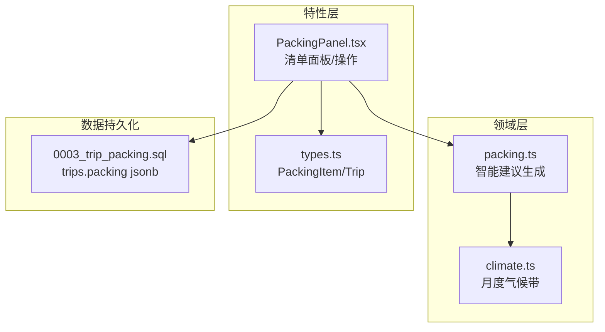
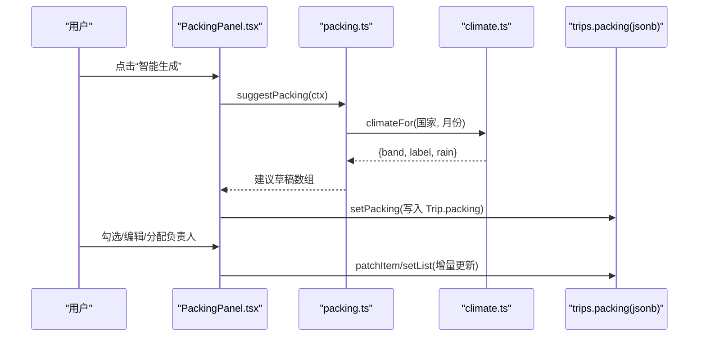
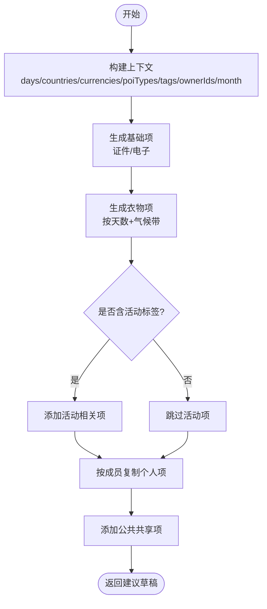
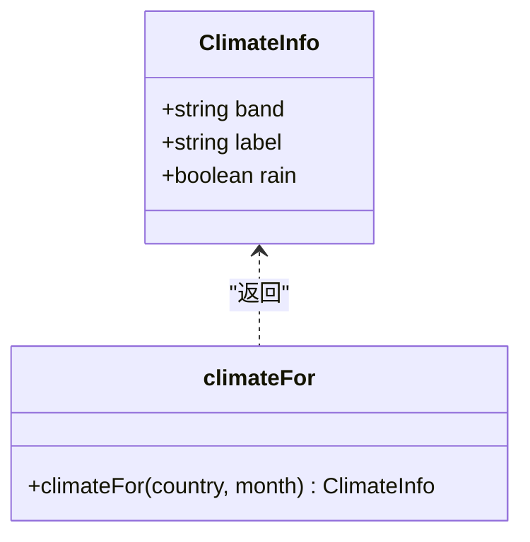
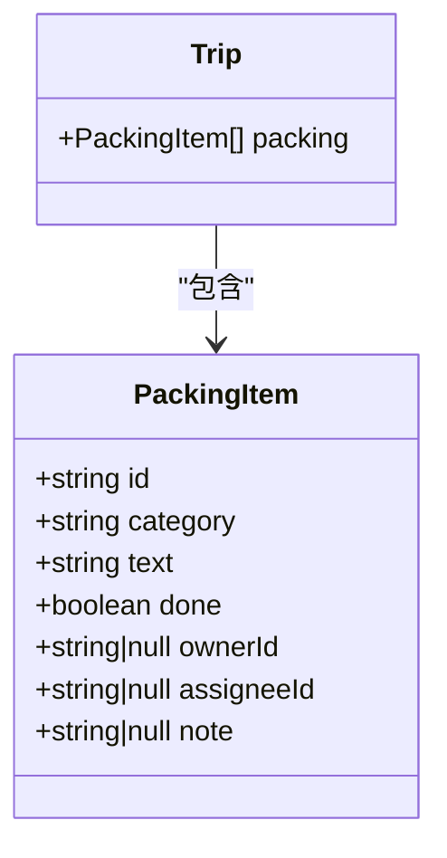
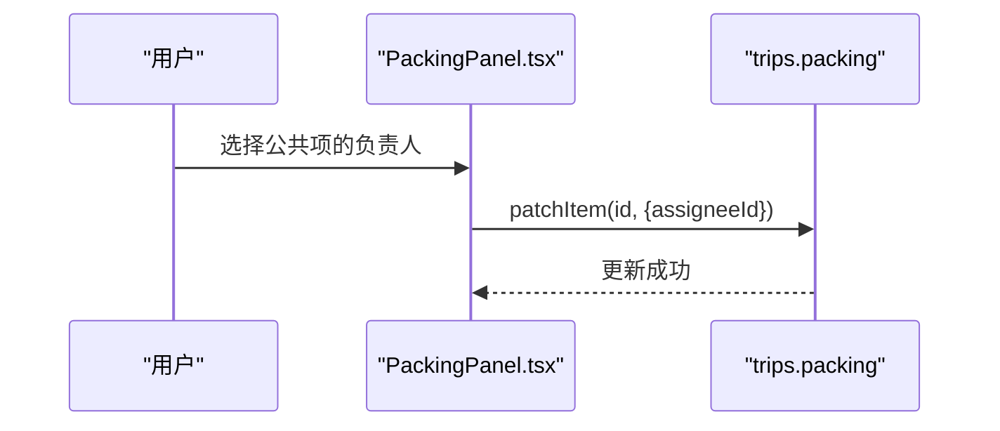
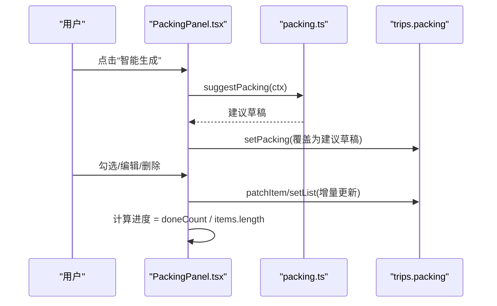
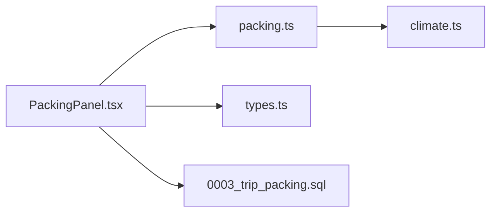

# 打包清单模块

<cite>
**本文引用的文件**
- [packing.ts](file://src/domain/trip/packing.ts)
- [climate.ts](file://src/domain/trip/climate.ts)
- [PackingPanel.tsx](file://src/features/trip/PackingPanel.tsx)
- [types.ts](file://src/data/types.ts)
- [packing.test.ts](file://src/domain/trip/packing.test.ts)
- [0003_trip_packing.sql](file://supabase/migrations/0003_trip_packing.sql)
</cite>

## 目录
1. [简介](#简介)
2. [项目结构](#项目结构)
3. [核心组件](#核心组件)
4. [架构总览](#架构总览)
5. [详细组件分析](#详细组件分析)
6. [依赖关系分析](#依赖关系分析)
7. [性能考量](#性能考量)
8. [故障排查指南](#故障排查指南)
9. [结论](#结论)
10. [附录](#附录)

## 简介
本模块提供“智能打包建议”的生成与管理能力：基于目的地国家、行程月份（气候带）、活动类型与标签，自动生成衣物、证件、电子、洗漱、药品等建议项；支持将个人物品按成员复制为每人一份，公共物品仅一份并指定负责人；提供勾选完成状态与进度统计；数据离线优先存储于行程对象中，云端通过迁移列持久化。

## 项目结构
打包清单涉及领域层（算法与数据结构）与特性层（UI 交互与状态管理），以及数据库迁移定义。

图表来源
- [packing.ts:1-164](file://src/domain/trip/packing.ts#L1-L164)
- [climate.ts:1-60](file://src/domain/trip/climate.ts#L1-L60)
- [PackingPanel.tsx:1-367](file://src/features/trip/PackingPanel.tsx#L1-L367)
- [types.ts:95-127](file://src/data/types.ts#L95-L127)
- [0003_trip_packing.sql:1-20](file://supabase/migrations/0003_trip_packing.sql#L1-L20)

章节来源
- [packing.ts:1-164](file://src/domain/trip/packing.ts#L1-L164)
- [PackingPanel.tsx:1-367](file://src/features/trip/PackingPanel.tsx#L1-L367)
- [types.ts:95-127](file://src/data/types.ts#L95-L127)
- [0003_trip_packing.sql:1-20](file://supabase/migrations/0003_trip_packing.sql#L1-L20)

## 核心组件
- 智能建议生成器：根据行程上下文（天数、国家、货币、POI 类型/标签、成员列表、出发月份）输出建议草稿，区分个人与公共项。
- 气候带推导：基于国家与月份返回温度带与是否多雨，用于衣物分层建议。
- 清单面板：加载/生成/编辑/删除清单项，设置归属与负责人，显示分类视图与完成进度。
- 数据类型：定义 PackingItem、Trip.packing 字段及成员信息，支撑前后端一致的数据契约。

章节来源
- [packing.ts:17-45](file://src/domain/trip/packing.ts#L17-L45)
- [climate.ts:11-17](file://src/domain/trip/climate.ts#L11-L17)
- [PackingPanel.tsx:39-149](file://src/features/trip/PackingPanel.tsx#L39-L149)
- [types.ts:95-127](file://src/data/types.ts#L95-L127)

## 架构总览
打包清单由“领域算法 + UI 面板 + 数据模型”构成。UI 从行程聚合数据中构建建议上下文，调用领域函数生成建议草稿，再写入 Trip.packing；用户可手动增删改、勾选完成、分配负责人；云端通过 trips.packing 列持久化。

图表来源
- [PackingPanel.tsx:135-149](file://src/features/trip/PackingPanel.tsx#L135-L149)
- [packing.ts:79-163](file://src/domain/trip/packing.ts#L79-L163)
- [climate.ts:50-59](file://src/domain/trip/climate.ts#L50-L59)
- [0003_trip_packing.sql:13-16](file://supabase/migrations/0003_trip_packing.sql#L13-L16)

## 详细组件分析

### 智能打包建议算法
- 输入上下文：行程天数、目的地国家集合、货币集合、已排 POI 的类型与标签、成员 id 列表、出发月份。
- 基础项：证件/票据（护照、签证、机票酒店确认单、保险、当地现金+信用卡）、电子（手机充电器、充电宝、相机存储卡）。
- 衣物：按天数计算内衣/袜子数量；上衣/外套文案依据气候带；寒冷时增加保暖鞋/厚袜；多雨时增加折叠伞/防水鞋；始终包含舒适步行鞋。
- 活动相关：海滩/游泳/海岛/湖泊→泳衣、沙滩巾；徒步/山地/步道/徒步/alps→徒步鞋、水壶。
- 公共共享项：转换插头（按目的地插座类型准备）；多人时生成“共用物品分摊”提示项。
- 个人 vs 公共：个人项按 ownerIds 复制为每人一份；公共项 ownerId=null，只需一份。

图表来源
- [packing.ts:79-163](file://src/domain/trip/packing.ts#L79-L163)

章节来源
- [packing.ts:79-163](file://src/domain/trip/packing.ts#L79-L163)
- [packing.test.ts:13-101](file://src/domain/trip/packing.test.ts#L13-L101)

### 气候带推导
- 以国家代码与月份查询内置月度气候带表，返回温度带与是否多雨，用于衣物分层与雨具建议。
- 未知国家默认温带（法国）；月份越界取模处理。

图表来源
- [climate.ts:11-17](file://src/domain/trip/climate.ts#L11-L17)
- [climate.ts:50-59](file://src/domain/trip/climate.ts#L50-L59)

章节来源
- [climate.ts:1-60](file://src/domain/trip/climate.ts#L1-L60)

### 物品分类管理与个人/公共区分
- 分类枚举：证件/票据、衣物、洗漱、电子、药品、其他。
- 个人物品：ownerId=成员id，按成员复制；在“我的”视角下仅显示本人项。
- 公共物品：ownerId=null，只有一份；可通过 assigneeId 指定谁带。

图表来源
- [types.ts:95-127](file://src/data/types.ts#L95-L127)

章节来源
- [types.ts:95-127](file://src/data/types.ts#L95-L127)
- [PackingPanel.tsx:151-170](file://src/features/trip/PackingPanel.tsx#L151-L170)

### 责任分配机制
- 公共物品可在面板中选择“谁带”，对应 assigneeId 指向某成员 id；未指定则为 null。
- 个人物品无需分配（自己负责），面板隐藏分配控件。

图表来源
- [PackingPanel.tsx:336-350](file://src/features/trip/PackingPanel.tsx#L336-L350)

章节来源
- [PackingPanel.tsx:336-350](file://src/features/trip/PackingPanel.tsx#L336-L350)

### 生成清单、管理状态与跟踪进度
- 生成清单：点击“智能生成”调用 suggestPacking，将建议草稿写入 Trip.packing。
- 管理状态：勾选 done 表示完成；可编辑文本、删除条目。
- 进度跟踪：统计 done 数量与总数，计算百分比并在顶部展示。

图表来源
- [PackingPanel.tsx:135-149](file://src/features/trip/PackingPanel.tsx#L135-L149)
- [PackingPanel.tsx:172-173](file://src/features/trip/PackingPanel.tsx#L172-L173)

章节来源
- [PackingPanel.tsx:135-173](file://src/features/trip/PackingPanel.tsx#L135-L173)

### 自定义规则配置与扩展机制
- 当前实现以硬编码规则为主：活动标签映射到具体物品；气候带映射到衣物文案。
- 可扩展点：
  - 新增活动标签到物品映射：在 suggestPacking 中添加新的条件分支。
  - 新增气候带或国家：在 climate.ts 中补充国家数据与月份映射。
  - 新增分类或公共项：在 PACK_CATS 与 suggestPacking 末尾追加。
- 注意：扩展需保持向后兼容，避免破坏现有测试与 UI 渲染逻辑。

章节来源
- [packing.ts:131-140](file://src/domain/trip/packing.ts#L131-L140)
- [climate.ts:32-48](file://src/domain/trip/climate.ts#L32-L48)

### 常见问题解决：重复与分类混乱
- 重复问题：
  - 建议生成不会主动去重；若多次点击“智能生成”可能产生重复项。建议在 UI 层生成前清空或合并已有清单，或在生成后执行去重策略（如按 text 去重）。
  - 个人项按成员复制，属于预期行为；若出现同一成员的多份相同项，检查是否多次生成或手动重复添加。
- 分类混乱：
  - 使用固定分类枚举，确保 UI 下拉选项与领域分类一致。
  - 新增分类需在 PACK_CATS 与 UI 下拉同步更新。
- 公共项未分配：
  - 提醒用户在“公共物品”区域为关键物品指定负责人，避免遗漏。

章节来源
- [packing.test.ts:39-61](file://src/domain/trip/packing.test.ts#L39-L61)
- [PackingPanel.tsx:238-267](file://src/features/trip/PackingPanel.tsx#L238-L267)

## 依赖关系分析
- 领域层依赖：
  - packing.ts 依赖 climate.ts 获取气候带信息。
- 特性层依赖：
  - PackingPanel.tsx 依赖 packing.ts 生成建议，依赖 types.ts 的数据结构，依赖数据库迁移定义的 trips.packing 列进行持久化。
- 外部依赖：
  - 世界库索引用于推导国家与货币、POI 类型与标签（在 PackingPanel 中构建 ctx）。

图表来源
- [packing.ts:12-13](file://src/domain/trip/packing.ts#L12-L13)
- [PackingPanel.tsx:14-18](file://src/features/trip/PackingPanel.tsx#L14-L18)
- [0003_trip_packing.sql:13-16](file://supabase/migrations/0003_trip_packing.sql#L13-L16)

章节来源
- [packing.ts:12-13](file://src/domain/trip/packing.ts#L12-L13)
- [PackingPanel.tsx:14-18](file://src/features/trip/PackingPanel.tsx#L14-L18)

## 性能考量
- 建议生成是纯函数，时间复杂度与输入规模线性相关（成员数、POI 标签集合），开销极低。
- UI 层使用 useMemo 缓存上下文与分区结果，避免重复计算。
- 本地优先读写 Trip.packing，减少网络往返；云端仅在必要时同步。

[本节为通用指导，不直接分析具体文件]

## 故障排查指南
- 无法生成建议：
  - 检查是否已构建上下文（国家、货币、POI 类型/标签、成员列表、出发月份）。
  - 若无出发月份，衣物将退化为通用文案。
- 衣物建议不符合预期：
  - 确认国家代码与月份是否正确；未知国家默认温带。
  - 检查气候带数据是否覆盖目标国家。
- 公共物品无人负责：
  - 在面板中为公共项选择负责人；未指定时显示“未指定”。
- 重复项：
  - 避免多次点击“智能生成”；如需保留历史建议，请在生成前备份或采用合并策略。
- 云端读取为空：
  - 确认 trips.packing 列存在且非空；旧行已迁移为默认空数组。

章节来源
- [PackingPanel.tsx:58-93](file://src/features/trip/PackingPanel.tsx#L58-L93)
- [climate.ts:50-59](file://src/domain/trip/climate.ts#L50-L59)
- [0003_trip_packing.sql:13-16](file://supabase/migrations/0003_trip_packing.sql#L13-L16)

## 结论
打包清单模块通过“领域算法 + UI 面板 + 数据模型”的组合，实现了基于目的地气候、活动类型与季节的智能建议生成，支持个人与公共物品的清晰区分与责任分配，并提供直观的完成进度跟踪。扩展点明确，便于后续增加新规则与新分类。

[本节为总结性内容，不直接分析具体文件]

## 附录
- 单元测试覆盖要点：
  - 基础项始终存在（证件、电子、衣物、洗漱、药品）。
  - 货币影响现金项文案。
  - 活动标签推导泳衣、沙滩巾、徒步鞋、水壶。
  - 个人项按成员复制，公共项仅一份。
  - 单人模式个人项归 null 且不复制。
  - 天数最少按 1 计。
  - 无月份时退回通用文案。

章节来源
- [packing.test.ts:13-101](file://src/domain/trip/packing.test.ts#L13-L101)