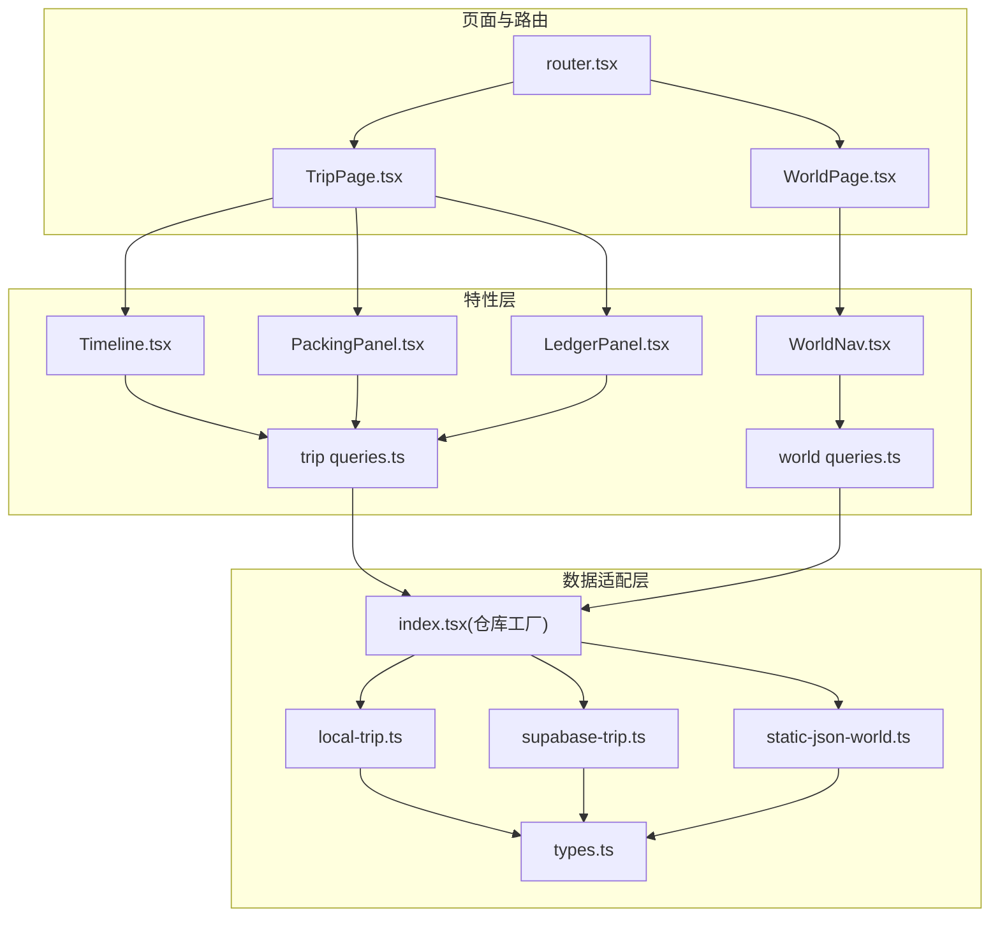
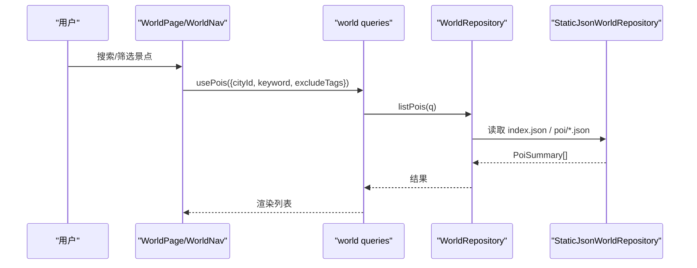
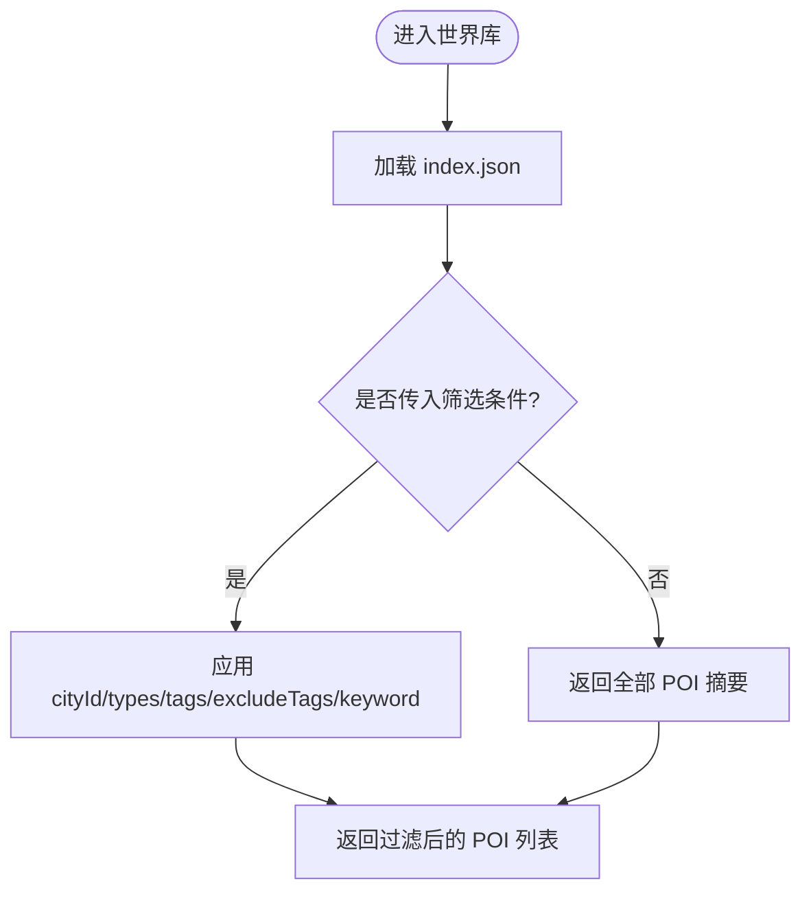
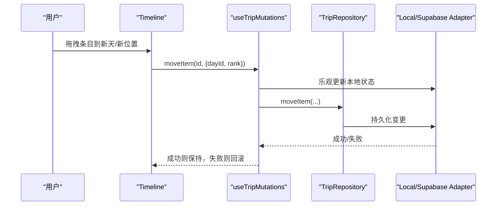
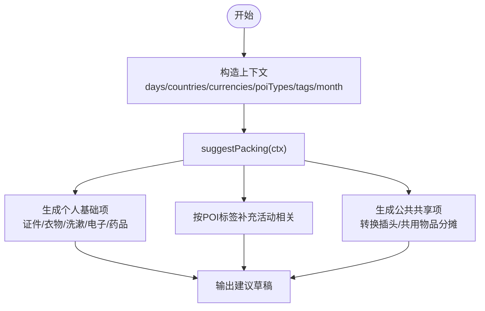
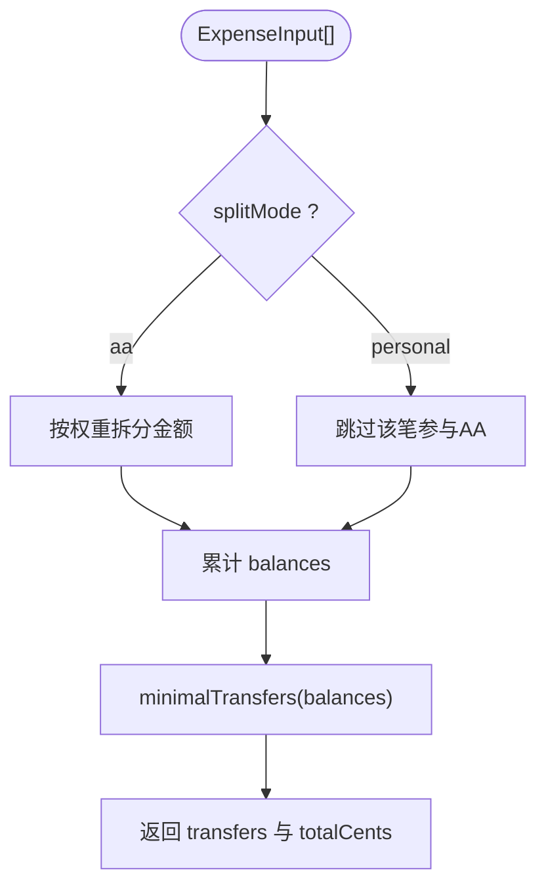
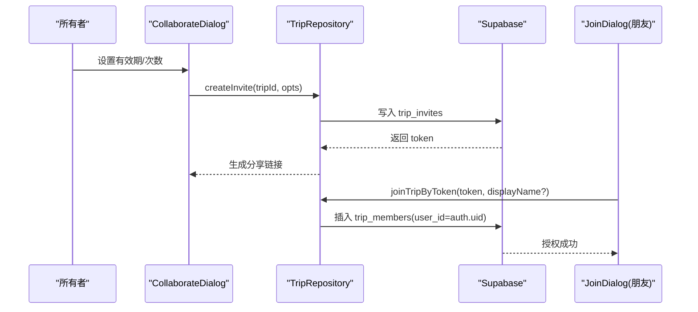
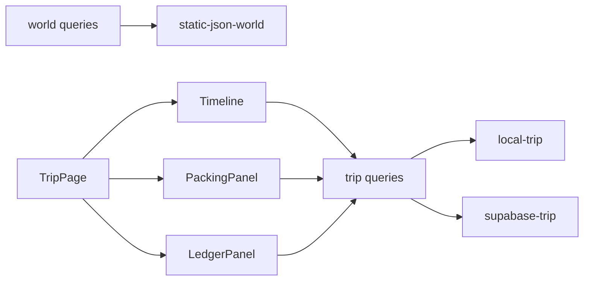

# 核心功能模块

<cite>
**本文引用的文件**
- [src/data/index.tsx](file://src/data/index.tsx)
- [src/data/types.ts](file://src/data/types.ts)
- [src/data/adapters/local-trip.ts](file://src/data/adapters/local-trip.ts)
- [src/data/adapters/supabase-trip.ts](file://src/data/adapters/supabase-trip.ts)
- [src/data/adapters/static-json-world.ts](file://src/data/adapters/static-json-world.ts)
- [src/features/world/queries.ts](file://src/features/world/queries.ts)
- [src/pages/WorldPage.tsx](file://src/pages/WorldPage.tsx)
- [src/features/world/WorldNav.tsx](file://src/features/world/WorldNav.tsx)
- [src/domain/trip/packing.ts](file://src/domain/trip/packing.ts)
- [src/features/trip/PackingPanel.tsx](file://src/features/trip/PackingPanel.tsx)
- [src/domain/expense/settle.ts](file://src/domain/expense/settle.ts)
- [src/features/expense/LedgerPanel.tsx](file://src/features/expense/LedgerPanel.tsx)
- [src/features/trip/Timeline.tsx](file://src/features/trip/Timeline.tsx)
- [src/features/trip/queries.ts](file://src/features/trip/queries.ts)
- [src/pages/TripPage.tsx](file://src/pages/TripPage.tsx)
- [src/app/router.tsx](file://src/app/router.tsx)
- [supabase/migrations/0001_init.sql](file://supabase/migrations/0001_init.sql)
- [supabase/migrations/0004_expense_split_mode.sql](file://supabase/migrations/0004_expense_split_mode.sql)
- [supabase/migrations/0005_trip_item_images.sql](file://supabase/migrations/0005_trip_item_images.sql)
- [index.html](file://index.html)
- [package.json](file://package.json)
- [src/app/AppShell.tsx](file://src/app/AppShell.tsx)
- [src/pages/TripsPage.tsx](file://src/pages/TripsPage.tsx)
- [src/features/trip/ChatPanel.tsx](file://src/features/trip/ChatPanel.tsx)
- [src/domain/world/schema.ts](file://src/domain/world/schema.ts)
</cite>

## 更新摘要
**所做更改**
- 更新了应用品牌标识，从"玩无一失"改为"Tour the World"
- 更新了用户界面中的品牌名称和标语
- 更新了项目描述和元数据
- 保持了原有的功能模块结构和实现细节

## 目录
1. [简介](#简介)
2. [项目结构](#项目结构)
3. [核心组件](#核心组件)
4. [架构总览](#架构总览)
5. [详细组件分析](#详细组件分析)
6. [依赖关系分析](#依赖关系分析)
7. [性能考量](#性能考量)
8. [故障排查指南](#故障排查指南)
9. [结论](#结论)
10. [附录](#附录)

## 简介
本文件面向 **Tour the World** 的核心功能模块，系统性说明行程管理、世界库浏览、费用管理、打包清单、团队协作五大模块的实现细节、接口定义与使用模式；解释模块间的依赖与协作方式；提供配置项、参数说明与返回值格式；并给出常见问题定位与性能优化建议。文档以代码级事实为依据，确保读者既能快速上手，也能深入理解实现。

**更新** 应用已完成品牌重塑，现统一使用 "Tour the World" 作为应用程序身份标识，口号为 "Plan. Pack. Go."

## 项目结构
应用采用"领域层 + 数据适配层 + 特性页面/面板"的分层组织：
- 领域层（domain）：纯函数与类型，如费用结算、打包建议、日期工具等，不依赖 UI 与存储。
- 数据适配层（data/adapters）：通过统一接口 TripRepository / WorldRepository 屏蔽后端差异（本地 localStorage 或 Supabase），世界库为静态 JSON。
- 特性层（features）：按业务域组织 UI 与查询封装（行程时间线、打包、账本、世界库导航）。
- 页面层（pages）：路由入口与双端分流（桌面工作台 vs 移动端）。
- 路由（app/router.tsx）：Hash 路由兼容 GitHub Pages。

**图表来源**
- [src/app/router.tsx:17-30](file://src/app/router.tsx#L17-L30)
- [src/pages/TripPage.tsx:41-140](file://src/pages/TripPage.tsx#L41-L140)
- [src/pages/WorldPage.tsx:58-77](file://src/pages/WorldPage.tsx#L58-L77)
- [src/features/trip/Timeline.tsx:496-702](file://src/features/trip/Timeline.tsx#L496-L702)
- [src/features/trip/PackingPanel.tsx:39-170](file://src/features/trip/PackingPanel.tsx#L39-L170)
- [src/features/expense/LedgerPanel.tsx:59-217](file://src/features/expense/LedgerPanel.tsx#L59-L217)
- [src/features/world/WorldNav.tsx:73-172](file://src/features/world/WorldNav.tsx#L73-L172)
- [src/features/trip/queries.ts:1-48](file://src/features/trip/queries.ts#L1-L48)
- [src/features/world/queries.ts:1-61](file://src/features/world/queries.ts#L1-L61)
- [src/data/index.tsx:21-54](file://src/data/index.tsx#L21-L54)
- [src/data/adapters/local-trip.ts:67-115](file://src/data/adapters/local-trip.ts#L67-L115)
- [src/data/adapters/supabase-trip.ts:168-198](file://src/data/adapters/supabase-trip.ts#L168-L198)
- [src/data/adapters/static-json-world.ts:48-122](file://src/data/adapters/static-json-world.ts#L48-L122)
- [src/data/types.ts:12-79](file://src/data/types.ts#L12-L79)

**章节来源**
- [src/app/router.tsx:17-30](file://src/app/router.tsx#L17-L30)
- [src/pages/TripPage.tsx:41-140](file://src/pages/TripPage.tsx#L41-L140)
- [src/data/index.tsx:21-54](file://src/data/index.tsx#L21-L54)

## 核心组件
- 仓库工厂与注入：统一暴露 world/trip 两个仓库，根据是否配置 Supabase 自动选择本地或云端实现，视图层仅依赖接口。
- 世界库适配器：静态 JSON 索引与资源，带 memo 缓存与 schema 校验降级，支持按城市/标签/关键词筛选。
- 行程仓库：本地与云端两套实现，字段与迁移表对齐，提供 bundle 一次性读取能力，减少往返。
- 特性查询封装：基于 React Query 的 useTripBundle/usePois 等，提供缓存与失效策略。
- 领域计算：费用结算（整数分、权重分摊、最少转账）、打包建议（气候带+POI标签推导）。

**章节来源**
- [src/data/index.tsx:21-54](file://src/data/index.tsx#L21-L54)
- [src/data/adapters/static-json-world.ts:48-122](file://src/data/adapters/static-json-world.ts#L48-L122)
- [src/data/adapters/local-trip.ts:67-115](file://src/data/adapters/local-trip.ts#L67-L115)
- [src/data/adapters/supabase-trip.ts:168-198](file://src/data/adapters/supabase-trip.ts#L168-L198)
- [src/features/world/queries.ts:1-61](file://src/features/world/queries.ts#L1-L61)
- [src/features/trip/queries.ts:1-48](file://src/features/trip/queries.ts#L1-L48)
- [src/domain/expense/settle.ts:1-141](file://src/domain/expense/settle.ts#L1-L141)
- [src/domain/trip/packing.ts:1-164](file://src/domain/trip/packing.ts#L1-L164)

## 架构总览
应用通过 Repository 抽象将"世界库"和"行程数据"解耦，UI 只依赖类型与接口；世界库为只读静态资源，行程数据在本地与云端之间可切换；费用与打包逻辑下沉到领域层，保证可测试性与一致性。

**图表来源**
- [src/pages/WorldPage.tsx:58-77](file://src/pages/WorldPage.tsx#L58-L77)
- [src/features/world/WorldNav.tsx:73-172](file://src/features/world/WorldNav.tsx#L73-L172)
- [src/features/world/queries.ts:13-20](file://src/features/world/queries.ts#L13-L20)
- [src/data/adapters/static-json-world.ts:78-122](file://src/data/adapters/static-json-world.ts#L78-L122)

## 详细组件分析

### 世界库浏览
- 能力
  - 国家/城市/景点三级浏览，支持按城市、类型、标签、排除标签、关键词检索。
  - 静态 JSON 索引与资源，构建产物由 scripts/build-index.ts 生成。
  - 内存级 memo 缓存，schema 校验失败时降级提示。
- 关键接口
  - WorldRepository.getIndex/listCountries/getCountry/listCities/getCity/listPois/getPoi/getPois/search
  - 查询封装：useWorldIndex/usePois/usePoi/usePoiMap/useCity/useCountry
- 使用模式
  - 独立浏览页：WorldPage 直接消费 world queries。
  - 工作台左侧导航：WorldNav 复用同一组查询，结合工作区状态进行过滤与拖拽添加。

**图表来源**
- [src/data/adapters/static-json-world.ts:78-122](file://src/data/adapters/static-json-world.ts#L78-L122)
- [src/features/world/queries.ts:13-20](file://src/features/world/queries.ts#L13-L20)

**章节来源**
- [src/data/adapters/static-json-world.ts:48-122](file://src/data/adapters/static-json-world.ts#L48-L122)
- [src/features/world/queries.ts:1-61](file://src/features/world/queries.ts#L1-L61)
- [src/pages/WorldPage.tsx:58-77](file://src/pages/WorldPage.tsx#L58-L77)
- [src/features/world/WorldNav.tsx:73-172](file://src/features/world/WorldNav.tsx#L73-L172)

### 行程管理（时间线与条目）
- 能力
  - 天维度卡片，条目可拖拽排序与跨天移动；候选池暂存未排期条目。
  - 乐观更新：拖动即生效，网络失败回滚。
  - 体检：闭馆/超载/折返/预约死线等规则检查。
- 关键类型与接口
  - TripItem/TripDay/TripBundle、add/update/move/remove 等。
  - 查询封装：useTripBundle/useTripMutations。
- 使用模式
  - Timeline 负责交互与展示，调用 mutations 完成写操作。
  - 地图视图懒加载，仅在切换到地图时下载。

**图表来源**
- [src/features/trip/Timeline.tsx:496-702](file://src/features/trip/Timeline.tsx#L496-L702)
- [src/features/trip/queries.ts:93-135](file://src/features/trip/queries.ts#L93-L135)
- [src/data/adapters/local-trip.ts:198-231](file://src/data/adapters/local-trip.ts#L198-L231)
- [src/data/adapters/supabase-trip.ts:310-338](file://src/data/adapters/supabase-trip.ts#L310-L338)

**章节来源**
- [src/features/trip/Timeline.tsx:496-702](file://src/features/trip/Timeline.tsx#L496-L702)
- [src/features/trip/queries.ts:93-135](file://src/features/trip/queries.ts#L93-L135)
- [src/data/adapters/local-trip.ts:198-231](file://src/data/adapters/local-trip.ts#L198-L231)
- [src/data/adapters/supabase-trip.ts:310-338](file://src/data/adapters/supabase-trip.ts#L310-L338)

### 打包清单（智能生成与协作）
- 能力
  - 依据行程天数、目的地国家/货币、已排 POI 的类型/标签、成员人数，生成建议草稿。
  - 个人行李按成员复制，公共物品只一份并可指定负责人。
  - 离线优先：清单随 Trip.packing 读写，不依赖后端。
- 关键接口
  - suggestPacking(PackingContext) -> PackingSuggestion[]
  - PackingPanel 负责 UI 与增量编辑，调用 mutations 保存。
- 使用模式
  - 点击"智能生成"填充建议，再人工勾选/调整归属与备注。

**图表来源**
- [src/domain/trip/packing.ts:79-163](file://src/domain/trip/packing.ts#L79-L163)
- [src/features/trip/PackingPanel.tsx:39-170](file://src/features/trip/PackingPanel.tsx#L39-L170)

**章节来源**
- [src/domain/trip/packing.ts:1-164](file://src/domain/trip/packing.ts#L1-L164)
- [src/features/trip/PackingPanel.tsx:39-170](file://src/features/trip/PackingPanel.tsx#L39-L170)

### 费用管理（AA结算与个人自付）
- 能力
  - 所有金额以整数分计算，避免浮点误差。
  - 支持共同 AA 与个人自付两种 splitMode；个人自付不参与 AA 结算。
  - 权重分摊使用最大余数法，保证总和守恒。
  - 贪心算法生成最少转账次数方案。
- 关键接口
  - settle(expenses) -> SettlementResult{balances, transfers, totalCents}
  - LedgerPanel 负责录入、汇率换算、提交与展示。
- 使用模式
  - 输入每笔支出（含币种与 fxRate），前端折算到基准币种后交给 settle 计算。

**图表来源**
- [src/domain/expense/settle.ts:38-141](file://src/domain/expense/settle.ts#L38-L141)
- [src/features/expense/LedgerPanel.tsx:59-217](file://src/features/expense/LedgerPanel.tsx#L59-L217)

**章节来源**
- [src/domain/expense/settle.ts:1-141](file://src/domain/expense/settle.ts#L1-L141)
- [src/features/expense/LedgerPanel.tsx:59-217](file://src/features/expense/LedgerPanel.tsx#L59-L217)
- [supabase/migrations/0004_expense_split_mode.sql:1-8](file://supabase/migrations/0004_expense_split_mode.sql#L1-L8)

### 团队协作（邀请与加入）
- 能力
  - 所有者生成邀请链接（令牌），朋友凭令牌加入成为成员。
  - 本地模式不支持协作（抛出明确错误），云端模式走 Supabase 表与 RPC。
- 关键流程
  - CollaborateDialog 创建/撤销邀请，JoinDialog 凭 token 加入。
  - 成功后 RLS 授予读改权限，bundle 刷新可见。
- 数据库支撑
  - trip_invites/shares 表结构与约束。

**图表来源**
- [src/features/trip/CollaborateDialog.tsx:24-100](file://src/features/trip/CollaborateDialog.tsx#L24-L100)
- [src/features/trip/JoinDialog.tsx:1-25](file://src/features/trip/JoinDialog.tsx#L1-L25)
- [src/data/adapters/local-trip.ts:283-295](file://src/data/adapters/local-trip.ts#L283-L295)
- [supabase/migrations/0001_init.sql:244-267](file://supabase/migrations/0001_init.sql#L244-L267)

**章节来源**
- [src/features/trip/CollaborateDialog.tsx:24-100](file://src/features/trip/CollaborateDialog.tsx#L24-L100)
- [src/features/trip/JoinDialog.tsx:1-25](file://src/features/trip/JoinDialog.tsx#L1-L25)
- [src/data/adapters/local-trip.ts:283-295](file://src/data/adapters/local-trip.ts#L283-L295)
- [supabase/migrations/0001_init.sql:244-267](file://supabase/migrations/0001_init.sql#L244-L267)

## 依赖关系分析
- 世界库依赖：静态 JSON 索引与资源，queries 层做缓存与过滤。
- 行程依赖：
  - 本地：localStorage 整包读写，适合开发演示。
  - 云端：Supabase RPC 返回 bundle，包含 trip/members/days/items/votes/tickets/expenses。
- 领域依赖：费用与打包逻辑不依赖存储，便于单测与复用。
- 页面依赖：TripPage 作为双端分流与标签切换入口，按需懒加载各面板。

**图表来源**
- [src/features/world/queries.ts:1-61](file://src/features/world/queries.ts#L1-L61)
- [src/features/trip/queries.ts:1-48](file://src/features/trip/queries.ts#L1-L48)
- [src/data/adapters/static-json-world.ts:48-122](file://src/data/adapters/static-json-world.ts#L48-L122)
- [src/data/adapters/local-trip.ts:67-115](file://src/data/adapters/local-trip.ts#L67-L115)
- [src/data/adapters/supabase-trip.ts:168-198](file://src/data/adapters/supabase-trip.ts#L168-L198)
- [src/pages/TripPage.tsx:41-140](file://src/pages/TripPage.tsx#L41-L140)

**章节来源**
- [src/features/world/queries.ts:1-61](file://src/features/world/queries.ts#L1-L61)
- [src/features/trip/queries.ts:1-48](file://src/features/trip/queries.ts#L1-L48)
- [src/data/adapters/static-json-world.ts:48-122](file://src/data/adapters/static-json-world.ts#L48-L122)
- [src/data/adapters/local-trip.ts:67-115](file://src/data/adapters/local-trip.ts#L67-L115)
- [src/data/adapters/supabase-trip.ts:168-198](file://src/data/adapters/supabase-trip.ts#L168-L198)
- [src/pages/TripPage.tsx:41-140](file://src/pages/TripPage.tsx#L41-L140)

## 性能考量
- 世界库
  - 静态资源内存缓存（memo），查询永不过期（staleTime/gcTime 无穷大）。
  - 单个 POI 结构异常时降级，避免白屏。
- 行程
  - 使用 bundle 一次性拉取多类实体，减少多次往返。
  - 拖拽等高频交互采用乐观更新，提升响应性。
  - 地图与部分面板懒加载，降低首屏体积。
- 费用
  - 整数分运算避免累积误差；权重分摊保证总额守恒。
- 存储
  - 本地档整包读写，注意并发写覆盖风险（应用层串行处理）。

## 故障排查指南
- 世界库资源缺失
  - 现象：访问世界库报错提示先运行内容构建。
  - 处理：执行 npm run content:build 重新生成 index.json 与资源。
  - 参考路径：[src/data/adapters/static-json-world.ts:21-24](file://src/data/adapters/static-json-world.ts#L21-L24)
- 协作功能不可用
  - 现象：本地模式下尝试邀请/加入抛错。
  - 处理：登录云端或使用支持协作的环境。
  - 参考路径：[src/data/adapters/local-trip.ts:283-295](file://src/data/adapters/local-trip.ts#L283-L295)
- 移除成员失败
  - 现象：外键约束阻止删除（仍有账单关联）。
  - 处理：先修改或删除相关账单记录。
  - 参考路径：[src/features/trip/CollaborateDialog.tsx:67-82](file://src/features/trip/CollaborateDialog.tsx#L67-L82)
- 图片附件列不存在（云端）
  - 现象：云端环境缺少 images 列导致写入失败。
  - 处理：在 Supabase 控制台执行迁移脚本添加列。
  - 参考路径：[supabase/migrations/0005_trip_item_images.sql:1-11](file://supabase/migrations/0005_trip_item_images.sql#L1-L11)

**章节来源**
- [src/data/adapters/static-json-world.ts:21-24](file://src/data/adapters/static-json-world.ts#L21-L24)
- [src/data/adapters/local-trip.ts:283-295](file://src/data/adapters/local-trip.ts#L283-L295)
- [src/features/trip/CollaborateDialog.tsx:67-82](file://src/features/trip/CollaborateDialog.tsx#L67-L82)
- [supabase/migrations/0005_trip_item_images.sql:1-11](file://supabase/migrations/0005_trip_item_images.sql#L1-L11)

## 结论
**Tour the World** 通过清晰的领域分层与仓库抽象，实现了世界库浏览、行程编排、费用结算、打包清单与团队协作的解耦与协同。世界库以静态资源保障稳定与高性能；行程数据在本地与云端间无缝切换；费用与打包逻辑下沉至领域层，确保正确性与可测试性。整体架构兼顾了开发体验、线上性能与扩展性。

**更新** 应用已完成品牌重塑，统一使用 "Tour the World" 作为应用程序身份，口号为 "Plan. Pack. Go."，为用户提供更国际化的旅行规划体验。

## 附录

### 关键类型与接口速查
- 世界库
  - WorldRepository：getIndex/listCountries/getCountry/listCities/getCity/listPois/getPoi/getPois/search
  - 查询封装：useWorldIndex/usePois/usePoi/usePoiMap/useCity/useCountry
- 行程
  - TripRepository：listTrips/getBundle/createTrip/updateTrip/deleteTrip/addDay/updateDay/removeDay/addItem/updateItem/moveItem/removeItem/addMember/removeMember/createInvite/listInvites/revokeInvite/joinTripByToken/vote/upsertTicket/removeTicket/upsertExpense/removeExpense
  - 查询封装：useTrips/useTripBundle/useCreateTrip/useTripMutations
- 费用
  - ExpenseInput：id/amountCents/payerMemberId/splitMode/shares
  - SettlementResult：balances/transfers/totalCents
- 打包
  - PackingContext：days/countries/currencies/poiTypes/tags/ownerIds/month
  - PackingSuggestion：category/text/note/ownerId

**章节来源**
- [src/data/types.ts:12-79](file://src/data/types.ts#L12-L79)
- [src/data/types.ts:230-299](file://src/data/types.ts#L230-L299)
- [src/domain/expense/settle.ts:10-32](file://src/domain/expense/settle.ts#L10-L32)
- [src/domain/trip/packing.ts:17-45](file://src/domain/trip/packing.ts#L17-L45)

### 数据库表与字段要点
- trips：id/owner_id/title/start_date/end_date/base_currency/preferences/source_trip_id/source_label/status 等
- trip_days：id/trip_id/date/city_id/note
- trip_items：id/trip_id/day_id/kind/poi_id/custom_title/transport_mode/from_city_id/to_city_id/rank/slot_start/slot_end/status/note/address/images
- expenses：新增 split_mode 区分 AA 与个人自付
- trip_invites/shares：邀请令牌与发布快照

**章节来源**
- [supabase/migrations/0001_init.sql:48-107](file://supabase/migrations/0001_init.sql#L48-L107)
- [supabase/migrations/0001_init.sql:244-267](file://supabase/migrations/0001_init.sql#L244-L267)
- [supabase/migrations/0004_expense_split_mode.sql:1-8](file://supabase/migrations/0004_expense_split_mode.sql#L1-L8)
- [supabase/migrations/0005_trip_item_images.sql:1-11](file://supabase/migrations/0005_trip_item_images.sql#L1-L11)

### 品牌标识更新详情

#### 应用程序标题和描述
- **HTML 标题**: Tour the World
- **描述**: Tour the World —— 把散落各处的攻略串成一份可执行的行程
- **启动画面**: Tour the World · 加载中

#### 用户界面品牌元素
- **应用外壳**: 显示 "Tour the World" 品牌名和 "Plan. Pack. Go." 标语
- **行程页面**: 英雄区域显示 "Tour the World" 品牌标识
- **AI 助手**: 系统提示中引用 "Tour the World" 旅行行程助手

#### 项目配置
- **包名称**: wanwuyishi (内部标识保持不变)
- **包描述**: Tour the World —— 可执行的旅行作战台
- **世界库 Schema**: 注释中标注 "Tour the World · 世界库 schema"

**更新来源**
- [index.html:10-15](file://index.html#L10-L15)
- [package.json:6](file://package.json#L6)
- [src/app/AppShell.tsx:49-50](file://src/app/AppShell.tsx#L49-L50)
- [src/pages/TripsPage.tsx:57](file://src/pages/TripsPage.tsx#L57)
- [src/features/trip/ChatPanel.tsx:423](file://src/features/trip/ChatPanel.tsx#L423)
- [src/domain/world/schema.ts:2](file://src/domain/world/schema.ts#L2)