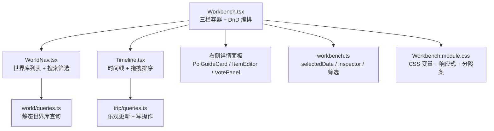
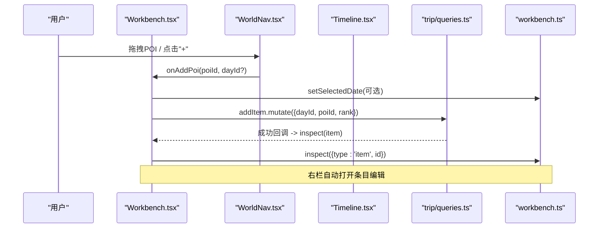
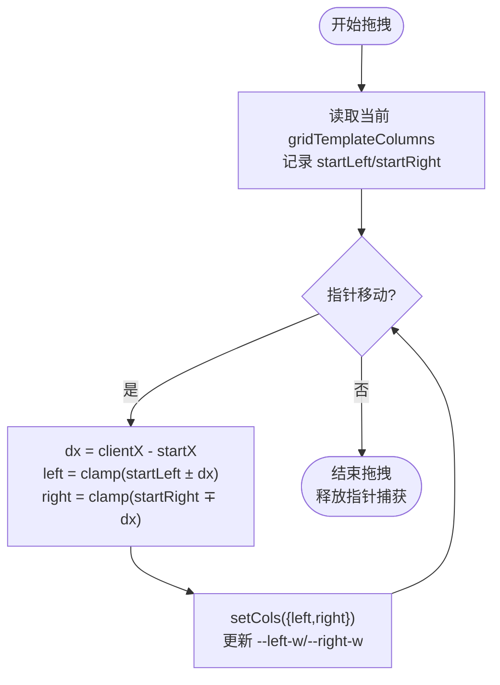
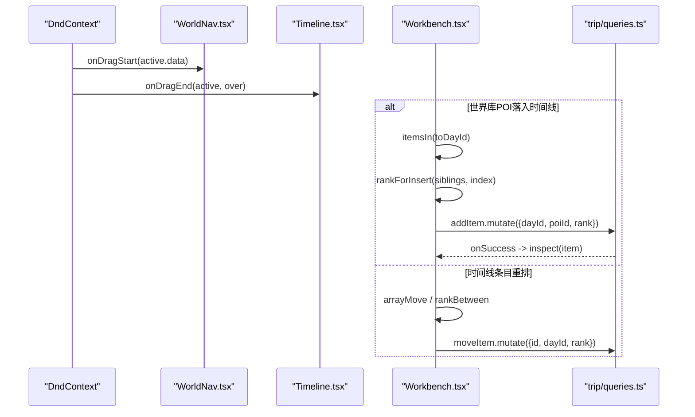
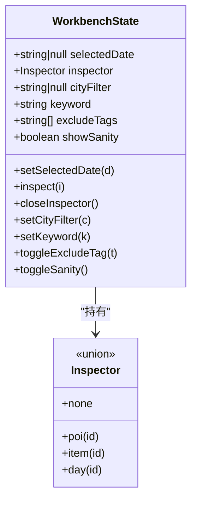
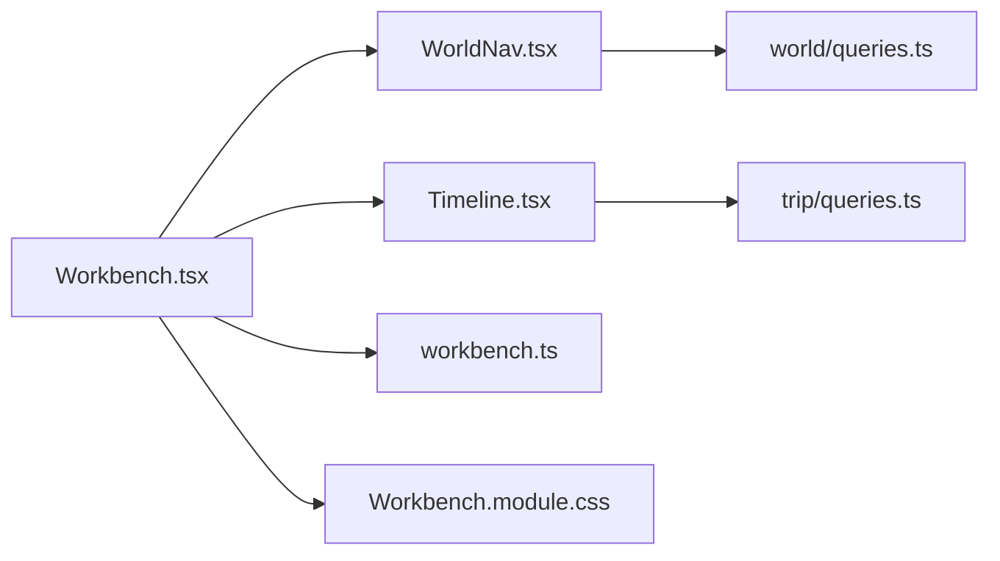

# 三栏工作台布局

<cite>
**本文引用的文件**
- [Workbench.tsx](file://src/features/trip/Workbench.tsx)
- [Workbench.module.css](file://src/features/trip/Workbench.module.css)
- [Timeline.tsx](file://src/features/trip/Timeline.tsx)
- [queries.ts（行程）](file://src/features/trip/queries.ts)
- [WorldNav.tsx](file://src/features/world/WorldNav.tsx)
- [queries.ts（世界库）](file://src/features/world/queries.ts)
- [workbench.ts（状态管理）](file://src/store/workbench.ts)
</cite>

## 目录
1. [简介](#简介)
2. [项目结构](#项目结构)
3. [核心组件](#核心组件)
4. [架构总览](#架构总览)
5. [详细组件分析](#详细组件分析)
6. [依赖关系分析](#依赖关系分析)
7. [性能考量](#性能考量)
8. [故障排查指南](#故障排查指南)
9. [结论](#结论)
10. [附录：使用示例与最佳实践](#附录使用示例与最佳实践)

## 简介
本文件为“三栏工作台”的完整技术文档，围绕左栏世界库、中栏时间线、右栏详情面板的架构设计与交互逻辑展开。重点说明可调节宽度的实现机制（CSS 变量驱动、拖拽分隔条、最小最大宽度限制）、状态管理模式（selectedDate、inspector 状态、useWorkbench store），以及响应式设计与性能优化策略。

## 项目结构
三栏工作台由以下关键文件组成：
- 布局容器与工作流编排：Workbench.tsx
- 样式与响应式：Workbench.module.css
- 中栏时间线编辑区：Timeline.tsx
- 左栏世界库导航：WorldNav.tsx
- 状态管理：store/workbench.ts
- 数据层：features/trip/queries.ts、features/world/queries.ts

图表来源
- [Workbench.tsx:49-414](file://src/features/trip/Workbench.tsx#L49-L414)
- [WorldNav.tsx:73-254](file://src/features/world/WorldNav.tsx#L73-L254)
- [Timeline.tsx:496-702](file://src/features/trip/Timeline.tsx#L496-L702)
- [workbench.ts:1-77](file://src/store/workbench.ts#L1-L77)
- [queries.ts（世界库）:1-62](file://src/features/world/queries.ts#L1-L62)
- [queries.ts（行程）:1-236](file://src/features/trip/queries.ts#L1-L236)
- [Workbench.module.css:1-305](file://src/features/trip/Workbench.module.css#L1-L305)

章节来源
- [Workbench.tsx:49-414](file://src/features/trip/Workbench.tsx#L49-L414)
- [Workbench.module.css:1-305](file://src/features/trip/Workbench.module.css#L1-L305)

## 核心组件
- 工作台容器 Workbench：负责整体布局、左右分隔条拖拽、全局拖拽上下文（DndContext）、将世界库点位与时间线条目统一纳入同一套放置目标，并在落位后计算 rank 写入后端。
- 世界库 WorldNav：提供国家/城市层级浏览、关键词搜索、快速排除标签、已加入标记；支持拖拽 POI 到时间线或点击“+”直接加入当前选中日期。
- 时间线 Timeline：一天一卡，卡片内条目可排序，卡片间可互拖；未排期的进入候选池；所有写操作走乐观更新，保证拖拽流畅。
- 详情面板：根据 inspector 类型动态渲染景点导览卡、条目编辑器或投票面板；头部标题随选择变化。
- 状态管理 workbench store：集中管理 selectedDate、inspector、筛选条件等跨栏共享状态，并持久化到 sessionStorage。

章节来源
- [Workbench.tsx:49-414](file://src/features/trip/Workbench.tsx#L49-L414)
- [WorldNav.tsx:73-254](file://src/features/world/WorldNav.tsx#L73-L254)
- [Timeline.tsx:496-702](file://src/features/trip/Timeline.tsx#L496-L702)
- [workbench.ts:1-77](file://src/store/workbench.ts#L1-L77)

## 架构总览
三栏布局通过 CSS Grid + CSS 变量实现，左右两侧宽度由 --left-w 和 --right-w 控制，中间自适应。分隔条通过 Pointer 事件监听进行实时调整，并受最小/最大宽度约束。拖拽体系基于 @dnd-kit，Workbench 作为唯一 DndContext，世界库与时间线共享 droppable 目标，落位后统一换算 fractional rank 写入。

图表来源
- [Workbench.tsx:158-168](file://src/features/trip/Workbench.tsx#L158-L168)
- [WorldNav.tsx:127-131](file://src/features/world/WorldNav.tsx#L127-L131)
- [queries.ts（行程）:88-91](file://src/features/trip/queries.ts#L88-L91)
- [workbench.ts:59-64](file://src/store/workbench.ts#L59-L64)

## 详细组件分析

### 可调节宽度机制（CSS 变量 + 拖拽分隔条 + 最小最大宽度）
- 网格列定义使用 CSS 变量：grid-template-columns: var(--left-w) minmax(0, 1fr) var(--right-w)。
- 拖拽开始时记录初始 left/right 轨道宽度与鼠标起始位置；移动时按方向计算新宽度并 clamp 到最小/最大值；结束时释放指针捕获。
- 分隔条绝对定位，left 值分别用 --left-w 和 calc(100% - --right-w) 驱动，确保与网格列同步。
- 响应式媒体查询在不同断点覆盖 --left-w / --right-w，使窄屏收窄两侧、超宽屏渐进加宽，避免中间时间线被过度挤压。

图表来源
- [Workbench.tsx:67-101](file://src/features/trip/Workbench.tsx#L67-L101)
- [Workbench.module.css:1-305](file://src/features/trip/Workbench.module.css#L1-L305)

章节来源
- [Workbench.tsx:57-101](file://src/features/trip/Workbench.tsx#L57-L101)
- [Workbench.module.css:1-91](file://src/features/trip/Workbench.module.css#L1-L91)

### 拖拽与落位逻辑（世界库 → 时间线）
- 世界库 POI 行使用 useDraggable，携带 data { kind: 'world-poi', poiId }。
- 时间线 DayCard 与 PoolCard 使用 useDroppable，携带 data { kind: 'day', dayId }；ItemRow 使用 SortableContext 支持同日内排序。
- 在 onDragEnd 中，根据 active/over 的 data 判断落点：若落在条目上则插入其前，否则追加末尾；跨天移动时重新计算 rank；同天内移动使用 arrayMove 并计算 rankBetween。
- 落位后调用 mut.addItem 或 mut.moveItem，成功后通过 inspect 打开右栏编辑。

图表来源
- [Workbench.tsx:170-222](file://src/features/trip/Workbench.tsx#L170-L222)
- [Timeline.tsx:323-432](file://src/features/trip/Timeline.tsx#L323-L432)
- [queries.ts（行程）:88-119](file://src/features/trip/queries.ts#L88-L119)

章节来源
- [Workbench.tsx:170-222](file://src/features/trip/Workbench.tsx#L170-L222)
- [Timeline.tsx:323-432](file://src/features/trip/Timeline.tsx#L323-L432)
- [queries.ts（行程）:88-119](file://src/features/trip/queries.ts#L88-L119)

### 详情面板多态与状态管理（inspector + selectedDate）
- inspector 为多态类型：none/poi/item/day，决定右栏渲染内容。
- selectedDate 用于确定“+”按钮默认加入的日期，也影响世界库添加行为。
- 所有状态变更通过 useWorkbench 的 setter 完成，并持久化 selectedDate、cityFilter、excludeTags 到 sessionStorage。

图表来源
- [workbench.ts:1-77](file://src/store/workbench.ts#L1-L77)

章节来源
- [workbench.ts:1-77](file://src/store/workbench.ts#L1-L77)
- [Workbench.tsx:227-305](file://src/features/trip/Workbench.tsx#L227-L305)

### 世界库导航与筛选
- 支持按国家/城市折叠、关键词搜索、快速排除标签（如宗教场所、观景、雪山）。
- 当选中某城市筛选时，自动展开所属国家，提升可用性。
- 已加入行程的 POI 显示“已加”，点击“+”改为打开导览卡，避免重复添加。

章节来源
- [WorldNav.tsx:73-254](file://src/features/world/WorldNav.tsx#L73-L254)
- [queries.ts（世界库）:1-62](file://src/features/world/queries.ts#L1-L62)

### 时间线编辑与体检提示
- 一天一卡，卡片头显示日期、星期、统计信息（点数、时长、交通段数），并可设置城市。
- 条目支持状态切换、投票、备注、地址复制、图片缩略图预览。
- 顶部“体检”按钮展示错误/警告数量，issues 来自 domain 的 sanityCheck，按日聚合展示。

章节来源
- [Timeline.tsx:496-702](file://src/features/trip/Timeline.tsx#L496-L702)
- [Workbench.tsx:122-150](file://src/features/trip/Workbench.tsx#L122-L150)

## 依赖关系分析
- Workbench 依赖：
  - DnD 能力：@dnd-kit/core/sortable
  - 数据：useTripBundle、useWorldIndex、usePoiMap、useTripMutations
  - 子组件：WorldNav、Timeline、PoiGuideCard、ItemEditor、VotePanel
  - 状态：useWorkbench（selectedDate、inspector）
- WorldNav 依赖：
  - 世界库查询：useWorldIndex、usePois
  - 状态：useWorkbench（cityFilter、keyword、excludeTags）
- Timeline 依赖：
  - 拖拽：useDroppable、SortableContext、useSortable
  - 数据：bundle、poiMap、issues、cities、mut
  - 状态：useWorkbench（showSanity、inspect）

图表来源
- [Workbench.tsx:49-414](file://src/features/trip/Workbench.tsx#L49-L414)
- [WorldNav.tsx:73-254](file://src/features/world/WorldNav.tsx#L73-L254)
- [Timeline.tsx:496-702](file://src/features/trip/Timeline.tsx#L496-L702)
- [workbench.ts:1-77](file://src/store/workbench.ts#L1-L77)
- [queries.ts（世界库）:1-62](file://src/features/world/queries.ts#L1-L62)
- [queries.ts（行程）:1-236](file://src/features/trip/queries.ts#L1-L236)
- [Workbench.module.css:1-305](file://src/features/trip/Workbench.module.css#L1-L305)

章节来源
- [Workbench.tsx:49-414](file://src/features/trip/Workbench.tsx#L49-L414)
- [WorldNav.tsx:73-254](file://src/features/world/WorldNav.tsx#L73-L254)
- [Timeline.tsx:496-702](file://src/features/trip/Timeline.tsx#L496-L702)
- [workbench.ts:1-77](file://src/store/workbench.ts#L1-L77)
- [queries.ts（世界库）:1-62](file://src/features/world/queries.ts#L1-L62)
- [queries.ts（行程）:1-236](file://src/features/trip/queries.ts#L1-L236)
- [Workbench.module.css:1-305](file://src/features/trip/Workbench.module.css#L1-L305)

## 性能考量
- 拖拽体验：
  - 使用 @dnd-kit 的 closestCorners 碰撞检测与 SortableContext 垂直排序策略，减少重排开销。
  - 所有写操作采用乐观更新（onMutate 立即修改本地缓存），网络失败时回滚，保证拖拽不卡顿。
- 数据加载：
  - 世界库为静态资源，staleTime/gcTime 设为 Infinity，避免重复请求。
  - 行程 bundle 设置合理 staleTime，减少频繁刷新带来的抖动。
- 渲染优化：
  - 地图模块懒加载（lazy + Suspense），仅在切换到地图视图时下载代码块。
  - 使用 useMemo 对 poiIds、addedPoiIds、itemsByDay 等派生数据进行缓存。
- 样式与布局：
  - 通过 CSS 变量控制列宽，避免 JS 频繁操作 DOM 布局；媒体查询覆盖变量，保持响应式一致性。
  - 分隔条使用绝对定位与 pointer events，避免阻塞滚动与拖拽。

[本节为通用性能建议，无需特定文件引用]

## 故障排查指南
- 拖拽无响应或错位：
  - 检查 DndContext 是否包裹了所有可拖拽/可放置元素；确认 sensors 配置（PointerSensor 激活距离）。
  - 确认 droppable 的 data 包含正确的 dayId，以便 onDragEnd 正确识别落点。
- 宽度拖拽异常：
  - 确认 gridRef 引用存在且指向 .grid 容器；检查 --left-w/--right-w 是否正确注入 inline style。
  - 检查最小/最大宽度常量是否合理，避免极端缩放导致布局崩溃。
- 状态不同步：
  - 确认 selectedDate 与 inspector 通过 useWorkbench 统一管理；注意 sessionStorage 持久化字段范围。
  - 若右栏未更新，检查 onSuccess 中是否调用了 inspect({ type: 'item', id })。
- 数据不一致：
  - 检查 trip/queries.ts 中的 optimistic/rollback/settle 流程；确认 onError 能正确恢复缓存。
  - 世界库查询 key 是否包含过滤参数，避免缓存命中错误结果。

章节来源
- [Workbench.tsx:152-222](file://src/features/trip/Workbench.tsx#L152-L222)
- [Workbench.tsx:67-101](file://src/features/trip/Workbench.tsx#L67-L101)
- [workbench.ts:27-49](file://src/store/workbench.ts#L27-L49)
- [queries.ts（行程）:41-63](file://src/features/trip/queries.ts#L41-L63)
- [queries.ts（世界库）:8-19](file://src/features/world/queries.ts#L8-L19)

## 结论
三栏工作台通过“CSS 变量 + 拖拽分隔条”实现灵活的宽度调节，结合 @dnd-kit 的统一拖拽上下文，将世界库与时间线无缝衔接。状态管理集中在 useWorkbench，确保 selectedDate 与 inspector 在多组件间一致。配合乐观更新与懒加载，整体交互流畅、可扩展性强。响应式设计通过媒体查询覆盖 CSS 变量，兼顾不同屏幕尺寸下的可读性与操作性。

[本节为总结性内容，无需特定文件引用]

## 附录：使用示例与最佳实践
- 初始化工作台
  - 在页面中引入 Workbench 组件并传入 tripId；确保 DndContext 已包裹整个工作区。
  - 参考路径：[Workbench.tsx:49-55](file://src/features/trip/Workbench.tsx#L49-L55)
- 处理窗口调整事件
  - 无需额外监听 resize；通过 CSS 媒体查询覆盖 --left-w/--right-w 即可自适应。
  - 参考路径：[Workbench.module.css:10-44](file://src/features/trip/Workbench.module.css#L10-L44)
- 管理面板状态
  - 使用 useWorkbench 的 setSelectedDate 与 inspect/closeInspector 控制选中日期与详情面板。
  - 参考路径：[workbench.ts:59-64](file://src/store/workbench.ts#L59-L64)
- 添加 POI 到时间线
  - 从 WorldNav 触发 onAddPoi，Workbench 计算 rank 并调用 mut.addItem，成功后自动打开编辑。
  - 参考路径：[WorldNav.tsx:127-131](file://src/features/world/WorldNav.tsx#L127-L131)、[Workbench.tsx:158-168](file://src/features/trip/Workbench.tsx#L158-L168)、[queries.ts（行程）:88-91](file://src/features/trip/queries.ts#L88-L91)
- 拖拽排序与跨天移动
  - 在同日内使用 SortableContext 排序；跨天时重新计算 rank；使用 arrayMove 与 rankBetween 保证顺序稳定。
  - 参考路径：[Workbench.tsx:203-221](file://src/features/trip/Workbench.tsx#L203-L221)、[Timeline.tsx:414-427](file://src/features/trip/Timeline.tsx#L414-L427)
- 响应式与性能最佳实践
  - 使用 CSS 变量控制布局，避免 JS 频繁操作 DOM；地图模块懒加载；世界库查询永不过期。
  - 参考路径：[Workbench.module.css:1-44](file://src/features/trip/Workbench.module.css#L1-L44)、[Timeline.tsx:46-47](file://src/features/trip/Timeline.tsx#L46-L47)、[queries.ts（世界库）:5-19](file://src/features/world/queries.ts#L5-L19)