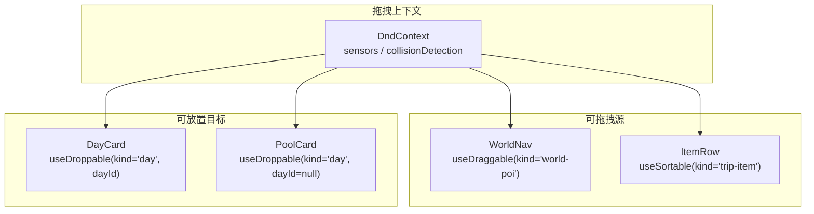
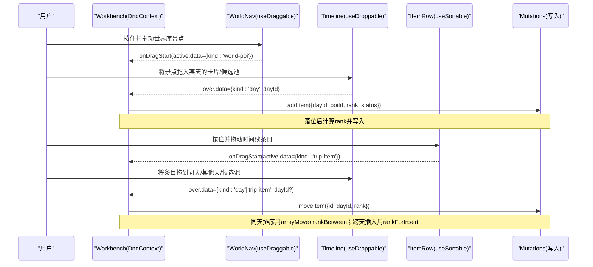
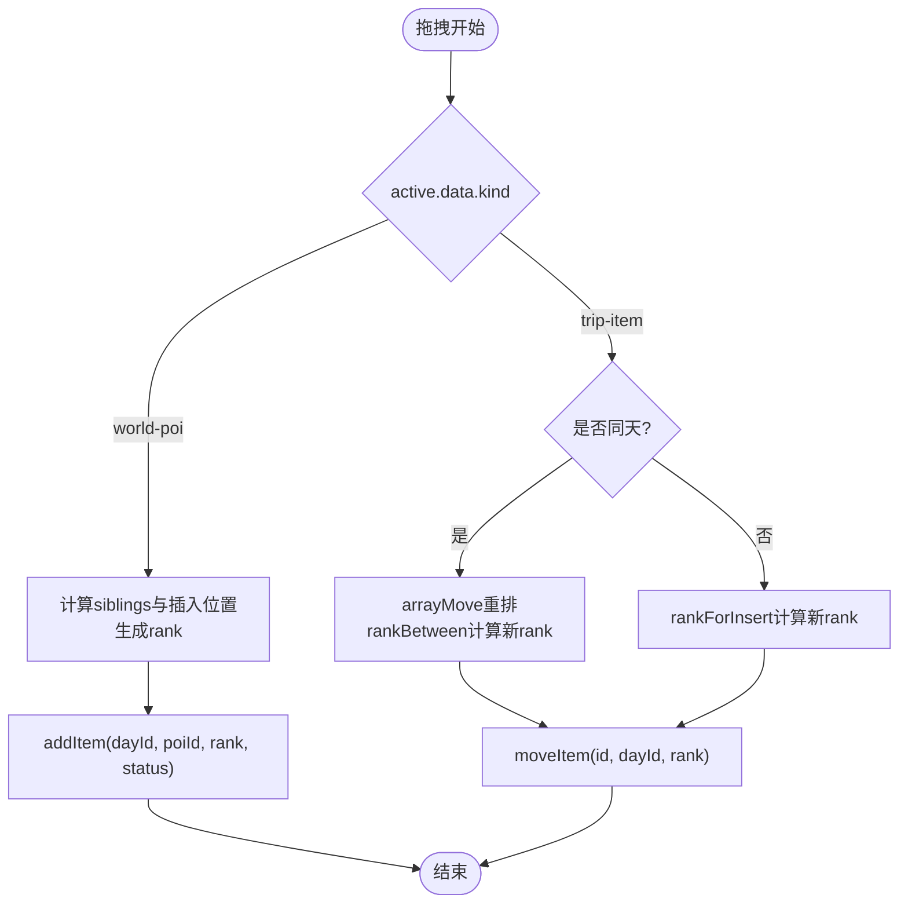
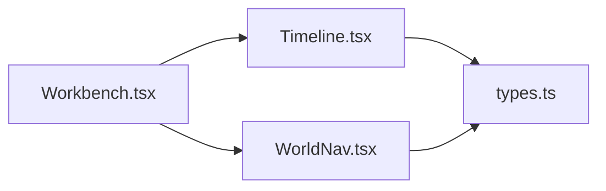

# DnD上下文配置

<cite>
**本文引用的文件**
- [Workbench.tsx](file://src/features/trip/Workbench.tsx)
- [Timeline.tsx](file://src/features/trip/Timeline.tsx)
- [WorldNav.tsx](file://src/features/world/WorldNav.tsx)
- [types.ts](file://src/data/types.ts)
</cite>

## 目录
1. [简介](#简介)
2. [项目结构](#项目结构)
3. [核心组件](#核心组件)
4. [架构总览](#架构总览)
5. [详细组件分析](#详细组件分析)
6. [依赖关系分析](#依赖关系分析)
7. [性能考量](#性能考量)
8. [故障排查指南](#故障排查指南)
9. [结论](#结论)
10. [附录：配置示例与最佳实践](#附录配置示例与最佳实践)

## 简介
本文件聚焦于应用中的拖拽上下文（DndContext）配置，覆盖传感器设置、碰撞检测策略、拖拽约束条件，以及 world-poi、trip-item、day 三类数据类型的拖拽行为与特殊处理。文档同时给出错误处理与异常情况的应对方案，并提供可直接落地的配置示例与最佳实践。

## 项目结构
本项目在“行程工作台”中统一使用一个 DndContext 管理跨区域的拖拽：左侧世界库的景点可被拖入中间时间线的“天卡片”或“候选池”，中间时间线内的条目可在同一天内排序，也可在不同天之间互拖。所有写操作通过乐观更新即时生效。

图表来源
- [Workbench.tsx:240-246](file://src/features/trip/Workbench.tsx#L240-L246)
- [WorldNav.tsx:27-30](file://src/features/world/WorldNav.tsx#L27-L30)
- [Timeline.tsx:94-97](file://src/features/trip/Timeline.tsx#L94-L97)
- [Timeline.tsx:344-347](file://src/features/trip/Timeline.tsx#L344-L347)
- [Timeline.tsx:451-454](file://src/features/trip/Timeline.tsx#L451-L454)

章节来源
- [Workbench.tsx:1-414](file://src/features/trip/Workbench.tsx#L1-L414)
- [Timeline.tsx:1-702](file://src/features/trip/Timeline.tsx#L1-L702)
- [WorldNav.tsx:1-266](file://src/features/world/WorldNav.tsx#L1-L266)

## 核心组件
- DndContext：全局拖拽容器，集中配置传感器、碰撞检测、生命周期回调。
- PointerSensor：指针传感器，启用距离阈值触发拖拽，避免误触。
- closestCorners：基于最近角点的碰撞检测算法，适合列表/卡片布局。
- useDraggable/useSortable/useDroppable：分别用于世界库景点、时间线条目、天卡片/候选池的可拖拽/可排序/可放置能力。
- DragOverlay：自定义拖拽时的悬浮层显示。

章节来源
- [Workbench.tsx:7-16](file://src/features/trip/Workbench.tsx#L7-L16)
- [Workbench.tsx:152](file://src/features/trip/Workbench.tsx#L152)
- [Workbench.tsx:240-246](file://src/features/trip/Workbench.tsx#L240-L246)
- [Timeline.tsx:8-10](file://src/features/trip/Timeline.tsx#L8-L10)
- [WorldNav.tsx:1](file://src/features/world/WorldNav.tsx#L1)

## 架构总览
下图展示了从拖拽开始到落地的完整调用链，包括不同数据类型（world-poi、trip-item、day）的处理分支。

图表来源
- [Workbench.tsx:170-222](file://src/features/trip/Workbench.tsx#L170-L222)
- [Timeline.tsx:94-97](file://src/features/trip/Timeline.tsx#L94-L97)
- [Timeline.tsx:344-347](file://src/features/trip/Timeline.tsx#L344-L347)
- [Timeline.tsx:451-454](file://src/features/trip/Timeline.tsx#L451-L454)

## 详细组件分析

### DndContext 配置要点
- 传感器：仅启用 PointerSensor，并设置 activationConstraint.distance=4，减少误触。
- 碰撞检测：使用 closestCorners，适配卡片/列表布局。
- 生命周期：
  - onDragStart：根据 active.data.kind 区分 world-poi 与 trip-item，准备悬浮层标签。
  - onDragEnd：根据 active/over 的 data 判断落点类型，计算 rank 并执行对应写入。
  - onDragCancel：清理悬浮层状态。
- 悬浮层：使用 DragOverlay 展示当前拖拽项的文本标签。

章节来源
- [Workbench.tsx:152](file://src/features/trip/Workbench.tsx#L152)
- [Workbench.tsx:170-222](file://src/features/trip/Workbench.tsx#L170-L222)
- [Workbench.tsx:240-246](file://src/features/trip/Workbench.tsx#L240-L246)
- [Workbench.tsx:408-410](file://src/features/trip/Workbench.tsx#L408-L410)

### 传感器设置（PointerSensor）
- 仅使用 PointerSensor，未引入 KeyboardSensor。
- 通过 distance=4 的激活阈值，避免轻微移动即触发拖拽，提升交互稳定性。
- 若未来需要键盘导航支持，可在此处追加 KeyboardSensor，但需确保焦点管理与事件冲突处理。

章节来源
- [Workbench.tsx:152](file://src/features/trip/Workbench.tsx#L152)

### 碰撞检测策略（closestCorners）
- 采用 closestCorners，适合卡片网格与垂直列表混合场景。
- 该策略以元素角点距离判定最接近目标，能较好识别“拖到空白区域”和“拖到条目上”的差异。

章节来源
- [Workbench.tsx:242](file://src/features/trip/Workbench.tsx#L242)

### 拖拽约束条件
- 无显式 drag 约束（如只允许在同一天内移动），通过业务逻辑在 onDragEnd 中控制：
  - world-poi 只能作为新增项加入目标天或候选池。
  - trip-item 可在同一天内排序，也可跨天移动。
- 通过 data.current 携带 kind 与 id/dayId 等元信息，驱动差异化处理。

章节来源
- [Workbench.tsx:182-222](file://src/features/trip/Workbench.tsx#L182-L222)

### 三种数据类型的特殊处理

#### world-poi（世界库景点）
- 来源：WorldNav 中使用 useDraggable，data 为 {kind:'world-poi', poiId}。
- 行为：拖入 DayCard 或 PoolCard 时，计算 siblings 列表与插入位置，生成 rank 并调用 addItem。
- 状态：若落入具体天则状态为 candidate，否则为 wishlist。

章节来源
- [WorldNav.tsx:27-30](file://src/features/world/WorldNav.tsx#L27-L30)
- [Workbench.tsx:195-200](file://src/features/trip/Workbench.tsx#L195-L200)

#### trip-item（时间线条目）
- 来源：Timeline 中 ItemRow 使用 useSortable，data 为 {kind:'trip-item', itemId, dayId}。
- 行为：
  - 同天排序：使用 arrayMove 重排，并通过 rankBetween 计算新 rank。
  - 跨天移动：根据目标天现有列表与插入索引，使用 rankForInsert 计算 rank。
- 写入：调用 moveItem 完成持久化。

章节来源
- [Timeline.tsx:94-97](file://src/features/trip/Timeline.tsx#L94-L97)
- [Workbench.tsx:203-221](file://src/features/trip/Workbench.tsx#L203-L221)

#### day（天卡片/候选池）
- 来源：Timeline 中 DayCard 与 PoolCard 使用 useDroppable，data 为 {kind:'day', dayId}（候选池 dayId=null）。
- 行为：作为统一的放置目标，承载 world-poi 的新增与 trip-item 的移动。
- 提示：isOver 用于高亮放置区域，提升视觉反馈。

章节来源
- [Timeline.tsx:344-347](file://src/features/trip/Timeline.tsx#L344-L347)
- [Timeline.tsx:451-454](file://src/features/trip/Timeline.tsx#L451-L454)

### 拖拽流程时序图（按数据类型）

图表来源
- [Workbench.tsx:195-221](file://src/features/trip/Workbench.tsx#L195-L221)

## 依赖关系分析
- Workbench 作为唯一 DndContext 提供者，协调 WorldNav 与 Timeline 的拖拽行为。
- Timeline 内部通过 SortableContext + verticalListSortingStrategy 实现条目排序。
- 数据写入统一通过 useTripMutations 提供的 mutate 方法，保证乐观更新一致性。
- 类型定义集中在 types.ts，明确 TripItem.kind 与 ItemStatus 等枚举值。

图表来源
- [Workbench.tsx:1-414](file://src/features/trip/Workbench.tsx#L1-L414)
- [Timeline.tsx:1-702](file://src/features/trip/Timeline.tsx#L1-L702)
- [WorldNav.tsx:1-266](file://src/features/world/WorldNav.tsx#L1-L266)
- [types.ts:159-187](file://src/data/types.ts#L159-L187)

章节来源
- [types.ts:83-93](file://src/data/types.ts#L83-L93)
- [types.ts:159-187](file://src/data/types.ts#L159-L187)

## 性能考量
- 仅启用必要的传感器，避免多余的事件监听开销。
- 使用 closestCorners 降低复杂布局下的碰撞计算成本。
- 排序与移动通过局部数组操作（arrayMove）与分数 rank 计算，避免全量重排。
- 悬浮层仅渲染轻量文本，避免昂贵重绘。

[本节为通用指导，不直接分析具体文件]

## 故障排查指南
- 拖拽未触发：检查 PointerSensor 的 activationConstraint.distance 是否过大；确认元素未被 pointer-events:none 拦截。
- 碰撞不准确：确认 DOM 层级与尺寸正确；必要时调整碰撞检测策略或增加间距。
- 重复添加：确保已加入的景点在左栏标记“已加”，点击“+”改为打开导览卡而非重复添加。
- 排序错乱：检查同天排序是否正确使用 arrayMove 与 rankBetween；跨天移动是否正确计算 rankForInsert。
- 状态不一致：确认 onDragCancel 会清理悬浮层状态；onDragEnd 中先清空再处理逻辑。

章节来源
- [Workbench.tsx:170-222](file://src/features/trip/Workbench.tsx#L170-L222)
- [WorldNav.tsx:127-131](file://src/features/world/WorldNav.tsx#L127-L131)

## 结论
本项目的 DnD 上下文以单一 DndContext 统一管理，结合 PointerSensor 与 closestCorners 提供稳定且直观的拖拽体验。通过对 world-poi、trip-item、day 三类数据的差异化处理，实现了跨区域添加、同天排序与跨天移动的完整工作流。配合乐观更新与清晰的错误处理，整体交互流畅且易于维护。

[本节为总结性内容，不直接分析具体文件]

## 附录：配置示例与最佳实践

### 基础配置清单
- 传感器：仅启用 PointerSensor，distance=4。
- 碰撞检测：closestCorners。
- 数据标识：每个可拖拽/可放置元素通过 data.current 携带 kind 与 id/dayId。
- 悬浮层：DragOverlay 仅渲染轻量文本，避免重绘。

章节来源
- [Workbench.tsx:152](file://src/features/trip/Workbench.tsx#L152)
- [Workbench.tsx:240-246](file://src/features/trip/Workbench.tsx#L240-L246)
- [Workbench.tsx:408-410](file://src/features/trip/Workbench.tsx#L408-L410)

### 不同类型的数据配置要点
- world-poi：
  - 使用 useDraggable，data={kind:'world-poi', poiId}。
  - 落点为 day 或 pool 时，计算 rank 并调用 addItem。
- trip-item：
  - 使用 useSortable，data={kind:'trip-item', itemId, dayId}。
  - 同天排序用 arrayMove+rankBetween；跨天移动用 rankForInsert。
- day：
  - 使用 useDroppable，data={kind:'day', dayId}（候选池 dayId=null）。
  - 作为统一放置目标，提供 isOver 高亮反馈。

章节来源
- [WorldNav.tsx:27-30](file://src/features/world/WorldNav.tsx#L27-L30)
- [Timeline.tsx:94-97](file://src/features/trip/Timeline.tsx#L94-L97)
- [Timeline.tsx:344-347](file://src/features/trip/Timeline.tsx#L344-L347)
- [Timeline.tsx:451-454](file://src/features/trip/Timeline.tsx#L451-L454)
- [Workbench.tsx:195-221](file://src/features/trip/Workbench.tsx#L195-L221)

### 最佳实践
- 保持单一 DndContext，避免多上下文导致的冲突。
- 使用稳定的 id 与 data 标识，便于 in-flight 状态追踪。
- 对敏感操作（如删除）增加二次确认；对批量操作进行防抖。
- 在 onDragCancel 中清理临时状态，防止 UI 残留。
- 对复杂布局优先选择 closestCorners，必要时自定义碰撞检测函数。

[本节为通用指导，不直接分析具体文件]