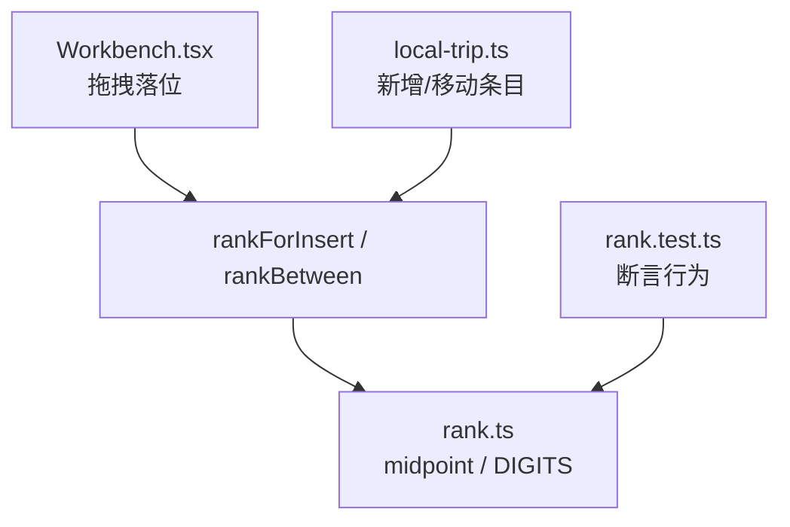
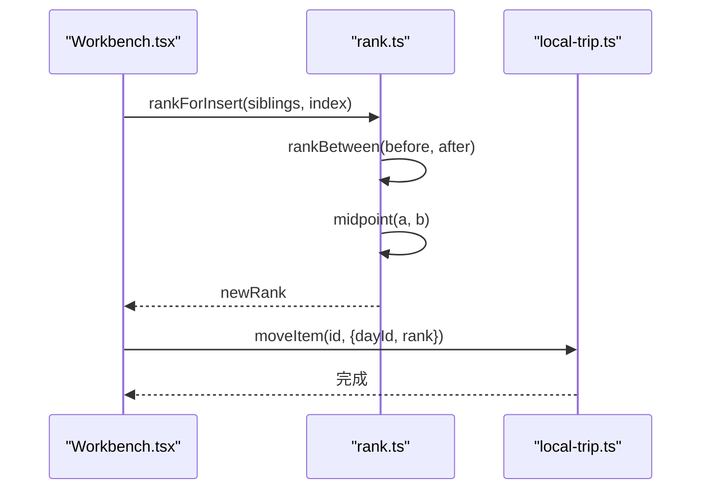
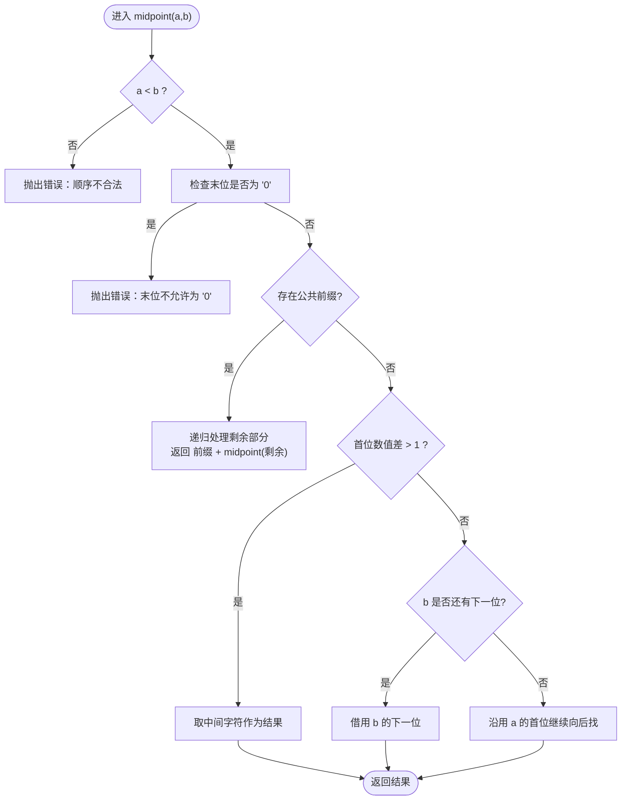
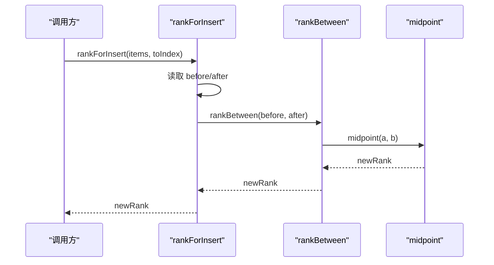
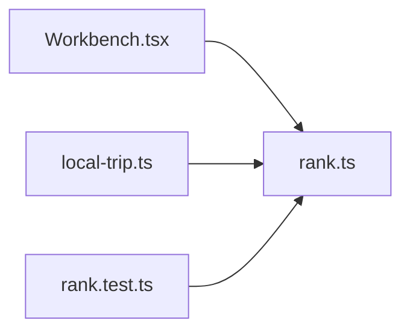

# 分数序排序算法

<cite>
**本文引用的文件**
- [src/domain/trip/rank.ts](file://src/domain/trip/rank.ts)
- [src/domain/trip/rank.test.ts](file://src/domain/trip/rank.test.ts)
- [src/features/trip/Workbench.tsx](file://src/features/trip/Workbench.tsx)
- [src/data/adapters/local-trip.ts](file://src/data/adapters/local-trip.ts)
</cite>

## 目录
1. [简介](#简介)
2. [项目结构](#项目结构)
3. [核心组件](#核心组件)
4. [架构总览](#架构总览)
5. [详细组件分析](#详细组件分析)
6. [依赖关系分析](#依赖关系分析)
7. [性能与复杂度](#性能与复杂度)
8. [故障排查指南](#故障排查指南)
9. [结论](#结论)
10. [附录：使用示例](#附录使用示例)

## 简介
本文件围绕“分数序（Fractional Indexing）”排序键的完整实现进行说明。该方案将 rank 视为省略了“0.”的 base62 小数，通过计算两个 rank 的中点来插入新条目，从而避免传统整数 position 在拖拽时引发的批量更新与并发冲突问题。它天然支持高并发、低写放大、可无限细分的排序键生成，非常适合多人协作场景下的拖拽排序。

## 项目结构
- 算法核心位于领域层：src/domain/trip/rank.ts
- 单元测试覆盖核心行为：src/domain/trip/rank.test.ts
- 前端交互中调用 rankForInsert/rankBetween：src/features/trip/Workbench.tsx
- 数据适配器在新增/移动条目时使用 initialRank/rankBetween：src/data/adapters/local-trip.ts

图表来源
- [src/features/trip/Workbench.tsx:180-221](file://src/features/trip/Workbench.tsx#L180-L221)
- [src/data/adapters/local-trip.ts:200-244](file://src/data/adapters/local-trip.ts#L200-L244)
- [src/domain/trip/rank.ts:1-91](file://src/domain/trip/rank.ts#L1-L91)
- [src/domain/trip/rank.test.ts:1-76](file://src/domain/trip/rank.test.ts#L1-L76)

章节来源
- [src/domain/trip/rank.ts:1-91](file://src/domain/trip/rank.ts#L1-L91)
- [src/domain/trip/rank.test.ts:1-76](file://src/domain/trip/rank.test.ts#L1-L76)
- [src/features/trip/Workbench.tsx:180-221](file://src/features/trip/Workbench.tsx#L180-L221)
- [src/data/adapters/local-trip.ts:200-244](file://src/data/adapters/local-trip.ts#L200-L244)

## 核心组件
- DIGITS 字符集：base62 数字系统，用于表示 rank 的每一位。
- midpoint(a, b)：计算 a 与 b 之间的一个合法 rank，保证 a < result < b。
- rankBetween(a, b)：封装 midpoint，允许 a/b 为 null 表示边界。
- initialRank()：生成列表初始 rank，便于向两端扩展。
- sequentialRanks(n)：生成 n 个严格递增的 rank，用于导入或复制场景。
- byRank(a, b)：基于字符串字典序的比较器。
- rankForInsert(items, toIndex)：根据目标位置前后邻居计算插入 rank。

章节来源
- [src/domain/trip/rank.ts:12-91](file://src/domain/trip/rank.ts#L12-L91)

## 架构总览
分数序的核心思想是将排序键看作“省略小数点前缀的 base62 小数”，通过不断取中点实现任意精度的插入。相比整数 position，分数序的优势在于：
- 只写一行：拖拽仅更新被拖动项的 rank，无需重排后续所有项。
- 抗并发：多人同时拖拽互不覆盖，因为每个操作都在各自区间内生成唯一 rank。
- 可扩展：理论上可以无限细分，直到达到字符串长度限制。

图表来源
- [src/features/trip/Workbench.tsx:180-221](file://src/features/trip/Workbench.tsx#L180-L221)
- [src/domain/trip/rank.ts:57-90](file://src/domain/trip/rank.ts#L57-L90)
- [src/data/adapters/local-trip.ts:242-244](file://src/data/adapters/local-trip.ts#L242-L244)

## 详细组件分析

### DIGITS 字符集设计
- 字符集包含 0-9、A-Z、a-z，共 62 个字符，作为 base62 的数位符号。
- 通过 digit(ch, fallback) 将字符映射为数值；遇到非法字符抛出错误，确保 rank 合法性。
- 选择 base62 的原因：
  - 更紧凑：相比 base10，相同精度下字符串更短。
  - 字典序可比：字符串比较等价于数值比较，简化排序逻辑。
  - 足够空间：在高并发插入场景下降低碰撞概率。

章节来源
- [src/domain/trip/rank.ts:12-20](file://src/domain/trip/rank.ts#L12-L20)

### midpoint 中点计算逻辑
midpoint(a, b) 是算法核心，负责在 a 与 b 之间生成一个新的 rank，满足 a < result < b。其关键步骤如下：
- 前置校验：
  - 要求 a < b（当 b 非空），否则抛错，防止静默产生乱序。
  - 末位不能为 '0'，否则会破坏“永远可在前面插值”的不变量。
- 公共前缀剥离：
  - 若 a 与 b 有公共前缀，则递归处理剩余部分，并拼接回公共前缀。
- 首位差值判断：
  - 若相邻两位的数值差大于 1，直接取中间字符作为结果。
- 相邻首位处理：
  - 若首位相邻且 b 还有下一位，借用 b 的下一位作为结果。
  - 若 b 已到末尾，则沿用 a 的首位继续向后寻找更细粒度位置。

图表来源
- [src/domain/trip/rank.ts:22-50](file://src/domain/trip/rank.ts#L22-L50)

章节来源
- [src/domain/trip/rank.ts:22-50](file://src/domain/trip/rank.ts#L22-L50)

### rankBetween 与 rankForInsert
- rankBetween(a, b)：将 null 视为边界（最小端或最大端），委托 midpoint 计算。
- rankForInsert(items, toIndex)：根据目标位置的左右邻居 rank 计算插入 rank。
  - before = items[toIndex - 1]?.rank ?? null
  - after = items[toIndex]?.rank ?? null
  - 返回 rankBetween(before, after)

图表来源
- [src/domain/trip/rank.ts:57-90](file://src/domain/trip/rank.ts#L57-L90)

章节来源
- [src/domain/trip/rank.ts:57-90](file://src/domain/trip/rank.ts#L57-L90)

### initialRank 与 sequentialRanks
- initialRank()：返回 rankBetween(null, null)，即列表初始 rank，通常居中以便向两端扩展。
- sequentialRanks(n)：循环 n 次，每次在上一个 rank 之后生成下一个 rank，形成严格递增序列。适用于导入或复制场景。

章节来源
- [src/domain/trip/rank.ts:61-76](file://src/domain/trip/rank.ts#L61-L76)

### 使用场景与集成点
- 前端拖拽：Workbench.tsx 在 onDragEnd 中根据落点容器和索引计算 rank，然后调用 moveItem。
- 数据适配器：local-trip.ts 在新增条目时，若无显式 rank，则根据最后一个兄弟项 rank 或 initialRank 生成。

章节来源
- [src/features/trip/Workbench.tsx:180-221](file://src/features/trip/Workbench.tsx#L180-L221)
- [src/data/adapters/local-trip.ts:200-244](file://src/data/adapters/local-trip.ts#L200-L244)

## 依赖关系分析
- Workbench.tsx 依赖 rank.ts 的 rankForInsert/rankBetween，用于拖拽落位。
- local-trip.ts 依赖 rank.ts 的 initialRank/rankBetween，用于新增/移动条目。
- rank.test.ts 对 rank.ts 的行为进行断言，保障正确性。

图表来源
- [src/features/trip/Workbench.tsx:180-221](file://src/features/trip/Workbench.tsx#L180-L221)
- [src/data/adapters/local-trip.ts:200-244](file://src/data/adapters/local-trip.ts#L200-L244)
- [src/domain/trip/rank.test.ts:1-76](file://src/domain/trip/rank.test.ts#L1-L76)
- [src/domain/trip/rank.ts:1-91](file://src/domain/trip/rank.ts#L1-L91)

章节来源
- [src/domain/trip/rank.ts:1-91](file://src/domain/trip/rank.ts#L1-L91)
- [src/features/trip/Workbench.tsx:180-221](file://src/features/trip/Workbench.tsx#L180-L221)
- [src/data/adapters/local-trip.ts:200-244](file://src/data/adapters/local-trip.ts#L200-L244)
- [src/domain/trip/rank.test.ts:1-76](file://src/domain/trip/rank.test.ts#L1-L76)

## 性能与复杂度
- 时间复杂度：
  - midpoint：最坏情况下逐位比较与递归，时间复杂度 O(L)，其中 L 为 rank 字符串长度。
  - rankBetween/rankForInsert：O(L)。
  - byRank：字符串比较 O(L)。
- 空间复杂度：
  - 递归深度最多为 L，空间复杂度 O(L)。
- 性能优化建议：
  - 控制 rank 长度：避免极端深嵌套导致字符串过长；必要时可对 rank 进行规范化或压缩。
  - 批量生成：使用 sequentialRanks 一次性生成多个 rank，减少多次 midpoint 调用。
  - 缓存热点区间：对于频繁插入的区间，可缓存最近生成的 rank，减少重复计算。
  - 合理初始化：initialRank 居中放置，有助于平衡左右扩展，降低极端情况发生概率。

[本节为通用性能讨论，不直接分析具体文件]

## 故障排查指南
- 常见错误：
  - 顺序不合法：当 a >= b 时，midpoint 会抛错，需检查调用方传入的边界是否正确。
  - 末位为 '0'：违反“可插值不变量”，需回溯生成逻辑，确保不会产出以 '0' 结尾的 rank。
  - 非法字符：digit 函数遇到不在 DIGITS 中的字符会抛错，需检查 rank 来源是否被污染。
- 定位方法：
  - 查看 rank.test.ts 中的用例，复现失败场景。
  - 在 Workbench.tsx 与 local-trip.ts 中打印 before/after 参数，确认区间是否合理。
  - 逐步缩小 rank 长度，验证 midpoint 行为是否符合预期。

章节来源
- [src/domain/trip/rank.ts:15-29](file://src/domain/trip/rank.ts#L15-L29)
- [src/domain/trip/rank.test.ts:29-41](file://src/domain/trip/rank.test.ts#L29-L41)

## 结论
分数序通过将排序键抽象为 base62 小数，并以中点计算实现任意精度插入，有效解决了传统整数 position 在拖拽排序中的写放大与并发冲突问题。该实现简洁、健壮，具备良好扩展性，适合多人协作场景。结合单元测试与前端集成，形成了完整的排序解决方案。

[本节为总结性内容，不直接分析具体文件]

## 附录：使用示例
以下示例展示如何在实际场景中调用核心函数（以路径引用代替代码片段）：
- 生成初始 rank：
  - 参考路径：[src/domain/trip/rank.ts:61-64](file://src/domain/trip/rank.ts#L61-L64)
- 在拖拽落位时计算 rank：
  - 参考路径：[src/features/trip/Workbench.tsx:195-220](file://src/features/trip/Workbench.tsx#L195-L220)
- 新增条目时生成 rank：
  - 参考路径：[src/data/adapters/local-trip.ts:200-220](file://src/data/adapters/local-trip.ts#L200-L220)
- 生成连续递增 rank：
  - 参考路径：[src/domain/trip/rank.ts:66-76](file://src/domain/trip/rank.ts#L66-L76)

章节来源
- [src/domain/trip/rank.ts:61-76](file://src/domain/trip/rank.ts#L61-L76)
- [src/features/trip/Workbench.tsx:195-220](file://src/features/trip/Workbench.tsx#L195-L220)
- [src/data/adapters/local-trip.ts:200-220](file://src/data/adapters/local-trip.ts#L200-L220)