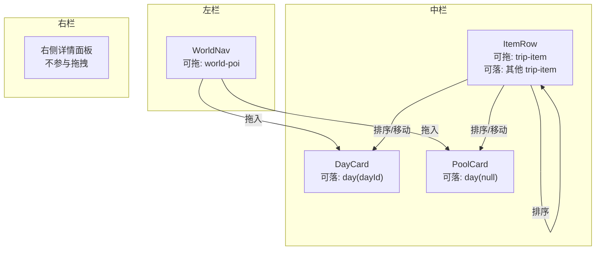
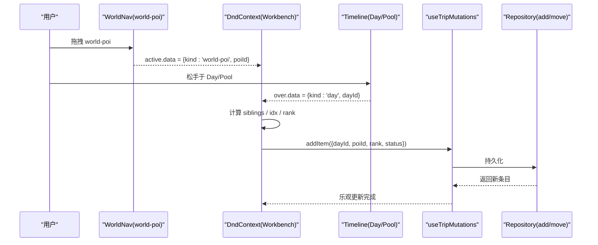
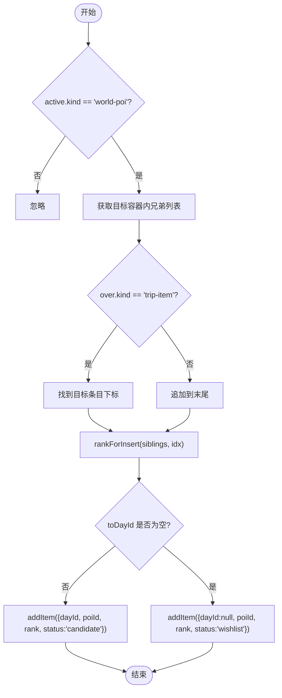
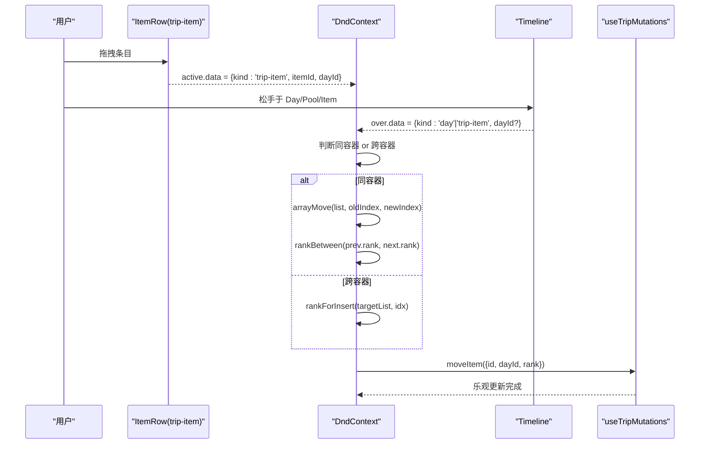
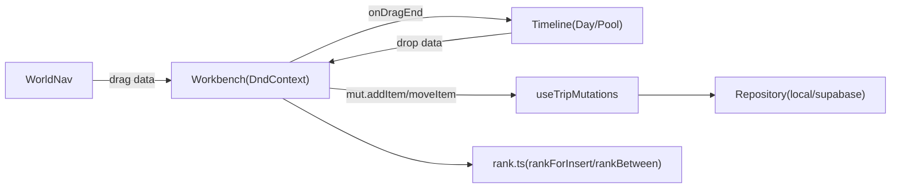

# 多类型拖拽支持

<cite>
**本文引用的文件**
- [Workbench.tsx](file://src/features/trip/Workbench.tsx)
- [Timeline.tsx](file://src/features/trip/Timeline.tsx)
- [WorldNav.tsx](file://src/features/world/WorldNav.tsx)
- [rank.ts](file://src/domain/trip/rank.ts)
- [types.ts](file://src/data/types.ts)
- [queries.ts](file://src/features/trip/queries.ts)
- [local-trip.ts](file://src/data/adapters/local-trip.ts)
- [supabase-trip.ts](file://src/data/adapters/supabase-trip.ts)
</cite>

## 目录
1. [简介](#简介)
2. [项目结构](#项目结构)
3. [核心组件](#核心组件)
4. [架构总览](#架构总览)
5. [详细组件分析](#详细组件分析)
6. [依赖关系分析](#依赖关系分析)
7. [性能考量](#性能考量)
8. [故障排查指南](#故障排查指南)
9. [结论](#结论)
10. [附录：扩展新拖拽类型的指导](#附录扩展新拖拽类型的指导)

## 简介
本文件面向“多类型拖拽”的完整实现与使用，聚焦 world-poi、trip-item、day 三类数据在拖拽过程中的特殊处理逻辑。文档将说明：
- 每种类型的拖拽约束（可拖来源、可落目标）
- 目标容器限制（天卡片、候选池、条目之间）
- 数据转换规则（如何计算 rank、状态变更、跨容器移动）
- 具体场景示例（跨容器拖拽、同容器重排序）
- 类型安全设计与扩展新类型的步骤

## 项目结构
拖拽能力由 dnd-kit 提供，围绕三个关键区域组织：
- 左侧世界库：world-poi 作为可拖源
- 中间时间线：day 作为可落目标；trip-item 既可被排序也可被拖到其他 day
- 右侧详情面板：不参与拖拽，但受选中项影响

图表来源
- [WorldNav.tsx:27-30](file://src/features/world/WorldNav.tsx#L27-L30)
- [Timeline.tsx:344-347](file://src/features/trip/Timeline.tsx#L344-L347)
- [Timeline.tsx:94-97](file://src/features/trip/Timeline.tsx#L94-L97)
- [Timeline.tsx:451-454](file://src/features/trip/Timeline.tsx#L451-L454)

章节来源
- [Workbench.tsx:1-6](file://src/features/trip/Workbench.tsx#L1-L6)
- [Timeline.tsx:1-7](file://src/features/trip/Timeline.tsx#L1-L7)

## 核心组件
- DndContext 全局上下文：统一 onDragStart/onDragEnd，集中处理跨容器逻辑
- WorldNav：渲染 world-poi 并声明 draggable data
- Timeline：DayCard 为 droppable（day），ItemRow 为 sortable（trip-item），PoolCard 为候选池 droppable
- rank 工具：基于分数序生成稳定、可并发插入的 rank
- mutations：useTripMutations 封装 add/move/update 等写操作，乐观更新保证流畅体验

章节来源
- [Workbench.tsx:240-245](file://src/features/trip/Workbench.tsx#L240-L245)
- [WorldNav.tsx:27-30](file://src/features/world/WorldNav.tsx#L27-L30)
- [Timeline.tsx:344-347](file://src/features/trip/Timeline.tsx#L344-L347)
- [Timeline.tsx:94-97](file://src/features/trip/Timeline.tsx#L94-L97)
- [Timeline.tsx:451-454](file://src/features/trip/Timeline.tsx#L451-L454)
- [rank.ts:1-10](file://src/domain/trip/rank.ts#L1-L10)
- [queries.ts:41-59](file://src/features/trip/queries.ts#L41-L59)

## 架构总览
以下序列图展示从“世界库点位拖入行程”到“落位写入”的完整流程，涵盖类型判断、目标容器解析、rank 计算与状态设置。

图表来源
- [WorldNav.tsx:27-30](file://src/features/world/WorldNav.tsx#L27-L30)
- [Workbench.tsx:170-200](file://src/features/trip/Workbench.tsx#L170-L200)
- [Timeline.tsx:344-347](file://src/features/trip/Timeline.tsx#L344-L347)
- [queries.ts:88-91](file://src/features/trip/queries.ts#L88-L91)

## 详细组件分析

### 类型定义与数据模型
- DragData：统一描述拖拽源/目标的 kind，区分 world-poi、trip-item、day
- TripItem.kind：poi、transport、note、accommodation，决定显示与业务规则
- ItemStatus：wishlist/candidate/confirmed/visited/dropped，控制条目状态流转

章节来源
- [Workbench.tsx:36-41](file://src/features/trip/Workbench.tsx#L36-L41)
- [types.ts:83-93](file://src/data/types.ts#L83-L93)
- [types.ts:159-187](file://src/data/types.ts#L159-L187)

### world-poi 拖拽（世界库 → 行程）
- 可拖源：WorldNav 中的每个 POI 行，data 携带 kind='world-poi' 与 poiId
- 可落目标：
  - DayCard：dayId 非空，表示落到具体某天
  - PoolCard：dayId 为空，表示进入候选池
- 约束与规则：
  - 若落入某 day：status 设为 candidate；否则设为 wishlist
  - 通过 itemsIn(toDayId) 获取兄弟列表，按落点位置计算 rank
  - 调用 addItem 创建条目，自动填充默认 customTitle（交通/住宿/备注时）

图表来源
- [Workbench.tsx:195-200](file://src/features/trip/Workbench.tsx#L195-L200)
- [Timeline.tsx:344-347](file://src/features/trip/Timeline.tsx#L344-L347)
- [Timeline.tsx:451-454](file://src/features/trip/Timeline.tsx#L451-L454)

章节来源
- [WorldNav.tsx:27-30](file://src/features/world/WorldNav.tsx#L27-L30)
- [Workbench.tsx:195-200](file://src/features/trip/Workbench.tsx#L195-L200)
- [local-trip.ts:198-231](file://src/data/adapters/local-trip.ts#L198-L231)
- [supabase-trip.ts:274-308](file://src/data/adapters/supabase-trip.ts#L274-L308)

### trip-item 拖拽（同容器重排序 / 跨容器移动）
- 可拖源：每条 ItemRow，data 携带 kind='trip-item'、itemId、dayId
- 可落目标：
  - 同一天的其他条目：同容器重排序
  - 另一天的 DayCard：跨容器移动到指定天
  - 候选池 PoolCard：dayId=null 的容器
- 约束与规则：
  - 同容器：计算 oldIndex/newIndex，使用 arrayMove + rankBetween 生成新 rank
  - 跨容器：根据目标容器计算 rankForInsert，调用 moveItem 更新 dayId 与 rank
  - 保持 rank 严格递增且可插值，避免覆盖

图表来源
- [Timeline.tsx:94-97](file://src/features/trip/Timeline.tsx#L94-L97)
- [Workbench.tsx:203-221](file://src/features/trip/Workbench.tsx#L203-L221)
- [queries.ts:105-119](file://src/features/trip/queries.ts#L105-L119)

章节来源
- [Timeline.tsx:94-97](file://src/features/trip/Timeline.tsx#L94-L97)
- [Workbench.tsx:203-221](file://src/features/trip/Workbench.tsx#L203-L221)
- [rank.ts:78-90](file://src/domain/trip/rank.ts#L78-L90)

### day 作为目标容器的语义
- DayCard：data={kind:'day', dayId}，表示落到具体某一天
- PoolCard：data={kind:'day', dayId:null}，表示候选池
- 两种容器都接受 world-poi 和 trip-item 的拖入，区别仅在于 dayId 是否为空

章节来源
- [Timeline.tsx:344-347](file://src/features/trip/Timeline.tsx#L344-L347)
- [Timeline.tsx:451-454](file://src/features/trip/Timeline.tsx#L451-L454)

### 数据转换与持久化
- 新增条目：addItem 会依据 kind 设置 transportMode/fromCityId/toCityId/customTitle 等字段
- 移动条目：moveItem 仅更新 dayId 与 rank，不改变其他属性
- 状态切换：world-poi 落位时根据 dayId 是否为空设置 candidate/wishlist

章节来源
- [local-trip.ts:198-231](file://src/data/adapters/local-trip.ts#L198-L231)
- [supabase-trip.ts:274-308](file://src/data/adapters/supabase-trip.ts#L274-L308)
- [supabase-trip.ts:310-338](file://src/data/adapters/supabase-trip.ts#L310-L338)
- [queries.ts:88-119](file://src/features/trip/queries.ts#L88-L119)

## 依赖关系分析
- Workbench 作为唯一 DndContext 持有者，协调左右中三栏的拖拽事件
- Timeline 提供 droppable（day/pool）与 sortable（item）
- WorldNav 提供 draggable（world-poi）
- rank 工具确保排序键稳定、可并发插入
- queries 封装乐观更新，提升交互响应性

图表来源
- [Workbench.tsx:240-245](file://src/features/trip/Workbench.tsx#L240-L245)
- [Timeline.tsx:344-347](file://src/features/trip/Timeline.tsx#L344-L347)
- [WorldNav.tsx:27-30](file://src/features/world/WorldNav.tsx#L27-L30)
- [queries.ts:41-59](file://src/features/trip/queries.ts#L41-L59)
- [rank.ts:78-90](file://src/domain/trip/rank.ts#L78-L90)

章节来源
- [Workbench.tsx:240-245](file://src/features/trip/Workbench.tsx#L240-L245)
- [Timeline.tsx:344-347](file://src/features/trip/Timeline.tsx#L344-L347)
- [WorldNav.tsx:27-30](file://src/features/world/WorldNav.tsx#L27-L30)
- [queries.ts:41-59](file://src/features/trip/queries.ts#L41-L59)
- [rank.ts:78-90](file://src/domain/trip/rank.ts#L78-L90)

## 性能考量
- 分数序 rank：避免整型 position 带来的 N 次 UPDATE，只写被拖动的一行，天然抗并发
- 乐观更新：mutations 先本地更新再同步远端，拖拽即时反馈
- 碰撞检测：closestCorners 提高复杂布局下的命中精度
- 排序策略：verticalListSortingStrategy 对长列表友好

章节来源
- [rank.ts:1-10](file://src/domain/trip/rank.ts#L1-L10)
- [queries.ts:41-59](file://src/features/trip/queries.ts#L41-L59)
- [Workbench.tsx:240-245](file://src/features/trip/Workbench.tsx#L240-L245)
- [Timeline.tsx:9-10](file://src/features/trip/Timeline.tsx#L9-L10)

## 故障排查指南
- 重复添加问题：世界库已加入的点在左侧标记“已加”，点击“+”会打开导览卡而非重复添加
  - 参考：[WorldNav.tsx:127-131](file://src/features/world/WorldNav.tsx#L127-L131)
- 排序错乱：检查 rank 是否满足 a < b 不变量，避免传入非法 rank
  - 参考：[rank.ts:22-29](file://src/domain/trip/rank.ts#L22-L29)
- 跨容器未生效：确认 over.dayId 取值正确，DayCard 与 PoolCard 均携带 dayId
  - 参考：[Timeline.tsx:344-347](file://src/features/trip/Timeline.tsx#L344-L347), [Timeline.tsx:451-454](file://src/features/trip/Timeline.tsx#L451-L454)
- 网络失败回滚：mutations 使用 onMutate/onError/onSettled 进行乐观更新与回滚
  - 参考：[queries.ts:50-63](file://src/features/trip/queries.ts#L50-L63), [queries.ts:105-119](file://src/features/trip/queries.ts#L105-L119)

章节来源
- [WorldNav.tsx:127-131](file://src/features/world/WorldNav.tsx#L127-L131)
- [rank.ts:22-29](file://src/domain/trip/rank.ts#L22-L29)
- [Timeline.tsx:344-347](file://src/features/trip/Timeline.tsx#L344-L347)
- [Timeline.tsx:451-454](file://src/features/trip/Timeline.tsx#L451-L454)
- [queries.ts:50-63](file://src/features/trip/queries.ts#L50-L63)
- [queries.ts:105-119](file://src/features/trip/queries.ts#L105-L119)

## 结论
本项目通过统一的 DragData 类型与集中式 DndContext，实现了 world-poi、trip-item、day 三类数据的跨容器拖拽与排序。借助分数序 rank 与乐观更新，保证了高并发与流畅体验。类型安全贯穿始终，便于后续扩展新的拖拽类型。

## 附录：扩展新拖拽类型的指导
- 定义新 kind：在 DragData 中添加新的 kind 字面量，并在所有分支处处理
  - 参考：[Workbench.tsx:36-41](file://src/features/trip/Workbench.tsx#L36-L41)
- 声明可拖源：为新组件配置 useDraggable，data 携带新 kind 及必要标识
  - 参考：[WorldNav.tsx:27-30](file://src/features/world/WorldNav.tsx#L27-L30)
- 声明可落目标：为新容器配置 useDroppable，data 携带 dayId（可为 null）
  - 参考：[Timeline.tsx:344-347](file://src/features/trip/Timeline.tsx#L344-L347)
- 在 onDragEnd 中增加分支：根据新 kind 计算 rank、设置状态、调用对应 mutation
  - 参考：[Workbench.tsx:195-221](file://src/features/trip/Workbench.tsx#L195-L221)
- 如需持久化新字段：在 Repository 的 addItem/updateItem 中映射字段
  - 参考：[local-trip.ts:198-231](file://src/data/adapters/local-trip.ts#L198-L231), [supabase-trip.ts:310-338](file://src/data/adapters/supabase-trip.ts#L310-L338)
- 类型安全：确保 TripItem.kind 与 UI 显示逻辑一致，必要时扩展 ItemKind
  - 参考：[types.ts:90-93](file://src/data/types.ts#L90-L93)