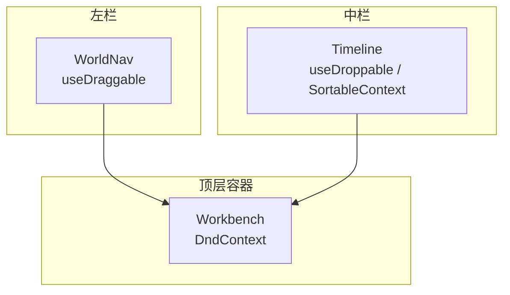
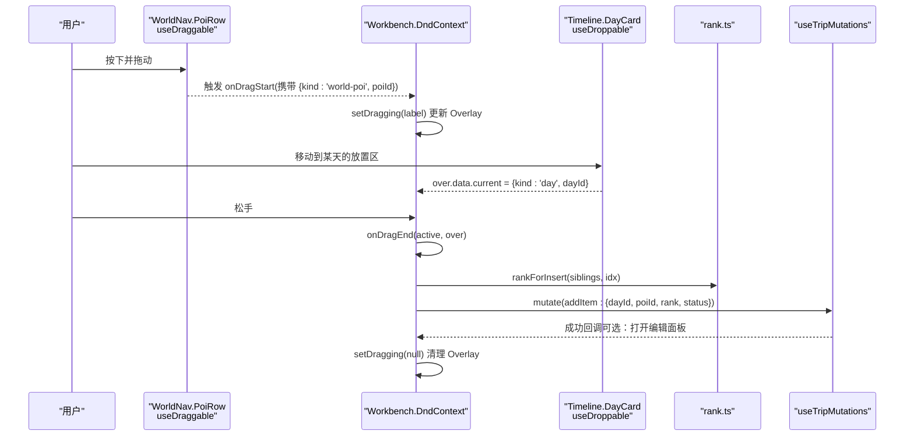
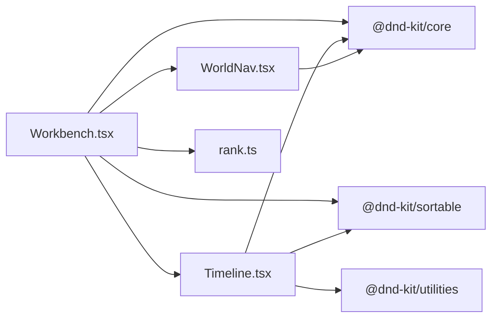

# 拖拽事件处理

<cite>
**本文引用的文件**
- [Workbench.tsx](file://src/features/trip/Workbench.tsx)
- [Timeline.tsx](file://src/features/trip/Timeline.tsx)
- [WorldNav.tsx](file://src/features/world/WorldNav.tsx)
- [rank.ts](file://src/domain/trip/rank.ts)
</cite>

## 目录
1. [简介](#简介)
2. [项目结构](#项目结构)
3. [核心组件](#核心组件)
4. [架构总览](#架构总览)
5. [详细组件分析](#详细组件分析)
6. [依赖关系分析](#依赖关系分析)
7. [性能考虑](#性能考虑)
8. [故障排查指南](#故障排查指南)
9. [结论](#结论)

## 简介
本文件聚焦于“拖拽事件处理”的完整实现与说明，覆盖 onDragStart、onDragEnd、onDragCancel 等关键事件的处理逻辑。文档解释：
- 拖拽开始时的数据准备（携带类型、标识、目标日等信息）
- 拖拽结束时的状态更新（计算插入位置、生成分数序 rank、调用变更接口）
- 拖拽取消时的回滚机制（清理临时 UI 状态）
并提供具体函数路径、参数解析、业务逻辑调用与 UI 状态同步流程，以及性能优化技巧与常见问题解决方案。

## 项目结构
本项目使用 @dnd-kit 完成跨区域拖拽：
- 左侧世界库中的景点可被拖出（useDraggable）
- 中间时间线中的一天卡片和条目可作为放置区（useDroppable），同时条目支持排序（SortableContext + useSortable）
- 顶层 DndContext 统一监听 onDragStart/onDragEnd/onDragCancel，并在 onDragEnd 中根据 active/over 的数据决定落位策略



图表来源
- [Workbench.tsx:240-246](file://src/features/trip/Workbench.tsx#L240-L246)
- [Timeline.tsx:344-347](file://src/features/trip/Timeline.tsx#L344-L347)
- [WorldNav.tsx:27-30](file://src/features/world/WorldNav.tsx#L27-L30)

章节来源
- [Workbench.tsx:1-35](file://src/features/trip/Workbench.tsx#L1-L35)
- [Timeline.tsx:1-35](file://src/features/trip/Timeline.tsx#L1-L35)
- [WorldNav.tsx:1-10](file://src/features/world/WorldNav.tsx#L1-L10)

## 核心组件
- Workbench：提供全局 DndContext，集中处理 onDragStart/onDragEnd/onDragCancel；维护 DragOverlay 显示当前拖拽项标签；协调“世界库 → 时间线”的跨区添加与“时间线内排序/跨天移动”。
- Timeline：定义 DayCard（一天卡片作为 droppable）、PoolCard（候选池作为 droppable）、ItemRow（条目作为 draggable/sortable）。
- WorldNav：PoiRow 通过 useDraggable 暴露“世界库景点”为可拖拽源。
- rank：实现分数序（fractional index）算法，用于在任意位置插入或排序时稳定生成 rank，避免并发冲突与全量重排。

章节来源
- [Workbench.tsx:36-41](file://src/features/trip/Workbench.tsx#L36-L41)
- [Timeline.tsx:73-76](file://src/features/trip/Timeline.tsx#L73-L76)
- [WorldNav.tsx:14-30](file://src/features/world/WorldNav.tsx#L14-L30)
- [rank.ts:1-10](file://src/domain/trip/rank.ts#L1-L10)

## 架构总览
下图展示一次完整的拖拽从“世界库景点”到“时间线某天”的流程，包括数据准备、命中检测、落位计算与持久化。



图表来源
- [WorldNav.tsx:27-30](file://src/features/world/WorldNav.tsx#L27-L30)
- [Workbench.tsx:170-180](file://src/features/trip/Workbench.tsx#L170-L180)
- [Workbench.tsx:182-222](file://src/features/trip/Workbench.tsx#L182-L222)
- [Timeline.tsx:344-347](file://src/features/trip/Timeline.tsx#L344-L347)
- [rank.ts:82-90](file://src/domain/trip/rank.ts#L82-L90)

## 详细组件分析

### 拖拽开始：onDragStart
- 作用：读取 active.data.current，识别拖拽源类型（world-poi 或 trip-item），并准备 overlay 显示的文本标签。
- 数据准备：
  - world-poi：从索引中查找景点名称，设置 dragging.label。
  - trip-item：从 bundle.items 中查找对应条目，优先显示 POI 名称，否则显示自定义标题。
- UI 同步：setDragging 驱动 DragOverlay 渲染，提升拖拽反馈。

示例函数路径
- [onDragStart:170-180](file://src/features/trip/Workbench.tsx#L170-L180)

章节来源
- [Workbench.tsx:170-180](file://src/features/trip/Workbench.tsx#L170-L180)

### 拖拽结束：onDragEnd
- 作用：根据 active 与 over 的数据，判断落点容器与目标位置，计算新 rank 并执行变更。
- 关键分支：
  - 从世界库拖入时间线：
    - 若落到空白处：追加到末尾；落到某条目上：插到该条目之前。
    - 计算 siblings 列表与插入下标，调用 rankForInsert 得到 rank。
    - 调用 addItem.mutate({ dayId, poiId, rank, status })，其中 status 取决于是否已排期（candidate/wishlist）。
  - 时间线内排序或跨天移动：
    - 同一天内：arrayMove 计算新顺序，取前后相邻项的 rank 用 rankBetween 生成新 rank。
    - 跨天：按目标天列表计算插入下标，rankForInsert 生成 rank。
    - 调用 moveItem.mutate({ id, dayId, rank })。
- UI 同步：完成后 setDragging(null) 清理 overlay。

示例函数路径
- [onDragEnd:182-222](file://src/features/trip/Workbench.tsx#L182-L222)

章节来源
- [Workbench.tsx:182-222](file://src/features/trip/Workbench.tsx#L182-L222)

### 拖拽取消：onDragCancel
- 作用：当拖拽被中断（如按键 ESC、离开窗口等），清理临时 UI 状态。
- 行为：setDragging(null)，确保 DragOverlay 不残留。

示例函数路径
- [onDragCancel:245-245](file://src/features/trip/Workbench.tsx#L245-L245)

章节来源
- [Workbench.tsx:240-246](file://src/features/trip/Workbench.tsx#L240-L246)

### 拖拽源与放置区
- 拖拽源：
  - 世界库景点：WorldNav.PoiRow 使用 useDraggable，data 携带 { kind: 'world-poi', poiId }。
  - 时间线条目：Timeline.ItemRow 使用 useSortable，data 携带 { kind: 'trip-item', itemId, dayId }。
- 放置区：
  - 一天卡片：DayCard 使用 useDroppable，data 携带 { kind: 'day', dayId }。
  - 候选池：PoolCard 使用 useDroppable，data 携带 { kind: 'day', dayId: null }。

示例函数路径
- [WorldNav.PoiRow useDraggable:27-30](file://src/features/world/WorldNav.tsx#L27-L30)
- [Timeline.ItemRow useSortable:94-97](file://src/features/trip/Timeline.tsx#L94-L97)
- [Timeline.DayCard useDroppable:344-347](file://src/features/trip/Timeline.tsx#L344-L347)
- [Timeline.PoolCard useDroppable:451-454](file://src/features/trip/Timeline.tsx#L451-L454)

章节来源
- [WorldNav.tsx:27-30](file://src/features/world/WorldNav.tsx#L27-L30)
- [Timeline.tsx:94-97](file://src/features/trip/Timeline.tsx#L94-L97)
- [Timeline.tsx:344-347](file://src/features/trip/Timeline.tsx#L344-L347)
- [Timeline.tsx:451-454](file://src/features/trip/Timeline.tsx#L451-L454)

### 落位计算与分数序
- 分数序（Fractional Index）：将 rank 视为 base62 小数，求两个值的中点，保证 a < result < b，且末位不为最小字符，从而支持无限次插入。
- 工具函数：
  - rankBetween(a, b)：生成介于 a 与 b 之间的 rank。
  - rankForInsert(items, toIndex)：基于目标容器内已排序列表与插入下标，计算新 rank。
  - byRank：用于对 items 进行排序。
- 优势：只写被拖动的行，天然抗并发；无需批量重排所有后续条目。

示例函数路径
- [rankBetween:57-59](file://src/domain/trip/rank.ts#L57-L59)
- [rankForInsert:86-90](file://src/domain/trip/rank.ts#L86-L90)
- [byRank:78-80](file://src/domain/trip/rank.ts#L78-L80)

章节来源
- [rank.ts:1-10](file://src/domain/trip/rank.ts#L1-L10)
- [rank.ts:57-90](file://src/domain/trip/rank.ts#L57-L90)

### 事件处理流程图
```mermaid
flowchart TD
Start(["拖拽开始"]) --> Prep["准备数据<br/>active.data.current"]
Prep --> Type{"类型?"}
Type --> |world-poi| LabelPOI["获取景点名<br/>setDragging(label)"]
Type --> |trip-item| LabelItem["获取条目名<br/>setDragging(label)"]
LabelPOI --> Move["移动至放置区"]
LabelItem --> Move
Move --> Over{"over.data.current"}
Over --> |day (有 dayId)| ToDay["toDayId = dayId"]
Over --> |day (null)| Pool["toDayId = null"]
ToDay --> Calc["计算 siblings 与插入下标<br/>rankForInsert / rankBetween"]
Pool --> Calc
Calc --> Mutate{"动作"}
Mutate --> |添加| Add["mut.addItem.mutate(...)"]
Mutate --> |移动| MoveItem["mut.moveItem.mutate(...)"]
Add --> End(["结束：清理 overlay"])
MoveItem --> End
```

图表来源
- [Workbench.tsx:170-222](file://src/features/trip/Workbench.tsx#L170-L222)
- [rank.ts:57-90](file://src/domain/trip/rank.ts#L57-L90)

## 依赖关系分析
- Workbench 依赖：
  - @dnd-kit/core：DndContext、DragOverlay、PointerSensor、closestCorners、useSensors/useSensor
  - @dnd-kit/sortable：arrayMove
  - Timeline、WorldNav、queries、store/workbench、domain/trip/rank
- Timeline 依赖：
  - @dnd-kit/core：useDroppable
  - @dnd-kit/sortable：SortableContext、useSortable、verticalListSortingStrategy
  - @dnd-kit/utilities：CSS.Transform.toString
- WorldNav 依赖：
  - @dnd-kit/core：useDraggable



图表来源
- [Workbench.tsx:7-17](file://src/features/trip/Workbench.tsx#L7-L17)
- [Timeline.tsx:8-10](file://src/features/trip/Timeline.tsx#L8-L10)
- [WorldNav.tsx:1](file://src/features/world/WorldNav.tsx#L1)

章节来源
- [Workbench.tsx:7-17](file://src/features/trip/Workbench.tsx#L7-L17)
- [Timeline.tsx:8-10](file://src/features/trip/Timeline.tsx#L8-L10)
- [WorldNav.tsx:1](file://src/features/world/WorldNav.tsx#L1)

## 性能考虑
- 分数序 rank：避免整数 position 的全量重排，减少 N 次 UPDATE，提高并发安全与性能。
- 局部更新：仅对被拖动的行写入 rank，降低数据库压力与网络开销。
- 传感器阈值：PointerSensor 设置 activationConstraint.distance=4，减少误触。
- 列表排序：使用 byRank 稳定排序，避免频繁重算。
- 懒加载地图：地图模块按需加载，仅在切换视图时下载，降低首屏体积。
- 乐观更新：所有写操作走 useTripMutations 的乐观更新，拖动松手即生效，提升交互响应性。

[本节为通用性能建议，不直接引用具体代码]

## 故障排查指南
- 拖拽无响应：
  - 检查 DndContext 是否正确包裹三栏布局，sensors 是否启用。
  - 确认 useDraggable/useDroppable 的 data 字段是否携带必要标识（kind、poiId/itemId/dayId）。
- 落位错误：
  - 核对 over.data.current 的 dayId 是否为空（候选池 vs 某天）。
  - 验证 siblings 列表是否已移除被拖项，避免重复插入。
  - 检查 rankForInsert/rankBetween 的参数顺序与边界条件。
- 并发冲突：
  - 分数序设计已抗并发；若仍出现覆盖，检查是否存在非 dnd-kit 的路径修改了 rank。
- UI 状态不一致：
  - onDragCancel 必须清理 setDragging(null)，防止 overlay 残留。
  - 成功回调中 inspect 打开编辑面板的逻辑需确保 item.id 有效。

章节来源
- [Workbench.tsx:240-246](file://src/features/trip/Workbench.tsx#L240-L246)
- [Workbench.tsx:182-222](file://src/features/trip/Workbench.tsx#L182-L222)
- [rank.ts:57-90](file://src/domain/trip/rank.ts#L57-L90)

## 结论
本项目的拖拽事件处理以 DndContext 为中心，结合 useDraggable/useDroppable/useSortable 构建跨区拖拽与排序能力。onDragStart 负责数据准备与 UI 反馈，onDragEnd 负责落位计算与状态更新，onDragCancel 负责回滚清理。通过分数序 rank 的设计，实现了高性能、抗并发、可扩展的排序与插入逻辑。配合乐观更新与合理的传感器配置，整体交互流畅且健壮。