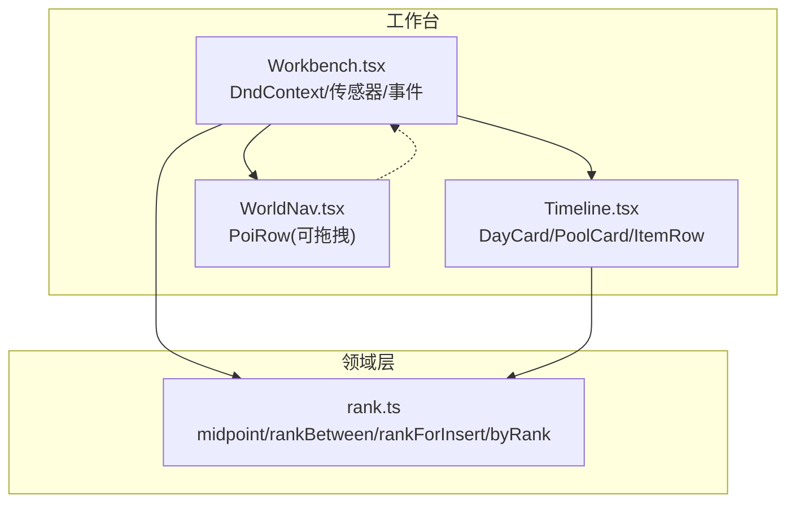
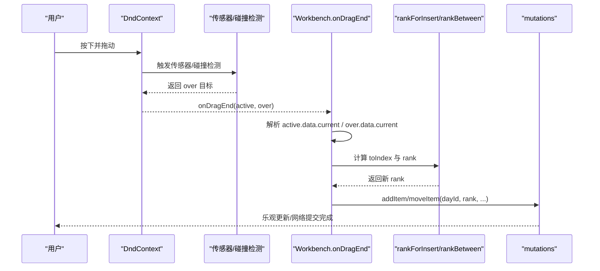
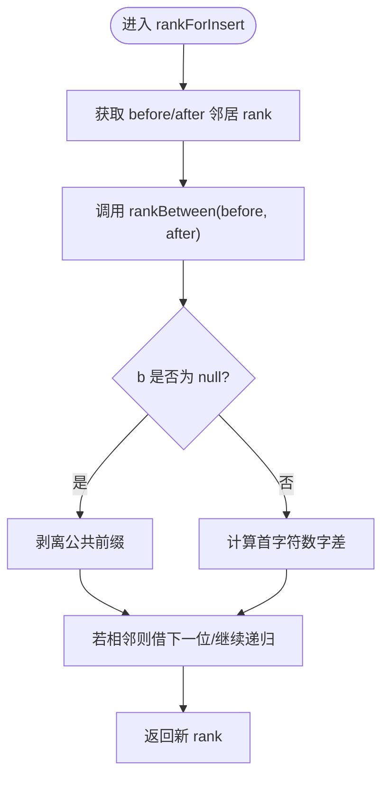

# 拖拽排序系统

<cite>
**本文引用的文件**
- [Workbench.tsx](file://src/features/trip/Workbench.tsx)
- [Timeline.tsx](file://src/features/trip/Timeline.tsx)
- [WorldNav.tsx](file://src/features/world/WorldNav.tsx)
- [rank.ts](file://src/domain/trip/rank.ts)
- [rank.test.ts](file://src/domain/trip/rank.test.ts)
</cite>

## 目录
1. [简介](#简介)
2. [项目结构](#项目结构)
3. [核心组件](#核心组件)
4. [架构总览](#架构总览)
5. [详细组件分析](#详细组件分析)
6. [依赖关系分析](#依赖关系分析)
7. [性能考虑](#性能考虑)
8. [故障排查指南](#故障排查指南)
9. [结论](#结论)
10. [附录](#附录)

## 简介
本系统基于 @dnd-kit 实现跨区域的拖拽排序，支持三类数据：世界库景点（world-poi）、行程条目（trip-item）、以及按天分组的时间线容器（day）。核心设计要点包括：
- 全局唯一的 DndContext 统一管理传感器、碰撞检测与拖拽生命周期。
- 使用分数序（fractional rank）作为排序键，避免整数位置带来的全量更新与并发冲突问题。
- 通过自定义传感器与碰撞检测策略，适配不同交互场景（如最小移动距离触发、嵌套列表精确命中）。
- 对 world-poi、trip-item、day 三种类型分别定义拖拽行为与落位规则，统一通过 rankForInsert/rankBetween 计算新顺序。

## 项目结构
与拖拽排序相关的关键文件与职责：
- Workbench.tsx：应用级 DndContext 配置、传感器设置、拖拽开始/结束/取消处理、跨区拖拽逻辑汇总。
- Timeline.tsx：时间线视图，包含“天卡片”与“候选池”两个可放置区域；条目在 SortableContext 中可排序。
- WorldNav.tsx：世界库导航，提供可拖拽的景点项（world-poi），并支持点击加入当前选中日期。
- rank.ts：分数序算法实现，包含 midpoint、rankBetween、initialRank、sequentialRanks、byRank、rankForInsert。
- rank.test.ts：针对分数序算法的单元测试，覆盖边界与压力场景。



图表来源
- [Workbench.tsx:240-246](file://src/features/trip/Workbench.tsx#L240-L246)
- [Timeline.tsx:344-428](file://src/features/trip/Timeline.tsx#L344-L428)
- [WorldNav.tsx:27-30](file://src/features/world/WorldNav.tsx#L27-L30)
- [rank.ts:22-90](file://src/domain/trip/rank.ts#L22-L90)

章节来源
- [Workbench.tsx:1-414](file://src/features/trip/Workbench.tsx#L1-L414)
- [Timeline.tsx:1-702](file://src/features/trip/Timeline.tsx#L1-L702)
- [WorldNav.tsx:1-266](file://src/features/world/WorldNav.tsx#L1-L266)
- [rank.ts:1-91](file://src/domain/trip/rank.ts#L1-L91)

## 核心组件
- DndContext 与传感器
  - 全局唯一 DndContext 包裹三栏布局，集中管理拖拽状态与事件。
  - 使用 PointerSensor，并设置最小移动距离阈值，避免误触。
  - 碰撞检测采用 closestCorners，适合嵌套列表与多目标容器。
- 拖拽数据模型
  - DragData 统一描述拖拽源与目标：kind 区分 world-poi / trip-item / day，携带 poiId / itemId / dayId。
- 排序键：分数序
  - 以字符串表示 base62 小数（省略前缀“0.”），通过求中点插入新值，保证 a < result < b。
  - 不变量：rank 末位永远不是最小字符，确保始终可在其前插值。
  - 关键函数：midpoint、rankBetween、initialRank、sequentialRanks、byRank、rankForInsert。

章节来源
- [Workbench.tsx:152-246](file://src/features/trip/Workbench.tsx#L152-L246)
- [rank.ts:1-91](file://src/domain/trip/rank.ts#L1-L91)

## 架构总览
整体流程：用户在左栏或中栏拖拽元素，DndContext 根据传感器与碰撞检测确定 over 目标；onDragEnd 中根据 active.kind 与 over.kind 计算目标 dayId 与插入位置，调用 rankForInsert 得到新 rank，并通过 mutations 持久化。



图表来源
- [Workbench.tsx:170-222](file://src/features/trip/Workbench.tsx#L170-L222)
- [rank.ts:82-90](file://src/domain/trip/rank.ts#L82-L90)

## 详细组件分析

### DndContext 配置与传感器
- 传感器
  - 使用 useSensors + useSensor(PointerSensor)，设置 activationConstraint.distance=4，减少误触发。
- 碰撞检测
  - 使用 closestCorners，适合复杂嵌套与多 droppable 的场景。
- 生命周期
  - onDragStart：根据 active.data.current 显示 DragOverlay 标签。
  - onDragEnd：根据 active/over 计算落位并执行变更。
  - onDragCancel：清理临时状态（如 overlay 标签）。

章节来源
- [Workbench.tsx:152-246](file://src/features/trip/Workbench.tsx#L152-L246)

### 分数序算法（fractional rank）
- 设计动机
  - 整数 position 在拖拽时需批量更新后续所有项，成本高且易并发冲突。
  - 分数序只写被拖动的那一行，天然抗并发。
- 实现要点
  - 将 rank 视为省略“0.”的 base62 小数，midpoint 递归剥离公共前缀后求中点。
  - 约束：a < b；rank 末位不能为最小字符，否则无法在其前插值。
  - 工具函数：
    - rankBetween(a, b)：返回严格介于 a 与 b 之间的 rank。
    - initialRank()：生成初始居中 rank，便于向两端扩展。
    - sequentialRanks(n)：生成 n 个递增 rank，用于导入/复制等场景。
    - byRank(a, b)：字符串比较排序。
    - rankForInsert(items, toIndex)：根据前后邻居计算插入位置的 rank。



图表来源
- [rank.ts:22-90](file://src/domain/trip/rank.ts#L22-L90)

章节来源
- [rank.ts:1-91](file://src/domain/trip/rank.ts#L1-L91)
- [rank.test.ts:1-76](file://src/domain/trip/rank.test.ts#L1-L76)

### 不同类型数据的拖拽处理

#### world-poi（世界库景点）
- 拖拽源：WorldNav.PoiRow 使用 useDraggable，data 标记 kind='world-poi' 与 poiId。
- 落位规则：
  - 拖到某天的空白处：追加到该天末尾。
  - 拖到某条目上：插入到该条目之前。
  - 未指定 dayId（拖到候选池）：status 设为 wishlist。
- 计算方式：
  - siblings = itemsIn(toDayId)
  - idx = 目标条目索引或末尾
  - rank = rankForInsert(siblings, idx)
  - 调用 mut.addItem.mutate({ dayId, poiId, rank, status })

章节来源
- [WorldNav.tsx:27-30](file://src/features/world/WorldNav.tsx#L27-L30)
- [Workbench.tsx:195-201](file://src/features/trip/Workbench.tsx#L195-L201)

#### trip-item（行程条目）
- 拖拽源：Timeline.ItemRow 使用 useSortable，data 标记 kind='trip-item'、itemId、dayId。
- 落位规则：
  - 同一天内移动：使用 arrayMove 计算新位置，rankBetween 在前后邻居之间插入。
  - 跨天移动：按目标天列表计算 toIndex，rankForInsert 得到新 rank。
- 计算方式：
  - 同一天：moved = arrayMove(list, oldIndex, newIndex); rank = rankBetween(moved[newIndex-1]?.rank, moved[newIndex+1]?.rank)
  - 跨天：idx = 目标条目索引或末尾; rank = rankForInsert(list, idx)
  - 调用 mut.moveItem.mutate({ id, dayId, rank })

章节来源
- [Timeline.tsx:94-97](file://src/features/trip/Timeline.tsx#L94-L97)
- [Workbench.tsx:203-221](file://src/features/trip/Workbench.tsx#L203-L221)

#### day（天卡片/候选池）
- 放置目标：DayCard 与 PoolCard 使用 useDroppable，data 标记 kind='day' 与 dayId（候选池 dayId=null）。
- 作用：接收来自世界库或条目的拖拽，提供统一的放置语义（追加或插入）。

章节来源
- [Timeline.tsx:344-347](file://src/features/trip/Timeline.tsx#L344-L347)
- [Timeline.tsx:451-454](file://src/features/trip/Timeline.tsx#L451-L454)

### 拖拽开始、结束、取消的处理流程（代码路径）
- 开始
  - 入口：Workbench.onDragStart
  - 行为：根据 active.data.current 查找名称并设置 overlay 标签
  - 参考路径：[Workbench.tsx:170-180](file://src/features/trip/Workbench.tsx#L170-L180)
- 结束
  - 入口：Workbench.onDragEnd
  - 行为：解析 active/over，计算 toDayId 与 toIndex，调用 rankForInsert/rankBetween，执行 mutation
  - 参考路径：[Workbench.tsx:182-222](file://src/features/trip/Workbench.tsx#L182-L222)
- 取消
  - 入口：Workbench.onDragCancel
  - 行为：清理 overlay 标签
  - 参考路径：[Workbench.tsx:245](file://src/features/trip/Workbench.tsx#L245)

章节来源
- [Workbench.tsx:170-246](file://src/features/trip/Workbench.tsx#L170-L246)

## 依赖关系分析
- 组件耦合
  - Workbench 聚合 DndContext 与事件处理，依赖 Timeline 与 WorldNav 的可拖拽/可放置能力。
  - Timeline 内部通过 SortableContext 管理条目排序，并通过 useDroppable 暴露放置目标。
  - WorldNav 暴露可拖拽的世界库景点，与 Workbench 的添加逻辑对接。
- 领域依赖
  - 所有排序相关逻辑集中在 rank.ts，被 Workbench 与 Timeline 共同复用，解耦 UI 与排序算法。
- 外部依赖
  - @dnd-kit/core：DndContext、useDraggable、useDroppable、传感器与碰撞检测。
  - @dnd-kit/sortable：SortableContext、useSortable、arrayMove、verticalListSortingStrategy。
  - @dnd-kit/utilities：CSS.Transform 等辅助。

```mermaid
graph LR
WN["WorldNav.tsx"] --> WB["Workbench.tsx"]
TL["Timeline.tsx"] --> WB
WB --> RK["rank.ts"]
TL --> RK
WB -.-> "@dnd-kit/core"
TL -.-> "@dnd-kit/sortable"
TL -.-> "@dnd-kit/utilities"
```

图表来源
- [Workbench.tsx:240-246](file://src/features/trip/Workbench.tsx#L240-L246)
- [Timeline.tsx:8-10](file://src/features/trip/Timeline.tsx#L8-L10)
- [WorldNav.tsx:1](file://src/features/world/WorldNav.tsx#L1)
- [rank.ts:78-90](file://src/domain/trip/rank.ts#L78-L90)

章节来源
- [Workbench.tsx:240-246](file://src/features/trip/Workbench.tsx#L240-L246)
- [Timeline.tsx:8-10](file://src/features/trip/Timeline.tsx#L8-L10)
- [WorldNav.tsx:1](file://src/features/world/WorldNav.tsx#L1)
- [rank.ts:78-90](file://src/domain/trip/rank.ts#L78-L90)

## 性能考虑
- 仅更新受影响行
  - 分数序确保每次拖拽只写入被拖动的一行，避免 N 次 UPDATE。
- 本地乐观更新
  - 使用 mutations 的乐观更新，松手即生效，提升交互响应性。
- 合理选择排序策略
  - 使用 verticalListSortingStrategy 与 SortableContext 优化长列表渲染与动画。
- 碰撞检测优化
  - closestCorners 在嵌套结构中表现良好，避免不必要的重排。
- 传感器阈值
  - 设置最小移动距离，降低误触与频繁触发成本。

[本节为通用指导，不直接分析具体文件]

## 故障排查指南
- 常见错误
  - rank 末位为 '0'：会破坏可插值不变量，导致无法在其前插入。算法内置校验抛出错误。
  - a >= b：midpoint 要求 a < b，违反时抛出错误，防止静默乱序。
- 定位方法
  - 检查 rankBetween/rankForInsert 的入参是否满足约束。
  - 确认拖拽目标是否正确传递 dayId 与条目索引。
  - 查看 onDragEnd 中的分支逻辑，确认走的是 world-poi 还是 trip-item 路径。
- 测试用例参考
  - 覆盖区间有效性、重复插入稳定性、边界条件等。

章节来源
- [rank.ts:22-59](file://src/domain/trip/rank.ts#L22-L59)
- [rank.test.ts:4-42](file://src/domain/trip/rank.test.ts#L4-L42)

## 结论
本拖拽排序系统通过 @dnd-kit 的全局上下文与灵活的传感器/碰撞检测，结合分数序算法，实现了高效、可扩展且抗并发的跨区拖拽体验。world-poi、trip-item、day 三类数据在统一框架下具备清晰的拖拽语义与落位规则，配合乐观更新与合理的性能优化，保证了良好的交互流畅性与数据一致性。

[本节为总结，不直接分析具体文件]

## 附录
- 关键 API 与函数路径
  - DndContext 配置与事件：[Workbench.tsx:240-246](file://src/features/trip/Workbench.tsx#L240-L246)
  - 传感器与碰撞检测：[Workbench.tsx:152-153](file://src/features/trip/Workbench.tsx#L152-L153)
  - 拖拽事件处理：[Workbench.tsx:170-222](file://src/features/trip/Workbench.tsx#L170-L222)
  - 分数序算法：[rank.ts:22-90](file://src/domain/trip/rank.ts#L22-L90)
  - 单元测试：[rank.test.ts:1-76](file://src/domain/trip/rank.test.ts#L1-L76)

[本节为索引，不直接分析具体文件]