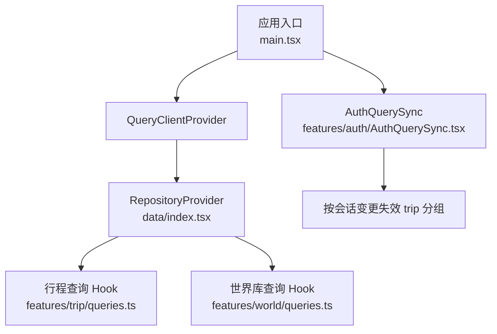
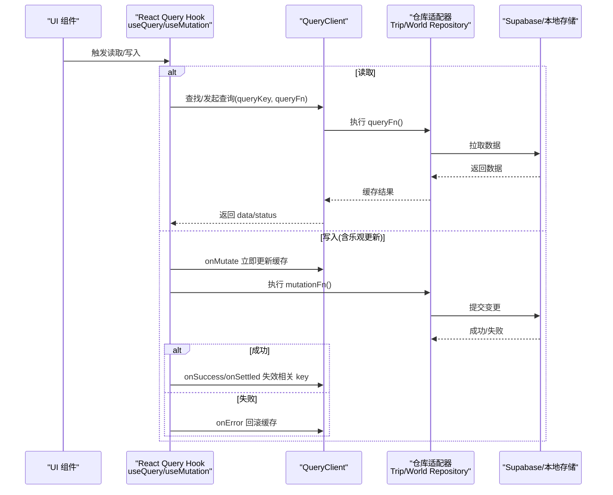
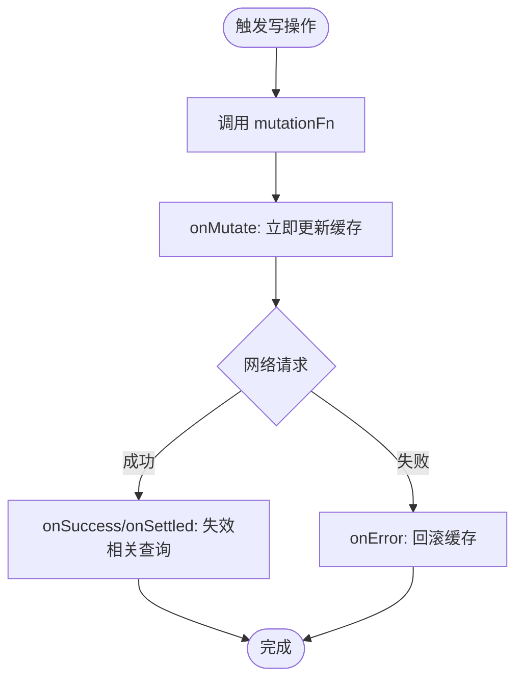
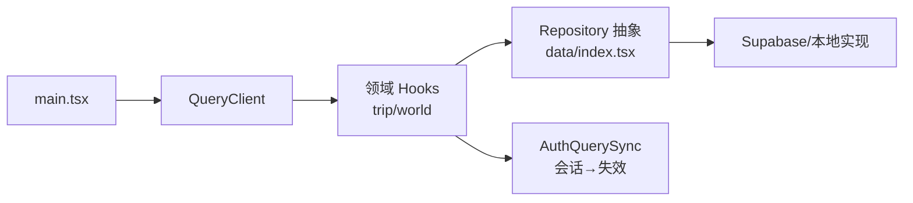

# React Query集成

<cite>
**本文引用的文件**
- [main.tsx](file://src/app/main.tsx)
- [queries.ts（行程）](file://src/features/trip/queries.ts)
- [queries.ts（世界库）](file://src/features/world/queries.ts)
- [AuthQuerySync.tsx](file://src/features/auth/AuthQuerySync.tsx)
- [useProfile.ts](file://src/features/auth/useProfile.ts)
- [index.tsx（仓库工厂）](file://src/data/index.tsx)
- [supabase-client.ts](file://src/data/supabase-client.ts)
- [vite.config.ts](file://vite.config.ts)
- [技术方案.md](file://docs/技术方案.md)
</cite>

## 目录
1. [简介](#简介)
2. [项目结构](#项目结构)
3. [核心组件](#核心组件)
4. [架构总览](#架构总览)
5. [详细组件分析](#详细组件分析)
6. [依赖关系分析](#依赖关系分析)
7. [性能考量](#性能考量)
8. [故障排查指南](#故障排查指南)
9. [结论](#结论)
10. [附录](#附录)

## 简介
本文件面向使用 TanStack React Query 的开发者，系统化说明本项目中查询配置策略、缓存与失效机制、useQuery/useMutation 的使用模式、乐观更新实现、错误处理与调试方法。文档基于代码仓库中的实际实现进行解读，并给出可操作的实践建议。

## 项目结构
React Query 在本项目中以“全局 QueryClient + 领域 Hook 封装”的方式组织：
- 应用入口创建并注入 QueryClient，统一设置默认重试与聚焦重取策略。
- 各功能域通过独立的 queries.ts 暴露 useQuery/useMutation 钩子，内部封装 queryKey 与 staleTime/gcTime 等策略。
- 登录态变化时通过 AuthQuerySync 主动失效相关查询，保证数据一致性。
- 世界库为静态内容，采用永不失效的缓存；行程数据采用短期 staleTime，并在写操作后主动失效。

图表来源
- [main.tsx:16-20](file://src/app/main.tsx#L16-L20)
- [index.tsx:21-29](file://src/data/index.tsx#L21-L29)
- [queries.ts（行程）:17-30](file://src/features/trip/queries.ts#L17-L30)
- [queries.ts（世界库）:8-30](file://src/features/world/queries.ts#L8-L30)
- [AuthQuerySync.tsx:19-23](file://src/features/auth/AuthQuerySync.tsx#L19-L23)

章节来源
- [main.tsx:16-20](file://src/app/main.tsx#L16-L20)
- [vite.config.ts:25-28](file://vite.config.ts#L25-L28)
- [index.tsx:21-29](file://src/data/index.tsx#L21-L29)

## 核心组件
- 全局 QueryClient：在应用入口创建，集中配置默认重试次数与窗口聚焦行为，避免不必要的重复请求。
- 领域查询 Hook：
  - 行程：提供列表、Bundle 详情以及大量写操作 Hook，统一封装 queryKey、staleTime、乐观更新与失效逻辑。
  - 世界库：针对静态资源，设置无限 staleTime/gcTime，减少网络开销。
- 认证同步：监听会话变化，自动失效 trip 相关查询，确保登录后数据正确刷新。
- 仓库抽象：通过 Context 注入 Trip/World 仓库，视图层只依赖接口，便于切换后端或离线模式。

章节来源
- [main.tsx:16-20](file://src/app/main.tsx#L16-L20)
- [queries.ts（行程）:17-30](file://src/features/trip/queries.ts#L17-L30)
- [queries.ts（世界库）:5-30](file://src/features/world/queries.ts#L5-L30)
- [AuthQuerySync.tsx:19-23](file://src/features/auth/AuthQuerySync.tsx#L19-L23)
- [index.tsx:21-29](file://src/data/index.tsx#L21-L29)

## 架构总览
下图展示了从 UI 到数据源的完整调用链，包括查询、写入、乐观更新与失效流程。

图表来源
- [queries.ts（行程）:50-81](file://src/features/trip/queries.ts#L50-L81)
- [queries.ts（行程）:93-119](file://src/features/trip/queries.ts#L93-L119)
- [queries.ts（世界库）:8-30](file://src/features/world/queries.ts#L8-L30)
- [AuthQuerySync.tsx:19-23](file://src/features/auth/AuthQuerySync.tsx#L19-L23)

## 详细组件分析

### 查询配置策略：queryKey、staleTime、缓存
- 世界库（静态内容）
  - 使用 Infinity 的 staleTime 与 gcTime，构建产物与 Service Worker 负责版本更新，运行时不再过期。
  - 典型 key：['world','index']、['world','pois', q]、['world','poi', id]、['world','city', id]、['world','country', id]、['world','poi-map', sortedIds]。
- 行程数据
  - 列表：['trip','list']，staleTime 设为 60 秒，适合低频变动的集合。
  - Bundle：['trip','bundle', tripId]，staleTime 设为 30 秒，兼顾实时性与性能。
  - 用户资料：['profile', userId]，随登录态变化自动重取。
- 关键设计点
  - 将可变维度放入 queryKey（如 tripId、userId），确保状态隔离与精准失效。
  - 对静态资源使用永久缓存，降低网络压力。
  - 通过 invalidateQueries 精确控制失效范围，避免全量刷新。

章节来源
- [queries.ts（世界库）:5-30](file://src/features/world/queries.ts#L5-L30)
- [queries.ts（行程）:17-30](file://src/features/trip/queries.ts#L17-L30)
- [useProfile.ts:23-36](file://src/features/auth/useProfile.ts#L23-L36)
- [技术方案.md:407-420](file://docs/技术方案.md#L407-L420)

### useQuery 使用模式：数据获取、状态管理、错误处理
- 数据获取
  - 通过 useQuery 声明式描述数据来源，queryFn 仅关注如何获取数据，不关心缓存与重试。
  - enabled 用于条件加载（例如需要有效 id 或登录态）。
- 状态管理
  - data、isLoading、error 等状态由 React Query 统一管理，组件只需消费。
  - 通过 queryKey 区分不同上下文的数据，天然支持多实例隔离。
- 错误处理
  - 在 queryFn 中抛出错误，React Query 会捕获并暴露 error 状态。
  - 结合全局 retry 配置与业务层提示（如 toast）提升用户体验。

章节来源
- [useProfile.ts:23-36](file://src/features/auth/useProfile.ts#L23-L36)
- [queries.ts（世界库）:13-30](file://src/features/world/queries.ts#L13-L30)
- [main.tsx:16-20](file://src/app/main.tsx#L16-L20)

### useMutation 使用模式：CRUD、网络异常、乐观更新
- CRUD 封装
  - 每个写操作封装为独立 useMutation，mutationFn 委托给仓库适配器，屏蔽底层实现差异。
  - 成功回调中通过 invalidateQueries 使相关查询失效，确保后续读取拿到最新数据。
- 网络异常
  - 失败时通过 onError 回滚乐观更新，保持缓存一致。
  - 可结合 toast 向用户反馈错误信息。
- 乐观更新
  - 在 onMutate 中立即修改对应 queryKey 的缓存，提升交互响应性。
  - 使用 structuredClone 深拷贝旧值，避免引用污染。
  - 失败时通过 onError 恢复旧值，onSettled 统一失效缓存。

图表来源
- [queries.ts（行程）:50-81](file://src/features/trip/queries.ts#L50-L81)
- [queries.ts（行程）:93-119](file://src/features/trip/queries.ts#L93-L119)

章节来源
- [queries.ts（行程）:50-235](file://src/features/trip/queries.ts#L50-L235)

### 登录态与查询同步
- 痛点：未登录时已执行的 trip 查询可能因 RLS 被拒绝而缓存空结果；登录后若不失效，界面仍显示旧数据。
- 方案：监听会话变化，一旦 session 就绪即失效 ['trip'] 分组，强制重新拉取，保证数据一致性。

章节来源
- [AuthQuerySync.tsx:19-23](file://src/features/auth/AuthQuerySync.tsx#L19-L23)
- [supabase-client.ts:45-69](file://src/data/supabase-client.ts#L45-L69)

### 世界库查询优化
- 世界库为静态内容，使用 Infinity 的 staleTime/gcTime，避免运行时过期。
- 通过排序后的 ids 生成唯一 key，聚合多个 POI 的批量查询，减少重复请求。

章节来源
- [queries.ts（世界库）:5-41](file://src/features/world/queries.ts#L5-L41)

## 依赖关系分析
- 应用入口 main.tsx 提供 QueryClient 与 Provider，所有组件共享同一缓存实例。
- 领域 hooks 依赖 data/index.tsx 提供的仓库抽象，屏蔽 Supabase/本地实现差异。
- 认证模块通过 supabase-client 暴露会话与鉴权能力，并与 React Query 联动失效查询。
- Vite 构建时将 react-query 单独分包，利于缓存与按需加载。

图表来源
- [main.tsx:16-20](file://src/app/main.tsx#L16-L20)
- [index.tsx:21-29](file://src/data/index.tsx#L21-L29)
- [AuthQuerySync.tsx:19-23](file://src/features/auth/AuthQuerySync.tsx#L19-L23)

章节来源
- [vite.config.ts:25-28](file://vite.config.ts#L25-L28)
- [index.tsx:21-29](file://src/data/index.tsx#L21-L29)

## 性能考量
- 默认策略
  - 关闭窗口聚焦重取，避免频繁刷新；重试次数限制为 1，降低抖动。
- 缓存策略
  - 世界库永久缓存，减少网络请求。
  - 行程数据短生命周期 staleTime，配合写操作后失效，平衡实时性与性能。
- 打包优化
  - 将 react-query 单独分包，提高缓存命中率与加载速度。
- 数据聚合
  - 使用 bundle 一次性获取行程多维数据，减少往返次数。

章节来源
- [main.tsx:16-20](file://src/app/main.tsx#L16-L20)
- [queries.ts（世界库）:5-30](file://src/features/world/queries.ts#L5-L30)
- [queries.ts（行程）:17-30](file://src/features/trip/queries.ts#L17-L30)
- [vite.config.ts:25-28](file://vite.config.ts#L25-L28)
- [技术方案.md:407-420](file://docs/技术方案.md#L407-L420)

## 故障排查指南
- 登录后数据不更新
  - 检查是否触发了 ['trip'] 分组的失效逻辑。
  - 确认会话加载完成后执行了 invalidateQueries。
- 写操作后界面未刷新
  - 确认 onSuccess/onSettled 中对相关 queryKey 执行了失效。
  - 若使用了乐观更新，检查 onError 是否正确回滚。
- 频繁闪烁或重复请求
  - 检查是否误开启 refetchOnWindowFocus。
  - 确认 world 数据使用 Infinity staleTime，避免误过期。
- 错误提示
  - 在 mutation 的 onError 中结合 toast 展示错误信息，便于定位问题。

章节来源
- [AuthQuerySync.tsx:19-23](file://src/features/auth/AuthQuerySync.tsx#L19-L23)
- [queries.ts（行程）:50-81](file://src/features/trip/queries.ts#L50-L81)
- [main.tsx:16-20](file://src/app/main.tsx#L16-L20)

## 结论
本项目以 React Query 为核心构建了清晰的数据流与缓存体系：通过统一的 QueryClient、领域化的查询 Hook、严格的 queryKey 约定与精准的失效策略，实现了高性能且易维护的前端数据层。乐观更新显著提升了交互体验，配合登录态同步与错误回滚，保证了数据一致性与健壮性。对于静态资源采用永久缓存，进一步降低了网络开销。整体方案简洁、可扩展，适合在复杂业务中复用。

## 附录
- 最佳实践清单
  - 将可变维度纳入 queryKey，确保隔离与精准失效。
  - 对静态资源使用 Infinity staleTime/gcTime。
  - 写操作优先使用 onMutate 乐观更新，onError 回滚，onSettled 失效。
  - 登录态变化时及时失效相关分组，避免陈旧数据。
  - 合理设置 staleTime，避免过度刷新或数据滞后。
- 参考路径
  - 全局配置：[main.tsx:16-20](file://src/app/main.tsx#L16-L20)
  - 世界库查询：[queries.ts（世界库）:5-41](file://src/features/world/queries.ts#L5-L41)
  - 行程查询与写操作：[queries.ts（行程）:17-235](file://src/features/trip/queries.ts#L17-L235)
  - 登录态同步：[AuthQuerySync.tsx:19-23](file://src/features/auth/AuthQuerySync.tsx#L19-L23)
  - 仓库抽象：[index.tsx:21-29](file://src/data/index.tsx#L21-L29)
  - 构建分包：[vite.config.ts:25-28](file://vite.config.ts#L25-L28)
  - 策略说明：[技术方案.md:407-420](file://docs/技术方案.md#L407-L420)