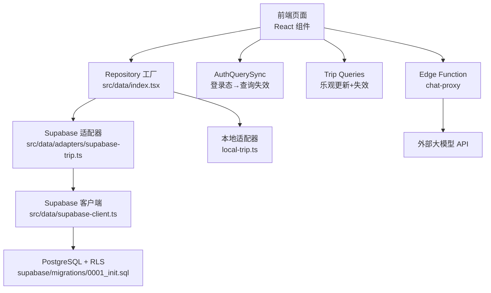
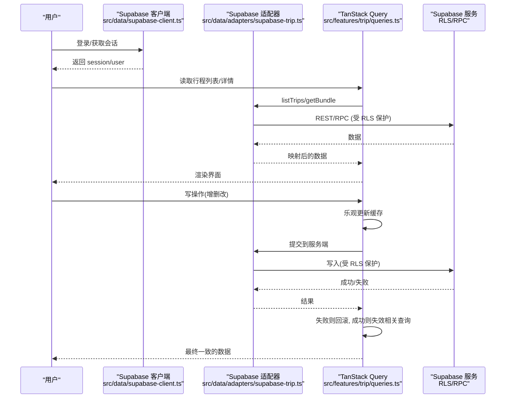
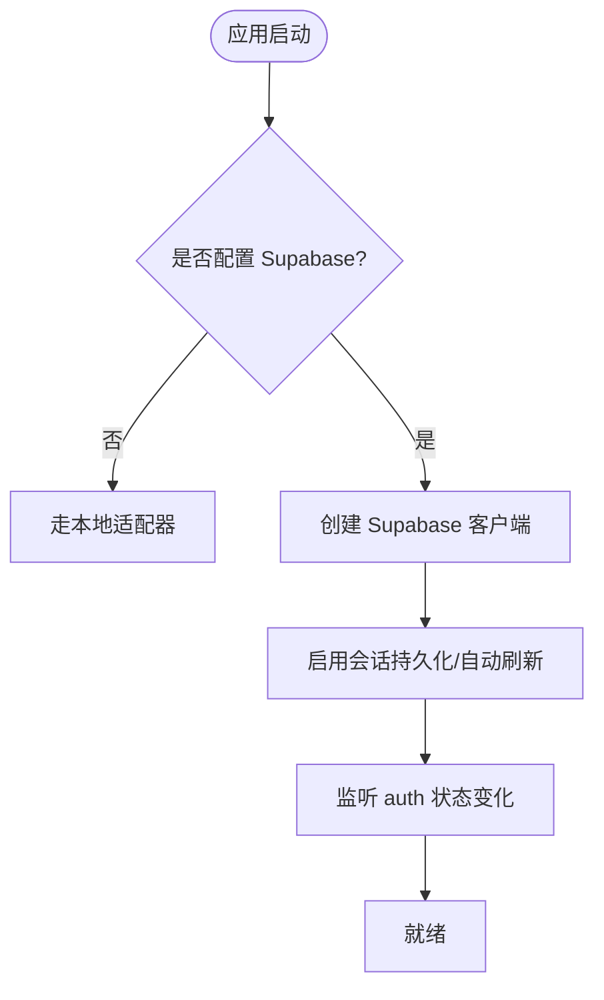
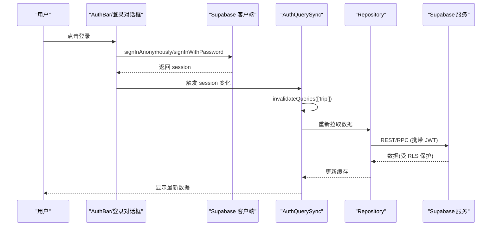
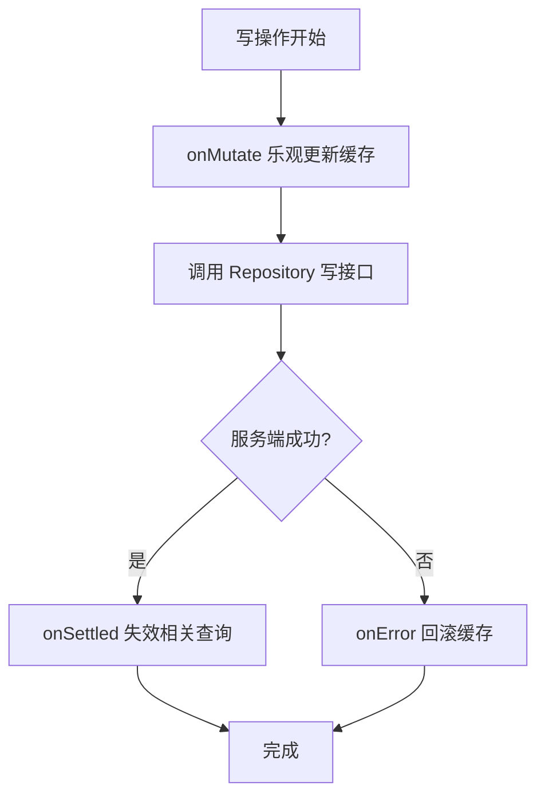
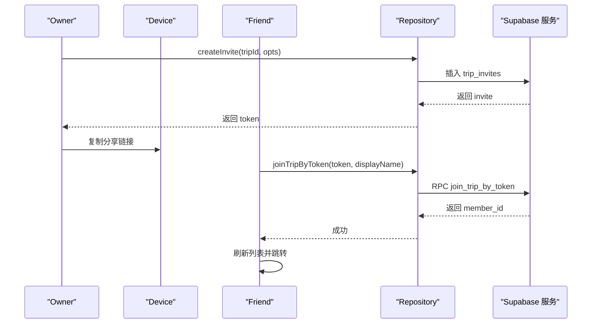
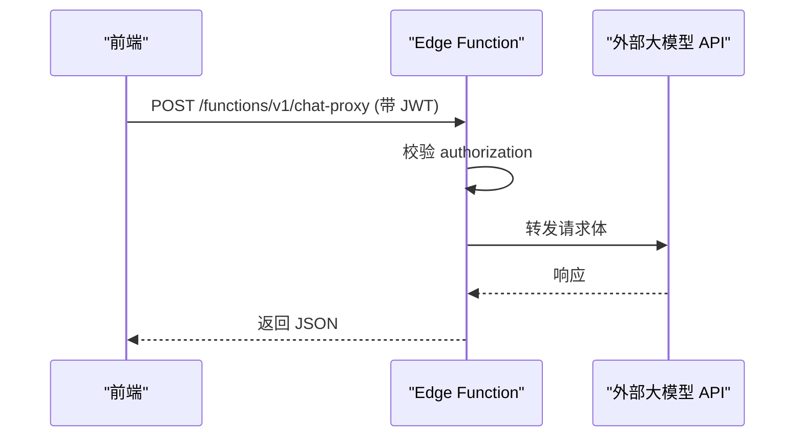
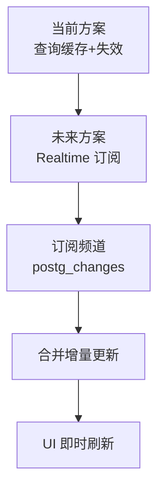
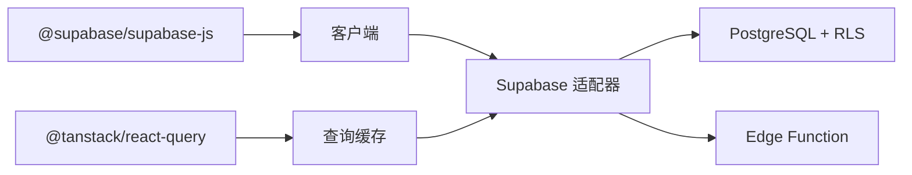

# Supabase实时同步

<cite>
**本文引用的文件**
- [src/data/supabase-client.ts](file://src/data/supabase-client.ts)
- [src/data/index.tsx](file://src/data/index.tsx)
- [src/data/adapters/supabase-trip.ts](file://src/data/adapters/supabase-trip.ts)
- [src/features/auth/AuthQuerySync.tsx](file://src/features/auth/AuthQuerySync.tsx)
- [src/features/trip/queries.ts](file://src/features/trip/queries.ts)
- [src/features/trip/CollaborateDialog.tsx](file://src/features/trip/CollaborateDialog.tsx)
- [src/features/trip/JoinDialog.tsx](file://src/features/trip/JoinDialog.tsx)
- [supabase/migrations/0001_init.sql](file://supabase/migrations/0001_init.sql)
- [supabase/functions/chat-proxy/index.ts](file://supabase/functions/chat-proxy/index.ts)
- [package.json](file://package.json)
- [docs/技术方案.md](file://docs/技术方案.md)
</cite>

## 目录
1. [简介](#简介)
2. [项目结构](#项目结构)
3. [核心组件](#核心组件)
4. [架构总览](#架构总览)
5. [详细组件分析](#详细组件分析)
6. [依赖关系分析](#依赖关系分析)
7. [性能考量](#性能考量)
8. [故障排查指南](#故障排查指南)
9. [结论](#结论)
10. [附录](#附录)

## 简介
本文件面向“玩无一失”项目中基于 Supabase 的协作与数据同步能力，系统性说明：
- 客户端配置与连接管理（认证流程、会话持久化、自动刷新）
- 查询缓存与失效策略（登录态变化触发重拉）
- 写操作的乐观更新与回滚机制（冲突处理与一致性保证）
- 邀请协作与权限控制（RLS、RPC 加入行程）
- 边缘函数代理（安全调用外部大模型 API）
- 调试技巧与常见问题定位

注意：当前代码库未实现 Supabase Realtime 订阅通道；实时性通过“查询缓存 + 登录态变更失效 + 写后失效”的组合达成。后续可在 M4 阶段引入 Realtime 以增强多端即时体验。

## 项目结构
- 数据层
  - 客户端单例与认证：[src/data/supabase-client.ts](file://src/data/supabase-client.ts)
  - Repository 工厂与注入：[src/data/index.tsx](file://src/data/index.tsx)
  - Supabase 适配器：[src/data/adapters/supabase-trip.ts](file://src/data/adapters/supabase-trip.ts)
  - 类型定义：[src/data/types.ts](file://src/data/types.ts)
- 功能层
  - 登录态与查询同步：[src/features/auth/AuthQuerySync.tsx](file://src/features/auth/AuthQuerySync.tsx)
  - 行程查询与写操作封装：[src/features/trip/queries.ts](file://src/features/trip/queries.ts)
  - 邀请协作弹窗：[src/features/trip/CollaborateDialog.tsx](file://src/features/trip/CollaborateDialog.tsx)
  - 加入行程弹窗：[src/features/trip/JoinDialog.tsx](file://src/features/trip/JoinDialog.tsx)
- 后端
  - 数据库迁移与 RLS/RPC：[supabase/migrations/0001_init.sql](file://supabase/migrations/0001_init.sql)
  - 边缘函数（AI 代理）：[supabase/functions/chat-proxy/index.ts](file://supabase/functions/chat-proxy/index.ts)
- 工程配置
  - 依赖与脚本：[package.json](file://package.json)
  - 技术设计文档：[docs/技术方案.md](file://docs/技术方案.md)

图表来源
- [src/data/index.tsx:21-29](file://src/data/index.tsx#L21-L29)
- [src/data/adapters/supabase-trip.ts:141-198](file://src/data/adapters/supabase-trip.ts#L141-L198)
- [src/data/supabase-client.ts:24-34](file://src/data/supabase-client.ts#L24-L34)
- [supabase/migrations/0001_init.sql:309-386](file://supabase/migrations/0001_init.sql#L309-L386)
- [supabase/functions/chat-proxy/index.ts:32-80](file://supabase/functions/chat-proxy/index.ts#L32-L80)

章节来源
- [src/data/index.tsx:21-29](file://src/data/index.tsx#L21-L29)
- [package.json:18-31](file://package.json#L18-L31)

## 核心组件
- Supabase 客户端与认证
  - 提供单例客户端、会话监听、匿名/邮箱登录/登出等能力
  - 开启会话持久化与自动刷新令牌，关闭 URL 解析以避免 HashRouter 干扰
- Repository 工厂
  - 根据是否配置 Supabase 动态选择云端或本地适配器
  - 对外暴露统一接口，视图层无感知切换
- Supabase 适配器
  - 使用 RPC 一次性获取行程全量数据（减少往返）
  - 所有写操作受 RLS 约束，必须已登录
- 查询与写操作封装
  - 读：TanStack Query 缓存，staleTime 控制
  - 写：乐观更新 + 失败回滚 + 成功后失效相关查询
- 登录态与查询同步
  - 监听 auth 状态变化，登录/登出时失效 trip 分组查询，确保数据与权限一致
- 邀请协作与加入
  - 生成邀请链接，朋友凭 token 加入，服务端创建成员并授予 RLS 权限
- 边缘函数
  - 安全转发大模型请求，校验 JWT，隐藏密钥

章节来源
- [src/data/supabase-client.ts:24-34](file://src/data/supabase-client.ts#L24-L34)
- [src/data/index.tsx:21-29](file://src/data/index.tsx#L21-L29)
- [src/data/adapters/supabase-trip.ts:159-198](file://src/data/adapters/supabase-trip.ts#L159-L198)
- [src/features/trip/queries.ts:45-63](file://src/features/trip/queries.ts#L45-L63)
- [src/features/auth/AuthQuerySync.tsx:19-23](file://src/features/auth/AuthQuerySync.tsx#L19-L23)
- [supabase/migrations/0001_init.sql:392-465](file://supabase/migrations/0001_init.sql#L392-L465)
- [supabase/functions/chat-proxy/index.ts:32-80](file://supabase/functions/chat-proxy/index.ts#L32-L80)

## 架构总览
整体采用“前端 React + TanStack Query + Supabase 客户端”的分层架构：
- 前端通过 Repository 抽象访问数据，屏蔽底层实现差异
- 读路径：Query 缓存 + staleTime + 登录态变更失效
- 写路径：乐观更新 + 失败回滚 + 成功后失效
- 权限：RLS 严格限制行级访问，RPC 集中业务逻辑
- 扩展：Edge Function 用于安全调用外部服务

图表来源
- [src/data/supabase-client.ts:45-68](file://src/data/supabase-client.ts#L45-L68)
- [src/data/adapters/supabase-trip.ts:150-198](file://src/data/adapters/supabase-trip.ts#L150-L198)
- [src/features/trip/queries.ts:45-63](file://src/features/trip/queries.ts#L45-L63)
- [supabase/migrations/0001_init.sql:309-386](file://supabase/migrations/0001_init.sql#L309-L386)

## 详细组件分析

### 客户端配置与连接管理
- 客户端初始化
  - 从环境变量读取 URL 与匿名 Key，若配置齐全则创建客户端，否则为 null
  - 启用会话持久化与自动刷新令牌，关闭 URL 检测避免路由冲突
- 会话监听
  - useSession 钩子监听 auth 状态变化，SSR 安全，未配置时直接返回未登录
- 登录方式
  - 支持匿名登录、邮箱 OTP、邮箱密码注册/登录、登出

图表来源
- [src/data/supabase-client.ts:24-34](file://src/data/supabase-client.ts#L24-L34)
- [src/data/supabase-client.ts:45-68](file://src/data/supabase-client.ts#L45-L68)

章节来源
- [src/data/supabase-client.ts:24-34](file://src/data/supabase-client.ts#L24-L34)
- [src/data/supabase-client.ts:45-68](file://src/data/supabase-client.ts#L45-L68)

### 认证流程与权限控制
- 为什么必须登录
  - RLS 策略基于 auth.uid()，未登录无法读写 trips 等表
- 登录态与查询同步
  - 登录/登出后立即失效 ['trip'] 分组查询，强制用新会话重拉
- 加入行程
  - 通过 RPC join_trip_by_token 将用户加入 trip_members，RLS 自动授予权限

图表来源
- [src/features/auth/AuthQuerySync.tsx:19-23](file://src/features/auth/AuthQuerySync.tsx#L19-L23)
- [src/data/supabase-client.ts:72-105](file://src/data/supabase-client.ts#L72-L105)
- [supabase/migrations/0001_init.sql:309-386](file://supabase/migrations/0001_init.sql#L309-L386)

章节来源
- [src/features/auth/AuthQuerySync.tsx:19-23](file://src/features/auth/AuthQuerySync.tsx#L19-L23)
- [src/data/supabase-client.ts:72-105](file://src/data/supabase-client.ts#L72-L105)
- [supabase/migrations/0001_init.sql:309-386](file://supabase/migrations/0001_init.sql#L309-L386)

### 查询与写操作封装（乐观更新与失效）
- 读
  - 使用 TanStack Query，设置 staleTime，避免频繁刷新
  - 列表与详情分别缓存，键约定清晰
- 写
  - onMutate 立即更新缓存，提升交互流畅度
  - onError 回滚到之前快照
  - onSuccess/onSettled 失效相关查询，保证最终一致

图表来源
- [src/features/trip/queries.ts:45-63](file://src/features/trip/queries.ts#L45-L63)
- [src/features/trip/queries.ts:65-216](file://src/features/trip/queries.ts#L65-L216)

章节来源
- [src/features/trip/queries.ts:45-63](file://src/features/trip/queries.ts#L45-L63)
- [src/features/trip/queries.ts:65-216](file://src/features/trip/queries.ts#L65-L216)

### 邀请协作与加入流程
- 生成邀请
  - owner 调用 createInvite，生成 token 并拼接分享链接
  - 可设置有效期与最大使用次数
- 加入行程
  - 朋友打开链接，输入 token 与显示名，调用 join_trip_by_token
  - 成功后刷新列表并跳转

图表来源
- [src/features/trip/CollaborateDialog.tsx:42-65](file://src/features/trip/CollaborateDialog.tsx#L42-L65)
- [src/features/trip/JoinDialog.tsx:27-38](file://src/features/trip/JoinDialog.tsx#L27-L38)
- [supabase/migrations/0001_init.sql:431-465](file://supabase/migrations/0001_init.sql#L431-L465)

章节来源
- [src/features/trip/CollaborateDialog.tsx:42-65](file://src/features/trip/CollaborateDialog.tsx#L42-L65)
- [src/features/trip/JoinDialog.tsx:27-38](file://src/features/trip/JoinDialog.tsx#L27-L38)
- [supabase/migrations/0001_init.sql:431-465](file://supabase/migrations/0001_init.sql#L431-L465)

### 边缘函数代理（安全调用外部 API）
- 作用
  - 仅做中转与鉴权，不触碰业务数据
  - 默认开启 JWT 校验，按账号限流
- 调用方式
  - 前端通过 fetch 直接调用 Edge Function，附带 Authorization 与 apikey
- 错误处理
  - 上游错误透传，便于前端提示

图表来源
- [supabase/functions/chat-proxy/index.ts:32-80](file://supabase/functions/chat-proxy/index.ts#L32-L80)

章节来源
- [supabase/functions/chat-proxy/index.ts:32-80](file://supabase/functions/chat-proxy/index.ts#L32-L80)

### 实时订阅机制现状与演进建议
- 现状
  - 当前未使用 Supabase Realtime 订阅通道
  - 实时性通过“查询缓存 + 登录态变更失效 + 写后失效”实现
- 建议
  - 在 M4 引入 Realtime，对 trip_items、expenses、tickets 等高频变更表建立频道订阅
  - 结合 optimistic UI，先本地更新再合并服务器推送，降低抖动
  - 使用 channel.on('postgres_changes') 过滤事件类型与行级条件

[本节为概念性内容，不直接分析具体文件]

## 依赖关系分析
- 前端依赖
  - @supabase/supabase-js：客户端、认证、REST/RPC
  - @tanstack/react-query：查询缓存与失效
  - react-router-dom：路由与会话深链
- 后端依赖
  - PostgreSQL：存储与 RLS
  - Supabase Functions：边缘函数
- 耦合与内聚
  - Repository 抽象提高内聚，降低耦合
  - RLS 与 RPC 集中在迁移文件中，便于维护

图表来源
- [package.json:18-31](file://package.json#L18-L31)
- [src/data/adapters/supabase-trip.ts:141-198](file://src/data/adapters/supabase-trip.ts#L141-L198)

章节来源
- [package.json:18-31](file://package.json#L18-L31)
- [src/data/adapters/supabase-trip.ts:141-198](file://src/data/adapters/supabase-trip.ts#L141-L198)

## 性能考量
- 减少往返
  - 使用 RPC get_trip_bundle 一次性获取全量数据，避免多次请求
- 缓存策略
  - staleTime 控制缓存过期时间，减少重复请求
- 乐观更新
  - 写操作立即更新 UI，提升交互流畅度
- 网络优化
  - 关闭 refetchOnWindowFocus，避免不必要的刷新
  - 合理设置重试次数

章节来源
- [src/data/adapters/supabase-trip.ts:159-198](file://src/data/adapters/supabase-trip.ts#L159-L198)
- [src/features/trip/queries.ts:17-29](file://src/features/trip/queries.ts#L17-L29)
- [docs/技术方案.md:407-418](file://docs/技术方案.md#L407-L418)

## 故障排查指南
- 未登录导致权限错误
  - 现象：RLS 拒绝访问，返回 FORBIDDEN
  - 解决：确保已登录，检查 useSession 与 AuthQuerySync
- 邀请链接无效
  - 现象：join_trip_by_token 报错 INVALID_INVITE
  - 解决：检查 token 是否过期、是否已达最大使用次数
- 边缘函数调用失败
  - 现象：非 2xx 状态码或上游错误
  - 解决：检查 DEEPSEEK_API_KEY 配置、JWT 是否正确传递
- 查询未刷新
  - 现象：登录后数据仍为空
  - 解决：确认 AuthQuerySync 已触发 invalidateQueries(['trip'])

章节来源
- [src/data/adapters/supabase-trip.ts:159-165](file://src/data/adapters/supabase-trip.ts#L159-L165)
- [supabase/migrations/0001_init.sql:431-465](file://supabase/migrations/0001_init.sql#L431-L465)
- [supabase/functions/chat-proxy/index.ts:32-80](file://supabase/functions/chat-proxy/index.ts#L32-L80)
- [src/features/auth/AuthQuerySync.tsx:19-23](file://src/features/auth/AuthQuerySync.tsx#L19-L23)

## 结论
本项目通过清晰的 Repository 抽象、严格的 RLS 权限控制、以及 TanStack Query 的缓存与失效机制，实现了稳定可靠的 Supabase 数据同步。虽然尚未启用 Realtime 订阅，但当前方案已满足大多数场景的实时性需求。未来可在高频变更场景引入 Realtime，进一步提升用户体验。

## 附录
- 关键配置与环境变量
  - VITE_SUPABASE_URL、VITE_SUPABASE_ANON_KEY
  - Edge Function 中需设置 DEEPSEEK_API_KEY
- 常用命令
  - supabase functions deploy chat-proxy
  - supabase secrets set DEEPSEEK_API_KEY=xxx

章节来源
- [src/data/supabase-client.ts:17-18](file://src/data/supabase-client.ts#L17-L18)
- [supabase/functions/chat-proxy/index.ts:9-11](file://supabase/functions/chat-proxy/index.ts#L9-L11)