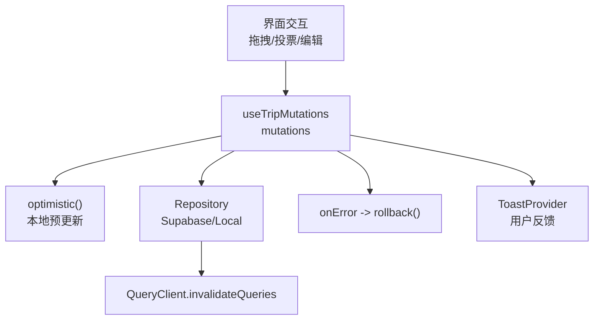
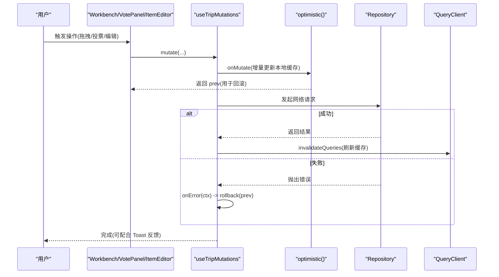
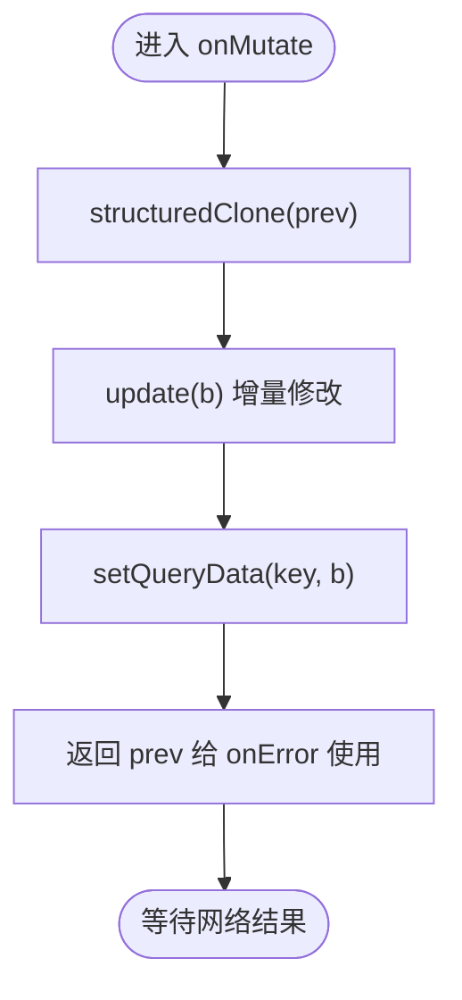
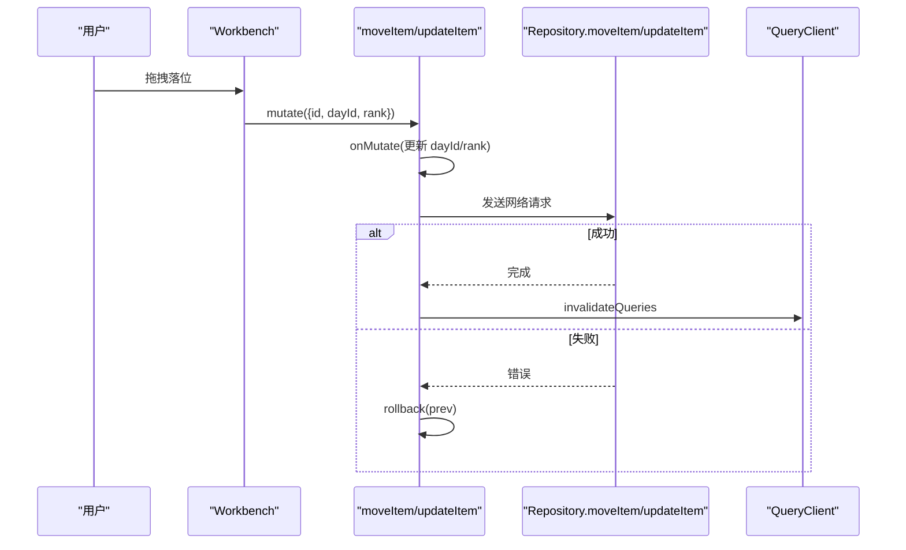
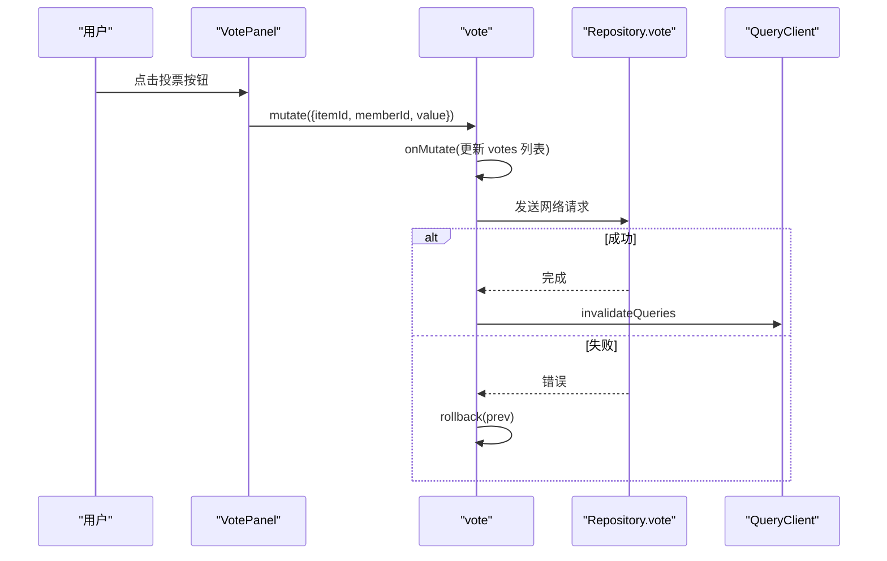
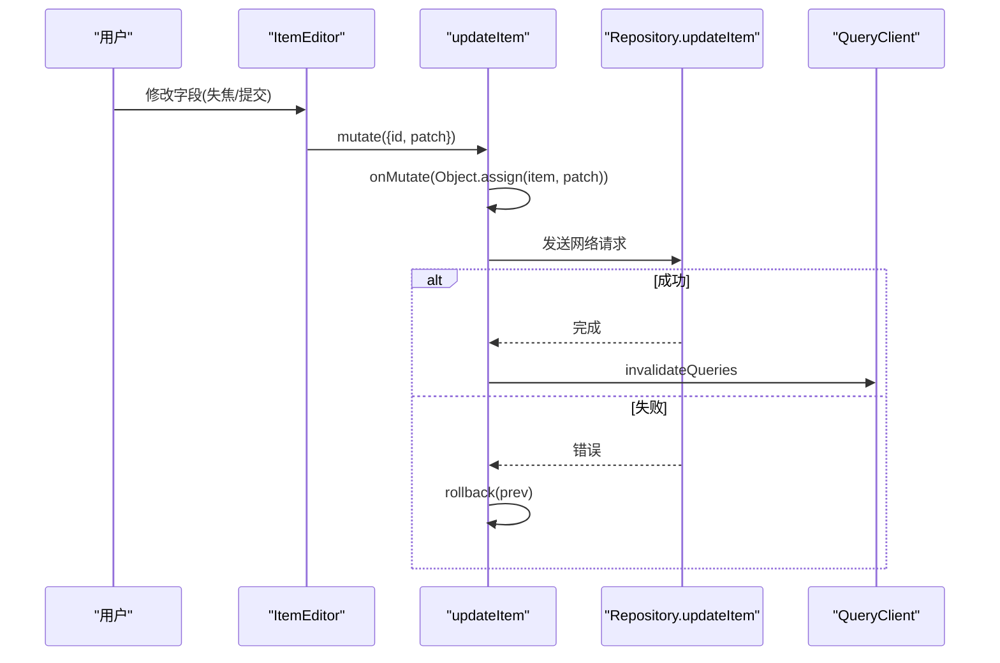
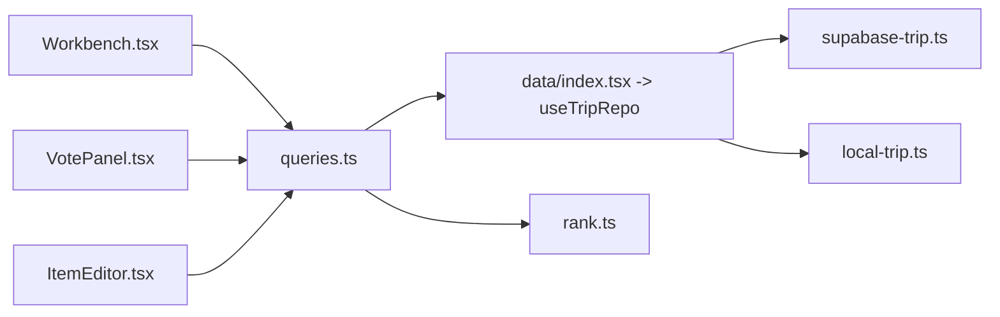

# 乐观更新机制

<cite>
**本文引用的文件**
- [queries.ts](file://src/features/trip/queries.ts)
- [Workbench.tsx](file://src/features/trip/Workbench.tsx)
- [VotePanel.tsx](file://src/features/trip/VotePanel.tsx)
- [ItemEditor.tsx](file://src/features/trip/ItemEditor.tsx)
- [supabase-trip.ts](file://src/data/adapters/supabase-trip.ts)
- [local-trip.ts](file://src/data/adapters/local-trip.ts)
- [rank.ts](file://src/domain/trip/rank.ts)
- [toast.tsx](file://src/ui/toast.tsx)
- [main.tsx](file://src/app/main.tsx)
- [技术方案.md](file://docs/技术方案.md)
</cite>

## 目录
1. [简介](#简介)
2. [项目结构](#项目结构)
3. [核心组件](#核心组件)
4. [架构总览](#架构总览)
5. [详细组件分析](#详细组件分析)
6. [依赖关系分析](#依赖关系分析)
7. [性能考量](#性能考量)
8. [故障排查指南](#故障排查指南)
9. [结论](#结论)
10. [附录](#附录)

## 简介
本文件围绕“乐观更新”在本项目中的实现进行系统化说明，覆盖以下要点：
- 本地状态预更新与撤销回滚
- 网络请求并行处理与失效策略
- 错误边界、用户反馈与数据恢复
- optimistic 函数的设计模式（状态克隆、增量更新、撤销）
- 典型场景：拖拽排序、投票、编辑等操作的乐观更新实践
- 性能优化技巧与最佳实践

## 项目结构
本项目采用 React + TanStack Query 的查询/变更管理方式，通过 Repository 抽象屏蔽后端差异（Supabase/本地），在 features 层集中封装写操作并统一应用乐观更新。关键路径如下：
- UI 触发交互（拖拽、投票、编辑）
- 调用 useTripMutations 暴露的 mutation
- onMutate 中执行 optimistic 函数，立即更新本地缓存
- 发起网络请求；成功则 invalidateQueries 刷新，失败则 rollback 回滚
- 通过 Toast 提供用户反馈

图表来源
- [queries.ts:45-63](file://src/features/trip/queries.ts#L45-L63)
- [main.tsx:16-37](file://src/app/main.tsx#L16-L37)
- [toast.tsx:42-81](file://src/ui/toast.tsx#L42-L81)

章节来源
- [main.tsx:16-37](file://src/app/main.tsx#L16-L37)
- [queries.ts:45-63](file://src/features/trip/queries.ts#L45-L63)

## 核心组件
- 乐观更新中枢：useTripMutations 内的 optimistic/settle/rollback 三件套
- 数据仓库：SupabaseTripRepository / LocalTripRepository 提供一致接口
- 交互入口：Workbench（拖拽）、VotePanel（投票）、ItemEditor（编辑）
- 排序算法：rank.ts 分数序 rankBetween/rankForInsert，支撑并发安全的拖拽
- 用户反馈：ToastProvider 全局提示

章节来源
- [queries.ts:45-63](file://src/features/trip/queries.ts#L45-L63)
- [supabase-trip.ts:141-198](file://src/data/adapters/supabase-trip.ts#L141-L198)
- [local-trip.ts:297-325](file://src/data/adapters/local-trip.ts#L297-L325)
- [rank.ts:52-90](file://src/domain/trip/rank.ts#L52-L90)
- [toast.tsx:42-81](file://src/ui/toast.tsx#L42-L81)

## 架构总览
下图展示了从 UI 到数据层的完整乐观更新流程，包括本地预更新、网络请求、成功刷新与失败回滚。

图表来源
- [queries.ts:45-63](file://src/features/trip/queries.ts#L45-L63)
- [queries.ts:71-81](file://src/features/trip/queries.ts#L71-L81)
- [queries.ts:137-148](file://src/features/trip/queries.ts#L137-L148)
- [queries.ts:150-159](file://src/features/trip/queries.ts#L150-L159)

## 详细组件分析

### 乐观更新中枢：optimistic 函数设计模式
- 状态克隆：使用 structuredClone(prev) 深拷贝当前缓存，避免直接修改共享引用
- 增量更新：传入 update(b) 回调，仅对需要变更的字段做最小化修改（如 Object.assign、数组过滤/追加）
- 撤销操作：onMutate 返回 prev，onError 中用 rollback(ctx) 将缓存还原为 prev
- 成功后刷新：onSettled 或 onSuccess 中调用 invalidateQueries 保证最终一致性

图表来源
- [queries.ts:50-63](file://src/features/trip/queries.ts#L50-L63)

章节来源
- [queries.ts:50-63](file://src/features/trip/queries.ts#L50-L63)

### 拖拽排序（移动条目/跨天插入）
- 计算新 rank：基于 rankForInsert/rankBetween，生成介于前后邻居之间的分数序，确保只更新被拖动的一条记录，天然抗并发
- 本地预更新：moveItem/updateItem 在 onMutate 中即时调整 dayId/rank，UI 立刻响应
- 失败回滚：onError 时恢复 prev，避免排序错乱
- 成功刷新：invalidateQueries 拉取最新顺序

图表来源
- [Workbench.tsx:182-222](file://src/features/trip/Workbench.tsx#L182-L222)
- [queries.ts:105-119](file://src/features/trip/queries.ts#L105-L119)
- [rank.ts:82-90](file://src/domain/trip/rank.ts#L82-L90)

章节来源
- [Workbench.tsx:182-222](file://src/features/trip/Workbench.tsx#L182-L222)
- [queries.ts:105-119](file://src/features/trip/queries.ts#L105-L119)
- [rank.ts:52-90](file://src/domain/trip/rank.ts#L52-L90)

### 投票（实时表态）
- 本地预更新：vote 的 onMutate 会先移除旧票，再根据 value 决定是否新增，立即反映在 UI
- 失败回滚：onError 恢复 prev，避免票数/名单不一致
- 成功刷新：invalidateQueries 同步云端真实投票

图表来源
- [VotePanel.tsx:33-36](file://src/features/trip/VotePanel.tsx#L33-L36)
- [queries.ts:137-148](file://src/features/trip/queries.ts#L137-L148)
- [supabase-trip.ts:415-436](file://src/data/adapters/supabase-trip.ts#L415-L436)

章节来源
- [VotePanel.tsx:33-36](file://src/features/trip/VotePanel.tsx#L33-L36)
- [queries.ts:137-148](file://src/features/trip/queries.ts#L137-L148)
- [supabase-trip.ts:415-436](file://src/data/adapters/supabase-trip.ts#L415-L436)

### 编辑（条目信息/备注/时间）
- 本地预更新：updateItem/onMutate 对目标 item 做 patch 合并，UI 立即可见
- 失败回滚：onError 恢复 prev，避免编辑内容丢失
- 成功刷新：invalidateQueries 获取服务端最新值

图表来源
- [ItemEditor.tsx:52-54](file://src/features/trip/ItemEditor.tsx#L52-L54)
- [queries.ts:93-103](file://src/features/trip/queries.ts#L93-L103)
- [supabase-trip.ts:310-334](file://src/data/adapters/supabase-trip.ts#L310-L334)

章节来源
- [ItemEditor.tsx:52-54](file://src/features/trip/ItemEditor.tsx#L52-L54)
- [queries.ts:93-103](file://src/features/trip/queries.ts#L93-L103)
- [supabase-trip.ts:310-334](file://src/data/adapters/supabase-trip.ts#L310-L334)

### 错误边界、用户反馈与数据恢复
- 错误边界：文档指出按路由分段包裹 ErrorBoundary，详情面板崩溃不影响主时间线
- 用户反馈：ToastProvider 提供 success/error/warn/info 类型提示，自动消失并可手动关闭
- 数据恢复：onError 统一调用 rollback 恢复 prev，保证 UI 与缓存一致

章节来源
- [技术方案.md:1159-1171](file://docs/技术方案.md#L1159-L1171)
- [toast.tsx:42-81](file://src/ui/toast.tsx#L42-L81)
- [queries.ts:61-63](file://src/features/trip/queries.ts#L61-L63)

## 依赖关系分析
- queries.ts 依赖 data/index.tsx 提供的 useTripRepo 注入具体 Repository
- supabase-trip.ts 与 local-trip.ts 实现相同接口，视图层无感知切换
- Workbench/VotePanel/ItemEditor 通过 useTripMutations 统一访问 mutations
- rank.ts 提供稳定的排序键，降低并发冲突风险

图表来源
- [queries.ts:1-14](file://src/features/trip/queries.ts#L1-L14)
- [data/index.tsx:21-29](file://src/data/index.tsx#L21-L29)
- [supabase-trip.ts:141-198](file://src/data/adapters/supabase-trip.ts#L141-L198)
- [local-trip.ts:297-325](file://src/data/adapters/local-trip.ts#L297-L325)
- [rank.ts:52-90](file://src/domain/trip/rank.ts#L52-L90)

章节来源
- [data/index.tsx:21-29](file://src/data/index.tsx#L21-L29)
- [queries.ts:1-14](file://src/features/trip/queries.ts#L1-L14)

## 性能考量
- 本地预更新减少往返延迟：所有写操作均先更新本地缓存，提升交互流畅度
- 分数序 rankBetween/rankForInsert：每次拖拽仅更新一行，避免批量重排带来的 N 次 UPDATE
- 失效粒度控制：onSettled 仅 invalidate 相关 key，避免全量刷新
- 窗口聚焦禁用 refetchOnWindowFocus：防止切标签页导致不必要的闪烁与请求
- 结构化克隆：structuredClone 保证深拷贝安全，避免共享状态污染
- 组件级 Suspense：地图等重型模块懒加载，避免阻塞首屏

章节来源
- [rank.ts:52-90](file://src/domain/trip/rank.ts#L52-L90)
- [queries.ts:56-63](file://src/features/trip/queries.ts#L56-L63)
- [main.tsx:16-20](file://src/app/main.tsx#L16-L20)
- [Timeline.tsx:638-643](file://src/features/trip/Timeline.tsx#L638-L643)

## 故障排查指南
- 网络失败回滚：确认 onMutate 返回了 prev，且 onError 调用了 rollback(ctx)
- 权限问题：Supabase RPC 返回 FORBIDDEN 时，上层应引导登录或提示权限不足
- 外键约束失败：例如删除成员时报 23503，需先处理账目再删除
- 降级策略：Supabase 不可达时自动切离线只读或显示重试页，世界库浏览不受影响
- 用户反馈：结合 Toast 展示成功/错误信息，便于定位问题

章节来源
- [queries.ts:61-63](file://src/features/trip/queries.ts#L61-L63)
- [supabase-trip.ts:159-165](file://src/data/adapters/supabase-trip.ts#L159-L165)
- [supabase-trip.ts:355-364](file://src/data/adapters/supabase-trip.ts#L355-L364)
- [技术方案.md:1159-1171](file://docs/技术方案.md#L1159-L1171)
- [toast.tsx:42-81](file://src/ui/toast.tsx#L42-L81)

## 结论
本项目以 TanStack Query 为核心，通过统一的 optimistic 模式实现了高响应的乐观更新体验。其关键点在于：
- 本地预更新 + 精确失效 + 失败回滚，兼顾速度与一致性
- 分数序排序保障并发安全，拖拽体验顺滑
- 清晰的错误处理与用户反馈，提升可用性
- 模块化 Repository 抽象，便于替换后端与测试

## 附录

### 代码示例路径（不直接粘贴代码）
- 乐观更新中枢与回滚：[queries.ts:45-63](file://src/features/trip/queries.ts#L45-L63)
- 拖拽排序（移动/插入）：[Workbench.tsx:182-222](file://src/features/trip/Workbench.tsx#L182-L222)，[queries.ts:105-119](file://src/features/trip/queries.ts#L105-L119)
- 投票（本地预更新与回滚）：[VotePanel.tsx:33-36](file://src/features/trip/VotePanel.tsx#L33-L36)，[queries.ts:137-148](file://src/features/trip/queries.ts#L137-L148)
- 编辑（条目字段更新）：[ItemEditor.tsx:52-54](file://src/features/trip/ItemEditor.tsx#L52-L54)，[queries.ts:93-103](file://src/features/trip/queries.ts#L93-L103)
- 后端实现（Supabase/Local）：[supabase-trip.ts:310-334](file://src/data/adapters/supabase-trip.ts#L310-L334)，[local-trip.ts:297-325](file://src/data/adapters/local-trip.ts#L297-L325)
- 排序算法（分数序）：[rank.ts:52-90](file://src/domain/trip/rank.ts#L52-L90)
- 用户反馈（Toast）：[toast.tsx:42-81](file://src/ui/toast.tsx#L42-L81)