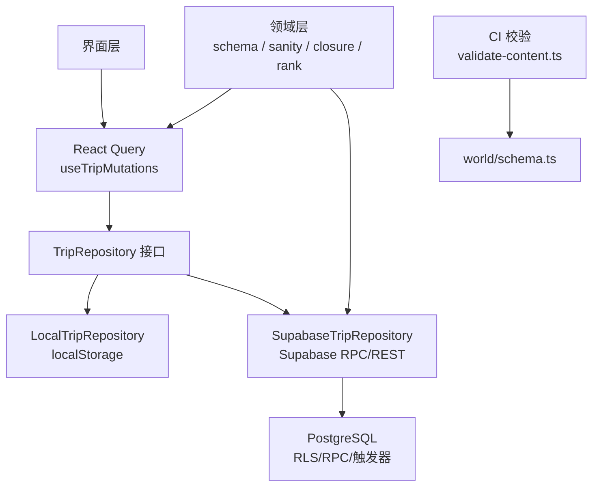
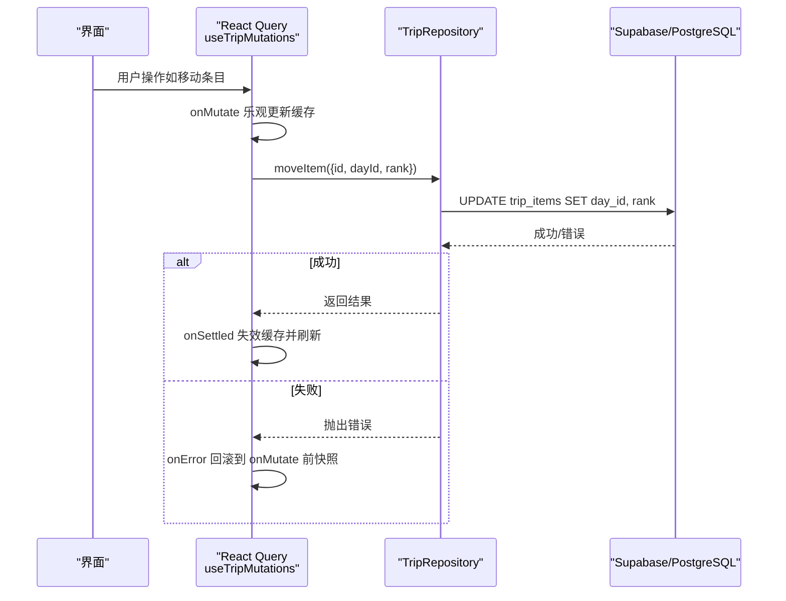
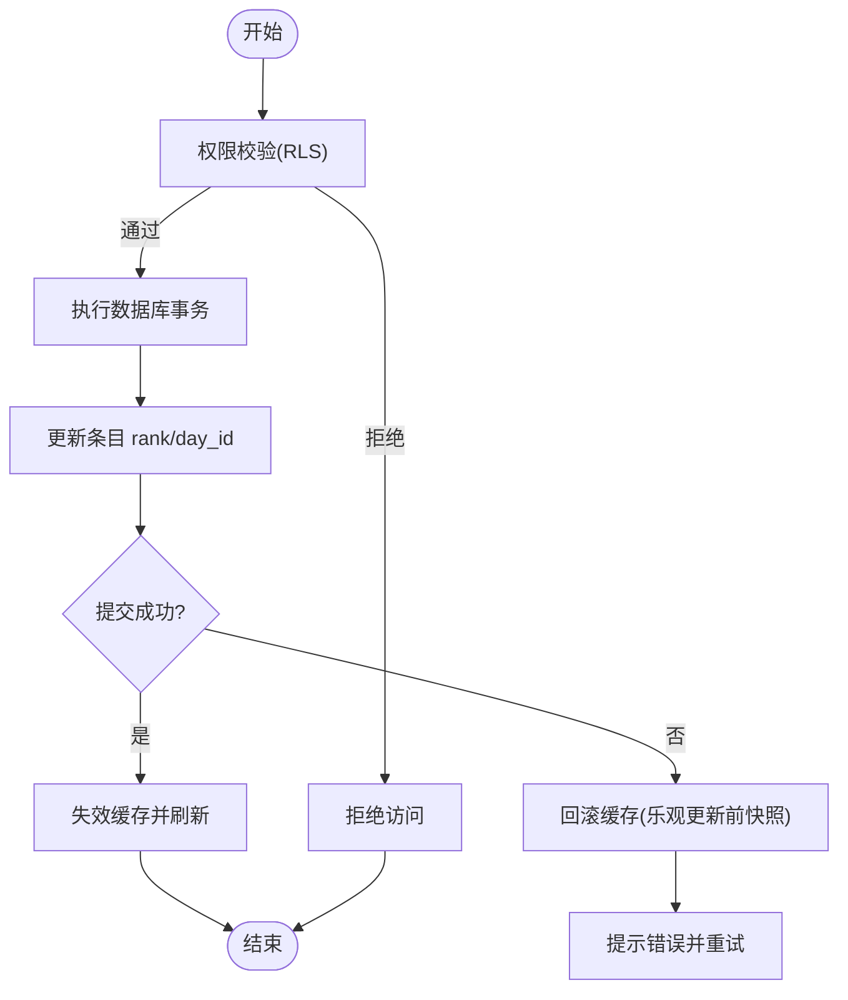
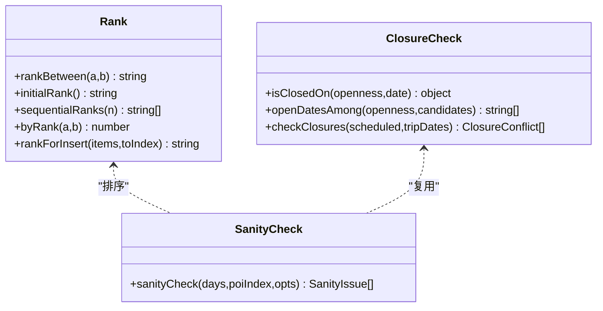
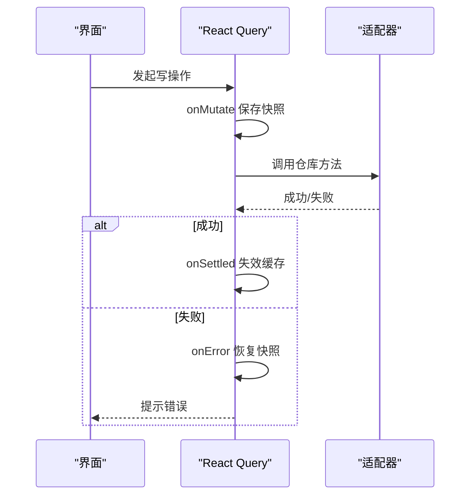
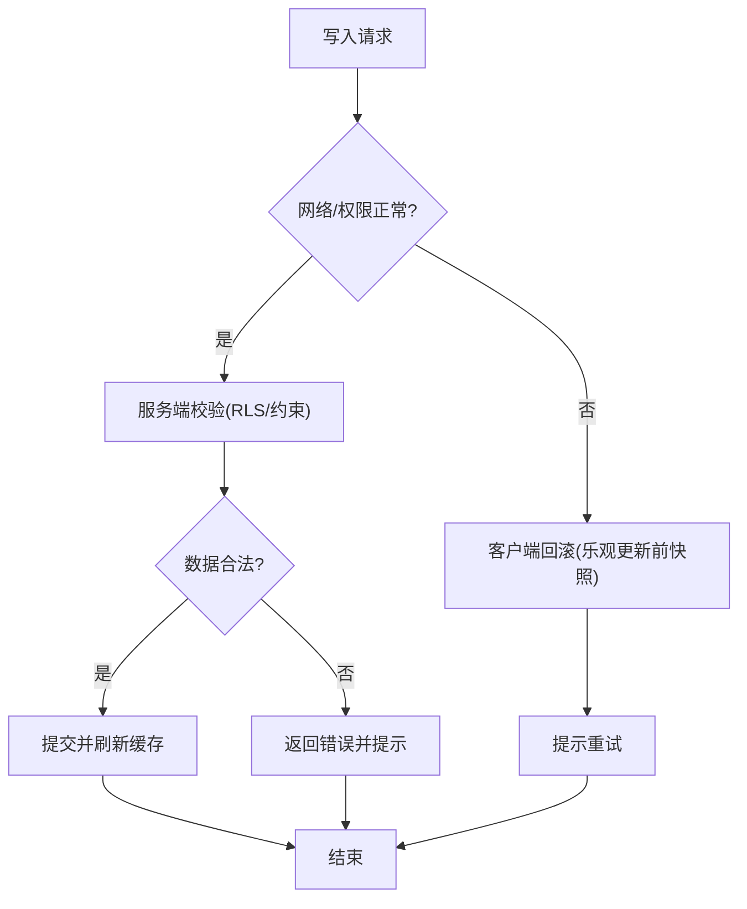
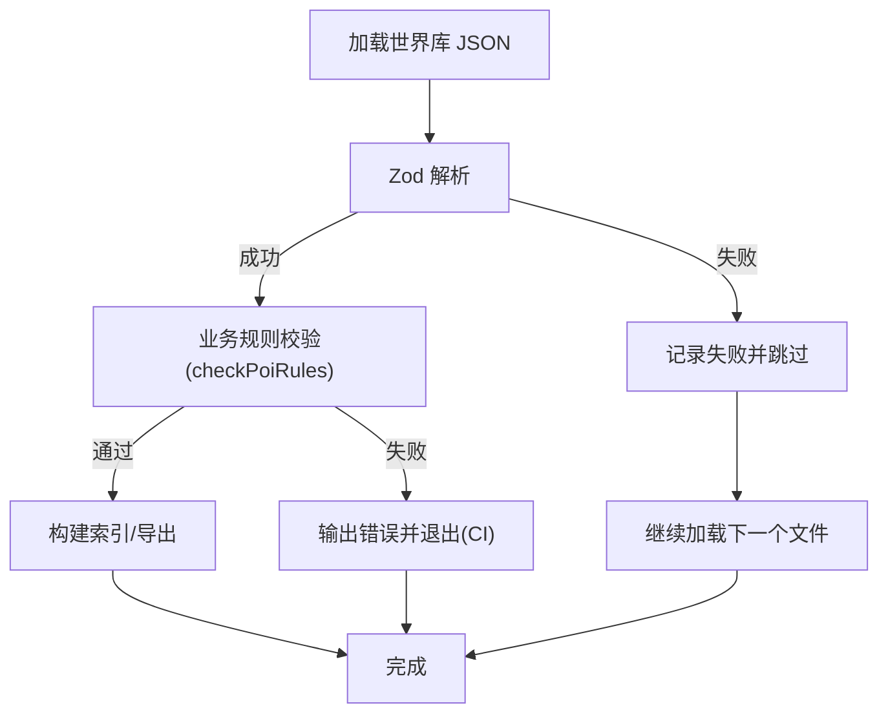
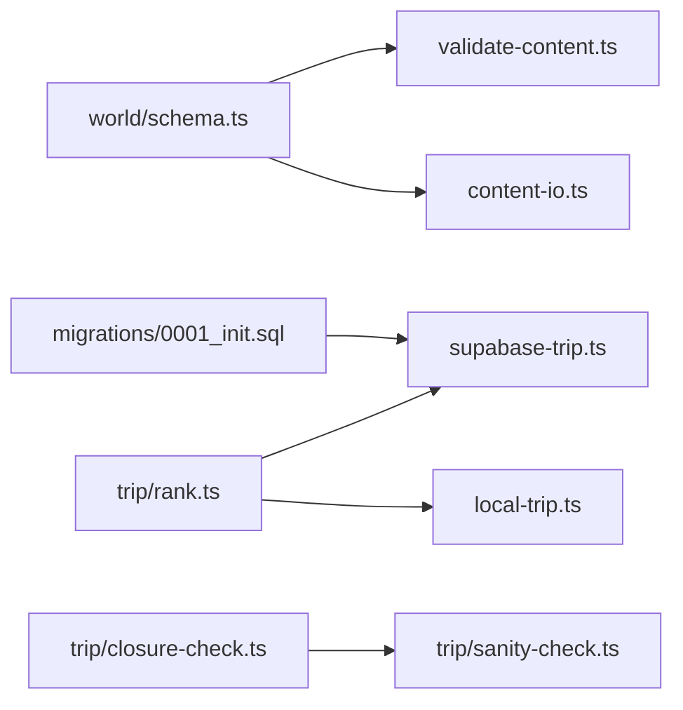

# 数据一致性保证

<cite>
**本文引用的文件**
- [src/data/adapters/supabase-trip.ts](file://src/data/adapters/supabase-trip.ts)
- [src/data/adapters/local-trip.ts](file://src/data/adapters/local-trip.ts)
- [src/features/trip/queries.ts](file://src/features/trip/queries.ts)
- [src/domain/world/schema.ts](file://src/domain/world/schema.ts)
- [supabase/migrations/0001_init.sql](file://supabase/migrations/0001_init.sql)
- [scripts/validate-content.ts](file://scripts/validate-content.ts)
- [src/domain/trip/rank.ts](file://src/domain/trip/rank.ts)
- [src/domain/trip/closure-check.ts](file://src/domain/trip/closure-check.ts)
- [src/domain/trip/sanity-check.ts](file://src/domain/trip/sanity-check.ts)
- [src/domain/world/staleness.ts](file://src/domain/world/staleness.ts)
- [scripts/content-io.ts](file://scripts/content-io.ts)
</cite>

## 目录
1. [引言](#引言)
2. [项目结构](#项目结构)
3. [核心组件](#核心组件)
4. [架构总览](#架构总览)
5. [详细组件分析](#详细组件分析)
6. [依赖关系分析](#依赖关系分析)
7. [性能考量](#性能考量)
8. [故障排查指南](#故障排查指南)
9. [结论](#结论)
10. [附录](#附录)

## 引言
本文件围绕“数据一致性保证”展开，聚焦以下目标：
- 事务处理机制：数据库事务、应用层事务、补偿操作。
- 版本控制策略：版本号管理、冲突检测、合并算法。
- 回滚机制：状态快照、撤销栈、部分回滚。
- 并发与异常处理：并发修改、网络异常、数据损坏的应对。
- 数据完整性验证与修复：结构化校验、业务规则校验、运行时降级与修复。

该旅行规划系统采用分层架构：领域层（纯函数与 schema）、数据适配层（本地与云端适配器）、特性层（React Query 封装写操作），并通过 Supabase 提供强一致性与权限控制。

## 项目结构
- 领域层：世界库 schema、行程合理性检查、闭馆日检查、分数序排序等。
- 数据层：TripRepository 接口 + LocalTripRepository（localStorage）与 SupabaseTripRepository（云端）。
- 特性层：useTripMutations 统一封装写操作，使用 React Query 实现乐观更新与失败回滚。
- 基础设施：Supabase 迁移定义表结构、RLS、RPC；CI 脚本进行内容校验。

图表来源
- [src/features/trip/queries.ts:45-235](file://src/features/trip/queries.ts#L45-L235)
- [src/data/adapters/supabase-trip.ts:141-524](file://src/data/adapters/supabase-trip.ts#L141-L524)
- [src/data/adapters/local-trip.ts:67-349](file://src/data/adapters/local-trip.ts#L67-L349)
- [supabase/migrations/0001_init.sql:51-530](file://supabase/migrations/0001_init.sql#L51-L530)
- [src/domain/world/schema.ts:1-317](file://src/domain/world/schema.ts#L1-L317)
- [scripts/validate-content.ts:1-76](file://scripts/validate-content.ts#L1-L76)

章节来源
- [src/features/trip/queries.ts:45-235](file://src/features/trip/queries.ts#L45-L235)
- [src/data/adapters/supabase-trip.ts:141-524](file://src/data/adapters/supabase-trip.ts#L141-L524)
- [src/data/adapters/local-trip.ts:67-349](file://src/data/adapters/local-trip.ts#L67-L349)
- [supabase/migrations/0001_init.sql:51-530](file://supabase/migrations/0001_init.sql#L51-L530)
- [src/domain/world/schema.ts:1-317](file://src/domain/world/schema.ts#L1-L317)
- [scripts/validate-content.ts:1-76](file://scripts/validate-content.ts#L1-L76)

## 核心组件
- 数据适配器：
  - SupabaseTripRepository：通过 RPC get_trip_bundle 一次性拉取全量数据，减少往返；写操作受 RLS 约束；费用分摊先删后写。
  - LocalTripRepository：基于 localStorage 的单机实现，结构与云端对齐，用于开发与演示。
- 写操作封装：
  - useTripMutations：统一乐观更新，onMutate 缓存快照，onError 回滚，onSettled 失效并刷新。
- 领域校验：
  - world/schema.ts：Zod schema 定义世界库数据结构与可验证字段。
  - sanity-check.ts：行程体检（闭馆、过满、折返、预约死线）。
  - closure-check.ts：闭馆日判断与建议日期。
  - rank.ts：分数序 rank，抗并发拖拽排序。
- 基础设施：
  - migrations/0001_init.sql：表结构、RLS、RPC、触发器、自动更新时间戳。
  - validate-content.ts：CI 门禁，结构+业务规则校验。

章节来源
- [src/data/adapters/supabase-trip.ts:141-524](file://src/data/adapters/supabase-trip.ts#L141-L524)
- [src/data/adapters/local-trip.ts:67-349](file://src/data/adapters/local-trip.ts#L67-L349)
- [src/features/trip/queries.ts:45-235](file://src/features/trip/queries.ts#L45-L235)
- [src/domain/world/schema.ts:1-317](file://src/domain/world/schema.ts#L1-L317)
- [src/domain/trip/sanity-check.ts:84-177](file://src/domain/trip/sanity-check.ts#L84-L177)
- [src/domain/trip/closure-check.ts:1-98](file://src/domain/trip/closure-check.ts#L1-L98)
- [src/domain/trip/rank.ts:1-91](file://src/domain/trip/rank.ts#L1-L91)
- [supabase/migrations/0001_init.sql:51-530](file://supabase/migrations/0001_init.sql#L51-L530)
- [scripts/validate-content.ts:1-76](file://scripts/validate-content.ts#L1-L76)

## 架构总览
系统以 Repository 抽象屏蔽存储差异，UI 通过 React Query 做查询缓存与写操作的乐观更新。云端侧由 Supabase 提供强一致的事务能力（SQL 事务、RLS、触发器、RPC），本地侧用 localStorage 提供离线开发体验。

图表来源
- [src/features/trip/queries.ts:105-119](file://src/features/trip/queries.ts#L105-L119)
- [src/data/adapters/supabase-trip.ts:336-338](file://src/data/adapters/supabase-trip.ts#L336-L338)
- [supabase/migrations/0001_init.sql:110-128](file://supabase/migrations/0001_init.sql#L110-L128)

## 详细组件分析

### 事务处理机制
- 数据库事务
  - 分享克隆：clone_trip_from_share 在单个 SQL 函数内完成 trips/trip_days/trip_items 插入，保证原子性。
  - 自动维护 updated_at：触发器在更新时自动设置时间戳，避免客户端不一致。
  - RLS 行级安全：所有写操作受 is_trip_member/is_trip_owner 约束，未登录或无权限直接拒绝。
- 应用层事务
  - 费用分摊 upsertExpense：先删除 expense_shares，再插入新份额；若中间失败，上层会回滚缓存并提示重试。
  - 邀请加入 join_trip_by_token：幂等加入，支持认领幽灵成员，计数自增。
- 补偿操作
  - 本地 adapter 的 removeDay：将条目退回候选池而非删除，避免误删用户积累的点。
  - 云端 adapter 的 removeItem：级联删除 item_votes，tickets.item_id 置空，保持引用完整。

图表来源
- [supabase/migrations/0001_init.sql:272-285](file://supabase/migrations/0001_init.sql#L272-L285)
- [supabase/migrations/0001_init.sql:393-427](file://supabase/migrations/0001_init.sql#L393-L427)
- [supabase/migrations/0001_init.sql:477-518](file://supabase/migrations/0001_init.sql#L477-L518)
- [src/data/adapters/supabase-trip.ts:473-518](file://src/data/adapters/supabase-trip.ts#L473-L518)
- [src/features/trip/queries.ts:50-63](file://src/features/trip/queries.ts#L50-L63)

章节来源
- [supabase/migrations/0001_init.sql:272-285](file://supabase/migrations/0001_init.sql#L272-L285)
- [supabase/migrations/0001_init.sql:393-427](file://supabase/migrations/0001_init.sql#L393-L427)
- [supabase/migrations/0001_init.sql:477-518](file://supabase/migrations/0001_init.sql#L477-L518)
- [src/data/adapters/supabase-trip.ts:473-518](file://src/data/adapters/supabase-trip.ts#L473-L518)
- [src/features/trip/queries.ts:50-63](file://src/features/trip/queries.ts#L50-L63)

### 版本控制策略
- 版本号管理
  - shares.version：分享快照的版本号，便于后续扩展兼容。
  - updatedAt：各表自动维护更新时间，作为轻量级版本标记。
- 冲突检测
  - 闭馆冲突：closure-check 根据 POI.openness 检测周末/固定闭馆/季节性闭馆。
  - 行程体检：sanity-check 检测过满、折返、预约死线。
- 合并算法
  - 分数序 rank：rankBetween 计算中点，仅更新被拖动项，天然抗并发；initialRank 居中便于两侧插入。
  - 无脑跟随：clone_trip_from_share 在服务端事务内复制日程，重置状态为 candidate，避免票券/账本污染。

图表来源
- [src/domain/trip/rank.ts:1-91](file://src/domain/trip/rank.ts#L1-L91)
- [src/domain/trip/closure-check.ts:1-98](file://src/domain/trip/closure-check.ts#L1-L98)
- [src/domain/trip/sanity-check.ts:84-177](file://src/domain/trip/sanity-check.ts#L84-L177)

章节来源
- [src/domain/trip/rank.ts:1-91](file://src/domain/trip/rank.ts#L1-L91)
- [src/domain/trip/closure-check.ts:1-98](file://src/domain/trip/closure-check.ts#L1-L98)
- [src/domain/trip/sanity-check.ts:84-177](file://src/domain/trip/sanity-check.ts#L84-L177)
- [supabase/migrations/0001_init.sql:477-518](file://supabase/migrations/0001_init.sql#L477-L518)

### 回滚机制的实现
- 状态快照
  - React Query 的 optimistic 在 onMutate 时保存当前 TripBundle 快照。
- 撤销栈
  - 每个 mutation 的 onError 调用 rollback(ctx)，将缓存恢复到快照。
- 部分回滚
  - 本地 adapter 的 removeDay 不删除条目，而是将 dayId 置空退回候选池，避免误删。
  - 云端 adapter 的 removeItem 级联清理 votes 与 tickets 引用，保持数据一致。

图表来源
- [src/features/trip/queries.ts:50-63](file://src/features/trip/queries.ts#L50-L63)
- [src/data/adapters/local-trip.ts:189-196](file://src/data/adapters/local-trip.ts#L189-L196)
- [src/data/adapters/supabase-trip.ts:340-343](file://src/data/adapters/supabase-trip.ts#L340-L343)

章节来源
- [src/features/trip/queries.ts:50-63](file://src/features/trip/queries.ts#L50-L63)
- [src/data/adapters/local-trip.ts:189-196](file://src/data/adapters/local-trip.ts#L189-L196)
- [src/data/adapters/supabase-trip.ts:340-343](file://src/data/adapters/supabase-trip.ts#L340-L343)

### 并发修改、网络异常、数据损坏的处理
- 并发修改
  - 分数序 rank：避免重写整段序号，降低冲突概率。
  - RLS：确保只有成员可读写，防止越权并发。
- 网络异常
  - 乐观更新 + 失败回滚：onError 恢复缓存，用户感知流畅。
  - 超时/权限错误：Supabase 返回 FORBIDDEN 时上层提示登录。
- 数据损坏
  - Zod schema：CI 与运行时双重校验，结构异常降级渲染。
  - 本地数据兼容：LocalTripRepository 对旧档补齐缺失字段（kind、splitMode、images）。

图表来源
- [src/features/trip/queries.ts:50-63](file://src/features/trip/queries.ts#L50-L63)
- [src/data/adapters/supabase-trip.ts:159-166](file://src/data/adapters/supabase-trip.ts#L159-L166)
- [src/data/adapters/local-trip.ts:97-115](file://src/data/adapters/local-trip.ts#L97-L115)
- [src/domain/world/schema.ts:1-317](file://src/domain/world/schema.ts#L1-L317)

章节来源
- [src/features/trip/queries.ts:50-63](file://src/features/trip/queries.ts#L50-L63)
- [src/data/adapters/supabase-trip.ts:159-166](file://src/data/adapters/supabase-trip.ts#L159-L166)
- [src/data/adapters/local-trip.ts:97-115](file://src/data/adapters/local-trip.ts#L97-L115)
- [src/domain/world/schema.ts:1-317](file://src/domain/world/schema.ts#L1-L317)

### 数据完整性验证与修复策略
- 结构化校验
  - world/schema.ts：定义 IsoDate、HttpsUrl、Verifiable、LatLng 等基础类型，POI/City/Country 严格校验。
  - scripts/validate-content.ts：CI 阶段加载 JSON，按 schema 解析并运行业务规则 checkPoiRules。
- 业务规则校验
  - 坐标边界框：检测经纬度是否在国家范围内。
  - 时长区间：下限不得大于上限。
  - 高热度博物馆必须配备深导览。
  - 易变字段时效：verifiedAt 不得晚于今天，超过 180 天警告。
- 运行时降级
  - content-io.ts：JSON 解析失败记录 failures，继续加载其他文件。
  - 本地 adapter 对历史数据补齐缺失字段，避免渲染崩溃。

图表来源
- [scripts/content-io.ts:56-91](file://scripts/content-io.ts#L56-L91)
- [scripts/validate-content.ts:20-76](file://scripts/validate-content.ts#L20-L76)
- [src/domain/world/schema.ts:263-317](file://src/domain/world/schema.ts#L263-L317)

章节来源
- [scripts/content-io.ts:56-91](file://scripts/content-io.ts#L56-L91)
- [scripts/validate-content.ts:20-76](file://scripts/validate-content.ts#L20-L76)
- [src/domain/world/schema.ts:263-317](file://src/domain/world/schema.ts#L263-L317)

## 依赖关系分析
- 领域层依赖：
  - sanity-check 依赖 closure-check 与 date 工具。
  - world/schema 被 validate-content 与运行时解析共用。
- 数据层依赖：
  - SupabaseTripRepository 依赖 domain/trip/rank 计算 rank。
  - LocalTripRepository 同样依赖 rank 与初始值。
- 基础设施依赖：
  - migrations 定义表、RLS、RPC，被 SupabaseTripRepository 调用。
  - validate-content 依赖 schema 与 content-io。

图表来源
- [src/domain/world/schema.ts:1-317](file://src/domain/world/schema.ts#L1-L317)
- [scripts/validate-content.ts:1-76](file://scripts/validate-content.ts#L1-L76)
- [scripts/content-io.ts:56-91](file://scripts/content-io.ts#L56-L91)
- [src/domain/trip/rank.ts:1-91](file://src/domain/trip/rank.ts#L1-L91)
- [src/data/adapters/supabase-trip.ts:141-524](file://src/data/adapters/supabase-trip.ts#L141-L524)
- [src/data/adapters/local-trip.ts:67-349](file://src/data/adapters/local-trip.ts#L67-L349)
- [supabase/migrations/0001_init.sql:51-530](file://supabase/migrations/0001_init.sql#L51-L530)

章节来源
- [src/domain/world/schema.ts:1-317](file://src/domain/world/schema.ts#L1-L317)
- [scripts/validate-content.ts:1-76](file://scripts/validate-content.ts#L1-L76)
- [scripts/content-io.ts:56-91](file://scripts/content-io.ts#L56-L91)
- [src/domain/trip/rank.ts:1-91](file://src/domain/trip/rank.ts#L1-L91)
- [src/data/adapters/supabase-trip.ts:141-524](file://src/data/adapters/supabase-trip.ts#L141-L524)
- [src/data/adapters/local-trip.ts:67-349](file://src/data/adapters/local-trip.ts#L67-L349)
- [supabase/migrations/0001_init.sql:51-530](file://supabase/migrations/0001_init.sql#L51-L530)

## 性能考量
- 一次性 Bundle：get_trip_bundle 减少多次往返，提升首屏与交互响应。
- 乐观更新：拖拽排程即时反馈，失败再回滚，避免卡顿。
- 分数序 rank：避免批量更新序号，降低锁竞争与网络开销。
- 静态资源与缓存：世界库数据 staleTime 较长，减少重复请求。

[本节为通用指导，无需具体文件分析]

## 故障排查指南
- 权限问题
  - 现象：RPC 返回 FORBIDDEN。
  - 原因：非成员或未登录。
  - 处理：提示登录或检查成员资格。
- 外键约束
  - 现象：删除成员报错 23503。
  - 原因：该成员有账本记录。
  - 处理：先处理账目再移除。
- 数据损坏
  - 现象：JSON 解析失败。
  - 原因：文件格式错误或字段缺失。
  - 处理：CI 记录 failures，运行时降级渲染。
- 闭馆冲突
  - 现象：行程体检提示闭馆。
  - 原因：POI 在该日期关闭。
  - 处理：根据建议改期或移出行程。

章节来源
- [src/data/adapters/supabase-trip.ts:159-166](file://src/data/adapters/supabase-trip.ts#L159-L166)
- [src/data/adapters/supabase-trip.ts:355-364](file://src/data/adapters/supabase-trip.ts#L355-L364)
- [scripts/content-io.ts:56-91](file://scripts/content-io.ts#L56-L91)
- [src/domain/trip/closure-check.ts:73-98](file://src/domain/trip/closure-check.ts#L73-L98)

## 结论
该系统通过分层架构与多重重保障实现数据一致性：
- 数据库层：事务、RLS、触发器确保强一致与权限控制。
- 应用层：乐观更新与失败回滚提升用户体验与健壮性。
- 领域层：schema 与业务规则校验预防数据错误。
- 并发与异常：分数序 rank 与 RLS 降低冲突，网络异常时回滚缓存。
- 版本与合并：shares.version 与 updatedAt 辅助版本管理，clone_trip_from_share 提供可靠合并。

这些机制共同保障了旅行规划数据在协作、离线、云端等多场景下的一致性与可靠性。

[本节为总结，无需具体文件分析]

## 附录
- 关键流程参考路径
  - 写操作乐观更新与回滚：[src/features/trip/queries.ts:50-63](file://src/features/trip/queries.ts#L50-L63)
  - 费用分摊事务：[src/data/adapters/supabase-trip.ts:473-518](file://src/data/adapters/supabase-trip.ts#L473-L518)
  - 分享克隆事务：[supabase/migrations/0001_init.sql:477-518](file://supabase/migrations/0001_init.sql#L477-L518)
  - 闭馆检测与建议：[src/domain/trip/closure-check.ts:73-98](file://src/domain/trip/closure-check.ts#L73-L98)
  - 行程体检：[src/domain/trip/sanity-check.ts:84-177](file://src/domain/trip/sanity-check.ts#L84-L177)
  - 分数序排序：[src/domain/trip/rank.ts:57-91](file://src/domain/trip/rank.ts#L57-L91)
  - 世界库 schema：[src/domain/world/schema.ts:1-317](file://src/domain/world/schema.ts#L1-L317)
  - CI 校验：[scripts/validate-content.ts:20-76](file://scripts/validate-content.ts#L20-L76)

[本节为附录，无需具体文件分析]