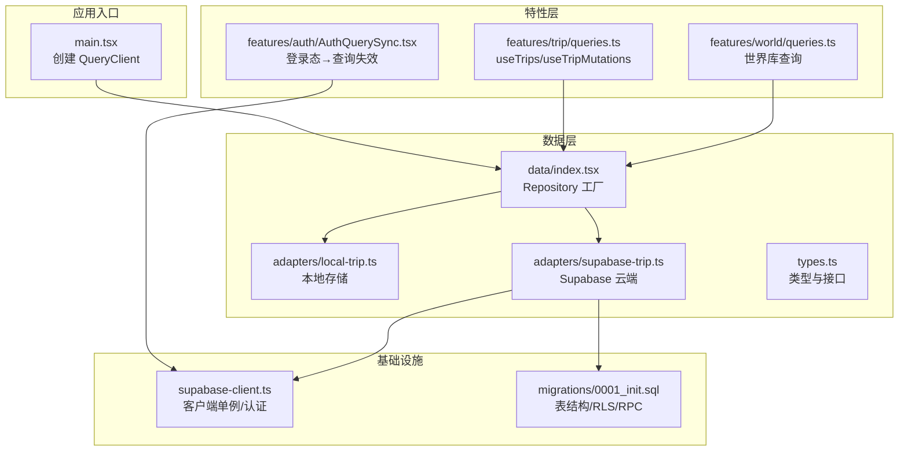
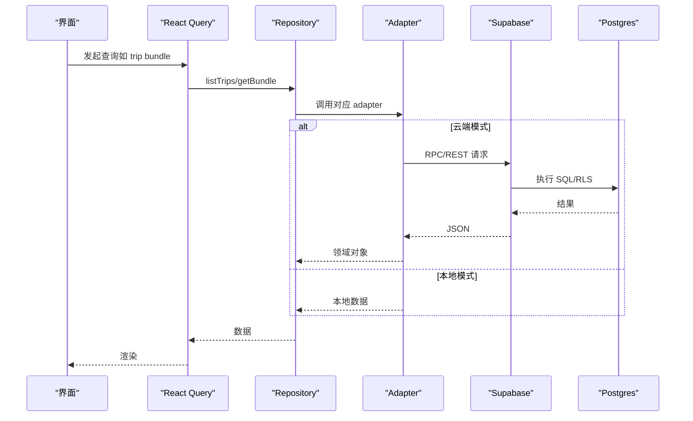
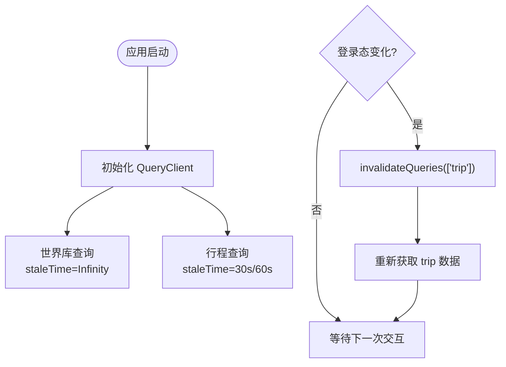
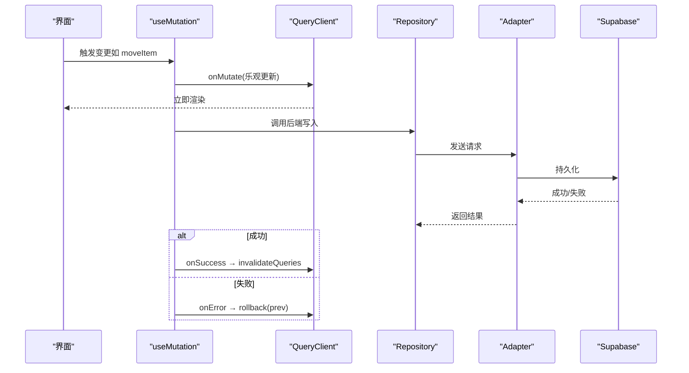
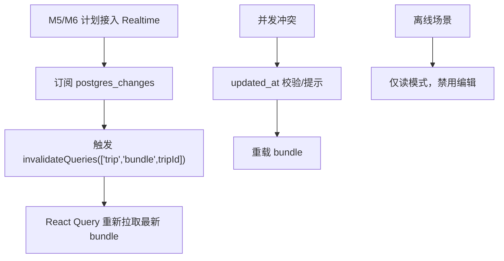
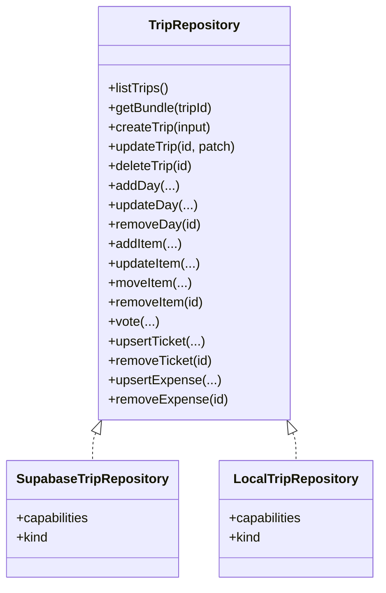
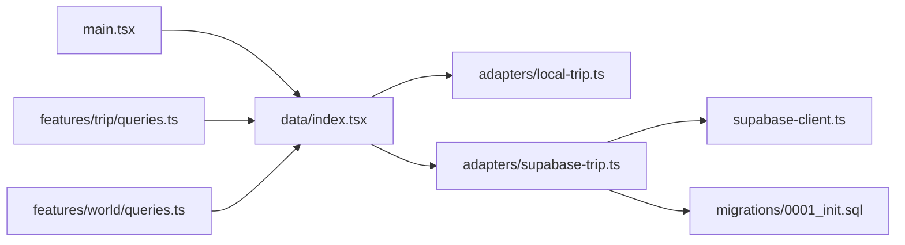

# 数据同步机制

<cite>
**本文引用的文件**
- [src/app/main.tsx](file://src/app/main.tsx)
- [src/data/supabase-client.ts](file://src/data/supabase-client.ts)
- [src/features/auth/AuthQuerySync.tsx](file://src/features/auth/AuthQuerySync.tsx)
- [src/features/trip/queries.ts](file://src/features/trip/queries.ts)
- [src/features/world/queries.ts](file://src/features/world/queries.ts)
- [src/data/index.tsx](file://src/data/index.tsx)
- [src/data/adapters/supabase-trip.ts](file://src/data/adapters/supabase-trip.ts)
- [src/data/adapters/local-trip.ts](file://src/data/adapters/local-trip.ts)
- [src/data/types.ts](file://src/data/types.ts)
- [supabase/migrations/0001_init.sql](file://supabase/migrations/0001_init.sql)
- [vite.config.ts](file://vite.config.ts)
- [docs/技术方案.md](file://docs/技术方案.md)
</cite>

## 目录
1. [简介](#简介)
2. [项目结构](#项目结构)
3. [核心组件](#核心组件)
4. [架构总览](#架构总览)
5. [详细组件分析](#详细组件分析)
6. [依赖关系分析](#依赖关系分析)
7. [性能考量](#性能考量)
8. [故障排查指南](#故障排查指南)
9. [结论](#结论)
10. [附录](#附录)

## 简介
本文件围绕“数据同步机制”展开，系统性说明：
- React Query 的集成与使用：查询配置、缓存策略、乐观更新。
- Supabase 实时同步的实现现状与规划：订阅机制、冲突解决、离线支持。
- 数据一致性保证：事务处理、回滚机制、版本控制。
- 具体实践：CRUD 操作、网络异常处理、查询性能优化。
- 调试技巧与性能监控方法。

## 项目结构
本项目采用分层架构与 Repository 抽象，视图层通过 hooks 调用仓库接口，仓库在运行时根据环境选择本地或云端实现；React Query 作为统一缓存层，负责查询与变更的生命周期管理。

图表来源
- [src/app/main.tsx:1-37](file://src/app/main.tsx#L1-L37)
- [src/data/index.tsx:1-56](file://src/data/index.tsx#L1-L56)
- [src/features/trip/queries.ts:1-236](file://src/features/trip/queries.ts#L1-L236)
- [src/features/world/queries.ts:1-62](file://src/features/world/queries.ts#L1-L62)
- [src/features/auth/AuthQuerySync.tsx:1-26](file://src/features/auth/AuthQuerySync.tsx#L1-L26)
- [src/data/supabase-client.ts:1-106](file://src/data/supabase-client.ts#L1-L106)
- [supabase/migrations/0001_init.sql:1-530](file://supabase/migrations/0001_init.sql#L1-L530)

章节来源
- [src/app/main.tsx:1-37](file://src/app/main.tsx#L1-L37)
- [src/data/index.tsx:1-56](file://src/data/index.tsx#L1-L56)

## 核心组件
- React Query 客户端初始化与全局策略：关闭窗口聚焦重取、限制重试次数，避免不必要的刷新抖动。
- Repository 工厂：按是否配置 Supabase 动态切换本地或云端适配器，视图层无感知。
- 行程查询与变更：集中封装 useTrips、useTripBundle、useTripMutations，统一乐观更新与失效策略。
- 世界库查询：静态内容使用无限过期缓存，构建产物+SW 保障离线可用。
- Supabase 客户端与认证：提供会话监听、匿名/邮箱登录等能力，驱动云端模式可用。

章节来源
- [src/app/main.tsx:12-20](file://src/app/main.tsx#L12-L20)
- [src/data/index.tsx:21-29](file://src/data/index.tsx#L21-L29)
- [src/features/trip/queries.ts:17-39](file://src/features/trip/queries.ts#L17-L39)
- [src/features/world/queries.ts:5-11](file://src/features/world/queries.ts#L5-L11)
- [src/data/supabase-client.ts:24-34](file://src/data/supabase-client.ts#L24-L34)

## 架构总览
整体数据流遵循“视图 → React Query → Repository → Adapter → 后端/本地存储”，并通过 AuthQuerySync 将认证状态变化映射为查询失效，确保权限变更后数据即时刷新。

图表来源
- [src/features/trip/queries.ts:17-39](file://src/features/trip/queries.ts#L17-L39)
- [src/data/adapters/supabase-trip.ts:150-198](file://src/data/adapters/supabase-trip.ts#L150-L198)
- [src/data/adapters/local-trip.ts:89-115](file://src/data/adapters/local-trip.ts#L89-L115)
- [supabase/migrations/0001_init.sql:392-427](file://supabase/migrations/0001_init.sql#L392-L427)

## 详细组件分析

### React Query 集成与缓存策略
- 全局配置：在应用入口创建 QueryClient，设置默认重试次数与窗口聚焦行为，避免频繁刷新导致闪烁。
- 世界库查询：静态资源使用无限 staleTime/gcTime，配合 Service Worker 缓存，保证离线秒开。
- 行程查询：bundle 列表与详情分别设置合理的 staleTime，减少重复请求。
- 登录态同步：AuthQuerySync 监听 session 变化，对 ['trip'] 分组进行 invalidateQueries，确保权限变更后立即拉取新数据。

图表来源
- [src/app/main.tsx:16-20](file://src/app/main.tsx#L16-L20)
- [src/features/world/queries.ts:5-11](file://src/features/world/queries.ts#L5-L11)
- [src/features/trip/queries.ts:17-39](file://src/features/trip/queries.ts#L17-L39)
- [src/features/auth/AuthQuerySync.tsx:15-23](file://src/features/auth/AuthQuerySync.tsx#L15-L23)

章节来源
- [src/app/main.tsx:12-20](file://src/app/main.tsx#L12-L20)
- [src/features/world/queries.ts:5-11](file://src/features/world/queries.ts#L5-L11)
- [src/features/trip/queries.ts:17-39](file://src/features/trip/queries.ts#L17-L39)
- [src/features/auth/AuthQuerySync.tsx:1-26](file://src/features/auth/AuthQuerySync.tsx#L1-L26)

### 乐观更新与回滚机制
- 所有写操作集中在 useTripMutations，统一通过 onMutate 进行乐观更新，onError 回滚到之前快照，onSettled 统一失效相关查询键。
- 拖拽排序、投票、票券增删等高频交互均走乐观更新，提升响应性。
- 失败时自动恢复缓存，用户无感知。

图表来源
- [src/features/trip/queries.ts:45-236](file://src/features/trip/queries.ts#L45-L236)

章节来源
- [src/features/trip/queries.ts:45-236](file://src/features/trip/queries.ts#L45-L236)

### Supabase 实时同步现状与规划
- 当前实现：未在前端显式订阅 Supabase Realtime 事件；实时性由后续里程碑接管。
- 设计预留：技术方案明确 M5/M6 接入 Realtime，通过在 bundle 查询上订阅 postgres_changes 触发 invalidate，无需改动上层架构。
- 冲突解决：字段级最后写入胜出 + updated_at 版本提示；拖拽排序天然抗冲突（fractional index）。
- 离线支持：PWA 缓存策略对 supabase.co 域名强制 NetworkOnly，避免读到过期数据；行中离线只读，不自动同步写操作。

图表来源
- [docs/技术方案.md:422-429](file://docs/技术方案.md#L422-L429)
- [docs/技术方案.md:947-979](file://docs/技术方案.md#L947-L979)

章节来源
- [docs/技术方案.md:422-429](file://docs/技术方案.md#L422-L429)
- [docs/技术方案.md:947-979](file://docs/技术方案.md#L947-L979)

### 数据一致性：事务、回滚、版本控制
- 服务端事务：Supabase RPC get_trip_bundle 以 security definer 一次性聚合多表数据，减少往返并保证读取一致性。
- 写操作原子性：部分写（如 expense_shares）先删后插，非原子但受 RLS 保护；复杂业务可考虑在服务端函数内组合多个写操作。
- 版本控制：表级 updated_at 自动维护；未来可在写路径加入 optimistic concurrency check（WHERE updated_at = expected），失败则提示冲突并重载。
- 权限安全：RLS 基于 auth.uid() 控制读写，未登录无法访问敏感数据。

图表来源
- [src/data/types.ts:263-299](file://src/data/types.ts#L263-L299)
- [src/data/adapters/supabase-trip.ts:141-524](file://src/data/adapters/supabase-trip.ts#L141-L524)
- [src/data/adapters/local-trip.ts:67-200](file://src/data/adapters/local-trip.ts#L67-L200)

章节来源
- [supabase/migrations/0001_init.sql:392-427](file://supabase/migrations/0001_init.sql#L392-L427)
- [supabase/migrations/0001_init.sql:270-285](file://supabase/migrations/0001_init.sql#L270-L285)
- [src/data/adapters/supabase-trip.ts:150-198](file://src/data/adapters/supabase-trip.ts#L150-L198)

### CRUD 操作示例路径
- 创建行程：useCreateTrip → repo.createTrip → Supabase trips.insert
- 更新条目：useTripMutations.updateItem → repo.updateItem → Supabase trip_items.update
- 删除条目：useTripMutations.removeItem → repo.removeItem → Supabase trip_items.delete
- 投票：useTripMutations.vote → repo.vote → item_votes upsert/delete
- 票券：useTripMutations.upsertTicket/removeTicket → tickets insert/update/delete

章节来源
- [src/features/trip/queries.ts:32-39](file://src/features/trip/queries.ts#L32-L39)
- [src/features/trip/queries.ts:88-130](file://src/features/trip/queries.ts#L88-L130)
- [src/features/trip/queries.ts:137-148](file://src/features/trip/queries.ts#L137-L148)
- [src/features/trip/queries.ts:188-216](file://src/features/trip/queries.ts#L188-L216)
- [src/data/adapters/supabase-trip.ts:200-218](file://src/data/adapters/supabase-trip.ts#L200-L218)
- [src/data/adapters/supabase-trip.ts:310-334](file://src/data/adapters/supabase-trip.ts#L310-L334)
- [src/data/adapters/supabase-trip.ts:340-343](file://src/data/adapters/supabase-trip.ts#L340-L343)
- [src/data/adapters/supabase-trip.ts:415-436](file://src/data/adapters/supabase-trip.ts#L415-L436)
- [src/data/adapters/supabase-trip.ts:438-471](file://src/data/adapters/supabase-trip.ts#L438-L471)

### 网络异常处理
- 查询重试：全局 retry=1，避免反复重试造成雪崩。
- 错误透传：adapter 中若遇到 FORBIDDEN（权限问题），直接抛出错误，由上层提示登录。
- 乐观更新回滚：mutation.onError 回调中恢复缓存，保持 UI 一致。
- PWA 策略：supabase.co 域名强制 NetworkOnly，避免缓存过期数据。

章节来源
- [src/app/main.tsx:16-20](file://src/app/main.tsx#L16-L20)
- [src/data/adapters/supabase-trip.ts:159-166](file://src/data/adapters/supabase-trip.ts#L159-L166)
- [src/features/trip/queries.ts:61-63](file://src/features/trip/queries.ts#L61-L63)
- [docs/技术方案.md:947-960](file://docs/技术方案.md#L947-L960)

### 查询性能优化
- 全量聚合：get_trip_bundle RPC 一次返回 trip、members、days、items、votes、tickets、expenses 等，减少多次往返。
- 合理 staleTime：列表 60s、详情 30s，平衡新鲜度与请求频率。
- 静态内容缓存：世界库查询使用 Infinity 过期，结合 SW 缓存。
- 代码分割：将 react-query 单独打包为 vendor chunk，减小首屏体积。

章节来源
- [supabase/migrations/0001_init.sql:392-427](file://supabase/migrations/0001_init.sql#L392-L427)
- [src/features/trip/queries.ts:17-29](file://src/features/trip/queries.ts#L17-L29)
- [src/features/world/queries.ts:5-11](file://src/features/world/queries.ts#L5-L11)
- [vite.config.ts:25-28](file://vite.config.ts#L25-L28)

## 依赖关系分析
- main.tsx 提供 QueryClient 与 RepositoryProvider，贯穿全局。
- data/index.tsx 根据环境变量决定使用 SupabaseTripRepository 或 LocalTripRepository。
- features/trip/queries.ts 依赖 useTripRepo 与 React Query，封装所有行程相关的查询与变更。
- adapters/supabase-trip.ts 依赖 supabase-client 与数据库迁移定义的类型与约束。
- migrations/0001_init.sql 定义了表结构、RLS、RPC，是数据一致性与权限的基础。

图表来源
- [src/app/main.tsx:1-37](file://src/app/main.tsx#L1-L37)
- [src/data/index.tsx:1-56](file://src/data/index.tsx#L1-L56)
- [src/features/trip/queries.ts:1-236](file://src/features/trip/queries.ts#L1-L236)
- [src/features/world/queries.ts:1-62](file://src/features/world/queries.ts#L1-L62)
- [src/data/adapters/supabase-trip.ts:1-548](file://src/data/adapters/supabase-trip.ts#L1-L548)
- [src/data/supabase-client.ts:1-106](file://src/data/supabase-client.ts#L1-L106)
- [supabase/migrations/0001_init.sql:1-530](file://supabase/migrations/0001_init.sql#L1-L530)

章节来源
- [src/data/index.tsx:21-29](file://src/data/index.tsx#L21-L29)
- [src/data/adapters/supabase-trip.ts:141-148](file://src/data/adapters/supabase-trip.ts#L141-L148)

## 性能考量
- 减少网络往返：通过 RPC 聚合数据，避免多次 REST 调用。
- 合理缓存：世界库无限缓存，行程数据短期缓存，降低带宽与服务器压力。
- 前端渲染：乐观更新提升交互流畅度，避免等待网络往返。
- 构建优化：react-query 独立分包，减少主包体积。

[本节为通用指导，不直接分析具体文件]

## 故障排查指南
- 登录后列表为空：检查 AuthQuerySync 是否正确失效 ['trip'] 分组；确认 RLS 策略允许当前用户访问。
- 写操作失败：查看 adapter 抛出的错误信息；expense 分摊先删后插可能因外键约束失败。
- 离线不可写：确认 capabilities.canWrite 为 false 时禁用编辑入口；行中只读模式符合预期。
- 实时不同步：当前未启用 Realtime 订阅；待 M5/M6 接入后通过 postgres_changes 触发刷新。

章节来源
- [src/features/auth/AuthQuerySync.tsx:15-23](file://src/features/auth/AuthQuerySync.tsx#L15-L23)
- [src/data/adapters/supabase-trip.ts:355-364](file://src/data/adapters/supabase-trip.ts#L355-L364)
- [docs/技术方案.md:947-979](file://docs/技术方案.md#L947-L979)
- [docs/技术方案.md:422-429](file://docs/技术方案.md#L422-L429)

## 结论
本项目通过 Repository 抽象与 React Query 缓存层，实现了清晰的数据流与良好的用户体验。当前已具备完善的本地与云端双适配、乐观更新、权限控制与基础缓存策略；实时同步与冲突处理将在后续里程碑中接入，届时仅需在查询层增加订阅与失效逻辑即可无缝升级。

[本节为总结性内容，不直接分析具体文件]

## 附录
- 关键配置位置：
  - React Query 全局配置：[src/app/main.tsx:16-20](file://src/app/main.tsx#L16-L20)
  - 世界库缓存策略：[src/features/world/queries.ts:5-11](file://src/features/world/queries.ts#L5-L11)
  - 行程查询与变更：[src/features/trip/queries.ts:17-236](file://src/features/trip/queries.ts#L17-L236)
  - Supabase 客户端与认证：[src/data/supabase-client.ts:24-106](file://src/data/supabase-client.ts#L24-L106)
  - 数据库结构与权限：[supabase/migrations/0001_init.sql:1-530](file://supabase/migrations/0001_init.sql#L1-L530)

[本节为索引性内容，不直接分析具体文件]