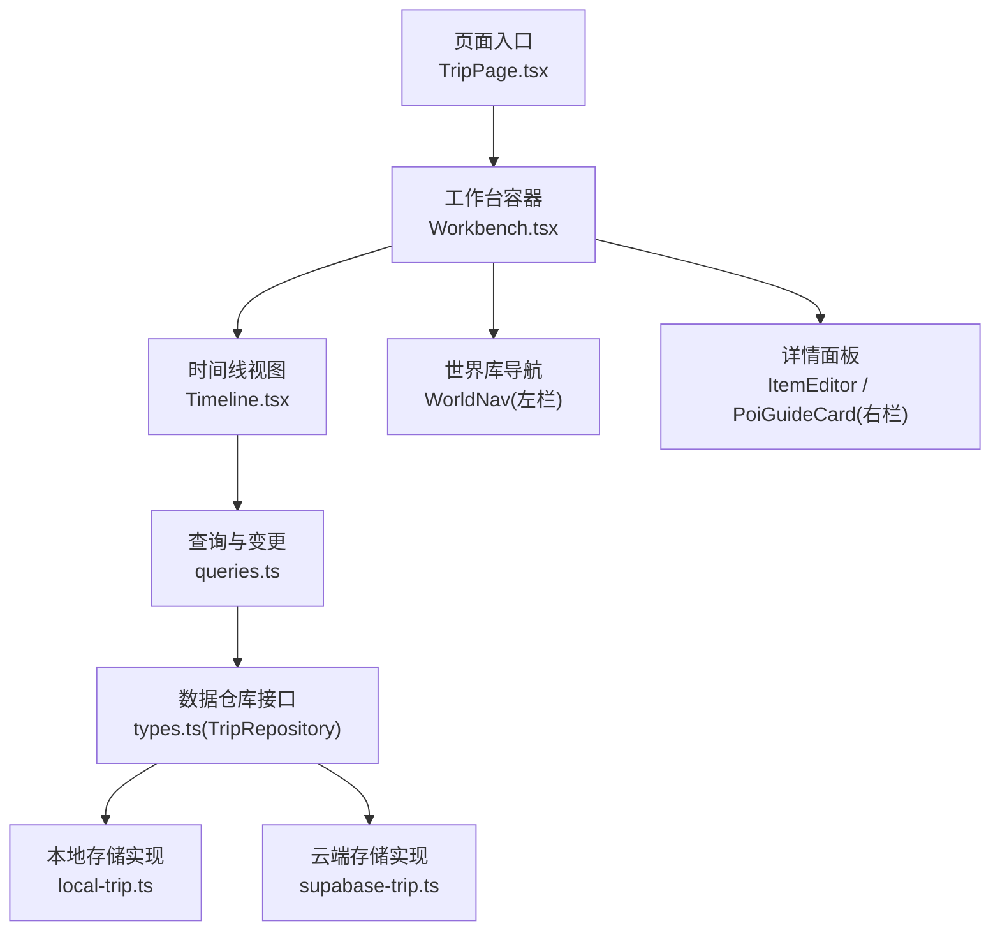
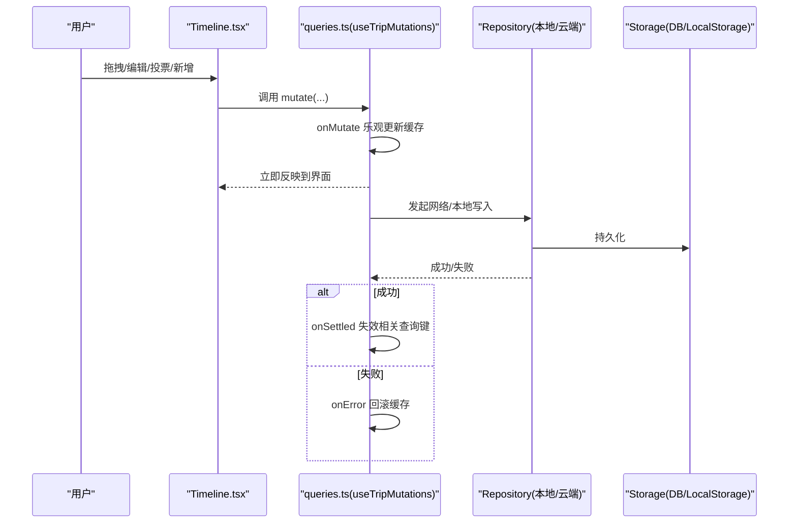
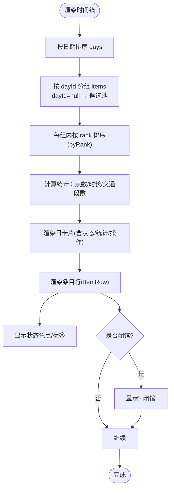
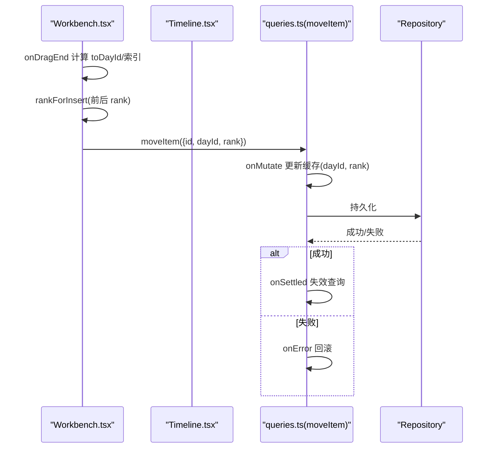
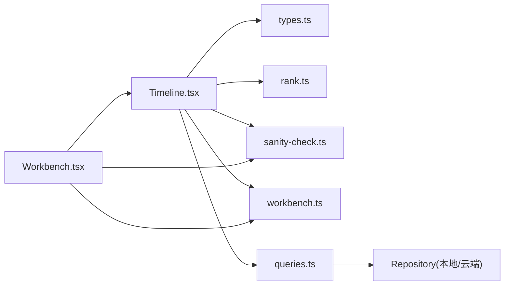

# 时间线管理

<cite>
**本文引用的文件**
- [Timeline.tsx](file://src/features/trip/Timeline.tsx)
- [Workbench.tsx](file://src/features/trip/Workbench.tsx)
- [queries.ts](file://src/features/trip/queries.ts)
- [local-trip.ts](file://src/data/adapters/local-trip.ts)
- [supabase-trip.ts](file://src/data/adapters/supabase-trip.ts)
- [types.ts](file://src/data/types.ts)
- [rank.ts](file://src/domain/trip/rank.ts)
- [sanity-check.ts](file://src/domain/trip/sanity-check.ts)
- [workbench.ts](file://src/store/workbench.ts)
- [TripPage.tsx](file://src/pages/TripPage.tsx)
</cite>

## 目录
1. [简介](#简介)
2. [项目结构](#项目结构)
3. [核心组件](#核心组件)
4. [架构总览](#架构总览)
5. [详细组件分析](#详细组件分析)
6. [依赖关系分析](#依赖关系分析)
7. [性能考量](#性能考量)
8. [故障排查指南](#故障排查指南)
9. [结论](#结论)
10. [附录：操作示例与最佳实践](#附录：操作示例与最佳实践)

## 简介
本文件面向“时间线管理”功能，系统性说明时间线的渲染逻辑（按日期分组、景点排序、状态显示）、与后端的数据同步机制（useTripBundle 查询、实时更新、缓存策略）、交互能力（点击选择、批量操作、状态切换），并提供添加、删除、移动时间线项目的具体代码路径与最佳实践。同时覆盖错误处理、加载状态与空状态的处理方式。

## 项目结构
时间线位于工作台的中栏，左右分别为世界库与详情面板；数据通过 useTripBundle 获取 TripBundle，写操作统一走 useTripMutations 的乐观更新；本地开发使用 localStorage 适配器，生产环境切换到 Supabase 适配器。

图表来源
- [TripPage.tsx:41-140](file://src/pages/TripPage.tsx#L41-L140)
- [Workbench.tsx:49-283](file://src/features/trip/Workbench.tsx#L49-L283)
- [Timeline.tsx:496-702](file://src/features/trip/Timeline.tsx#L496-L702)
- [queries.ts:22-236](file://src/features/trip/queries.ts#L22-L236)
- [types.ts:263-299](file://src/data/types.ts#L263-L299)
- [local-trip.ts:67-349](file://src/data/adapters/local-trip.ts#L67-L349)
- [supabase-trip.ts:141-524](file://src/data/adapters/supabase-trip.ts#L141-L524)

章节来源
- [TripPage.tsx:41-140](file://src/pages/TripPage.tsx#L41-L140)
- [Workbench.tsx:49-283](file://src/features/trip/Workbench.tsx#L49-L283)
- [Timeline.tsx:496-702](file://src/features/trip/Timeline.tsx#L496-L702)

## 核心组件
- Timeline：时间线主视图，负责按日期分组、条目排序、状态显示、拖拽落位、候选池、地图懒加载、问题提示等。
- Workbench：三栏工作台容器，承载全局拖拽上下文、计算合理性体检结果、联动左右栏。
- queries：React Query 封装，提供 useTripBundle 查询与 useTripMutations 写操作（全部乐观更新）。
- adapters：数据层适配，LocalTripRepository（localStorage）与 SupabaseTripRepository（云端），对外暴露统一 TripRepository 接口。
- domain：排序 rank（分数序）、合理性检查 sanity-check（闭馆、过满、折返、预约死线）。
- store：工作区状态 workbench（选中日期、详情面板多态、筛选条件持久化）。

章节来源
- [Timeline.tsx:77-702](file://src/features/trip/Timeline.tsx#L77-L702)
- [Workbench.tsx:49-414](file://src/features/trip/Workbench.tsx#L49-L414)
- [queries.ts:22-236](file://src/features/trip/queries.ts#L22-L236)
- [local-trip.ts:67-349](file://src/data/adapters/local-trip.ts#L67-L349)
- [supabase-trip.ts:141-524](file://src/data/adapters/supabase-trip.ts#L141-L524)
- [rank.ts:1-91](file://src/domain/trip/rank.ts#L1-L91)
- [sanity-check.ts:84-177](file://src/domain/trip/sanity-check.ts#L84-L177)
- [workbench.ts:1-77](file://src/store/workbench.ts#L1-L77)

## 架构总览
时间线采用“查询-变更分离 + 乐观更新”的架构：
- 读：useTripBundle 拉取 TripBundle（包含 trip、days、items、votes、tickets、expenses），并设置 staleTime 为 30s，避免频繁刷新。
- 写：useTripMutations 对每个 mutation 在 onMutate 中立即修改 React Query 缓存（结构化克隆），onError 回滚，onSettled 失效并重新拉取，保证 UI 即时响应且最终一致。
- 数据源：根据运行环境选择 LocalTripRepository 或 SupabaseTripRepository，两者接口一致，UI 无感知切换。

图表来源
- [queries.ts:45-236](file://src/features/trip/queries.ts#L45-L236)
- [local-trip.ts:71-79](file://src/data/adapters/local-trip.ts#L71-L79)
- [supabase-trip.ts:220-338](file://src/data/adapters/supabase-trip.ts#L220-L338)

章节来源
- [queries.ts:22-236](file://src/features/trip/queries.ts#L22-L236)
- [local-trip.ts:67-349](file://src/data/adapters/local-trip.ts#L67-L349)
- [supabase-trip.ts:141-524](file://src/data/adapters/supabase-trip.ts#L141-L524)

## 详细组件分析

### 时间线渲染与分组
- 按日期分组：Timeline 将 bundle.days 排序后，遍历每一天，从 bundle.items 中按 dayId 分组，未分配 dayId 的进入候选池（__pool__）。
- 排序：同一天的条目按 byRank 排序（基于分数序 rank），确保拖拽稳定且并发安全。
- 状态显示：每条目的 status 用不同颜色圆点标识，支持下拉切换；当所有条目均为 confirmed 时，日卡片显示“已定”标记。
- 计划时长估算：对 POI 优先使用 slotStart/slotEnd 时段，否则回退到 POI 的 visit.durationMinutes；交通/备注/住宿若无时段不计入占用。
- 闭馆提示：结合 POI 开放信息与当天日期，若闭馆则显示“· 闭馆”。

图表来源
- [Timeline.tsx:523-534](file://src/features/trip/Timeline.tsx#L523-L534)
- [Timeline.tsx:311-321](file://src/features/trip/Timeline.tsx#L311-L321)
- [Timeline.tsx:116-197](file://src/features/trip/Timeline.tsx#L116-L197)
- [rank.ts:78-91](file://src/domain/trip/rank.ts#L78-L91)

章节来源
- [Timeline.tsx:523-534](file://src/features/trip/Timeline.tsx#L523-L534)
- [Timeline.tsx:311-321](file://src/features/trip/Timeline.tsx#L311-L321)
- [Timeline.tsx:116-197](file://src/features/trip/Timeline.tsx#L116-L197)
- [rank.ts:78-91](file://src/domain/trip/rank.ts#L78-L91)

### 拖拽与排序（跨世界库与时间线）
- 全局 DndContext：Workbench 提供唯一拖拽上下文，支持从左栏世界库拖入时间线，以及时间线内部/跨天拖拽。
- 落位算法：根据目标容器与相邻条目计算新的 rank（rankForInsert/rankBetween），仅更新被拖动的条目，避免 N 次更新。
- 乐观更新：moveItem 在 onMutate 中立即调整 dayId 与 rank，UI 即时反馈；成功后失效查询键，失败回滚。

图表来源
- [Workbench.tsx:158-222](file://src/features/trip/Workbench.tsx#L158-L222)
- [queries.ts:105-119](file://src/features/trip/queries.ts#L105-L119)
- [rank.ts:82-91](file://src/domain/trip/rank.ts#L82-L91)

章节来源
- [Workbench.tsx:158-222](file://src/features/trip/Workbench.tsx#L158-L222)
- [queries.ts:105-119](file://src/features/trip/queries.ts#L105-L119)
- [rank.ts:82-91](file://src/domain/trip/rank.ts#L82-L91)

### 状态显示与交互
- 状态切换：ItemRow 内嵌 select，切换 status 触发 updateItem.mutate，乐观更新后立即生效。
- 投票：非自定义条目支持 +/- 投票，实时聚合净分与成员头像堆叠，vote 变更也走乐观更新。
- 票务：若 POI 需要提前预订且未订票，显示提示；已订票显示“✓ 已订票”及可选时间段。
- 地址复制：住宿条目支持一键复制地址。

章节来源
- [Timeline.tsx:158-284](file://src/features/trip/Timeline.tsx#L158-L284)
- [queries.ts:137-148](file://src/features/trip/queries.ts#L137-L148)

### 数据同步机制（useTripBundle 与缓存）
- 查询：useTripBundle(tripId) 使用 React Query，queryKey 为 ['trip','bundle',tripId]，staleTime=30s，减少重复请求。
- 写操作：useTripMutations 对所有写操作启用乐观更新，onMutate 直接修改缓存，onError 回滚，onSettled 失效 bundle 与 trips list。
- 适配器：
  - 本地：LocalTripRepository 读写 localStorage，canSync=false，适合开发与演示。
  - 云端：SupabaseTripRepository 通过 RPC get_trip_bundle 一次性拉取全量数据，写操作受 RLS 保护。

章节来源
- [queries.ts:22-29](file://src/features/trip/queries.ts#L22-L29)
- [queries.ts:45-236](file://src/features/trip/queries.ts#L45-L236)
- [local-trip.ts:67-115](file://src/data/adapters/local-trip.ts#L67-L115)
- [supabase-trip.ts:159-198](file://src/data/adapters/supabase-trip.ts#L159-L198)

### 合理性体检（Sanity Check）
- 检查项：闭馆撞车、一天排太满、折返跑、预约死线。
- 输入：按天组织 items（仅 confirmed），POI 快照（位置、时长、预约要求），当前日期。
- 输出：SanityIssue[]，用于时间线顶部展示与右侧面板统计。

章节来源
- [sanity-check.ts:84-177](file://src/domain/trip/sanity-check.ts#L84-L177)
- [Workbench.tsx:122-150](file://src/features/trip/Workbench.tsx#L122-L150)
- [Timeline.tsx:646-655](file://src/features/trip/Timeline.tsx#L646-L655)

## 依赖关系分析
- Timeline 依赖：
  - 类型定义 types.ts（TripBundle、TripItem、ItemStatus 等）
  - 排序 rank.ts（byRank、rankBetween、rankForInsert）
  - 合理性检查 sanity-check.ts（issues）
  - 工作区状态 workbench.ts（selectedDate、inspector）
  - 查询与变更 queries.ts（useTripBundle、useTripMutations）
  - 适配器 local/supabase（通过 Repository 抽象）
- Workbench 依赖：
  - 全局拖拽 DndContext，协调左右栏与时间线
  - 计算 issues 并传递给 Timeline
  - 打开 ItemEditor/PoiGuideCard 作为详情面板

图表来源
- [Timeline.tsx:14-34](file://src/features/trip/Timeline.tsx#L14-L34)
- [Workbench.tsx:20-34](file://src/features/trip/Workbench.tsx#L20-L34)
- [queries.ts:1-13](file://src/features/trip/queries.ts#L1-L13)
- [types.ts:83-239](file://src/data/types.ts#L83-L239)

章节来源
- [Timeline.tsx:14-34](file://src/features/trip/Timeline.tsx#L14-L34)
- [Workbench.tsx:20-34](file://src/features/trip/Workbench.tsx#L20-L34)
- [queries.ts:1-13](file://src/features/trip/queries.ts#L1-L13)
- [types.ts:83-239](file://src/data/types.ts#L83-L239)

## 性能考量
- 分数序排序：使用 rank 字符串进行插入排序，避免整型 position 带来的 N 次更新与并发冲突。
- 乐观更新：所有写操作先改缓存再发请求，拖动松手即生效，显著提升 PC 端体验。
- 批量读取：Supabase 通过 RPC get_trip_bundle 一次返回全量数据，减少往返次数。
- 懒加载地图：地图模块以 lazy + Suspense 加载，仅在切换到地图视图时下载。
- 合理缓存：useTripBundle 设置 staleTime=30s，降低重复请求频率。

[本节为通用性能建议，不直接分析具体文件]

## 故障排查指南
- 权限/登录：
  - 云端模式需先登录，否则 get_trip_bundle 可能返回 FORBIDDEN；上层应提示登录。
- 数据一致性：
  - 若网络失败，onError 会回滚缓存；可检查浏览器控制台错误与 React Query 状态。
- 本地存储：
  - 本地模式 capabilities.canSync=false，UI 会显示“仅本机”，不会误以为已协作。
- 合理性问题：
  - 若出现“有冲突”提示，查看时间线顶部 issues 列表，按闭馆、过满、折返、预约死线逐一处理。

章节来源
- [supabase-trip.ts:159-166](file://src/data/adapters/supabase-trip.ts#L159-L166)
- [queries.ts:56-63](file://src/features/trip/queries.ts#L56-L63)
- [local-trip.ts:67-70](file://src/data/adapters/local-trip.ts#L67-L70)
- [sanity-check.ts:94-172](file://src/domain/trip/sanity-check.ts#L94-L172)

## 结论
时间线管理通过清晰的组件分层、统一的 Repository 抽象、React Query 的查询与乐观更新机制，实现了流畅的拖拽排程、稳定的排序与一致的端到端数据流。配合合理性体检与完善的加载/空状态处理，既满足复杂行程规划需求，又保证了良好的用户体验。

[本节为总结性内容，不直接分析具体文件]

## 附录：操作示例与最佳实践

### 添加时间线项目
- 场景：从世界库拖入一个 POI 到指定天或候选池。
- 关键路径：
  - 计算 rank：rankForInsert(siblings, index)
  - 调用：mut.addItem.mutate({ dayId, poiId, rank, status })
  - 成功后自动打开条目编辑面板（inspect）
- 参考路径
  - [Workbench.tsx:158-168](file://src/features/trip/Workbench.tsx#L158-L168)
  - [queries.ts:88-91](file://src/features/trip/queries.ts#L88-L91)
  - [rank.ts:82-91](file://src/domain/trip/rank.ts#L82-L91)

### 删除时间线项目
- 场景：移除某条条目（如误加或不再需要）。
- 关键路径：
  - 调用：mut.removeItem.mutate(itemId)
  - 乐观更新：立即从缓存 items 中过滤掉该条目
  - 成功后失效查询键
- 参考路径
  - [queries.ts:121-130](file://src/features/trip/queries.ts#L121-L130)
  - [Timeline.tsx:282-284](file://src/features/trip/Timeline.tsx#L282-L284)

### 移动时间线项目（跨天/同天重排）
- 场景：将条目从一个天移动到另一个天，或在同天内调整顺序。
- 关键路径：
  - 计算新 rank：rankBetween(prev.rank, next.rank) 或 rankForInsert
  - 调用：mut.moveItem.mutate({ id, dayId, rank })
  - 乐观更新：立即调整 dayId 与 rank，UI 即时变化
- 参考路径
  - [Workbench.tsx:203-221](file://src/features/trip/Workbench.tsx#L203-L221)
  - [queries.ts:105-119](file://src/features/trip/queries.ts#L105-L119)
  - [rank.ts:22-59](file://src/domain/trip/rank.ts#L22-L59)

### 批量操作与状态切换
- 批量：目前时间线以单条操作为主，可通过多次调用 mut.updateItem.mutate 实现批量状态切换（例如将多天内的多个条目设为 confirmed）。
- 状态切换：ItemRow 内 select 直接调用 updateItem，乐观更新后立即生效。
- 参考路径
  - [Timeline.tsx:266-280](file://src/features/trip/Timeline.tsx#L266-L280)
  - [queries.ts:93-103](file://src/features/trip/queries.ts#L93-L103)

### 错误处理、加载状态、空状态最佳实践
- 加载状态：
  - 工作台在 isLoading 时显示“读取行程…”；地图区域使用 Suspense 显示“加载地图…”。
- 空状态：
  - 当 days 与 items 均为空时，显示引导文案与插图，提示先选起止日期或直接添加一天。
- 错误处理：
  - 云端权限错误（FORBIDDEN）提示登录；本地模式 capabilities.canSync=false 明确标注。
  - 合理性问题通过 issues 列表集中展示，便于定位与修复。
- 参考路径
  - [Workbench.tsx:224-226](file://src/features/trip/Workbench.tsx#L224-L226)
  - [Timeline.tsx:657-666](file://src/features/trip/Timeline.tsx#L657-L666)
  - [Timeline.tsx:638-643](file://src/features/trip/Timeline.tsx#L638-L643)
  - [supabase-trip.ts:159-166](file://src/data/adapters/supabase-trip.ts#L159-L166)
  - [local-trip.ts:67-70](file://src/data/adapters/local-trip.ts#L67-L70)