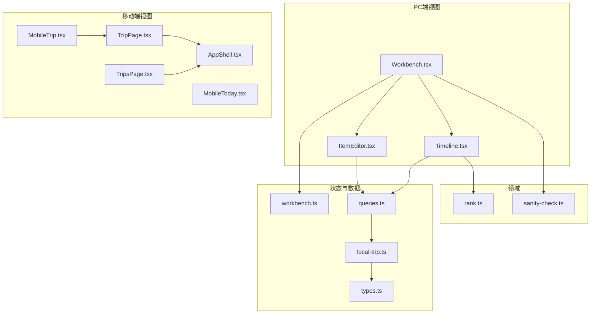
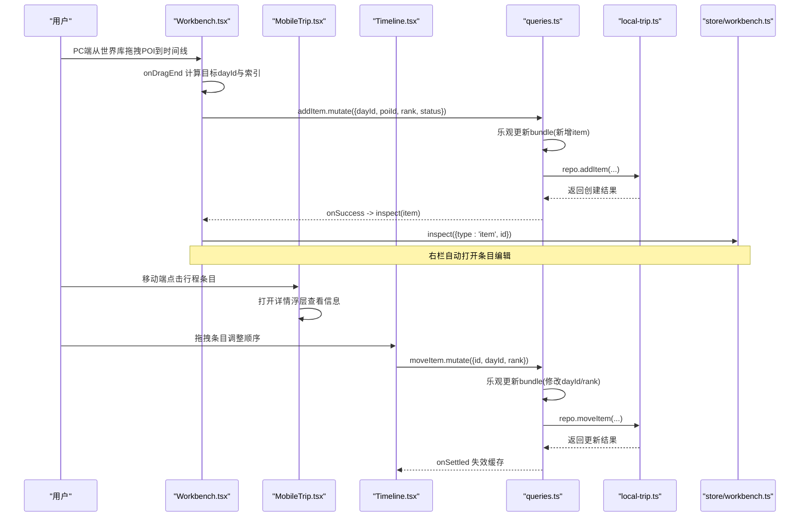
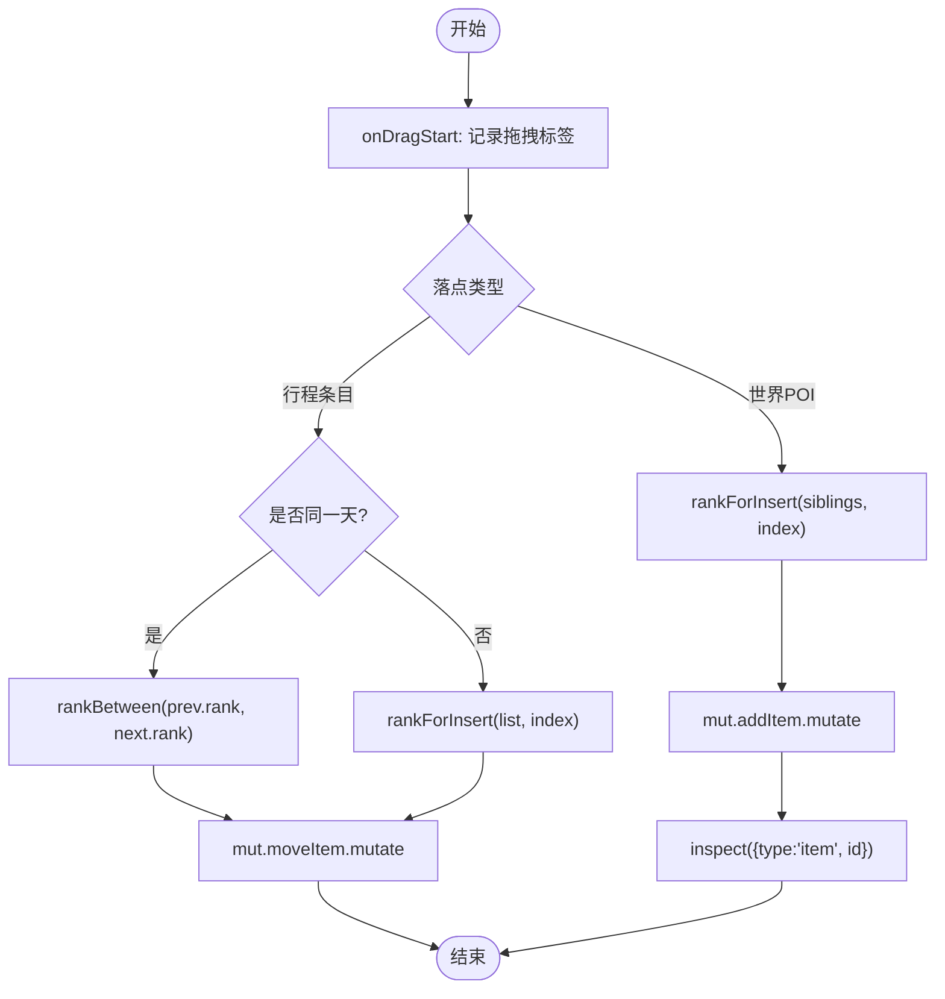
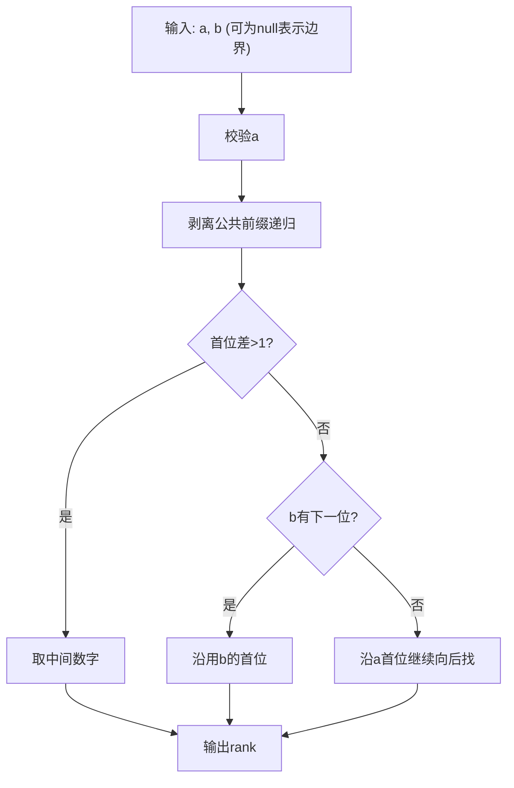
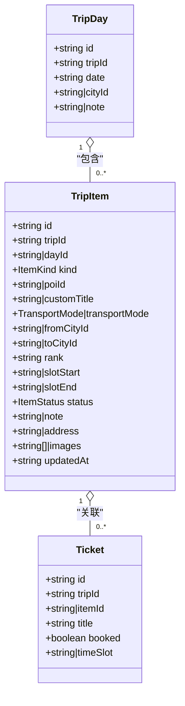
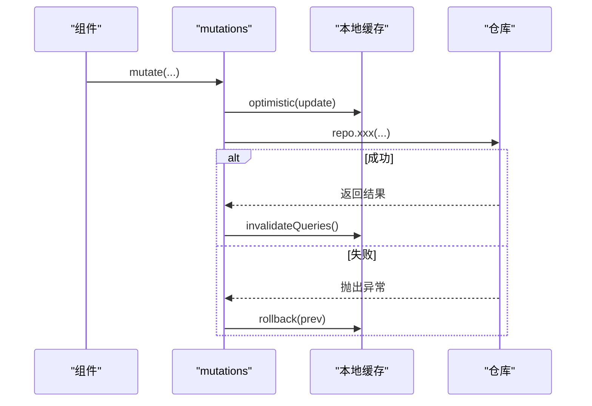
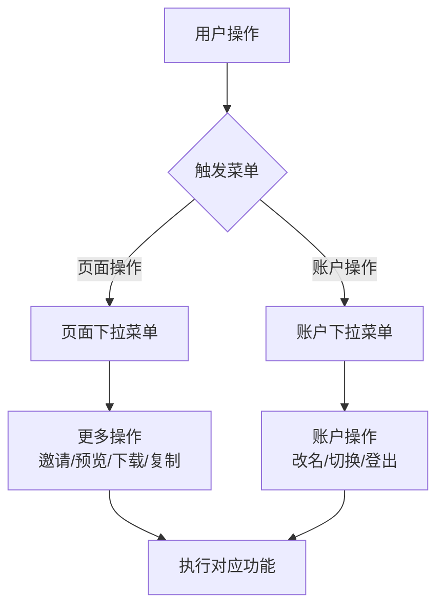
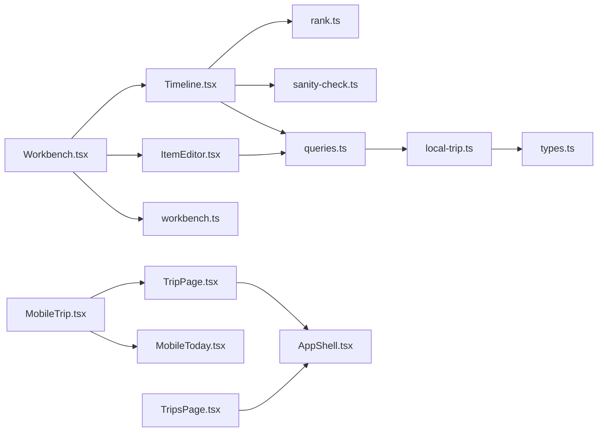

# 行程管理模块

<cite>
**本文引用的文件**
- [Workbench.tsx](file://src/features/trip/Workbench.tsx)
- [Timeline.tsx](file://src/features/trip/Timeline.tsx)
- [ItemEditor.tsx](file://src/features/trip/ItemEditor.tsx)
- [MobileTrip.tsx](file://src/features/trip/MobileTrip.tsx)
- [MobileToday.tsx](file://src/features/trip/MobileToday.tsx)
- [TripPage.tsx](file://src/pages/TripPage.tsx)
- [AppShell.tsx](file://src/app/AppShell.tsx)
- [TripsPage.tsx](file://src/pages/TripsPage.tsx)
- [rank.ts](file://src/domain/trip/rank.ts)
- [sanity-check.ts](file://src/domain/trip/sanity-check.ts)
- [workbench.ts](file://src/store/workbench.ts)
- [local-trip.ts](file://src/data/adapters/local-trip.ts)
- [types.ts](file://src/data/types.ts)
- [queries.ts](file://src/features/trip/queries.ts)
- [WorldNav.tsx](file://src/features/world/WorldNav.tsx)
- [WorldPage.tsx](file://src/pages/WorldPage.tsx)
</cite>

## 更新摘要
**所做更改**
- 更新品牌名称为 "Tour the World"，替换原有的"玩无一失"品牌标识
- 更新应用标题、描述和界面文案以反映新的品牌定位
- 保持三栏工作台架构和功能完整性不变
- 更新移动端界面中的品牌元素

## 目录
1. [简介](#简介)
2. [项目结构](#项目结构)
3. [核心组件](#核心组件)
4. [架构总览](#架构总览)
5. [详细组件分析](#详细组件分析)
6. [移动端优化与下拉菜单系统](#移动端优化与下拉菜单系统)
7. [依赖关系分析](#依赖关系分析)
8. [性能与并发](#性能与并发)
9. [故障排查指南](#故障排查指南)
10. [结论](#结论)
11. [附录：配置、参数与返回值](#附录配置参数与返回值)

## 简介
本模块提供"三栏工作台"的行程管理能力：左侧世界库（景点浏览与添加）、中间时间线（按天组织条目并拖拽排序）、右侧详情面板（导览卡/条目编辑/行程速览）。作为 **Tour the World** 旅行作战台的核心功能，它支持用户将散落各处的攻略整合成一份可执行的行程。核心能力包括：
- 拖拽排序算法：基于 fractional rank 的插入式排序，避免批量更新，天然抗并发冲突。
- 行程项目的 CRUD：支持景点、交通、住宿、备注四类条目；状态流转与投票协作。
- 数据同步机制：统一通过 mutations 进行乐观更新，失败回滚，最终由仓库适配器持久化（本地或云端）。
- 合理性体检：闭馆检查、过度排程、折返跑、预约死线等提示。
- **移动端优化**：行程操作按钮已重构为下拉菜单系统，提供更好的移动端用户体验和屏幕空间利用。

## 项目结构
- 视图层
  - 工作台容器：Workbench.tsx（DnD 上下文、三栏布局、拖拽入口）
  - 时间线：Timeline.tsx（按天卡片、候选池、条目行、拖拽落点）
  - 条目编辑：ItemEditor.tsx（字段编辑、图片附件、状态切换）
  - 移动端视图：MobileTrip.tsx（移动端专用行程展示）
  - 移动端今日视图：MobileToday.tsx（出发倒计时与准备提醒）
- 领域逻辑
  - 分数序：rank.ts（fractional rank 计算、排序比较、插入位置）
  - 合理性体检：sanity-check.ts（闭馆、过满、折返、预约提醒）
- 状态与数据
  - 工作台状态：workbench.ts（选中日期、详情面板多态、筛选）
  - 数据模型：types.ts（TripBundle、TripItem、Day、成员、票务等）
  - 查询与变更：queries.ts（react-query 封装、乐观更新、失效策略）
  - 仓库适配：local-trip.ts（本地存储实现，接口与云端一致）

**图表来源**
- [Workbench.tsx:1-414](file://src/features/trip/Workbench.tsx#L1-L414)
- [Timeline.tsx:1-702](file://src/features/trip/Timeline.tsx#L1-L702)
- [ItemEditor.tsx:1-450](file://src/features/trip/ItemEditor.tsx#L1-L450)
- [MobileTrip.tsx:1-206](file://src/features/trip/MobileTrip.tsx#L1-L206)
- [MobileToday.tsx:1-53](file://src/features/trip/MobileToday.tsx#L1-L53)
- [TripPage.tsx:1-242](file://src/pages/TripPage.tsx#L1-L242)
- [AppShell.tsx:130-239](file://src/app/AppShell.tsx#L130-L239)
- [TripsPage.tsx:1-202](file://src/pages/TripsPage.tsx#L1-L202)

## 核心组件
- 工作台 Workbench
  - 提供 DndContext，统一处理来自世界库的 POI 拖入与时间线内条目的拖拽移动。
  - 维护三栏宽度、选中日期、详情面板多态（none/poi/item/day）。
  - 调用 useTripMutations 执行 add/move/update 等操作。
- 时间线 Timeline
  - 按天渲染 DayCard，内部 SortableContext 支持条目排序；未排期的在候选池 PoolCard。
  - 使用 useDroppable 标记 day 和 pool 为可放置区域。
  - 展示状态、投票、票务、闭馆提示、计划时长统计。
- 条目编辑器 ItemEditor
  - 针对 poi/transport/note/accommodation 四类条目提供差异化编辑表单。
  - 支持地址复制、图片上传（云端）、状态切换、共享备注。
- 移动端 MobileTrip
  - 专为移动端设计的单列行程展示界面。
  - 支持日期切换、闭馆提醒、条目详情查看。
  - 集成下拉菜单系统优化操作体验。
- 移动端今日视图 MobileToday
  - 当行程中没有当天安排时显示出发倒计时和准备提醒。
  - 提供待订票、打包未完成、需办签证等 actionable 提醒。
- 分数序 rank
  - 实现 base62 小数中点算法，保证 a < result < b，仅写被拖动项，避免 N 次更新。
- 合理性体检 sanity-check
  - 对"确定"状态的条目进行闭馆、过满、折返、预约死线检查，输出问题列表供 UI 展示。
- 状态 workbench
  - 管理 selectedDate、inspector、筛选条件，并持久化到 sessionStorage。
- 数据查询 queries
  - 封装 react-query 的 mutation，全部采用乐观更新，失败回滚，成功后失效缓存。
- 仓库适配器 local-trip
  - 本地 localStorage 实现 TripRepository，数据结构与云端对齐，canSync=false。

**章节来源**
- [Workbench.tsx:1-414](file://src/features/trip/Workbench.tsx#L1-L414)
- [Timeline.tsx:1-702](file://src/features/trip/Timeline.tsx#L1-L702)
- [ItemEditor.tsx:1-450](file://src/features/trip/ItemEditor.tsx#L1-L450)
- [MobileTrip.tsx:1-206](file://src/features/trip/MobileTrip.tsx#L1-L206)
- [MobileToday.tsx:1-53](file://src/features/trip/MobileToday.tsx#L1-L53)
- [rank.ts:1-91](file://src/domain/trip/rank.ts#L1-L91)
- [sanity-check.ts:1-177](file://src/domain/trip/sanity-check.ts#L1-L177)
- [workbench.ts:1-77](file://src/store/workbench.ts#L1-L77)
- [queries.ts:1-236](file://src/features/trip/queries.ts#L1-L236)
- [local-trip.ts:1-349](file://src/data/adapters/local-trip.ts#L1-L349)

## 架构总览

**图表来源**
- [Workbench.tsx:158-222](file://src/features/trip/Workbench.tsx#L158-L222)
- [MobileTrip.tsx:148-202](file://src/features/trip/MobileTrip.tsx#L148-L202)
- [Timeline.tsx:94-120](file://src/features/trip/Timeline.tsx#L94-L120)
- [queries.ts:88-119](file://src/features/trip/queries.ts#L88-L119)
- [local-trip.ts:198-244](file://src/data/adapters/local-trip.ts#L198-L244)
- [workbench.ts:51-76](file://src/store/workbench.ts#L51-L76)

## 详细组件分析

### 三栏工作台交互
- 左栏：WorldNav 提供景点列表与"已加入"标记，点击"+"或拖拽将 POI 加入当前选中日（targetDayId）。
- 中栏：Timeline 以天为单位组织条目，支持：
  - 条目内排序（SortableContext + verticalListSortingStrategy）
  - 跨天互拖（useDroppable 标记 dayDropId 与 POOL_DROP_ID）
  - 候选池收纳未排期条目
- 右栏：根据 inspector 类型显示：
  - poi：导览卡 PoiGuideCard + 实名投票 VotePanel
  - item：条目编辑 ItemEditor
  - none：行程速览（天数、已排点、已确定、体检、存储模式）

**图表来源**
- [Workbench.tsx:170-222](file://src/features/trip/Workbench.tsx#L170-L222)
- [rank.ts:86-90](file://src/domain/trip/rank.ts#L86-L90)

**章节来源**
- [Workbench.tsx:1-414](file://src/features/trip/Workbench.tsx#L1-L414)
- [Timeline.tsx:1-702](file://src/features/trip/Timeline.tsx#L1-L702)

### 拖拽排序算法与并发冲突解决
- Fractional rank 机制
  - 将 rank 视为省略"0."的 base62 小数，midpoint 求两值中点，保证 a < result < b。
  - 不变量：末位不为最小字符，确保永远可在其前插值。
  - 工具函数：initialRank、sequentialRanks、byRank、rankForInsert、rankBetween。
- 并发冲突解决
  - 只写被拖动的那一行（更新 rank），不批量重算后续所有 position，避免 N 次 UPDATE。
  - 多人同时拖拽时，各自计算新 rank 写入，不会互相覆盖整段序列。
  - 前端使用 react-query 乐观更新，网络失败时回滚，最终一致性由服务端保障。

**图表来源**
- [rank.ts:23-50](file://src/domain/trip/rank.ts#L23-L50)
- [rank.ts:86-90](file://src/domain/trip/rank.ts#L86-L90)

**章节来源**
- [rank.ts:1-91](file://src/domain/trip/rank.ts#L1-L91)

### 行程项目 CRUD 与状态管理
- 添加景点
  - 触发点：WorldNav 的 onAddPoi 或拖拽落点。
  - 流程：计算 rankForInsert -> mutate.addItem -> onSuccess 打开条目编辑。
- 调整顺序
  - 同一天内：arrayMove 后 rankBetween(prev, next) -> mutate.moveItem。
  - 跨天：rankForInsert(list, index) -> mutate.moveItem。
- 编辑详情
  - ItemEditor 针对不同 kind 暴露字段（时间、城市、地址、备注、状态、图片）。
  - 所有变更走 updateItem.mutate，乐观更新后立即生效。
- 删除与移除
  - removeItem 删除条目并清理关联票券引用。
  - removeDay 删除当天并将该天条目退回候选池（不直接删除，防误删）。
- 状态管理
  - ItemStatus：wishlist/candidate/confirmed/visited/dropped。
  - 状态选择器在 Timeline 与 ItemEditor 中均可切换。

**图表来源**
- [types.ts:151-239](file://src/data/types.ts#L151-L239)

**章节来源**
- [Workbench.tsx:158-222](file://src/features/trip/Workbench.tsx#L158-L222)
- [Timeline.tsx:94-287](file://src/features/trip/Timeline.tsx#L94-L287)
- [ItemEditor.tsx:38-312](file://src/features/trip/ItemEditor.tsx#L38-L312)
- [local-trip.ts:198-253](file://src/data/adapters/local-trip.ts#L198-L253)
- [queries.ts:88-130](file://src/features/trip/queries.ts#L88-L130)

### 数据同步机制
- 统一入口：useTripMutations 封装所有写操作。
- 乐观更新：onMutate 立即更新本地缓存，提升交互响应。
- 错误回滚：onError 恢复 prev 快照，避免不一致。
- 失效策略：onSettled 使 bundle 与列表失效，重新拉取最新数据。
- 仓库抽象：LocalTripRepository 与 Supabase 实现遵循同一接口，UI 零改动切换。

**图表来源**
- [queries.ts:45-119](file://src/features/trip/queries.ts#L45-L119)
- [local-trip.ts:67-79](file://src/data/adapters/local-trip.ts#L67-L79)

**章节来源**
- [queries.ts:1-236](file://src/features/trip/queries.ts#L1-L236)
- [local-trip.ts:1-349](file://src/data/adapters/local-trip.ts#L1-L349)

## 移动端优化与下拉菜单系统

### 移动端界面架构
移动端采用了专门设计的单列界面，专注于"在路上"的使用场景：
- **MobileTrip**：主行程视图，显示当前日期的行程安排
- **MobileToday**：当没有当天安排时显示出发倒计时和准备提醒
- **简化操作**：移除了复杂的拖拽功能，专注于查看和基本操作

### 下拉菜单系统重构
行程操作按钮已重构为下拉菜单系统，显著提升了移动端用户体验：

#### 页面级下拉菜单（TripPage）
- **更多操作菜单**：右上角"⋯"按钮展开的操作菜单
- **功能整合**：邀请协作、预览行程单、下载行程单、复制 Markdown
- **无障碍支持**：完整的 ARIA 属性支持屏幕阅读器

#### 账户下拉菜单（AppShell）
- **头像菜单**：移动端右上角的用户头像下拉菜单
- **功能集成**：改名/账号、切换到桌面端、登出等功能
- **智能显示**：根据登录状态动态显示不同选项

#### 移动端特色功能
- **日期切换芯片**：水平滚动的日期选择器，快速切换不同日期
- **条目卡片**：简洁的卡片式设计，显示关键信息
- **详情浮层**：底部弹出的详情查看界面，符合移动端操作习惯

**图表来源**
- [TripPage.tsx:126-193](file://src/pages/TripPage.tsx#L126-L193)
- [AppShell.tsx:130-176](file://src/app/AppShell.tsx#L130-L176)

### 移动端用户体验优化
- **屏幕空间利用**：通过下拉菜单减少界面元素占用，最大化内容展示空间
- **触控友好**：大按钮、清晰的视觉反馈、合理的间距设计
- **性能优化**：懒加载地图模块，按需加载重型组件
- **离线支持**：本地存储行程数据，无网络时仍可基本使用

**章节来源**
- [TripPage.tsx:126-193](file://src/pages/TripPage.tsx#L126-L193)
- [AppShell.tsx:130-176](file://src/app/AppShell.tsx#L130-L176)
- [MobileTrip.tsx:1-206](file://src/features/trip/MobileTrip.tsx#L1-L206)
- [MobileToday.tsx:1-53](file://src/features/trip/MobileToday.tsx#L1-L53)

## 依赖关系分析
- 组件耦合
  - Workbench 依赖 Timeline、ItemEditor、world 查询、rank 工具、sanity-check 工具、workbench store。
  - Timeline 依赖 dnd-kit、rank、sanity-check、ItemRow（含投票、票务、状态）。
  - ItemEditor 依赖 uploadAttachment、CopyButton、状态选择。
  - **移动端组件**：MobileTrip 依赖 MobileToday、PoiGuideCard、状态管理。
- 数据流
  - 读：useTripBundle/useWorldIndex/usePoiMap -> 渲染
  - 写：mutations -> repository -> 持久化 -> 失效缓存
- 外部依赖
  - @dnd-kit/core & sortable：拖拽与排序
  - @tanstack/react-query：数据获取与缓存
  - zod/world schema：世界库类型推导

**图表来源**
- [Workbench.tsx:1-414](file://src/features/trip/Workbench.tsx#L1-L414)
- [Timeline.tsx:1-702](file://src/features/trip/Timeline.tsx#L1-L702)
- [ItemEditor.tsx:1-450](file://src/features/trip/ItemEditor.tsx#L1-L450)
- [MobileTrip.tsx:1-206](file://src/features/trip/MobileTrip.tsx#L1-L206)
- [TripPage.tsx:1-242](file://src/pages/TripPage.tsx#L1-L242)
- [AppShell.tsx:130-239](file://src/app/AppShell.tsx#L130-L239)
- [TripsPage.tsx:1-202](file://src/pages/TripsPage.tsx#L1-L202)

**章节来源**
- [Workbench.tsx:1-414](file://src/features/trip/Workbench.tsx#L1-L414)
- [Timeline.tsx:1-702](file://src/features/trip/Timeline.tsx#L1-L702)
- [ItemEditor.tsx:1-450](file://src/features/trip/ItemEditor.tsx#L1-L450)
- [MobileTrip.tsx:1-206](file://src/features/trip/MobileTrip.tsx#L1-L206)
- [TripPage.tsx:1-242](file://src/pages/TripPage.tsx#L1-L242)
- [AppShell.tsx:130-239](file://src/app/AppShell.tsx#L130-L239)
- [TripsPage.tsx:1-202](file://src/pages/TripsPage.tsx#L1-L202)
- [queries.ts:1-236](file://src/features/trip/queries.ts#L1-L236)
- [local-trip.ts:1-349](file://src/data/adapters/local-trip.ts#L1-L349)
- [types.ts:1-300](file://src/data/types.ts#L1-L300)

## 性能与并发
- 拖拽性能
  - 使用 DnDContext + closestCorners 碰撞检测，减少不必要的重绘。
  - SortableContext 配合 verticalListSortingStrategy 优化长列表排序。
  - 乐观更新避免等待网络往返，提升交互流畅度。
- 并发安全
  - Fractional rank 仅写单行，避免批量更新导致的覆盖风险。
  - 多人协作场景下，各自独立计算 rank，服务端负责最终一致性。
- 渲染优化
  - 地图模块懒加载（MapPanel lazy），仅在切换到地图时下载。
  - 使用 useMemo 计算 itemsIn、addedPoiIds、issues 等，降低重复计算。
- **移动端性能优化**
  - 组件懒加载：移动端和工作台分别懒加载，减少初始包体积
  - 内存优化：移动端使用更简洁的数据结构和渲染逻辑
  - 网络优化：移动端优先使用本地缓存，减少网络请求

## 故障排查指南
- 拖拽冲突
  - 现象：拖拽后顺序错乱或重复。
  - 排查：确认 rankForInsert 与 rankBetween 的使用场景；检查 siblings 是否已按 byRank 排序；确认目标容器 dayId 是否正确。
  - 参考路径：[Workbench.tsx:195-221](file://src/features/trip/Workbench.tsx#L195-L221)、[rank.ts:86-90](file://src/domain/trip/rank.ts#L86-L90)
- 数据不一致
  - 现象：界面与后端不同步。
  - 排查：查看 mutations 的 onMutate/onError/onSettled；确认 queryKey 失效范围；检查仓库适配器是否返回正确 updatedAt。
  - 参考路径：[queries.ts:45-119](file://src/features/trip/queries.ts#L45-L119)、[local-trip.ts:67-79](file://src/data/adapters/local-trip.ts#L67-L79)
- 闭馆/过满/折返/预约提醒
  - 现象：时间线出现警告或错误。
  - 排查：确认条目状态为 confirmed；检查 POI 的 openness、durationMinutes、booking；核对 today 与行程日期。
  - 参考路径：[sanity-check.ts:84-176](file://src/domain/trip/sanity-check.ts#L84-L176)
- 右栏未打开编辑
  - 现象：添加景点后未进入编辑。
  - 排查：确认 onSuccess 中 inspect 调用；检查 workbench store 的 inspector 状态。
  - 参考路径：[Workbench.tsx:158-167](file://src/features/trip/Workbench.tsx#L158-L167)、[workbench.ts:51-76](file://src/store/workbench.ts#L51-L76)
- **移动端菜单问题**
  - 现象：下拉菜单无法打开或关闭。
  - 排查：检查事件监听器是否正确绑定；确认 ref 引用是否有效；验证 ARIA 属性设置。
  - 参考路径：[TripPage.tsx:55-72](file://src/pages/TripPage.tsx#L55-L72)、[AppShell.tsx:90-101](file://src/app/AppShell.tsx#L90-L101)

**章节来源**
- [Workbench.tsx:158-222](file://src/features/trip/Workbench.tsx#L158-L222)
- [rank.ts:86-90](file://src/domain/trip/rank.ts#L86-L90)
- [queries.ts:45-119](file://src/features/trip/queries.ts#L45-L119)
- [local-trip.ts:67-79](file://src/data/adapters/local-trip.ts#L67-L79)
- [sanity-check.ts:84-176](file://src/domain/trip/sanity-check.ts#L84-L176)
- [workbench.ts:51-76](file://src/store/workbench.ts#L51-L76)
- [TripPage.tsx:55-72](file://src/pages/TripPage.tsx#L55-L72)
- [AppShell.tsx:90-101](file://src/app/AppShell.tsx#L90-L101)

## 结论
本模块通过清晰的三栏架构、分数序排序算法与统一的乐观更新机制，实现了高效、可扩展的行程管理体验。作为 **Tour the World** 旅行作战台的核心功能，它既能满足个人规划，也支持团队协作。**最新的移动端优化通过下拉菜单系统重构，显著提升了移动设备上的用户体验和屏幕空间利用率**。未来可进一步扩展云端协作、智能路线优化与更丰富的可视化能力。

## 附录：配置、参数与返回值
- 添加景点（addItem）
  - 参数：{ tripId, dayId?, poiId, customTitle?, kind?, transportMode?, fromCityId?, toCityId?, status?, rank? }
  - 行为：若未传 rank，则追加到末尾；kind 默认 poi。
  - 返回：TripItem（含 id、updatedAt 等）
  - 参考路径：[types.ts:248-261](file://src/data/types.ts#L248-L261)、[local-trip.ts:198-230](file://src/data/adapters/local-trip.ts#L198-L230)
- 调整顺序（moveItem）
  - 参数：{ id, dayId, rank }
  - 行为：更新 dayId 与 rank；同一天内建议使用 rankBetween，跨天使用 rankForInsert。
  - 返回：TripItem
  - 参考路径：[local-trip.ts:242-244](file://src/data/adapters/local-trip.ts#L242-L244)、[queries.ts:105-119](file://src/features/trip/queries.ts#L105-L119)
- 编辑详情（updateItem）
  - 参数：{ id, patch }
  - 行为：局部更新字段（如 slotStart/End、status、note、address、images 等）。
  - 返回：TripItem
  - 参考路径：[local-trip.ts:233-240](file://src/data/adapters/local-trip.ts#L233-L240)、[queries.ts:93-103](file://src/features/trip/queries.ts#L93-L103)
- 删除条目（removeItem）
  - 参数：id
  - 行为：删除条目并清理关联票券引用。
  - 返回：void
  - 参考路径：[local-trip.ts:246-253](file://src/data/adapters/local-trip.ts#L246-L253)、[queries.ts:121-130](file://src/features/trip/queries.ts#L121-L130)
- 删除当天（removeDay）
  - 参数：id
  - 行为：删除当天并将该天条目退回候选池。
  - 返回：void
  - 参考路径：[local-trip.ts:189-196](file://src/data/adapters/local-trip.ts#L189-L196)、[queries.ts:83-86](file://src/features/trip/queries.ts#L83-L86)
- 合理性体检（sanityCheck）
  - 参数：days: CheckDay[], poiIndex: Record<string, CheckPoi>, opts?: { availableMinutesPerDay?, walkKmh?, today? }
  - 返回：SanityIssue[]（level: error/warn/info; kind: closure/overpack/zigzag/booking）
  - 参考路径：[sanity-check.ts:84-176](file://src/domain/trip/sanity-check.ts#L84-L176)

**章节来源**
- [types.ts:248-261](file://src/data/types.ts#L248-L261)
- [local-trip.ts:189-253](file://src/data/adapters/local-trip.ts#L189-L253)
- [queries.ts:83-130](file://src/features/trip/queries.ts#L83-L130)
- [sanity-check.ts:84-176](file://src/domain/trip/sanity-check.ts#L84-L176)