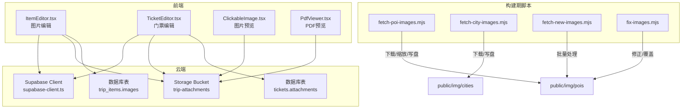
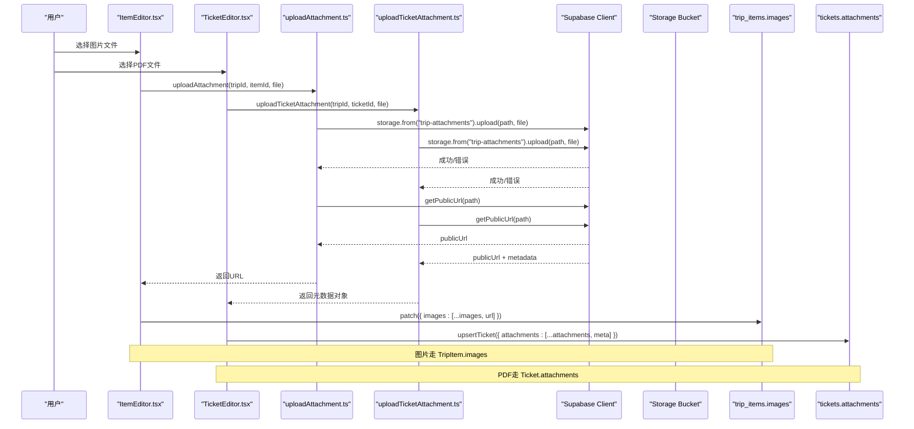
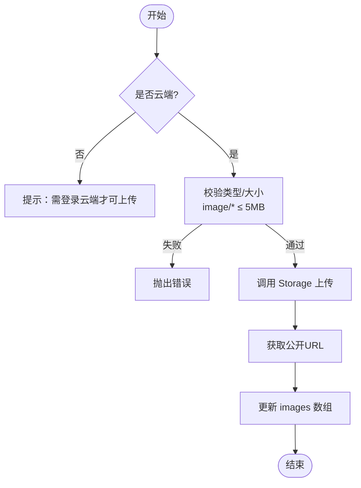
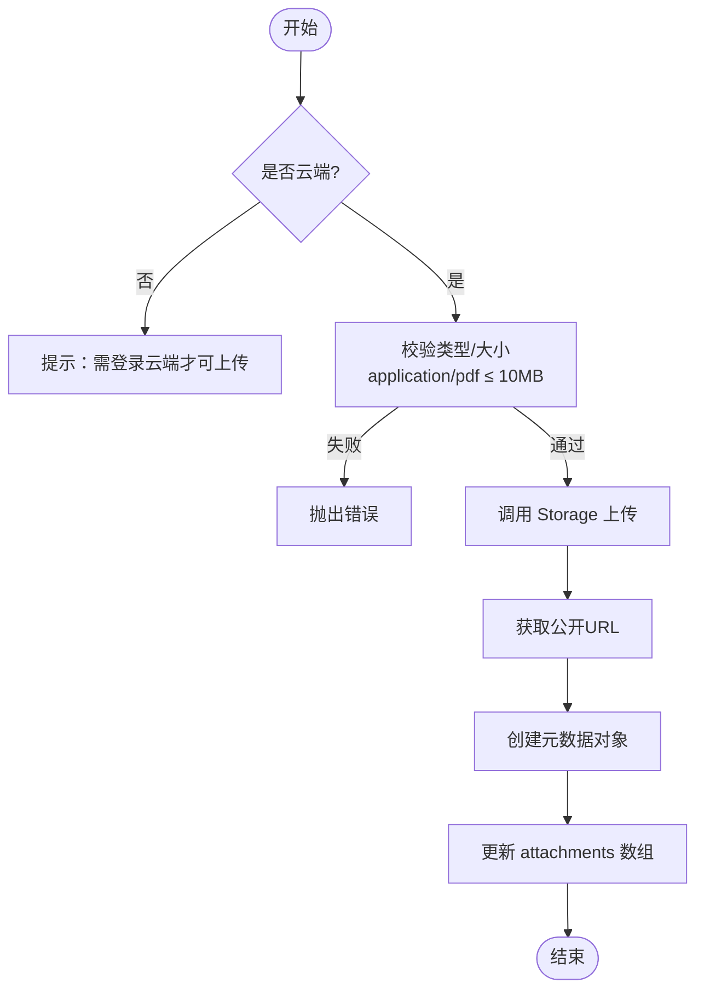
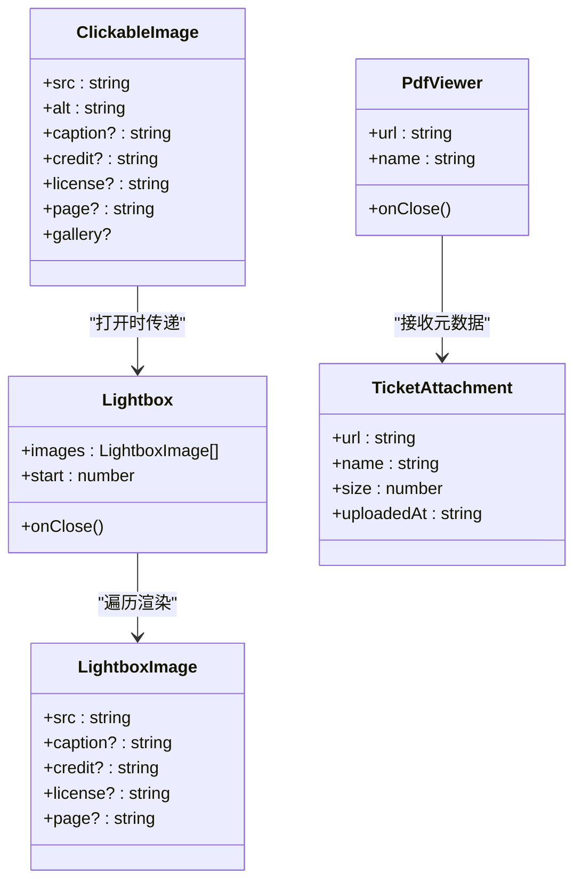
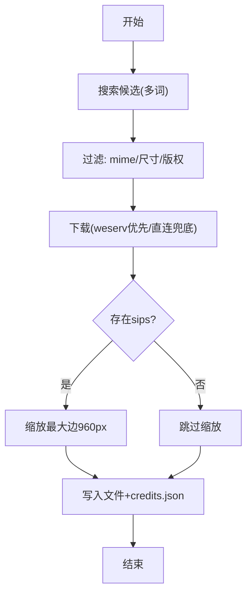
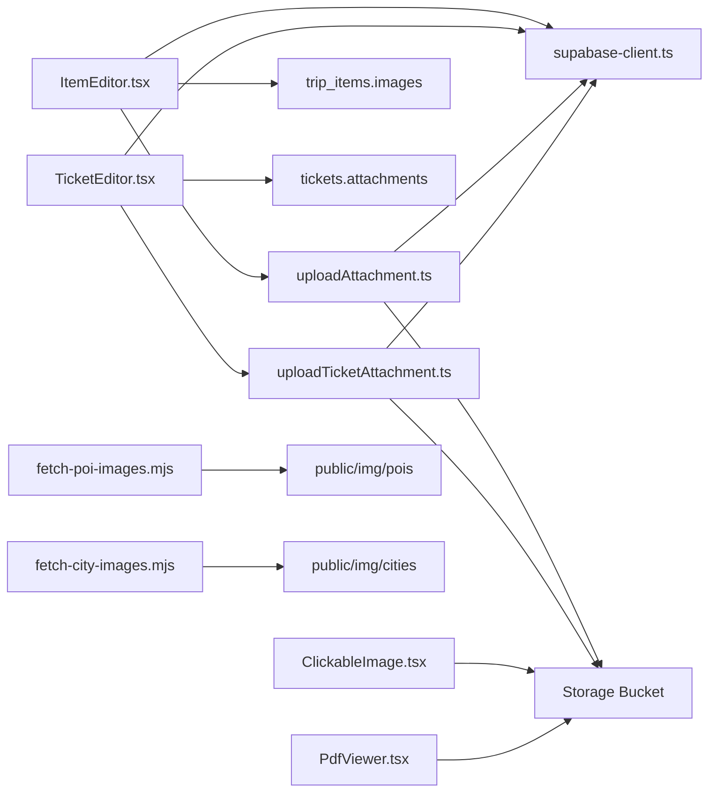

# 图片与PDF附件管理

<cite>
**本文引用的文件**
- [src/features/trip/uploadAttachment.ts](file://src/features/trip/uploadAttachment.ts)
- [src/features/trip/uploadTicketAttachment.ts](file://src/features/trip/uploadTicketAttachment.ts)
- [src/features/trip/ItemEditor.tsx](file://src/features/trip/ItemEditor.tsx)
- [src/features/trip/TicketEditor.tsx](file://src/features/trip/TicketEditor.tsx)
- [src/components/ClickableImage.tsx](file://src/components/ClickableImage.tsx)
- [src/components/PdfViewer.tsx](file://src/components/PdfViewer.tsx)
- [supabase/migrations/0005_trip_item_images.sql](file://supabase/migrations/0005_trip_item_images.sql)
- [supabase/migrations/0008_ticket_attachments.sql](file://supabase/migrations/0008_ticket_attachments.sql)
- [supabase/apply_attachments.sql](file://supabase/apply_attachments.sql)
- [src/data/supabase-client.ts](file://src/data/supabase-client.ts)
- [src/data/types.ts](file://src/data/types.ts)
- [scripts/fetch-poi-images.mjs](file://scripts/fetch-poi-images.mjs)
- [scripts/fetch-city-images.mjs](file://scripts/fetch-city-images.mjs)
- [scripts/fetch-new-images.mjs](file://scripts/fetch-new-images.mjs)
- [scripts/fix-images.mjs](file://scripts/fix-images.mjs)
- [docs/技术方案.md](file://docs/技术方案.md)
</cite>

## 更新摘要
**变更内容**
- 新增PDF附件系统说明，与现有图片附件系统并列存在
- 详细说明两种附件类型的区别、使用场景和技术实现差异
- 更新架构图表以反映双附件系统的完整流程
- 补充PDF预览组件和存储策略的详细说明

## 目录
1. [简介](#简介)
2. [项目结构](#项目结构)
3. [核心组件](#核心组件)
4. [架构总览](#架构总览)
5. [详细组件分析](#详细组件分析)
6. [依赖关系分析](#依赖关系分析)
7. [性能考量](#性能考量)
8. [故障排查指南](#故障排查指南)
9. [结论](#结论)
10. [附录](#附录)

## 简介
本文件面向"图片与PDF附件管理"功能，覆盖从上传、预览到删除的完整生命周期；对比本地存储与云端存储的差异（容量限制、访问权限、同步策略）；说明图片压缩与优化机制（格式筛选、尺寸调整、质量控制）；并提供自定义处理器、第三方存储集成、懒加载与缓存策略的实践建议；同时给出安全验证、内容审核等扩展指南。

**重要更新**：项目现已支持两种附件类型并存——图片附件用于景点照片记录，PDF附件用于门票电子凭证，两者在存储路径、文件大小限制、处理方式上各有特点。

## 项目结构
本项目将"用户上传图片"、"用户上传PDF"与"静态资源图片"三条链路解耦：
- 用户上传图片：通过 Supabase Storage 的 trip-attachments bucket 进行上传、删除，并在 trip_items 表的 images 列中保存公开 URL 数组。
- 用户上传PDF：通过同一 bucket 但不同路径结构存储，元数据保存在 tickets 表的 attachments jsonb 列中。
- 静态资源图片：通过 scripts 脚本从 Wikimedia Commons 抓取并落盘至 public/img/{cities|pois}，附带 credits.json 记录作者与许可信息，供 UI 展示来源与版权。

**图表来源**
- [src/features/trip/ItemEditor.tsx:377-449](file://src/features/trip/ItemEditor.tsx#L377-L449)
- [src/features/trip/TicketEditor.tsx:85-134](file://src/features/trip/TicketEditor.tsx#L85-L134)
- [src/features/trip/uploadAttachment.ts:1-54](file://src/features/trip/uploadAttachment.ts#L1-L54)
- [src/features/trip/uploadTicketAttachment.ts:1-60](file://src/features/trip/uploadTicketAttachment.ts#L1-L60)
- [src/components/ClickableImage.tsx:1-147](file://src/components/ClickableImage.tsx#L1-L147)
- [src/components/PdfViewer.tsx:1-83](file://src/components/PdfViewer.tsx#L1-L83)
- [src/data/supabase-client.ts:1-106](file://src/data/supabase-client.ts#L1-L106)
- [supabase/apply_attachments.sql:1-83](file://supabase/apply_attachments.sql#L1-L83)
- [supabase/migrations/0005_trip_item_images.sql:1-12](file://supabase/migrations/0005_trip_item_images.sql#L1-L12)
- [supabase/migrations/0008_ticket_attachments.sql:1-20](file://supabase/migrations/0008_ticket_attachments.sql#L1-L20)
- [scripts/fetch-poi-images.mjs:1-225](file://scripts/fetch-poi-images.mjs#L1-L225)
- [scripts/fetch-city-images.mjs:1-112](file://scripts/fetch-city-images.mjs#L1-L112)
- [scripts/fetch-new-images.mjs:60-147](file://scripts/fetch-new-images.mjs#L60-L147)
- [scripts/fix-images.mjs:1-86](file://scripts/fix-images.mjs#L1-L86)

**章节来源**
- [src/features/trip/ItemEditor.tsx:377-449](file://src/features/trip/ItemEditor.tsx#L377-L449)
- [src/features/trip/TicketEditor.tsx:85-134](file://src/features/trip/TicketEditor.tsx#L85-L134)
- [src/features/trip/uploadAttachment.ts:1-54](file://src/features/trip/uploadAttachment.ts#L1-L54)
- [src/features/trip/uploadTicketAttachment.ts:1-60](file://src/features/trip/uploadTicketAttachment.ts#L1-L60)
- [src/components/ClickableImage.tsx:1-147](file://src/components/ClickableImage.tsx#L1-L147)
- [src/components/PdfViewer.tsx:1-83](file://src/components/PdfViewer.tsx#L1-L83)
- [supabase/apply_attachments.sql:1-83](file://supabase/apply_attachments.sql#L1-L83)
- [supabase/migrations/0005_trip_item_images.sql:1-12](file://supabase/migrations/0005_trip_item_images.sql#L1-L12)
- [supabase/migrations/0008_ticket_attachments.sql:1-20](file://supabase/migrations/0008_ticket_attachments.sql#L1-L20)
- [scripts/fetch-poi-images.mjs:1-225](file://scripts/fetch-poi-images.mjs#L1-L225)
- [scripts/fetch-city-images.mjs:1-112](file://scripts/fetch-city-images.mjs#L1-L112)
- [scripts/fetch-new-images.mjs:60-147](file://scripts/fetch-new-images.mjs#L60-L147)
- [scripts/fix-images.mjs:1-86](file://scripts/fix-images.mjs#L1-L86)

## 核心组件
- **图片附件系统**
  - uploadAttachment：校验类型与大小，生成安全路径，调用 Supabase Storage 上传并返回公开 URL。
  - deleteAttachment：从公开 URL 反解对象路径，调用 Storage 删除。
  - isCloudStorage：判断是否已连接云端（客户端配置就绪）。
- **PDF附件系统**
  - uploadTicketAttachment：专门处理PDF文件上传，支持最大10MB文件。
  - deleteTicketAttachment：删除PDF附件时清理存储中的文件。
  - PdfViewer：PDF文件预览组件，通过blob方式正确渲染PDF。
- **数据持久化**
  - trip_items.images：文本数组，仅存图片公开 URL；本地模式不开放上传入口。
  - tickets.attachments：jsonb数组，存储PDF附件元数据（url/name/size/uploadedAt）。
  - apply_attachments.sql：幂等创建 bucket、RLS 策略（公开读、已登录可写/删）。
- **预览与交互**
  - ClickableImage/Lightbox：缩略图点击后全屏预览，支持多图画廊、键盘导航、来源与版权信息展示。
  - PdfViewer：弹窗式PDF预览，支持文件名显示、关闭操作、错误处理。
- **构建期图片流水线**
  - fetch-poi-images.mjs / fetch-city-images.mjs / fetch-new-images.mjs / fix-images.mjs：搜索、筛选、下载、可选缩放、落盘与 credits.json 维护。

**章节来源**
- [src/features/trip/uploadAttachment.ts:1-54](file://src/features/trip/uploadAttachment.ts#L1-L54)
- [src/features/trip/uploadTicketAttachment.ts:1-60](file://src/features/trip/uploadTicketAttachment.ts#L1-L60)
- [src/components/PdfViewer.tsx:1-83](file://src/components/PdfViewer.tsx#L1-L83)
- [supabase/migrations/0005_trip_item_images.sql:1-12](file://supabase/migrations/0005_trip_item_images.sql#L1-L12)
- [supabase/migrations/0008_ticket_attachments.sql:1-20](file://supabase/migrations/0008_ticket_attachments.sql#L1-L20)
- [supabase/apply_attachments.sql:1-83](file://supabase/apply_attachments.sql#L1-L83)
- [src/components/ClickableImage.tsx:1-147](file://src/components/ClickableImage.tsx#L1-L147)
- [scripts/fetch-poi-images.mjs:1-225](file://scripts/fetch-poi-images.mjs#L1-L225)
- [scripts/fetch-city-images.mjs:1-112](file://scripts/fetch-city-images.mjs#L1-L112)
- [scripts/fetch-new-images.mjs:60-147](file://scripts/fetch-new-images.mjs#L60-L147)
- [scripts/fix-images.mjs:1-86](file://scripts/fix-images.mjs#L1-L86)

## 架构总览
下图展示了图片附件和PDF附件的端到端流程，以及静态资源图片的构建期流水线。

**图表来源**
- [src/features/trip/ItemEditor.tsx:377-449](file://src/features/trip/ItemEditor.tsx#L377-L449)
- [src/features/trip/TicketEditor.tsx:85-134](file://src/features/trip/TicketEditor.tsx#L85-L134)
- [src/features/trip/uploadAttachment.ts:1-54](file://src/features/trip/uploadAttachment.ts#L1-L54)
- [src/features/trip/uploadTicketAttachment.ts:1-60](file://src/features/trip/uploadTicketAttachment.ts#L1-L60)
- [src/data/supabase-client.ts:1-106](file://src/data/supabase-client.ts#L1-L106)
- [supabase/apply_attachments.sql:1-83](file://supabase/apply_attachments.sql#L1-L83)

## 详细组件分析

### 图片附件系统（TripItem.images）
- **能力边界**
  - 仅云端模式启用上传（isCloudStorage），本地模式因 localStorage 容量限制不开放上传入口。
  - 文件类型必须为 image/*，单文件大小上限 5MB。
- **存储路径**
  - 对象 key 形如 {tripId}/{itemId}/{timestamp}-{safeName}，避免冲突且可读。
- **权限控制**
  - Storage RLS：公开读；已登录用户可插入/删除；bucket 限制 MIME 类型与文件大小。
- **数据模型**
  - trip_items.images 为 text[]，仅存公开 URL；迁移与一键脚本保证幂等。

**图表来源**
- [src/features/trip/uploadAttachment.ts:1-54](file://src/features/trip/uploadAttachment.ts#L1-L54)
- [src/features/trip/ItemEditor.tsx:377-449](file://src/features/trip/ItemEditor.tsx#L377-L449)
- [supabase/apply_attachments.sql:1-83](file://supabase/apply_attachments.sql#L1-L83)

**章节来源**
- [src/features/trip/uploadAttachment.ts:1-54](file://src/features/trip/uploadAttachment.ts#L1-L54)
- [src/features/trip/ItemEditor.tsx:377-449](file://src/features/trip/ItemEditor.tsx#L377-L449)
- [supabase/apply_attachments.sql:1-83](file://supabase/apply_attachments.sql#L1-L83)
- [supabase/migrations/0005_trip_item_images.sql:1-12](file://supabase/migrations/0005_trip_item_images.sql#L1-L12)

### PDF附件系统（Ticket.attachments）
- **能力边界**
  - 仅云端模式启用上传，需要登录Supabase账户。
  - 文件类型严格限制为 application/pdf，单文件大小上限 10MB。
- **存储路径**
  - 对象 key 形如 {tripId}/tickets/{ticketId}/{timestamp}-{safeName}，与图片路径分离。
- **权限控制**
  - 共享 trip-attachments bucket，但通过路径隔离不同类型附件。
  - bucket 已更新允许 application/pdf MIME 类型，文件大小限制提升至 10MB。
- **数据模型**
  - tickets.attachments 为 jsonb 数组，存储完整的元数据对象 {url, name, size, uploadedAt}。
  - 元数据包含文件大小、上传时间等信息，便于UI展示和管理。

**图表来源**
- [src/features/trip/uploadTicketAttachment.ts:1-60](file://src/features/trip/uploadTicketAttachment.ts#L1-L60)
- [src/features/trip/TicketEditor.tsx:85-134](file://src/features/trip/TicketEditor.tsx#L85-L134)
- [supabase/migrations/0008_ticket_attachments.sql:1-20](file://supabase/migrations/0008_ticket_attachments.sql#L1-L20)

**章节来源**
- [src/features/trip/uploadTicketAttachment.ts:1-60](file://src/features/trip/uploadTicketAttachment.ts#L1-L60)
- [src/features/trip/TicketEditor.tsx:85-134](file://src/features/trip/TicketEditor.tsx#L85-L134)
- [supabase/migrations/0008_ticket_attachments.sql:1-20](file://supabase/migrations/0008_ticket_attachments.sql#L1-L20)

### 预览与交互组件
- **图片预览**
  - ClickableImage/Lightbox：缩略图点击后全屏预览，支持多图画廊、键盘导航、来源与版权信息展示。
  - 原生 lazy 加载，减少首屏压力。
- **PDF预览**
  - PdfViewer：弹窗式PDF预览，通过blob方式正确渲染PDF文件。
  - 支持文件名显示、关闭操作、错误处理。
  - 通过Supabase客户端下载为blob，再用URL.createObjectURL + type:'application/pdf'创建本地blob URL。

**图表来源**
- [src/components/ClickableImage.tsx:1-147](file://src/components/ClickableImage.tsx#L1-L147)
- [src/components/PdfViewer.tsx:1-83](file://src/components/PdfViewer.tsx#L1-L83)
- [src/data/types.ts:195-220](file://src/data/types.ts#L195-L220)

**章节来源**
- [src/components/ClickableImage.tsx:1-147](file://src/components/ClickableImage.tsx#L1-L147)
- [src/components/PdfViewer.tsx:1-83](file://src/components/PdfViewer.tsx#L1-L83)

### 构建期图片流水线（静态资源）
- **搜索与筛选**
  - 基于 Wikimedia Commons API 搜索候选，过滤非图片、SVG/GIF、尺寸过小、非自由版权。
- **下载与缩放**
  - 优先走 weserv 服务端缩放直链，失败回退直连原图；macOS 环境使用 sips 将最大边约束至 960px。
- **落盘与署名**
  - 写入 public/img/{poi|city}/{id}.jpg，并合并 credits.json 记录作者、许可、来源页。
- **修正工具**
  - fix-images.mjs 针对误选/重复配图，用更精确关键词重新下载覆盖。

**图表来源**
- [scripts/fetch-poi-images.mjs:104-168](file://scripts/fetch-poi-images.mjs#L104-L168)
- [scripts/fetch-city-images.mjs:70-112](file://scripts/fetch-city-images.mjs#L70-L112)
- [scripts/fetch-new-images.mjs:125-147](file://scripts/fetch-new-images.mjs#L125-L147)
- [scripts/fix-images.mjs:50-86](file://scripts/fix-images.mjs#L50-L86)

**章节来源**
- [scripts/fetch-poi-images.mjs:1-225](file://scripts/fetch-poi-images.mjs#L1-L225)
- [scripts/fetch-city-images.mjs:1-112](file://scripts/fetch-city-images.mjs#L1-L112)
- [scripts/fetch-new-images.mjs:60-147](file://scripts/fetch-new-images.mjs#L60-L147)
- [scripts/fix-images.mjs:1-86](file://scripts/fix-images.mjs#L1-L86)

## 依赖关系分析
- **前端依赖**
  - ItemEditor 依赖 uploadAttachment 完成图片上传/删除，依赖 supabase-client 获取客户端实例与登录态。
  - TicketEditor 依赖 uploadTicketAttachment 完成PDF上传/删除，依赖 PdfViewer 进行预览。
  - ClickableImage 仅依赖图片 URL，无业务耦合。
  - PdfViewer 依赖 supabase-client 进行PDF文件下载和渲染。
- **后端/平台依赖**
  - Supabase Storage 提供对象存储与公开 URL；RLS 保障读写权限。
  - 数据库 trip_items.images 仅存图片URL，tickets.attachments 存储PDF元数据，保持轻量。
- **构建期依赖**
  - Node 脚本依赖 curl、可选 sips；对外部 Wikimedia API 有网络依赖。

**图表来源**
- [src/features/trip/ItemEditor.tsx:377-449](file://src/features/trip/ItemEditor.tsx#L377-L449)
- [src/features/trip/TicketEditor.tsx:85-134](file://src/features/trip/TicketEditor.tsx#L85-L134)
- [src/features/trip/uploadAttachment.ts:1-54](file://src/features/trip/uploadAttachment.ts#L1-L54)
- [src/features/trip/uploadTicketAttachment.ts:1-60](file://src/features/trip/uploadTicketAttachment.ts#L1-L60)
- [src/data/supabase-client.ts:1-106](file://src/data/supabase-client.ts#L1-L106)
- [src/components/ClickableImage.tsx:1-147](file://src/components/ClickableImage.tsx#L1-L147)
- [src/components/PdfViewer.tsx:1-83](file://src/components/PdfViewer.tsx#L1-L83)
- [scripts/fetch-poi-images.mjs:1-225](file://scripts/fetch-poi-images.mjs#L1-L225)
- [scripts/fetch-city-images.mjs:1-112](file://scripts/fetch-city-images.mjs#L1-L112)

**章节来源**
- [src/features/trip/ItemEditor.tsx:377-449](file://src/features/trip/ItemEditor.tsx#L377-L449)
- [src/features/trip/TicketEditor.tsx:85-134](file://src/features/trip/TicketEditor.tsx#L85-L134)
- [src/features/trip/uploadAttachment.ts:1-54](file://src/features/trip/uploadAttachment.ts#L1-L54)
- [src/features/trip/uploadTicketAttachment.ts:1-60](file://src/features/trip/uploadTicketAttachment.ts#L1-L60)
- [src/data/supabase-client.ts:1-106](file://src/data/supabase-client.ts#L1-L106)
- [src/components/ClickableImage.tsx:1-147](file://src/components/ClickableImage.tsx#L1-L147)
- [src/components/PdfViewer.tsx:1-83](file://src/components/PdfViewer.tsx#L1-L83)
- [scripts/fetch-poi-images.mjs:1-225](file://scripts/fetch-poi-images.mjs#L1-L225)
- [scripts/fetch-city-images.mjs:1-112](file://scripts/fetch-city-images.mjs#L1-L112)

## 性能考量
- **懒加载**
  - 图片缩略图使用 loading="lazy"，延迟加载非可视区域图片，降低首屏带宽与渲染开销。
  - PDF预览采用按需加载，仅在打开预览时才下载文件。
- **尺寸与质量**
  - 构建期对 POI 图片在 macOS 环境下使用 sips 将最大边限制为 960px，显著减小体积；也可结合 CDN 动态缩放。
  - 图片上传侧限制单文件 5MB，PDF上传侧限制单文件 10MB，避免超大文件影响传输与存储成本。
- **缓存策略**
  - 浏览器默认对静态资源与 CDN 响应进行缓存；可通过 CDN 设置 Cache-Control 提升命中。
  - 对于用户上传图片，建议使用带时间戳或哈希的文件名（当前实现已含时间戳），利于缓存失效与替换。
  - PDF文件通过blob URL临时缓存，页面关闭后自动释放内存。
- **并发与重试**
  - 构建脚本对网络请求采用超时与重试策略，提高鲁棒性。
  - PDF预览支持错误处理和降级方案。

## 故障排查指南
- **无法上传图片**
  - 检查是否已登录云端（isCloudStorage），未配置或未登录时不会显示上传入口。
  - 确认文件类型为 image/* 且大小不超过 5MB。
  - 若 Storage 报错，检查 RLS 策略是否正确生效（公开读、已登录可写/删）。
- **无法上传PDF**
  - 检查文件类型是否为 application/pdf，大小是否超过 10MB。
  - 确认 bucket 已更新允许 PDF MIME 类型。
  - 检查网络连接和Supabase服务状态。
- **上传成功但无法显示**
  - 图片：确认 images 数组已正确更新；检查公开 URL 是否有效。
  - PDF：确认 attachments 元数据已正确保存；检查PDF文件是否损坏。
  - 检查 CSP 是否允许对应域名（img-src 包含 *.supabase.co 等）。
- **预览异常**
  - 图片：检查 Lightbox 传入的图片数组与起始索引；确认 alt/caption 等元信息不影响渲染。
  - PDF：检查 PdfViewer 是否正确解析storage URL；确认PDF文件格式正确。
- **构建期下载失败**
  - 检查网络连通性与超时设置；必要时切换到直连原图或更换代理。
  - 若 sips 不可用，会跳过缩放，不影响最终结果。

**章节来源**
- [src/features/trip/uploadAttachment.ts:1-54](file://src/features/trip/uploadAttachment.ts#L1-L54)
- [src/features/trip/uploadTicketAttachment.ts:1-60](file://src/features/trip/uploadTicketAttachment.ts#L1-L60)
- [src/features/trip/ItemEditor.tsx:377-449](file://src/features/trip/ItemEditor.tsx#L377-L449)
- [src/features/trip/TicketEditor.tsx:85-134](file://src/features/trip/TicketEditor.tsx#L85-L134)
- [src/components/ClickableImage.tsx:1-147](file://src/components/ClickableImage.tsx#L1-L147)
- [src/components/PdfViewer.tsx:1-83](file://src/components/PdfViewer.tsx#L1-L83)
- [docs/技术方案.md:587-601](file://docs/技术方案.md#L587-L601)

## 结论
本项目现已实现三种附件管理系统的清晰分离：图片附件用于景点照片记录，PDF附件用于门票电子凭证，静态资源图片用于世界库展示。图片附件基于 Supabase Storage 与 RLS 策略，提供安全的上传/删除与公开 URL 管理；PDF附件采用相同的存储基础设施但独立的数据模型和处理逻辑；静态资源通过构建期脚本批量抓取、筛选与缩放，确保版权合规与体积可控。UI 层提供懒加载与全屏预览体验。整体方案兼顾安全性、可扩展性与性能，便于后续接入更多存储服务或增强安全审核能力。

## 附录

### 本地存储与云端存储差异
- **本地存储（localStorage）**
  - 容量有限（约 5MB），不适合存放图片或PDF；因此本地模式不开放上传入口。
  - 适合小量键值数据，如临时状态或配置。
- **云端存储（Supabase Storage）**
  - 容量由平台与套餐决定；图片单文件限制 5MB，PDF单文件限制 10MB（可在应用层与 bucket 层面双重控制）。
  - 访问权限：公开读；已登录用户可写/删；通过 RLS 严格管控。
  - 同步策略：图片URL存储在 trip_items.images，PDF元数据存储在 tickets.attachments，跨设备天然一致；如需离线缓存，可在前端自行实现 Service Worker 或 IndexedDB 缓存策略。

**章节来源**
- [src/features/trip/uploadAttachment.ts:1-54](file://src/features/trip/uploadAttachment.ts#L1-L54)
- [src/features/trip/uploadTicketAttachment.ts:1-60](file://src/features/trip/uploadTicketAttachment.ts#L1-L60)
- [supabase/apply_attachments.sql:1-83](file://supabase/apply_attachments.sql#L1-L83)
- [supabase/migrations/0008_ticket_attachments.sql:1-20](file://supabase/migrations/0008_ticket_attachments.sql#L1-L20)

### 图片压缩与优化机制
- **格式筛选**
  - 图片仅接受 image/*；PDF严格限制为 application/pdf；构建期排除 SVG/GIF，避免动画/矢量带来的体积与兼容性问题。
- **尺寸调整**
  - 构建期在 macOS 环境下使用 sips 将最大边限制为 960px；也可通过 CDN 动态缩放。
- **质量控制**
  - 构建期对下载文件进行最小尺寸校验，拒绝过小或损坏文件；上传侧限制图片和PDF大小。
- **元信息与版权**
  - 构建期记录 author/license/page，供 UI 展示来源与许可。
  - PDF附件元数据包含文件名、大小、上传时间等完整信息。

**章节来源**
- [scripts/fetch-poi-images.mjs:104-168](file://scripts/fetch-poi-images.mjs#L104-L168)
- [scripts/fetch-city-images.mjs:70-112](file://scripts/fetch-city-images.mjs#L70-L112)
- [scripts/fetch-new-images.mjs:125-147](file://scripts/fetch-new-images.mjs#L125-L147)
- [scripts/fix-images.mjs:50-86](file://scripts/fix-images.mjs#L50-L86)
- [src/data/types.ts:195-220](file://src/data/types.ts#L195-L220)

### 自定义附件处理器与第三方存储集成
- **自定义处理器**
  - 在 uploadAttachment/uploadTicketAttachment 前后增加钩子：例如在上传前进行前端压缩（Canvas/WebAssembly）、重命名、水印；上传后回调触发通知或审计日志。
- **第三方存储**
  - 抽象 StorageAdapter 接口（上传/删除/获取URL），当前实现为 Supabase；可按需替换为 AWS S3、阿里云 OSS 等，保持上层调用不变。
- **懒加载与缓存**
  - 使用 IntersectionObserver 实现按需加载；结合浏览器缓存与 CDN 缓存策略，提升加载速度。
  - 对热点图片可引入内存级缓存（Map）与磁盘级缓存（IndexedDB），配合版本号控制失效。
  - PDF文件通过blob URL临时缓存，页面关闭后自动释放内存。

### 安全验证、病毒扫描与内容审核
- **输入校验**
  - 前端校验 MIME 类型与大小；后端通过 bucket allowed_mime_types 与 RLS 进一步限制。
  - 图片限制 image/*，PDF限制 application/pdf，文件大小分别限制为 5MB 和 10MB。
- **内容安全**
  - 遵循 CSP 策略，限制 img-src/connect-src 等白名单；外链统一 target="_blank" rel="noopener noreferrer"。
- **病毒扫描与审核**
  - 建议在服务端（Supabase Edge Functions/云函数）增加病毒扫描与内容审核步骤，通过后再生成公开 URL；或在上传成功后异步触发审核，失败则标记并清理。
- **敏感信息**
  - 明确禁止存储证件信息等敏感数据；分享快照生成时对半敏感字段进行净化剔除。

**章节来源**
- [docs/技术方案.md:587-601](file://docs/技术方案.md#L587-L601)
- [supabase/apply_attachments.sql:1-83](file://supabase/apply_attachments.sql#L1-L83)
- [supabase/migrations/0008_ticket_attachments.sql:1-20](file://supabase/migrations/0008_ticket_attachments.sql#L1-L20)

### 两种附件类型的使用场景对比
- **图片附件（TripItem.images）**
  - **适用场景**：景点照片、美食图片、住宿环境等视觉内容
  - **存储位置**：trip-attachments/{tripId}/{itemId}/{timestamp}-{filename}
  - **文件大小**：最大 5MB
  - **数据模型**：text[] 数组，仅存储公开URL
  - **预览方式**：ClickableImage/Lightbox 画廊模式
  - **用户体验**：缩略图网格展示，支持多图浏览
  
- **PDF附件（Ticket.attachments）**
  - **适用场景**：机票确认单、酒店预订确认、景区电子票等文档凭证
  - **存储位置**：trip-attachments/{tripId}/tickets/{ticketId}/{timestamp}-{filename}
  - **文件大小**：最大 10MB
  - **数据模型**：jsonb 数组，存储完整元数据对象
  - **预览方式**：PdfViewer 弹窗模式
  - **用户体验**：列表展示，支持单个文件预览和下载

**章节来源**
- [src/features/trip/uploadAttachment.ts:1-54](file://src/features/trip/uploadAttachment.ts#L1-L54)
- [src/features/trip/uploadTicketAttachment.ts:1-60](file://src/features/trip/uploadTicketAttachment.ts#L1-L60)
- [src/data/types.ts:159-220](file://src/data/types.ts#L159-L220)
- [supabase/migrations/0005_trip_item_images.sql:1-12](file://supabase/migrations/0005_trip_item_images.sql#L1-L12)
- [supabase/migrations/0008_ticket_attachments.sql:1-20](file://supabase/migrations/0008_ticket_attachments.sql#L1-L20)