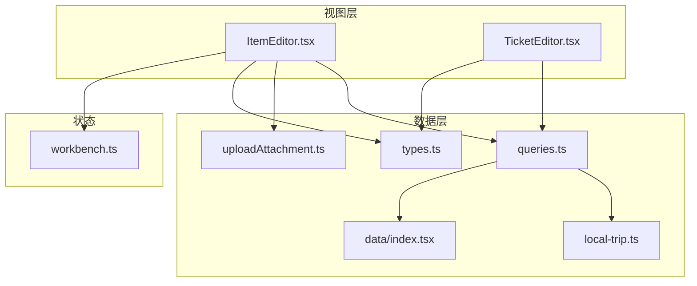
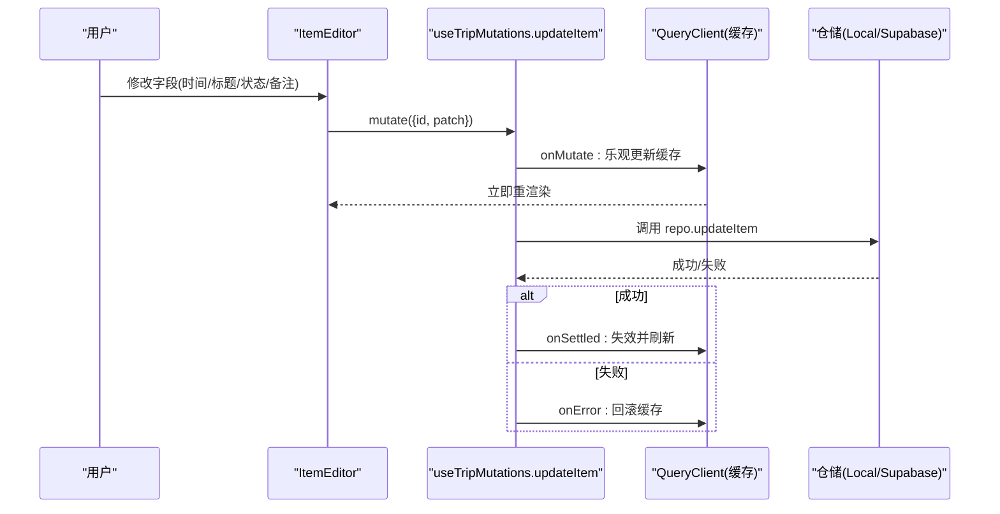
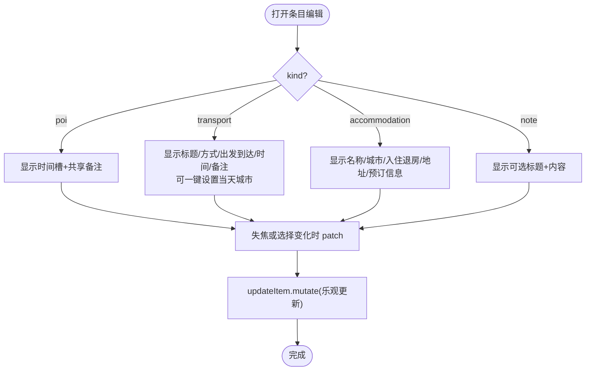
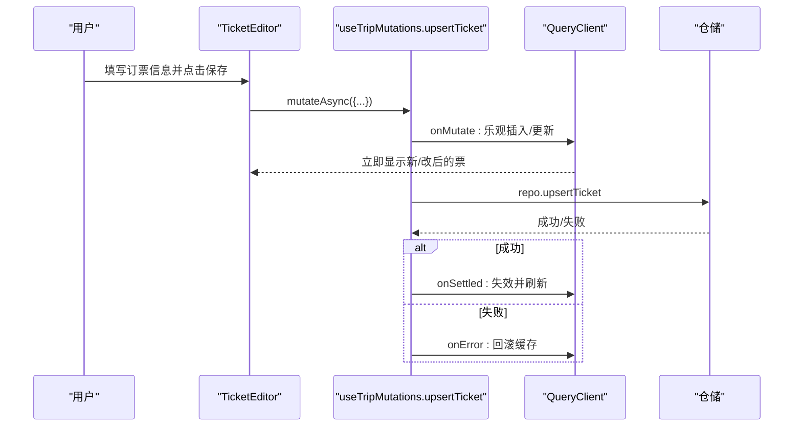
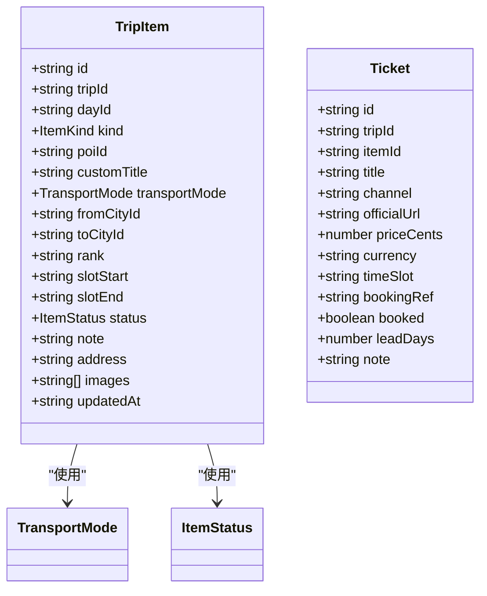
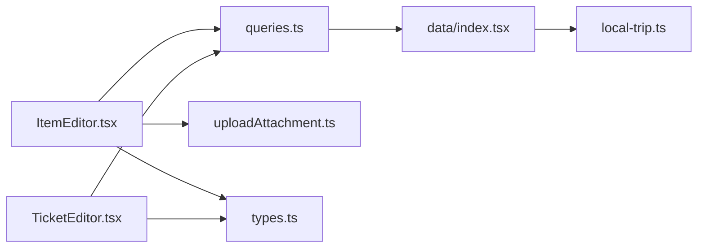

# 基础编辑功能

<cite>
**本文引用的文件**
- [ItemEditor.tsx](file://src/features/trip/ItemEditor.tsx)
- [TicketEditor.tsx](file://src/features/trip/TicketEditor.tsx)
- [queries.ts](file://src/features/trip/queries.ts)
- [types.ts](file://src/data/types.ts)
- [local-trip.ts](file://src/data/adapters/local-trip.ts)
- [uploadAttachment.ts](file://src/features/trip/uploadAttachment.ts)
- [index.tsx](file://src/data/index.tsx)
- [workbench.ts](file://src/store/workbench.ts)
</cite>

## 目录
1. [简介](#简介)
2. [项目结构](#项目结构)
3. [核心组件](#核心组件)
4. [架构总览](#架构总览)
5. [详细组件分析](#详细组件分析)
6. [依赖关系分析](#依赖关系分析)
7. [性能与体验优化](#性能与体验优化)
8. [故障排查指南](#故障排查指南)
9. [结论](#结论)
10. [附录：扩展指南](#附录扩展指南)

## 简介
本章节面向“基础编辑器”能力，聚焦行程条目（景点、交通、住宿、备注）的编辑界面与数据流。文档覆盖：
- 基本信息字段编辑：标题、时间槽、状态等
- 不同项目类型的专属字段差异：POI、交通、住宿、备注
- 表单数据绑定机制：受控组件模式、失焦保存、变更追踪
- 复杂输入验证与错误处理：上传限制、必填校验提示
- 自定义编辑器组件：地址字段、自适应文本域、图片附件区
- 用户体验优化：乐观更新、即时反馈、可复制地址、一键设置城市

## 项目结构
编辑器相关代码集中在 features/trip 与 data 层：
- 视图层：ItemEditor（条目编辑）、TicketEditor（门票编辑）
- 数据层：types（类型定义）、adapters（本地/云端实现）、queries（React Query 封装）
- 存储与工具：uploadAttachment（云存储上传）、workbench（工作台状态）

图表来源
- [ItemEditor.tsx:1-450](file://src/features/trip/ItemEditor.tsx#L1-L450)
- [TicketEditor.tsx:1-130](file://src/features/trip/TicketEditor.tsx#L1-L130)
- [queries.ts:1-236](file://src/features/trip/queries.ts#L1-L236)
- [types.ts:159-210](file://src/data/types.ts#L159-L210)
- [local-trip.ts:1-349](file://src/data/adapters/local-trip.ts#L1-L349)
- [uploadAttachment.ts:1-54](file://src/features/trip/uploadAttachment.ts#L1-L54)
- [index.tsx:1-57](file://src/data/index.tsx#L1-L57)
- [workbench.ts:1-77](file://src/store/workbench.ts#L1-L77)

章节来源
- [ItemEditor.tsx:1-450](file://src/features/trip/ItemEditor.tsx#L1-L450)
- [TicketEditor.tsx:1-130](file://src/features/trip/TicketEditor.tsx#L1-L130)
- [queries.ts:1-236](file://src/features/trip/queries.ts#L1-L236)
- [types.ts:159-210](file://src/data/types.ts#L159-L210)
- [local-trip.ts:1-349](file://src/data/adapters/local-trip.ts#L1-L349)
- [uploadAttachment.ts:1-54](file://src/features/trip/uploadAttachment.ts#L1-L54)
- [index.tsx:1-57](file://src/data/index.tsx#L1-L57)
- [workbench.ts:1-77](file://src/store/workbench.ts#L1-L77)

## 核心组件
- ItemEditor：右栏详情面板，按 kind 渲染不同编辑表单；支持 POI、transport、accommodation、note 四类条目；统一通过 updateItem 乐观更新。
- TicketEditor：挂在景点导览卡上的订票信息编辑；支持创建/编辑/删除，使用 upsertTicket 乐观更新。
- queries：集中封装 React Query mutation，提供 onMutate/onError/onSettled 的乐观更新与回滚。
- types：TripItem、Ticket、TransportMode、ItemStatus 等核心数据结构。
- uploadAttachment：云端图片上传与删除，包含大小与类型校验。
- local-trip：本地仓库实现，负责持久化到 localStorage，并做旧数据归一化。
- workbench：工作台选中态与筛选条件，影响右侧面板展示。

章节来源
- [ItemEditor.tsx:38-312](file://src/features/trip/ItemEditor.tsx#L38-L312)
- [TicketEditor.tsx:15-129](file://src/features/trip/TicketEditor.tsx#L15-L129)
- [queries.ts:45-236](file://src/features/trip/queries.ts#L45-L236)
- [types.ts:159-210](file://src/data/types.ts#L159-L210)
- [uploadAttachment.ts:21-46](file://src/features/trip/uploadAttachment.ts#L21-L46)
- [local-trip.ts:198-240](file://src/data/adapters/local-trip.ts#L198-L240)
- [workbench.ts:3-25](file://src/store/workbench.ts#L3-L25)

## 架构总览
编辑器采用“视图—查询—仓储”的分层架构：
- 视图层：ItemEditor/TicketEditor 负责 UI 与用户交互，调用 mutations
- 查询层：useTripMutations 基于 @tanstack/react-query 提供乐观更新与回滚
- 仓储层：LocalTripRepository/SupabaseTripRepository 实现具体读写逻辑
- 类型契约：types.ts 保证前后端字段一致

图表来源
- [ItemEditor.tsx:52-54](file://src/features/trip/ItemEditor.tsx#L52-L54)
- [queries.ts:93-103](file://src/features/trip/queries.ts#L93-L103)
- [local-trip.ts:233-240](file://src/data/adapters/local-trip.ts#L233-L240)

章节来源
- [ItemEditor.tsx:52-54](file://src/features/trip/ItemEditor.tsx#L52-L54)
- [queries.ts:93-103](file://src/features/trip/queries.ts#L93-L103)
- [local-trip.ts:233-240](file://src/data/adapters/local-trip.ts#L233-L240)

## 详细组件分析

### 条目编辑器 ItemEditor
- 多态渲染：根据 item.kind 显示不同字段集
  - POI：开始/结束时间、共享备注
  - 交通：标题、方式、出发/到达城市、起止时间、备注、一键将当天城市设为到达地
  - 住宿：酒店名称、所在城市、入住/退房时间、地址、预订信息
  - 备注：可选标题 + 内容
- 通用字段：状态（非备注类）
- 图片附件：仅云端可用，支持上传/删除，带错误提示
- 数据绑定：
  - 受控组件：select/input 使用 value + onChange，直接 patch
  - 失焦保存：textarea 使用 onBlur 触发 patch，避免频繁写入
  - 自动高度文本域：AutoTextarea 组件在输入时自适应高度
- 辅助组件：
  - AddressField：本地受控 + 失焦保存，并提供复制按钮
  - ImageSection：上传前校验类型与大小，成功后追加 URL，失败显示错误

图表来源
- [ItemEditor.tsx:66-312](file://src/features/trip/ItemEditor.tsx#L66-L312)
- [queries.ts:93-103](file://src/features/trip/queries.ts#L93-L103)

章节来源
- [ItemEditor.tsx:66-312](file://src/features/trip/ItemEditor.tsx#L66-L312)
- [ItemEditor.tsx:316-375](file://src/features/trip/ItemEditor.tsx#L316-L375)
- [ItemEditor.tsx:379-449](file://src/features/trip/ItemEditor.tsx#L379-L449)
- [queries.ts:93-103](file://src/features/trip/queries.ts#L93-L103)

### 门票编辑器 TicketEditor
- 挂载于景点导览卡，独立管理订票信息
- 字段：是否已订票、入场时间、购票渠道、确认号、备注
- 操作：新增/编辑/删除，使用 upsertTicket/removeTicket
- 数据绑定：受控组件，点击保存后调用 mutation，带忙态

图表来源
- [TicketEditor.tsx:35-68](file://src/features/trip/TicketEditor.tsx#L35-L68)
- [queries.ts:188-205](file://src/features/trip/queries.ts#L188-L205)

章节来源
- [TicketEditor.tsx:15-129](file://src/features/trip/TicketEditor.tsx#L15-L129)
- [queries.ts:188-205](file://src/features/trip/queries.ts#L188-L205)

### 数据模型与字段映射
- TripItem：条目核心模型，包含 kind、时间槽、状态、备注、地址、图片等
- Ticket：门票模型，包含渠道、价格、时间槽、确认号、是否已订票等
- TransportMode / ItemStatus：枚举约束，确保选项一致性

图表来源
- [types.ts:159-210](file://src/data/types.ts#L159-L210)

章节来源
- [types.ts:159-210](file://src/data/types.ts#L159-L210)

### 表单数据绑定机制
- 受控组件模式：所有 input/select/textarea 均通过 value 与 onChange 控制，确保单一数据源
- 双向数据绑定：通过 useState 维护本地值，并在合适时机同步至全局状态（如失焦保存）
- 变更追踪：
  - 文本域使用 onBlur 触发保存，减少频繁写入
  - 选择框使用 onChange 即时 patch
  - 图片上传完成后追加 URL，触发重渲染
- 乐观更新：mutation 的 onMutate 立即更新缓存，onError 回滚，onSettled 刷新

章节来源
- [ItemEditor.tsx:66-312](file://src/features/trip/ItemEditor.tsx#L66-L312)
- [ItemEditor.tsx:341-375](file://src/features/trip/ItemEditor.tsx#L341-L375)
- [queries.ts:45-103](file://src/features/trip/queries.ts#L45-L103)

### 复杂输入验证与错误处理
- 图片上传：
  - 类型校验：仅允许 image/*
  - 大小限制：最大 5MB
  - 错误提示：捕获异常并显示错误消息
- 地址字段：
  - 本地受控，失焦时 trim 并保存空值策略
- 必填项：
  - 交通/备注/住宿添加时默认填充标题，降低必填压力
- 网络错误：
  - mutation.onError 回滚缓存，避免不一致状态

章节来源
- [uploadAttachment.ts:21-46](file://src/features/trip/uploadAttachment.ts#L21-L46)
- [ItemEditor.tsx:316-338](file://src/features/trip/ItemEditor.tsx#L316-L338)
- [local-trip.ts:198-230](file://src/data/adapters/local-trip.ts#L198-L230)
- [queries.ts:93-103](file://src/features/trip/queries.ts#L93-L103)

### 自定义编辑器组件
- AutoTextarea：自适应高度文本域，监听 onInput 调整高度，失焦触发保存
- AddressField：本地受控 + 失焦保存 + 一键复制
- ImageSection：上传/删除图片，云端开关控制，错误提示

章节来源
- [ItemEditor.tsx:341-375](file://src/features/trip/ItemEditor.tsx#L341-L375)
- [ItemEditor.tsx:316-338](file://src/features/trip/ItemEditor.tsx#L316-L338)
- [ItemEditor.tsx:379-449](file://src/features/trip/ItemEditor.tsx#L379-L449)

## 依赖关系分析
- 视图依赖查询：ItemEditor/TicketEditor 通过 useTripMutations 调用 updateItem/upsertTicket
- 查询依赖仓储：mutations 调用 repo 方法，由 index.tsx 工厂决定 Local 或 Supabase
- 类型契约：types.ts 贯穿视图与仓储，确保字段一致
- 工具依赖：uploadAttachment 仅在云端启用

图表来源
- [ItemEditor.tsx:1-450](file://src/features/trip/ItemEditor.tsx#L1-L450)
- [TicketEditor.tsx:1-130](file://src/features/trip/TicketEditor.tsx#L1-L130)
- [queries.ts:1-236](file://src/features/trip/queries.ts#L1-L236)
- [index.tsx:1-57](file://src/data/index.tsx#L1-L57)
- [local-trip.ts:1-349](file://src/data/adapters/local-trip.ts#L1-L349)
- [uploadAttachment.ts:1-54](file://src/features/trip/uploadAttachment.ts#L1-L54)
- [types.ts:159-210](file://src/data/types.ts#L159-L210)

章节来源
- [ItemEditor.tsx:1-450](file://src/features/trip/ItemEditor.tsx#L1-L450)
- [TicketEditor.tsx:1-130](file://src/features/trip/TicketEditor.tsx#L1-L130)
- [queries.ts:1-236](file://src/features/trip/queries.ts#L1-L236)
- [index.tsx:1-57](file://src/data/index.tsx#L1-L57)
- [local-trip.ts:1-349](file://src/data/adapters/local-trip.ts#L1-L349)
- [uploadAttachment.ts:1-54](file://src/features/trip/uploadAttachment.ts#L1-L54)
- [types.ts:159-210](file://src/data/types.ts#L159-L210)

## 性能与体验优化
- 乐观更新：所有写操作先更新缓存再请求后端，提升响应速度
- 失焦保存：文本域使用 onBlur 减少写入频率
- 自动高度文本域：提升长文本编辑体验
- 一键设置城市：交通条目可将当天城市快速设置为到达地
- 图片上传限制：类型与大小校验，避免无效请求
- 本地优先：开发环境使用 localStorage，无需配置即可运行

章节来源
- [queries.ts:45-103](file://src/features/trip/queries.ts#L45-L103)
- [ItemEditor.tsx:341-375](file://src/features/trip/ItemEditor.tsx#L341-L375)
- [uploadAttachment.ts:21-46](file://src/features/trip/uploadAttachment.ts#L21-L46)
- [local-trip.ts:1-11](file://src/data/adapters/local-trip.ts#L1-L11)

## 故障排查指南
- 上传图片失败：
  - 检查是否已连接云端（isCloudStorage）
  - 检查文件类型是否为 image/*
  - 检查文件大小是否超过 5MB
  - 查看错误提示并修正
- 保存不生效：
  - 检查 mutation 是否触发 onMutate 乐观更新
  - 检查 onError 是否回滚缓存
  - 检查 onSettled 是否刷新查询
- 地址未保存：
  - 确认 AddressField 失焦事件是否触发
  - 确认 onSave 回调是否正确调用 patch

章节来源
- [uploadAttachment.ts:21-46](file://src/features/trip/uploadAttachment.ts#L21-L46)
- [queries.ts:93-103](file://src/features/trip/queries.ts#L93-L103)
- [ItemEditor.tsx:316-338](file://src/features/trip/ItemEditor.tsx#L316-L338)

## 结论
基础编辑功能通过清晰的组件分层、统一的类型契约与乐观更新机制，实现了高效、稳定的条目编辑体验。不同项目类型的专属字段满足多样化需求，同时提供了良好的错误处理与用户体验优化。

## 附录：扩展指南
- 扩展新字段：
  - 在 types.ts 中为 TripItem 添加新字段
  - 在 ItemEditor 中按 kind 分支添加对应输入控件
  - 使用 patch 函数提交变更
- 复杂输入验证：
  - 在输入处进行前端校验（如正则、范围）
  - 在 mutation 层增加服务端校验（仓储实现）
  - 使用错误提示组件反馈给用户
- 自定义编辑器组件：
  - 复用 AutoTextarea/AddressField 的模式
  - 使用受控组件 + 失焦保存策略
  - 集成上传/删除逻辑时注意错误处理

章节来源
- [types.ts:159-210](file://src/data/types.ts#L159-L210)
- [ItemEditor.tsx:66-312](file://src/features/trip/ItemEditor.tsx#L66-L312)
- [ItemEditor.tsx:341-375](file://src/features/trip/ItemEditor.tsx#L341-L375)
- [uploadAttachment.ts:21-46](file://src/features/trip/uploadAttachment.ts#L21-L46)