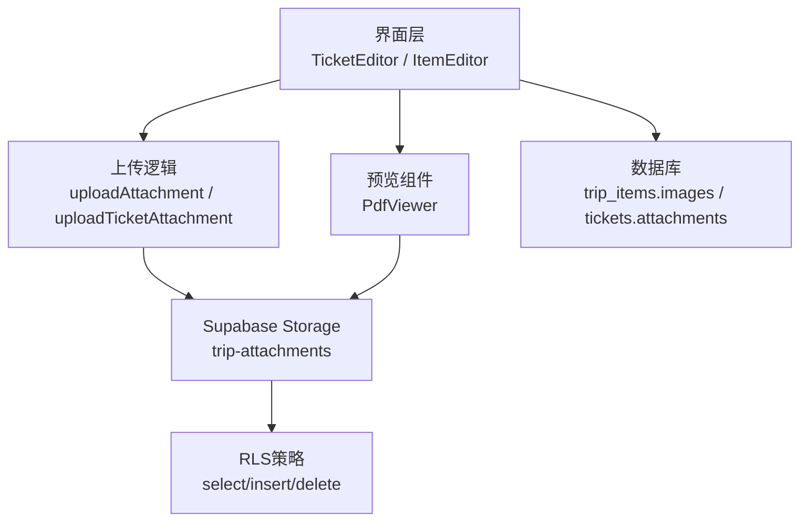
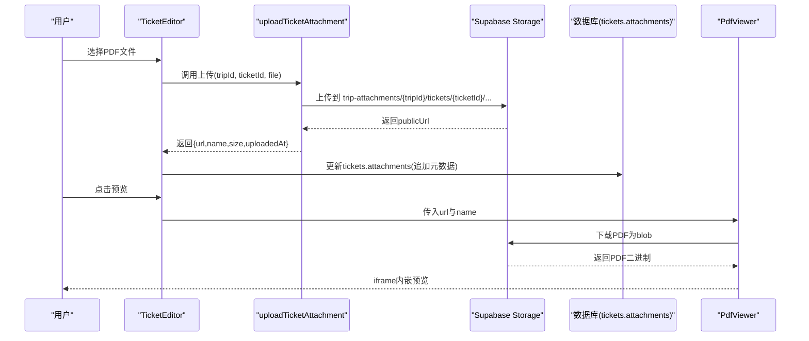
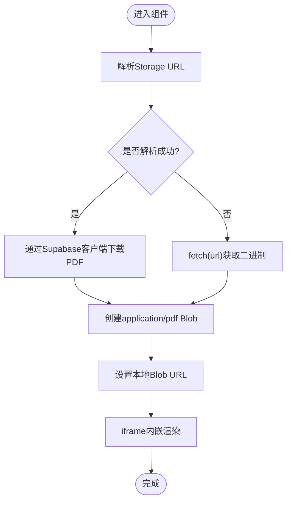
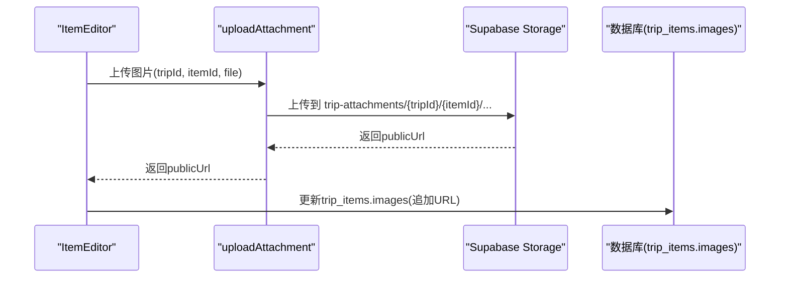
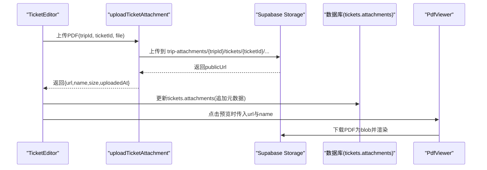
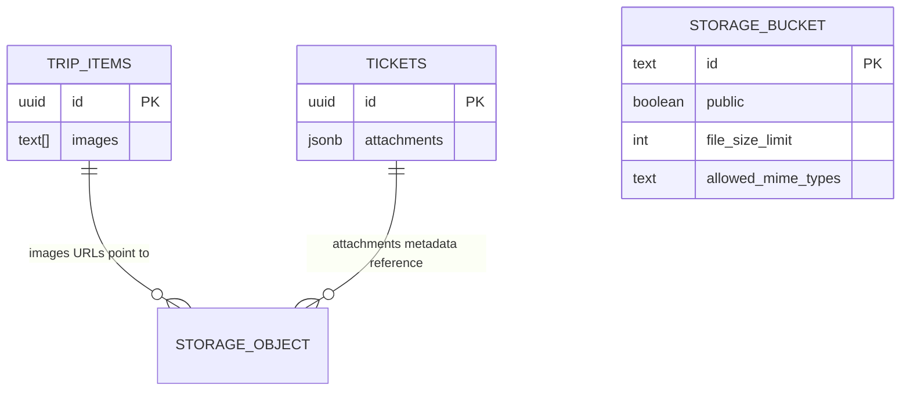
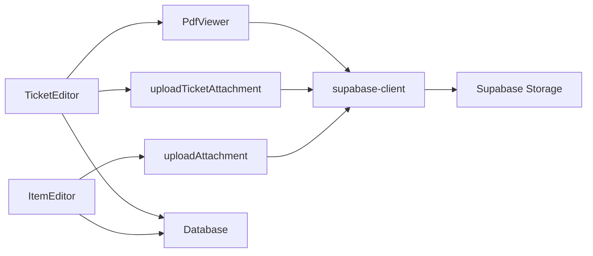

# PDF附件管理系统

<cite>
**本文引用的文件**
- [package.json](file://package.json)
- [src/components/PdfViewer.tsx](file://src/components/PdfViewer.tsx)
- [src/features/trip/uploadAttachment.ts](file://src/features/trip/uploadAttachment.ts)
- [src/features/trip/uploadTicketAttachment.ts](file://src/features/trip/uploadTicketAttachment.ts)
- [src/features/trip/TicketEditor.tsx](file://src/features/trip/TicketEditor.tsx)
- [src/features/trip/ItemEditor.tsx](file://src/features/trip/ItemEditor.tsx)
- [src/data/types.ts](file://src/data/types.ts)
- [src/data/supabase-client.ts](file://src/data/supabase-client.ts)
- [supabase/migrations/0001_init.sql](file://supabase/migrations/0001_init.sql)
- [supabase/migrations/0005_trip_item_images.sql](file://supabase/migrations/0005_trip_item_images.sql)
- [supabase/migrations/0008_ticket_attachments.sql](file://supabase/migrations/0008_ticket_attachments.sql)
- [supabase/apply_attachments.sql](file://supabase/apply_attachments.sql)
</cite>

## 目录
1. [简介](#简介)
2. [项目结构](#项目结构)
3. [核心组件](#核心组件)
4. [架构总览](#架构总览)
5. [详细组件分析](#详细组件分析)
6. [依赖关系分析](#依赖关系分析)
7. [性能考量](#性能考量)
8. [故障排查指南](#故障排查指南)
9. [结论](#结论)
10. [附录](#附录)

## 简介
本系统为“玩无一失”旅行协作应用中的PDF与图片附件管理能力，聚焦以下目标：
- 支持在行程条目中上传并展示图片（TripItem.images）
- 支持在门票记录中上传、预览、删除PDF附件（Ticket.attachments）
- 通过 Supabase Storage 的 trip-attachments bucket 存储文件本体，数据库仅保存公开URL或元数据
- 提供安全的RLS策略与MIME类型限制，确保只有已登录用户可写，且内容可被公开读取
- 提供本地化的PDF预览能力，解决浏览器直接打开原始URL无法渲染的问题

## 项目结构
围绕PDF附件管理的关键代码分布在以下位置：
- 前端组件：PdfViewer 负责弹窗预览；TicketEditor、ItemEditor 负责上传入口与列表展示
- 上传逻辑：uploadAttachment.ts（图片）、uploadTicketAttachment.ts（PDF）封装了Supabase Storage交互
- 数据类型：types.ts 定义了 TripItem.images、Ticket.attachments 等字段
- 后端配置：migrations 与 apply_attachments.sql 定义数据库列、Storage Bucket 与RLS策略
- 认证与客户端：supabase-client.ts 提供客户端实例与登录态监听

图表来源
- [src/features/trip/TicketEditor.tsx:187-245](file://src/features/trip/TicketEditor.tsx#L187-L245)
- [src/features/trip/ItemEditor.tsx:377-450](file://src/features/trip/ItemEditor.tsx#L377-L450)
- [src/features/trip/uploadAttachment.ts:21-53](file://src/features/trip/uploadAttachment.ts#L21-L53)
- [src/features/trip/uploadTicketAttachment.ts:18-59](file://src/features/trip/uploadTicketAttachment.ts#L18-L59)
- [src/components/PdfViewer.tsx:27-83](file://src/components/PdfViewer.tsx#L27-L83)
- [supabase/apply_attachments.sql:60-82](file://supabase/apply_attachments.sql#L60-L82)

章节来源
- [package.json:1-45](file://package.json#L1-L45)

## 核心组件
- PdfViewer：将Supabase Storage公开URL转换为本地Blob URL后以iframe内嵌预览，兼容移动端新标签页打开
- TicketEditor：门票编辑面板，包含表单保存、PDF附件上传/删除/预览
- ItemEditor：行程条目编辑面板，包含图片附件上传/删除
- uploadAttachment.ts：图片上传到trip-attachments，返回公开URL写入TripItem.images
- uploadTicketAttachment.ts：PDF上传到trip-attachments，返回元数据追加到Ticket.attachments
- supabase-client.ts：提供Supabase客户端实例与登录态监听，决定云端能力是否可用

章节来源
- [src/components/PdfViewer.tsx:1-123](file://src/components/PdfViewer.tsx#L1-L123)
- [src/features/trip/TicketEditor.tsx:1-246](file://src/features/trip/TicketEditor.tsx#L1-L246)
- [src/features/trip/ItemEditor.tsx:1-450](file://src/features/trip/ItemEditor.tsx#L1-L450)
- [src/features/trip/uploadAttachment.ts:1-54](file://src/features/trip/uploadAttachment.ts#L1-L54)
- [src/features/trip/uploadTicketAttachment.ts:1-60](file://src/features/trip/uploadTicketAttachment.ts#L1-L60)
- [src/data/supabase-client.ts:1-106](file://src/data/supabase-client.ts#L1-L106)

## 架构总览
系统采用“前端UI + 上传逻辑 + 云端存储 + 数据库元数据”的分层设计：
- 前端UI负责用户操作与状态管理
- 上传逻辑统一封装Supabase Storage调用，处理大小限制、MIME校验、路径生成
- 数据库仅保存URL或元数据，避免大对象入库
- Storage层通过RLS策略控制读写权限，Bucket允许image/*与application/pdf，单文件上限10MB

图表来源
- [src/features/trip/TicketEditor.tsx:85-119](file://src/features/trip/TicketEditor.tsx#L85-L119)
- [src/features/trip/uploadTicketAttachment.ts:18-43](file://src/features/trip/uploadTicketAttachment.ts#L18-L43)
- [src/components/PdfViewer.tsx:52-83](file://src/components/PdfViewer.tsx#L52-L83)

## 详细组件分析

### PdfViewer 组件
- 功能：从Supabase Storage公开URL解析bucket与path，通过客户端下载为Blob，再以application/pdf类型创建本地URL供iframe渲染
- 错误处理：加载失败时显示“加载失败”，关闭时清理事件监听与body滚动锁定
- 兼容性：若无法解析Storage URL则回退到fetch(url).blob()

图表来源
- [src/components/PdfViewer.tsx:14-25](file://src/components/PdfViewer.tsx#L14-L25)
- [src/components/PdfViewer.tsx:52-83](file://src/components/PdfViewer.tsx#L52-L83)

章节来源
- [src/components/PdfViewer.tsx:1-123](file://src/components/PdfViewer.tsx#L1-L123)

### 图片附件上传（ItemEditor）
- 入口：ItemEditor的图片区域仅在云端模式（isCloud）下启用
- 流程：选择图片 -> 调用uploadAttachment -> 写入TripItem.images数组 -> 展示缩略图
- 删除：根据URL反解路径并调用remove，再从images数组移除

图表来源
- [src/features/trip/ItemEditor.tsx:377-450](file://src/features/trip/ItemEditor.tsx#L377-L450)
- [src/features/trip/uploadAttachment.ts:21-37](file://src/features/trip/uploadAttachment.ts#L21-L37)

章节来源
- [src/features/trip/ItemEditor.tsx:377-450](file://src/features/trip/ItemEditor.tsx#L377-L450)
- [src/features/trip/uploadAttachment.ts:1-54](file://src/features/trip/uploadAttachment.ts#L1-L54)

### 门票PDF附件上传（TicketEditor）
- 入口：TicketEditor的PDF附件区，需先保存门票记录（有id）才可用
- 流程：选择PDF -> 调用uploadTicketAttachment -> 追加元数据到Ticket.attachments -> 列表展示
- 删除：根据URL反解路径并调用remove，再从attachments数组移除
- 预览：点击文件名触发PdfViewer弹窗

图表来源
- [src/features/trip/TicketEditor.tsx:85-119](file://src/features/trip/TicketEditor.tsx#L85-L119)
- [src/features/trip/uploadTicketAttachment.ts:18-43](file://src/features/trip/uploadTicketAttachment.ts#L18-L43)
- [src/components/PdfViewer.tsx:52-83](file://src/components/PdfViewer.tsx#L52-L83)

章节来源
- [src/features/trip/TicketEditor.tsx:1-246](file://src/features/trip/TicketEditor.tsx#L1-L246)
- [src/features/trip/uploadTicketAttachment.ts:1-60](file://src/features/trip/uploadTicketAttachment.ts#L1-L60)

### 数据模型与迁移
- TripItem.images：text[]数组，存储图片公开URL（仅云端使用）
- Ticket.attachments：jsonb数组，存储PDF元数据（url/name/size/uploadedAt），文件本体存Storage
- 迁移脚本：
  - 0005_trip_item_images.sql：为trip_items添加images列
  - 0008_ticket_attachments.sql：为tickets添加attachments列，并更新bucket MIME与大小限制
  - apply_attachments.sql：幂等创建trip-attachments bucket与RLS策略

图表来源
- [supabase/migrations/0005_trip_item_images.sql:1-12](file://supabase/migrations/0005_trip_item_images.sql#L1-L12)
- [supabase/migrations/0008_ticket_attachments.sql:1-20](file://supabase/migrations/0008_ticket_attachments.sql#L1-L20)
- [supabase/apply_attachments.sql:28-58](file://supabase/apply_attachments.sql#L28-L58)

章节来源
- [src/data/types.ts:159-220](file://src/data/types.ts#L159-L220)
- [supabase/migrations/0005_trip_item_images.sql:1-12](file://supabase/migrations/0005_trip_item_images.sql#L1-L12)
- [supabase/migrations/0008_ticket_attachments.sql:1-20](file://supabase/migrations/0008_ticket_attachments.sql#L1-L20)
- [supabase/apply_attachments.sql:1-83](file://supabase/apply_attachments.sql#L1-L83)

## 依赖关系分析
- 组件耦合：
  - TicketEditor依赖uploadTicketAttachment与PdfViewer
  - ItemEditor依赖uploadAttachment
  - PdfViewer依赖supabase-client进行Storage下载
- 外部依赖：
  - Supabase Storage：trip-attachments bucket，RLS策略控制读写
  - 数据库：trip_items.images、tickets.attachments
- 潜在循环依赖：无直接循环，模块职责清晰分离

图表来源
- [src/features/trip/TicketEditor.tsx:1-246](file://src/features/trip/TicketEditor.tsx#L1-L246)
- [src/features/trip/ItemEditor.tsx:1-450](file://src/features/trip/ItemEditor.tsx#L1-L450)
- [src/components/PdfViewer.tsx:1-123](file://src/components/PdfViewer.tsx#L1-L123)
- [src/data/supabase-client.ts:1-106](file://src/data/supabase-client.ts#L1-L106)

章节来源
- [src/features/trip/TicketEditor.tsx:1-246](file://src/features/trip/TicketEditor.tsx#L1-L246)
- [src/features/trip/ItemEditor.tsx:1-450](file://src/features/trip/ItemEditor.tsx#L1-L450)
- [src/components/PdfViewer.tsx:1-123](file://src/components/PdfViewer.tsx#L1-L123)
- [src/data/supabase-client.ts:1-106](file://src/data/supabase-client.ts#L1-L106)

## 性能考量
- 图片上传限制5MB，PDF上传限制10MB，避免大文件导致网络与存储压力
- 数据库仅存URL或元数据，减少数据库负载
- PdfViewer使用Blob URL与iframe内嵌，避免多次请求原始URL
- 乐观更新：所有写操作通过React Query的onMutate实现即时UI反馈，提升用户体验

[本节为通用性能建议，不直接分析具体文件]

## 故障排查指南
- 上传失败：
  - 检查是否已登录（supabase客户端非null）
  - 检查文件大小与MIME类型是否符合限制
  - 查看控制台错误信息，确认Storage RLS策略是否正确
- 预览失败：
  - 确认PDF URL是否为Supabase Storage公开URL
  - 检查PdfViewer是否正确解析bucket与path
  - 尝试新标签页打开链接验证直链可用性
- 权限问题：
  - 确认apply_attachments.sql已执行，trip-attachments bucket存在且RLS策略正确
  - 检查storage.buckets的allowed_mime_types是否包含application/pdf

章节来源
- [src/features/trip/uploadAttachment.ts:21-53](file://src/features/trip/uploadAttachment.ts#L21-L53)
- [src/features/trip/uploadTicketAttachment.ts:18-59](file://src/features/trip/uploadTicketAttachment.ts#L18-L59)
- [src/components/PdfViewer.tsx:52-83](file://src/components/PdfViewer.tsx#L52-L83)
- [supabase/apply_attachments.sql:60-82](file://supabase/apply_attachments.sql#L60-L82)

## 结论
本系统通过清晰的模块划分与安全策略，实现了可靠的PDF与图片附件管理能力。前端组件专注于用户体验，上传逻辑统一封装云端交互，数据库仅保存必要元数据，Storage层通过RLS保障数据安全。整体架构简洁高效，易于扩展与维护。

[本节为总结性内容，不直接分析具体文件]

## 附录
- 环境配置：需在环境变量中配置VITE_SUPABASE_URL与VITE_SUPABASE_ANON_KEY以启用云端功能
- 部署前准备：执行apply_attachments.sql创建bucket与策略，确保migration 0005与0008已应用
- 测试建议：分别测试图片上传、PDF上传、预览、删除功能，验证不同设备与浏览器兼容性

[本节为补充说明，不直接分析具体文件]