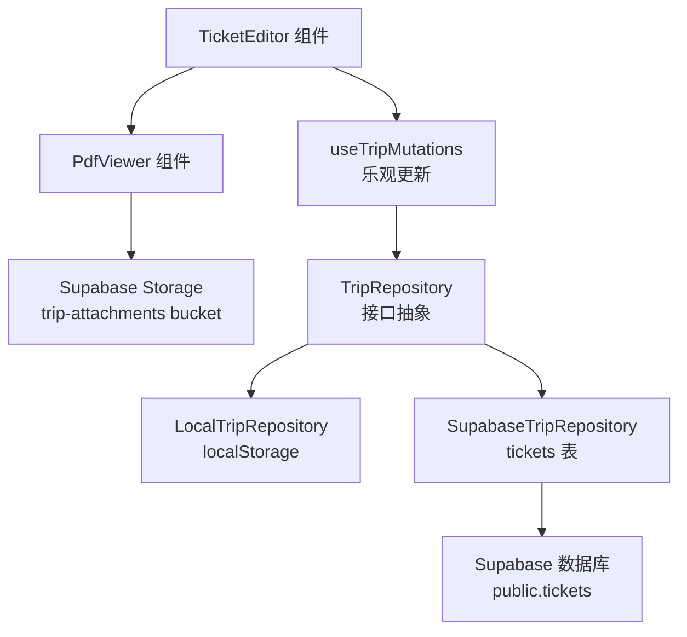
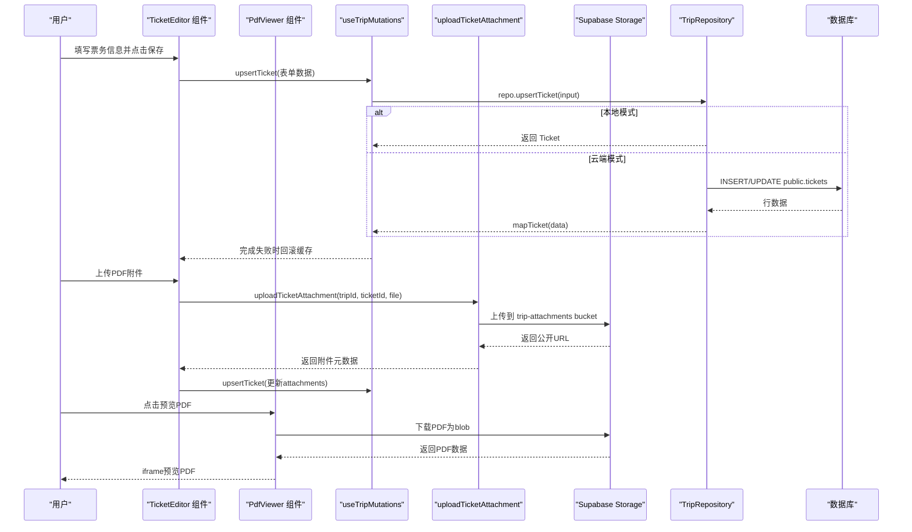
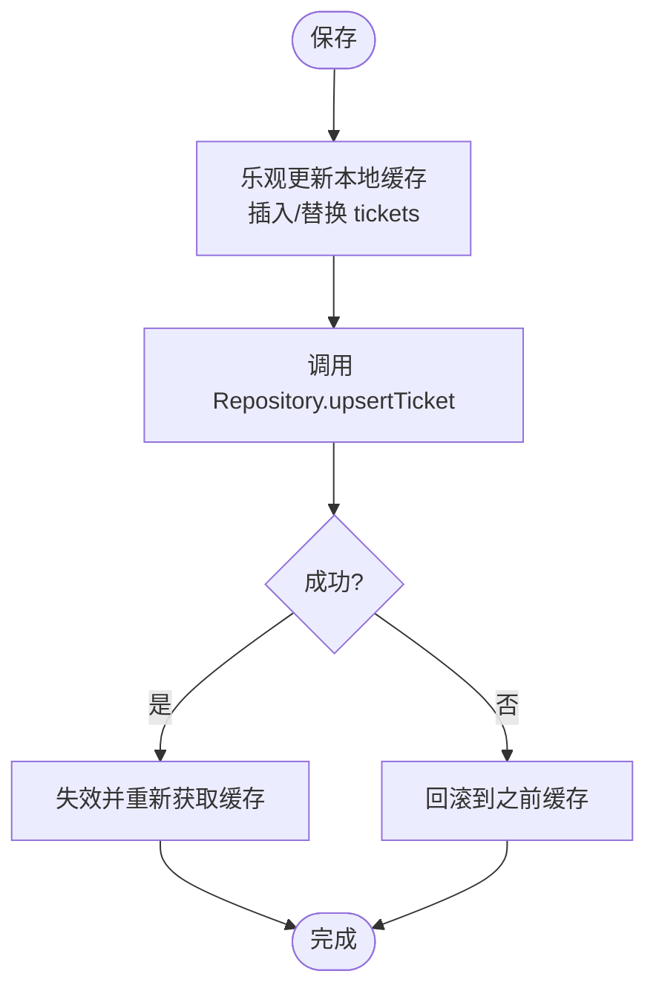
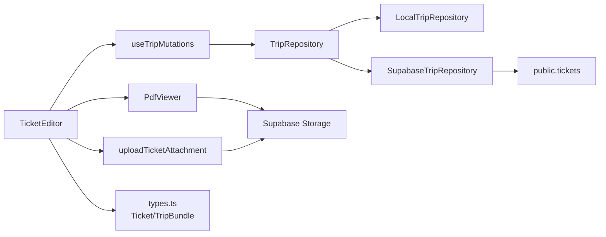

# 票务编辑器

<cite>
**本文引用的文件**
- [TicketEditor.tsx](file://src/features/trip/TicketEditor.tsx)
- [TicketEditor.module.css](file://src/features/trip/TicketEditor.module.css)
- [PdfViewer.tsx](file://src/components/PdfViewer.tsx)
- [uploadTicketAttachment.ts](file://src/features/trip/uploadTicketAttachment.ts)
- [queries.ts](file://src/features/trip/queries.ts)
- [types.ts](file://src/data/types.ts)
- [local-trip.ts](file://src/data/adapters/local-trip.ts)
- [supabase-trip.ts](file://src/data/adapters/supabase-trip.ts)
- [0001_init.sql](file://supabase/migrations/0001_init.sql)
- [0008_ticket_attachments.sql](file://supabase/migrations/0008_ticket_attachments.sql)
</cite>

## 更新摘要
**变更内容**
- 新增PDF附件管理功能，支持上传、查看和删除电子票证PDF文件
- 集成Supabase Storage进行PDF文件存储和管理
- 实现PDF预览弹窗功能，支持桌面端iframe预览和移动端新标签页打开
- 增强Ticket模型以支持attachments字段存储PDF元数据
- 添加文件大小限制（10MB）和MIME类型验证

## 目录
1. [简介](#简介)
2. [项目结构](#项目结构)
3. [核心组件](#核心组件)
4. [架构总览](#架构总览)
5. [详细组件分析](#详细组件分析)
6. [依赖关系分析](#依赖关系分析)
7. [性能考量](#性能考量)
8. [故障排查指南](#故障排查指南)
9. [结论](#结论)
10. [附录](#附录)

## 简介
本文件为"票务编辑器"的完整技术文档，聚焦于行程中的票务信息管理。当前实现以"景点导览卡内嵌的订票信息"为核心，支持创建、编辑、删除单条票务记录；数据通过统一的数据仓库接口（Repository）持久化到本地存储或云端数据库。**最新更新**：已增强PDF附件管理功能，支持上传、查看和管理电子票证PDF文件，提供完整的电子票证生命周期管理能力。

## 项目结构
票务相关代码分布在以下层次：
- 表现层：TicketEditor 组件负责表单输入与交互，PdfViewer 组件负责PDF预览
- 状态与变更层：useTripMutations 提供统一的写操作（含票务 upsert/remove），并实现乐观更新
- 附件管理层：uploadTicketAttachment 处理PDF文件的上传和删除
- 数据层：types 定义 Ticket、TicketAttachment 等类型；adapters 提供本地与 Supabase 两种实现
- 持久化层：Supabase 迁移脚本定义 tickets 表结构与约束

**图表来源**
- [TicketEditor.tsx:15-245](file://src/features/trip/TicketEditor.tsx#L15-L245)
- [PdfViewer.tsx:27-123](file://src/components/PdfViewer.tsx#L27-L123)
- [uploadTicketAttachment.ts:19-52](file://src/features/trip/uploadTicketAttachment.ts#L19-L52)
- [queries.ts:188-216](file://src/features/trip/queries.ts#L188-L216)

**章节来源**
- [TicketEditor.tsx:1-246](file://src/features/trip/TicketEditor.tsx#L1-L246)
- [PdfViewer.tsx:1-123](file://src/components/PdfViewer.tsx#L1-L123)
- [uploadTicketAttachment.ts:1-60](file://src/features/trip/uploadTicketAttachment.ts#L1-L60)
- [queries.ts:1-236](file://src/features/trip/queries.ts#L1-L236)
- [types.ts:195-220](file://src/data/types.ts#L195-L220)

## 核心组件
- **票务编辑器组件**：提供"已订票"开关、入场时间、购票渠道、确认号、备注等字段的录入与保存/删除，以及PDF附件管理功能
- **PDF预览组件**：实现PDF文件的弹窗预览，支持桌面端iframe渲染和移动端新标签页打开
- **附件上传组件**：封装PDF文件的上传、删除逻辑，集成Supabase Storage服务
- **写操作封装**：统一通过 useTripMutations 调用 Repository 的 upsertTicket/removeTicket，并在前端进行乐观更新
- **数据类型**：Ticket 模型定义了所有票务字段及可选性，包含attachments数组用于存储PDF元数据
- **适配器**：本地与云端两套实现，保证同一接口在不同环境运行

**章节来源**
- [TicketEditor.tsx:15-245](file://src/features/trip/TicketEditor.tsx#L15-L245)
- [PdfViewer.tsx:27-123](file://src/components/PdfViewer.tsx#L27-L123)
- [uploadTicketAttachment.ts:19-52](file://src/features/trip/uploadTicketAttachment.ts#L19-L52)
- [queries.ts:188-216](file://src/features/trip/queries.ts#L188-L216)
- [types.ts:195-220](file://src/data/types.ts#L195-L220)

## 架构总览
下图展示了从用户操作到数据落库的完整链路，包括乐观更新与回滚机制，以及PDF附件管理的完整流程。

**图表来源**
- [TicketEditor.tsx:85-119](file://src/features/trip/TicketEditor.tsx#L85-L119)
- [PdfViewer.tsx:52-83](file://src/components/PdfViewer.tsx#L52-L83)
- [uploadTicketAttachment.ts:19-43](file://src/features/trip/uploadTicketAttachment.ts#L19-L43)
- [queries.ts:188-216](file://src/features/trip/queries.ts#L188-L216)

## 详细组件分析

### 数据结构与字段说明
- **标识与关联**
  - id: 主键（UUID）
  - tripId: 所属行程
  - itemId: 可关联到某个行程条目（如景点），可为空
- **基本信息**
  - title: 票面标题（通常来自景点名或自定义）
  - channel: 购票渠道（如官网、携程、Klook 等）
  - officialUrl: 官方链接（可选）
- **时间与场次**
  - timeSlot: 入场时间或时段（例如"09:00"或"09:00-11:00"）
  - leadDays: 建议提前预约天数（可覆盖 POI 默认值）
- **价格与币种**
  - priceCents: 价格（单位：分，非负）
  - currency: 币种（ISO 三位码）
- **预订状态与敏感信息**
  - booked: 是否已订票
  - bookingRef: 确认号/订单号（半敏感，分享快照中不展示）
  - note: 备注（票种、注意事项等）
- **PDF附件信息**（新增）
  - attachments: PDF附件元数据数组，包含url、name、size、uploadedAt字段

**章节来源**
- [types.ts:195-220](file://src/data/types.ts#L195-L220)
- [0001_init.sql:140-160](file://supabase/migrations/0001_init.sql#L140-L160)
- [0008_ticket_attachments.sql:1-20](file://supabase/migrations/0008_ticket_attachments.sql#L1-L20)

### 表单与交互
- **入口**：在景点导览卡底部提供"＋ 记录订票"按钮
- **字段**：
  - 已订票（布尔）
  - 入场时间（time 控件）
  - 购票渠道（文本）
  - 确认号/订单号（文本）
  - 备注（多行文本）
- **动作**：
  - 保存：调用 upsertTicket，支持新增与更新
  - 删除：调用 removeTicket（仅当存在已有记录时显示）
- **PDF附件管理**（新增）：
  - 上传：支持选择PDF文件，限制10MB大小，仅允许application/pdf类型
  - 预览：点击文件名弹出PDF预览窗口，支持iframe渲染和新标签页打开
  - 删除：每个附件旁边有删除按钮，可单独移除PDF文件

**章节来源**
- [TicketEditor.tsx:15-245](file://src/features/trip/TicketEditor.tsx#L15-L245)
- [TicketEditor.module.css:97-204](file://src/features/trip/TicketEditor.module.css#L97-L204)

### PDF附件管理功能详解
- **上传流程**：
  1. 用户选择PDF文件，触发onPickPdf函数
  2. 验证文件类型（application/pdf）和大小（≤10MB）
  3. 调用uploadTicketAttachment上传到Supabase Storage
  4. 获取公开URL并生成附件元数据
  5. 更新ticket的attachments数组
- **预览功能**：
  1. 点击附件名称触发PdfViewer组件
  2. 通过Supabase客户端下载PDF为blob
  3. 使用URL.createObjectURL创建本地blob URL
  4. 在iframe中渲染PDF，支持键盘ESC关闭
- **删除功能**：
  1. 点击删除按钮调用deleteTicketAttachment
  2. 从Supabase Storage删除对应文件
  3. 更新ticket的attachments数组移除该附件

**章节来源**
- [TicketEditor.tsx:85-119](file://src/features/trip/TicketEditor.tsx#L85-L119)
- [PdfViewer.tsx:27-123](file://src/components/PdfViewer.tsx#L27-L123)
- [uploadTicketAttachment.ts:19-52](file://src/features/trip/uploadTicketAttachment.ts#L19-L52)

### 写入流程与乐观更新
- 组件触发保存后，先立即在本地缓存中插入或替换对应 ticket（乐观更新），再发起网络请求
- 若网络失败，自动回滚到之前的缓存状态，避免界面不一致
- 成功后刷新相关查询缓存，确保列表与详情一致
- **PDF附件更新**：每次上传或删除PDF都会触发ticket的重新保存，保持attachments数组同步

**图表来源**
- [queries.ts:188-216](file://src/features/trip/queries.ts#L188-L216)

**章节来源**
- [queries.ts:188-216](file://src/features/trip/queries.ts#L188-L216)

### 数据持久化与校验
- **本地适配器**：在内存中维护 TripBundle，直接修改 tickets 数组并持久化到 localStorage
- **云端适配器**：将字段映射到数据库列，执行 INSERT/UPDATE，并通过 mapTicket 转换回领域模型
- **数据库约束**：
  - price_cents >= 0
  - currency 固定长度
  - time_slot 用于存放时间或时段
  - booking_ref 为半敏感字段，不参与分享快照
  - **attachments jsonb 列**：存储PDF附件元数据数组，默认空数组
- **文件存储**：PDF文件存储在Supabase Storage的trip-attachments bucket，路径格式为{tripId}/tickets/{ticketId}/{timestamp}-{filename}

**章节来源**
- [local-trip.ts:305-325](file://src/data/adapters/local-trip.ts#L305-L325)
- [supabase-trip.ts:438-471](file://src/data/adapters/supabase-trip.ts#L438-L471)
- [0001_init.sql:140-160](file://supabase/migrations/0001_init.sql#L140-L160)
- [0008_ticket_attachments.sql:10-19](file://supabase/migrations/0008_ticket_attachments.sql#L10-L19)

### 业务规则与验证要点
- 价格必须为非负数（由数据库约束保障）
- 币种使用 ISO 三位码（由数据库列宽约束）
- 入场时间支持单点或区间格式（由业务约定与注释说明）
- 确认号为半敏感信息，不应出现在分享快照中（由设计与注释约定）
- 建议提前预约天数可由 POI 默认值覆盖（leadDays）
- **PDF附件规则**（新增）：
  - 仅支持PDF文件格式（application/pdf）
  - 文件大小限制为10MB
  - 文件名经过安全处理，去除特殊字符
  - 上传时使用application/octet-stream绕过MIME限制

**章节来源**
- [0001_init.sql:140-160](file://supabase/migrations/0001_init.sql#L140-L160)
- [types.ts:195-220](file://src/data/types.ts#L195-L220)
- [uploadTicketAttachment.ts:24-26](file://src/features/trip/uploadTicketAttachment.ts#L24-L26)

### 如何添加新的票务类型
当前 Ticket 模型为通用票务实体，可通过以下方式扩展以支持机票、火车票、船票等：
- 在 Ticket 上增加"类型"字段（如 transportMode 或 ticketType），并在 UI 层提供选择器
- 在 TicketEditor 中根据类型动态渲染差异化字段（如航班号、车次号、座位号等）
- 在 Repository 层保持兼容：新增字段可为空，旧数据不受影响
- 在数据库层通过迁移新增列（如 flight_no、train_no、seat_no），并设置必要约束
- **PDF附件扩展**：可在TicketAttachment中添加更多元数据字段，如票证类型、二维码信息等

注意：当前代码未包含航班号、车次号、座位号等专用字段，需按上述步骤扩展。

**章节来源**
- [types.ts:195-220](file://src/data/types.ts#L195-L220)
- [TicketEditor.tsx:15-245](file://src/features/trip/TicketEditor.tsx#L15-L245)
- [0001_init.sql:140-160](file://supabase/migrations/0001_init.sql#L140-L160)

### 集成第三方票务 API
- 在 Repository 层新增方法（如 bookViaApi），封装第三方 API 调用与重试、鉴权、幂等处理
- 在 useTripMutations 中暴露新的 mutation，结合乐观更新提升体验
- 将返回的订单号、二维码、取票码等映射到 Ticket 的相应字段（如 bookingRef、officialUrl、note）
- 对敏感字段（如确认号）遵循"分享快照不展示"的原则
- **PDF集成**：可将第三方API返回的电子票证PDF直接上传到附件系统

**章节来源**
- [queries.ts:188-216](file://src/features/trip/queries.ts#L188-L216)
- [types.ts:195-220](file://src/data/types.ts#L195-L220)

### 实现票务提醒功能
- 基于 leadDays 与行程日期计算提醒阈值（如提前 N 天）
- 在前端通过定时任务或页面加载时检查，生成提醒列表
- 可将提醒与行程日程联动，在时间线或移动端随身册中提示
- 提醒内容可包含：预约截止、入场时间、渠道链接、确认号（仅在个人视图）、**PDF附件链接**
- **PDF提醒增强**：可在提醒中包含PDF附件的快速访问链接

**章节来源**
- [types.ts:195-220](file://src/data/types.ts#L195-L220)

### 导入导出与批量操作
- 当前实现未提供专门的票务导入/导出与批量操作入口
- 由于 Ticket 属于 TripBundle 的一部分，可在未来扩展批量导入（CSV/JSON）与批量更新（如批量标记已订票、批量设置入场时间）
- 建议在 Repository 层增加批量方法（如 batchUpsertTickets），并在 UI 层提供批量编辑面板
- **PDF批量操作**：可考虑支持批量上传多个PDF文件或批量删除附件

**章节来源**
- [types.ts:231-239](file://src/data/types.ts#L231-L239)
- [queries.ts:188-216](file://src/features/trip/queries.ts#L188-L216)

## 依赖关系分析
- **组件依赖**：
  - TicketEditor 依赖 useTripMutations 提供的 upsertTicket/removeTicket
  - PdfViewer 依赖 supabase 客户端进行PDF下载
  - uploadTicketAttachment 依赖 supabase storage 进行文件操作
- **适配器依赖**：
  - LocalTripRepository 依赖 localStorage 与 TripBundle
  - SupabaseTripRepository 依赖 Supabase 客户端与 tickets 表
- **类型依赖**：
  - types.ts 定义 Ticket、TicketAttachment、TripBundle 等核心类型，贯穿 UI、状态与数据层

**图表来源**
- [TicketEditor.tsx:15-245](file://src/features/trip/TicketEditor.tsx#L15-L245)
- [PdfViewer.tsx:27-123](file://src/components/PdfViewer.tsx#L27-L123)
- [uploadTicketAttachment.ts:19-52](file://src/features/trip/uploadTicketAttachment.ts#L19-L52)
- [queries.ts:188-216](file://src/features/trip/queries.ts#L188-L216)

**章节来源**
- [TicketEditor.tsx:15-245](file://src/features/trip/TicketEditor.tsx#L15-L245)
- [PdfViewer.tsx:27-123](file://src/components/PdfViewer.tsx#L27-L123)
- [uploadTicketAttachment.ts:19-52](file://src/features/trip/uploadTicketAttachment.ts#L19-L52)
- [queries.ts:188-216](file://src/features/trip/queries.ts#L188-L216)
- [types.ts:195-220](file://src/data/types.ts#L195-L220)

## 性能考量
- **乐观更新**：保存后立即更新本地缓存，减少等待感，提升拖拽与频繁编辑的体验
- **缓存失效**：在网络完成后失效相关查询缓存，保证数据一致性
- **本地存储**：开发模式下使用 localStorage，读写开销低，适合演示与离线场景
- **数据库索引**：tickets.trip_id 建立索引，加速按行程查询
- **PDF性能优化**（新增）：
  - PDF文件按需下载，避免预加载所有附件
  - 使用blob URL临时存储，及时释放内存
  - 支持新标签页打开，利用浏览器原生PDF渲染能力
  - 文件大小限制防止大文件影响性能

**章节来源**
- [queries.ts:188-216](file://src/features/trip/queries.ts#L188-L216)
- [0001_init.sql:140-160](file://supabase/migrations/0001_init.sql#L140-L160)
- [PdfViewer.tsx:52-83](file://src/components/PdfViewer.tsx#L52-L83)

## 故障排查指南
- **保存无响应或失败**
  - 检查 useTripMutations 的错误回调与回滚逻辑是否正常
  - 查看网络请求是否抛出异常（云端模式）
- **数据不同步**
  - 确认缓存失效逻辑是否触发
  - 核对本地与云端数据是否一致（对比 TripBundle 中的 tickets）
- **字段校验失败**
  - 检查数据库约束（如 price_cents 非负、currency 长度）
  - 确认前端提交前是否对空字符串进行了 trim 处理
- **PDF附件问题**（新增）：
  - 上传失败：检查文件类型是否为PDF，大小是否超过10MB
  - 预览失败：确认Supabase连接正常，检查bucket权限配置
  - 删除失败：验证文件路径解析是否正确，检查storage权限

**章节来源**
- [queries.ts:188-216](file://src/features/trip/queries.ts#L188-L216)
- [0001_init.sql:140-160](file://supabase/migrations/0001_init.sql#L140-L160)
- [uploadTicketAttachment.ts:24-26](file://src/features/trip/uploadTicketAttachment.ts#L24-L26)

## 结论
当前票务编辑器围绕"景点导览卡内的订票信息"提供了完整的录入、编辑与删除能力，采用乐观更新提升交互体验，并通过 Repository 抽象同时支持本地与云端持久化。**最新增强**的PDF附件管理功能为用户提供了完整的电子票证管理能力，包括上传、预览、删除等操作，大大提升了用户体验。数据结构清晰、约束明确，便于后续扩展更多票务类型（机票、火车、船票）、集成第三方 API 与实现提醒功能。导入导出与批量操作可在现有基础上逐步增强。

## 附录
- **字段映射参考**：
  - 前端字段 → 数据库列（云端适配器）
  - 示例：channel → channel, officialUrl → official_url, priceCents → price_cents, currency → currency, timeSlot → time_slot, bookingRef → booking_ref, leadDays → lead_days, note → note, attachments → attachments
- **敏感信息策略**：
  - bookingRef 为半敏感字段，不参与分享快照，保护用户隐私
  - PDF附件URL为公开链接，但文件名可能包含敏感信息，需注意隐私保护
- **PDF附件存储规范**：
  - Bucket: trip-attachments
  - 路径格式: {tripId}/tickets/{ticketId}/{timestamp}-{safeFilename}
  - 最大文件大小: 10MB
  - 支持MIME类型: application/pdf

**章节来源**
- [supabase-trip.ts:438-471](file://src/data/adapters/supabase-trip.ts#L438-L471)
- [0001_init.sql:140-160](file://supabase/migrations/0001_init.sql#L140-L160)
- [0008_ticket_attachments.sql:10-19](file://supabase/migrations/0008_ticket_attachments.sql#L10-L19)
- [uploadTicketAttachment.ts:15-16](file://src/features/trip/uploadTicketAttachment.ts#L15-L16)