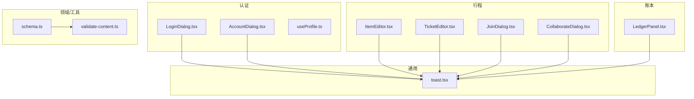
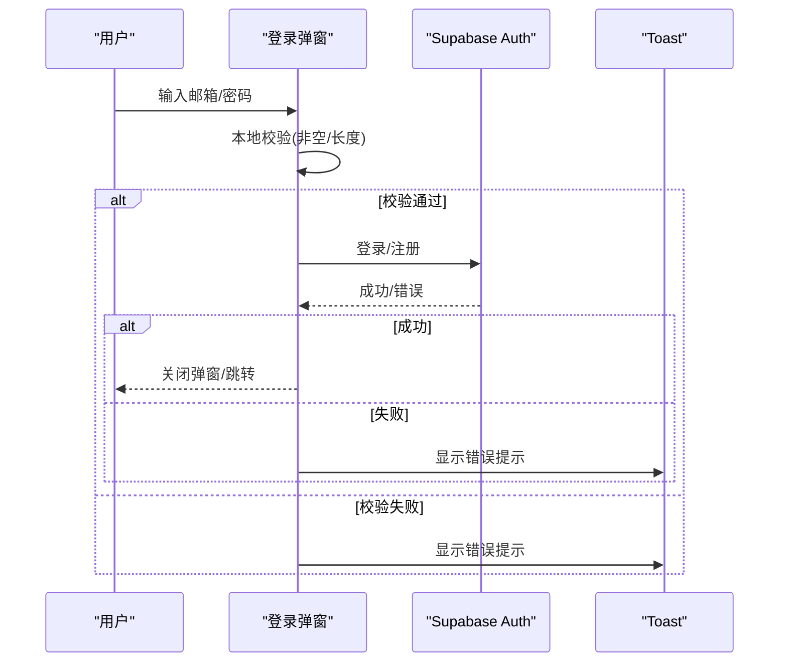
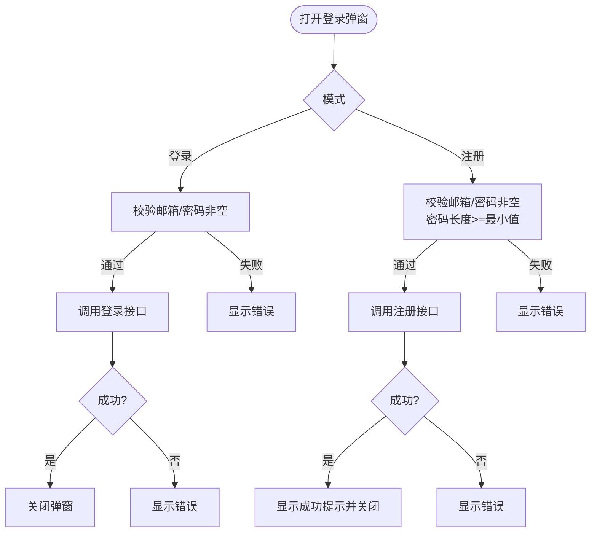
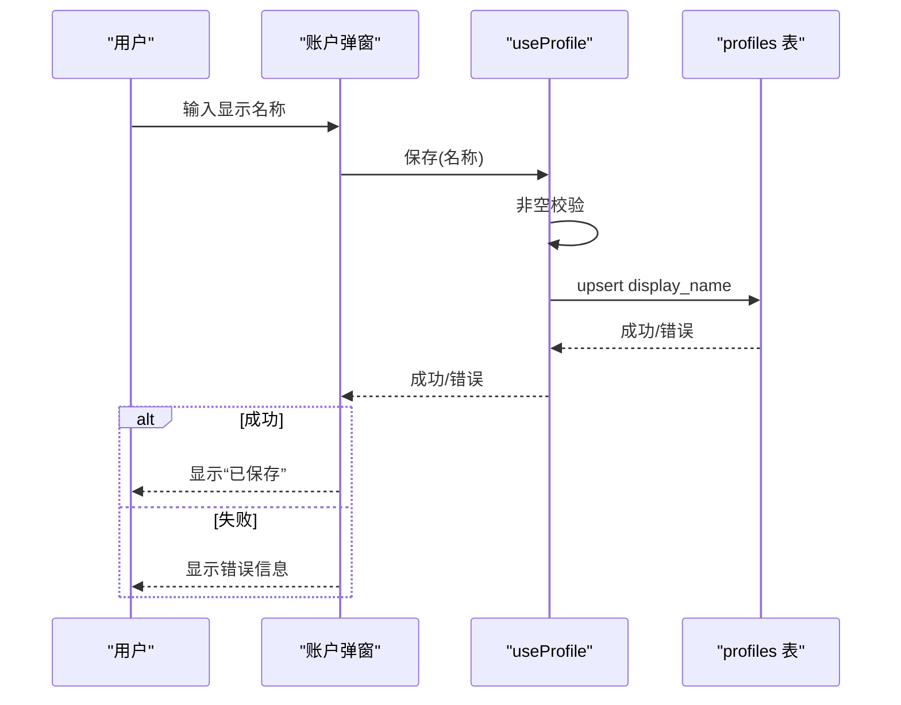
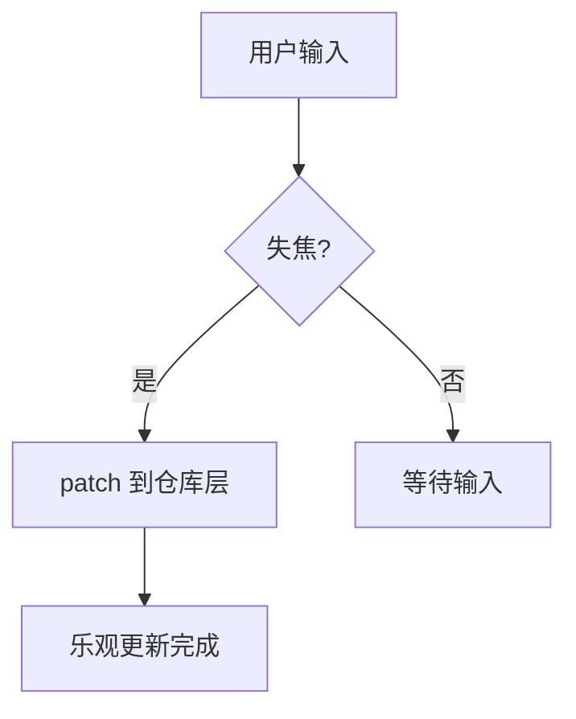
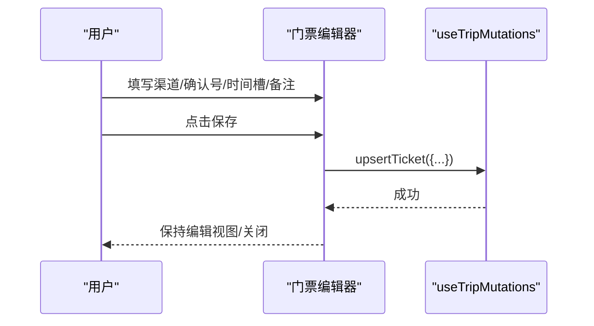
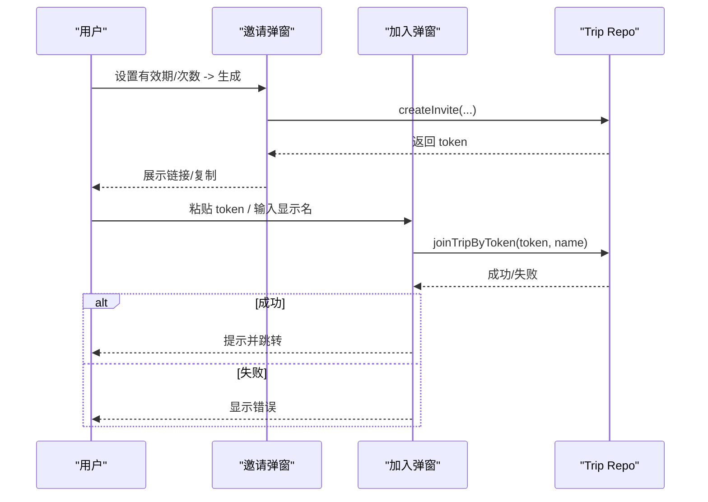
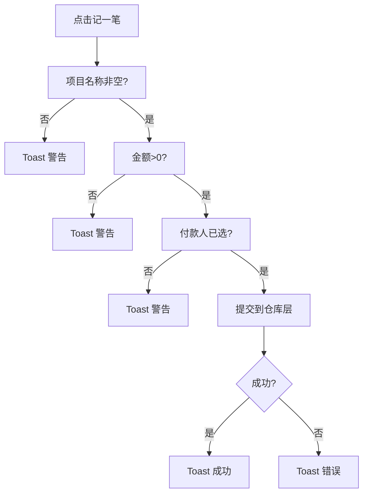
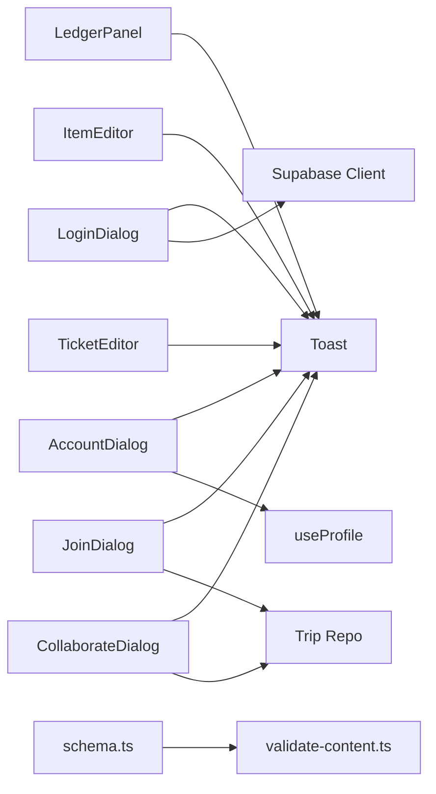

# 表单验证机制

<cite>
**本文引用的文件**
- [LoginDialog.tsx](file://src/features/auth/LoginDialog.tsx)
- [AccountDialog.tsx](file://src/features/auth/AccountDialog.tsx)
- [useProfile.ts](file://src/features/auth/useProfile.ts)
- [LedgerPanel.tsx](file://src/features/expense/LedgerPanel.tsx)
- [ItemEditor.tsx](file://src/features/trip/ItemEditor.tsx)
- [TicketEditor.tsx](file://src/features/trip/TicketEditor.tsx)
- [JoinDialog.tsx](file://src/features/trip/JoinDialog.tsx)
- [CollaborateDialog.tsx](file://src/features/trip/CollaborateDialog.tsx)
- [toast.tsx](file://src/ui/toast.tsx)
- [schema.ts](file://src/domain/world/schema.ts)
- [validate-content.ts](file://scripts/validate-content.ts)
</cite>

## 目录
1. [简介](#简介)
2. [项目结构](#项目结构)
3. [核心组件](#核心组件)
4. [架构总览](#架构总览)
5. [详细组件分析](#详细组件分析)
6. [依赖关系分析](#依赖关系分析)
7. [性能考虑](#性能考虑)
8. [故障排查指南](#故障排查指南)
9. [结论](#结论)
10. [附录](#附录)

## 简介
本文件系统性梳理本项目中的表单验证机制，覆盖登录注册、账户信息、行程条目编辑、门票记录、协作邀请与加入、账本记账等场景。文档聚焦以下方面：
- 实时验证（输入时/失焦时）与提交时验证的组合策略
- 异步验证（网络请求、权限校验）的集成方式
- 层次化验证体系：必填检查、格式验证、业务规则校验
- 错误提示的用户体验：即时反馈、友好提示、错误定位
- 自定义验证器、跨字段验证、第三方库集成的实践建议
- 性能优化、移动端适配、无障碍访问的高级特性

## 项目结构
本项目采用“按功能域组织”的结构，表单与验证逻辑主要分布在以下位置：
- 认证相关：登录/注册弹窗、账户信息修改
- 行程编辑：条目编辑器、门票编辑器
- 协作：邀请生成与加入
- 账本：记账表单与结算展示
- 通用反馈：Toast 提示系统
- 数据模型与内容校验：Zod Schema 与 CI 校验脚本

图表来源
- [LoginDialog.tsx:1-158](file://src/features/auth/LoginDialog.tsx#L1-L158)
- [AccountDialog.tsx:1-95](file://src/features/auth/AccountDialog.tsx#L1-L95)
- [useProfile.ts:38-64](file://src/features/auth/useProfile.ts#L38-L64)
- [ItemEditor.tsx:1-392](file://src/features/trip/ItemEditor.tsx#L1-L392)
- [TicketEditor.tsx:1-129](file://src/features/trip/TicketEditor.tsx#L1-L129)
- [JoinDialog.tsx:1-110](file://src/features/trip/JoinDialog.tsx#L1-L110)
- [CollaborateDialog.tsx:1-197](file://src/features/trip/CollaborateDialog.tsx#L1-L197)
- [LedgerPanel.tsx:1-474](file://src/features/expense/LedgerPanel.tsx#L1-L474)
- [toast.tsx:1-82](file://src/ui/toast.tsx#L1-L82)
- [schema.ts:34-316](file://src/domain/world/schema.ts#L34-L316)
- [validate-content.ts:1-37](file://scripts/validate-content.ts#L1-L37)

章节来源
- [LoginDialog.tsx:1-158](file://src/features/auth/LoginDialog.tsx#L1-L158)
- [LedgerPanel.tsx:1-474](file://src/features/expense/LedgerPanel.tsx#L1-L474)
- [ItemEditor.tsx:1-392](file://src/features/trip/ItemEditor.tsx#L1-L392)
- [TicketEditor.tsx:1-129](file://src/features/trip/TicketEditor.tsx#L1-L129)
- [JoinDialog.tsx:1-110](file://src/features/trip/JoinDialog.tsx#L1-L110)
- [CollaborateDialog.tsx:1-197](file://src/features/trip/CollaborateDialog.tsx#L1-L197)
- [toast.tsx:1-82](file://src/ui/toast.tsx#L1-L82)
- [schema.ts:34-316](file://src/domain/world/schema.ts#L34-L316)
- [validate-content.ts:1-37](file://scripts/validate-content.ts#L1-L37)

## 核心组件
- 登录/注册弹窗：实现邮箱+密码的必填与长度校验，支持匿名登录与魔法链接登录；提交前进行本地校验，提交后通过后端返回的错误消息进行用户提示。
- 账户对话框：显示名称保存前进行非空校验，并禁用无变更时的重复提交。
- 行程条目编辑器：以“失焦即保存”的方式更新字段，减少显式提交；对可选字段提供默认值处理。
- 门票编辑器：结构化字段（渠道、确认号、时间槽、备注）在保存时进行基础清理（trim/null 化），由仓库层负责持久化。
- 协作邀请/加入：邀请令牌与显示名在提交前做最小合法性检查；未登录时引导登录。
- 账本记账：提交时进行项目名称、金额、付款人等必填校验；使用 Toast 给出即时反馈。
- Toast 系统：全局统一的轻提示组件，支持成功、错误、警告、信息四类，自动消失并可点击关闭，具备无障碍属性。

章节来源
- [LoginDialog.tsx:16-82](file://src/features/auth/LoginDialog.tsx#L16-L82)
- [AccountDialog.tsx:13-36](file://src/features/auth/AccountDialog.tsx#L13-L36)
- [useProfile.ts:41-64](file://src/features/auth/useProfile.ts#L41-L64)
- [ItemEditor.tsx:52-54](file://src/features/trip/ItemEditor.tsx#L52-L54)
- [TicketEditor.tsx:35-57](file://src/features/trip/TicketEditor.tsx#L35-L57)
- [JoinDialog.tsx:16-38](file://src/features/trip/JoinDialog.tsx#L16-L38)
- [CollaborateDialog.tsx:24-55](file://src/features/trip/CollaborateDialog.tsx#L24-L55)
- [LedgerPanel.tsx:83-144](file://src/features/expense/LedgerPanel.tsx#L83-L144)
- [toast.tsx:18-81](file://src/ui/toast.tsx#L18-L81)

## 架构总览
表单验证在本项目中遵循“前端轻量校验 + 后端严格校验”的分层策略：
- 前端：快速失败，提升用户体验（必填、格式、简单业务规则）
- 后端：权威校验，保障数据一致性与安全（RLS、数据库约束、RPC 校验）
- 统一反馈：通过 Toast 或内联错误区域呈现结果

图表来源
- [LoginDialog.tsx:37-82](file://src/features/auth/LoginDialog.tsx#L37-L82)
- [toast.tsx:42-81](file://src/ui/toast.tsx#L42-L81)

## 详细组件分析

### 登录/注册表单（LoginDialog）
- 实时验证：
  - 邮箱与密码为受控状态，输入变化仅更新状态
  - 密码长度在提交时校验（最小长度常量）
- 提交时验证：
  - 登录：邮箱与密码非空
  - 注册：邮箱与密码非空，且密码满足最小长度
- 异步验证：
  - 调用 Supabase 登录/注册接口，捕获错误并提示
- 用户体验：
  - 错误信息以内联区域显示
  - 支持 Enter 快捷提交
  - 支持匿名登录与邮箱魔法链接作为替代路径

图表来源
- [LoginDialog.tsx:16-82](file://src/features/auth/LoginDialog.tsx#L16-L82)

章节来源
- [LoginDialog.tsx:16-82](file://src/features/auth/LoginDialog.tsx#L16-L82)

### 账户信息（AccountDialog + useProfile）
- 实时验证：
  - 显示名称输入时去空格，计算是否与原值相同，避免无效提交
- 提交时验证：
  - 名称非空校验（在 mutation 中抛出错误）
- 异步验证：
  - 调用后端更新 profiles.display_name，失败则提示
- 用户体验：
  - 保存按钮在未变更或保存中禁用
  - 成功后显示“已保存”，失败显示错误信息

图表来源
- [AccountDialog.tsx:13-36](file://src/features/auth/AccountDialog.tsx#L13-L36)
- [useProfile.ts:41-64](file://src/features/auth/useProfile.ts#L41-L64)

章节来源
- [AccountDialog.tsx:13-36](file://src/features/auth/AccountDialog.tsx#L13-L36)
- [useProfile.ts:41-64](file://src/features/auth/useProfile.ts#L41-L64)

### 行程条目编辑器（ItemEditor）
- 验证策略：
  - 多数字段采用“失焦即保存”（onBlur），减少显式提交
  - 可选字段允许为空，内部进行 trim/null 化处理
- 用户体验：
  - 自适应高度文本域提升长文本输入体验
  - 地址字段支持复制，便于移动端操作
- 可拓展点：
  - 可在 onBlur 中加入更严格的格式校验（如日期范围、城市存在性）

图表来源
- [ItemEditor.tsx:52-54](file://src/features/trip/ItemEditor.tsx#L52-L54)
- [ItemEditor.tsx:340-375](file://src/features/trip/ItemEditor.tsx#L340-L375)

章节来源
- [ItemEditor.tsx:52-54](file://src/features/trip/ItemEditor.tsx#L52-L54)
- [ItemEditor.tsx:340-375](file://src/features/trip/ItemEditor.tsx#L340-L375)

### 门票编辑器（TicketEditor）
- 验证策略：
  - 保存时对字符串字段执行 trim，空值转为 null，简化后端存储
  - 时间槽、渠道、确认号等字段保持宽松校验，交由后端保证一致性
- 用户体验：
  - 保存按钮在请求期间禁用，防止重复提交
  - 删除操作同样带忙态控制

图表来源
- [TicketEditor.tsx:35-57](file://src/features/trip/TicketEditor.tsx#L35-L57)

章节来源
- [TicketEditor.tsx:35-57](file://src/features/trip/TicketEditor.tsx#L35-L57)

### 协作邀请与加入（CollaborateDialog + JoinDialog）
- 邀请生成：
  - 有效期与最大使用次数为下拉选择，提交前无需复杂校验
  - 生成成功后展示链接并支持一键复制
- 加入行程：
  - 令牌与显示名在提交前做最小合法性检查（非空）
  - 未登录时提示需先登录（匿名也可）
- 错误处理：
  - 移除成员时若因外键约束失败，解析错误信息并给出友好提示

图表来源
- [CollaborateDialog.tsx:42-55](file://src/features/trip/CollaborateDialog.tsx#L42-L55)
- [JoinDialog.tsx:27-38](file://src/features/trip/JoinDialog.tsx#L27-L38)

章节来源
- [CollaborateDialog.tsx:42-82](file://src/features/trip/CollaborateDialog.tsx#L42-L82)
- [JoinDialog.tsx:27-96](file://src/features/trip/JoinDialog.tsx#L27-L96)

### 账本记账（LedgerPanel）
- 实时验证：
  - 金额与汇率输入限制为非数字字符，避免非法输入
- 提交时验证：
  - 项目名称非空
  - 金额必须大于 0
  - 付款人必须选择
- 用户体验：
  - 使用 Toast 给出成功/警告/错误反馈
  - 编辑模式下保留原始花费时间，避免误改

图表来源
- [LedgerPanel.tsx:83-144](file://src/features/expense/LedgerPanel.tsx#L83-L144)

章节来源
- [LedgerPanel.tsx:83-144](file://src/features/expense/LedgerPanel.tsx#L83-L144)

### 通用反馈（Toast）
- 设计要点：
  - 零依赖、全局可用，任何组件通过 useToast() 弹出提示
  - 支持 success/error/warn/info 四种类型，自动 3.2s 消失
  - 具备无障碍属性（role="status", aria-live="polite"）
- 使用建议：
  - 将错误信息集中通过 Toast 呈现，避免页面抖动
  - 重要成功操作（如保存）用 success 类型，错误用 error，警告用 warn

章节来源
- [toast.tsx:18-81](file://src/ui/toast.tsx#L18-L81)

## 依赖关系分析
- 组件耦合：
  - 各表单组件依赖 Toast 进行反馈，降低彼此耦合
  - 登录/注册与账户管理依赖 Supabase 客户端与 Profile 查询
  - 行程与协作模块依赖 Trip Repo 与 React Query 缓存失效
- 外部依赖：
  - Supabase（认证、数据存取、RLS）
  - React Query（缓存与状态管理）
  - Zod（用于世界库内容的结构与业务规则校验，虽不直接用于 UI 表单，但体现项目的分层校验思想）

图表来源
- [LoginDialog.tsx:1-158](file://src/features/auth/LoginDialog.tsx#L1-L158)
- [AccountDialog.tsx:1-95](file://src/features/auth/AccountDialog.tsx#L1-L95)
- [LedgerPanel.tsx:1-474](file://src/features/expense/LedgerPanel.tsx#L1-L474)
- [ItemEditor.tsx:1-392](file://src/features/trip/ItemEditor.tsx#L1-L392)
- [TicketEditor.tsx:1-129](file://src/features/trip/TicketEditor.tsx#L1-L129)
- [JoinDialog.tsx:1-110](file://src/features/trip/JoinDialog.tsx#L1-L110)
- [CollaborateDialog.tsx:1-197](file://src/features/trip/CollaborateDialog.tsx#L1-L197)
- [schema.ts:34-316](file://src/domain/world/schema.ts#L34-L316)
- [validate-content.ts:1-37](file://scripts/validate-content.ts#L1-L37)

章节来源
- [schema.ts:34-316](file://src/domain/world/schema.ts#L34-L316)
- [validate-content.ts:1-37](file://scripts/validate-content.ts#L1-L37)

## 性能考虑
- 输入节流与防抖：
  - 对于高频输入（如搜索、长文本），可引入防抖以减少不必要的状态更新与网络请求
- 失焦保存 vs 实时保存：
  - ItemEditor 采用失焦保存，平衡了交互流畅与数据一致性；如需更强实时性，可增加防抖
- 表单提交合并：
  - 批量字段更新时合并 patch，减少多次渲染与网络开销
- 错误提示聚合：
  - 使用 Toast 聚合错误，避免频繁 DOM 操作导致卡顿
- 移动端优化：
  - 使用 inputMode 与合适的 type（如 time、decimal）提升输入体验
  - 大触控目标与清晰的标签/占位符

[本节为通用指导，不直接分析具体文件]

## 故障排查指南
- 登录/注册失败：
  - 检查邮箱与密码是否符合要求（非空、长度）
  - 查看 Toast 或内联错误信息，必要时检查网络与后端状态
- 账户名称保存失败：
  - 确保名称非空，检查是否未登录
  - 查看错误信息，必要时刷新缓存
- 账本提交失败：
  - 确认项目名称、金额、付款人是否完整
  - 查看 Toast 错误详情，定位具体字段问题
- 协作邀请/加入失败：
  - 确认令牌有效、用户已登录
  - 移除成员失败时，检查是否存在外键约束冲突（如该成员是某笔账单的付款人）

章节来源
- [LoginDialog.tsx:37-82](file://src/features/auth/LoginDialog.tsx#L37-L82)
- [AccountDialog.tsx:27-36](file://src/features/auth/AccountDialog.tsx#L27-L36)
- [LedgerPanel.tsx:83-144](file://src/features/expense/LedgerPanel.tsx#L83-L144)
- [CollaborateDialog.tsx:67-82](file://src/features/trip/CollaborateDialog.tsx#L67-L82)

## 结论
本项目采用“前端轻量校验 + 后端严格校验”的分层验证策略，结合 Toast 与内联错误提示，提供了良好的用户体验。不同表单根据场景选择合适的验证时机（实时/失焦/提交时），并通过仓库层与后端保障数据一致性。未来可进一步引入更丰富的实时校验、跨字段校验与第三方验证库集成，以提升健壮性与可维护性。

[本节为总结，不直接分析具体文件]

## 附录

### 自定义验证器示例（概念）
- 创建可复用的验证函数，返回错误消息或布尔值
- 在输入 onChange/onBlur 中调用，实时更新状态
- 在提交时再次校验，确保最终一致性

### 跨字段验证示例（概念）
- 针对关联字段（如开始时间与结束时间）进行组合校验
- 在任一字段变化时触发跨字段校验，及时提示

### 第三方验证库集成（概念）
- 可使用 zod/yup 等库定义字段规则，统一管理与复用
- 与 React Hook Form 等表单库集成，简化状态与校验流程

[本节为概念性内容，不直接分析具体文件]