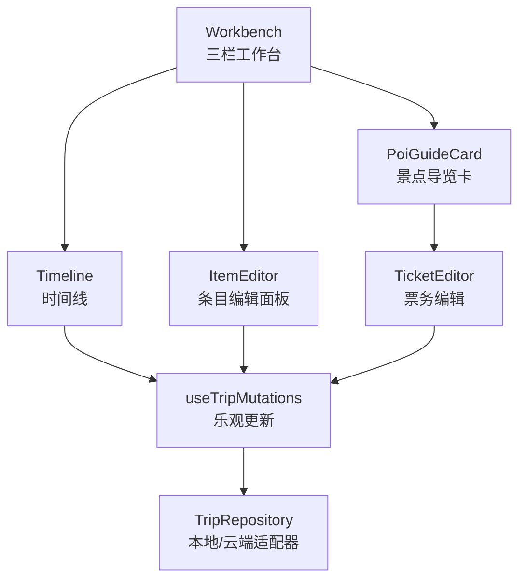
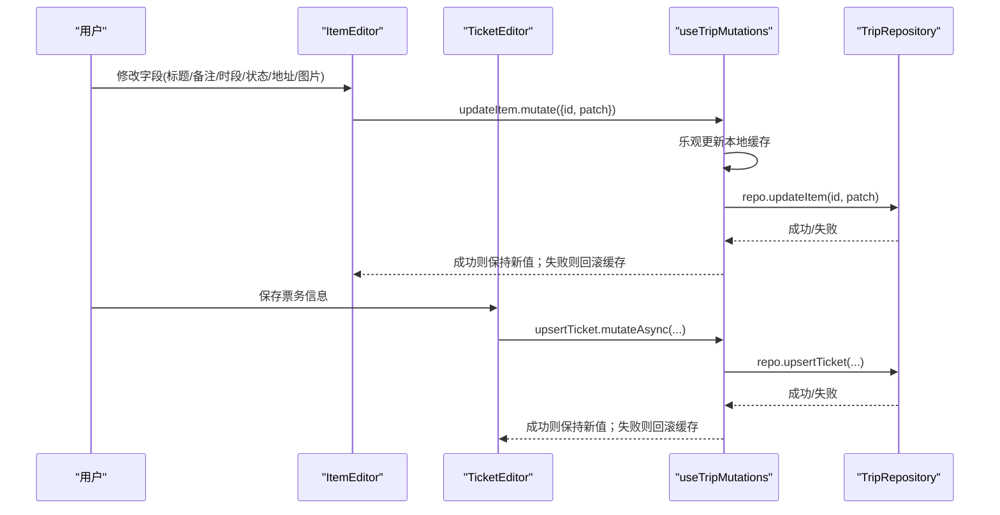
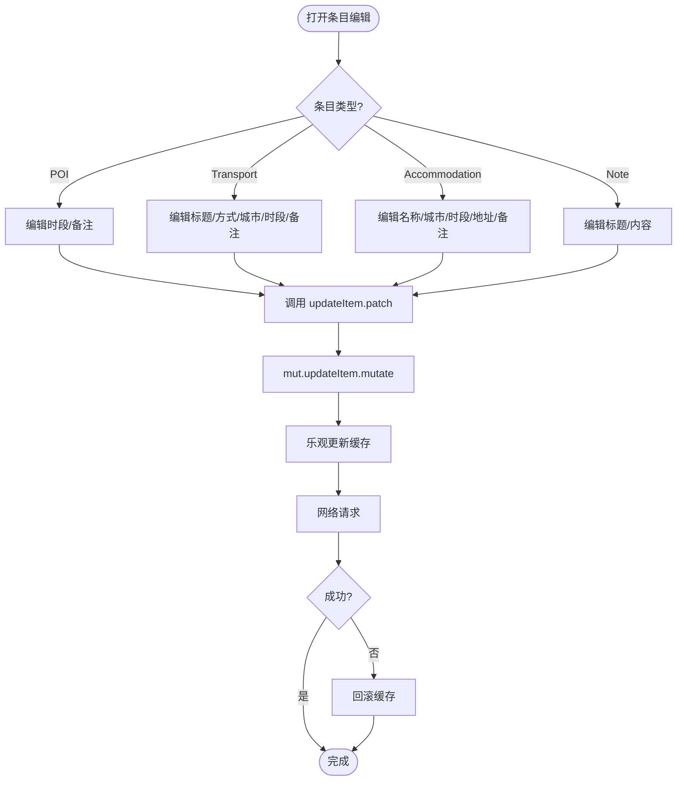
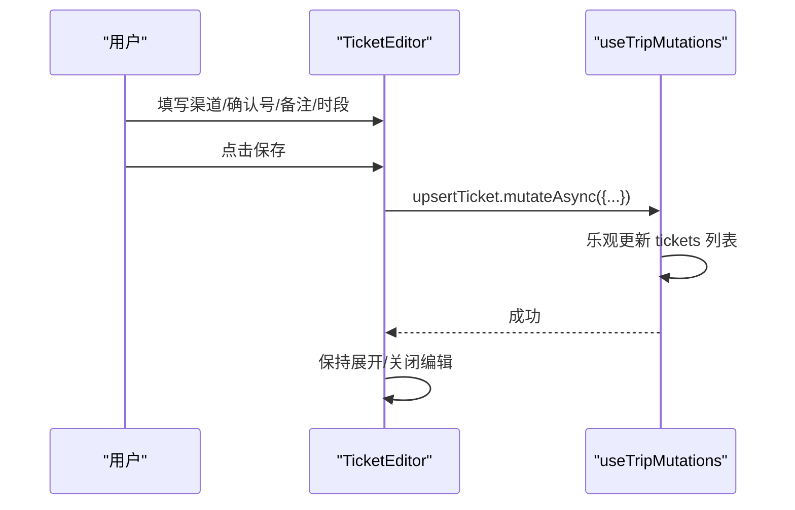
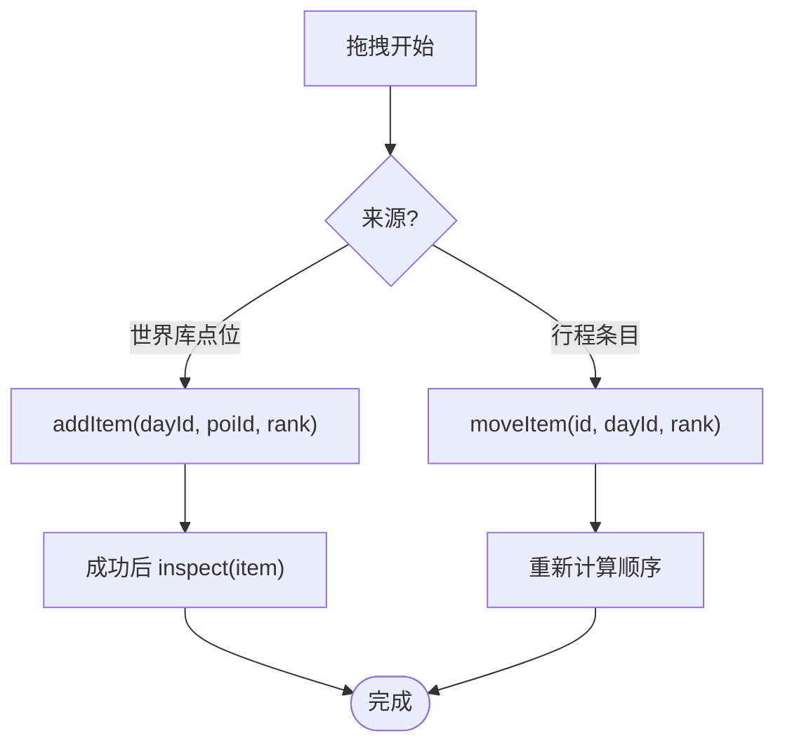
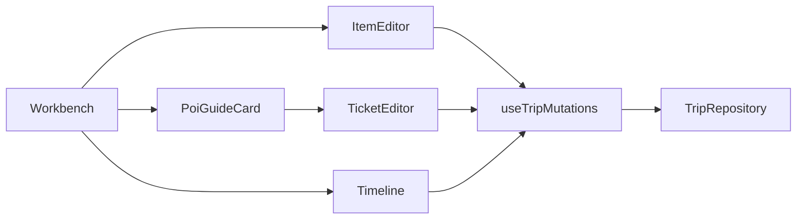

# 项目编辑器

<cite>
**本文引用的文件**
- [ItemEditor.tsx](file://src/features/trip/ItemEditor.tsx)
- [TicketEditor.tsx](file://src/features/trip/TicketEditor.tsx)
- [Workbench.tsx](file://src/features/trip/Workbench.tsx)
- [Timeline.tsx](file://src/features/trip/Timeline.tsx)
- [PoiGuideCard.tsx](file://src/features/world/PoiGuideCard.tsx)
- [queries.ts](file://src/features/trip/queries.ts)
- [types.ts](file://src/data/types.ts)
- [local-trip.ts](file://src/data/adapters/local-trip.ts)
- [sanity-check.ts](file://src/domain/trip/sanity-check.ts)
- [uploadAttachment.ts](file://src/features/trip/uploadAttachment.ts)
- [toast.tsx](file://src/ui/toast.tsx)
</cite>

## 目录
1. [简介](#简介)
2. [项目结构](#项目结构)
3. [核心组件](#核心组件)
4. [架构总览](#架构总览)
5. [详细组件分析](#详细组件分析)
6. [依赖关系分析](#依赖关系分析)
7. [性能与体验优化](#性能与体验优化)
8. [故障排查指南](#故障排查指南)
9. [结论](#结论)
10. [附录：自定义编辑器与表单最佳实践](#附录：自定义编辑器与表单最佳实践)

## 简介
本文件为“行程项目编辑器”的完整技术文档，覆盖基本信息编辑、备注填写、票务管理、表单验证机制、数据绑定（含双向绑定、变更追踪、撤销重做思路）、以及用户体验与错误提示设计。读者可据此快速理解并扩展编辑器能力，包括创建自定义编辑器、处理复杂表单、集成第三方组件等。

## 项目结构
编辑器由“工作台（三栏）—时间线—详情面板”构成：
- 左栏：世界库导航与景点导览卡
- 中栏：时间线（按天组织条目，支持拖拽排序、跨天移动）
- 右栏：选中条目的编辑面板（基本信息、备注、状态、图片附件），或景点导览卡（含票务编辑）

图表来源
- [Workbench.tsx:49-414](file://src/features/trip/Workbench.tsx#L49-L414)
- [Timeline.tsx:496-702](file://src/features/trip/Timeline.tsx#L496-L702)
- [ItemEditor.tsx:38-312](file://src/features/trip/ItemEditor.tsx#L38-L312)
- [PoiGuideCard.tsx:261-309](file://src/features/world/PoiGuideCard.tsx#L261-L309)
- [TicketEditor.tsx:15-129](file://src/features/trip/TicketEditor.tsx#L15-L129)
- [queries.ts:45-236](file://src/features/trip/queries.ts#L45-L236)
- [local-trip.ts:67-349](file://src/data/adapters/local-trip.ts#L67-L349)

章节来源
- [Workbench.tsx:49-414](file://src/features/trip/Workbench.tsx#L49-L414)
- [Timeline.tsx:496-702](file://src/features/trip/Timeline.tsx#L496-L702)

## 核心组件
- ItemEditor：条目编辑面板，支持 POI/交通/住宿/备注四类条目，提供标题、时段、城市、状态、备注、地址、图片附件等字段编辑，并通过 mutation 进行乐观更新。
- TicketEditor：景点导览卡内的票务编辑，支持已订票标记、渠道、确认号、备注、入场时段等，保存走 upsertTicket。
- Workbench：三栏布局、拖拽排程、选择器切换详情视图、计算体检问题。
- Timeline：时间线主编辑区，按天展示条目，支持拖拽排序、跨天移动、添加自定义条目（交通/住宿/备注）。
- PoiGuideCard：景点导览信息展示，内嵌 TicketEditor 用于票务管理。
- queries：统一封装 React Query mutations，实现乐观更新与回滚。
- types：定义 TripItem、Ticket、TripBundle 等核心数据结构。
- local-trip：本地存储适配器，保证离线可用，接口与云端一致。
- sanity-check：行程合理性体检（闭馆、超载、折返跑、预约死线）。
- uploadAttachment：图片上传/删除（仅云端）。
- toast：全局轻提示组件。

章节来源
- [ItemEditor.tsx:38-312](file://src/features/trip/ItemEditor.tsx#L38-L312)
- [TicketEditor.tsx:15-129](file://src/features/trip/TicketEditor.tsx#L15-L129)
- [Workbench.tsx:49-414](file://src/features/trip/Workbench.tsx#L49-L414)
- [Timeline.tsx:496-702](file://src/features/trip/Timeline.tsx#L496-L702)
- [PoiGuideCard.tsx:261-309](file://src/features/world/PoiGuideCard.tsx#L261-L309)
- [queries.ts:45-236](file://src/features/trip/queries.ts#L45-L236)
- [types.ts:159-239](file://src/data/types.ts#L159-L239)
- [local-trip.ts:67-349](file://src/data/adapters/local-trip.ts#L67-L349)
- [sanity-check.ts:84-177](file://src/domain/trip/sanity-check.ts#L84-L177)
- [uploadAttachment.ts:21-54](file://src/features/trip/uploadAttachment.ts#L21-L54)
- [toast.tsx:42-82](file://src/ui/toast.tsx#L42-L82)

## 架构总览
编辑器采用“视图层 + 查询/变更层 + 数据适配层”的分层架构：
- 视图层：React 组件负责交互与渲染（ItemEditor、TicketEditor、Timeline、Workbench、PoiGuideCard）
- 查询/变更层：使用 @tanstack/react-query 封装 useTripMutations，集中处理乐观更新、错误回滚、缓存失效
- 数据适配层：TripRepository 抽象，当前实现包含本地 localStorage 适配器与云端 Supabase 适配器（通过工厂注入）

图表来源
- [ItemEditor.tsx:52-54](file://src/features/trip/ItemEditor.tsx#L52-L54)
- [TicketEditor.tsx:35-68](file://src/features/trip/TicketEditor.tsx#L35-L68)
- [queries.ts:93-103](file://src/features/trip/queries.ts#L93-L103)
- [queries.ts:188-216](file://src/features/trip/queries.ts#L188-L216)
- [local-trip.ts:233-240](file://src/data/adapters/local-trip.ts#L233-L240)
- [local-trip.ts:305-325](file://src/data/adapters/local-trip.ts#L305-L325)

## 详细组件分析

### ItemEditor（条目编辑面板）
- 支持的条目类型：poi、transport、note、accommodation
- 字段映射：
  - POI：开始/结束时间、共享备注
  - Transport：标题、方式、出发/到达城市、起止时间、备注、一键设置当天城市
  - Accommodation：名称、所在城市、入住/退房时间、地址、预订信息
  - Note：可选标题、内容
  - 通用：状态（wishlist/candidate/confirmed/visited/dropped）
- 数据绑定：
  - 使用受控与非受控混合模式（如 AutoTextarea 使用 defaultValue + onBlur 触发 patch）
  - 所有变更通过 mut.updateItem.mutate 提交，走乐观更新
- 图片附件：
  - 仅云端可用，上传/删除后更新 images 数组
  - 上传前校验类型与大小，失败时显示错误信息
- 业务规则：
  - transport 的 fromCityId/toCityId 与世界库城市关联
  - accommodation 的地址支持单独复制
  - 当 toCityId 与 day.cityId 不一致时，提供快捷按钮将当天城市设置为到达地

图表来源
- [ItemEditor.tsx:66-312](file://src/features/trip/ItemEditor.tsx#L66-L312)
- [queries.ts:93-103](file://src/features/trip/queries.ts#L93-L103)

章节来源
- [ItemEditor.tsx:38-312](file://src/features/trip/ItemEditor.tsx#L38-L312)
- [uploadAttachment.ts:21-54](file://src/features/trip/uploadAttachment.ts#L21-L54)

### TicketEditor（票务编辑）
- 功能：记录购票渠道、确认号、备注、入场时段、是否已订票
- 数据绑定：
  - 本地 state 控制输入框，保存时调用 mut.upsertTicket.mutateAsync
  - 成功后保持展开态，便于继续编辑或删除
- 业务规则：
  - 若 poiName 存在则作为 title 默认值
  - 空字符串字段在保存时会被清理为空
- 错误处理：
  - 保存/删除过程中禁用按钮，避免重复提交
  - 异常捕获后恢复 busy 状态

图表来源
- [TicketEditor.tsx:35-68](file://src/features/trip/TicketEditor.tsx#L35-L68)
- [queries.ts:188-216](file://src/features/trip/queries.ts#L188-L216)

章节来源
- [TicketEditor.tsx:15-129](file://src/features/trip/TicketEditor.tsx#L15-L129)
- [PoiGuideCard.tsx:261-309](file://src/features/world/PoiGuideCard.tsx#L261-L309)

### Workbench（三栏工作台）
- 职责：
  - 管理左右栏宽度、拖拽源（世界库点位/行程条目/天）
  - 计算并展示行程体检问题（闭馆、超载、折返跑、预约死线）
  - 根据 inspector 类型切换右侧详情（景点导览/条目编辑/行程速览）
- 拖拽逻辑：
  - 从世界库拖入：计算 rank 并 addItem
  - 条目间排序/跨天移动：计算 rankBetween/rankForInsert 并 moveItem
- 体检问题：
  - 基于 sanityCheck 对 confirmed 条目进行校验，结果在时间线顶部展示

图表来源
- [Workbench.tsx:158-221](file://src/features/trip/Workbench.tsx#L158-L221)
- [queries.ts:88-119](file://src/features/trip/queries.ts#L88-L119)

章节来源
- [Workbench.tsx:49-414](file://src/features/trip/Workbench.tsx#L49-L414)
- [sanity-check.ts:84-177](file://src/domain/trip/sanity-check.ts#L84-L177)

### Timeline（时间线）
- 职责：
  - 按天展示条目，支持拖拽排序与跨天移动
  - 显示条目状态、图标、票数、票务标记、地址复制、图片缩略图
  - 提供添加自定义条目（交通/住宿/备注）入口
- 计划时长估算：
  - 优先使用 slotStart/slotEnd，否则回退到 POI 建议时长
- 体检问题：
  - 在顶部展示 error/warn 数量，点击开关显示/隐藏

章节来源
- [Timeline.tsx:79-287](file://src/features/trip/Timeline.tsx#L79-L287)
- [Timeline.tsx:323-432](file://src/features/trip/Timeline.tsx#L323-L432)
- [Timeline.tsx:496-702](file://src/features/trip/Timeline.tsx#L496-L702)

### PoiGuideCard（景点导览卡）
- 职责：
  - 展示景点基本信息、推荐路线、亮点、设施、贴士
  - 内嵌 TicketEditor 用于票务管理
  - 若景点在行程中，自动传入 itemId 以联动票务编辑

章节来源
- [PoiGuideCard.tsx:40-258](file://src/features/world/PoiGuideCard.tsx#L40-L258)
- [PoiGuideCard.tsx:261-309](file://src/features/world/PoiGuideCard.tsx#L261-L309)

## 依赖关系分析
- 组件耦合：
  - Workbench 组合 Timeline、ItemEditor、PoiGuideCard，并通过 useWorkbench 管理选中状态
  - Timeline 与 Workbench 共用拖拽上下文，确保跨栏拖拽一致性
  - ItemEditor 与 TicketEditor 均依赖 useTripMutations 进行写操作
- 数据流：
  - 读：useTripBundle 获取 TripBundle（trip/days/items/tickets/expenses/votes/members）
  - 写：useTripMutations 封装所有变更，统一乐观更新与回滚
- 外部依赖：
  - @dnd-kit 用于拖拽
  - @tanstack/react-query 用于缓存与变更
  - Supabase Storage 用于图片附件（仅云端）

图表来源
- [Workbench.tsx:239-327](file://src/features/trip/Workbench.tsx#L239-L327)
- [queries.ts:45-236](file://src/features/trip/queries.ts#L45-L236)
- [local-trip.ts:67-349](file://src/data/adapters/local-trip.ts#L67-L349)

章节来源
- [queries.ts:45-236](file://src/features/trip/queries.ts#L45-L236)
- [types.ts:159-239](file://src/data/types.ts#L159-L239)

## 性能与体验优化
- 乐观更新：
  - 所有写操作先更新本地缓存，再发起网络请求，提升响应速度
  - 失败时自动回滚，保证 UI 与数据一致性
- 拖拽体验：
  - 使用 closestCorners 碰撞检测，减少误判
  - 计算 fractional rank，避免频繁重排
- 懒加载：
  - 地图模块懒加载，仅在切换到地图视图时下载
- 图片上传：
  - 限制类型与大小，避免无效请求
  - 仅云端可用，本地档明确提示
- 体检提示：
  - 仅对 confirmed 条目检查，减少误报
  - 分级提示（error/warn/info），避免过度打扰

[本节为通用指导，不直接分析具体文件]

## 故障排查指南
- 常见问题定位：
  - 图片上传失败：检查是否已连接云端、文件大小是否超过 5MB、文件类型是否为图片
  - 票务保存失败：检查必填字段（如 channel/bookingRef/note）是否为空字符串被清理
  - 拖拽无响应：检查 DndContext 是否正确包裹、drag data 是否携带 kind/itemId/dayId
  - 体检问题过多：检查条目状态是否为 confirmed、POI 是否有关闭日/预约要求
- 错误反馈：
  - 使用全局 Toast 提示操作结果（成功/错误/警告/信息）
  - 在 ItemEditor 的图片区域显示上传/删除失败的错误信息

章节来源
- [uploadAttachment.ts:21-54](file://src/features/trip/uploadAttachment.ts#L21-L54)
- [ItemEditor.tsx:379-449](file://src/features/trip/ItemEditor.tsx#L379-L449)
- [toast.tsx:42-82](file://src/ui/toast.tsx#L42-L82)

## 结论
项目编辑器通过分层架构与乐观更新机制，实现了高效、流畅的行程编辑体验。ItemEditor 与 TicketEditor 分别覆盖条目与票务的核心编辑场景，配合 Workbench 与 Timeline 的拖拽排程，形成完整的编辑闭环。sanity-check 提供第二道防线，帮助用户规避常见规划陷阱。未来可扩展更多自定义编辑器与第三方组件集成。

[本节为总结性内容，不直接分析具体文件]

## 附录：自定义编辑器与表单最佳实践

### 创建自定义编辑器
- 步骤：
  1. 定义新的条目类型（在 types.ts 中扩展 ItemKind）
  2. 在 ItemEditor 中添加对应分支，渲染字段并调用 patch
  3. 在 Timeline 中为新类型添加图标、状态、子信息展示
  4. 如需独立编辑面板，复用 AutoTextarea、CopyButton 等基础组件
- 示例路径参考：
  - 新增字段与 patch：[ItemEditor.tsx:66-312](file://src/features/trip/ItemEditor.tsx#L66-L312)
  - 时间线展示：[Timeline.tsx:114-147](file://src/features/trip/Timeline.tsx#L114-L147)

### 处理复杂表单
- 使用受控与非受控混合：
  - 简单字段使用受控（如 select/input）
  - 长文本使用非受控（defaultValue + onBlur 触发 patch）
- 字段校验：
  - 前端即时校验（如图片类型/大小）
  - 后端/适配器层约束（如 local-trip 中的默认值填充）
- 示例路径参考：
  - 图片上传校验：[uploadAttachment.ts:21-37](file://src/features/trip/uploadAttachment.ts#L21-L37)
  - 默认值填充：[local-trip.ts:198-231](file://src/data/adapters/local-trip.ts#L198-L231)

### 集成第三方组件
- 拖拽：@dnd-kit（DndContext、SortableContext、useDroppable）
- 缓存与变更：@tanstack/react-query（useQuery、useMutation）
- 图片预览：ClickableImage（Lightbox）
- 示例路径参考：
  - 拖拽集成：[Workbench.tsx:7-16](file://src/features/trip/Workbench.tsx#L7-L16)
  - 图片预览：[Timeline.tsx:213-226](file://src/features/trip/Timeline.tsx#L213-L226)

### 表单验证机制
- 必填字段检查：
  - 前端：placeholder 提示、disabled 状态控制
  - 后端：适配器层默认值填充（如 customTitle）
- 格式验证：
  - 时间字段：HTML time input 原生校验
  - 图片：类型与大小限制
- 业务规则校验：
  - 行程体检：闭馆、超载、折返跑、预约死线
  - 示例路径参考：
    - 体检逻辑：[sanity-check.ts:84-177](file://src/domain/trip/sanity-check.ts#L84-L177)
    - 图片校验：[uploadAttachment.ts:21-37](file://src/features/trip/uploadAttachment.ts#L21-L37)

### 数据绑定与变更追踪
- 双向数据绑定：
  - 受控组件：value + onChange -> patch -> mutate
  - 非受控组件：defaultValue + onBlur -> patch -> mutate
- 变更追踪：
  - React Query 缓存键（bundleKey）跟踪 TripBundle
  - 乐观更新后立即反映到 UI，无需等待网络
- 撤销重做：
  - 当前未实现全局撤销重做，但可通过记录历史快照实现
  - 建议：在 useTripMutations 中维护 history stack，onError 时回滚到上一快照

[本节为概念性指导，不直接分析具体文件]