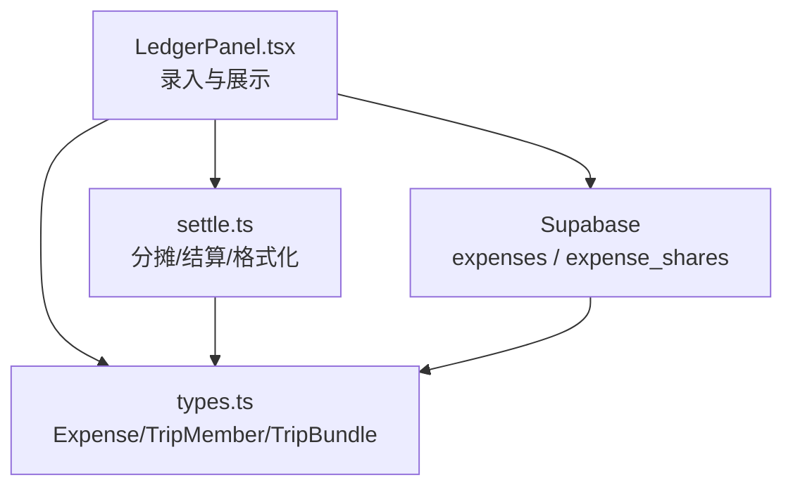
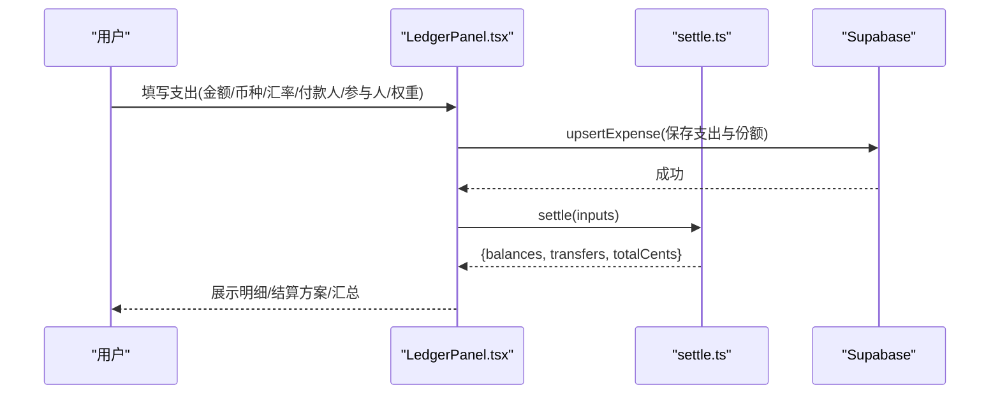
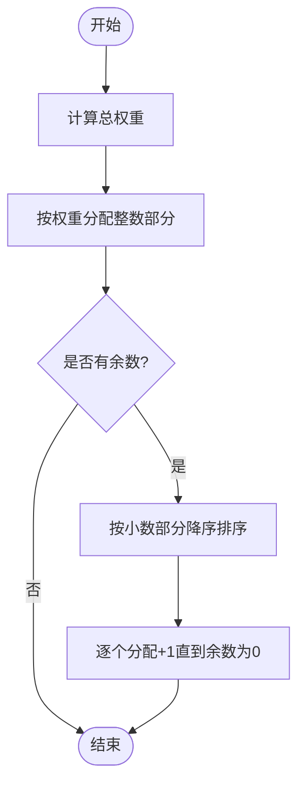
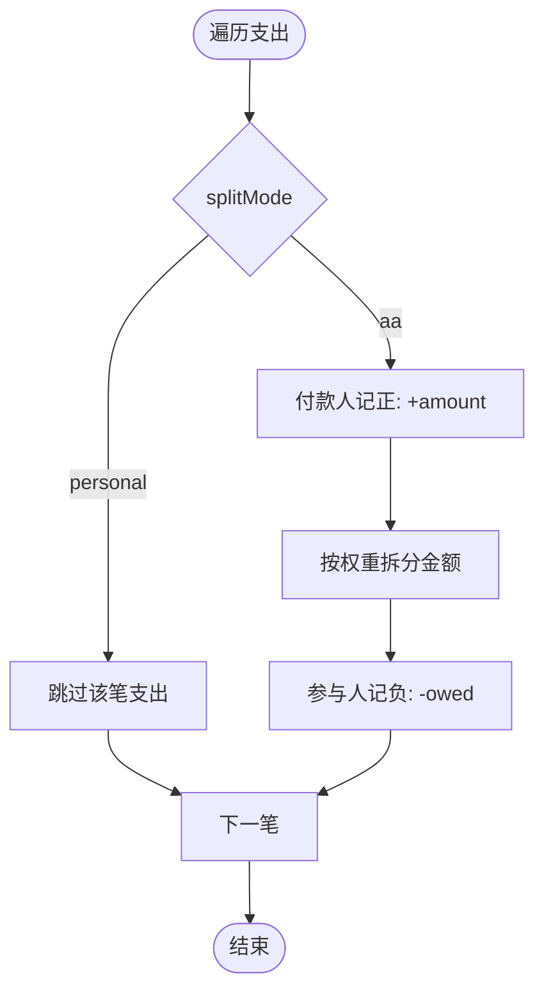
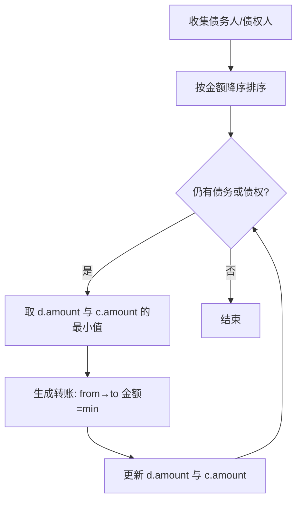
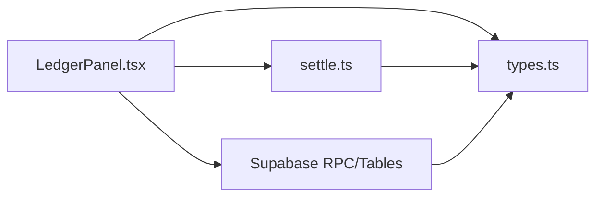

# 费用管理模块

<cite>
**本文引用的文件**
- [src/domain/expense/settle.ts](file://src/domain/expense/settle.ts)
- [src/domain/expense/settle.test.ts](file://src/domain/expense/settle.test.ts)
- [src/features/expense/LedgerPanel.tsx](file://src/features/expense/LedgerPanel.tsx)
- [src/data/types.ts](file://src/data/types.ts)
- [supabase/migrations/0001_init.sql](file://supabase/migrations/0001_init.sql)
- [supabase/migrations/0004_expense_split_mode.sql](file://supabase/migrations/0004_expense_split_mode.sql)
- [docs/技术方案.md](file://docs/技术方案.md)
</cite>

## 目录
1. [简介](#简介)
2. [项目结构](#项目结构)
3. [核心组件](#核心组件)
4. [架构总览](#架构总览)
5. [详细组件分析](#详细组件分析)
6. [依赖关系分析](#依赖关系分析)
7. [性能与精度考量](#性能与精度考量)
8. [故障排查指南](#故障排查指南)
9. [结论](#结论)
10. [附录：使用示例与最佳实践](#附录使用示例与最佳实践)

## 简介
本模块为旅行行程中的“费用记录与管理”提供完整能力，覆盖支出录入、分类管理、成员分摊与结算。核心目标：
- 支持多种分摊模式：均摊、按人数（权重）、按比例（通过权重表达）。
- 多币种支持与汇率转换：以行程基准币种统一记账，原币种金额与汇率一并保存。
- 智能结算：计算每人净额并生成最少转账方案，保证账目归零。
- 高精度：全程使用整数分运算，避免浮点误差累积。
- 可观测与可导出：展示明细、结算结果与报表信息，便于核对与导出。

## 项目结构
费用相关代码主要分布在以下位置：
- 领域层算法：src/domain/expense/settle.ts（分摊、余额、结算、格式化）
- 界面交互：src/features/expense/LedgerPanel.tsx（录入、选择参与人、实时结算）
- 数据模型：src/data/types.ts（Expense、TripMember、TripBundle 等）
- 数据库迁移：supabase/migrations/0001_init.sql（expenses/expenses_shares 表结构），supabase/migrations/0004_expense_split_mode.sql（split_mode 字段）
- 设计约束：docs/技术方案.md（金额、货币、时间规范）

图表来源
- [src/features/expense/LedgerPanel.tsx:1-120](file://src/features/expense/LedgerPanel.tsx#L1-L120)
- [src/domain/expense/settle.ts:10-32](file://src/domain/expense/settle.ts#L10-L32)
- [src/data/types.ts:212-239](file://src/data/types.ts#L212-L239)
- [supabase/migrations/0001_init.sql:162-190](file://supabase/migrations/0001_init.sql#L162-L190)

章节来源
- [src/features/expense/LedgerPanel.tsx:1-120](file://src/features/expense/LedgerPanel.tsx#L1-L120)
- [src/domain/expense/settle.ts:1-43](file://src/domain/expense/settle.ts#L1-L43)
- [src/data/types.ts:212-239](file://src/data/types.ts#L212-L239)
- [supabase/migrations/0001_init.sql:162-190](file://supabase/migrations/0001_init.sql#L162-L190)

## 核心组件
- 分摊与结算引擎（settle.ts）
  - splitAmount：按权重拆分金额，最大余数法保证总和守恒。
  - computeBalances：遍历支出，个人自付跳过，AA 支出记付款人贷方与参与人借方。
  - minimalTransfers：贪心策略生成最少转账链，上限 n-1。
  - settle：聚合余额、转账与总支出。
  - formatMoney：按币种格式化显示。
- 账本面板（LedgerPanel.tsx）
  - 录入表单：标题、类别、金额、币种、汇率、付款人、分摊模式、参与人与权重。
  - 实时结算：将每笔支出按汇率换算到基准币种后交给 settle() 计算。
  - 展示：明细列表、结算方案、应收应付汇总。
- 数据模型（types.ts）
  - Expense：包含 amountCents、currency、fxRate、splitMode、shares 等。
  - TripMember：成员主体，支持幽灵成员（无账号但可被记账/结算）。
  - TripBundle：一次性返回 trip/members/days/items/votes/tickets/expenses。

章节来源
- [src/domain/expense/settle.ts:10-140](file://src/domain/expense/settle.ts#L10-L140)
- [src/features/expense/LedgerPanel.tsx:33-144](file://src/features/expense/LedgerPanel.tsx#L33-L144)
- [src/data/types.ts:129-137](file://src/data/types.ts#L129-L137)
- [src/data/types.ts:212-239](file://src/data/types.ts#L212-L239)

## 架构总览
费用模块采用“前端界面 + 领域算法 + 持久化存储”的分层架构：
- 界面层负责采集用户输入、校验与展示。
- 领域层专注分摊与结算的确定性算法，不依赖外部服务。
- 数据层通过 Supabase 存储 expenses 与 expense_shares，并通过 get_trip_bundle 一次性拉取全量数据。

图表来源
- [src/features/expense/LedgerPanel.tsx:71-81](file://src/features/expense/LedgerPanel.tsx#L71-L81)
- [src/domain/expense/settle.ts:123-130](file://src/domain/expense/settle.ts#L123-L130)
- [supabase/migrations/0001_init.sql:393-427](file://supabase/migrations/0001_init.sql#L393-L427)

## 详细组件分析

### 分摊算法：splitAmount（最大余数法）
- 输入：整数分金额、参与人及权重数组。
- 过程：
  - 计算总权重，按权重分配基础整数部分。
  - 计算余数，按小数部分从大到小逐个加 1，直至余数为 0。
- 特性：
  - 严格总和守恒，避免累计漂移。
  - 支持任意权重（如带小孩算 1.5 份）。
  - 大量小额分摊仍保持精确。

图表来源
- [src/domain/expense/settle.ts:38-70](file://src/domain/expense/settle.ts#L38-L70)

章节来源
- [src/domain/expense/settle.ts:38-70](file://src/domain/expense/settle.ts#L38-L70)
- [src/domain/expense/settle.test.ts:6-30](file://src/domain/expense/settle.test.ts#L6-L30)

### 余额计算：computeBalances
- 规则：
  - 个人自付（splitMode='personal'）整笔跳过，不参与共同分摊。
  - AA 支出：付款人记正（别人欠他），参与人按分摊额记负（他欠别人）。
- 输出：每人净额（正=应收，负=应付），所有净额之和为 0。

图表来源
- [src/domain/expense/settle.ts:72-86](file://src/domain/expense/settle.ts#L72-L86)

章节来源
- [src/domain/expense/settle.ts:72-86](file://src/domain/expense/settle.ts#L72-L86)
- [src/domain/expense/settle.test.ts:32-59](file://src/domain/expense/settle.test.ts#L32-L59)

### 结算方案：minimalTransfers（贪心最小转账）
- 思路：每次让“欠最多的人”直接还给“被欠最多的人”，直至全部结清。
- 性质：
  - 转账次数不超过 n-1。
  - 对 2-10 人的旅行场景，贪心结果通常与最优解一致。
  - 排序稳定，便于单测与一致性判断。

图表来源
- [src/domain/expense/settle.ts:93-121](file://src/domain/expense/settle.ts#L93-L121)

章节来源
- [src/domain/expense/settle.ts:93-121](file://src/domain/expense/settle.ts#L93-L121)
- [src/domain/expense/settle.test.ts:62-79](file://src/domain/expense/settle.test.ts#L62-L79)

### 端到端结算：settle
- 输入：ExpenseInput[]（已换算到基准币种的整数分）。
- 输出：SettlementResult{ balances, transfers, totalCents }。
- 用途：界面侧将 expenses 映射为 inputs 后调用 settle，得到结算方案。

章节来源
- [src/domain/expense/settle.ts:123-130](file://src/domain/expense/settle.ts#L123-L130)
- [src/features/expense/LedgerPanel.tsx:71-81](file://src/features/expense/LedgerPanel.tsx#L71-L81)

### 多币种与汇率转换机制
- 存储：
  - 每笔支出保存原币种 currency 与汇率 fxRate（换算到 trips.base_currency）。
  - 金额以整数分 amount_cents 存储，避免浮点误差。
- 展示：
  - 界面根据 baseCurrency 与 fxRate 将原币种金额换算为基准币种进行结算与展示。
  - formatMoney 支持 CNY/EUR/CHF/USD 等符号与两位小数格式化。
- 汇率来源：
  - 手填汇率，内置常用参考汇率常量；出发前手动更新一次即可。

章节来源
- [supabase/migrations/0001_init.sql:162-181](file://supabase/migrations/0001_init.sql#L162-L181)
- [src/features/expense/LedgerPanel.tsx:28-30](file://src/features/expense/LedgerPanel.tsx#L28-L30)
- [src/features/expense/LedgerPanel.tsx:284-305](file://src/features/expense/LedgerPanel.tsx#L284-L305)
- [src/domain/expense/settle.ts:132-140](file://src/domain/expense/settle.ts#L132-L140)
- [docs/技术方案.md:319-323](file://docs/技术方案.md#L319-L323)

### 分摊模式与成员分摊
- 分摊模式：
  - 'aa'：纳入共同分摊，按参与人及权重计算。
  - 'personal'：个人自付，结算时整笔跳过。
- 参与人选择：
  - 默认全员均摊；可勾选特定成员；可开启“按权重分摊”自定义整数权重。
- 幽灵成员：
  - 支持无账号成员（userId=null）参与记账与结算，确保历史数据完整性。

章节来源
- [supabase/migrations/0004_expense_split_mode.sql:1-9](file://supabase/migrations/0004_expense_split_mode.sql#L1-L9)
- [src/features/expense/LedgerPanel.tsx:98-107](file://src/features/expense/LedgerPanel.tsx#L98-L107)
- [src/data/types.ts:129-137](file://src/data/types.ts#L129-L137)
- [src/domain/expense/settle.test.ts:43-48](file://src/domain/expense/settle.test.ts#L43-L48)

### 报表与导出
- 报表内容：
  - 总支出（基准币种）、明细列表（含类别、分摊模式、参与人、汇率）、结算方案（转账链）、应收应付汇总。
- 导出建议：
  - 可将结算结果（transfers）与明细（expenses）导出为 CSV/Markdown，便于归档与分享。
  - 注意：敏感字段（如确认号）不应进入分享快照。

章节来源
- [src/features/expense/LedgerPanel.tsx:195-465](file://src/features/expense/LedgerPanel.tsx#L195-L465)
- [supabase/migrations/0001_init.sql:476-518](file://supabase/migrations/0001_init.sql#L476-L518)

## 依赖关系分析
- LedgerPanel.tsx 依赖：
  - types.ts：Expense、TripMember、TripBundle 等类型定义。
  - settle.ts：分摊与结算算法、金额格式化。
  - Supabase：upsert/remove 操作与 get_trip_bundle 批量读取。
- settle.ts 依赖：
  - 纯函数，无外部依赖，保证算法可测试性与稳定性。
- 数据库层：
  - expenses 表：记录支出、币种、汇率、付款人、日期等。
  - expense_shares 表：记录每笔支出的参与人与权重。
  - split_mode 列：区分 AA 与个人自付。

图表来源
- [src/features/expense/LedgerPanel.tsx:10-15](file://src/features/expense/LedgerPanel.tsx#L10-L15)
- [src/domain/expense/settle.ts:10-32](file://src/domain/expense/settle.ts#L10-L32)
- [src/data/types.ts:212-239](file://src/data/types.ts#L212-L239)
- [supabase/migrations/0001_init.sql:393-427](file://supabase/migrations/0001_init.sql#L393-L427)

章节来源
- [src/features/expense/LedgerPanel.tsx:10-15](file://src/features/expense/LedgerPanel.tsx#L10-L15)
- [src/domain/expense/settle.ts:10-32](file://src/domain/expense/settle.ts#L10-L32)
- [src/data/types.ts:212-239](file://src/data/types.ts#L212-L239)
- [supabase/migrations/0001_init.sql:393-427](file://supabase/migrations/0001_init.sql#L393-L427)

## 性能与精度考量
- 精度保障：
  - 金额一律用整数分运算，避免浮点误差累积。
  - 分摊使用最大余数法，确保总和守恒。
- 性能特征：
  - 分摊与结算为 O(n) 复杂度，n 为参与人数或支出笔数，适合旅行场景规模。
  - 贪心结算转账次数上限 n-1，满足“少转几次账”的实际诉求。
- 汇率处理：
  - 手填汇率，减少外部依赖与网络开销；界面提供常用参考汇率常量。
- 内存与渲染：
  - 界面使用 useMemo 缓存结算结果，避免重复计算。

章节来源
- [src/domain/expense/settle.ts:1-8](file://src/domain/expense/settle.ts#L1-L8)
- [src/domain/expense/settle.ts:38-70](file://src/domain/expense/settle.ts#L38-L70)
- [src/domain/expense/settle.ts:93-121](file://src/domain/expense/settle.ts#L93-L121)
- [src/features/expense/LedgerPanel.tsx:71-81](file://src/features/expense/LedgerPanel.tsx#L71-L81)
- [docs/技术方案.md:319-323](file://docs/技术方案.md#L319-L323)

## 故障排查指南
- 常见问题与定位：
  - 金额显示异常：检查 amountCents 是否为整数分，formatMoney 是否正确传入基准币种。
  - 分摊不均：确认 shares 权重设置与 splitMode 是否正确；个人自付不会进入共同分摊。
  - 结算未归零：检查是否有个人自付混入 AA 结算；确认幽灵成员是否参与分摊。
  - 汇率错误：核对 fxRate 与 baseCurrency 的对应关系；必要时更新参考汇率。
- 调试建议：
  - 查看 settle.test.ts 中的用例，验证 splitAmount、computeBalances、minimalTransfers 的行为。
  - 在界面层打印 settlement.balances 与 transfers，核对逻辑是否符合预期。
- 数据一致性：
  - 确保 expenses 与 expense_shares 的数据同步；删除支出时应级联删除份额。
  - 使用 get_trip_bundle 一次性获取数据，避免多次往返导致不一致。

章节来源
- [src/domain/expense/settle.test.ts:6-107](file://src/domain/expense/settle.test.ts#L6-L107)
- [src/features/expense/LedgerPanel.tsx:83-144](file://src/features/expense/LedgerPanel.tsx#L83-L144)
- [supabase/migrations/0001_init.sql:183-190](file://supabase/migrations/0001_init.sql#L183-L190)
- [supabase/migrations/0001_init.sql:393-427](file://supabase/migrations/0001_init.sql#L393-L427)

## 结论
费用管理模块通过清晰的领域算法与稳健的前端交互，实现了旅行场景下的精准分摊与结算。其关键优势包括：
- 高精度：整数分运算与最大余数法分摊，杜绝浮点误差。
- 灵活分摊：支持均摊、按人数、按比例（权重）等多种模式。
- 多币种：以基准币种统一记账，原币种与汇率并存，便于追溯。
- 高效结算：贪心策略生成最少转账方案，满足实际诉求。
- 可扩展：幽灵成员支持、批量数据读取、权限控制完善。

## 附录：使用示例与最佳实践
- 记录一笔费用：
  - 选择类别、填写标题与金额、选择币种与汇率、指定付款人与参与人（可加权），提交后实时结算。
  - 参考路径：[LedgerPanel.tsx:83-144](file://src/features/expense/LedgerPanel.tsx#L83-L144)
- 计算分摊结果：
  - 将 expenses 映射为 ExpenseInput[]，调用 settle() 获取 balances、transfers、totalCents。
  - 参考路径：[LedgerPanel.tsx:71-81](file://src/features/expense/LedgerPanel.tsx#L71-L81)，[settle.ts:123-130](file://src/domain/expense/settle.ts#L123-L130)
- 生成报表：
  - 展示总支出、明细、结算方案与应收应付汇总；可导出为 CSV/Markdown。
  - 参考路径：[LedgerPanel.tsx:195-465](file://src/features/expense/LedgerPanel.tsx#L195-L465)
- 精度与汇率最佳实践：
  - 始终使用整数分存储与计算；汇率手填并定期更新；展示时使用 formatMoney。
  - 参考路径：[settle.ts:132-140](file://src/domain/expense/settle.ts#L132-L140)，[技术方案.md:319-323](file://docs/技术方案.md#L319-L323)