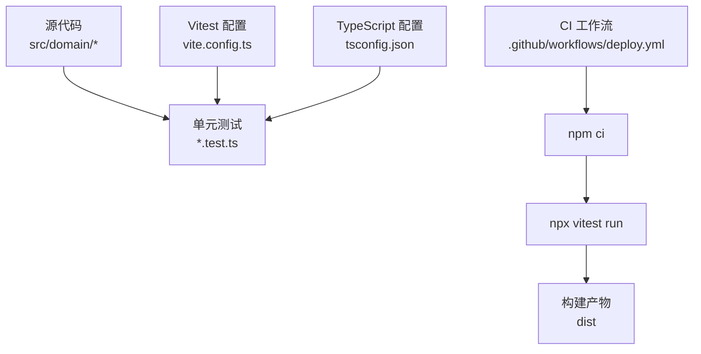
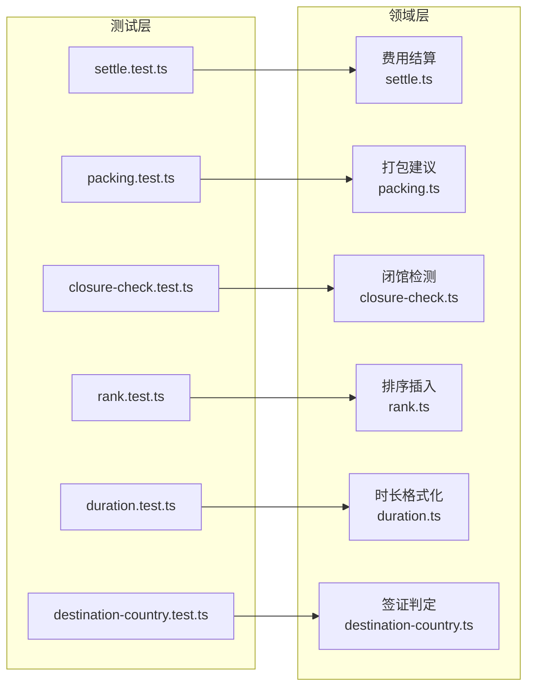
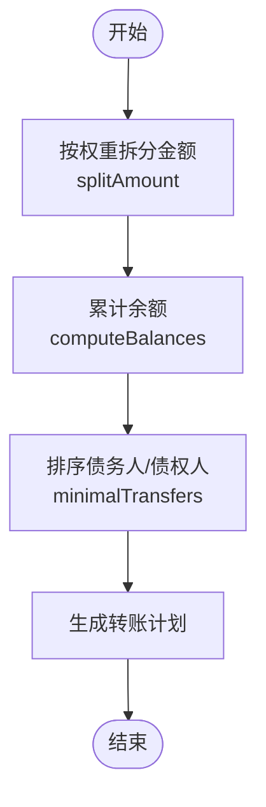
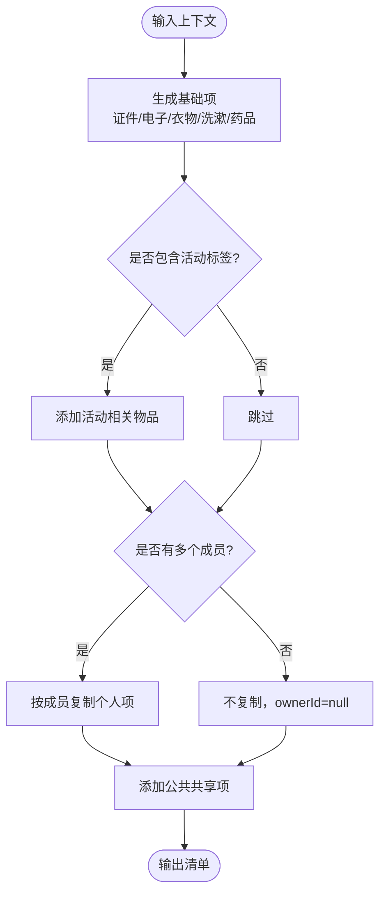
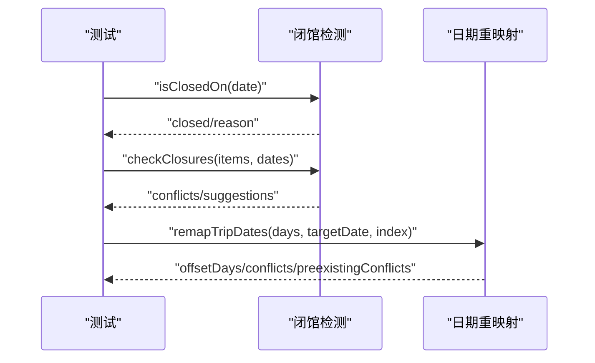
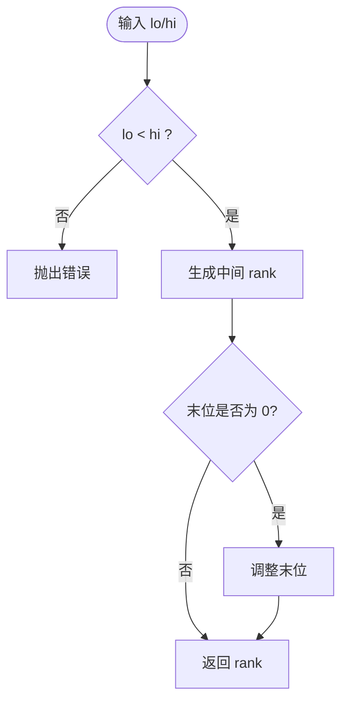
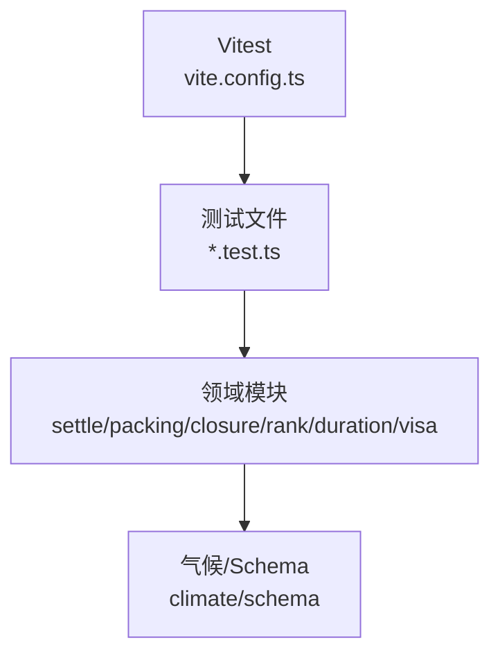

# 测试策略

<cite>
**本文引用的文件**
- [package.json](file://package.json)
- [vite.config.ts](file://vite.config.ts)
- [tsconfig.json](file://tsconfig.json)
- [deploy.yml](file://.github/workflows/deploy.yml)
- [settle.test.ts](file://src/domain/expense/settle.test.ts)
- [settle.ts](file://src/domain/expense/settle.ts)
- [packing.test.ts](file://src/domain/trip/packing.test.ts)
- [packing.ts](file://src/domain/trip/packing.ts)
- [closure-check.test.ts](file://src/domain/trip/closure-check.test.ts)
- [rank.test.ts](file://src/domain/trip/rank.test.ts)
- [duration.test.ts](file://src/domain/world/duration.test.ts)
- [destination-country.test.ts](file://src/domain/visa/destination-country.test.ts)
</cite>

## 目录
1. [简介](#简介)
2. [项目结构](#项目结构)
3. [核心组件](#核心组件)
4. [架构总览](#架构总览)
5. [详细组件分析](#详细组件分析)
6. [依赖分析](#依赖分析)
7. [性能考虑](#性能考虑)
8. [故障排查指南](#故障排查指南)
9. [结论](#结论)
10. [附录](#附录)

## 简介
本测试策略面向“玩无一失”项目的业务与领域逻辑，目标是建立稳定、可维护、可演进的测试体系。当前仓库已采用 Vitest 作为单元测试框架，并在 CI 中集成类型检查、内容校验、单测与构建流程。本文档将基于现有代码与配置，系统化说明：
- 单元测试框架配置与运行方式
- 测试用例编写规范与数据准备方法
- 业务逻辑测试重点（费用结算、行程打包建议、闭馆检测、排序插入等）
- 组件测试策略（当前以纯函数为主，UI 组件测试的扩展建议）
- 集成测试实施方法（Supabase 客户端、外部服务交互）
- 覆盖率要求、CI 配置与报告分析
- 最佳实践与常见问题解决方案

## 项目结构
- 测试框架与配置
  - 使用 Vitest 2.x，通过 Vite 的 test 配置启用，环境为 node，匹配 src/**/*.test.ts。
  - TypeScript 严格模式开启，路径别名 @ 指向 src。
- 测试位置与命名
  - 所有单元测试位于对应源文件同级的 .test.ts 文件中，遵循就近原则，便于维护与定位。
- 持续集成
  - GitHub Actions 在 push main 或手动触发时执行内容校验、类型检查、vitest run 与构建，确保质量门禁。

**图表来源**
- [vite.config.ts:32-35](file://vite.config.ts#L32-L35)
- [tsconfig.json:1-30](file://tsconfig.json#L1-L30)
- [deploy.yml:20-38](file://.github/workflows/deploy.yml#L20-L38)

**章节来源**
- [vite.config.ts:1-36](file://vite.config.ts#L1-L36)
- [tsconfig.json:1-30](file://tsconfig.json#L1-L30)
- [deploy.yml:1-52](file://.github/workflows/deploy.yml#L1-L52)

## 核心组件
- 费用结算模块（expense/settle.ts）
  - 提供金额拆分、余额计算、最少转账次数算法与格式化输出。
  - 测试覆盖分摊守恒、个人自付跳过、幽灵成员参与、贪心结算正确性、货币格式等。
- 行程打包建议（trip/packing.ts）
  - 根据目的地国家、月份气候带、POI 类型/标签生成打包清单。
  - 测试覆盖基础项、货币提示、活动推导、按成员复制、公共项归属、天数下限、气候差异等。
- 闭馆检测与日期重映射（trip/closure-check.ts）
  - 支持固定周休日、指定闭馆日、季节性开放区间判断与建议改期。
  - 测试覆盖闭馆识别、冲突检测、整体平移保持间隔、冲突区分等。
- 排序与插入（trip/rank.ts）
  - 提供 rankBetween、sequentialRanks、rankForInsert 等工具，保证稳定可插值排序。
  - 测试覆盖区间内取值、重复插入稳定性、边界抛错、序列递增等。
- 时长格式化（world/duration.ts）
  - 分钟/小时混合显示、区间折叠、小数保留等。
  - 测试覆盖不足一小时、整小时、非整小时、跨小时区间等。
- 签证国家判定与行程表（visa/destination-country.ts）
  - 依据停留夜数决定送签国，并生成使馆要求的四列表格。
  - 测试覆盖最长停留、并列回退首个入境、空行程处理、表格填充占位符等。

**章节来源**
- [settle.test.ts:1-108](file://src/domain/expense/settle.test.ts#L1-L108)
- [packing.test.ts:1-102](file://src/domain/trip/packing.test.ts#L1-L102)
- [closure-check.test.ts:1-97](file://src/domain/trip/closure-check.test.ts#L1-L97)
- [rank.test.ts:1-76](file://src/domain/trip/rank.test.ts#L1-L76)
- [duration.test.ts:1-24](file://src/domain/world/duration.test.ts#L1-L24)
- [destination-country.test.ts:1-85](file://src/domain/visa/destination-country.test.ts#L1-L85)

## 架构总览
测试架构围绕“领域纯函数 + 单元测试”展开，强调输入输出的确定性、边界条件与数值精度。UI 与状态管理目前未纳入单测范围，但可通过后续引入 React Testing Library 与 Mock 进行扩展。

**图表来源**
- [settle.ts:1-141](file://src/domain/expense/settle.ts#L1-L141)
- [packing.ts:1-164](file://src/domain/trip/packing.ts#L1-L164)
- [closure-check.test.ts:1-97](file://src/domain/trip/closure-check.test.ts#L1-L97)
- [rank.test.ts:1-76](file://src/domain/trip/rank.test.ts#L1-L76)
- [duration.test.ts:1-24](file://src/domain/world/duration.test.ts#L1-L24)
- [destination-country.test.ts:1-85](file://src/domain/visa/destination-country.test.ts#L1-L85)

## 详细组件分析

### 费用结算（expense/settle.ts）
- 设计要点
  - 金额一律以整数分（cents）运算，避免浮点漂移。
  - 分摊使用最大余数法，保证总和守恒。
  - 结算主体是 trip_members.id，支持幽灵成员参与记账与结算。
  - 最少转账次数采用贪心策略，对旅行场景足够高效且结果稳定。
- 测试重点
  - splitAmount：除不尽时的分配、权重分摊、大量小额累计不漂移。
  - computeBalances：付款人记正、参与人记负；个人自付跳过；幽灵成员参与。
  - minimalTransfers：三人一笔账最小转账链、互相抵消无多余转账、上限 n-1。
  - settle 端到端：多笔混合支出后账目归零。
  - formatMoney：币种符号、负数、两位小数。
- 复杂度与性能
  - 分摊 O(n)，余额计算 O(m)，贪心结算 O(p log p + q log q)（p/q 为债务/债权人数量），总体线性到近线性，满足小团队旅行场景。
- 错误处理
  - 权重为 0 或空数组时返回空分摊；个人自付直接跳过；排序稳定以保证结果可复现。

**图表来源**
- [settle.ts:38-130](file://src/domain/expense/settle.ts#L38-L130)

**章节来源**
- [settle.ts:1-141](file://src/domain/expense/settle.ts#L1-L141)
- [settle.test.ts:1-108](file://src/domain/expense/settle.test.ts#L1-L108)

### 行程打包建议（trip/packing.ts）
- 设计要点
  - 基于目的地国家与月份的气候带推导衣物分层。
  - 依据 POI 类型/标签推导活动相关物品（海滩→泳衣、徒步→徒步鞋）。
  - 个人行李按成员复制，公共共享项只生成一份。
  - 天数最少按 1 计，兼容无月份场景。
- 测试重点
  - 基础项始终包含证件/电子/衣物/洗漱/药品。
  - 货币提示、活动推导、成员复制、公共项归属、天数下限、气候差异。
- 复杂度与性能
  - 生成过程为常数级分支与集合操作，时间复杂度接近 O(1) 到 O(k)（k 为标签/类型数量），适合高频调用。
- 错误处理
  - ownerIds 为空时降级为单人模式，个人项归 null；无月份时退回通用文案。

**图表来源**
- [packing.ts:79-163](file://src/domain/trip/packing.ts#L79-L163)

**章节来源**
- [packing.ts:1-164](file://src/domain/trip/packing.ts#L1-L164)
- [packing.test.ts:1-102](file://src/domain/trip/packing.test.ts#L1-L102)

### 闭馆检测与日期重映射（trip/closure-check.ts）
- 设计要点
  - 支持每周固定闭馆日、指定闭馆日、季节性开放区间。
  - 提供冲突检测与同程内改期建议。
  - 整体平移保持天数间隔，并检测新增冲突。
- 测试重点
  - isClosedOn：周休日、指定日期、季节区间、跨年区间。
  - checkClosures：冲突消息与建议日期。
  - remapTripDates：平移偏移量、冲突区分。
  - openDatesAmong：筛掉全部闭馆日。
- 复杂度与性能
  - 闭馆判断为 O(1) 到 O(s)（s 为季节性区间数量），冲突检测与重映射为 O(d)（d 为行程天数）。
- 错误处理
  - 空行程或无开放信息时给出明确提示而非崩溃。

**图表来源**
- [closure-check.test.ts:24-96](file://src/domain/trip/closure-check.test.ts#L24-L96)

**章节来源**
- [closure-check.test.ts:1-97](file://src/domain/trip/closure-check.test.ts#L1-L97)

### 排序与插入（trip/rank.ts）
- 设计要点
  - rankBetween 在给定区间内生成严格中间值，保证可无限插值。
  - sequentialRanks 生成严格递增序列。
  - rankForInsert 在指定位置插入并保持顺序。
- 测试重点
  - 区间内取值、重复插入稳定性、a>=b 抛错、末位不为 0、序列递增、前后中插入。
- 复杂度与性能
  - 生成 rank 为字符串比较与拼接，时间复杂度近似 O(1)；序列生成 O(n)。
- 错误处理
  - 非法区间立即抛出异常，避免静默乱序。

**图表来源**
- [rank.test.ts:4-75](file://src/domain/trip/rank.test.ts#L4-L75)

**章节来源**
- [rank.test.ts:1-76](file://src/domain/trip/rank.test.ts#L1-L76)

### 时长格式化（world/duration.ts）
- 设计要点
  - 不足 1 小时用分钟显示，整小时显示整数小时，非整小时保留一位小数。
  - 区间上下界相同不折叠成 0-0。
- 测试重点
  - 分钟区间、整小时、非整小时、跨小时混排。
- 复杂度与性能
  - 格式化过程为常数时间操作，O(1)。

**章节来源**
- [duration.test.ts:1-24](file://src/domain/world/duration.test.ts#L1-L24)

### 签证国家判定与行程表（visa/destination-country.ts）
- 设计要点
  - 依据停留夜数决定送签国，并列时回退首个入境国。
  - 生成使馆要求的四列表格，缺住宿用占位符。
- 测试重点
  - 最长停留、并列回退、空行程处理、表格填充。
- 复杂度与性能
  - 统计夜数为 O(d)，表格生成为 O(d)，整体线性。

**章节来源**
- [destination-country.test.ts:1-85](file://src/domain/visa/destination-country.test.ts#L1-L85)

## 依赖分析
- 测试框架与工具链
  - Vitest 2.x，Node 环境，匹配 src/**/*.test.ts。
  - TypeScript 严格模式，路径别名 @ 指向 src。
- 外部依赖
  - 领域逻辑基本为纯函数，几乎无外部运行时依赖，利于单测隔离与稳定性。
- 潜在耦合
  - packing.ts 依赖 climate 模块（气候带），测试通过传入不同国家与月份覆盖分支。
  - closure-check 依赖 Openness schema，测试构造具体开放信息。
- 循环依赖
  - 当前领域模块之间解耦良好，未见循环导入迹象。

**图表来源**
- [vite.config.ts:32-35](file://vite.config.ts#L32-L35)
- [tsconfig.json:23-27](file://tsconfig.json#L23-L27)

**章节来源**
- [vite.config.ts:1-36](file://vite.config.ts#L1-L36)
- [tsconfig.json:1-30](file://tsconfig.json#L1-L30)

## 性能考虑
- 数值精度
  - 费用结算统一使用整数分，避免浮点误差累积；分摊使用最大余数法保证总和守恒。
- 算法效率
  - 贪心结算对旅行场景（2-10 人）足够高效；排序插入保证稳定可插值，避免频繁重排。
- 测试性能
  - 单测均为轻量级纯函数验证，启动快、执行稳定；CI 中并行执行由 Vitest 内部调度。

[本节为通用指导，无需特定文件引用]

## 故障排查指南
- 常见失败原因
  - 金额漂移：确认所有计算使用整数分，避免浮点累加。
  - 排序异常：检查 rankBetween 区间合法性，确保 lo < hi。
  - 闭馆误判：核对 weekly closed、closedDates、seasonal 区间与目标日期。
  - 打包建议缺失：确认 POI 类型/标签与气候带参数是否正确传入。
- 调试建议
  - 使用 Vitest 的 watch 模式快速迭代；结合 console.log 或断点定位。
  - 针对复杂分支，拆分为更小的 describe/it 块，逐步缩小问题范围。
- 回归保护
  - 对关键业务（结算、排序、闭馆）增加边界用例与压力测试（如大量插入、多人分摊）。

**章节来源**
- [settle.test.ts:22-29](file://src/domain/expense/settle.test.ts#L22-L29)
- [rank.test.ts:19-32](file://src/domain/trip/rank.test.ts#L19-L32)
- [closure-check.test.ts:24-47](file://src/domain/trip/closure-check.test.ts#L24-L47)
- [packing.test.ts:27-37](file://src/domain/trip/packing.test.ts#L27-L37)

## 结论
本项目已建立以 Vitest 为核心的单元测试体系，覆盖费用结算、行程打包、闭馆检测、排序插入、时长格式化与签证判定等关键领域逻辑。测试用例注重数值精度、边界条件与业务语义，配合严格的 TypeScript 配置与 CI 门禁，有效保障代码质量与可维护性。未来可扩展 UI 组件测试与集成测试，进一步提升系统可靠性。

[本节为总结性内容，无需特定文件引用]

## 附录

### 单元测试框架配置
- 框架：Vitest 2.x
- 环境：node
- 匹配规则：src/**/*.test.ts
- 脚本命令：
  - npm run test：一次性运行
  - npm run test:watch：监听模式
- 类型检查：tsc --noEmit（CI 中执行）

**章节来源**
- [package.json:7-16](file://package.json#L7-L16)
- [vite.config.ts:32-35](file://vite.config.ts#L32-L35)
- [tsconfig.json:1-30](file://tsconfig.json#L1-L30)

### 测试用例编写规范
- 文件组织：与源文件同级放置 .test.ts，按功能模块分组 describe。
- 命名约定：describe 描述功能，it 描述具体行为与预期。
- 数据准备：构造最小必要输入，覆盖正常、边界、异常三类场景。
- 断言风格：使用 expect 精确断言返回值、长度、包含关系与数值守恒。
- 示例参考：
  - 费用分摊守恒与权重分摊
  - 打包建议的基础项与活动推导
  - 闭馆检测的季节性与跨年区间
  - 排序插入的区间约束与稳定性

**章节来源**
- [settle.test.ts:6-29](file://src/domain/expense/settle.test.ts#L6-L29)
- [packing.test.ts:13-37](file://src/domain/trip/packing.test.ts#L13-L37)
- [closure-check.test.ts:24-47](file://src/domain/trip/closure-check.test.ts#L24-L47)
- [rank.test.ts:4-32](file://src/domain/trip/rank.test.ts#L4-L32)

### 测试数据准备方法
- 静态构造：直接声明对象/数组作为输入，如 Openness、PackingContext。
- 工厂函数：封装 equal、day 等辅助函数简化测试数据创建。
- 边界组合：覆盖空数组、null、极端数值、跨年区间等。
- 随机压力：对排序插入进行多次插入验证稳定性。

**章节来源**
- [settle.test.ts:4-29](file://src/domain/expense/settle.test.ts#L4-L29)
- [destination-country.test.ts:6-47](file://src/domain/visa/destination-country.test.ts#L6-L47)
- [rank.test.ts:19-32](file://src/domain/trip/rank.test.ts#L19-L32)

### 业务逻辑测试重点
- 费用结算：金额守恒、个人自付跳过、幽灵成员参与、最少转账次数。
- 行程打包：基础项、活动推导、成员复制、公共项归属、气候差异。
- 闭馆检测：周休日、指定日期、季节性区间、冲突建议。
- 排序插入：区间内取值、重复插入、边界抛错、序列递增。
- 时长格式化：分钟/小时混排、区间折叠、小数保留。
- 签证判定：最长停留、并列回退、空行程处理、表格占位符。

**章节来源**
- [settle.test.ts:32-99](file://src/domain/expense/settle.test.ts#L32-L99)
- [packing.test.ts:13-101](file://src/domain/trip/packing.test.ts#L13-L101)
- [closure-check.test.ts:24-96](file://src/domain/trip/closure-check.test.ts#L24-L96)
- [rank.test.ts:4-75](file://src/domain/trip/rank.test.ts#L4-L75)
- [duration.test.ts:4-23](file://src/domain/world/duration.test.ts#L4-L23)
- [destination-country.test.ts:8-84](file://src/domain/visa/destination-country.test.ts#L8-L84)

### 组件测试策略
- 当前状态：领域逻辑以纯函数为主，单测聚焦输入输出与边界条件。
- 扩展建议：
  - UI 组件：引入 React Testing Library，模拟用户交互与渲染断言。
  - 状态管理：使用 Zustand store 的测试工具，验证状态变更与副作用。
  - 网络请求：Mock Supabase 客户端，隔离外部依赖。

[本节为概念性内容，无需特定文件引用]

### 集成测试实施方法
- 目标：验证前端与 Supabase 的交互、数据迁移与函数代理。
- 方案：
  - 使用 Vitest 的 mock 能力替换 supabase-client。
  - 构造本地数据库快照或内存模型，模拟查询与写入。
  - 验证页面加载、登录、协作、附件上传等关键流程。
- 风险与缓解：
  - 外部服务不稳定：全面 Mock，仅对关键路径做端到端验证。
  - 数据一致性：在测试前重置状态，避免污染。

[本节为概念性内容，无需特定文件引用]

### 测试覆盖率要求
- 建议指标：
  - 语句覆盖率 ≥ 80%
  - 分支覆盖率 ≥ 70%
  - 函数覆盖率 ≥ 85%
  - 行覆盖率 ≥ 80%
- 工具配置：可在 vite.config.ts 中启用 coverage 选项，生成 HTML/JSON 报告。
- 报告分析：关注未覆盖分支与边界条件，补充用例提升稳健性。

[本节为通用指导，无需特定文件引用]

### 持续集成配置
- 触发条件：push main 或 workflow_dispatch。
- 步骤：
  - 安装依赖：npm ci
  - 内容校验：npm run content:check
  - 类型检查：npx tsc --noEmit
  - 单测执行：npx vitest run
  - 构建发布：npm run build → upload-pages-artifact
- 并发控制：concurrency 组 pages，避免覆盖部署。

**章节来源**
- [deploy.yml:1-52](file://.github/workflows/deploy.yml#L1-L52)

### 测试报告分析
- 输出格式：HTML 与 JSON（需启用 coverage）。
- 关注点：
  - 未覆盖的关键分支（如个人自付、季节区间、并列回退）。
  - 高复杂度函数（如贪心结算、排序插入）的边界用例。
  - 回归用例的稳定性与执行时间。
- 改进方向：
  - 补充异常路径与边界条件用例。
  - 拆分大 describe 块，提升可读性与定位效率。

[本节为通用指导，无需特定文件引用]

### 最佳实践
- 纯函数优先：领域逻辑尽量无副作用，便于单测与复用。
- 数据契约：使用 TypeScript 类型与 Zod 校验（如有）确保输入合法。
- 断言精确：避免模糊断言，明确期望值与范围。
- 用例独立：每个 it 块自包含，不依赖全局状态。
- 文档化：在 describe 中清晰描述业务意图与约束。

[本节为通用指导，无需特定文件引用]

### 常见问题解决方案
- 金额漂移：统一使用整数分，分摊使用最大余数法。
- 排序乱序：确保 rankBetween 区间合法，末位不为 0。
- 闭馆误判：核对 weekly closed、closedDates、seasonal 区间。
- 打包遗漏：确认 POI 类型/标签与气候带参数。
- 测试缓慢：拆分用例、减少 IO、使用内存模型。

**章节来源**
- [settle.test.ts:22-29](file://src/domain/expense/settle.test.ts#L22-L29)
- [rank.test.ts:19-32](file://src/domain/trip/rank.test.ts#L19-L32)
- [closure-check.test.ts:24-47](file://src/domain/trip/closure-check.test.ts#L24-L47)
- [packing.test.ts:27-37](file://src/domain/trip/packing.test.ts#L27-L37)