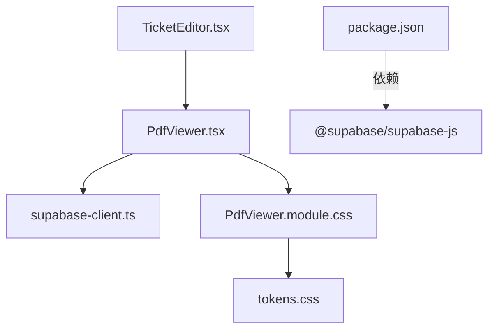
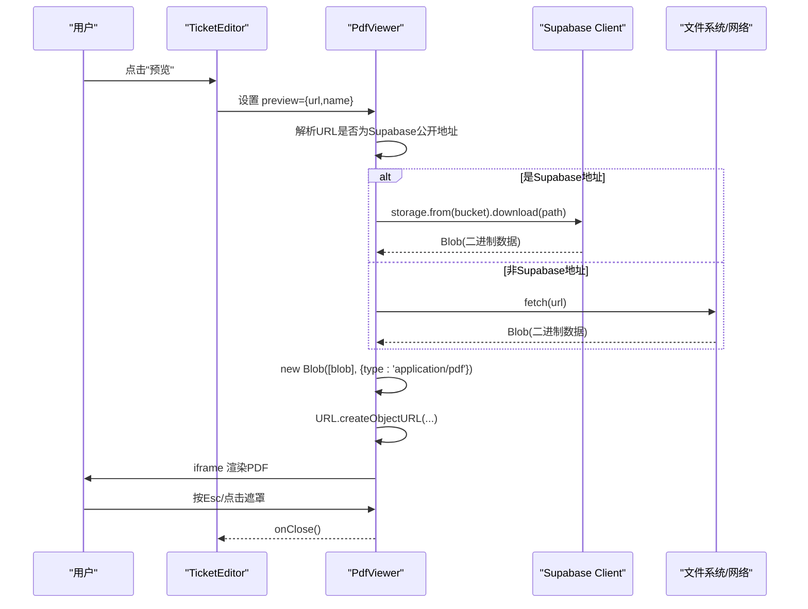
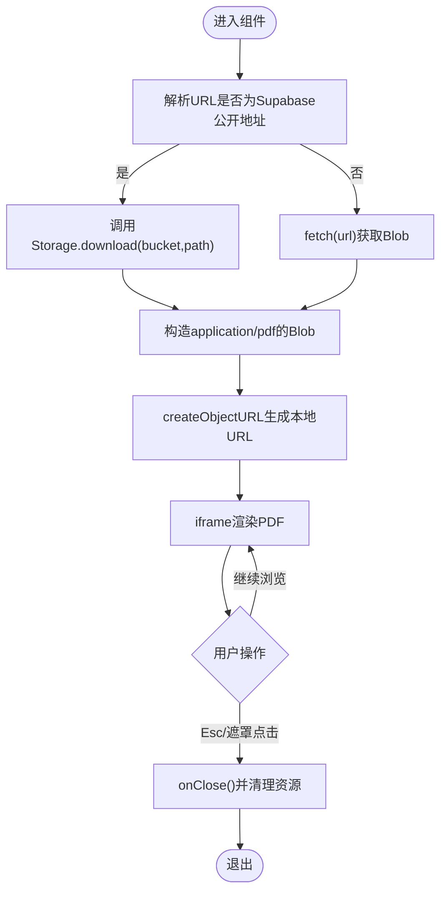
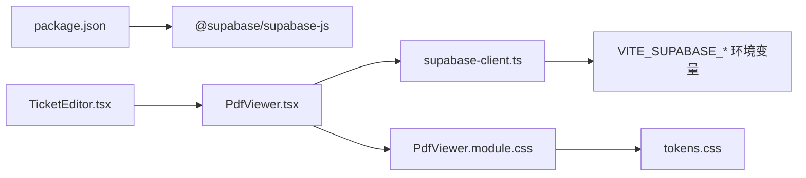

# PDF查看器组件

<cite>
**本文引用的文件**
- [src/components/PdfViewer.tsx](file://src/components/PdfViewer.tsx)
- [src/components/PdfViewer.module.css](file://src/components/PdfViewer.module.css)
- [src/features/trip/TicketEditor.tsx](file://src/features/trip/TicketEditor.tsx)
- [src/data/supabase-client.ts](file://src/data/supabase-client.ts)
- [package.json](file://package.json)
- [src/ui/tokens.css](file://src/ui/tokens.css)
</cite>

## 更新摘要
**所做更改**
- 更新了样式模块部分，反映PdfViewer头部样式从`var(--bg-sub)`更正为`var(--bg)`的变更
- 增强了视觉设计一致性说明，解释白色卡片在米色页面背景上的显示效果
- 更新了CSS变量定义的相关说明

## 目录
1. [简介](#简介)
2. [项目结构](#项目结构)
3. [核心组件](#核心组件)
4. [架构总览](#架构总览)
5. [详细组件分析](#详细组件分析)
6. [依赖关系分析](#依赖关系分析)
7. [性能与内存管理](#性能与内存管理)
8. [故障排查指南](#故障排查指南)
9. [结论](#结论)

## 简介
本组件是一个用于在应用内预览 PDF 的弹窗式查看器。它通过 Supabase Storage 或直链 URL 获取 PDF，并以 Blob + iframe 的方式在浏览器中渲染，解决因上传时 MIME 类型被覆盖导致无法直接渲染的问题。组件提供键盘关闭、遮罩点击关闭、新标签页打开等交互，并具备加载状态与错误提示。

## 项目结构
PDF 查看器位于通用组件层，被票据编辑功能模块调用，依赖 Supabase 客户端进行存储下载。样式采用 CSS Modules 隔离。

图表来源
- [src/features/trip/TicketEditor.tsx:236-242](file://src/features/trip/TicketEditor.tsx#L236-L242)
- [src/components/PdfViewer.tsx:1-12](file://src/components/PdfViewer.tsx#L1-L12)
- [src/data/supabase-client.ts:1-34](file://src/data/supabase-client.ts#L1-L34)
- [src/components/PdfViewer.module.css:1-102](file://src/components/PdfViewer.module.css#L1-L102)
- [package.json:18-31](file://package.json#L18-L31)
- [src/ui/tokens.css:16-22](file://src/ui/tokens.css#L16-L22)

章节来源
- [src/components/PdfViewer.tsx:1-123](file://src/components/PdfViewer.tsx#L1-L123)
- [src/components/PdfViewer.module.css:1-102](file://src/components/PdfViewer.module.css#L1-L102)
- [src/features/trip/TicketEditor.tsx:200-246](file://src/features/trip/TicketEditor.tsx#L200-L246)
- [src/data/supabase-client.ts:1-106](file://src/data/supabase-client.ts#L1-L106)
- [package.json:1-45](file://package.json#L1-L45)

## 核心组件
- PdfViewer：负责 PDF 的加载、渲染、弹窗生命周期管理（挂载/卸载）、键盘事件处理、错误态展示。
- TicketEditor：作为调用方，维护预览状态并触发 PdfViewer 显示。
- supabase-client：提供 Supabase 客户端实例与配置检测，供 PdfViewer 安全地下载 PDF。

章节来源
- [src/components/PdfViewer.tsx:27-122](file://src/components/PdfViewer.tsx#L27-L122)
- [src/features/trip/TicketEditor.tsx:236-242](file://src/features/trip/TicketEditor.tsx#L236-L242)
- [src/data/supabase-client.ts:17-34](file://src/data/supabase-client.ts#L17-L34)

## 架构总览
PdfViewer 通过两种路径获取 PDF：
- 若传入 URL 可解析为 Supabase 公开对象地址，则使用 Supabase Storage 下载为 Blob，再创建本地 Blob URL 给 iframe 渲染。
- 否则直接使用 fetch 拉取原始 URL 的 Blob。

渲染完成后，组件以 Portal 形式挂载到 body，避免层级与滚动问题；同时监听 Escape 键与遮罩点击以关闭弹窗。

图表来源
- [src/components/PdfViewer.tsx:14-25](file://src/components/PdfViewer.tsx#L14-L25)
- [src/components/PdfViewer.tsx:52-83](file://src/components/PdfViewer.tsx#L52-L83)
- [src/components/PdfViewer.tsx:85-122](file://src/components/PdfViewer.tsx#L85-L122)
- [src/data/supabase-client.ts:17-34](file://src/data/supabase-client.ts#L17-L34)

## 详细组件分析

### PdfViewer 组件
- 输入参数
  - url: PDF 的公开链接或 Supabase 公开对象 URL
  - name: 文件名，用于标题与无障碍属性
  - onClose: 关闭回调
- 内部状态
  - blobUrl: 本地 Blob URL，用于 iframe 渲染
  - error: 是否发生加载错误
- 关键逻辑
  - 解析 Supabase URL：从公开 URL 中提取 bucket 与 path，以便走 Storage 下载流程
  - 资源加载：优先走 Supabase Storage 下载，失败或非法 URL 则回退到 fetch
  - 内存管理：卸载时撤销 Blob URL，防止内存泄漏
  - 交互：支持 Esc 关闭、遮罩点击关闭、阻止冒泡避免误触
  - 渲染：Portal 挂载至 body，iframe 全屏居中展示
- 错误处理
  - 下载失败或无数据时标记 error，展示"加载失败"
  - 异步清理标志位 revoked 防止卸载后更新状态

图表来源
- [src/components/PdfViewer.tsx:14-25](file://src/components/PdfViewer.tsx#L14-L25)
- [src/components/PdfViewer.tsx:52-83](file://src/components/PdfViewer.tsx#L52-L83)
- [src/components/PdfViewer.tsx:85-122](file://src/components/PdfViewer.tsx#L85-L122)

章节来源
- [src/components/PdfViewer.tsx:1-123](file://src/components/PdfViewer.tsx#L1-L123)

### 样式模块
- 遮罩层：固定定位、半透明背景、模糊效果、淡入动画
- 容器：响应式宽度与高度，圆角与阴影
- 头部：**已更新** 使用 `var(--bg)` 而非 `var(--bg-sub)`，确保头部作为白色卡片在米色页面背景上保持清晰的视觉层次和身份识别
- iframe：自适应填充剩余空间
- 加载/错误：居中对齐的文本提示

**更新** PdfViewer 头部样式已从 `var(--bg-sub)` 更正为 `var(--bg)`，以保持其作为白色卡片的视觉身份，使其在米色页面背景上具有适当的对比度和层次感。这一变更确保了所有卡片组件在视觉处理上的一致性。

章节来源
- [src/components/PdfViewer.module.css:1-102](file://src/components/PdfViewer.module.css#L1-L102)
- [src/ui/tokens.css:16-22](file://src/ui/tokens.css#L16-L22)

### 调用方集成（TicketEditor）
- 维护预览状态 preview（包含 url 与 name），当存在时渲染 PdfViewer
- 提供上传入口与删除、预览等操作，预览时传递 url/name 并控制关闭

章节来源
- [src/features/trip/TicketEditor.tsx:200-246](file://src/features/trip/TicketEditor.tsx#L200-L246)

## 依赖关系分析
- 运行时依赖
  - @supabase/supabase-js：用于访问 Supabase Storage，实现安全的二进制下载
  - React/React-DOM：组件框架与 Portal
- 配置依赖
  - 环境变量 VITE_SUPABASE_URL 与 VITE_SUPABASE_ANON_KEY 决定客户端是否可用
  - 未配置时 supabase 为 null，组件自动降级为 fetch 直链模式

图表来源
- [package.json:18-31](file://package.json#L18-L31)
- [src/data/supabase-client.ts:17-34](file://src/data/supabase-client.ts#L17-L34)
- [src/components/PdfViewer.tsx:1-12](file://src/components/PdfViewer.tsx#L1-L12)
- [src/features/trip/TicketEditor.tsx:236-242](file://src/features/trip/TicketEditor.tsx#L236-L242)
- [src/ui/tokens.css:16-22](file://src/ui/tokens.css#L16-L22)

章节来源
- [package.json:1-45](file://package.json#L1-L45)
- [src/data/supabase-client.ts:1-106](file://src/data/supabase-client.ts#L1-L106)
- [src/components/PdfViewer.tsx:1-123](file://src/components/PdfViewer.tsx#L1-L123)

## 性能与内存管理
- 内存管理
  - 每次生成 Blob URL 都会在卸载时通过 revokeObjectURL 释放，避免内存泄漏
  - 使用局部标志位 revoked 防止卸载后的异步更新导致状态异常
- 渲染性能
  - 使用 iframe 原生 PDF 渲染，避免引入重型 PDF 解析库
  - 遮罩与容器尺寸采用视口单位，减少重排
- 网络优化建议
  - 对大文件可考虑分片或预取策略（当前实现为全量下载）
  - 若直链模式启用 CORS，可直接 fetch，减少一次鉴权开销

[本节为通用指导，不直接分析具体代码]

## 故障排查指南
- 现象：弹窗显示"加载失败"
  - 可能原因：Supabase 下载失败、网络错误、URL 不可达
  - 排查步骤：
    - 确认 URL 是否为有效的 Supabase 公开对象地址或可访问的直链
    - 检查环境变量是否已正确配置 Supabase 客户端
    - 查看控制台是否有跨域或权限错误
- 现象：弹窗无法关闭
  - 可能原因：事件冒泡被阻止但外层未捕获
  - 排查步骤：
    - 确认遮罩点击与 Escape 键事件绑定是否存在
    - 检查父级是否拦截了相关事件
- 现象：PDF 无法渲染
  - 可能原因：MIME 类型不正确或浏览器不支持内嵌 PDF
  - 排查步骤：
    - 确认组件已将 Blob 类型设置为 application/pdf
    - 尝试"新标签页打开"验证直链是否有效
- 现象：PDF 查看器头部颜色异常
  - 可能原因：CSS 变量定义错误或主题切换问题
  - 排查步骤：
    - 检查 tokens.css 中 --bg 和 --bg-sub 变量的定义
    - 确认 PdfViewer.module.css 中 header 样式使用的是正确的变量
    - 验证页面背景色与卡片背景色的对比度是否符合预期

章节来源
- [src/components/PdfViewer.tsx:52-83](file://src/components/PdfViewer.tsx#L52-L83)
- [src/components/PdfViewer.tsx:85-122](file://src/components/PdfViewer.tsx#L85-L122)
- [src/data/supabase-client.ts:17-34](file://src/data/supabase-client.ts#L17-L34)
- [src/components/PdfViewer.module.css:33-41](file://src/components/PdfViewer.module.css#L33-L41)
- [src/ui/tokens.css:16-22](file://src/ui/tokens.css#L16-L22)

## 结论
PdfViewer 组件以最小依赖实现了可靠的 PDF 预览能力，兼容 Supabase 存储与直链场景，具备良好的用户体验与内存管理。结合 TicketEditor 的使用方式，可在旅行票据场景中便捷地上传与预览附件。最近对头部样式的更新确保了组件在视觉设计上的一致性，使白色卡片能够在米色页面背景上保持清晰的层次感和身份识别。后续可考虑增加缓存、重试与更丰富的错误提示以提升健壮性。