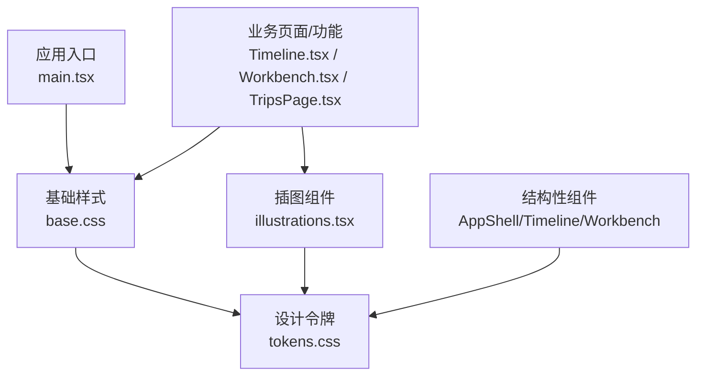
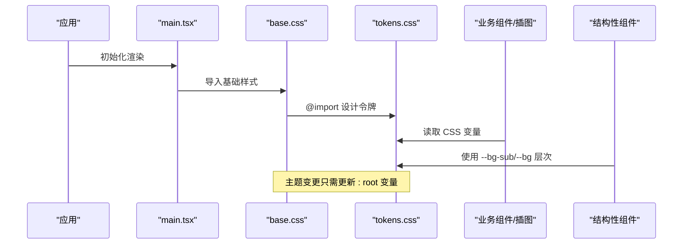
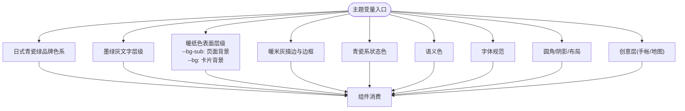
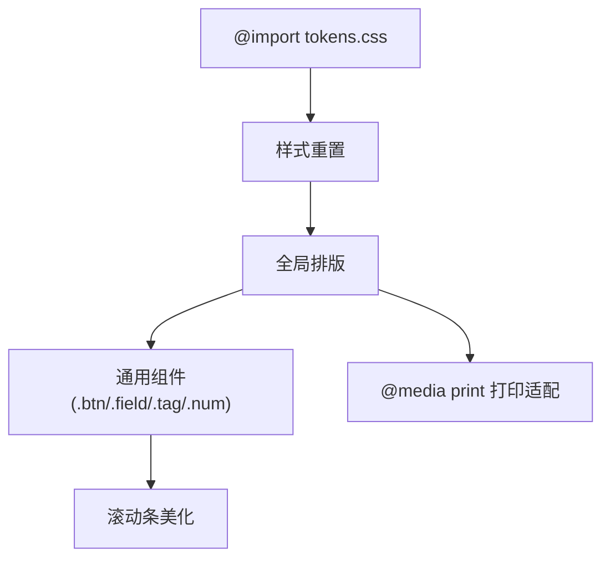
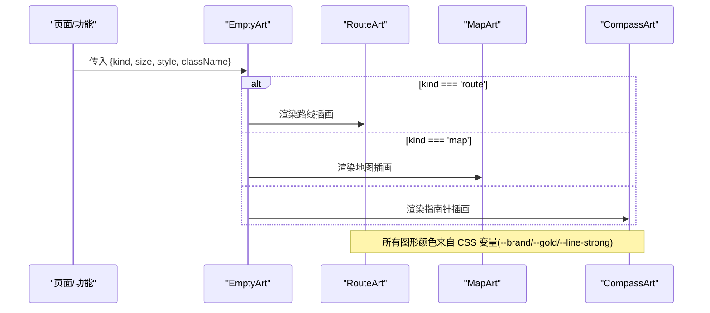
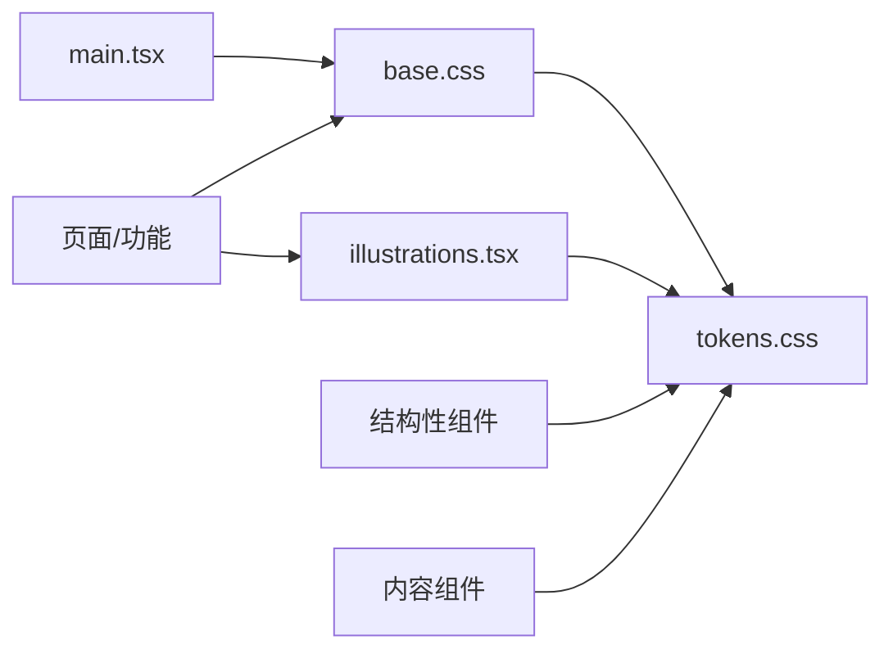

# 主题系统

<cite>
**本文引用的文件**
- [tokens.css](file://src/ui/tokens.css)
- [base.css](file://src/ui/base.css)
- [illustrations.tsx](file://src/ui/illustrations.tsx)
- [main.tsx](file://src/app/main.tsx)
- [Timeline.tsx](file://src/features/trip/Timeline.tsx)
- [Workbench.tsx](file://src/features/trip/Workbench.tsx)
- [TripsPage.tsx](file://src/pages/TripsPage.tsx)
- [AppShell.module.css](file://src/app/AppShell.module.css)
- [Timeline.module.css](file://src/features/trip/Timeline.module.css)
- [Workbench.module.css](file://src/features/trip/Workbench.module.css)
- [TripsPage.module.css](file://src/pages/TripsPage.module.css)
</cite>

## 更新摘要
**变更内容**
- **背景层次结构重构**：引入 `--bg-sub` (#FCFAF2 暖纸米白) 作为页面级背景，替代直接使用 `var(--bg)` 在结构性组件中
- **分层视觉体系**：建立主页面背景为暖米色调，白色卡片浮于其上，实现更好的视觉分离
- **全局应用**：body、AppShell、Timeline、Workbench 等结构性组件统一使用 `--bg-sub` 作为基础背景
- **卡片层级**：内容区域使用 `--bg` (白色) 创建浮动卡片效果，增强层次感

## 目录
1. [简介](#简介)
2. [项目结构](#项目结构)
3. [核心组件](#核心组件)
4. [架构总览](#架构总览)
5. [详细组件分析](#详细组件分析)
6. [依赖关系分析](#依赖关系分析)
7. [性能考量](#性能考量)
8. [故障排查指南](#故障排查指南)
9. [结论](#结论)
10. [附录](#附录)

## 简介
本主题系统以"设计令牌（Design Tokens）"为核心，通过 CSS 变量实现全局一致的视觉语言与主题切换。整体采用"浅色·日式青瓷绿 + 暖纸风"的默认主题，所有颜色、字体、圆角、阴影、布局常量均通过语义化命名暴露为变量，组件样式不写死具体色值，从而保证可维护性与可扩展性。基础样式 base.css 负责样式重置、通用排版与常用小组件；插图组件 illustrations.tsx 提供手绘感线描 SVG，自动跟随主题变量着色。

**更新** 主题系统进行了重大视觉设计更新，从通用青色品牌色转变为日式青瓷绿配色方案，采用传统日本色彩体系（高麗納戸/御召茶/白群），配合暖纸米白色画布背景，营造出探险手帐的独特质感。**最新更新** 引入了全新的背景层次结构，通过 `--bg-sub` 作为页面级背景，创建出温暖的手帐纸张质感，白色卡片浮于其上，形成清晰的视觉层次。

## 项目结构
主题系统相关文件集中在 src/ui 目录下：
- tokens.css：定义全部设计令牌（颜色、字体、圆角、阴影、布局常量、创意层 token）。
- base.css：引入 tokens.css，完成样式重置、全局排版、通用按钮/输入框等基础组件样式。
- illustrations.tsx：内联 SVG 插图组件，使用 CSS 变量驱动颜色，支持尺寸与类名扩展。
- main.tsx：应用入口，导入 base.css，使主题在全局生效。

**图表来源**
- [main.tsx:9-9](file://src/app/main.tsx#L9-L9)
- [base.css:1-1](file://src/ui/base.css#L1-L1)
- [tokens.css:1-78](file://src/ui/tokens.css#L1-L78)
- [illustrations.tsx:1-66](file://src/ui/illustrations.tsx#L1-L66)
- [Timeline.tsx:30-30](file://src/features/trip/Timeline.tsx#L30-L30)
- [Workbench.tsx:29-29](file://src/features/trip/Workbench.tsx#L29-L29)
- [TripsPage.tsx:8-8](file://src/pages/TripsPage.tsx#L8-L8)
- [AppShell.module.css:5-5](file://src/app/AppShell.module.css#L5-L5)

**章节来源**
- [main.tsx:9-9](file://src/app/main.tsx#L9-L9)
- [base.css:1-244](file://src/ui/base.css#L1-L244)
- [tokens.css:1-78](file://src/ui/tokens.css#L1-L78)
- [illustrations.tsx:1-66](file://src/ui/illustrations.tsx#L1-L66)

## 核心组件
- 设计令牌（tokens.css）
  - **品牌色与强调**：采用日式青瓷绿体系，包括高麗納戸主色、御召茶悬停态、白群点缀色等。
  - **文字层级**：墨绿灰到中性灰的三级文本层次，确保可读性与层次。
  - **表面层级**：**全新背景层次** - --bg-sub (#FCFAF2 暖纸米白) 作为页面级背景，--bg (#ffffff) 作为卡片/面板，--surface-1、--surface-2 用于嵌套面板，--bg-hover、--bg-inset 用于交互态。
  - **描边与边框**：暖米灰色调的统一线条粗细与深浅。
  - **状态色**：完全重新设计的日式青瓷系行程状态（瓶覗、錆浅葱、御召茶、錆鉄御納戸、深川鼠）。
  - **语义色**：保留红绿警示与确认意图的警告、危险、成功、信息提示。
  - **字体**：无衬线、等宽数字、展示用衬线（含中文回退宋体）。
  - **圆角与阴影**：统一的圆角阶梯与淡绿灰投影，保持柔和层次。
  - **布局常量**：头部高度、左右面板宽度等。
  - **创意层**：手帐网格点、路线轨、印章倾斜、品牌渐变、白群点缀等。

- 基础样式（base.css）
  - **样式重置**：box-sizing、html/body/#root 尺寸与边距。
  - **全局排版**：字体族、字号、行高、选择高亮、标题样式、链接样式。
  - **手帐背景**：**更新** - 暖纸色画布 (`var(--bg-sub)`) + 网格点纹理，营造手帐质感。
  - **通用组件**：按钮（默认/主色/幽灵/小尺寸）、输入字段（聚焦态）、标签、数字等。
  - **滚动条美化**：自定义滚动条轨道与滑块。
  - **打印适配**：隐藏非打印元素、调整正文样式。

- 插图组件（illustrations.tsx）
  - **空状态插画**：路线、地图、指南针三种风格。
  - **主题跟随**：SVG 路径与填充直接使用 CSS 变量，无需 JS 计算。
  - **尺寸与样式**：支持 size、style、className 扩展。

**章节来源**
- [tokens.css:1-78](file://src/ui/tokens.css#L1-L78)
- [base.css:1-244](file://src/ui/base.css#L1-L244)
- [illustrations.tsx:1-66](file://src/ui/illustrations.tsx#L1-L66)

## 架构总览
主题系统遵循"令牌驱动"的架构：
- **单一事实源**：tokens.css 集中管理所有视觉变量。
- **基础层**：base.css 基于 tokens 构建全局样式与通用组件。
- **组件层**：业务组件与插图组件仅消费 tokens，不直接引用硬编码颜色。
- **入口注入**：main.tsx 在应用启动时加载 base.css，确保主题全局可用。
- **背景层次**：**新增** - 通过 `--bg-sub` 和 `--bg` 创建清晰的分层背景体系。

**图表来源**
- [main.tsx:9-9](file://src/app/main.tsx#L9-L9)
- [base.css:1-1](file://src/ui/base.css#L1-L1)
- [tokens.css:1-78](file://src/ui/tokens.css#L1-L78)

## 详细组件分析

### 设计令牌（tokens.css）
- **颜色体系**
  - **品牌色**：--brand (#305A56 高麗納戸)、--brand-hover (#376B6D 御召茶)、--brand-soft、--brand-ink、--on-brand。
  - **文字色**：--text-1 (#2c332f)、--text-2 (#626960)、--text-3 (#949a90)。
  - **表面色**：**更新** - --bg-sub (#FCFAF2 暖纸米白) 作为页面级背景，--bg (#ffffff) 作为卡片/面板，--surface-1、--surface-2 (#F7F3EA) 用于嵌套面板，--bg-hover (#F3EEE3)、--bg-inset (#EDE7D8) 用于交互态。
  - **描边**：--line (#E4DDCC)、--line-strong (#D2CAB6)、--border、--border-strong。
  - **状态色**：--st-wishlist (#A5DEE4 瓶覗)、--st-candidate (#6699A1 錆浅葱)、--st-confirmed (#376B6D 御召茶)、--st-visited (#405B55 錆鉄御納戸)、--st-dropped (#77969A 深川鼠)。
  - **语义色**：--warn (#d2552f)、--danger、--ok (#2f9462)、--info-soft 及对应柔光变体。
- **字体规范**
  - --font-sans：系统优先，兼容中文字体。
  - --font-num：等宽数字，适合数据展示。
  - --font-display：展示型衬线，带中文回退宋体。
- **几何与质感**
  - 圆角：--radius-sm (6px)、--radius (9px)、--radius-lg (14px)。
  - 阴影：--shadow-sm、--shadow、--shadow-lg（淡绿灰投影）。
  - 布局常量：--header-h (50px)、--left-w (288px)、--right-w (384px)。
  - 创意层：--tex-dot (网格点)、--route/--route-brand (路线轨)、--stamp-rot (印章倾斜)、--brand-grad (品牌渐变)、--gold (#78C2C4 白群)、--gold-soft。

**图表来源**
- [tokens.css:1-78](file://src/ui/tokens.css#L1-L78)

**章节来源**
- [tokens.css:1-78](file://src/ui/tokens.css#L1-L78)

### 基础样式（base.css）
- **样式重置策略**
  - box-sizing 统一为 border-box，避免尺寸计算差异。
  - html/body/#root 设置高度与边距，确保全屏布局一致性。
- **全局排版**
  - 字体族、字号、行高、选择高亮、标题样式、链接样式。
  - **手帐背景**：**更新** - 暖纸底色 (`var(--bg-sub)`) + 网格点纹理，营造手帐质感。
- **通用组件**
  - 按钮：默认、主色、幽灵、小尺寸，包含 hover/active/disabled 态。
  - 输入字段：边框、背景、聚焦态（品牌色边框与柔光阴影）。
  - 标签、数字、 muted 文本、滚动条美化。
- **打印适配**
  - 隐藏 no-print 元素，调整正文样式，便于导出 PDF。

**图表来源**
- [base.css:1-244](file://src/ui/base.css#L1-L244)

**章节来源**
- [base.css:1-244](file://src/ui/base.css#L1-L244)

### 插图组件（illustrations.tsx）
- **组件能力**
  - EmptyArt：根据 kind 返回 route/map/compass 三类插画。
  - 每个子组件均为内联 SVG，使用 CSS 变量作为 stroke/fill，自动跟随主题。
  - 支持 size、style、className 进行尺寸与样式扩展。
- **使用示例**
  - Timeline.tsx：空列表时使用 route 插画。
  - Workbench.tsx：工具台空态使用 compass 插画。
  - TripsPage.tsx：行程页空态使用 map 插画。

**图表来源**
- [illustrations.tsx:1-66](file://src/ui/illustrations.tsx#L1-L66)
- [Timeline.tsx:30-30](file://src/features/trip/Timeline.tsx#L30-L30)
- [Workbench.tsx:29-29](file://src/features/trip/Workbench.tsx#L29-L29)
- [TripsPage.tsx:8-8](file://src/pages/TripsPage.tsx#L8-L8)

**章节来源**
- [illustrations.tsx:1-66](file://src/ui/illustrations.tsx#L1-L66)
- [Timeline.tsx:30-30](file://src/features/trip/Timeline.tsx#L30-L30)
- [Workbench.tsx:29-29](file://src/features/trip/Workbench.tsx#L29-L29)
- [TripsPage.tsx:8-8](file://src/pages/TripsPage.tsx#L8-L8)

### 背景层次结构详解
**更新** 主题系统现在采用分层背景设计，通过 `--bg-sub` 和 `--bg` 创建清晰的视觉层次：

- **页面级背景** (`--bg-sub`: #FCFAF2)
  - 应用于 body、AppShell、Timeline 容器等结构性组件
  - 提供温暖的米白色手帐纸张质感
  - 配合网格点纹理 (`--tex-dot`) 营造真实纸张效果

- **卡片级背景** (`--bg`: #ffffff)
  - 应用于内容卡片、面板、对话框等浮动元素
  - 在暖纸背景上形成清晰的白色卡片效果
  - 通过阴影 (`--shadow-*`) 增强悬浮感

- **嵌套层级** (`--surface-1`, `--surface-2`)
  - `--surface-1`: 主要面板背景
  - `--surface-2`: 嵌套面板或次要内容区域
  - 提供微妙的层次区分

**实际应用示例**：
- [AppShell.module.css:5-5](file://src/app/AppShell.module.css#L5-L5): `.shell { background: var(--bg-sub); }`
- [Timeline.module.css:6-6](file://src/features/trip/Timeline.module.css#L6-L6): `.wrap { background: var(--bg-sub); }`
- [Workbench.module.css:99-99](file://src/features/trip/Workbench.module.css#L99-L99): `.left { background: var(--bg); }`

**章节来源**
- [AppShell.module.css:5-5](file://src/app/AppShell.module.css#L5-L5)
- [Timeline.module.css:6-6](file://src/features/trip/Timeline.module.css#L6-L6)
- [Workbench.module.css:99-99](file://src/features/trip/Workbench.module.css#L99-L99)

## 依赖关系分析
- **入口依赖**：main.tsx 导入 base.css，确保主题与基础样式全局生效。
- **样式依赖**：base.css 通过 @import 引入 tokens.css，形成"基础样式 → 设计令牌"的单向依赖。
- **组件依赖**：业务组件与插图组件消费 tokens，不直接依赖彼此。
- **主题切换机制**：当前仓库未提供暗色主题切换逻辑，但令牌结构已预留通过覆盖 :root 变量实现的主题切换能力。
- **背景层次依赖**：结构性组件依赖 `--bg-sub`，内容组件依赖 `--bg`，形成清晰的分层关系。

**图表来源**
- [main.tsx:9-9](file://src/app/main.tsx#L9-L9)
- [base.css:1-1](file://src/ui/base.css#L1-L1)
- [tokens.css:1-78](file://src/ui/tokens.css#L1-L78)
- [illustrations.tsx:1-66](file://src/ui/illustrations.tsx#L1-L66)

**章节来源**
- [main.tsx:9-9](file://src/app/main.tsx#L9-L9)
- [base.css:1-1](file://src/ui/base.css#L1-L1)
- [tokens.css:1-78](file://src/ui/tokens.css#L1-L78)
- [illustrations.tsx:1-66](file://src/ui/illustrations.tsx#L1-L66)

## 性能考量
- **零外部依赖**：插图使用内联 SVG，减少网络请求与资源体积。
- **纯 CSS 主题**：通过 CSS 变量驱动，避免运行时 JS 计算颜色，提升渲染性能。
- **轻量基础样式**：base.css 仅提供必要重置与通用组件，降低样式体积。
- **打印优化**：@media print 下简化样式，利于快速导出 PDF。
- **背景层次优化**：使用 CSS 变量而非硬编码颜色，减少重绘开销。

## 故障排查指南
- **主题变量未生效**
  - 检查是否在应用入口导入了 base.css（main.tsx）。
  - 确认 tokens.css 被正确 @import（base.css 首行）。
- **背景层次异常**
  - **新增** - 检查结构性组件是否正确使用 `var(--bg-sub)` 而非 `var(--bg)`。
  - 确认 `--bg-sub` 和 `--bg` 变量未被意外覆盖。
- **插图颜色异常**
  - 确认 CSS 变量 --brand、--gold、--line-strong 未被覆盖或拼写错误。
  - 检查 SVG 是否使用了 var() 引用而非硬编码颜色。
- **按钮/输入框样式错乱**
  - 核对是否引入了 base.css 且未被其他样式覆盖。
  - 检查 .btn/.field 类名是否正确应用。
- **打印输出异常**
  - 确认 .no-print 元素是否需要隐藏。
  - 检查 @media print 下的 body 样式是否符合预期。

**章节来源**
- [main.tsx:9-9](file://src/app/main.tsx#L9-L9)
- [base.css:1-244](file://src/ui/base.css#L1-L244)
- [illustrations.tsx:1-66](file://src/ui/illustrations.tsx#L1-L66)

## 结论
该主题系统以 tokens.css 为中心，通过语义化的 CSS 变量组织颜色、字体、圆角、阴影与布局常量，配合 base.css 的基础样式与 illustrations.tsx 的内联插图，实现了"令牌驱动、组件解耦、主题可替换"的设计系统。**更新后的主题系统**采用日式青瓷绿配色方案（高麗納戸/御召茶/白群），配合暖纸米白色画布背景，营造出独特的探险手帐质感。**最新更新** 引入了全新的背景层次结构，通过 `--bg-sub` 作为页面级背景，创建出温暖的手帐纸张质感，白色卡片浮于其上，形成清晰的视觉层次，提升了整体的用户体验和视觉美感。未来可通过覆盖 :root 变量轻松扩展暗色主题或品牌定制。

## 附录

### 主题定制指南
- **品牌色配置**
  - 修改 tokens.css 中的 --brand、--brand-hover、--brand-soft、--brand-ink、--on-brand，即可全局更新品牌主色与交互态。
  - 当前采用日式传统色彩体系，可根据需要调整到高麗納戸、御召茶等颜色的具体色值。
- **字体替换**
  - 调整 --font-sans、--font-num、--font-display 的字体栈，确保目标平台显示一致。
  - 展示字体已配置宋体回退，适合探险手帐风格。
- **间距与布局**
  - 通过 --radius、--shadow-*、--header-h、--left-w、--right-w 调整圆角、阴影与布局常量。
  - 阴影已调整为淡绿灰色调，保持柔和层次。
- **创意层**
  - 调整 --tex-dot、--route、--route-brand、--stamp-rot、--brand-grad、--gold、--gold-soft 以改变手帐/地图质感。
  - 金色点缀已改为白群色调，更符合青瓷主题。
- **背景层次定制**
  - **新增** - 调整 --bg-sub 修改页面级背景色，影响整体氛围。
  - **新增** - 调整 --bg 修改卡片背景色，控制悬浮元素的视觉效果。
  - **新增** - 调整 --surface-1、--surface-2 控制嵌套面板的层次区分。

### 创建自定义主题
- **新建主题文件**（例如 theme-dark.css），在 :root 中重新定义 tokens.css 中的变量集合。
- **在应用入口按需引入主题文件**，或通过媒体查询/用户偏好动态切换。
- **保持变量命名与默认主题一致**，确保组件无需改动即可适配新主题。
- **背景层次适配**：**新增** - 确保在新主题中正确定义 --bg-sub 和 --bg 的关系，维持清晰的视觉层次。

### 扩展设计系统
- **新增语义色或状态色**：在 tokens.css 中添加变量，并在组件中使用。
- **新增通用组件**：在 base.css 中定义类名并消费 tokens。
- **新增插图**：在 illustrations.tsx 中增加新的 SVG 组件，复用现有变量。
- **背景层次扩展**：**新增** - 如需更复杂的背景层次，可在 tokens.css 中添加更多背景变量，并在组件中合理使用。

**章节来源**
- [tokens.css:1-78](file://src/ui/tokens.css#L1-L78)
- [base.css:1-244](file://src/ui/base.css#L1-L244)
- [illustrations.tsx:1-66](file://src/ui/illustrations.tsx#L1-L66)