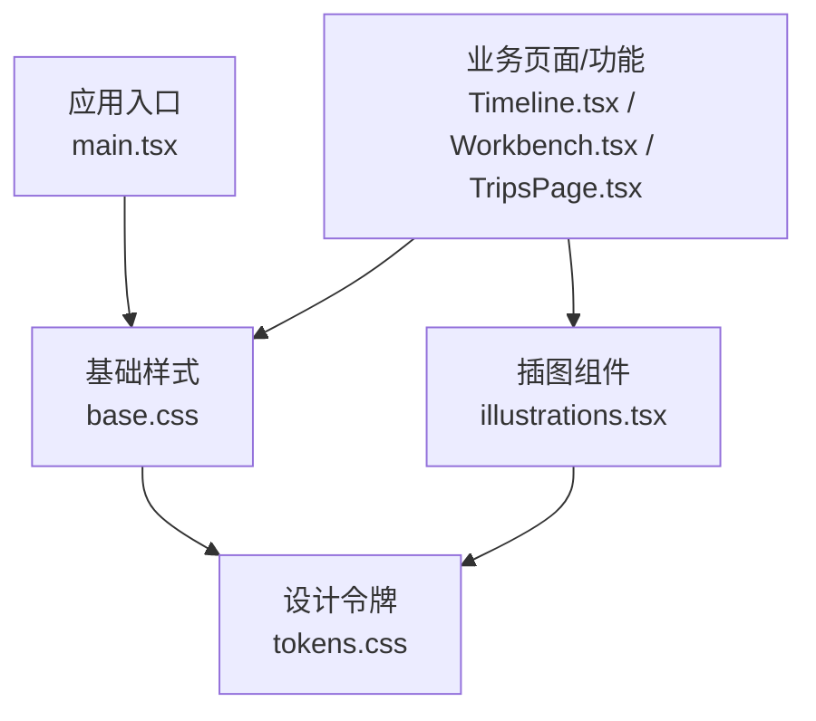
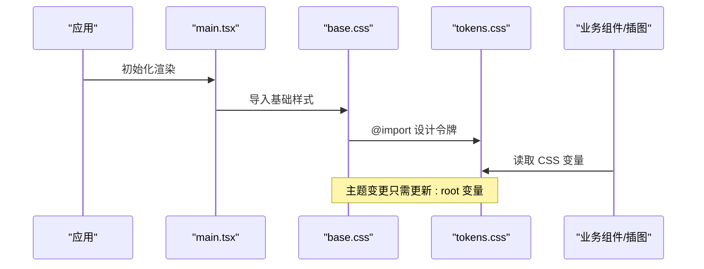
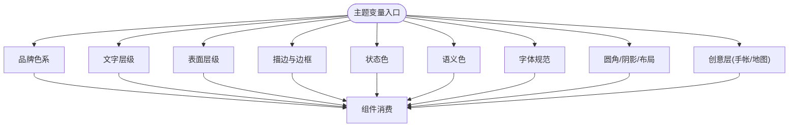
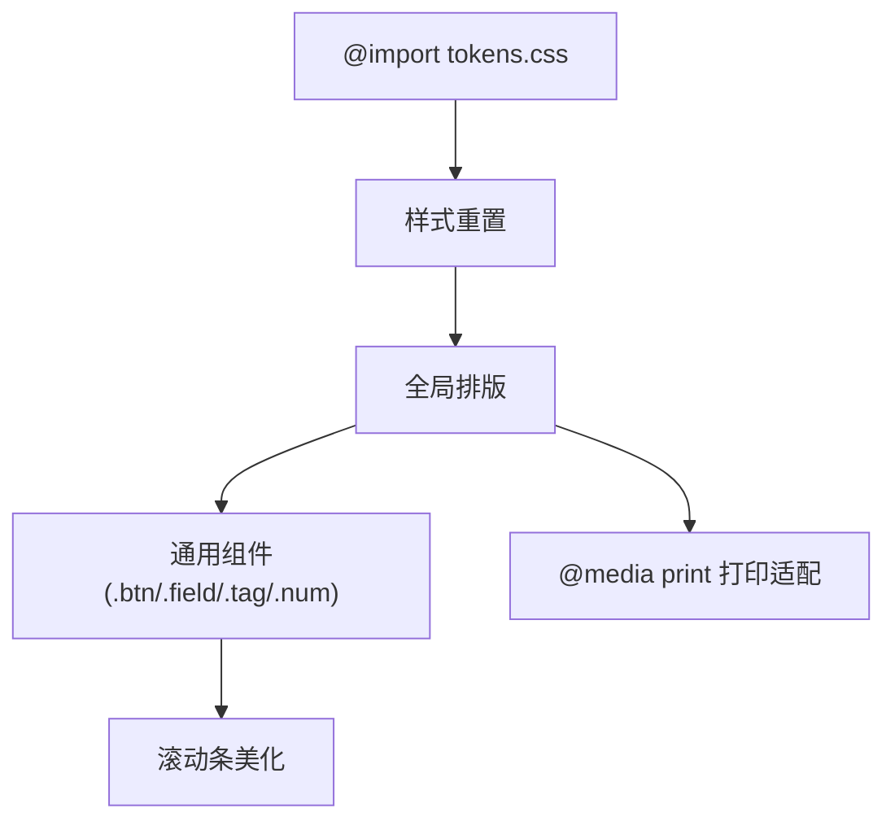
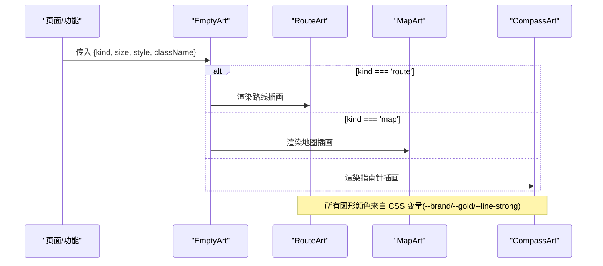
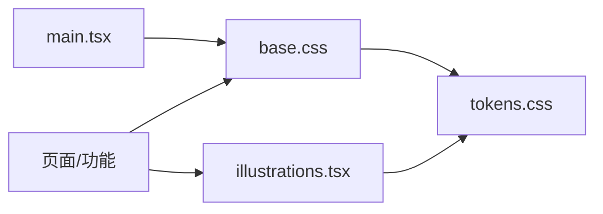

# 主题系统

<cite>
**本文引用的文件**
- [tokens.css](file://src/ui/tokens.css)
- [base.css](file://src/ui/base.css)
- [illustrations.tsx](file://src/ui/illustrations.tsx)
- [main.tsx](file://src/app/main.tsx)
- [Timeline.tsx](file://src/features/trip/Timeline.tsx)
- [Workbench.tsx](file://src/features/trip/Workbench.tsx)
- [TripsPage.tsx](file://src/pages/TripsPage.tsx)
</cite>

## 目录
1. [简介](#简介)
2. [项目结构](#项目结构)
3. [核心组件](#核心组件)
4. [架构总览](#架构总览)
5. [详细组件分析](#详细组件分析)
6. [依赖关系分析](#依赖关系分析)
7. [性能考量](#性能考量)
8. [故障排查指南](#故障排查指南)
9. [结论](#结论)
10. [附录](#附录)

## 简介
本主题系统以“设计令牌（Design Tokens）”为核心，通过 CSS 变量实现全局一致的视觉语言与主题切换。整体采用“浅色·青瓷绿 + 暖纸风”的默认主题，所有颜色、字体、圆角、阴影、布局常量均通过语义化命名暴露为变量，组件样式不写死具体色值，从而保证可维护性与可扩展性。基础样式 base.css 负责样式重置、通用排版与常用小组件；插图组件 illustrations.tsx 提供手绘感线描 SVG，自动跟随主题变量着色。

## 项目结构
主题系统相关文件集中在 src/ui 目录下：
- tokens.css：定义全部设计令牌（颜色、字体、圆角、阴影、布局常量、创意层 token）。
- base.css：引入 tokens.css，完成样式重置、全局排版、通用按钮/输入框等基础组件样式。
- illustrations.tsx：内联 SVG 插图组件，使用 CSS 变量驱动颜色，支持尺寸与类名扩展。
- main.tsx：应用入口，导入 base.css，使主题在全局生效。

图表来源
- [main.tsx:9-9](file://src/app/main.tsx#L9-L9)
- [base.css:1-1](file://src/ui/base.css#L1-L1)
- [tokens.css:1-77](file://src/ui/tokens.css#L1-L77)
- [illustrations.tsx:1-66](file://src/ui/illustrations.tsx#L1-L66)
- [Timeline.tsx:30-30](file://src/features/trip/Timeline.tsx#L30-L30)
- [Workbench.tsx:29-29](file://src/features/trip/Workbench.tsx#L29-L29)
- [TripsPage.tsx:8-8](file://src/pages/TripsPage.tsx#L8-L8)

章节来源
- [main.tsx:9-9](file://src/app/main.tsx#L9-L9)
- [base.css:1-208](file://src/ui/base.css#L1-L208)
- [tokens.css:1-77](file://src/ui/tokens.css#L1-L77)
- [illustrations.tsx:1-66](file://src/ui/illustrations.tsx#L1-L66)

## 核心组件
- 设计令牌（tokens.css）
  - 品牌色与强调：主色、悬停态、半透明背景、文字反白等。
  - 文字层级：三级文本灰度，确保可读性与层次。
  - 表面层级：画布底色、面板底色、嵌套面板、悬浮态、输入框内陷底。
  - 描边与边框：统一线条粗细与深浅。
  - 状态色：行程相关状态（收藏、候选、已确认、已访问、已丢弃）。
  - 语义色：警告、危险、成功、信息提示等。
  - 字体：无衬线、等宽数字、展示用衬线（含中文回退）。
  - 圆角与阴影：统一的圆角阶梯与柔和投影。
  - 布局常量：头部高度、左右面板宽度等。
  - 创意层：手帐网格点、路线轨、印章倾斜、品牌渐变、金色点缀等。

- 基础样式（base.css）
  - 样式重置：box-sizing、html/body/#root 尺寸与边距。
  - 全局排版：字体族、字号、行高、选择高亮、标题样式、链接样式。
  - 通用组件：按钮（默认/主色/幽灵/小尺寸）、输入字段（聚焦态）、标签、数字等。
  - 滚动条美化：自定义滚动条轨道与滑块。
  - 打印适配：隐藏非打印元素、调整正文样式。

- 插图组件（illustrations.tsx）
  - 空状态插画：路线、地图、指南针三种风格。
  - 主题跟随：SVG 路径与填充直接使用 CSS 变量，无需 JS 计算。
  - 尺寸与样式：支持 size、style、className 扩展。

章节来源
- [tokens.css:1-77](file://src/ui/tokens.css#L1-L77)
- [base.css:1-208](file://src/ui/base.css#L1-L208)
- [illustrations.tsx:1-66](file://src/ui/illustrations.tsx#L1-L66)

## 架构总览
主题系统遵循“令牌驱动”的架构：
- 单一事实源：tokens.css 集中管理所有视觉变量。
- 基础层：base.css 基于 tokens 构建全局样式与通用组件。
- 组件层：业务组件与插图组件仅消费 tokens，不直接引用硬编码颜色。
- 入口注入：main.tsx 在应用启动时加载 base.css，确保主题全局可用。

图表来源
- [main.tsx:9-9](file://src/app/main.tsx#L9-L9)
- [base.css:1-1](file://src/ui/base.css#L1-L1)
- [tokens.css:1-77](file://src/ui/tokens.css#L1-L77)

## 详细组件分析

### 设计令牌（tokens.css）
- 颜色体系
  - 品牌色：--brand、--brand-hover、--brand-soft、--brand-ink、--on-brand。
  - 文字色：--text-1、--text-2、--text-3。
  - 表面色：--bg-sub、--bg、--surface-1、--surface-2、--bg-hover、--bg-inset。
  - 描边：--line、--line-strong、--border、--border-strong。
  - 状态色：--st-wishlist、--st-candidate、--st-confirmed、--st-visited、--st-dropped。
  - 语义色：--warn、--danger、--ok、--info-soft 及对应柔光变体。
- 字体规范
  - --font-sans：系统优先，兼容中文字体。
  - --font-num：等宽数字，适合数据展示。
  - --font-display：展示型衬线，带中文回退。
- 几何与质感
  - 圆角：--radius-sm、--radius、--radius-lg。
  - 阴影：--shadow-sm、--shadow、--shadow-lg。
  - 布局常量：--header-h、--left-w、--right-w。
  - 创意层：--tex-dot（网格点）、--route/--route-brand（路线轨）、--stamp-rot（印章倾斜）、--brand-grad（品牌渐变）、--gold/--gold-soft（金色点缀）。

图表来源
- [tokens.css:1-77](file://src/ui/tokens.css#L1-L77)

章节来源
- [tokens.css:1-77](file://src/ui/tokens.css#L1-L77)

### 基础样式（base.css）
- 样式重置策略
  - box-sizing 统一为 border-box，避免尺寸计算差异。
  - html/body/#root 设置高度与边距，确保全屏布局一致性。
- 全局排版
  - 字体族、字号、行高、选择高亮、标题样式、链接样式。
  - 背景：画布底色 + 网格点纹理，营造手帐质感。
- 通用组件
  - 按钮：默认、主色、幽灵、小尺寸，包含 hover/active/disabled 态。
  - 输入字段：边框、背景、聚焦态（品牌色边框与柔光阴影）。
  - 标签、数字、 muted 文本、滚动条美化。
- 打印适配
  - 隐藏 no-print 元素，调整正文样式，便于导出 PDF。

图表来源
- [base.css:1-208](file://src/ui/base.css#L1-L208)

章节来源
- [base.css:1-208](file://src/ui/base.css#L1-L208)

### 插图组件（illustrations.tsx）
- 组件能力
  - EmptyArt：根据 kind 返回 route/map/compass 三类插画。
  - 每个子组件均为内联 SVG，使用 CSS 变量作为 stroke/fill，自动跟随主题。
  - 支持 size、style、className 进行尺寸与样式扩展。
- 使用示例
  - Timeline.tsx：空列表时使用 route 插画。
  - Workbench.tsx：工具台空态使用 compass 插画。
  - TripsPage.tsx：行程页空态使用 map 插画。

图表来源
- [illustrations.tsx:1-66](file://src/ui/illustrations.tsx#L1-L66)
- [Timeline.tsx:30-30](file://src/features/trip/Timeline.tsx#L30-L30)
- [Workbench.tsx:29-29](file://src/features/trip/Workbench.tsx#L29-L29)
- [TripsPage.tsx:8-8](file://src/pages/TripsPage.tsx#L8-L8)

章节来源
- [illustrations.tsx:1-66](file://src/ui/illustrations.tsx#L1-L66)
- [Timeline.tsx:30-30](file://src/features/trip/Timeline.tsx#L30-L30)
- [Workbench.tsx:29-29](file://src/features/trip/Workbench.tsx#L29-L29)
- [TripsPage.tsx:8-8](file://src/pages/TripsPage.tsx#L8-L8)

## 依赖关系分析
- 入口依赖：main.tsx 导入 base.css，确保主题与基础样式全局生效。
- 样式依赖：base.css 通过 @import 引入 tokens.css，形成“基础样式 → 设计令牌”的单向依赖。
- 组件依赖：业务组件与插图组件消费 tokens，不直接依赖彼此。
- 主题切换机制：当前仓库未提供暗色主题切换逻辑，但令牌结构已预留通过覆盖 :root 变量实现的主题切换能力。

图表来源
- [main.tsx:9-9](file://src/app/main.tsx#L9-L9)
- [base.css:1-1](file://src/ui/base.css#L1-L1)
- [tokens.css:1-77](file://src/ui/tokens.css#L1-L77)
- [illustrations.tsx:1-66](file://src/ui/illustrations.tsx#L1-L66)

章节来源
- [main.tsx:9-9](file://src/app/main.tsx#L9-L9)
- [base.css:1-1](file://src/ui/base.css#L1-L1)
- [tokens.css:1-77](file://src/ui/tokens.css#L1-L77)
- [illustrations.tsx:1-66](file://src/ui/illustrations.tsx#L1-L66)

## 性能考量
- 零外部依赖：插图使用内联 SVG，减少网络请求与资源体积。
- 纯 CSS 主题：通过 CSS 变量驱动，避免运行时 JS 计算颜色，提升渲染性能。
- 轻量基础样式：base.css 仅提供必要重置与通用组件，降低样式体积。
- 打印优化：@media print 下简化样式，利于快速导出 PDF。

## 故障排查指南
- 主题变量未生效
  - 检查是否在应用入口导入了 base.css（main.tsx）。
  - 确认 tokens.css 被正确 @import（base.css 首行）。
- 插图颜色异常
  - 确认 CSS 变量 --brand、--gold、--line-strong 未被覆盖或拼写错误。
  - 检查 SVG 是否使用了 var() 引用而非硬编码颜色。
- 按钮/输入框样式错乱
  - 核对是否引入了 base.css 且未被其他样式覆盖。
  - 检查 .btn/.field 类名是否正确应用。
- 打印输出异常
  - 确认 .no-print 元素是否需要隐藏。
  - 检查 @media print 下的 body 样式是否符合预期。

章节来源
- [main.tsx:9-9](file://src/app/main.tsx#L9-L9)
- [base.css:1-208](file://src/ui/base.css#L1-L208)
- [illustrations.tsx:1-66](file://src/ui/illustrations.tsx#L1-L66)

## 结论
该主题系统以 tokens.css 为中心，通过语义化的 CSS 变量组织颜色、字体、圆角、阴影与布局常量，配合 base.css 的基础样式与 illustrations.tsx 的内联插图，实现了“令牌驱动、组件解耦、主题可替换”的设计系统。当前默认主题为浅色青瓷绿与暖纸风，未来可通过覆盖 :root 变量轻松扩展暗色主题或品牌定制。

## 附录

### 主题定制指南
- 品牌色配置
  - 修改 tokens.css 中的 --brand、--brand-hover、--brand-soft、--brand-ink、--on-brand，即可全局更新品牌主色与交互态。
- 字体替换
  - 调整 --font-sans、--font-num、--font-display 的字体栈，确保目标平台显示一致。
- 间距与布局
  - 通过 --radius、--shadow-*、--header-h、--left-w、--right-w 调整圆角、阴影与布局常量。
- 创意层
  - 调整 --tex-dot、--route、--route-brand、--stamp-rot、--brand-grad、--gold、--gold-soft 以改变手帐/地图质感。

### 创建自定义主题
- 新建主题文件（例如 theme-dark.css），在 :root 中重新定义 tokens.css 中的变量集合。
- 在应用入口按需引入主题文件，或通过媒体查询/用户偏好动态切换。
- 保持变量命名与默认主题一致，确保组件无需改动即可适配新主题。

### 扩展设计系统
- 新增语义色或状态色：在 tokens.css 中添加变量，并在组件中使用。
- 新增通用组件：在 base.css 中定义类名并消费 tokens。
- 新增插图：在 illustrations.tsx 中增加新的 SVG 组件，复用现有变量。

章节来源
- [tokens.css:1-77](file://src/ui/tokens.css#L1-L77)
- [base.css:1-208](file://src/ui/base.css#L1-L208)
- [illustrations.tsx:1-66](file://src/ui/illustrations.tsx#L1-L66)