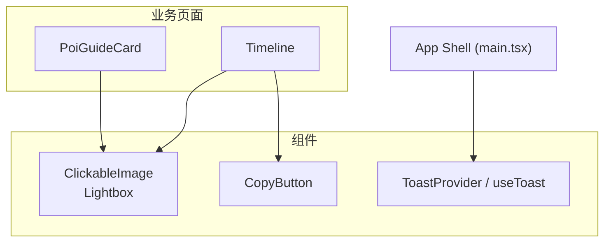
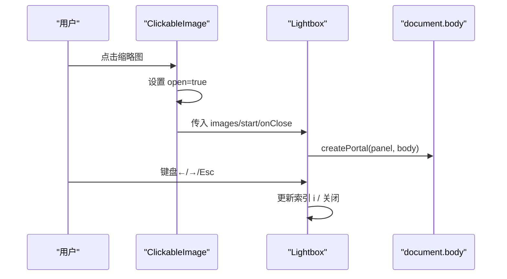
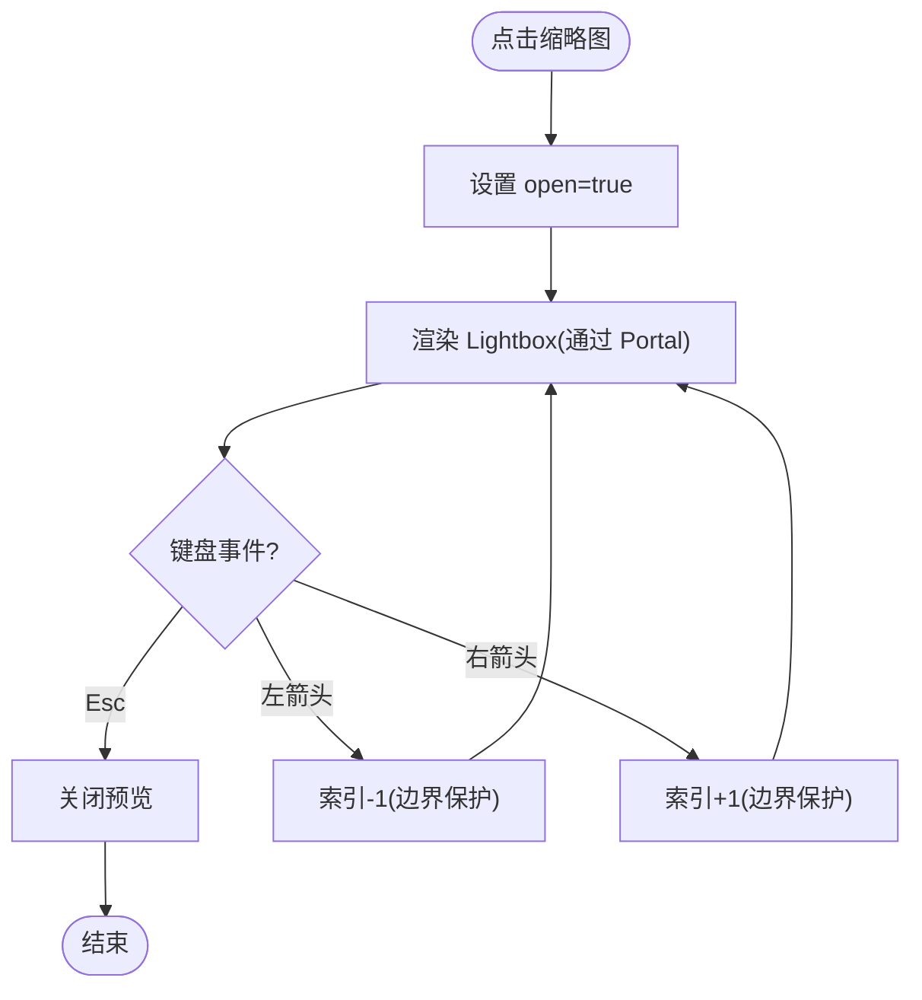
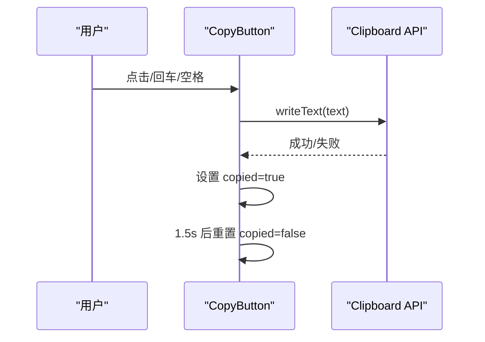
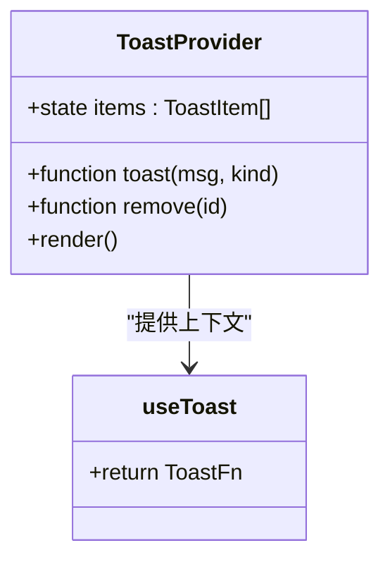
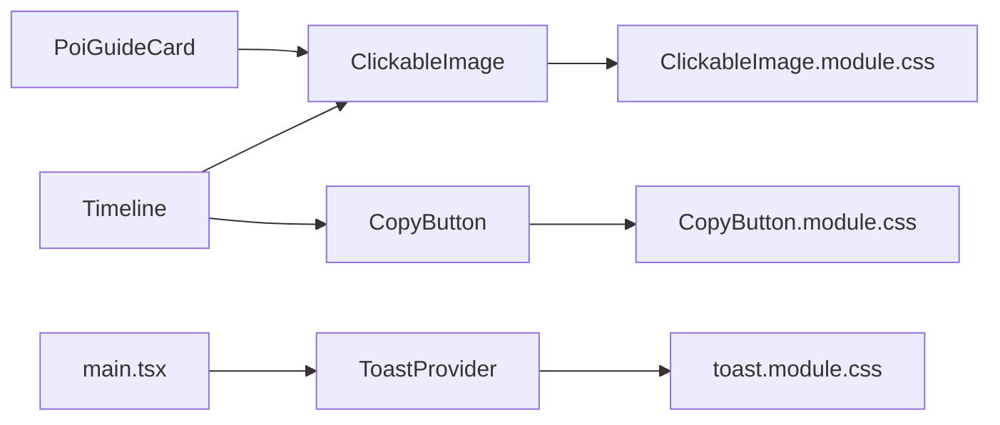

# 基础组件

<cite>
**本文引用的文件**
- [ClickableImage.tsx](file://src/components/ClickableImage.tsx)
- [ClickableImage.module.css](file://src/components/ClickableImage.module.css)
- [CopyButton.tsx](file://src/components/CopyButton.tsx)
- [CopyButton.module.css](file://src/components/CopyButton.module.css)
- [toast.tsx](file://src/ui/toast.tsx)
- [toast.module.css](file://src/ui/toast.module.css)
- [Timeline.tsx](file://src/features/trip/Timeline.tsx)
- [PoiGuideCard.tsx](file://src/features/world/PoiGuideCard.tsx)
- [main.tsx](file://src/app/main.tsx)
</cite>

## 目录
1. [简介](#简介)
2. [项目结构](#项目结构)
3. [核心组件](#核心组件)
4. [架构总览](#架构总览)
5. [详细组件分析](#详细组件分析)
6. [依赖关系分析](#依赖关系分析)
7. [性能考虑](#性能考虑)
8. [故障排查指南](#故障排查指南)
9. [结论](#结论)
10. [附录：使用示例与最佳实践](#附录使用示例与最佳实践)

## 简介
本文件为“玩无一失”应用中的三个基础 UI 组件提供完整文档：可点击图片（含画廊与全屏预览）、复制按钮、提示框（Toast）。内容涵盖 Props 接口、事件处理机制、状态管理、样式定制、可访问性实现、响应式设计考量，以及在不同场景下的正确使用方式与最佳实践。

## 项目结构
这三个组件分别位于以下路径：
- 可点击图片：src/components/ClickableImage.tsx + ClickableImage.module.css
- 复制按钮：src/components/CopyButton.tsx + CopyButton.module.css
- 提示框：src/ui/toast.tsx + toast.module.css

它们被业务页面以最小耦合的方式复用：
- Timeline 中组合使用 ClickableImage 与 CopyButton
- PoiGuideCard 直接使用 Lightbox 进行受控的全屏预览
- main.tsx 在根节点包裹 ToastProvider，使全局 useToast() 可用

图表来源
- [ClickableImage.tsx:14-58](file://src/components/ClickableImage.tsx#L14-L58)
- [CopyButton.tsx:15-67](file://src/components/CopyButton.tsx#L15-L67)
- [toast.tsx:42-81](file://src/ui/toast.tsx#L42-L81)
- [Timeline.tsx:12-13](file://src/features/trip/Timeline.tsx#L12-L13)
- [PoiGuideCard.tsx:3-4](file://src/features/world/PoiGuideCard.tsx#L3-L4)
- [main.tsx:25-33](file://src/app/main.tsx#L25-L33)

章节来源
- [ClickableImage.tsx:14-58](file://src/components/ClickableImage.tsx#L14-L58)
- [CopyButton.tsx:15-67](file://src/components/CopyButton.tsx#L15-L67)
- [toast.tsx:42-81](file://src/ui/toast.tsx#L42-L81)
- [Timeline.tsx:12-13](file://src/features/trip/Timeline.tsx#L12-L13)
- [PoiGuideCard.tsx:3-4](file://src/features/world/PoiGuideCard.tsx#L3-L4)
- [main.tsx:25-33](file://src/app/main.tsx#L25-L33)

## 核心组件
- 可点击图片（ClickableImage）：点击缩略图触发全屏预览；支持多图画廊、键盘导航、关闭遮罩、版权信息与来源链接。
- 复制按钮（CopyButton）：调用剪贴板 API 复制文本，提供“已复制”反馈；支持作为 span 或 button 渲染，具备键盘可达性与无障碍标签。
- 提示框（Toast）：全局上下文提供的轻量提示，自动消失、可点击关闭，带语义化图标与颜色区分。

章节来源
- [ClickableImage.tsx:14-58](file://src/components/ClickableImage.tsx#L14-L58)
- [CopyButton.tsx:15-67](file://src/components/CopyButton.tsx#L15-L67)
- [toast.tsx:42-81](file://src/ui/toast.tsx#L42-L81)

## 架构总览
- 可点击图片通过 React Portal 将 Lightbox 挂载到 document.body，避免父级布局影响；内部维护当前图片索引 i，并监听键盘事件实现左右切换与 ESC 关闭。
- 复制按钮封装 navigator.clipboard.writeText，失败时静默处理，不阻断交互；根据 asSpan 决定渲染为 <button> 或 。
- 提示框通过 Context 暴露 useToast，任意子组件均可调用；ToastProvider 集中管理消息队列、定时器与 DOM 渲染。

图表来源
- [ClickableImage.tsx:14-58](file://src/components/ClickableImage.tsx#L14-L58)
- [ClickableImage.tsx:61-146](file://src/components/ClickableImage.tsx#L61-L146)

章节来源
- [ClickableImage.tsx:61-146](file://src/components/ClickableImage.tsx#L61-L146)

## 详细组件分析

### 可点击图片（ClickableImage）
- 设计目标
  - 自包含的缩略图点击放大能力，支持单图与多图画廊。
  - 全屏预览层通过 Portal 渲染，独立于父容器布局。
  - 键盘可达：Esc 关闭，左右箭头切换。
  - 显示标题、版权、许可与来源链接。
- Props 接口
  - src: string（必填）— 图片地址
  - alt: string（必填）— 替代文本
  - className?: string — 自定义类名
  - caption?: string — 标题
  - credit?: string — 作者
  - license?: string — 许可
  - page?: string — 来源链接
  - gallery?: { src; caption }[] — 多图画廊
- 事件处理
  - 缩略图 onClick：阻止冒泡，打开预览。
  - 预览层 backdrop onClick：关闭预览。
  - 键盘 keydown：Esc 关闭，左右箭头切换图片。
- 状态管理
  - 本地 state：open（是否打开预览），i（当前图片索引）。
  - 通过 useEffect 注册/移除键盘监听，并在打开时锁定滚动。
- 样式与响应式
  - 背景遮罩、圆角大图、底部计数、导航按钮等样式集中在模块 CSS。
  - 使用 vw/vh 限制最大尺寸，适配移动端。
- 可访问性
  - figure/figcaption 语义化展示图片信息。
  - 关闭与导航按钮具备 aria-label。
  - 预览层使用 role="dialog" 与 aria-modal="true"。
- 使用模式
  - 单图：直接传入 src/alt/caption 等。
  - 多图：传入 gallery，自动计算起始索引。
  - 外部受控：可直接使用 Lightbox 组件，由父组件控制 images/start/onClose。

图表来源
- [ClickableImage.tsx:14-58](file://src/components/ClickableImage.tsx#L14-L58)
- [ClickableImage.tsx:61-146](file://src/components/ClickableImage.tsx#L61-L146)

章节来源
- [ClickableImage.tsx:14-58](file://src/components/ClickableImage.tsx#L14-L58)
- [ClickableImage.tsx:61-146](file://src/components/ClickableImage.tsx#L61-L146)
- [ClickableImage.module.css:1-123](file://src/components/ClickableImage.module.css#L1-L123)

### 复制按钮（CopyButton）
- 设计目标
  - 一键复制文本到剪贴板，提供即时视觉反馈。
  - 兼容不同容器：可作为 <button> 或  使用。
- Props 接口
  - text: string（必填）— 要复制的内容
  - label?: string — 默认文案
  - copiedLabel?: string — 复制成功后的文案
  - asSpan?: boolean — 是否在非按钮容器中渲染为 span
  - className?: string — 自定义类名
  - icon?: ReactNode — 自定义图标
- 事件处理
  - onClick/onKeyDown：调用剪贴板写入，成功后短暂切换为“已复制”。
  - 失败时静默忽略，不中断交互。
- 状态管理
  - 本地 state：copied（是否已复制），用于切换样式与文案。
  - 使用 setTimeout 在 1.5s 后恢复默认文案。
- 样式与主题
  - 使用 CSS 变量（--brand、--line、--bg-sub、--st-confirmed 等）统一风格。
  - hover 与 copied 状态有过渡动画。
- 可访问性
  - 作为 <button> 时自带焦点与键盘行为。
  - 作为  时设置 role="button"、tabIndex=0，并处理 Enter/Space 键。
  - title 提供“复制到剪贴板”提示。
- 使用模式
  - 普通按钮：默认渲染 <button>。
  - 卡片内嵌：asSpan 为 true，避免嵌套非法 HTML。

图表来源
- [CopyButton.tsx:15-67](file://src/components/CopyButton.tsx#L15-L67)

章节来源
- [CopyButton.tsx:15-67](file://src/components/CopyButton.tsx#L15-L67)
- [CopyButton.module.css:1-25](file://src/components/CopyButton.module.css#L1-L25)

### 提示框（Toast）
- 设计目标
  - 零依赖、零后端，为操作提供即时反馈。
  - 全站共享一个 Provider，任何组件通过 useToast() 弹出提示。
  - 自动 3.2s 消失，点击可立即关闭。
- 类型与接口
  - ToastKind: 'success' | 'error' | 'warn' | 'info'
  - useToast(): 返回函数 (msg, kind?) => void
  - ToastProvider: 提供上下文与渲染容器
- 状态管理
  - items: 当前显示的提示列表
  - timers: 每个提示的定时器映射
  - remove(id): 移除指定提示并清理定时器
- 样式与主题
  - 固定在顶部居中，浅纸风卡片 + 左侧语义色条。
  - 不同 kind 对应不同边框与图标背景色。
- 可访问性
  - 容器 role="status" 与 aria-live="polite"，便于读屏器播报。
  - 每个提示可点击关闭，title 提供“点击关闭”提示。
- 使用模式
  - 在根节点包裹 <ToastProvider>。
  - 任意子组件调用 useToast() 弹出提示。

图表来源
- [toast.tsx:42-81](file://src/ui/toast.tsx#L42-L81)
- [toast.tsx:31-33](file://src/ui/toast.tsx#L31-L33)

章节来源
- [toast.tsx:18-81](file://src/ui/toast.tsx#L18-L81)
- [toast.module.css:1-91](file://src/ui/toast.module.css#L1-L91)
- [main.tsx:25-33](file://src/app/main.tsx#L25-L33)

## 依赖关系分析
- ClickableImage 依赖模块 CSS 与 React DOM Portal。
- CopyButton 依赖模块 CSS 与浏览器剪贴板 API。
- Toast 依赖 React Context、定时器与模块 CSS。
- 业务页面依赖这些组件完成具体功能：
  - Timeline 同时使用 ClickableImage 与 CopyButton。
  - PoiGuideCard 使用 Lightbox 进行受控预览。
  - main.tsx 提供 ToastProvider 上下文。

图表来源
- [Timeline.tsx:12-13](file://src/features/trip/Timeline.tsx#L12-L13)
- [PoiGuideCard.tsx:3-4](file://src/features/world/PoiGuideCard.tsx#L3-L4)
- [main.tsx:25-33](file://src/app/main.tsx#L25-L33)
- [ClickableImage.module.css:1-123](file://src/components/ClickableImage.module.css#L1-L123)
- [CopyButton.module.css:1-25](file://src/components/CopyButton.module.css#L1-L25)
- [toast.module.css:1-91](file://src/ui/toast.module.css#L1-L91)

章节来源
- [Timeline.tsx:12-13](file://src/features/trip/Timeline.tsx#L12-L13)
- [PoiGuideCard.tsx:3-4](file://src/features/world/PoiGuideCard.tsx#L3-L4)
- [main.tsx:25-33](file://src/app/main.tsx#L25-L33)

## 性能考虑
- 图片懒加载：缩略图使用 loading="lazy"，减少首屏压力。
- Portal 隔离：Lightbox 挂载至 body，避免复杂父级布局导致的重排。
- 键盘事件：仅在预览打开时注册监听，关闭时移除，降低常驻开销。
- 剪贴板失败静默：避免异常抛出导致交互阻塞。
- Toast 自动清理：每条提示都有独立定时器，关闭时及时释放。

[本节为通用性能建议，无需特定文件引用]

## 故障排查指南
- 剪贴板不可用
  - 现象：复制无反馈或失败。
  - 原因：非安全上下文或浏览器限制。
  - 处理：组件已捕获异常并静默失败，不影响主流程。
- 预览无法关闭
  - 检查是否触发了 backdrop 或 Esc 事件。
  - 确认未阻止事件冒泡（如外层 onClick 阻止了关闭）。
- Toast 不显示
  - 确认根节点已包裹 <ToastProvider>。
  - 确认调用 useToast() 的组件处于 Provider 之下。
- 样式异常
  - 检查 CSS 变量是否定义（如 --brand、--line、--radius 等）。
  - 移动端注意 vw/vh 限制与滚动锁定的兼容性。

章节来源
- [CopyButton.tsx:25-34](file://src/components/CopyButton.tsx#L25-L34)
- [ClickableImage.tsx:72-85](file://src/components/ClickableImage.tsx#L72-L85)
- [toast.tsx:42-81](file://src/ui/toast.tsx#L42-L81)
- [main.tsx:25-33](file://src/app/main.tsx#L25-L33)

## 结论
三个基础组件以最小依赖实现了常用交互：图片预览、文本复制与操作反馈。它们具备良好的可访问性与响应式表现，并通过清晰的 Props 与事件模型易于集成到各类业务场景中。遵循本文的最佳实践，可在保证一致体验的同时提升开发效率。

[本节为总结性内容，无需特定文件引用]

## 附录：使用示例与最佳实践

- 可点击图片
  - 单图预览：传入 src、alt、caption 等，点击即全屏预览。
  - 多图画廊：传入 gallery，自动计算起始位置并支持左右切换。
  - 外部受控：直接使用 Lightbox，由父组件管理 images/start/onClose。
  - 参考用法
    - [Timeline.tsx:12-13](file://src/features/trip/Timeline.tsx#L12-L13)
    - [PoiGuideCard.tsx:3-4](file://src/features/world/PoiGuideCard.tsx#L3-L4)

- 复制按钮
  - 普通按钮：默认渲染 <button>，适合大多数场景。
  - 卡片内嵌：asSpan 为 true，避免嵌套非法 HTML。
  - 自定义文案与图标：通过 label、copiedLabel、icon 调整。
  - 参考用法
    - [Timeline.tsx:12-13](file://src/features/trip/Timeline.tsx#L12-L13)

- 提示框
  - 在根节点包裹 <ToastProvider>，确保 useToast() 可用。
  - 在任意子组件调用 useToast() 弹出提示，支持 success/error/warn/info。
  - 参考用法
    - [main.tsx:25-33](file://src/app/main.tsx#L25-L33)

- 可访问性与响应式要点
  - 图片预览：role="dialog"、aria-modal、键盘导航、alt/figcaption。
  - 复制按钮：button 或 role="button"+tabIndex，Enter/Space 支持，title 提示。
  - 提示框：role="status"、aria-live="polite"，点击关闭。
  - 响应式：vw/vh 限制、flex 布局、CSS 变量主题。

- 常见模式
  - 在时间线条目中展示图片并支持放大查看。
  - 在住宿地址旁放置复制按钮，快速复制地址。
  - 在表单提交或数据变更后，使用 Toast 反馈结果。

章节来源
- [ClickableImage.tsx:14-58](file://src/components/ClickableImage.tsx#L14-L58)
- [ClickableImage.tsx:61-146](file://src/components/ClickableImage.tsx#L61-L146)
- [CopyButton.tsx:15-67](file://src/components/CopyButton.tsx#L15-L67)
- [toast.tsx:42-81](file://src/ui/toast.tsx#L42-L81)
- [Timeline.tsx:12-13](file://src/features/trip/Timeline.tsx#L12-L13)
- [PoiGuideCard.tsx:3-4](file://src/features/world/PoiGuideCard.tsx#L3-L4)
- [main.tsx:25-33](file://src/app/main.tsx#L25-L33)