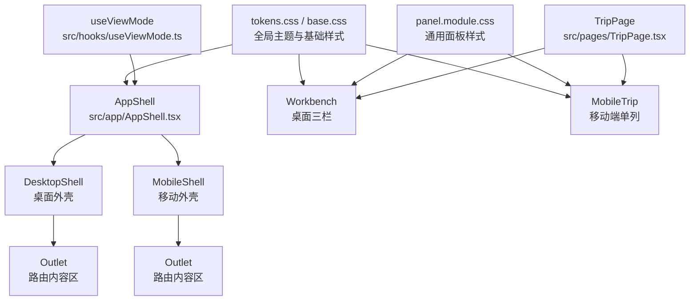
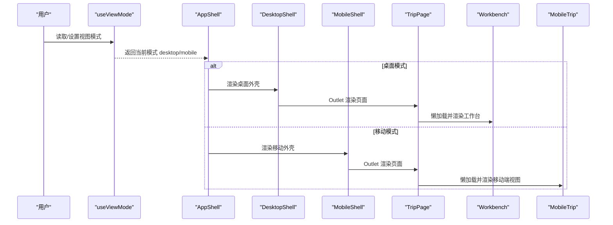
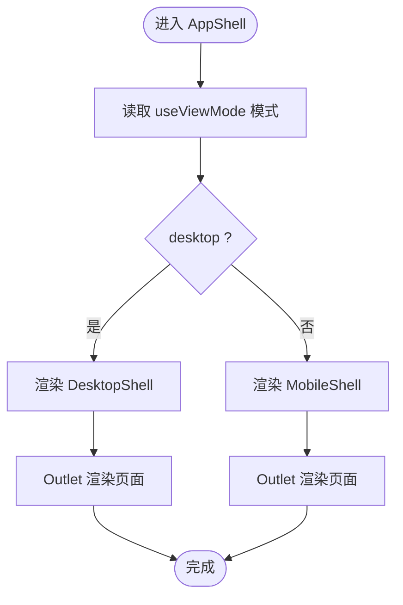
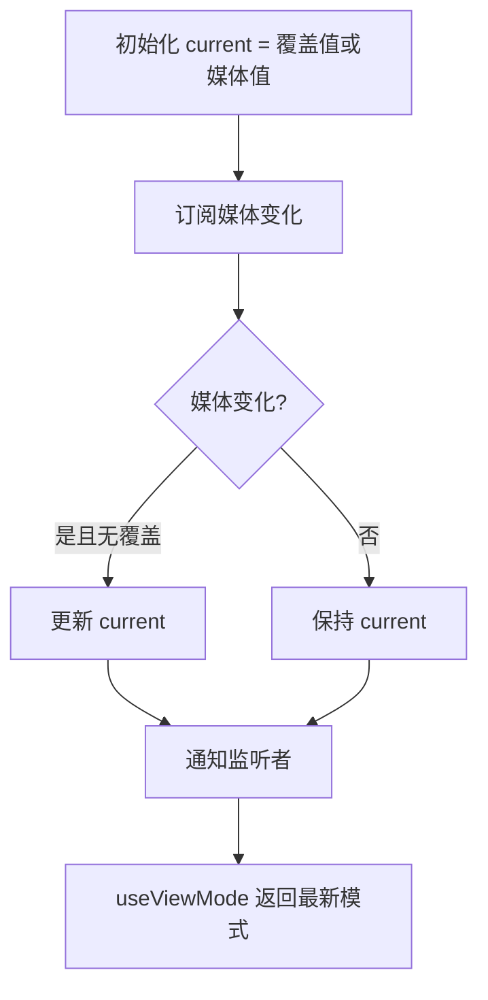
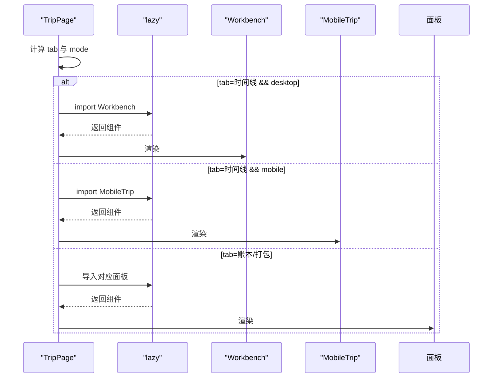
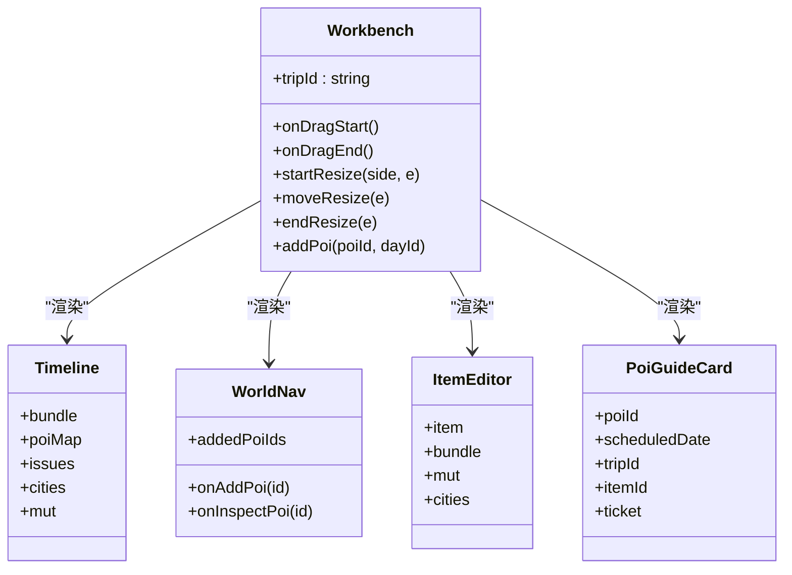
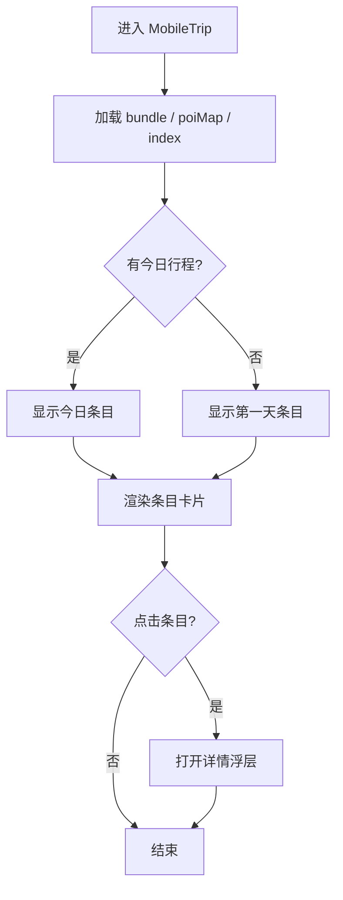
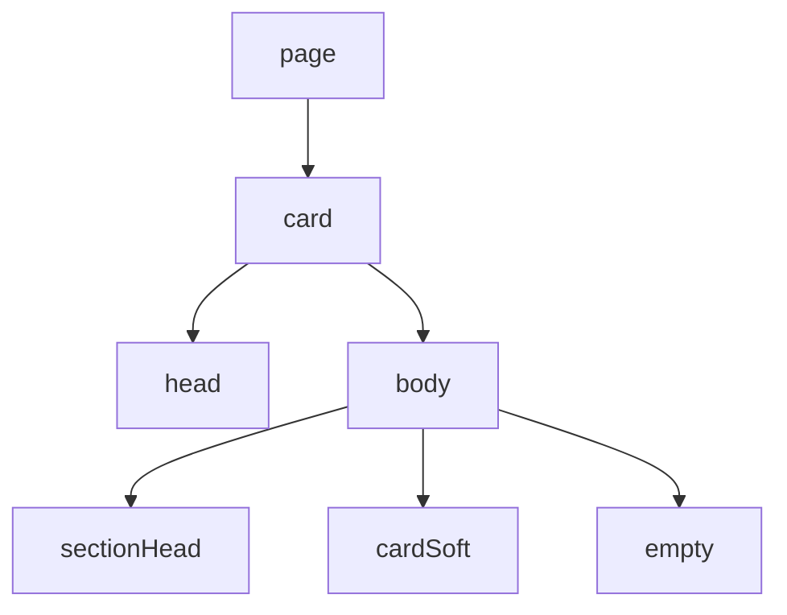
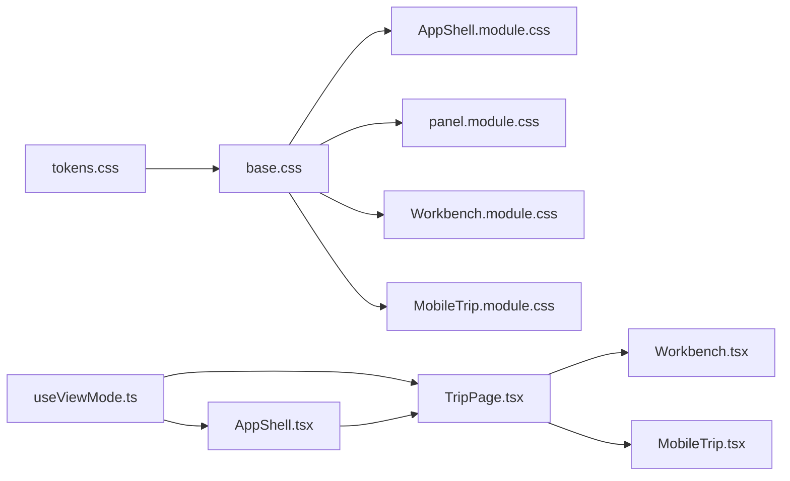

# 布局组件

<cite>
**本文引用的文件**
- [AppShell.tsx](file://src/app/AppShell.tsx)
- [AppShell.module.css](file://src/app/AppShell.module.css)
- [useViewMode.ts](file://src/hooks/useViewMode.ts)
- [TripPage.tsx](file://src/pages/TripPage.tsx)
- [TripPage.module.css](file://src/pages/TripPage.module.css)
- [Workbench.tsx](file://src/features/trip/Workbench.tsx)
- [Workbench.module.css](file://src/features/trip/Workbench.module.css)
- [MobileTrip.tsx](file://src/features/trip/MobileTrip.tsx)
- [MobileTrip.module.css](file://src/features/trip/MobileTrip.module.css)
- [panel.module.css](file://src/ui/panel.module.css)
- [base.css](file://src/ui/base.css)
- [tokens.css](file://src/ui/tokens.css)
</cite>

## 目录
1. [简介](#简介)
2. [项目结构](#项目结构)
3. [核心组件](#核心组件)
4. [架构总览](#架构总览)
5. [详细组件分析](#详细组件分析)
6. [依赖关系分析](#依赖关系分析)
7. [性能考量](#性能考量)
8. [故障排查指南](#故障排查指南)
9. [结论](#结论)
10. [附录：扩展与主题定制](#附录：扩展与主题定制)

## 简介
本文件系统性梳理“玩无一失”应用外壳与布局体系，重点覆盖：
- AppShell 的双端分流设计（桌面三栏 vs 移动端单列）
- 面板组件的样式系统与 CSS Modules 使用方式
- 主题定制机制（CSS 变量驱动）
- 双端适配的实现方案与切换逻辑
- 布局组件的扩展方法与自定义样式指南
- 最佳实践与性能优化建议

## 项目结构
布局相关代码集中在以下位置：
- 应用外壳与路由容器：src/app
- 视图模式选择器：src/hooks
- 页面级布局与标签切换：src/pages
- 桌面端工作台（三栏）：src/features/trip/Workbench.*
- 移动端行程视图（单列）：src/features/trip/MobileTrip.*
- 通用面板样式与基础样式：src/ui

图表来源
- [AppShell.tsx:107-134](file://src/app/AppShell.tsx#L107-L134)
- [useViewMode.ts:39-62](file://src/hooks/useViewMode.ts#L39-L62)
- [TripPage.tsx:41-141](file://src/pages/TripPage.tsx#L41-L141)
- [Workbench.tsx:49-414](file://src/features/trip/Workbench.tsx#L49-L414)
- [MobileTrip.tsx:39-206](file://src/features/trip/MobileTrip.tsx#L39-L206)
- [panel.module.css:1-127](file://src/ui/panel.module.css#L1-L127)
- [tokens.css:1-78](file://src/ui/tokens.css#L1-L78)
- [base.css:1-208](file://src/ui/base.css#L1-L208)

章节来源
- [AppShell.tsx:1-135](file://src/app/AppShell.tsx#L1-L135)
- [useViewMode.ts:1-63](file://src/hooks/useViewMode.ts#L1-L63)
- [TripPage.tsx:1-176](file://src/pages/TripPage.tsx#L1-L176)
- [Workbench.tsx:1-414](file://src/features/trip/Workbench.tsx#L1-L414)
- [MobileTrip.tsx:1-206](file://src/features/trip/MobileTrip.tsx#L1-L206)
- [panel.module.css:1-127](file://src/ui/panel.module.css#L1-L127)
- [base.css:1-208](file://src/ui/base.css#L1-L208)
- [tokens.css:1-78](file://src/ui/tokens.css#L1-L78)

## 核心组件
- AppShell：应用外壳，负责在桌面与移动端两套布局之间进行渲染分流，并承载顶部导航、认证条、存储状态提示等。
- useViewMode：单一真相源的状态管理，基于媒体查询与本地覆盖决定当前视图模式，并提供切换能力。
- TripPage：页面级布局入口，按标签懒加载不同子视图（时间线/账本/打包），并在两端分别挂载 Workbench 或 MobileTrip。
- Workbench：桌面端三栏工作台（世界库、时间线、详情），支持拖拽与手动调整左右栏宽度。
- MobileTrip：移动端单列行程视图，聚焦“今天该干嘛”，提供卡片式条目与详情浮层。
- panel.module.css：通用面板样式（页、卡片、头部、内容区、空态等），被多个面板复用。
- tokens.css / base.css：全局主题 token 与基础样式（字体、颜色、按钮、滚动条、打印等）。

章节来源
- [AppShell.tsx:107-134](file://src/app/AppShell.tsx#L107-L134)
- [useViewMode.ts:39-62](file://src/hooks/useViewMode.ts#L39-L62)
- [TripPage.tsx:41-141](file://src/pages/TripPage.tsx#L41-L141)
- [Workbench.tsx:49-414](file://src/features/trip/Workbench.tsx#L49-L414)
- [MobileTrip.tsx:39-206](file://src/features/trip/MobileTrip.tsx#L39-L206)
- [panel.module.css:1-127](file://src/ui/panel.module.css#L1-L127)
- [tokens.css:1-78](file://src/ui/tokens.css#L1-L78)
- [base.css:1-208](file://src/ui/base.css#L1-L208)

## 架构总览
整体采用“非响应式”的双端分流策略：不是通过媒体查询隐藏/显示同一套 UI，而是根据设备能力与用户覆盖，完整渲染两套布局，仅在数据层与领域层共享。

图表来源
- [useViewMode.ts:39-62](file://src/hooks/useViewMode.ts#L39-L62)
- [AppShell.tsx:107-134](file://src/app/AppShell.tsx#L107-L134)
- [TripPage.tsx:41-141](file://src/pages/TripPage.tsx#L41-L141)
- [Workbench.tsx:49-414](file://src/features/trip/Workbench.tsx#L49-L414)
- [MobileTrip.tsx:39-206](file://src/features/trip/MobileTrip.tsx#L39-L206)

## 详细组件分析

### AppShell：应用外壳与双端分流
- 职责
  - 根据 useViewMode 决定渲染 DesktopShell 或 MobileShell。
  - 处理深链加入协作的弹窗逻辑（token 参数）。
  - 桌面壳包含品牌、导航、存储状态提示、认证条与“切到随身模式”按钮；移动壳包含认证条、“切到作战台”按钮与底部 Tab。
- 关键点
  - 使用 Outlet 作为路由内容区，使页面级布局可自由替换。
  - 通过 useViewMode 的 setMode 实现双向切换，保证状态一致性。

图表来源
- [AppShell.tsx:107-134](file://src/app/AppShell.tsx#L107-L134)
- [AppShell.module.css:1-179](file://src/app/AppShell.module.css#L1-L179)

章节来源
- [AppShell.tsx:1-135](file://src/app/AppShell.tsx#L1-L135)
- [AppShell.module.css:1-179](file://src/app/AppShell.module.css#L1-L179)

### useViewMode：视图模式单一真相源
- 职责
  - 基于媒体查询 (min-width: 1024px and pointer: fine) 判断默认模式。
  - 支持 localStorage 覆盖，持久化用户偏好。
  - 暴露 setMode 供任意组件触发切换，并通过 useSyncExternalStore 同步更新所有消费者。
- 关键点
  - 媒体变化时仅在未覆盖的情况下跟随系统。
  - 避免多份 state 导致“切不回去”的问题。

图表来源
- [useViewMode.ts:17-62](file://src/hooks/useViewMode.ts#L17-L62)

章节来源
- [useViewMode.ts:1-63](file://src/hooks/useViewMode.ts#L1-L63)

### TripPage：页面级布局与懒加载
- 职责
  - 提供“时间线/账本/打包”三个标签，按需懒加载对应组件。
  - 根据 useViewMode 在桌面端渲染 Workbench，移动端渲染 MobileTrip。
  - 提供 Markdown 预览与导出功能。
- 关键点
  - 使用 Suspense + lazy 降低首屏体积。
  - 将工作区 body 设为 block，确保在全宽容器中正确撑满。

图表来源
- [TripPage.tsx:20-31](file://src/pages/TripPage.tsx#L20-L31)
- [TripPage.tsx:131-141](file://src/pages/TripPage.tsx#L131-L141)

章节来源
- [TripPage.tsx:1-176](file://src/pages/TripPage.tsx#L1-L176)
- [TripPage.module.css:1-178](file://src/pages/TripPage.module.css#L1-L178)

### Workbench：桌面端三栏工作台
- 职责
  - 左栏：世界库导航与景点导览入口。
  - 中栏：时间线（日程条目列表）。
  - 右栏：详情（景点导览卡、条目编辑、行程速览）。
  - 支持拖拽添加/重排条目，以及手动调整左右栏宽度。
- 关键点
  - 使用 CSS Grid 定义三栏，列宽由 CSS 变量 --left-w / --right-w 控制。
  - 分隔条绝对定位，不占 grid 轨道，拖动时实时更新变量。
  - 媒体查询渐进调整两侧栏宽度，保障中间时间线的可读性。

图表来源
- [Workbench.tsx:49-414](file://src/features/trip/Workbench.tsx#L49-L414)
- [Workbench.module.css:1-305](file://src/features/trip/Workbench.module.css#L1-L305)

章节来源
- [Workbench.tsx:1-414](file://src/features/trip/Workbench.tsx#L1-L414)
- [Workbench.module.css:1-305](file://src/features/trip/Workbench.module.css#L1-L305)

### MobileTrip：移动端单列行程视图
- 职责
  - 展示当天安排，突出闭馆提醒与已订票信息。
  - 以卡片形式呈现条目，点击打开详情浮层（景点导览卡）。
  - 支持“今天”快捷视图。
- 关键点
  - 顶部日期芯片横向滚动，选中高亮。
  - 详情浮层全屏 sheet，便于阅读与操作。

图表来源
- [MobileTrip.tsx:39-206](file://src/features/trip/MobileTrip.tsx#L39-L206)
- [MobileTrip.module.css:1-296](file://src/features/trip/MobileTrip.module.css#L1-L296)

章节来源
- [MobileTrip.tsx:1-206](file://src/features/trip/MobileTrip.tsx#L1-L206)
- [MobileTrip.module.css:1-296](file://src/features/trip/MobileTrip.module.css#L1-L296)

### 面板样式系统（panel.module.css）
- 设计原则
  - 仅定义“外壳词汇”：page、card、head、body、sectionHead、cardSoft、empty。
  - 各面板内部布局保留在各自模块中，保证关注点分离。
- 关键样式
  - page：全高、可滚动、统一内边距。
  - card：居中卡片，最大宽度限制，超宽屏放宽，移动端去边框阴影。
  - head/body：头部标题+副标题+操作区；内容区可滚动，sticky 头无缝贴顶。
  - sectionHead：带品牌菱形标记的小节头。
  - empty：空态占位。

图表来源
- [panel.module.css:1-127](file://src/ui/panel.module.css#L1-L127)

章节来源
- [panel.module.css:1-127](file://src/ui/panel.module.css#L1-L127)

## 依赖关系分析
- 视图模式依赖
  - AppShell 依赖 useViewMode 决定渲染哪套外壳。
  - TripPage 依赖 useViewMode 决定渲染 Workbench 还是 MobileTrip。
- 样式依赖
  - 所有组件均通过 CSS 变量引用 tokens.css 中的主题 token。
  - base.css 引入 tokens.css，提供全局基础样式与通用组件样式。
  - 各模块 CSS Modules 仅作用于自身组件，避免样式污染。
- 数据与交互
  - Workbench 使用 dnd-kit 进行拖拽，结合领域层的排序与插入算法更新数据。
  - MobileTrip 通过查询 hook 获取行程与 POI 数据，渲染卡片与详情。

图表来源
- [tokens.css:1-78](file://src/ui/tokens.css#L1-L78)
- [base.css:1-208](file://src/ui/base.css#L1-L208)
- [AppShell.module.css:1-179](file://src/app/AppShell.module.css#L1-L179)
- [panel.module.css:1-127](file://src/ui/panel.module.css#L1-L127)
- [Workbench.module.css:1-305](file://src/features/trip/Workbench.module.css#L1-L305)
- [MobileTrip.module.css:1-296](file://src/features/trip/MobileTrip.module.css#L1-L296)
- [useViewMode.ts:39-62](file://src/hooks/useViewMode.ts#L39-L62)
- [AppShell.tsx:107-134](file://src/app/AppShell.tsx#L107-L134)
- [TripPage.tsx:41-141](file://src/pages/TripPage.tsx#L41-L141)

章节来源
- [tokens.css:1-78](file://src/ui/tokens.css#L1-L78)
- [base.css:1-208](file://src/ui/base.css#L1-L208)
- [useViewMode.ts:1-63](file://src/hooks/useViewMode.ts#L1-L63)
- [AppShell.tsx:1-135](file://src/app/AppShell.tsx#L1-L135)
- [TripPage.tsx:1-176](file://src/pages/TripPage.tsx#L1-L176)

## 性能考量
- 双端分流减少不必要渲染：PC 不加载移动壳，移动不加载工作台，降低包体与运行时开销。
- 懒加载：TripPage 对 Workbench、MobileTrip、LedgerPanel、PackingPanel 使用 lazy + Suspense，按需加载。
- 网格与变量：Workbench 通过 CSS 变量控制列宽，避免频繁重排；分隔条拖动时局部更新变量。
- 滚动优化：多处使用 overflow-y: auto 与 overscroll-behavior: contain，提升滚动体验。
- 主题与样式：集中 token 管理，减少重复样式与计算。

[本节为通用指导，无需特定文件引用]

## 故障排查指南
- 无法切换到另一端
  - 检查 useViewMode 的 localStorage 覆盖是否残留，必要时清除覆盖键后重试。
  - 确认媒体查询条件是否符合预期（例如指针类型与宽度）。
- 三栏宽度异常
  - 检查工作台的 grid 容器是否设置了正确的 --left-w / --right-w。
  - 确认分隔条事件绑定未被阻止冒泡或捕获。
- 移动端详情浮层遮挡
  - 检查 sheet 的 z-index 与 inset 是否正确，避免与其他固定层冲突。
- 面板样式错乱
  - 确认使用了 panel.module.css 的约定类名（page/card/head/body）。
  - 检查 CSS Modules 命名空间是否被正确引入。

章节来源
- [useViewMode.ts:17-62](file://src/hooks/useViewMode.ts#L17-L62)
- [Workbench.module.css:46-91](file://src/features/trip/Workbench.module.css#L46-L91)
- [MobileTrip.module.css:196-219](file://src/features/trip/MobileTrip.module.css#L196-L219)
- [panel.module.css:1-127](file://src/ui/panel.module.css#L1-L127)

## 结论
本项目采用“非响应式”的双端分流架构，通过 AppShell 与 useViewMode 实现清晰的布局边界与状态管理；桌面端三栏工作台提供高效规划能力，移动端单列视图专注“在路上”的使用场景。统一的 CSS 变量主题与模块化样式保证了可扩展性与可维护性。配合懒加载与合理的滚动策略，整体性能与用户体验良好。

[本节为总结，无需特定文件引用]

## 附录：扩展与主题定制
- 扩展方法
  - 新增页面：在 pages 下创建新页面，并在路由中注册；如需两端不同布局，可在 TripPage 或 AppShell 中增加分支。
  - 新增面板：复用 panel.module.css 的 page/card/head/body 约定，内部布局放在独立模块中。
  - 新增视图模式：扩展 useViewMode 的判断逻辑与覆盖键，确保所有消费者通过 useSyncExternalStore 同步。
- 自定义样式指南
  - 优先使用 tokens.css 中的变量（颜色、字体、圆角、阴影、布局常量），避免硬编码。
  - 使用 CSS Modules 隔离样式，避免全局污染。
  - 在 panel.module.css 中只定义“外壳词汇”，具体细节由各面板自行实现。
  - 媒体查询用于渐进增强（如超宽屏放宽卡片宽度），而非隐藏/显示整块 UI。
- 主题定制
  - 修改 tokens.css 中的 :root 变量即可全局换肤。
  - 品牌色、文字层级、表面层级、描边、语义色均可统一调整。
  - 布局常量（如 --header-h、--left-w、--right-w）可影响整体布局比例。

章节来源
- [tokens.css:1-78](file://src/ui/tokens.css#L1-L78)
- [panel.module.css:1-127](file://src/ui/panel.module.css#L1-L127)
- [base.css:1-208](file://src/ui/base.css#L1-L208)
- [useViewMode.ts:17-62](file://src/hooks/useViewMode.ts#L17-L62)