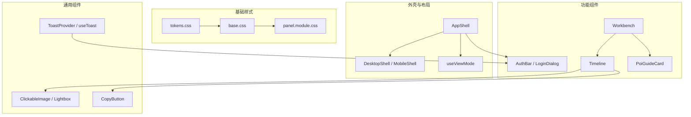
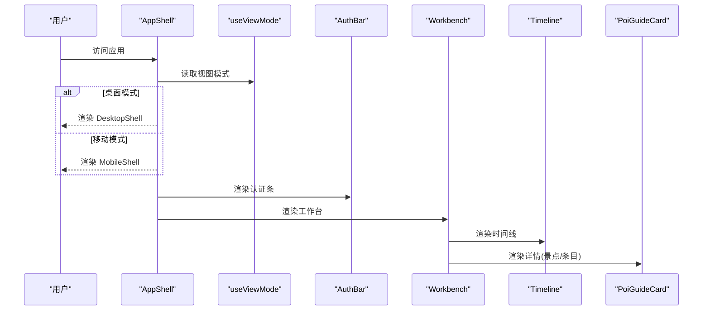
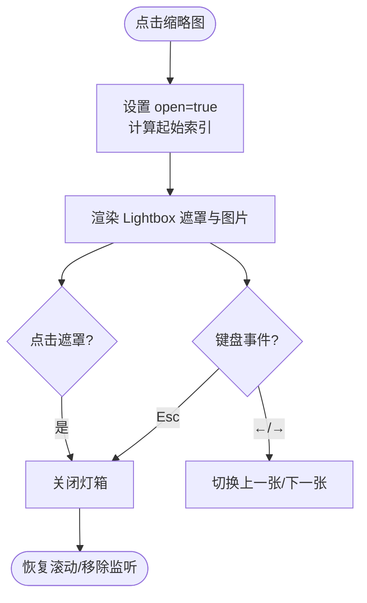
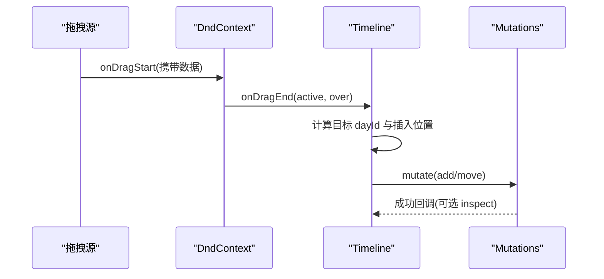
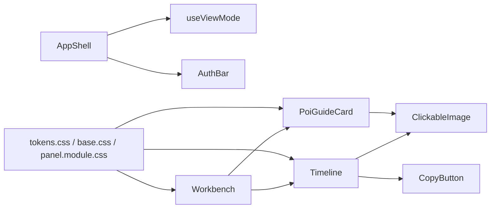

# 用户界面组件

<cite>
**本文引用的文件**
- [AppShell.tsx](file://src/app/AppShell.tsx)
- [AppShell.module.css](file://src/app/AppShell.module.css)
- [useViewMode.ts](file://src/hooks/useViewMode.ts)
- [base.css](file://src/ui/base.css)
- [tokens.css](file://src/ui/tokens.css)
- [panel.module.css](file://src/ui/panel.module.css)
- [toast.tsx](file://src/ui/toast.tsx)
- [ClickableImage.tsx](file://src/components/ClickableImage.tsx)
- [ClickableImage.module.css](file://src/components/ClickableImage.module.css)
- [CopyButton.tsx](file://src/components/CopyButton.tsx)
- [AuthBar.tsx](file://src/features/auth/AuthBar.tsx)
- [LoginDialog.tsx](file://src/features/auth/LoginDialog.tsx)
- [Workbench.tsx](file://src/features/trip/Workbench.tsx)
- [Timeline.tsx](file://src/features/trip/Timeline.tsx)
- [PoiGuideCard.tsx](file://src/features/world/PoiGuideCard.tsx)
</cite>

## 目录
1. [简介](#简介)
2. [项目结构](#项目结构)
3. [核心组件](#核心组件)
4. [架构总览](#架构总览)
5. [详细组件分析](#详细组件分析)
6. [依赖关系分析](#依赖关系分析)
7. [性能考量](#性能考量)
8. [故障排查指南](#故障排查指南)
9. [结论](#结论)
10. [附录](#附录)

## 简介
本文件系统化梳理“玩无一失”应用中的可复用 UI 组件与样式体系，覆盖设计原则、组件层次、样式策略、响应式实现、Props 接口、事件处理、状态管理、主题定制、使用示例、最佳实践与性能优化。重点说明 CSS Modules 的使用方式与样式组织方法，帮助读者在不深入源码的情况下也能快速理解并正确使用这些组件。

## 项目结构
- 应用外壳与路由：通过 AppShell 在桌面端与移动端之间分流渲染，配合 useViewMode 统一维护视图模式。
- 基础样式与设计令牌：tokens.css 定义全局设计变量；base.css 提供通用元素与小组件样式；panel.module.css 提供面板卡片等共享外壳。
- 通用组件：图片灯箱（ClickableImage/Lightbox）、复制按钮（CopyButton）、Toast 提示（ToastProvider/useToast）。
- 功能区域：认证条（AuthBar）与登录对话框（LoginDialog）；工作台（Workbench）与时间线（Timeline）；景点导览卡（PoiGuideCard）。

图表来源
- [AppShell.tsx:1-135](file://src/app/AppShell.tsx#L1-L135)
- [useViewMode.ts:1-63](file://src/hooks/useViewMode.ts#L1-L63)
- [tokens.css:1-78](file://src/ui/tokens.css#L1-L78)
- [base.css:1-208](file://src/ui/base.css#L1-L208)
- [panel.module.css:1-127](file://src/ui/panel.module.css#L1-L127)
- [ClickableImage.tsx:1-147](file://src/components/ClickableImage.tsx#L1-L147)
- [CopyButton.tsx:1-68](file://src/components/CopyButton.tsx#L1-L68)
- [toast.tsx:1-82](file://src/ui/toast.tsx#L1-L82)
- [AuthBar.tsx:1-57](file://src/features/auth/AuthBar.tsx#L1-L57)
- [LoginDialog.tsx:1-159](file://src/features/auth/LoginDialog.tsx#L1-L159)
- [Workbench.tsx:1-414](file://src/features/trip/Workbench.tsx#L1-L414)
- [Timeline.tsx:1-702](file://src/features/trip/Timeline.tsx#L1-L702)
- [PoiGuideCard.tsx:1-309](file://src/features/world/PoiGuideCard.tsx#L1-L309)

章节来源
- [AppShell.tsx:1-135](file://src/app/AppShell.tsx#L1-L135)
- [useViewMode.ts:1-63](file://src/hooks/useViewMode.ts#L1-L63)
- [tokens.css:1-78](file://src/ui/tokens.css#L1-L78)
- [base.css:1-208](file://src/ui/base.css#L1-L208)
- [panel.module.css:1-127](file://src/ui/panel.module.css#L1-L127)

## 核心组件
- 图片灯箱（ClickableImage / Lightbox）
  - 职责：缩略图点击后全屏预览，支持多图画廊、键盘导航、无障碍属性与 Portal 挂载。
  - Props：src、alt、className、caption、credit、license、page、gallery。
  - 事件：点击打开、Esc 关闭、左右箭头切换。
  - 状态：open、当前索引 i。
  - 样式：CSS Modules 隔离类名，深色遮罩、动画、计数器。
  - 参考路径：[ClickableImage.tsx:1-147](file://src/components/ClickableImage.tsx#L1-L147)、[ClickableImage.module.css:1-123](file://src/components/ClickableImage.module.css#L1-L123)

- 复制按钮（CopyButton）
  - 职责：一键复制文本到剪贴板，提供“已复制”反馈。
  - Props：text、label、copiedLabel、asSpan、className、icon。
  - 事件：click/keyboard 触发复制。
  - 状态：copied。
  - 样式：CSS Modules 类名，可选 span 模式避免嵌套 button。
  - 参考路径：[CopyButton.tsx:1-68](file://src/components/CopyButton.tsx#L1-L68)

- Toast 提示（ToastProvider / useToast）
  - 职责：全局提示消息，自动消失、可点击关闭，语义化 aria-live。
  - API：useToast() 返回函数，调用弹出不同 kind 的提示。
  - 状态：items、定时器。
  - 样式：CSS Modules，跟随 tokens 语义色。
  - 参考路径：[toast.tsx:1-82](file://src/ui/toast.tsx#L1-L82)

- 认证条与登录对话框（AuthBar / LoginDialog）
  - 职责：展示登录态、登出、修改显示名；弹窗支持邮箱密码登录/注册、匿名体验、魔法链接。
  - 事件：打开/关闭弹窗、提交表单、退出登录。
  - 状态：loading、user/profile、弹窗开关。
  - 样式：CSS Modules，遵循 base.css 的 field/btn 风格。
  - 参考路径：[AuthBar.tsx:1-57](file://src/features/auth/AuthBar.tsx#L1-L57)、[LoginDialog.tsx:1-159](file://src/features/auth/LoginDialog.tsx#L1-L159)

- 工作台与时间线（Workbench / Timeline）
  - 职责：三栏工作台（世界库/时间线/详情），拖拽排序、跨天移动、乐观更新；时间线按天组织条目，支持地图视图懒加载。
  - 事件：拖拽开始/结束、添加条目、删除、投票、选择日期等。
  - 状态：选中项、拖拽数据、issues、视图模式。
  - 样式：CSS Modules，结合 panel.module.css 卡片外壳。
  - 参考路径：[Workbench.tsx:1-414](file://src/features/trip/Workbench.tsx#L1-L414)、[Timeline.tsx:1-702](file://src/features/trip/Timeline.tsx#L1-L702)

- 景点导览卡（PoiGuideCard）
  - 职责：展示景点信息、闭馆日、预约提示、推荐路线、贴士等；支持加入行程与票务编辑。
  - 事件：点击大图预览、加入行程、跳转官网。
  - 状态：isLoading、closedToday、票证信息。
  - 样式：CSS Modules，结合 base.css 标签与按钮。
  - 参考路径：[PoiGuideCard.tsx:1-309](file://src/features/world/PoiGuideCard.tsx#L1-L309)

章节来源
- [ClickableImage.tsx:1-147](file://src/components/ClickableImage.tsx#L1-L147)
- [CopyButton.tsx:1-68](file://src/components/CopyButton.tsx#L1-L68)
- [toast.tsx:1-82](file://src/ui/toast.tsx#L1-L82)
- [AuthBar.tsx:1-57](file://src/features/auth/AuthBar.tsx#L1-L57)
- [LoginDialog.tsx:1-159](file://src/features/auth/LoginDialog.tsx#L1-L159)
- [Workbench.tsx:1-414](file://src/features/trip/Workbench.tsx#L1-L414)
- [Timeline.tsx:1-702](file://src/features/trip/Timeline.tsx#L1-L702)
- [PoiGuideCard.tsx:1-309](file://src/features/world/PoiGuideCard.tsx#L1-L309)

## 架构总览
应用采用“外壳 + 功能模块 + 通用组件 + 基础样式”的分层组织：
- 外壳层：AppShell 根据 useViewMode 决定渲染 DesktopShell 或 MobileShell，统一承载路由 Outlet 与顶部导航。
- 功能层：Workbench 聚合 WorldNav、Timeline、右侧详情区；Timeline 负责条目编辑与拖拽；PoiGuideCard 提供景点详情。
- 通用层：ClickableImage、CopyButton、Toast 提供跨页面复用的交互能力。
- 样式层：tokens.css 集中设计令牌；base.css 提供全局与通用小组件；各模块使用 CSS Modules 隔离样式。

图表来源
- [AppShell.tsx:1-135](file://src/app/AppShell.tsx#L1-L135)
- [useViewMode.ts:1-63](file://src/hooks/useViewMode.ts#L1-L63)
- [Workbench.tsx:1-414](file://src/features/trip/Workbench.tsx#L1-L414)
- [Timeline.tsx:1-702](file://src/features/trip/Timeline.tsx#L1-L702)
- [PoiGuideCard.tsx:1-309](file://src/features/world/PoiGuideCard.tsx#L1-L309)

## 详细组件分析

### 图片灯箱（ClickableImage / Lightbox）
- 设计要点
  - 自包含：缩略图与灯箱在同一组件内管理 open 状态，也可外部受控使用 Lightbox。
  - 多图画廊：通过 gallery 参数构建图片列表，支持左右切换与计数。
  - 无障碍：role="dialog"、aria-modal、键盘 Esc 关闭、左右箭头导航。
  - 性能：图片 lazy 加载；Portal 挂载至 body，避免层级与滚动问题。
- 关键流程

图表来源
- [ClickableImage.tsx:1-147](file://src/components/ClickableImage.tsx#L1-L147)
- [ClickableImage.module.css:1-123](file://src/components/ClickableImage.module.css#L1-L123)

章节来源
- [ClickableImage.tsx:1-147](file://src/components/ClickableImage.tsx#L1-L147)
- [ClickableImage.module.css:1-123](file://src/components/ClickableImage.module.css#L1-L123)

### 复制按钮（CopyButton）
- 设计要点
  - 双形态：button 与 span 两种渲染模式，适配不同上下文。
  - 反馈：复制成功后短暂显示“已复制”，超时自动恢复。
  - 容错：剪贴板不可用时静默失败，不阻断交互。
- 使用建议
  - 在移动端卡片中优先使用 asSpan 避免非法 HTML 嵌套。
  - 为复杂场景传入自定义 icon 提升识别度。

章节来源
- [CopyButton.tsx:1-68](file://src/components/CopyButton.tsx#L1-L68)

### Toast 提示（ToastProvider / useToast）
- 设计要点
  - 全局单例：通过 Context 提供 useToast 钩子，任意组件均可弹出提示。
  - 类型化：success/error/warn/info 四种类型，对应图标与样式。
  - 生命周期：自动 3.2s 消失，点击立即关闭，清理定时器。
- 使用建议
  - 将 ToastProvider 置于应用顶层，确保全局可用。
  - 对关键操作（保存、同步、错误）统一使用 Toast 反馈。

章节来源
- [toast.tsx:1-82](file://src/ui/toast.tsx#L1-L82)

### 认证条与登录对话框（AuthBar / LoginDialog）
- 设计要点
  - 条件渲染：未配置云端时整体不渲染，零干扰本地模式。
  - 状态驱动：根据 session 与 profile 显示用户名、登出入口。
  - 弹窗交互：支持登录/注册切换、匿名体验、魔法链接；Esc 关闭。
- 使用建议
  - 在 AppShell 顶栏或移动端顶部统一放置 AuthBar。
  - 登录成功后可通过 Toast 提示“登录成功”。

章节来源
- [AuthBar.tsx:1-57](file://src/features/auth/AuthBar.tsx#L1-L57)
- [LoginDialog.tsx:1-159](file://src/features/auth/LoginDialog.tsx#L1-L159)

### 工作台与时间线（Workbench / Timeline）
- 设计要点
  - 三栏布局：左栏世界库、中栏时间线、右栏详情；支持分隔条手动调宽。
  - 拖拽编排：DndContext 统一管理，跨源拖入同一 droppable，落位后计算 rank。
  - 乐观更新：所有写操作走 mutations，松手即生效，不等网络。
  - 体检提示：sanityCheck 结果就地展示冲突与提醒。
- 关键流程（拖拽落位）

图表来源
- [Workbench.tsx:1-414](file://src/features/trip/Workbench.tsx#L1-L414)
- [Timeline.tsx:1-702](file://src/features/trip/Timeline.tsx#L1-L702)

章节来源
- [Workbench.tsx:1-414](file://src/features/trip/Workbench.tsx#L1-L414)
- [Timeline.tsx:1-702](file://src/features/trip/Timeline.tsx#L1-L702)

### 景点导览卡（PoiGuideCard）
- 设计要点
  - 信息分层：头部大图与标题、标签、建议时长、闭馆日、预约提示、推荐路线、亮点、设施、贴士。
  - 动态警示：票价/开放/预约过期时给出警告横幅；若选定日期闭馆则顶部提示。
  - 集成能力：支持加入行程、在卡片内编辑票务。
- 使用建议
  - 在右栏详情区或独立页面复用；结合 ClickableImage 实现大图预览。

章节来源
- [PoiGuideCard.tsx:1-309](file://src/features/world/PoiGuideCard.tsx#L1-L309)

## 依赖关系分析
- 组件耦合
  - AppShell 依赖 useViewMode 控制双端渲染；依赖 AuthBar 与路由 Outlet。
  - Workbench 依赖 Timeline、WorldNav、PoiGuideCard 以及拖拽库。
  - Timeline 依赖 ClickableImage、CopyButton、MemberAvatar 等通用组件。
  - PoiGuideCard 依赖 ClickableImage 与票务编辑器。
- 样式依赖
  - 所有组件通过 CSS Modules 隔离类名，同时引用 tokens.css 的设计变量与 base.css 的通用样式。
  - panel.module.css 提供卡片外壳，被多个面板复用。

图表来源
- [AppShell.tsx:1-135](file://src/app/AppShell.tsx#L1-L135)
- [useViewMode.ts:1-63](file://src/hooks/useViewMode.ts#L1-L63)
- [Workbench.tsx:1-414](file://src/features/trip/Workbench.tsx#L1-L414)
- [Timeline.tsx:1-702](file://src/features/trip/Timeline.tsx#L1-L702)
- [PoiGuideCard.tsx:1-309](file://src/features/world/PoiGuideCard.tsx#L1-L309)
- [tokens.css:1-78](file://src/ui/tokens.css#L1-L78)
- [base.css:1-208](file://src/ui/base.css#L1-L208)
- [panel.module.css:1-127](file://src/ui/panel.module.css#L1-L127)

章节来源
- [AppShell.tsx:1-135](file://src/app/AppShell.tsx#L1-L135)
- [Workbench.tsx:1-414](file://src/features/trip/Workbench.tsx#L1-L414)
- [Timeline.tsx:1-702](file://src/features/trip/Timeline.tsx#L1-L702)
- [PoiGuideCard.tsx:1-309](file://src/features/world/PoiGuideCard.tsx#L1-L309)
- [tokens.css:1-78](file://src/ui/tokens.css#L1-L78)
- [base.css:1-208](file://src/ui/base.css#L1-L208)
- [panel.module.css:1-127](file://src/ui/panel.module.css#L1-L127)

## 性能考量
- 图片与媒体
  - 使用 lazy 加载与 Portal 减少首屏压力；大图预览按需渲染。
- 拖拽与重排
  - 使用 DnD 的 closestCorners 与 SortableContext 提高定位与排序性能；仅对必要节点启用拖拽。
- 视图切换
  - 地图视图懒加载（Suspense），仅在切换到地图时下载相关代码块。
- 状态与渲染
  - 使用 useMemo 缓存派生数据（如 poiMap、issues）；避免不必要的重渲染。
- 样式与主题
  - 通过 tokens.css 变量驱动主题，避免硬编码颜色；CSS Modules 隔离样式，降低冲突与打包体积。

## 故障排查指南
- 灯箱无法关闭
  - 检查是否监听了 Esc 事件与遮罩点击；确认 createPortal 挂载到 body。
  - 参考路径：[ClickableImage.tsx:72-85](file://src/components/ClickableImage.tsx#L72-L85)
- 复制失败无反馈
  - 剪贴板不可用时会静默失败；可在上层捕获并提示；确认浏览器权限。
  - 参考路径：[CopyButton.tsx:25-34](file://src/components/CopyButton.tsx#L25-L34)
- Toast 不出现
  - 确认 ToastProvider 位于应用顶层；useToast 调用是否正确。
  - 参考路径：[toast.tsx:42-82](file://src/ui/toast.tsx#L42-L82)
- 登录弹窗无法关闭
  - 检查 Esc 监听与 overlay 点击事件；确认 onClose 正确传递。
  - 参考路径：[LoginDialog.tsx:27-33](file://src/features/auth/LoginDialog.tsx#L27-L33)
- 拖拽顺序异常
  - 检查 active/over 数据是否携带正确的 kind、itemId、dayId；确认 rank 计算逻辑。
  - 参考路径：[Workbench.tsx:170-222](file://src/features/trip/Workbench.tsx#L170-L222)

章节来源
- [ClickableImage.tsx:72-85](file://src/components/ClickableImage.tsx#L72-L85)
- [CopyButton.tsx:25-34](file://src/components/CopyButton.tsx#L25-L34)
- [toast.tsx:42-82](file://src/ui/toast.tsx#L42-L82)
- [LoginDialog.tsx:27-33](file://src/features/auth/LoginDialog.tsx#L27-L33)
- [Workbench.tsx:170-222](file://src/features/trip/Workbench.tsx#L170-L222)

## 结论
本项目的 UI 组件体系以“高内聚、低耦合”为原则，通过 CSS Modules 与 tokens 实现样式隔离与主题化；通过通用组件（灯箱、复制、Toast）提升复用性；通过 Workbench/Timeline 的组合实现复杂的行程编排。双端分流由 useViewMode 统一管理，保证一致的交互体验。建议在新增组件时遵循现有约定：使用 CSS Modules、基于 tokens 定制主题、提供清晰的 Props 与事件、关注无障碍与性能。

## 附录

### 样式策略与主题定制
- 设计令牌（tokens.css）
  - 品牌色、文字层级、表面层级、描边、状态色、字体、圆角、阴影、布局常量、创意纹理等全部以 CSS 变量形式暴露。
  - 主题切换：通过覆盖 :root 变量即可全局换肤，组件无需改动。
  - 参考路径：[tokens.css:1-78](file://src/ui/tokens.css#L1-L78)
- 基础样式（base.css）
  - 全局重置、排版、通用按钮/输入框/标签/滚动条样式；打印样式适配导出 PDF。
  - 参考路径：[base.css:1-208](file://src/ui/base.css#L1-L208)
- 面板外壳（panel.module.css）
  - 统一的页面容器、卡片、头部条、小节头、空态样式；移动端适配。
  - 参考路径：[panel.module.css:1-127](file://src/ui/panel.module.css#L1-L127)

### 响应式设计实现
- 双端分流而非纯响应式：AppShell 依据 useViewMode 决定渲染 DesktopShell 或 MobileShell，两套布局各自优化。
- 视图模式存储：localStorage 记录用户覆盖；媒体查询变化时仅在未覆盖情况下跟随系统。
- 参考路径：
  - [AppShell.tsx:107-135](file://src/app/AppShell.tsx#L107-L135)
  - [useViewMode.ts:1-63](file://src/hooks/useViewMode.ts#L1-L63)

### 组件使用示例（路径指引）
- 图片灯箱
  - 缩略图点击打开灯箱：[ClickableImage.tsx:14-58](file://src/components/ClickableImage.tsx#L14-L58)
  - 外部受控使用 Lightbox：[ClickableImage.tsx:60-147](file://src/components/ClickableImage.tsx#L60-L147)
- 复制按钮
  - 基本用法与反馈：[CopyButton.tsx:15-68](file://src/components/CopyButton.tsx#L15-L68)
- Toast 提示
  - 全局 Provider 与 useToast：[toast.tsx:28-82](file://src/ui/toast.tsx#L28-L82)
- 认证条与登录
  - 认证条渲染与状态：[AuthBar.tsx:18-57](file://src/features/auth/AuthBar.tsx#L18-L57)
  - 登录弹窗交互：[LoginDialog.tsx:18-159](file://src/features/auth/LoginDialog.tsx#L18-L159)
- 工作台与时间线
  - 拖拽与落位：[Workbench.tsx:170-222](file://src/features/trip/Workbench.tsx#L170-L222)
  - 时间线视图与地图切换：[Timeline.tsx:558-698](file://src/features/trip/Timeline.tsx#L558-L698)
- 景点导览卡
  - 景点信息与加入行程：[PoiGuideCard.tsx:40-158](file://src/features/world/PoiGuideCard.tsx#L40-L158)
  - 卡片封装与票务编辑：[PoiGuideCard.tsx:260-309](file://src/features/world/PoiGuideCard.tsx#L260-L309)