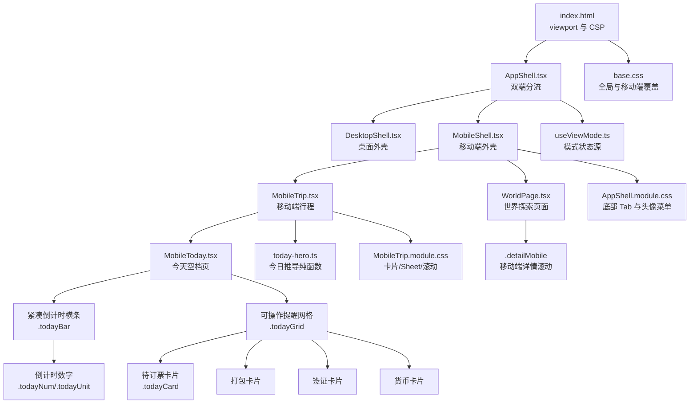
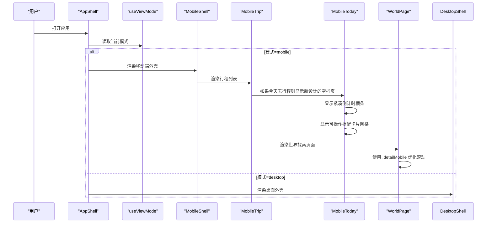
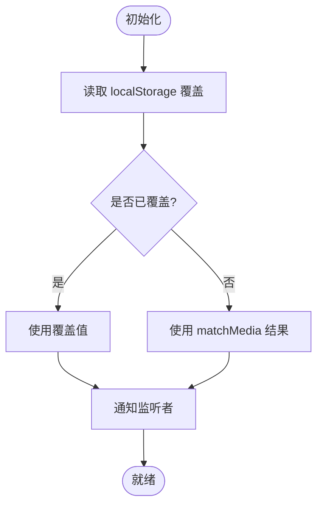
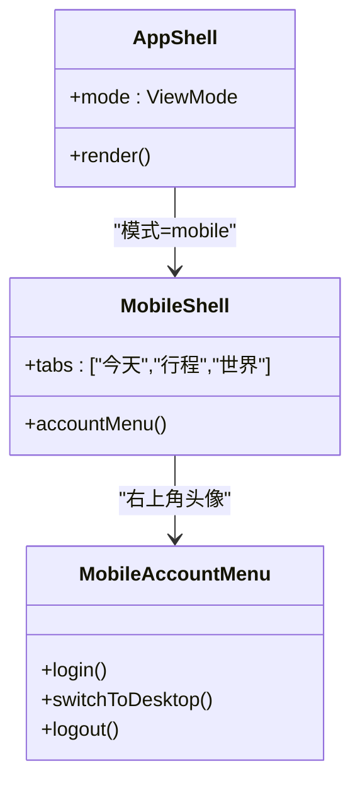
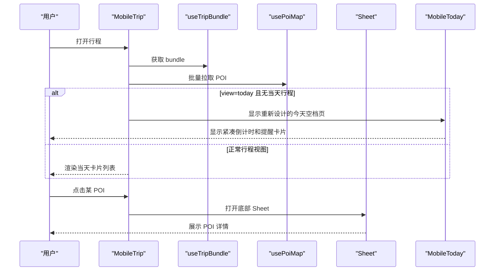
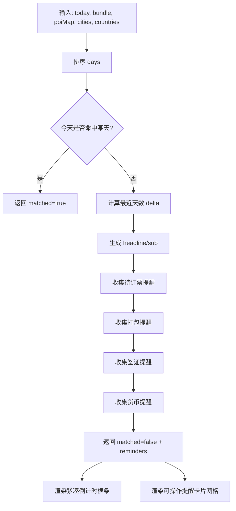
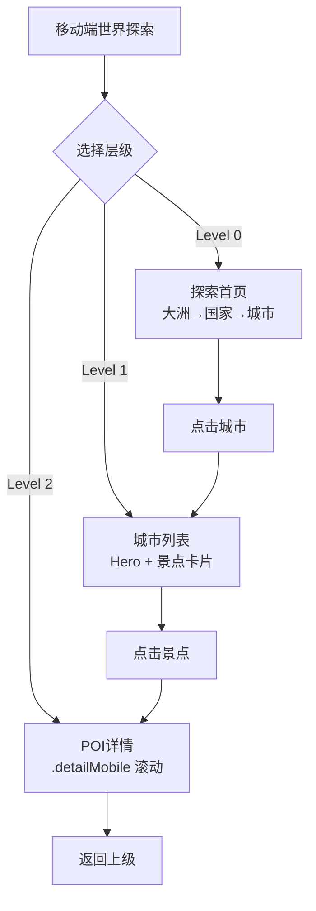
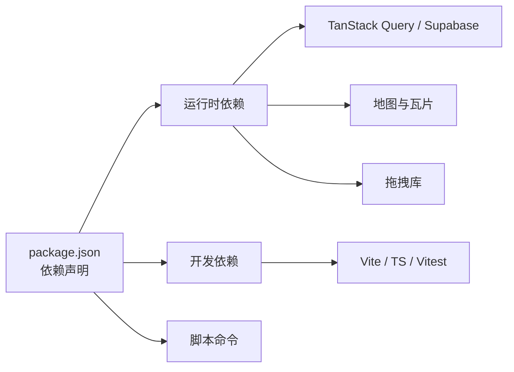

</think>

基于我对代码的分析，现在我将更新移动端优化文档以反映"今天"标签页的完全重新设计。

# 移动端优化

<cite>
**本文引用的文件**
- [index.html](file://index.html)
- [package.json](file://package.json)
- [src/app/AppShell.tsx](file://src/app/AppShell.tsx)
- [src/app/AppShell.module.css](file://src/app/AppShell.module.css)
- [src/hooks/useViewMode.ts](file://src/hooks/useViewMode.ts)
- [src/features/trip/MobileTrip.tsx](file://src/features/trip/MobileTrip.tsx)
- [src/features/trip/MobileToday.tsx](file://src/features/trip/MobileToday.tsx)
- [src/features/trip/MobileTrip.module.css](file://src/features/trip/MobileTrip.module.css)
- [src/pages/WorldPage.tsx](file://src/pages/WorldPage.tsx)
- [src/pages/WorldPage.module.css](file://src/pages/WorldPage.module.css)
- [src/domain/trip/today-hero.ts](file://src/domain/trip/today-hero.ts)
- [src/domain/trip/today-hero.test.ts](file://src/domain/trip/today-hero.test.ts)
- [src/ui/base.css](file://src/ui/base.css)
- [src/ui/panel.module.css](file://src/ui/panel.module.css)
- [src/features/trip/ChatPanel.module.css](file://src/features/trip/ChatPanel.module.css)
- [src/features/expense/LedgerPanel.module.css](file://src/features/expense/LedgerPanel.module.css)
- [docs/技术方案.md](file://docs/技术方案.md)
</cite>

## 更新摘要
**变更内容**
- **重大更新**：移动端'今天'标签页完全重新设计，采用紧凑的倒计时显示和可操作的提醒卡片网格布局
- 新增 `.todayBar`、`.todayGrid`、`.todayCard` 等样式类实现全新的视觉设计
- 实现了待订票、打包、签证、货币等行动项的可操作提醒系统
- 增强了纯函数 `computeTodayHero` 的功能，支持更丰富的提醒类型
- 完善了移动端交互体验，提供直观的下一步操作引导

## 目录
1. [简介](#简介)
2. [项目结构](#项目结构)
3. [核心组件](#核心组件)
4. [架构总览](#架构总览)
5. [详细组件分析](#详细组件分析)
6. [依赖关系分析](#依赖关系分析)
7. [性能考量](#性能考量)
8. [故障排查指南](#故障排查指南)
9. [结论](#结论)
10. [附录](#附录)

## 简介
本文件聚焦"移动端优化"，从布局分流、首屏体积、交互体验、安全区域适配与滚动行为等方面，系统梳理该旅行规划应用在移动端的实现策略与可优化点。应用采用"非响应式"的双端分流：同一代码库通过一个统一的状态源在桌面与移动端分别渲染两套外壳与页面，从而避免条件渲染带来的样式与逻辑耦合，保证移动端拥有独立且专注的"随身模式"。

**最新更新**：移动端'今天'标签页已完全重新设计，采用紧凑的倒计时横条和可操作的提醒卡片网格布局，为用户提供清晰的出发倒计时和实用的准备事项提醒。

## 项目结构
- 入口与元信息
  - HTML 入口设置 viewport、主题色与安全策略，确保移动端正确缩放与显示。
- 双端分流
  - 通过 useViewMode 提供单一真相源（媒体查询 + 本地覆盖），AppShell 据此切换 DesktopShell / MobileShell。
- 移动端专属视图
  - MobileTrip 呈现"今天/行程"单列卡片流；MobileToday 在空档时展示紧凑倒计时与可操作提醒卡片网格。
  - WorldPage 提供多层级移动端探索界面，使用 `.detailMobile` 类优化滚动体验。
- 全局样式与适配
  - base.css 提供基础样式与移动端覆盖；各模块 CSS 针对小屏做局部优化（如隐藏滚动条、增大触摸区）。

**图表来源**
- [index.html:1-20](file://index.html#L1-L20)
- [src/app/AppShell.tsx:212-239](file://src/app/AppShell.tsx#L212-L239)
- [src/hooks/useViewMode.ts:1-63](file://src/hooks/useViewMode.ts#L1-L63)
- [src/features/trip/MobileTrip.tsx:1-219](file://src/features/trip/MobileTrip.tsx#L1-L219)
- [src/features/trip/MobileToday.tsx:1-95](file://src/features/trip/MobileToday.tsx#L1-L95)
- [src/pages/WorldPage.tsx:244-404](file://src/pages/WorldPage.tsx#L244-L404)
- [src/pages/WorldPage.module.css:37-42](file://src/pages/WorldPage.module.css#L37-L42)
- [src/domain/trip/today-hero.ts:1-143](file://src/domain/trip/today-hero.ts#L1-L143)
- [src/app/AppShell.module.css:106-281](file://src/app/AppShell.module.css#L106-L281)
- [src/features/trip/MobileTrip.module.css:1-404](file://src/features/trip/MobileTrip.module.css#L1-L404)
- [src/ui/base.css:1-244](file://src/ui/base.css#L1-L244)

**章节来源**
- [index.html:1-20](file://index.html#L1-L20)
- [src/app/AppShell.tsx:212-239](file://src/app/AppShell.tsx#L212-L239)
- [src/hooks/useViewMode.ts:1-63](file://src/hooks/useViewMode.ts#L1-L63)
- [src/features/trip/MobileTrip.tsx:1-219](file://src/features/trip/MobileTrip.tsx#L1-L219)
- [src/features/trip/MobileToday.tsx:1-95](file://src/features/trip/MobileToday.tsx#L1-L95)
- [src/pages/WorldPage.tsx:244-404](file://src/pages/WorldPage.tsx#L244-L404)
- [src/pages/WorldPage.module.css:37-42](file://src/pages/WorldPage.module.css#L37-L42)
- [src/domain/trip/today-hero.ts:1-143](file://src/domain/trip/today-hero.ts#L1-L143)
- [src/app/AppShell.module.css:106-281](file://src/app/AppShell.module.css#L106-L281)
- [src/features/trip/MobileTrip.module.css:1-404](file://src/features/trip/MobileTrip.module.css#L1-L404)
- [src/ui/base.css:1-244](file://src/ui/base.css#L1-L244)

## 核心组件
- 模式选择器 useViewMode
  - 基于媒体查询与 localStorage 覆盖，提供统一的 desktop/mobile 状态，所有壳共享同一份 state，避免"切不回去"的问题。
- 应用外壳 AppShell
  - 根据模式渲染 DesktopShell 或 MobileShell；移动端底部 Tab 包含"今天/行程/世界"，右侧头像菜单整合登录、账号与切换桌面。
- 移动端行程 MobileTrip
  - 单列卡片流，按天切换；支持闭馆提醒、交通/住宿/备注等类型；点击 POI 弹出底部 Sheet 详情。
- **全新设计** 今天空档 MobileToday
  - 采用紧凑的倒计时横条设计，清晰展示距离出发还有多少天
  - 实现可操作的提醒卡片网格布局，包含待订票、打包未完成、签证、货币等实用提醒
  - 每张提醒卡片都是可点击的操作入口，直接跳转到相关功能
- **新增** 世界探索页面 WorldPage 移动端
  - 提供多层级移动端探索界面（大洲 → 国家 → 城市 → 景点详情），使用 `.detailMobile` 类优化滚动体验。

**章节来源**
- [src/hooks/useViewMode.ts:1-63](file://src/hooks/useViewMode.ts#L1-L63)
- [src/app/AppShell.tsx:75-210](file://src/app/AppShell.tsx#L75-L210)
- [src/features/trip/MobileTrip.tsx:1-219](file://src/features/trip/MobileTrip.tsx#L1-L219)
- [src/features/trip/MobileToday.tsx:1-95](file://src/features/trip/MobileToday.tsx#L1-L95)
- [src/pages/WorldPage.tsx:244-404](file://src/pages/WorldPage.tsx#L244-L404)

## 架构总览
- 数据与业务层
  - domain/* 为纯函数与领域模型，features/* 承载具体功能 UI 与交互，data/* 负责数据适配与存储。
- 双端分流机制
  - 不是响应式，而是"单应用 + 布局分流"：两端各自渲染 JSX，共享 hooks 与 domain。
- 首包体积控制
  - 将重型依赖（拖拽、地图编辑态等）放在桌面 chunk，移动端首包更小。

**图表来源**
- [src/app/AppShell.tsx:212-239](file://src/app/AppShell.tsx#L212-L239)
- [src/hooks/useViewMode.ts:1-63](file://src/hooks/useViewMode.ts#L1-L63)
- [src/features/trip/MobileTrip.tsx:1-219](file://src/features/trip/MobileTrip.tsx#L1-L219)
- [src/features/trip/MobileToday.tsx:1-95](file://src/features/trip/MobileToday.tsx#L1-L95)
- [src/pages/WorldPage.tsx:244-404](file://src/pages/WorldPage.tsx#L244-L404)

**章节来源**
- [docs/技术方案.md:645-668](file://docs/技术方案.md#L645-L668)

## 详细组件分析

### 模式选择器 useViewMode
- 设计要点
  - 使用 useSyncExternalStore 订阅媒体查询变化，仅在无手动覆盖时跟随系统。
  - 通过 localStorage 持久化用户覆盖，保证跨路由/跨组件一致。
- 复杂度与影响
  - O(1) 读写，事件监听在卸载时清理，避免内存泄漏。
  - 作为单一真相源，避免多处状态不一致导致的闪烁或无法切换问题。

**图表来源**
- [src/hooks/useViewMode.ts:1-63](file://src/hooks/useViewMode.ts#L1-L63)

**章节来源**
- [src/hooks/useViewMode.ts:1-63](file://src/hooks/useViewMode.ts#L1-L63)

### 应用外壳 AppShell（移动端）
- 导航与账户
  - 底部 Tab：今天/行程/世界；右侧头像菜单聚合登录、账号、切换桌面。
- 深链加入
  - 解析 URL token 自动弹出加入对话框，提升协作体验。
- 样式适配
  - 底部 Tab 使用 safe-area-inset-bottom 适配刘海/横条；头像菜单使用绝对定位弹出。

**图表来源**
- [src/app/AppShell.tsx:75-210](file://src/app/AppShell.tsx#L75-L210)
- [src/app/AppShell.module.css:106-281](file://src/app/AppShell.module.css#L106-L281)

**章节来源**
- [src/app/AppShell.tsx:75-210](file://src/app/AppShell.tsx#L75-L210)
- [src/app/AppShell.module.css:106-281](file://src/app/AppShell.module.css#L106-L281)

### 移动端行程 MobileTrip
- 信息密度与可读性
  - 单列卡片，序号+名称+元信息（时长/时间/状态），支持交通/住宿/备注多类型。
- 闭馆提醒
  - 结合 domain/closure-check 计算当日闭馆项并提示。
- 详情弹窗
  - 点击 POI 弹出底部 Sheet，内嵌 PoiGuideCard 进行深导览。
- 滚动与触控
  - 启用 -webkit-overflow-scrolling: touch，隐藏滚动条，减少视觉干扰。
- **集成新设计** 今天标签页
  - 当 URL 参数包含 `view=today` 时，优先显示重新设计的 MobileToday 组件
  - 支持通过 onAction 回调处理提醒卡片的点击操作

**图表来源**
- [src/features/trip/MobileTrip.tsx:1-219](file://src/features/trip/MobileTrip.tsx#L1-L219)
- [src/features/trip/MobileTrip.module.css:1-404](file://src/features/trip/MobileTrip.module.css#L1-L404)

**章节来源**
- [src/features/trip/MobileTrip.tsx:1-219](file://src/features/trip/MobileTrip.tsx#L1-L219)
- [src/features/trip/MobileTrip.module.css:1-404](file://src/features/trip/MobileTrip.module.css#L1-L404)

### **全新设计** 今天空档 MobileToday
- **紧凑倒计时横条**
  - 采用 `.todayBar` 容器，包含左侧倒计时数字和右侧行程信息
  - 使用 `.todayNum` 和 `.todayUnit` 分离显示数字和单位，实现"33 天"的紧凑布局
  - 渐变背景和高对比度色彩，突出重要信息
- **可操作提醒卡片网格**
  - 使用 `.todayGrid` 实现 2 列网格布局，每行显示两个提醒卡片
  - 每个提醒卡片都是可点击的按钮，包含图标、标题、描述和行动按钮
  - 支持警告样式 `.todayCardWarn`，用于高优先级提醒
- **智能提醒系统**
  - 待订票提醒：检测需要预订但未购票的景点
  - 打包提醒：显示未完成的打包清单，特别标注证件类物品
  - 签证提醒：识别需要签证的国家并提醒办理
  - 货币提醒：检查目的地货币并提醒换汇准备
- **纯函数驱动**
  - 基于 `computeTodayHero` 纯函数生成提醒内容，便于测试和维护
  - 支持多种提醒类型的扩展

**图表来源**
- [src/domain/trip/today-hero.ts:1-143](file://src/domain/trip/today-hero.ts#L1-L143)
- [src/features/trip/MobileToday.tsx:1-95](file://src/features/trip/MobileToday.tsx#L1-L95)

**章节来源**
- [src/features/trip/MobileToday.tsx:1-95](file://src/features/trip/MobileToday.tsx#L1-L95)
- [src/domain/trip/today-hero.ts:1-143](file://src/domain/trip/today-hero.ts#L1-L143)
- [src/domain/trip/today-hero.test.ts:1-169](file://src/domain/trip/today-hero.test.ts#L1-L169)

### 世界探索页面 WorldPage（移动端）
- **新增** 多层级移动端导航
  - Level 0：探索首页，按大洲→国家→城市分组展示
  - Level 1：城市景点列表，带城市 Hero 横幅和信息
  - Level 2：POI 详情，使用 `.detailMobile` 类优化滚动体验
- **新增** `.detailMobile` 类优化
  - 提供 `flex: 1` 和 `min-height: 0` 确保容器正确伸缩
  - 使用 `overflow-y: auto` 和 `-webkit-overflow-scrolling: touch` 实现原生流畅滚动
  - 支持 sticky 头部和完整的触摸滚动体验
- 搜索与筛选
  - 支持关键词搜索，实时过滤景点和城市
  - 搜索结果高亮显示匹配项

**图表来源**
- [src/pages/WorldPage.tsx:244-404](file://src/pages/WorldPage.tsx#L244-L404)
- [src/pages/WorldPage.module.css:37-42](file://src/pages/WorldPage.module.css#L37-L42)

**章节来源**
- [src/pages/WorldPage.tsx:244-404](file://src/pages/WorldPage.tsx#L244-L404)
- [src/pages/WorldPage.module.css:37-42](file://src/pages/WorldPage.module.css#L37-L42)

### 全局样式与移动端覆盖
- 基础样式
  - 增大按钮与输入框触摸区域，隐藏细滚动条，提升可读性与触控体验。
- 面板与表单
  - 在小屏下移除多余边框与阴影，使内容更贴近屏幕边缘，提升沉浸感。
- 聊天与费用面板
  - 使用 safe-area-inset-top/bottom 适配刘海与横条，确保输入区域不被遮挡。
- **全新设计** 今天标签页样式
  - `.todayBar`：紧凑的倒计时横条容器，使用渐变背景和边框
  - `.todayGrid`：2 列网格布局，间距适中，适合移动端操作
  - `.todayCard`：可操作的提醒卡片，支持警告样式和点击反馈
  - `.todayNum`：大号数字显示，使用等宽字体增强可读性
- **新增** `.detailMobile` 滚动优化
  - 统一的移动端详情滚动容器样式
  - 原生触摸滚动体验，避免卡顿和抖动

**章节来源**
- [src/ui/base.css:114-233](file://src/ui/base.css#L114-L233)
- [src/ui/panel.module.css:112-143](file://src/ui/panel.module.css#L112-L143)
- [src/features/trip/ChatPanel.module.css:179-214](file://src/features/trip/ChatPanel.module.css#L179-L214)
- [src/features/expense/LedgerPanel.module.css:498-525](file://src/features/expense/LedgerPanel.module.css#L498-L525)
- [src/pages/WorldPage.module.css:37-42](file://src/pages/WorldPage.module.css#L37-L42)
- [src/features/trip/MobileTrip.module.css:256-388](file://src/features/trip/MobileTrip.module.css#L256-L388)

## 依赖关系分析
- 运行时依赖
  - React、React Router、Zustand、TanStack Query、Supabase JS、地图相关库等。
- 构建与脚本
  - Vite 构建，TypeScript 编译，Vitest 测试；内容构建脚本用于预构建索引与校验。
- 首包优化
  - 文档指出桌面端重型依赖（dnd-kit、Leaflet 编辑态等）仅加载到桌面 chunk，移动端首包更小。

**图表来源**
- [package.json:1-45](file://package.json#L1-L45)
- [docs/技术方案.md:645-668](file://docs/技术方案.md#L645-L668)

**章节来源**
- [package.json:1-45](file://package.json#L1-L45)
- [docs/技术方案.md:645-668](file://docs/技术方案.md#L645-L668)

## 性能考量
- 首屏体积
  - 通过双端分流与按需加载，移动端首包不包含桌面端重型依赖，降低首屏下载量。
- 渲染效率
  - 使用 useMemo 缓存 POI ID 集合与天数排序，减少重复计算。
- 滚动与动画
  - 使用原生滚动与硬件加速动画（transform），避免重排重绘。
  - **新增** `.detailMobile` 类使用 `-webkit-overflow-scrolling: touch` 提供原生流畅滚动体验。
- 图片与资源
  - 详情页图片使用遮罩与最大宽高限制，避免大图导致布局抖动。
- **全新设计优化** 今天标签页
  - 紧凑的倒计时横条减少垂直空间占用，提升信息密度
  - 网格布局的提醒卡片使用 CSS Grid，性能优于传统表格布局
  - 纯函数 `computeTodayHero` 避免不必要的重新计算
  - 提醒卡片使用简单的 DOM 结构，减少渲染开销

## 故障排查指南
- 无法切换到移动端
  - 检查 useViewMode 的 localStorage 覆盖键是否被写入异常值；确认媒体查询监听是否正确注册与移除。
- 底部 Tab 被遮挡
  - 确认使用了 env(safe-area-inset-bottom) 适配；检查外层容器高度是否为 100%。
- 输入框键盘弹出后遮挡
  - 检查 ChatPanel/LedgerPanel 的 inputRow 是否使用 safe-area-inset-bottom 增加底部间距。
- 滚动回弹或卡顿
  - 确认 .scroll-y 使用 overscroll-behavior: contain；移动端隐藏滚动条但保留滚动能力。
- **今天标签页显示问题**
  - 检查 URL 参数是否包含 `view=today`
  - 确认 `computeTodayHero` 函数正确返回提醒数据
  - 验证 `.todayGrid` 和 `.todayCard` 样式是否正确应用
  - 检查提醒卡片的点击事件是否正确绑定
- **移动端详情滚动问题**
  - 检查 `.detailMobile` 容器是否正确设置了 `flex: 1` 和 `min-height: 0`
  - 确认父容器具有正确的高度约束，避免滚动失效
  - 验证 `-webkit-overflow-scrolling: touch` 是否生效

**章节来源**
- [src/hooks/useViewMode.ts:1-63](file://src/hooks/useViewMode.ts#L1-L63)
- [src/app/AppShell.module.css:120-131](file://src/app/AppShell.module.css#L120-L131)
- [src/features/trip/ChatPanel.module.css:179-214](file://src/features/trip/ChatPanel.module.css#L179-L214)
- [src/ui/base.css:199-233](file://src/ui/base.css#L199-L233)
- [src/pages/WorldPage.module.css:37-42](file://src/pages/WorldPage.module.css#L37-L42)
- [src/features/trip/MobileTrip.module.css:256-388](file://src/features/trip/MobileTrip.module.css#L256-L388)

## 结论
该应用在移动端通过"非响应式"的双端分流，实现了专注的随身模式：单列卡片、底部 Tab、底部 Sheet 详情、安全区域适配与触控优化，兼顾了信息密度与易用性。同时，通过纯函数化的"今日推导"与模块化样式覆盖，保证了可测试性与一致性。

**重大改进**：移动端'今天'标签页已完全重新设计，采用紧凑的倒计时横条和可操作的提醒卡片网格布局。新的设计不仅提供了清晰的出发倒计时显示，还实现了智能化的提醒系统，包括待订票、打包、签证、货币等实用功能。每个提醒卡片都是可操作的入口，直接引导用户完成相应的准备工作，大幅提升了用户体验和实用性。

建议在后续迭代中继续强化首包体积监控、懒加载与离线缓存策略，进一步提升移动端性能与稳定性。

## 附录
- 关键优化清单
  - 使用 viewport-fit=cover 与 theme-color 提升全屏体验。
  - 通过 useViewMode 提供统一模式状态，避免条件渲染混乱。
  - 移动端隐藏滚动条、增大触摸区、使用 safe-area-inset 适配刘海。
  - 将重型依赖放入桌面 chunk，减小移动端首包。
  - 使用纯函数处理复杂逻辑（如 today-hero），便于测试与复用。
  - **全新设计** 今天标签页：紧凑倒计时横条 + 可操作提醒卡片网格布局
  - **智能提醒系统**：待订票、打包、签证、货币等多类型提醒
  - **优化交互体验**：每张提醒卡片都是可点击的操作入口
  - **新增** 使用 `.detailMobile` 类统一移动端详情滚动体验，提供原生流畅触摸滚动。