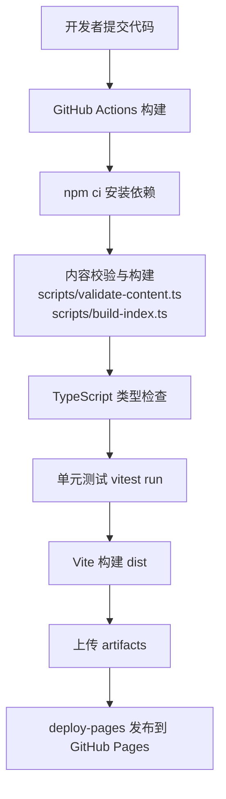
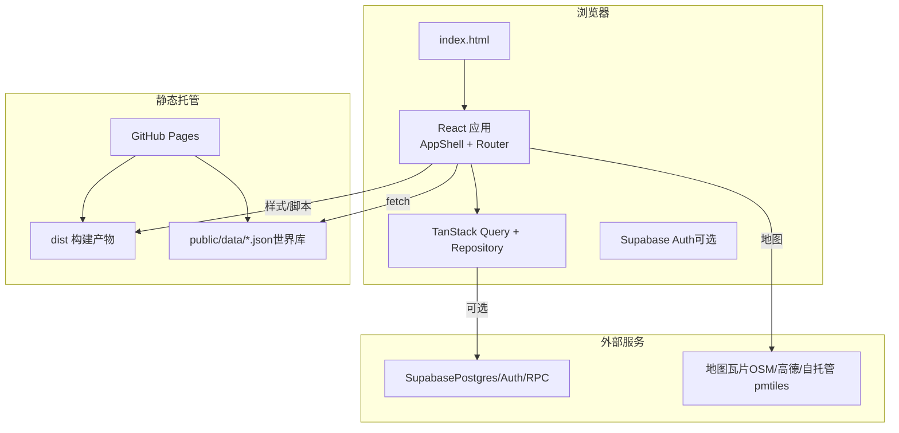
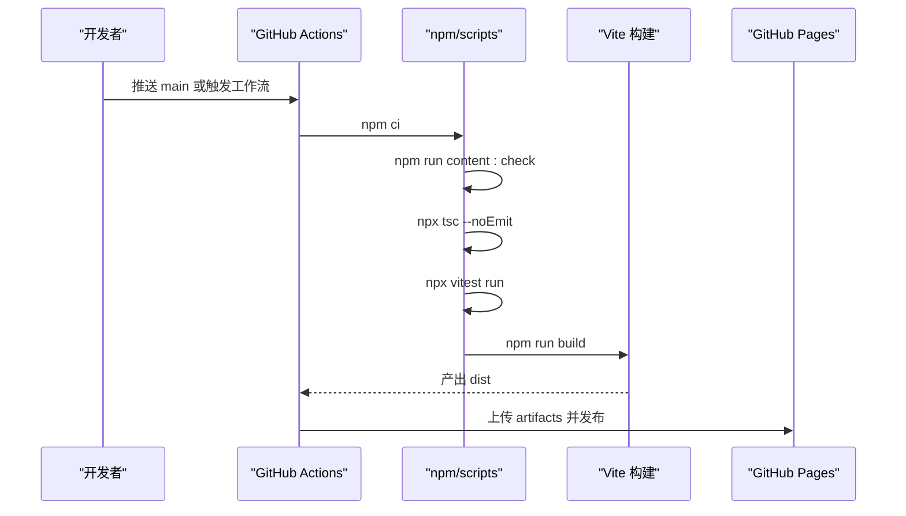
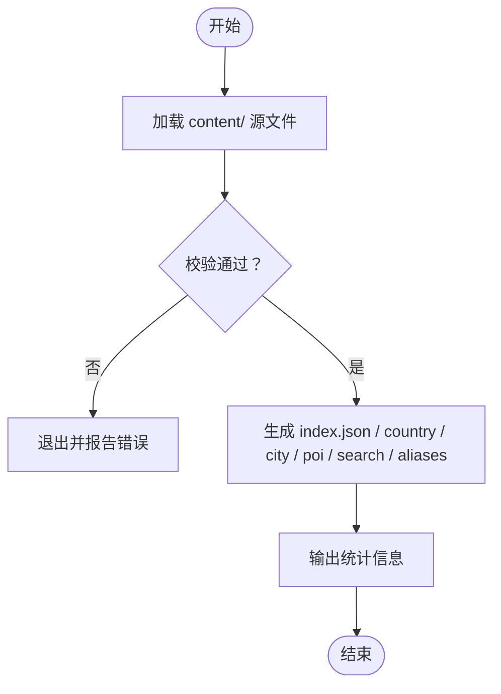
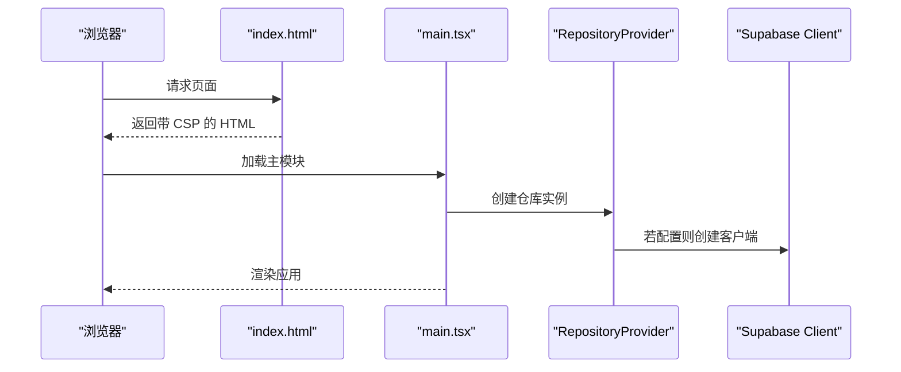
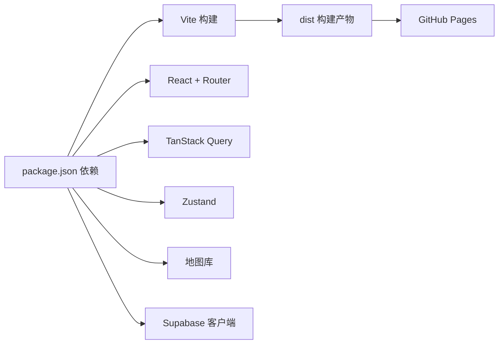
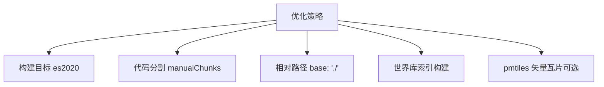

# 部署指南

<cite>
**本文引用的文件**
- [package.json](file://package.json)
- [vite.config.ts](file://vite.config.ts)
- [.github/workflows/deploy.yml](file://.github/workflows/deploy.yml)
- [index.html](file://index.html)
- [src/app/main.tsx](file://src/app/main.tsx)
- [src/data/supabase-client.ts](file://src/data/supabase-client.ts)
- [scripts/build-index.ts](file://scripts/build-index.ts)
- [scripts/validate-content.ts](file://scripts/validate-content.ts)
- [docs/技术方案.md](file://docs/技术方案.md)
- [docs/矢量地图瓦片构建.md](file://docs/矢量地图瓦片构建.md)
- [src/app/AppShell.tsx](file://src/app/AppShell.tsx)
</cite>

## 目录
1. [简介](#简介)
2. [项目结构](#项目结构)
3. [核心组件](#核心组件)
4. [架构总览](#架构总览)
5. [详细组件分析](#详细组件分析)
6. [依赖关系分析](#依赖关系分析)
7. [性能与优化](#性能与优化)
8. [故障排查](#故障排查)
9. [结论](#结论)
10. [附录](#附录)

## 简介
本指南面向“玩无一失”项目的生产部署，覆盖静态站点构建、GitHub Pages 发布、环境变量管理、内容索引构建、CDN 与资源优化、监控与日志、版本发布与回滚策略。项目采用 Vite + React 构建，世界库为静态 JSON，通过 GitHub Actions 自动构建并部署到 GitHub Pages；可选接入 Supabase 提供认证与数据服务。

## 项目结构
- 前端源码位于 src，入口为 index.html 与 src/app/main.tsx。
- 构建配置在 vite.config.ts，启用相对路径 base 以适配 GitHub Pages 子路径与离线访问。
- 世界库内容在 content，构建期由 scripts/build-index.ts 生成 public/data 下的索引与全文数据。
- CI/CD 在 .github/workflows/deploy.yml，推送 main 分支或手动触发时执行校验、类型检查、测试、构建与发布。
- 安全与跨域限制通过 index.html 的 CSP meta 声明实现，兼容 GitHub Pages 无自定义响应头限制。

**图表来源**
- [.github/workflows/deploy.yml:1-52](file://.github/workflows/deploy.yml#L1-L52)
- [package.json:7-16](file://package.json#L7-L16)
- [scripts/build-index.ts:45-116](file://scripts/build-index.ts#L45-L116)
- [scripts/validate-content.ts:20-72](file://scripts/validate-content.ts#L20-L72)

**章节来源**
- [vite.config.ts:5-31](file://vite.config.ts#L5-L31)
- [.github/workflows/deploy.yml:1-52](file://.github/workflows/deploy.yml#L1-L52)
- [package.json:7-16](file://package.json#L7-L16)

## 核心组件
- 构建与脚本：
  - 开发：npm run dev（先构建内容索引再启动 Vite）。
  - 构建：npm run build（内容校验+构建、类型检查、Vite 构建）。
  - 预览：npm run preview。
  - 类型检查：npm run typecheck。
  - 测试：npm run test / npm run test:watch。
  - 内容校验与构建：npm run content:validate / npm run content:build / npm run content:check。
- 应用入口：
  - index.html 定义 CSP、主题色、描述与标题，加载主模块。
  - src/app/main.tsx 初始化 QueryClient、RepositoryProvider、路由与 Toast。
- 数据层：
  - src/data/index.tsx 根据是否配置 Supabase 选择本地或云端 Trip 适配器。
  - src/data/supabase-client.ts 读取环境变量注入 Supabase 客户端，并提供登录态监听与认证方法。

**章节来源**
- [package.json:7-16](file://package.json#L7-L16)
- [index.html:1-20](file://index.html#L1-L20)
- [src/app/main.tsx:1-38](file://src/app/main.tsx#L1-L38)
- [src/data/index.tsx:1-57](file://src/data/index.tsx#L1-L57)
- [src/data/supabase-client.ts:1-106](file://src/data/supabase-client.ts#L1-L106)

## 架构总览
- 部署目标：GitHub Pages（免费静态托管），使用 HashRouter 避免 SPA 深链 404。
- 构建产物：dist 目录，包含 JS/CSS/HTML 与 public/data 下的世界库索引与全文。
- 运行时：浏览器加载 index.html，CSP 允许连接 Supabase 与地图瓦片源；世界库通过 fetch 获取静态 JSON；行程数据通过 Supabase（可选）获取。
- 双端分流：AppShell 按设备模式渲染桌面或移动端外壳，共享数据层与领域逻辑。

**图表来源**
- [index.html:1-20](file://index.html#L1-L20)
- [src/app/AppShell.tsx:1-135](file://src/app/AppShell.tsx#L1-L135)
- [src/data/supabase-client.ts:1-106](file://src/data/supabase-client.ts#L1-L106)
- [docs/技术方案.md:90-111](file://docs/技术方案.md#L90-L111)

## 详细组件分析

### 构建流水线与环境变量
- 工作流触发：push 到 main 或 workflow_dispatch。
- 环境准备：Node 22，缓存 npm。
- 门禁步骤：
  - 内容校验与构建：npm run content:check（validate + build-index）。
  - 类型检查：tsc --noEmit。
  - 单测：vitest run。
  - 构建：npm run build（产出 dist）。
- 环境变量：
  - VITE_SUPABASE_URL、VITE_SUPABASE_ANON_KEY 通过 GitHub Secrets 注入，供前端构建期读取。
  - 这些值会被打入前端 JS（anon key 公开），用于运行时创建 Supabase 客户端。

**图表来源**
- [.github/workflows/deploy.yml:1-52](file://.github/workflows/deploy.yml#L1-L52)
- [package.json:7-16](file://package.json#L7-L16)

**章节来源**
- [.github/workflows/deploy.yml:1-52](file://.github/workflows/deploy.yml#L1-L52)
- [package.json:7-16](file://package.json#L7-L16)
- [src/data/supabase-client.ts:17-34](file://src/data/supabase-client.ts#L17-L34)

### 世界库内容构建与校验
- 校验器：scripts/validate-content.ts 使用 zod schema 与业务规则检查内容完整性与一致性，错误退出阻断构建。
- 构建器：scripts/build-index.ts 将 content/ 下国家、城市、POI 编译为 public/data 下的 index.json、country/city/poi 全文、search.json、aliases.json，并输出统计信息。
- 构建时机：CI 中在类型检查与测试之前执行，确保内容质量。

**图表来源**
- [scripts/validate-content.ts:20-72](file://scripts/validate-content.ts#L20-L72)
- [scripts/build-index.ts:45-116](file://scripts/build-index.ts#L45-L116)

**章节来源**
- [scripts/validate-content.ts:1-76](file://scripts/validate-content.ts#L1-L76)
- [scripts/build-index.ts:1-120](file://scripts/build-index.ts#L1-L120)

### 应用初始化与安全策略
- 入口：index.html 设置 CSP meta，允许连接 Supabase 与地图瓦片源，禁用不安全外链。
- 应用启动：main.tsx 初始化 QueryClient、RepositoryProvider、Toast、AuthQuerySync、Router。
- 数据层：根据是否配置 Supabase 选择本地或云端 Trip 适配器，世界库始终走静态 JSON。

**图表来源**
- [index.html:1-20](file://index.html#L1-L20)
- [src/app/main.tsx:1-38](file://src/app/main.tsx#L1-L38)
- [src/data/index.tsx:21-29](file://src/data/index.tsx#L21-L29)
- [src/data/supabase-client.ts:17-34](file://src/data/supabase-client.ts#L17-L34)

**章节来源**
- [index.html:1-20](file://index.html#L1-L20)
- [src/app/main.tsx:1-38](file://src/app/main.tsx#L1-L38)
- [src/data/index.tsx:1-57](file://src/data/index.tsx#L1-L57)
- [src/data/supabase-client.ts:1-106](file://src/data/supabase-client.ts#L1-L106)

### 双端分流与路由
- AppShell 根据设备模式渲染桌面或移动端外壳，共享数据层与领域逻辑。
- 路由使用 HashRouter，避免 GitHub Pages 子路径与离线 file:// 场景下的深链问题。

**章节来源**
- [src/app/AppShell.tsx:1-135](file://src/app/AppShell.tsx#L1-L135)
- [docs/技术方案.md:156-162](file://docs/技术方案.md#L156-L162)

## 依赖关系分析
- 构建依赖：Vite、React、React Router、TanStack Query、Zustand、MapLibre/Leaflet（地图）、Supabase 客户端等。
- 开发依赖：TypeScript、Vitest、@vitejs/plugin-react、tsx。
- 运行依赖：浏览器原生能力（Fetch、IndexedDB）、Supabase（可选）、地图瓦片源（OSM/高德/自托管 pmtiles）。

**图表来源**
- [package.json:18-43](file://package.json#L18-L43)

**章节来源**
- [package.json:18-43](file://package.json#L18-L43)

## 性能与优化
- 构建目标：es2020，减少兼容开销。
- 代码分割：manualChunks 将 react/react-dom/react-router-dom 与 @tanstack/react-query 单独切分，利于缓存与并行加载。
- 资源路径：base: './' 使用相对路径，适配 GitHub Pages 子路径与离线访问。
- 世界库：构建期生成索引与搜索记录，减少运行时解析成本。
- 地图瓦片：可部署 pmtiles 至 public 目录，零成本、无 key、大陆可达；无 pmtiles 时自动降级到高德位图兜底。

**图表来源**
- [vite.config.ts:19-31](file://vite.config.ts#L19-L31)
- [docs/矢量地图瓦片构建.md:1-49](file://docs/矢量地图瓦片构建.md#L1-L49)

**章节来源**
- [vite.config.ts:5-31](file://vite.config.ts#L5-L31)
- [docs/矢量地图瓦片构建.md:1-49](file://docs/矢量地图瓦片构建.md#L1-L49)

## 故障排查
- 内容校验失败：查看 scripts/validate-content.ts 输出的错误与警告，修复 content/ 中的字段类型、必填项、引用完整性与业务规则问题。
- 构建失败：确认 Node 版本、依赖安装、类型检查与测试通过后再构建。
- 环境变量缺失：检查 GitHub Secrets 是否配置 VITE_SUPABASE_URL 与 VITE_SUPABASE_ANON_KEY；未配置时将走本地模式（仅本机存储）。
- 地图不可用：确认 pmtiles 文件是否存在或地图源可达；无 pmtiles 时自动降级到高德位图。
- 权限与安全：CSP 限制来自 index.html 的 meta 声明，确保 connect-src 与 img-src 包含必要域名；避免引入不受信任的外部脚本。

**章节来源**
- [scripts/validate-content.ts:20-72](file://scripts/validate-content.ts#L20-L72)
- [.github/workflows/deploy.yml:24-38](file://.github/workflows/deploy.yml#L24-L38)
- [index.html:7-11](file://index.html#L7-L11)
- [docs/矢量地图瓦片构建.md:41-49](file://docs/矢量地图瓦片构建.md#L41-L49)

## 结论
本项目通过严格的构建前校验、类型检查与单测保障质量，结合 GitHub Actions 自动化发布到 GitHub Pages，实现零成本静态站点部署。世界库作为静态内容，构建期生成索引与全文，提升运行时性能；可选接入 Supabase 提供认证与数据服务。通过合理代码分割、相对路径与地图瓦片策略，兼顾性能与可用性。建议在生产环境中完善监控与日志收集，并制定版本发布与回滚流程以确保稳定性。

## 附录

### 生产环境配置检查清单
- 基础配置
  - GitHub Pages 已启用，分支设置为 gh-pages 或工作流自动发布。
  - Vite base 为相对路径，确保子路径与离线访问正常。
  - index.html 中 CSP meta 已正确声明，允许 Supabase 与地图瓦片域名。
- 环境变量
  - GitHub Secrets 已配置 VITE_SUPABASE_URL 与 VITE_SUPABASE_ANON_KEY。
  - 若无需 Supabase，可不配置，应用将走本地模式。
- 内容与数据
  - content/ 内容已通过 validate-content 校验。
  - public/data 由构建生成，不手改也不提交。
- 地图与资源
  - 如需矢量地图，已在 public 目录部署 tiles.pmtiles。
  - 图片与图标资源路径正确，CSP 允许相关域名。
- 安全与合规
  - 无敏感信息进入前端代码（anon key 公开但无写权限）。
  - 所有外部链接在新窗口打开并添加 rel="noopener noreferrer"。

**章节来源**
- [index.html:7-11](file://index.html#L7-L11)
- [.github/workflows/deploy.yml:24-38](file://.github/workflows/deploy.yml#L24-L38)
- [scripts/validate-content.ts:20-72](file://scripts/validate-content.ts#L20-L72)
- [scripts/build-index.ts:45-116](file://scripts/build-index.ts#L45-L116)
- [docs/技术方案.md:591-599](file://docs/技术方案.md#L591-L599)

### 性能监控与错误日志方案
- 前端监控
  - 使用 TanStack Query 的 retry 与 refetchOnWindowFocus 控制重试与聚焦行为，减少无效请求。
  - 在关键交互处埋点（如拖拽、表单提交、地图切换），记录耗时与错误。
- 错误日志
  - 捕获全局异常与未处理 Promise 拒绝，上报到日志服务（如自建或第三方）。
  - 对 Supabase 请求失败进行分级记录（网络错误、鉴权失败、数据错误）。
- 性能指标
  - 首屏时间、资源体积、缓存命中率、地图加载成功率。
  - 定期对比构建产物体积变化，避免回归。

[本节为通用指导，不直接分析具体文件]

### 版本发布与回滚策略
- 版本标记
  - 在 package.json 中维护版本号，发布前更新版本并打 tag。
- 发布流程
  - 合并到 main 后触发工作流，自动构建与发布到 GitHub Pages。
  - 发布成功后验证页面可用性与核心功能。
- 回滚策略
  - GitHub Pages 支持历史版本回滚，可通过 Actions 重新部署上一个稳定版本。
  - 若需快速回滚，可在 GitHub 上恢复上一个 commit 并触发构建。
- 变更管理
  - 每次发布附带变更说明，记录新增功能、修复问题与已知限制。
  - 对破坏性变更进行灰度发布与用户通知。

**章节来源**
- [package.json:1-10](file://package.json#L1-L10)
- [.github/workflows/deploy.yml:1-52](file://.github/workflows/deploy.yml#L1-L52)