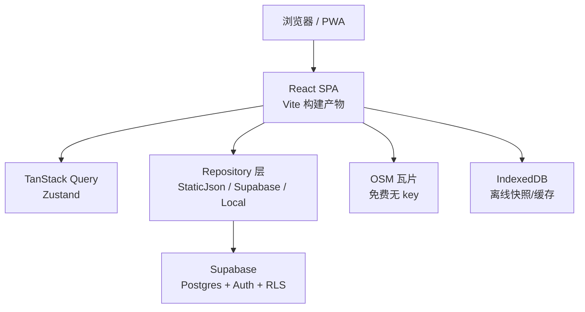
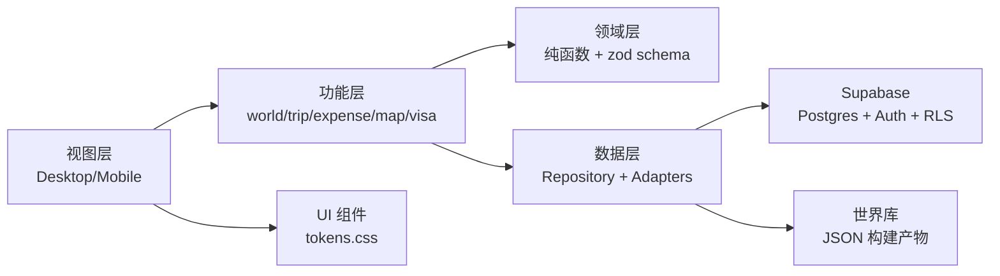
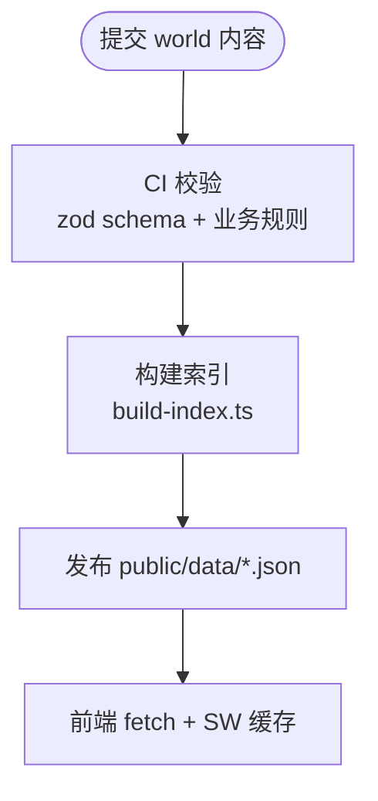
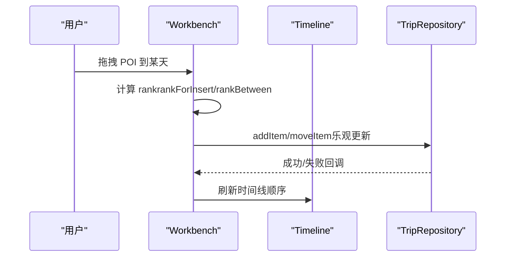
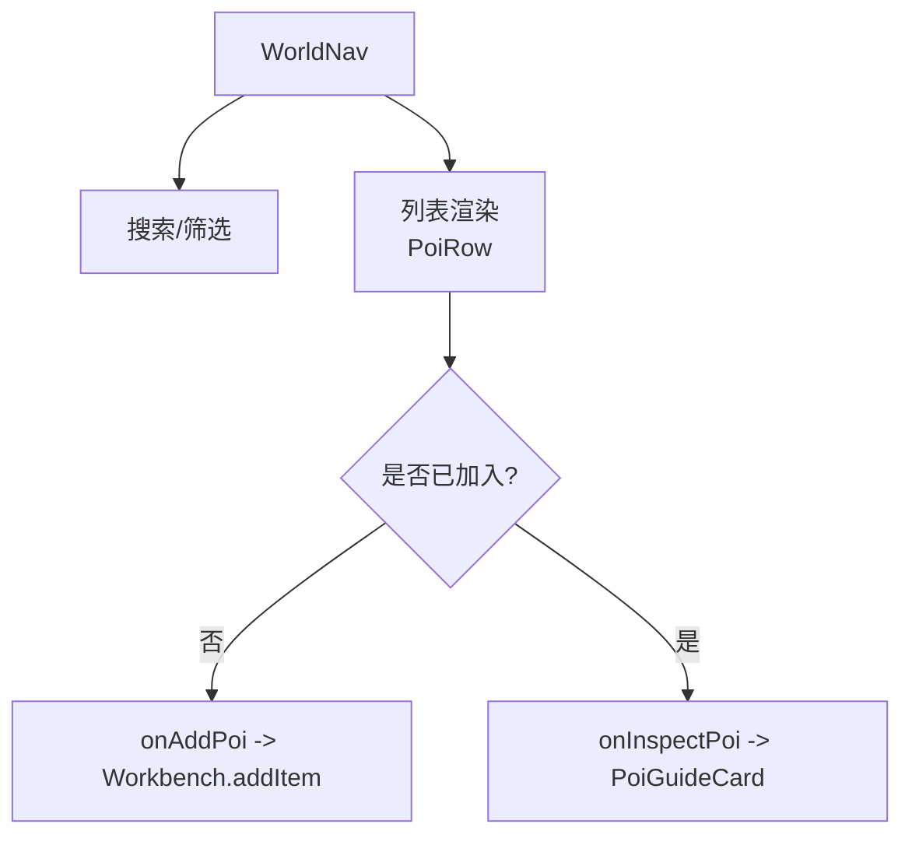
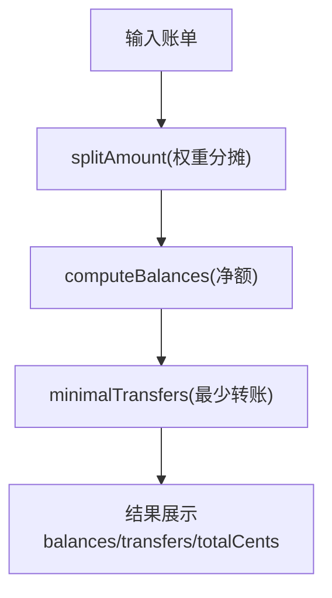
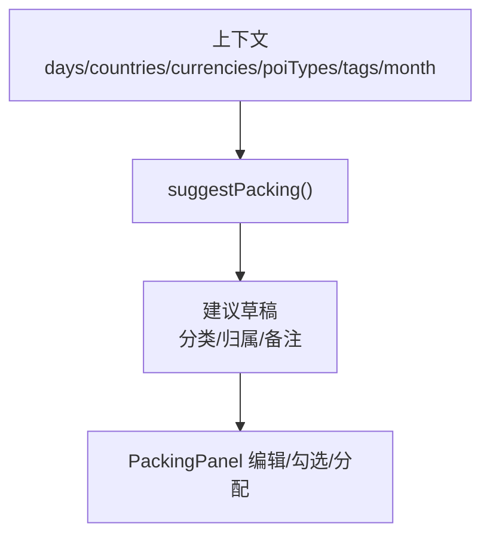
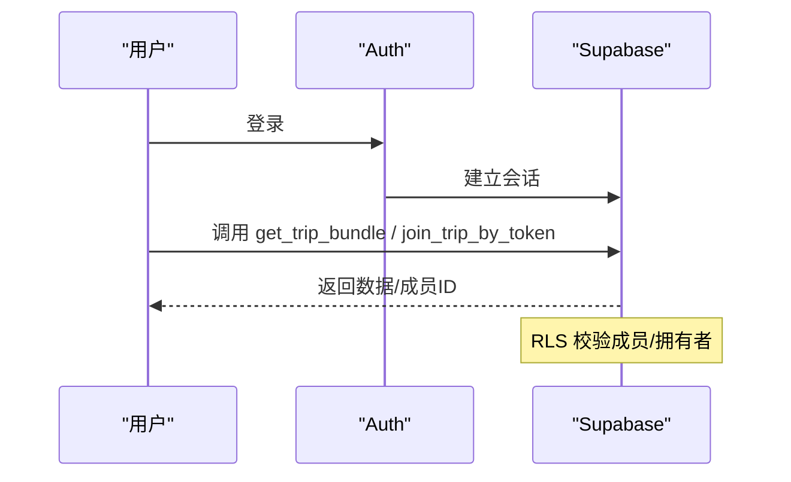
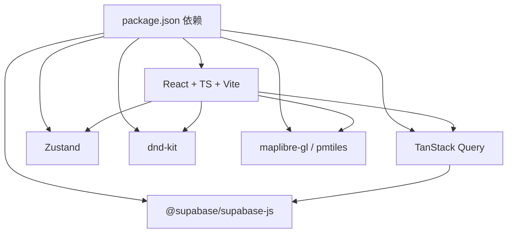

# 项目概述

<cite>
**本文引用的文件**
- [package.json](file://package.json)
- [content/README.md](file://content/README.md)
- [docs/技术方案.md](file://docs/技术方案.md)
- [src/app/main.tsx](file://src/app/main.tsx)
- [src/app/router.tsx](file://src/app/router.tsx)
- [src/data/index.tsx](file://src/data/index.tsx)
- [src/domain/world/schema.ts](file://src/domain/world/schema.ts)
- [supabase/migrations/0001_init.sql](file://supabase/migrations/0001_init.sql)
- [src/features/trip/Workbench.tsx](file://src/features/trip/Workbench.tsx)
- [src/features/world/WorldNav.tsx](file://src/features/world/WorldNav.tsx)
- [src/features/expense/LedgerPanel.tsx](file://src/features/expense/LedgerPanel.tsx)
- [src/features/trip/PackingPanel.tsx](file://src/features/trip/PackingPanel.tsx)
- [src/domain/expense/settle.ts](file://src/domain/expense/settle.ts)
- [src/domain/trip/packing.ts](file://src/domain/trip/packing.ts)
- [index.html](file://index.html)
- [src/app/AppShell.tsx](file://src/app/AppShell.tsx)
- [src/pages/TripsPage.tsx](file://src/pages/TripsPage.tsx)
</cite>

## 更新摘要
**变更内容**
- 将项目名称从"玩无一失"更新为"Tour the World"
- 更新所有用户界面中的品牌名称
- 保持技术架构和功能特性不变
- 维护文档的一致性和准确性

## 目录
1. [简介](#简介)
2. [项目结构](#项目结构)
3. [核心组件](#核心组件)
4. [架构总览](#架构总览)
5. [详细组件分析](#详细组件分析)
6. [依赖关系分析](#依赖关系分析)
7. [性能与可靠性](#性能与可靠性)
8. [故障排查指南](#故障排查指南)
9. [快速开始](#快速开始)
10. [结论](#结论)

## 简介
"Tour the World —— 可执行的旅行作战台"是一个面向多人旅行的可执行作战台，聚焦"智能行程规划、团队协作、世界库浏览、费用管理、打包清单"等核心能力。项目以零成本基础设施为目标，采用 React + TypeScript + Vite 构建前端，使用 Supabase（Postgres + Auth + RLS）作为后端，地图基于 OSM 瓦片方案；世界库为静态 JSON 内容，通过构建脚本生成运行时数据并缓存。

它解决的核心痛点包括：
- 多人协作：成员邀请、投票、共享笔记、幽灵成员认领，确保同伴参与无门槛。
- 实时与离线：在线时通过 RPC 一次性拉取行程全量数据，结合查询缓存；离线提供只读快照与本地状态。
- 智能推荐：世界库结构化字段驱动闭馆校验、预约提醒、打包建议、导览深度卡片等。
- 费用透明：整数分记账、AA/权重分摊、最少转账结算，避免扯皮。
- 打包清单：按目的地气候、活动类型智能生成清单，支持个人与公共物品分工。

## 项目结构
仓库采用领域分层组织：
- content：世界库源文件（国家、城市、POI），由构建脚本产出 public/data 下的运行时数据。
- src：应用代码，包含 app（入口与路由）、features（按领域划分的页面与容器组件）、domain（纯函数与 schema）、data（Repository 接口与适配器）、ui（通用样式与组件）。
- supabase：数据库迁移与权限策略、RPC。
- scripts：内容校验、索引构建、图片获取等工具。
- docs：技术方案与专题文档。

**图表来源**
- [docs/技术方案.md:90-112](file://docs/技术方案.md#L90-L112)
- [src/app/main.tsx:1-38](file://src/app/main.tsx#L1-L38)
- [src/data/index.tsx:1-57](file://src/data/index.tsx#L1-L57)

**章节来源**
- [docs/技术方案.md:62-112](file://docs/技术方案.md#L62-L112)
- [src/app/main.tsx:1-38](file://src/app/main.tsx#L1-L38)
- [src/data/index.tsx:1-57](file://src/data/index.tsx#L1-L57)

## 核心组件
- 世界库浏览：国家/城市/景点树形导航，支持搜索、筛选、已加入标记与拖拽加入行程。
- 工作台（PC 三栏）：左栏世界库、中栏时间线、右栏详情（导览卡/条目编辑/投票/速览）。
- 账本：记一笔、AA/权重分摊、最少转账结算，金额全程整数分运算。
- 打包清单：按行程天数、目的地气候、POI 类型智能生成清单，支持个人与公共物品分工。
- 认证与协作：邮箱登录、邀请链接加入、幽灵成员认领、分享快照匿名访问。

**章节来源**
- [src/features/world/WorldNav.tsx:1-266](file://src/features/world/WorldNav.tsx#L1-L266)
- [src/features/trip/Workbench.tsx:1-414](file://src/features/trip/Workbench.tsx#L1-L414)
- [src/features/expense/LedgerPanel.tsx:1-474](file://src/features/expense/LedgerPanel.tsx#L1-L474)
- [src/features/trip/PackingPanel.tsx:1-367](file://src/features/trip/PackingPanel.tsx#L1-L367)

## 架构总览
系统采用分层架构：视图层（双端布局）、功能层（按领域 hooks+容器）、领域层（纯函数与 schema）、数据层（Repository 接口与适配器）、基础设施（静态资源、Supabase、IndexedDB、PWA）。

**图表来源**
- [docs/技术方案.md:62-88](file://docs/技术方案.md#L62-L88)
- [src/domain/world/schema.ts:1-317](file://src/domain/world/schema.ts#L1-L317)
- [src/data/index.tsx:1-57](file://src/data/index.tsx#L1-L57)

**章节来源**
- [docs/技术方案.md:62-88](file://docs/技术方案.md#L62-L88)

## 详细组件分析

### 世界库与内容治理
- 世界库是静态知识，遵循严格的编写规范：易变信息必须带来源与核实日期；闭馆日必须结构化；深导览亮点需精确到展厅位置。
- 构建流程：CI 校验 → 构建索引 → 生成 public/data 运行数据。
- Schema 统一：zod 同时承担类型推导、CI 校验、运行时容错解析。

**图表来源**
- [content/README.md:1-47](file://content/README.md#L1-L47)
- [src/domain/world/schema.ts:1-317](file://src/domain/world/schema.ts#L1-L317)

**章节来源**
- [content/README.md:1-47](file://content/README.md#L1-L47)
- [src/domain/world/schema.ts:1-317](file://src/domain/world/schema.ts#L1-L317)

### 工作台与时间线（PC）
- 三栏布局：左栏世界库、中栏时间线、右栏详情面板（多态切换）。
- 拖拽：dnd-kit 实现跨天/同天排序、从世界库拖入时间线；fractional indexing 保证并发插入不冲突。
- 体检：sanity-check 对闭馆日、时长、预约提前期进行校验并提示。

**图表来源**
- [src/features/trip/Workbench.tsx:1-414](file://src/features/trip/Workbench.tsx#L1-L414)
- [docs/技术方案.md:760-773](file://docs/技术方案.md#L760-L773)

**章节来源**
- [src/features/trip/Workbench.tsx:1-414](file://src/features/trip/Workbench.tsx#L1-L414)
- [docs/技术方案.md:704-729](file://docs/技术方案.md#L704-L729)

### 世界库导航
- 支持按国家/城市折叠、关键词搜索、排除标签、已加入标记。
- 点击行打开导览卡；未加入则显示"+"加入当前选中日。

**图表来源**
- [src/features/world/WorldNav.tsx:1-266](file://src/features/world/WorldNav.tsx#L1-L266)
- [src/features/trip/Workbench.tsx:158-200](file://src/features/trip/Workbench.tsx#L158-L200)

**章节来源**
- [src/features/world/WorldNav.tsx:1-266](file://src/features/world/WorldNav.tsx#L1-L266)

### 费用管理与结算
- 记账：分类、币种、汇率、付款人、参与人与权重；个人自付不计入共同分摊。
- 结算：splitAmount（最大余数法）→ computeBalances → minimalTransfers（贪心最小转账次数）。
- 展示：总额、明细、每人应收应付、转账方案。

**图表来源**
- [src/features/expense/LedgerPanel.tsx:1-474](file://src/features/expense/LedgerPanel.tsx#L1-L474)
- [src/domain/expense/settle.ts:1-141](file://src/domain/expense/settle.ts#L1-L141)

**章节来源**
- [src/features/expense/LedgerPanel.tsx:1-474](file://src/features/expense/LedgerPanel.tsx#L1-L474)
- [src/domain/expense/settle.ts:1-141](file://src/domain/expense/settle.ts#L1-L141)

### 打包清单与智能建议
- 智能生成：依据行程天数、目的地国家/货币、POI 类型/标签、出发月份气候带生成衣物与活动相关项。
- 组织方式：个人行李按成员复制，公共物品仅一份并可指定携带人。
- 离线优先：清单随行程读写，不依赖后端。

**图表来源**
- [src/features/trip/PackingPanel.tsx:1-367](file://src/features/trip/PackingPanel.tsx#L1-L367)
- [src/domain/trip/packing.ts:1-164](file://src/domain/trip/packing.ts#L1-L164)

**章节来源**
- [src/features/trip/PackingPanel.tsx:1-367](file://src/features/trip/PackingPanel.tsx#L1-L367)
- [src/domain/trip/packing.ts:1-164](file://src/domain/trip/packing.ts#L1-L164)

### 认证、权限与安全
- 认证：邮箱+密码，GoTrue 会话持久化；登录态闪烁用骨架屏处理。
- 权限：RLS 策略 + SECURITY DEFINER 函数，避免递归；所有子表统一成员判定。
- 分享：发布快照模型，匿名通过 RPC get_share 精确读取，不可枚举。

**图表来源**
- [supabase/migrations/0001_init.sql:288-525](file://supabase/migrations/0001_init.sql#L288-L525)
- [docs/技术方案.md:432-599](file://docs/技术方案.md#L432-L599)

**章节来源**
- [supabase/migrations/0001_init.sql:288-525](file://supabase/migrations/0001_init.sql#L288-L525)
- [docs/技术方案.md:432-599](file://docs/技术方案.md#L432-L599)

## 依赖关系分析
- 技术栈：React 18、TypeScript、Vite、React Router 6、TanStack Query v5、Zustand、dnd-kit、maplibre-gl（或 Leaflet 方案）、pmtiles、zod、@supabase/supabase-js。
- 数据流：前端通过 Repository 抽象访问世界库（静态 JSON）与行程数据（Supabase），查询缓存与失效由 TanStack Query 管理；Zustand 管理 UI 全局状态。
- 部署：GitHub Pages 静态托管，HashRouter 兼容子路径与离线。

**图表来源**
- [package.json:1-45](file://package.json#L1-L45)
- [src/app/main.tsx:1-38](file://src/app/main.tsx#L1-L38)
- [src/data/index.tsx:1-57](file://src/data/index.tsx#L1-L57)

**章节来源**
- [package.json:1-45](file://package.json#L1-L45)
- [src/app/main.tsx:1-38](file://src/app/main.tsx#L1-L38)
- [src/data/index.tsx:1-57](file://src/data/index.tsx#L1-L57)

## 性能与可靠性
- 查询优化：一次 RPC 获取行程全量数据（get_trip_bundle），减少往返；Query Key 约定 staleTime 控制缓存。
- 写操作：乐观更新，失败回滚并 toast；fractional indexing 降低并发冲突。
- 离线：IndexedDB 存储离线快照；世界库静态资源通过 Service Worker 缓存。
- 安全：RLS 严格权限；分享快照净化敏感字段；CSP 在 index.html 声明。

**章节来源**
- [docs/技术方案.md:407-429](file://docs/技术方案.md#L407-L429)
- [docs/技术方案.md:561-599](file://docs/技术方案.md#L561-L599)

## 故障排查指南
- 世界库校验失败：检查 volatile 字段 source/verifiedAt、闭馆日结构化、坐标范围、高热度博物馆 guide 缺失等。
- 行程加载异常：确认 get_trip_bundle 权限、RLS 策略、成员加入是否成功。
- 费用结算误差：确认金额以整数分存储与计算；汇率换算后四舍五入到分；权重总和正确。
- 分享链接无效：检查 shares.slug 是否存在且未被撤销；仅允许通过 RPC 精确读取。

**章节来源**
- [src/domain/world/schema.ts:245-317](file://src/domain/world/schema.ts#L245-L317)
- [supabase/migrations/0001_init.sql:388-525](file://supabase/migrations/0001_init.sql#L388-L525)
- [src/domain/expense/settle.ts:1-141](file://src/domain/expense/settle.ts#L1-L141)

## 快速开始
- 安装依赖：npm install
- 构建世界库：npm run content:build（可选，开发时自动触发）
- 启动开发服务器：npm run dev
- 预览构建产物：npm run preview
- 类型检查：npm run typecheck
- 测试：npm run test / npm run test:watch

说明：
- 首次运行前请配置 Supabase 客户端（环境变量），否则将回退到本地模式（LocalTripRepository）。
- 世界库内容位于 content/ 目录，修改后需重新构建以生效。

**章节来源**
- [package.json:7-16](file://package.json#L7-L16)
- [src/data/index.tsx:21-28](file://src/data/index.tsx#L21-L28)
- [content/README.md:33-41](file://content/README.md#L33-L41)

## 结论
"Tour the World"以零成本、可离线、强一致为核心目标，通过领域纯函数与 Repository 抽象，将世界库知识与行程决策解耦，提供智能行程规划、团队协作、费用透明与打包清单等实用能力。其架构清晰、扩展性强，适合小团队或个人快速迭代并稳定交付真实旅行场景所需的功能。

**更新说明**
本项目已完成品牌重命名，从"玩无一失"正式更名为"Tour the World"。所有用户界面、文档和元数据均已更新为新品牌名称，但项目的核心功能、技术架构和使用方式保持不变。新品牌名称更好地体现了项目的国际化定位和全球旅行规划的目标。