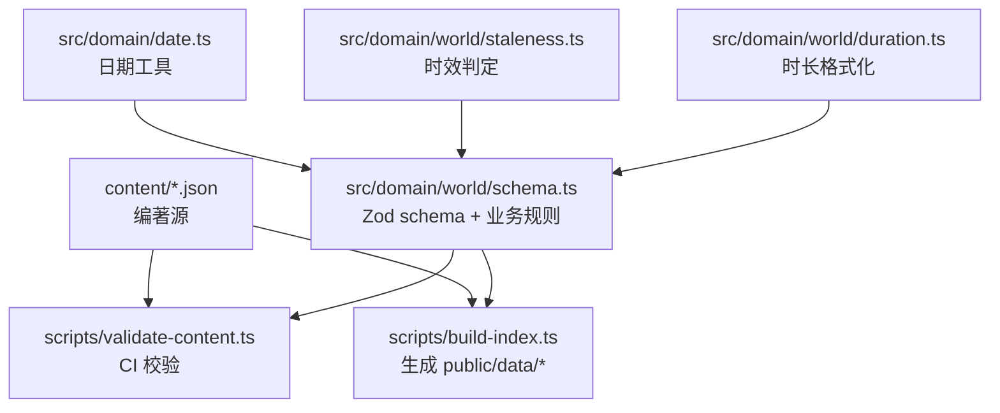
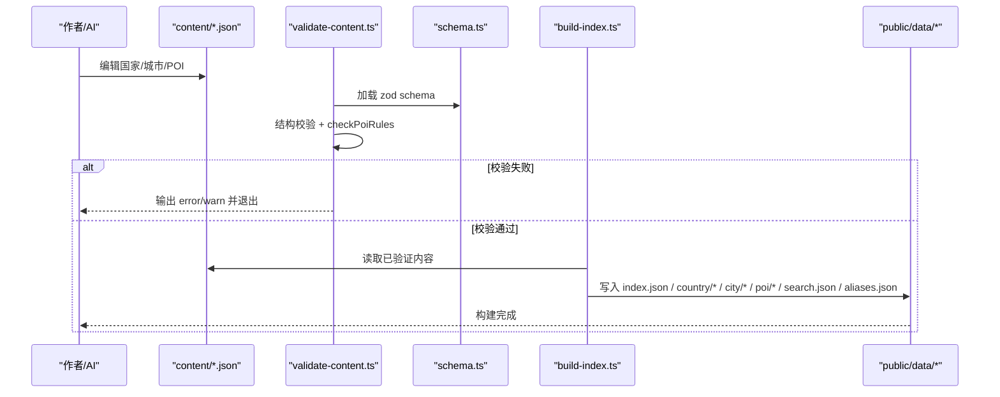
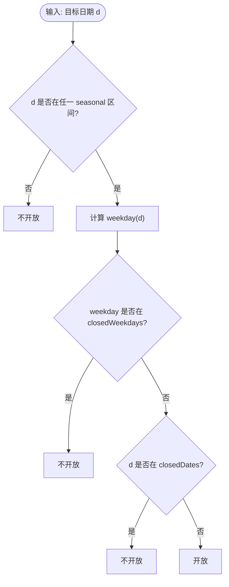
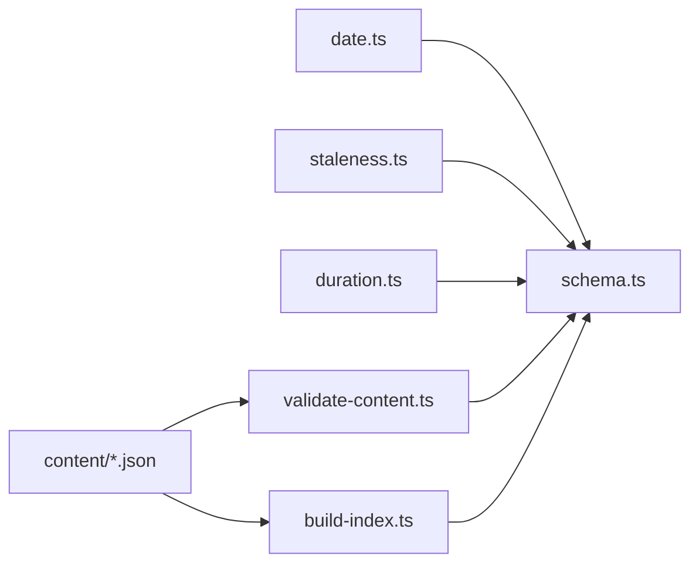

# 世界库数据模型

<cite>
**本文引用的文件**
- [src/domain/world/schema.ts](file://src/domain/world/schema.ts)
- [src/domain/world/duration.ts](file://src/domain/world/duration.ts)
- [src/domain/world/staleness.ts](file://src/domain/world/staleness.ts)
- [src/domain/date.ts](file://src/domain/date.ts)
- [scripts/validate-content.ts](file://scripts/validate-content.ts)
- [scripts/build-index.ts](file://scripts/build-index.ts)
- [content/README.md](file://content/README.md)
- [content/countries/ch.json](file://content/countries/ch.json)
- [content/cities/paris.json](file://content/cities/paris.json)
- [content/pois/louvre.json](file://content/pois/louvre.json)
- [docs/技术方案.md](file://docs/技术方案.md)
</cite>

## 目录
1. [引言](#引言)
2. [项目结构](#项目结构)
3. [核心组件](#核心组件)
4. [架构总览](#架构总览)
5. [详细组件分析](#详细组件分析)
6. [依赖关系分析](#依赖关系分析)
7. [性能与可维护性](#性能与可维护性)
8. [故障排查指南](#故障排查指南)
9. [结论](#结论)
10. [附录：迁移与版本兼容](#附录：迁移与版本兼容)

## 引言
本文件面向“世界库”的数据模型，聚焦国家（Country）、城市（City）、景点（Poi）三大实体的数据结构设计、字段约束与业务规则；解释易变字段（Verifiable）的设计模式；说明开放度（Openness）闭馆日计算逻辑；给出完整的 Zod schema 校验要点；并提供数据迁移与版本兼容性方案。目标是让读者既能理解代码实现，也能据此正确编写与维护内容。

## 项目结构
世界库由“编著源 + 构建脚本 + 领域层 schema + 运行时工具”构成：
- 编著源：content/{countries,cities,pois}/*.json，供人/AI 编辑，不直接运行。
- 构建与校验：scripts/build-index.ts 生成 public/data/* 的运行时数据；scripts/validate-content.ts 在 CI 中执行结构与业务规则校验。
- 领域层：src/domain/world/schema.ts 定义所有 zod schema 与业务规则；src/domain/world/duration.ts 负责时长展示格式化；src/domain/world/staleness.ts 提供时效判定；src/domain/date.ts 提供纯字符串日期工具。
- 示例数据：content/countries/ch.json、content/cities/paris.json、content/pois/louvre.json 体现各实体字段用法。

图表来源
- [scripts/validate-content.ts:1-76](file://scripts/validate-content.ts#L1-L76)
- [scripts/build-index.ts:1-120](file://scripts/build-index.ts#L1-L120)
- [src/domain/world/schema.ts:1-317](file://src/domain/world/schema.ts#L1-L317)
- [src/domain/date.ts:1-69](file://src/domain/date.ts#L1-L69)
- [src/domain/world/staleness.ts:1-49](file://src/domain/world/staleness.ts#L1-L49)
- [src/domain/world/duration.ts:1-24](file://src/domain/world/duration.ts#L1-L24)

章节来源
- [content/README.md:1-47](file://content/README.md#L1-L47)
- [docs/技术方案.md:184-307](file://docs/技术方案.md#L184-L307)

## 核心组件
- Country（国家）：包含签证信息、货币、语言、时区、插头类型、紧急电话等。关键字段如 id 使用 ISO 3166-1 alpha-2 小写；currency 为三位字母；visa 下的费用与处理天数采用 Verifiable 包装，确保有来源与核实时间。
- City（城市）：包含位置、时区、生存主题（toilet/wifi/safety 等）与通票信息。每个生存主题都要求 source 与 verifiedAt。
- Poi（景点）：包含基础信息、坐标、标签、热度、访问建议（durationMinutes 区间）、开放度（openness）、预约（booking）、设施（facilities）、易变字段（volatile）、深导览（guide）、图片（image）等。其中 openness.closedWeekdays/closedDates/seasonal 是算法必需的结构化字段。
- Openness（开放度）：通过工作日闭馆、固定闭馆日、季节性开放区间组合判断某日是否开放。
- Verifiable（易变字段）：任何可能变化的信息必须携带 value、source（https 链接）、verifiedAt（YYYY-MM-DD），三者缺一不可。
- 辅助工具：duration 格式化、staleness 时效判定、date 日期工具。

章节来源
- [src/domain/world/schema.ts:43-231](file://src/domain/world/schema.ts#L43-L231)
- [src/domain/world/duration.ts:1-24](file://src/domain/world/duration.ts#L1-L24)
- [src/domain/world/staleness.ts:1-49](file://src/domain/world/staleness.ts#L1-L49)
- [src/domain/date.ts:1-69](file://src/domain/date.ts#L1-L69)
- [content/countries/ch.json:1-45](file://content/countries/ch.json#L1-L45)
- [content/cities/paris.json:1-47](file://content/cities/paris.json#L1-L47)
- [content/pois/louvre.json:1-120](file://content/pois/louvre.json#L1-L120)

## 架构总览
世界库数据流从“编著源 JSON”到“运行时数据”，中间经过“schema 校验 + 业务规则检查 + 索引构建”。

图表来源
- [scripts/validate-content.ts:1-76](file://scripts/validate-content.ts#L1-L76)
- [scripts/build-index.ts:1-120](file://scripts/build-index.ts#L1-L120)
- [src/domain/world/schema.ts:245-317](file://src/domain/world/schema.ts#L245-L317)

## 详细组件分析

### 国家（Country）
- 字段要点
  - id：ISO 3166-1 alpha-2 小写，用于文件名与引用。
  - name/localName：多语言名称，便于地图匹配与购票核对。
  - currency：三位字母货币码。
  - languages/timezone/plugTypes/emergencyNumbers：旅行实用信息。
  - visa：可选，包含签证区域、类型、申请渠道、材料清单、费用与处理天数的 Verifiable、最早/最晚递签天数、备注。
- 示例参考
  - 瑞士国家数据展示了 visa 下 fee/processingDays 的 Verifiable 用法。

章节来源
- [src/domain/world/schema.ts:43-69](file://src/domain/world/schema.ts#L43-L69)
- [content/countries/ch.json:1-45](file://content/countries/ch.json#L1-L45)

### 城市（City）
- 字段要点
  - id：city-<slug> 形式，唯一标识。
  - location/timezone：经纬与时区。
  - survival：生存主题数组，每项含 topic、summary、tips、source、verifiedAt。
  - transitPasses：城市通票信息，支持价格 Verifiable 与官方链接。
- 示例参考
  - 巴黎城市数据展示了 survival 与 transitPasses 的实际写法。

章节来源
- [src/domain/world/schema.ts:75-103](file://src/domain/world/schema.ts#L75-L103)
- [content/cities/paris.json:1-47](file://content/cities/paris.json#L1-L47)

### 景点（Poi）
- 字段要点
  - id/type/name/localName/city/country/location/tags/popularity：基础信息与排序依据。
  - visit.durationMinutes：[下限, 上限] 分钟，供“一天排太满”体检与路线估算。
  - openness：结构化闭馆日（closedWeekdays/closedDates/seasonal）。
  - booking：required/leadDays/url，驱动“该订票了”提醒。
  - facilities：厕所、Wi-Fi、寄存、饮水、无障碍等。
  - volatile：price/hours/booking 的 Verifiable 包装，保证来源与核实时间。
  - guide：入口、路线、亮点（location 精确到展厅）、收藏区、提示。
  - image：仅允许自由版权图源，需署名与许可证。
- 示例参考
  - 卢浮宫 POI 展示了 visit/openness/booking/facilities/volatile/guide/image 的完整用法。

章节来源
- [src/domain/world/schema.ts:109-218](file://src/domain/world/schema.ts#L109-L218)
- [content/pois/louvre.json:1-120](file://content/pois/louvre.json#L1-L120)

### 开放度（Openness）与闭馆日计算
- 数据结构
  - closedWeekdays：0=周日 … 6=周六，表示每周固定闭馆日。
  - closedDates：固定闭馆日列表，格式 YYYY-MM-DD。
  - seasonal：季节性开放区间列表，from/to 为 MM-DD 格式，区间外视为不开放。
- 计算逻辑
  - 若目标日期落在任一 seasonal 区间之外 → 不开放。
  - 若目标日期 weekday 在 closedWeekdays 中 → 不开放。
  - 若目标日期在 closedDates 中 → 不开放。
  - 否则 → 开放。
- 工具支撑
  - date.ts 提供 weekday(d)、monthDay(d) 等纯函数，避免 Date 时区陷阱。
  - staleness.ts 提供时效判定，与 open/close 结合可在 UI 显示“可能过期”的警示。

图表来源
- [src/domain/world/schema.ts:115-130](file://src/domain/world/schema.ts#L115-L130)
- [src/domain/date.ts:37-51](file://src/domain/date.ts#L37-L51)

章节来源
- [src/domain/world/schema.ts:115-130](file://src/domain/world/schema.ts#L115-L130)
- [src/domain/date.ts:37-51](file://src/domain/date.ts#L37-L51)

### 易变字段（Verifiable）设计模式
- 目的：所有可能变化的信息（票价、开放时间、预约方式等）必须携带 value、source（https）、verifiedAt（YYYY-MM-DD），确保可追溯与时效可视化。
- 校验与提示
  - CI 校验：checkPoiRules 会检查 verifiedAt 不得晚于今天，且超过 180 天未核实将发出 warn。
  - 运行时：staleness.ts 根据 verifiedAt 与 today 计算 fresh/stale/very-stale，并在 UI 显示警示条。
- 适用范围
  - Country.visa.fee/processingDays
  - City.survival.* 的 source/verifiedAt
  - Poi.volatile.price/hours/booking

章节来源
- [src/domain/world/schema.ts:20-32](file://src/domain/world/schema.ts#L20-L32)
- [src/domain/world/schema.ts:298-307](file://src/domain/world/schema.ts#L298-L307)
- [src/domain/world/staleness.ts:1-49](file://src/domain/world/staleness.ts#L1-L49)
- [content/README.md:13-20](file://content/README.md#L13-L20)

### 游览时长（Duration）与展示
- 原始数据：visit.durationMinutes 为 [lo, hi] 分钟区间。
- 展示规则：不足 1 小时用分钟；上下界相同只显示一个值；跨小时边界时混合显示“分钟 - 小时”。
- 用途：行程“一天排太满”体检、路线时长估算。

章节来源
- [src/domain/world/duration.ts:1-24](file://src/domain/world/duration.ts#L1-L24)
- [content/README.md:22-31](file://content/README.md#L22-L31)

### Zod Schema 校验规则总览
- 公共约束
  - IsoDate：YYYY-MM-DD 正则校验。
  - HttpsUrl：必须以 https:// 开头。
  - LatLng：lat ∈ [-90, 90]，lng ∈ [-180, 180]。
- 国家
  - id：ISO 3166-1 alpha-2 小写；currency 长度 3；languages 至少一项。
- 城市
  - id：city-<slug>；country 引用国家 id；survival 主题枚举限定。
- 景点
  - id：poi-<slug>；type 枚举限定；city/country 引用合法；popularity 0-100。
  - visit.durationMinutes：正整数区间，且 lo ≤ hi（业务规则）。
  - openness：closedWeekdays 0-6；closedDates 为 IsoDate；seasonal from/to 为 MM-DD。
  - booking：required/leadDays/url。
  - volatile：price/hours/booking 均为 Verifiable。
  - guide.highlights[].location：必填，精确到展厅/馆翼。
- 业务规则（checkPoiRules）
  - 城市与国家引用完整性检查。
  - 坐标越界检查：基于国家边界框（BBOX），检测经纬度写反或不在境内。
  - 热门博物馆（popularity ≥ 80）必须配备 guide。
  - 易变字段时效：verifiedAt 不得晚于今天；超过 180 天未核实发出 warn。
  - _todo 非空时发出 warn。

章节来源
- [src/domain/world/schema.ts:20-218](file://src/domain/world/schema.ts#L20-L218)
- [src/domain/world/schema.ts:245-317](file://src/domain/world/schema.ts#L245-L317)

## 依赖关系分析
- 领域层依赖
  - schema.ts 依赖 date.ts 的日期工具（用于 daysBetween 与 IsoDate 校验）。
  - staleness.ts 依赖 date.ts 的 diffDays/todayStr。
  - duration.ts 独立，仅做展示格式化。
- 构建与校验依赖
  - validate-content.ts 调用 schema.ts 的 checkPoiRules 进行业务规则校验。
  - build-index.ts 读取 content/*.json，剥离 _todo/_sources 后写入 public/data/*，并生成 index/search/aliases。
- 数据引用链
  - City.country 指向国家 id；Poi.city/country 分别指向城市与国家 id；PoiSummary 投影包含 closedWeekdays/hasGuide/durationMinutes 等关键指标。

图表来源
- [src/domain/date.ts:1-69](file://src/domain/date.ts#L1-L69)
- [src/domain/world/schema.ts:1-317](file://src/domain/world/schema.ts#L1-L317)
- [src/domain/world/staleness.ts:1-49](file://src/domain/world/staleness.ts#L1-L49)
- [src/domain/world/duration.ts:1-24](file://src/domain/world/duration.ts#L1-L24)
- [scripts/validate-content.ts:1-76](file://scripts/validate-content.ts#L1-L76)
- [scripts/build-index.ts:1-120](file://scripts/build-index.ts#L1-L120)

章节来源
- [src/domain/world/schema.ts:224-242](file://src/domain/world/schema.ts#L224-L242)
- [scripts/build-index.ts:27-43](file://scripts/build-index.ts#L27-L43)

## 性能与可维护性
- 构建期优化
  - 索引与搜索索引在构建期生成，减少运行时开销。
  - 剥离编著期字段（_todo/_sources），降低运行时数据体积。
- 运行时容错
  - 使用 safeParse 进行结构异常降级渲染，避免白屏。
- 可维护性
  - 单一 schema 源（zod）同时服务类型推导、CI 校验与运行时解析。
  - 纯函数领域逻辑（日期、时长、时效）易于单测与复用。

章节来源
- [scripts/build-index.ts:1-120](file://scripts/build-index.ts#L1-L120)
- [src/domain/world/schema.ts:1-13](file://src/domain/world/schema.ts#L1-L13)

## 故障排查指南
- 常见错误
  - 结构错误：字段缺失、类型不符、URL 非 https、日期格式不正确。
  - 业务规则错误：引用不存在城市/国家、坐标越界、时长区间颠倒、热门博物馆缺少 guide、易变字段 verifiedAt 晚于今天或超 180 天未核实。
- 定位方法
  - 运行 npm run content:validate 查看 error/warn 详情。
  - 检查 content/*.json 对应字段是否符合 schema 与业务规则。
  - 关注 build-index.ts 的产物路径与大小，确认构建成功。
- 修复建议
  - 修正字段类型与格式；补充 source/verifiedAt；调整 closedWeekdays/closedDates/seasonal；为热门博物馆添加 guide。

章节来源
- [scripts/validate-content.ts:1-76](file://scripts/validate-content.ts#L1-L76)
- [src/domain/world/schema.ts:245-317](file://src/domain/world/schema.ts#L245-L317)

## 结论
世界库数据模型以 zod schema 为核心，统一了类型、校验与业务规则；通过 Verifiable 模式确保易变信息的可追溯与时效可视化；Openness 的结构化设计支撑了闭馆日算法；构建脚本将编著源转化为高效运行时数据。遵循本文档的规范与流程，可稳定扩展与维护世界库内容。

## 附录：迁移与版本兼容
- 数据迁移
  - M6 计划将世界库入库 Supabase，schema 已按关系表设计，导入脚本可直接映射字段。
  - 构建产物 index.json/country/*/city/*/poi/* 可作为迁移前的快照与对照。
- 版本兼容
  - POI id 稳定性：一旦发布不得修改；如需重命名，使用 aliases 字段并在 Repository 层做重定向。
  - 运行时兼容：前端通过 Repository 抽象读取数据，切换 StaticJson 与 Supabase 适配器时无需改动视图层。
  - 字段演进：新增字段应提供默认值或可选，避免破坏旧数据；对算法相关字段（如 openness）保持向后兼容。
- 工作流
  - 编辑 content/*.json → 运行 npm run content:validate → 修复问题 → 运行 npm run content:build → 提交 PR → CI 校验通过 → 部署。

章节来源
- [docs/技术方案.md:184-307](file://docs/技术方案.md#L184-L307)
- [scripts/build-index.ts:1-120](file://scripts/build-index.ts#L1-L120)
- [content/README.md:33-41](file://content/README.md#L33-L41)