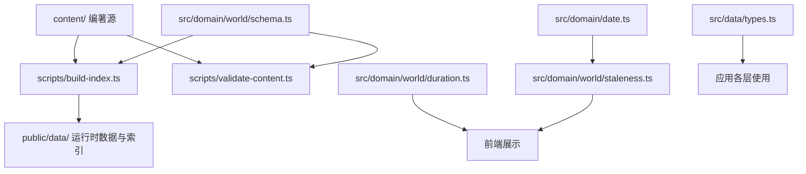
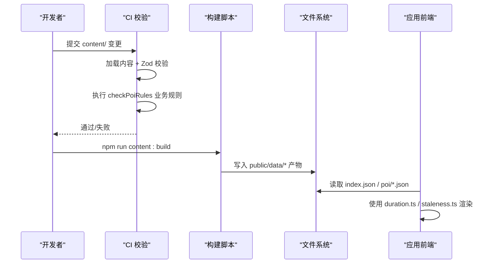
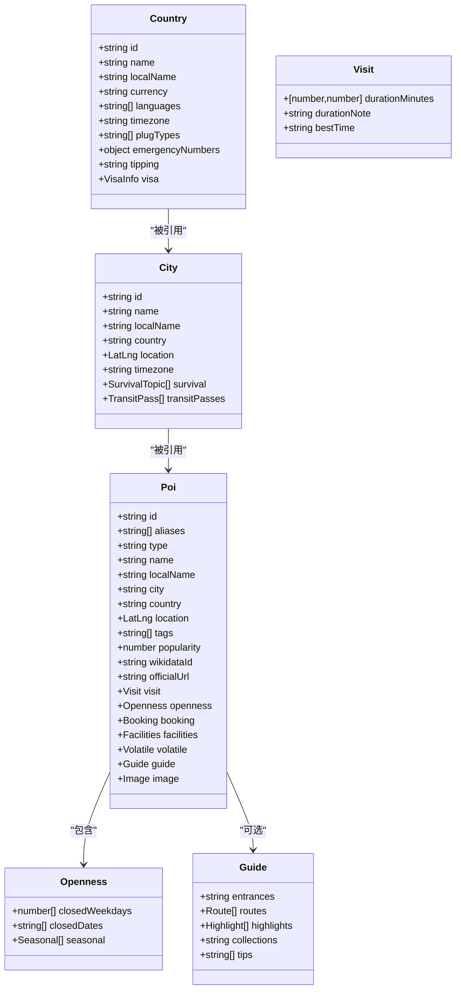
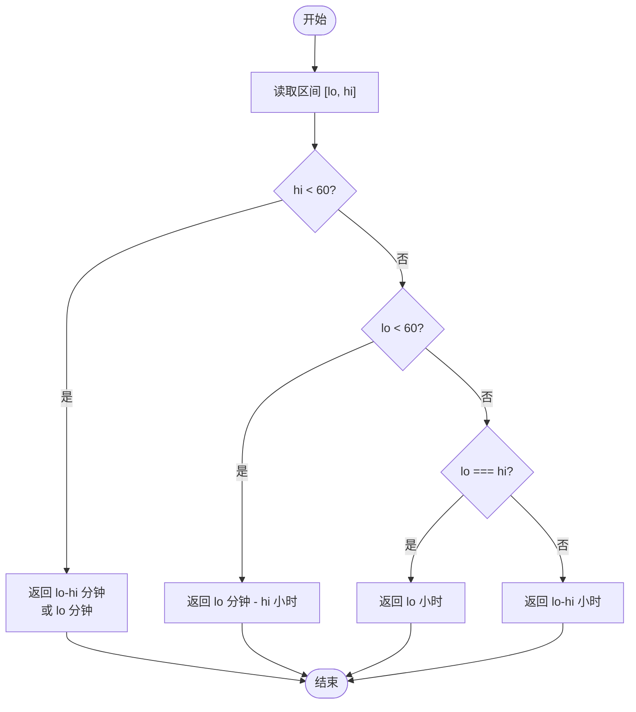
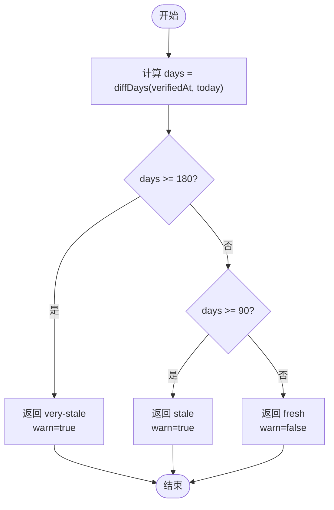
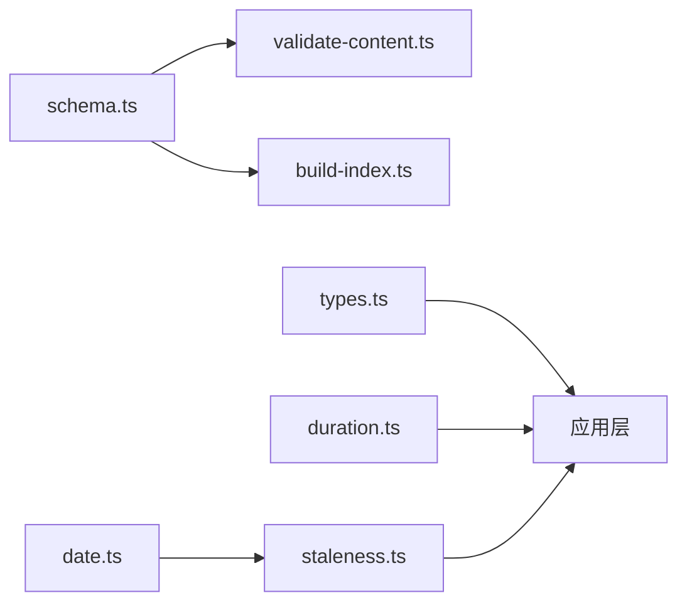

# 世界库领域逻辑

<cite>
**本文引用的文件**
- [schema.ts](file://src/domain/world/schema.ts)
- [duration.ts](file://src/domain/world/duration.ts)
- [staleness.ts](file://src/domain/world/staleness.ts)
- [date.ts](file://src/domain/date.ts)
- [types.ts](file://src/data/types.ts)
- [validate-content.ts](file://scripts/validate-content.ts)
- [build-index.ts](file://scripts/build-index.ts)
- [README.md](file://content/README.md)
- [ch.json](file://content/countries/ch.json)
- [lucerne.json](file://content/cities/lucerne.json)
- [eiffel-tower.json](file://content/pois/eiffel-tower.json)
</cite>

## 目录
1. [简介](#简介)
2. [项目结构](#项目结构)
3. [核心组件](#核心组件)
4. [架构总览](#架构总览)
5. [详细组件分析](#详细组件分析)
6. [依赖关系分析](#依赖关系分析)
7. [性能与索引优化](#性能与索引优化)
8. [数据验证规则](#数据验证规则)
9. [数据迁移与版本兼容](#数据迁移与版本兼容)
10. [故障排查指南](#故障排查指南)
11. [结论](#结论)

## 简介
本文件聚焦“世界库”领域的核心数据结构与管理逻辑，围绕国家、城市、景点（POI）的数据模型、旅行时长展示算法、数据新鲜度检测机制展开，并给出数据验证规则、索引优化建议、查询性能调优方案以及完整的数据迁移与版本兼容性处理指南。目标是让读者既能理解整体架构，也能在实现与维护中快速定位关键点。

## 项目结构
世界库采用“编著源 + 构建产物 + 运行时类型/工具”的分层组织：
- 编著源：content/ 下的国家、城市、景点 JSON 文件，由人类或 AI 编写，遵循规范。
- 构建产物：通过脚本将 content/ 编译为 public/data/ 的运行时数据与索引。
- 领域层：domain/world 提供 schema、时长格式化、时效性判定等核心逻辑；domain/date 提供纯字符串日期工具。
- 数据层：data/types.ts 定义仓库接口与聚合类型，屏蔽后端差异。
- 校验与构建：scripts/validate-content.ts 与 scripts/build-index.ts 分别负责 CI 门禁与产物生成。

图表来源
- [build-index.ts:1-120](file://scripts/build-index.ts#L1-L120)
- [validate-content.ts:1-76](file://scripts/validate-content.ts#L1-L76)
- [schema.ts:1-317](file://src/domain/world/schema.ts#L1-L317)
- [duration.ts:1-24](file://src/domain/world/duration.ts#L1-L24)
- [staleness.ts:1-49](file://src/domain/world/staleness.ts#L1-L49)
- [date.ts:1-69](file://src/domain/date.ts#L1-L69)
- [types.ts:1-300](file://src/data/types.ts#L1-L300)

章节来源
- [README.md:1-47](file://content/README.md#L1-L47)
- [build-index.ts:1-120](file://scripts/build-index.ts#L1-L120)
- [validate-content.ts:1-76](file://scripts/validate-content.ts#L1-L76)

## 核心组件
- 数据模型（schema.ts）：以 Zod 定义国家、城市、POI 的结构与约束，并提供业务规则校验函数。
- 时长展示（duration.ts）：将分钟区间格式化为自然文案，避免不自然的“0小时”或相同上下界显示区间。
- 新鲜度检测（staleness.ts）：基于 verifiedAt 计算信息是否过期，输出统一的新鲜度等级与警示标记。
- 日期工具（date.ts）：纯字符串日期操作，避免时区陷阱，提供工作日、月份日、日期差等能力。
- 数据层接口（types.ts）：定义世界库与行程相关类型及仓库接口，屏蔽存储实现差异。

章节来源
- [schema.ts:1-317](file://src/domain/world/schema.ts#L1-L317)
- [duration.ts:1-24](file://src/domain/world/duration.ts#L1-L24)
- [staleness.ts:1-49](file://src/domain/world/staleness.ts#L1-L49)
- [date.ts:1-69](file://src/domain/date.ts#L1-L69)
- [types.ts:1-300](file://src/data/types.ts#L1-L300)

## 架构总览
世界库从“编著源”到“运行态”的关键路径如下：
- 内容校验：CI 阶段调用 validate-content.ts，加载 content/ 下所有数据，执行 Zod 结构校验与 checkPoiRules 业务规则校验，错误则阻断构建。
- 索引构建：build-index.ts 读取已校验的内容，剥离编著期字段，生成 index.json、search.json、aliases.json 及各实体全文 JSON 到 public/data/。
- 运行时消费：前端通过 data/types.ts 定义的接口访问世界库数据，结合 duration.ts 与 staleness.ts 进行展示与提示。

图表来源
- [validate-content.ts:1-76](file://scripts/validate-content.ts#L1-L76)
- [build-index.ts:1-120](file://scripts/build-index.ts#L1-L120)
- [schema.ts:245-317](file://src/domain/world/schema.ts#L245-L317)

## 详细组件分析

### 数据模型（schema.ts）设计
- 公共基础类型：
  - IsoDate：严格 YYYY-MM-DD 格式，避免 Date 时区问题。
  - HttpsUrl：强制 https，确保官方来源可追溯。
  - Verifiable：易变字段统一封装 value/source/verifiedAt，保证“值+来源+核实时间”三要素齐全。
  - LatLng：经纬度范围校验，防止越界。
- 国家（Country）：
  - 包含 id、名称、货币、语言、时区、插头类型、紧急电话、小费提示、签证信息等。
  - 签证信息含申请渠道、材料、费用、处理天数、最早/最晚申请天数等结构化字段。
- 城市（City）：
  - 包含 id、名称、国家引用、位置、时区、生存主题（如支付、交通）、通票信息。
- POI（景点）：
  - 基础信息：id、类型、名称、所在城市与国家、坐标、标签、热度。
  - 游览信息：durationMinutes 为 [下限, 上限] 分钟区间，用于排程与体检。
  - 开放性：closedWeekdays、closedDates、seasonal 季节性开放区间，支撑闭馆日校验。
  - 预约：required/leadDays/url，驱动“该订票了”提醒。
  - 设施：卫生间、WiFi、无障碍等。
  - 易变字段：price/hours/booking 均走 Verifiable，便于时效管理。
  - 深导览：guide.routes/highlights/tips，要求亮点必须带展厅位置。
  - 图片：仅允许自由版权图源，需署名与许可证。
- 派生类型与摘要：
  - PoiSummary 精简投影，供列表页与地图使用，包含 closedWeekdays、hasGuide、durationMinutes 等。
- 业务规则校验（checkPoiRules）：
  - 引用完整性：城市与国家必须存在。
  - 坐标边界：按国家边界框检查，防止经纬写反。
  - 时长区间：下限不得大于上限。
  - 高热度博物馆：popularity ≥ 80 时必须配备 guide。
  - 易变字段时效：verifiedAt 不得晚于今天，超过 180 天未核实发出警告。
  - 待办项：_todo 非空时提示人工核实。

图表来源
- [schema.ts:43-218](file://src/domain/world/schema.ts#L43-L218)

章节来源
- [schema.ts:1-317](file://src/domain/world/schema.ts#L1-L317)

### 旅行时长计算（duration.ts）
- 输入：分钟区间 [lo, hi]。
- 目标：输出自然文案，避免“0小时”或相同上下界仍显示区间的问题。
- 规则：
  - 若上限小于 60 分钟，统一用“分钟”表示；上下界相同只显示一个值。
  - 若下限小于 60 分钟而上限达到小时级，混合显示“X 分钟 - Y 小时”。
  - 否则统一用“小时”表示；上下界相同只显示一个值。
- 复杂度：O(1)，无分支爆炸，适合高频渲染。

图表来源
- [duration.ts:1-24](file://src/domain/world/duration.ts#L1-L24)

章节来源
- [duration.ts:1-24](file://src/domain/world/duration.ts#L1-L24)

### 数据新鲜度检测（staleness.ts）
- 阈值：
  - STALE_DAYS = 90 天：超过此阈值显示“信息可能已过期”，并开启警示条。
  - VERY_STALE_DAYS = 180 天：超过此阈值显示“务必点官方源确认”，并开启警示条。
- 输入：verifiedAt（YYYY-MM-DD），today（默认当天）。
- 输出：FreshnessInfo，包含 level（fresh/stale/very-stale）、days、label、warn。
- 辅助：oldestVerification 取一组易变字段中最旧的 verifiedAt，用于卡片头部整体时效标记。
- 依赖：date.ts 的 diffDays 与 todayStr，避免时区问题。

图表来源
- [staleness.ts:1-49](file://src/domain/world/staleness.ts#L1-L49)
- [date.ts:33-56](file://src/domain/date.ts#L33-L56)

章节来源
- [staleness.ts:1-49](file://src/domain/world/staleness.ts#L1-L49)
- [date.ts:1-69](file://src/domain/date.ts#L1-L69)

### 数据层接口与聚合（types.ts）
- 世界库摘要：
  - WorldIndex：包含 countries、cities、pois 的轻量摘要，一次请求获取导航所需全部数据。
  - PoiSummary/CitySummary/CountrySummary：面向列表与地图的精简结构。
- 查询与搜索：
  - PoiQuery：支持按城市、类型、标签、关键词、排序过滤。
  - SearchHit：搜索结果条目，区分 city/poi 两类。
- 仓库接口：
  - WorldRepository：统一抽象 list/get/search 等操作，屏蔽本地/云端实现差异。
- 行程相关：
  - Trip/TripItem/TripDay/Ticket/Expense 等类型与接口，支撑行程编排、协作与结算。

章节来源
- [types.ts:1-300](file://src/data/types.ts#L1-L300)

## 依赖关系分析
- 领域层依赖：
  - schema.ts 依赖 zod 进行结构与业务规则校验。
  - staleness.ts 依赖 date.ts 的日期工具。
  - duration.ts 独立，无外部依赖。
- 构建与校验：
  - validate-content.ts 依赖 schema.ts 的 checkPoiRules 与 content-io.js 的内容加载。
  - build-index.ts 依赖 schema.ts 的类型与 content-io.js 的内容加载，生成运行时数据与索引。
- 数据层：
  - types.ts 引入 domain/world/schema 的类型，作为上层应用的契约。

图表来源
- [schema.ts:245-317](file://src/domain/world/schema.ts#L245-L317)
- [validate-content.ts:1-76](file://scripts/validate-content.ts#L1-L76)
- [build-index.ts:1-120](file://scripts/build-index.ts#L1-L120)
- [staleness.ts:1-49](file://src/domain/world/staleness.ts#L1-L49)
- [date.ts:1-69](file://src/domain/date.ts#L1-L69)
- [types.ts:1-300](file://src/data/types.ts#L1-L300)

章节来源
- [validate-content.ts:1-76](file://scripts/validate-content.ts#L1-L76)
- [build-index.ts:1-120](file://scripts/build-index.ts#L1-L120)
- [types.ts:1-300](file://src/data/types.ts#L1-L300)

## 性能与索引优化
- 构建产物优化：
  - index.json 聚合国家、城市、POI 摘要，减少多次请求。
  - search.json 提供轻量搜索记录，支持城市与 POI 文本检索。
  - aliases.json 维护旧 ID 到新 ID 的映射，保障老行程不断链。
- 运行时数据裁剪：
  - build-index.ts 在生成 poi/*.json 时剥离 _todo/_sources 等编著期字段，减小体积。
  - PoiSummary 仅保留必要字段，降低列表与地图渲染压力。
- 查询性能建议：
  - 使用 PoiQuery 的 types/tags/keyword 进行服务端或客户端预过滤，减少不必要的数据传输。
  - 对热门 POI 使用缓存策略（浏览器缓存或 CDN），结合 staleness.ts 的 warn 标志控制刷新频率。
- 索引优化建议：
  - 在数据库或搜索引擎中对 city、country、tags、type 建立索引，加速列表与筛选。
  - 对搜索词分词后建立倒排索引，提升 keyword 查询性能。

章节来源
- [build-index.ts:27-110](file://scripts/build-index.ts#L27-L110)
- [types.ts:46-79](file://src/data/types.ts#L46-L79)

## 数据验证规则
- 结构校验：
  - 所有字段遵循 schema.ts 中的 Zod 定义，包括必填、格式、枚举值、范围等。
- 业务规则校验（checkPoiRules）：
  - 引用完整性：POI 的 city 与 country 必须存在于全局集合中。
  - 坐标边界：根据 BBOX 检查 POI 坐标是否在国家境内，防止经纬写反。
  - 时长区间：visit.durationMinutes 的下限不得大于上限。
  - 高热度博物馆：popularity ≥ 80 时必须提供 guide。
  - 易变字段时效：verifiedAt 不得晚于今天；超过 180 天未核实发出警告。
  - 待办项：_todo 非空时提示人工核实。
- CI 门禁：
  - validate-content.ts 将结构错误与业务规则错误汇总，error 级导致构建失败，warn 级仅提示。

章节来源
- [schema.ts:245-317](file://src/domain/world/schema.ts#L245-L317)
- [validate-content.ts:1-76](file://scripts/validate-content.ts#L1-L76)

## 数据迁移与版本兼容
- 版本兼容策略：
  - 通过 aliases.json 维护旧 POI ID 到新 ID 的映射，确保历史行程链接有效。
  - 构建时剥离编著期字段（_todo/_sources），避免运行时污染。
- 迁移流程：
  - 更新 content/ 下的国家、城市、景点 JSON，遵循 schema.ts 的字段约定。
  - 运行 npm run content:validate 进行结构与业务规则校验。
  - 运行 npm run content:build 生成 public/data/ 的运行时数据与索引。
- 向后兼容：
  - 对于重命名的 POI，需在 aliases.json 中登记旧 ID 指向新 ID。
  - 对于新增字段，应在 schema.ts 中定义默认值或可选字段，避免破坏旧数据。
- 示例参考：
  - 国家数据：ch.json 展示签证信息与结构化字段。
  - 城市数据：lucerne.json 展示生存主题与通票信息。
  - 景点数据：eiffel-tower.json 展示游览时长、开放性、预约、易变字段与深导览。

章节来源
- [build-index.ts:108-110](file://scripts/build-index.ts#L108-L110)
- [ch.json:1-45](file://content/countries/ch.json#L1-L45)
- [lucerne.json:1-33](file://content/cities/lucerne.json#L1-L33)
- [eiffel-tower.json:1-72](file://content/pois/eiffel-tower.json#L1-L72)

## 故障排查指南
- 常见错误：
  - 结构错误：Zod 校验失败，检查字段类型、必填项、格式（如日期、URL）。
  - 业务规则错误：checkPoiRules 报错，检查引用完整性、坐标边界、时长区间、深导览缺失、时效性。
  - 构建失败：validate-content.ts 返回非零退出码，优先修复 error 级问题。
- 调试步骤：
  - 运行 npm run content:validate 查看具体错误文件与消息。
  - 检查 POI 的 openess.closedWeekdays/closedDates/seasonal 是否与实际情况一致。
  - 核对易变字段的 source 与 verifiedAt 是否齐全且合理。
- 日志与输出：
  - validate-content.ts 会打印错误与警告，包含文件路径与消息。
  - build-index.ts 会在构建前检查 validate 结果，失败则中止构建。

章节来源
- [validate-content.ts:20-73](file://scripts/validate-content.ts#L20-L73)
- [schema.ts:263-317](file://src/domain/world/schema.ts#L263-L317)

## 结论
世界库通过严格的 schema 定义、CI 门禁与构建产物优化，实现了从编著源到运行时的可靠转换。时长展示与新鲜度检测提供了良好的用户体验与可信度提示。配合数据层接口与索引优化，系统具备良好的扩展性与性能表现。建议在后续迭代中持续完善业务规则校验、索引设计与缓存策略，以提升整体质量与效率。