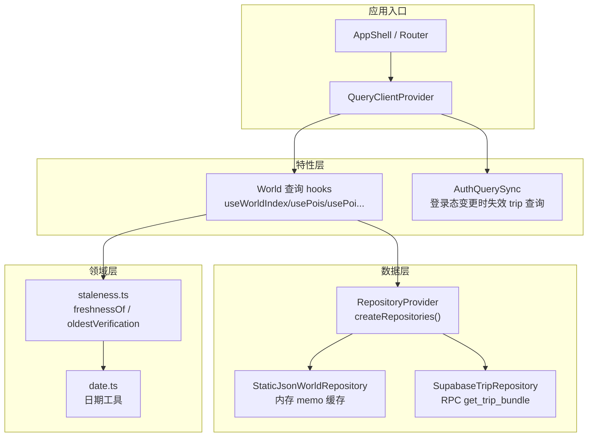
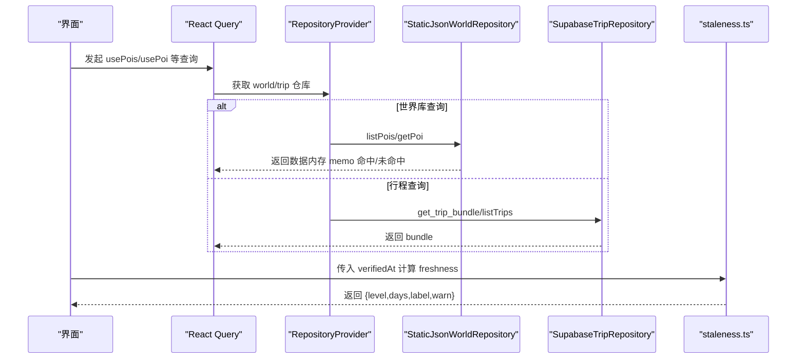
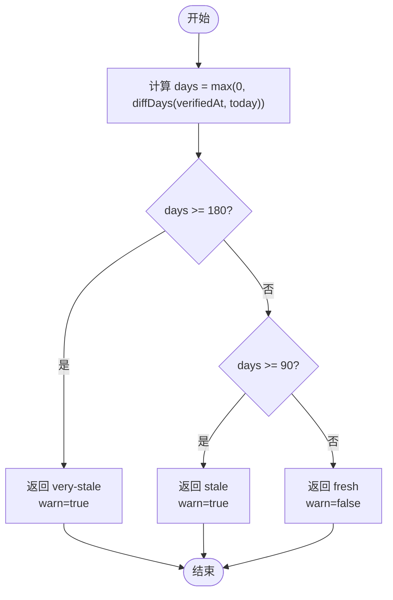
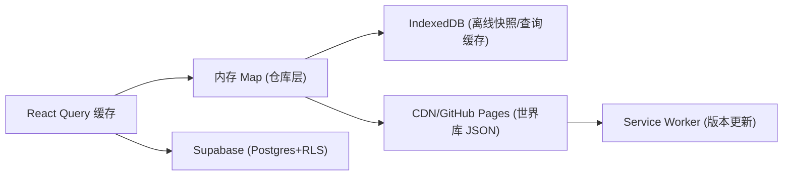
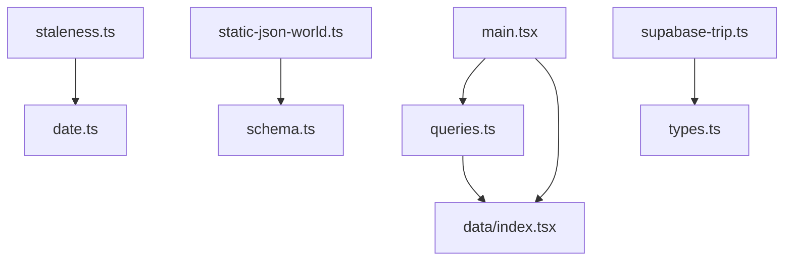

# 数据新鲜度管理

<cite>
**本文引用的文件**
- [staleness.ts](file://src/domain/world/staleness.ts)
- [date.ts](file://src/domain/date.ts)
- [queries.ts](file://src/features/world/queries.ts)
- [static-json-world.ts](file://src/data/adapters/static-json-world.ts)
- [index.tsx](file://src/data/index.tsx)
- [types.ts](file://src/data/types.ts)
- [supabase-trip.ts](file://src/data/adapters/supabase-trip.ts)
- [AuthQuerySync.tsx](file://src/features/auth/AuthQuerySync.tsx)
- [main.tsx](file://src/app/main.tsx)
- [技术方案.md](file://docs/技术方案.md)
</cite>

## 目录
1. [引言](#引言)
2. [项目结构](#项目结构)
3. [核心组件](#核心组件)
4. [架构总览](#架构总览)
5. [详细组件分析](#详细组件分析)
6. [依赖关系分析](#依赖关系分析)
7. [性能考量](#性能考量)
8. [故障排查指南](#故障排查指南)
9. [结论](#结论)
10. [附录](#附录)

## 引言
本文件聚焦“数据新鲜度管理机制”，围绕易变信息（如价格、开放时间、预约政策等）的过期判断、缓存策略（TTL、失效触发、增量更新）、多级缓存（本地内存到持久化存储）、数据同步（后台任务、手动刷新、实时通知）、监控与告警、以及版本管理与回滚策略进行系统化说明。目标是让读者理解：系统如何在不承诺实时的前提下，提供可追溯、可感知、可恢复的新鲜度保障。

## 项目结构
本项目采用分层架构：领域层（domain）封装纯函数与类型；数据访问层（data）通过 Repository 接口屏蔽后端差异；特性层（features）组合查询与 UI；应用入口（app）装配全局状态与路由。世界库为静态内容，行程数据走云端或本地适配器。

图表来源
- [main.tsx:1-37](file://src/app/main.tsx#L1-L37)
- [queries.ts:1-62](file://src/features/world/queries.ts#L1-L62)
- [index.tsx:1-57](file://src/data/index.tsx#L1-L57)
- [static-json-world.ts:1-167](file://src/data/adapters/static-json-world.ts#L1-L167)
- [supabase-trip.ts:1-548](file://src/data/adapters/supabase-trip.ts#L1-L548)
- [staleness.ts:1-49](file://src/domain/world/staleness.ts#L1-L49)
- [date.ts:1-69](file://src/domain/date.ts#L1-L69)

章节来源
- [main.tsx:1-37](file://src/app/main.tsx#L1-L37)
- [index.tsx:1-57](file://src/data/index.tsx#L1-L57)

## 核心组件
- 时效性判定：基于 verifiedAt 计算距今天数，划分 fresh/stale/very-stale，并输出是否展示警示条。
- 世界库查询：使用 TanStack Query，世界库为静态资源，配置 staleTime/gcTime 为 Infinity，运行时永不过期。
- 仓库适配：静态 JSON 仓库在内存中 memo 缓存请求结果；行程仓库通过 Supabase RPC 一次性拉取完整 bundle。
- 认证同步：登录态变化时主动失效 trip 相关查询，避免陈旧结果被缓存。
- 日期工具：统一以 YYYY-MM-DD 字符串处理日期，避免时区问题影响天数差计算。

章节来源
- [staleness.ts:1-49](file://src/domain/world/staleness.ts#L1-L49)
- [queries.ts:1-62](file://src/features/world/queries.ts#L1-L62)
- [static-json-world.ts:1-167](file://src/data/adapters/static-json-world.ts#L1-L167)
- [supabase-trip.ts:1-548](file://src/data/adapters/supabase-trip.ts#L1-L548)
- [AuthQuerySync.tsx:1-26](file://src/features/auth/AuthQuerySync.tsx#L1-L26)
- [date.ts:1-69](file://src/domain/date.ts#L1-L69)

## 架构总览
数据新鲜度由“领域层判定 + 查询层缓存 + 仓库层加载”共同构成：
- 领域层 staleness 负责将 verifiedAt 转换为可读的新鲜度等级与提示文案。
- 查询层使用 React Query 控制缓存生命周期；世界库设为永久缓存，行程数据按业务设定 TTL。
- 仓库层对静态 JSON 做内存级 memo 缓存，对云端数据通过 RPC 聚合减少往返。

图表来源
- [queries.ts:1-62](file://src/features/world/queries.ts#L1-L62)
- [static-json-world.ts:1-167](file://src/data/adapters/static-json-world.ts#L1-L167)
- [supabase-trip.ts:1-548](file://src/data/adapters/supabase-trip.ts#L1-L548)
- [staleness.ts:1-49](file://src/domain/world/staleness.ts#L1-L49)

## 详细组件分析

### 时效性检测算法
- 输入：verifiedAt（YYYY-MM-DD），可选 today（默认当天）。
- 逻辑：
  - 计算 days = max(0, diffDays(verifiedAt, today))。
  - 若 days >= 180 → very-stale（强警示）。
  - 若 days >= 90 → stale（弱警示）。
  - 否则 → fresh（无警示）。
- 聚合：对一组易变字段（如价格、开放时间、预约政策）分别带 verifiedAt，取最旧的一条作为卡片整体时效标记。

图表来源
- [staleness.ts:22-31](file://src/domain/world/staleness.ts#L22-L31)
- [date.ts:33-35](file://src/domain/date.ts#L33-L35)

章节来源
- [staleness.ts:1-49](file://src/domain/world/staleness.ts#L1-L49)
- [date.ts:1-69](file://src/domain/date.ts#L1-L69)

### 缓存策略设计（TTL、失效触发、增量更新）
- 世界库（静态内容）：
  - 查询配置：staleTime: Infinity, gcTime: Infinity，运行时永不过期。
  - 仓库层：内存 Map 缓存 fetch Promise，失败则删除 key 重试。
  - 版本变更：由构建产物与 Service Worker 处理，前端不主动刷新。
- 行程数据（动态内容）：
  - 查询配置：根据技术方案约定，trip bundle 设置较短 staleTime（例如 30s），trip list 更长（例如 60s）。
  - 写操作：乐观更新，onMutate 直接修改缓存，失败回滚并 toast。
  - 失效触发：登录态变化时，主动 invalidateQueries(['trip']) 强制重拉。
- 增量更新：
  - 世界库：通过构建期生成 index/search/aliases，运行时只读。
  - 行程：通过 RPC 一次性拉取 bundle，减少多次往返；后续扩展可结合 Supabase Realtime 实现增量推送（当前方案强调 M4 接管）。

章节来源
- [queries.ts:1-62](file://src/features/world/queries.ts#L1-L62)
- [static-json-world.ts:1-167](file://src/data/adapters/static-json-world.ts#L1-L167)
- [AuthQuerySync.tsx:1-26](file://src/features/auth/AuthQuerySync.tsx#L1-L26)
- [技术方案.md:394-420](file://docs/技术方案.md#L394-L420)

### 多级缓存架构（本地内存到持久化存储）
- 浏览器内存缓存：
  - React Query 维护查询结果与元数据（staleTime/gcTime）。
  - StaticJsonWorldRepository 内部 Map 缓存 fetch Promise，避免重复网络请求。
- 持久化存储：
  - IndexedDB：用于离线快照与查询缓存（见架构图中的“IndexedDB 查询缓存”）。
  - 本地 localStorage：开发模式下行程数据暂存（LocalTripRepository），生产环境切换至 Supabase。
- 服务端缓存：
  - Supabase Postgres + RLS 保护数据访问；RPC 聚合减少往返。
  - 世界库 JSON 由 CDN/GitHub Pages 缓存，配合 SW 处理版本更新。

图表来源
- [main.tsx:1-37](file://src/app/main.tsx#L1-L37)
- [static-json-world.ts:1-167](file://src/data/adapters/static-json-world.ts#L1-L167)
- [技术方案.md:90-125](file://docs/技术方案.md#L90-L125)

### 数据同步策略（后台任务、手动刷新、实时通知）
- 后台定时任务：
  - 世界库：构建期生成索引与搜索数据，部署后由 SW 处理版本更新；运行时不主动刷新。
  - 行程数据：当前未内置后台轮询；可通过扩展 React Query 的 refetchInterval 实现定时刷新（需评估成本）。
- 手动刷新接口：
  - 世界库：无需手动刷新（静态内容）。
  - 行程：用户触发重新登录/登出时，AuthQuerySync 自动失效 trip 查询；也可在 UI 暴露“刷新”按钮调用 queryClient.invalidateQueries。
- 实时通知机制：
  - 当前方案强调“不承诺实时”，M4 引入 Supabase Realtime 接管实时性；现阶段以查询缓存与失效策略为主。

章节来源
- [AuthQuerySync.tsx:1-26](file://src/features/auth/AuthQuerySync.tsx#L1-L26)
- [main.tsx:1-37](file://src/app/main.tsx#L1-L37)
- [技术方案.md:394-420](file://docs/技术方案.md#L394-L420)

### 监控与告警系统（数据质量与用户反馈）
- 数据质量：
  - 世界库 JSON 结构异常：zod safeParse 失败时降级渲染已知字段，控制台输出告警。
  - 行程数据：RPC 错误分类处理（如 FORBIDDEN 提示登录），外键约束错误给出明确提示。
- 用户反馈：
  - Toast 提示：写操作失败时通过 Toast 反馈。
  - 时效性警示：staleness 输出 warn 标志，界面显示警示条引导用户前往官方源确认。
- 建议扩展：
  - 接入前端埋点（DevAgentation）收集关键路径错误率与耗时。
  - 对 staleness 阈值（90/180 天）与缓存命中率建立指标看板。

章节来源
- [static-json-world.ts:67-76](file://src/data/adapters/static-json-world.ts#L67-L76)
- [supabase-trip.ts:159-166](file://src/data/adapters/supabase-trip.ts#L159-L166)
- [supabase-trip.ts:355-364](file://src/data/adapters/supabase-trip.ts#L355-L364)
- [staleness.ts:22-31](file://src/domain/world/staleness.ts#L22-L31)

### 数据版本管理与回滚策略（确保一致性）
- 世界库版本：
  - git 历史管理 content/**/*.json；CI 校验 schema；合并后构建生成 data/**.json。
  - aliases.json 支持 id 重定向，保证旧引用不断链。
- 行程数据版本：
  - updated_at 字段记录更新时间；导出快照用于分享与离线。
  - 写操作乐观更新，失败回滚缓存并提示。
- 回滚策略：
  - 世界库：git revert 旧版本并重新部署。
  - 行程：通过备份快照恢复；Supabase 提供时间点恢复能力（需平台支持）。

章节来源
- [static-json-world.ts:129-137](file://src/data/adapters/static-json-world.ts#L129-L137)
- [supabase-trip.ts:159-198](file://src/data/adapters/supabase-trip.ts#L159-L198)
- [技术方案.md:115-125](file://docs/技术方案.md#L115-L125)

## 依赖关系分析
- 领域层依赖：
  - staleness.ts 依赖 date.ts 的 diffDays/todayStr。
- 特性层依赖：
  - queries.ts 依赖 data/index.tsx 提供的 useWorld/useTripRepo。
- 数据层依赖：
  - static-json-world.ts 依赖 domain/world/schema.ts（zod 校验）。
  - supabase-trip.ts 依赖 supabase-client 与 types.ts。
- 应用入口依赖：
  - main.tsx 装配 QueryClientProvider、RepositoryProvider、AuthQuerySync。

图表来源
- [staleness.ts:1-49](file://src/domain/world/staleness.ts#L1-L49)
- [date.ts:1-69](file://src/domain/date.ts#L1-L69)
- [queries.ts:1-62](file://src/features/world/queries.ts#L1-L62)
- [static-json-world.ts:1-167](file://src/data/adapters/static-json-world.ts#L1-L167)
- [supabase-trip.ts:1-548](file://src/data/adapters/supabase-trip.ts#L1-L548)
- [main.tsx:1-37](file://src/app/main.tsx#L1-L37)

章节来源
- [queries.ts:1-62](file://src/features/world/queries.ts#L1-L62)
- [index.tsx:1-57](file://src/data/index.tsx#L1-L57)

## 性能考量
- 世界库查询：
  - 内存 memo 缓存避免重复 fetch；staleTime/gcTime 无穷大减少 GC 压力。
- 行程查询：
  - 一次性 bundle 减少往返；短 TTL 平衡新鲜度与性能。
- 网络优化：
  - Supabase RPC 聚合数据；SW 缓存静态资源。
- 降级策略：
  - POI 结构异常时降级渲染；地图瓦片失败时显示占位。

[本节为通用指导，无需具体文件分析]

## 故障排查指南
- 世界库资源缺失：
  - 现象：fetch 返回非 2xx 状态码。
  - 处理：抛出错误提示先运行 content:build。
- POI 结构异常：
  - 现象：zod safeParse 失败。
  - 处理：控制台告警，降级渲染已知字段。
- 权限问题：
  - 现象：RPC 返回 FORBIDDEN。
  - 处理：提示用户登录。
- 外键约束冲突：
  - 现象：删除成员时报错。
  - 处理：提示先处理账目再移除。

章节来源
- [static-json-world.ts:21-25](file://src/data/adapters/static-json-world.ts#L21-L25)
- [static-json-world.ts:67-76](file://src/data/adapters/static-json-world.ts#L67-L76)
- [supabase-trip.ts:159-166](file://src/data/adapters/supabase-trip.ts#L159-L166)
- [supabase-trip.ts:355-364](file://src/data/adapters/supabase-trip.ts#L355-L364)

## 结论
本系统通过“领域层时效性判定 + 查询层缓存策略 + 仓库层多级缓存”构建了稳健的数据新鲜度管理机制。世界库作为静态知识，运行时永不过期；行程数据通过短 TTL 与乐观更新保障交互流畅；登录态变化触发查询失效，避免陈旧结果。未来可扩展 Supabase Realtime 实现实时同步，并完善监控与告警体系，进一步提升数据质量与用户体验。

[本节为总结，无需具体文件分析]

## 附录
- 关键常量：
  - STALE_DAYS = 90
  - VERY_STALE_DAYS = 180
- 查询 Key 约定：
  - ['world','pois', cityId, filterHash] staleTime: Infinity
  - ['world','poi', poiId] staleTime: Infinity
  - ['trip','bundle', tripId] staleTime: 30_000
  - ['trip','list'] staleTime: 60_000

章节来源
- [staleness.ts:9-10](file://src/domain/world/staleness.ts#L9-L10)
- [技术方案.md:411-418](file://docs/技术方案.md#L411-L418)