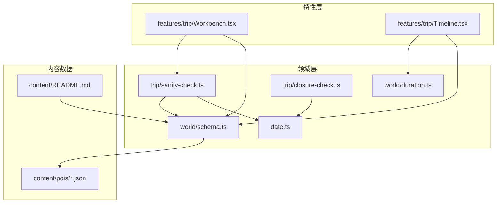
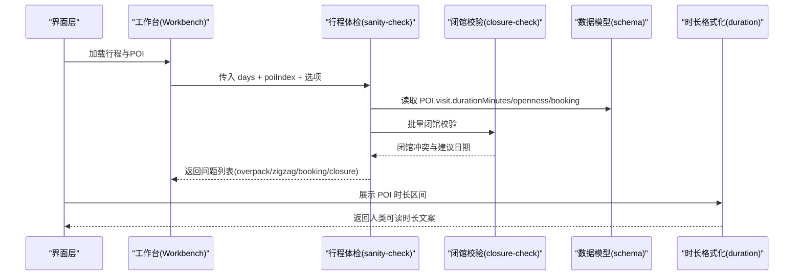
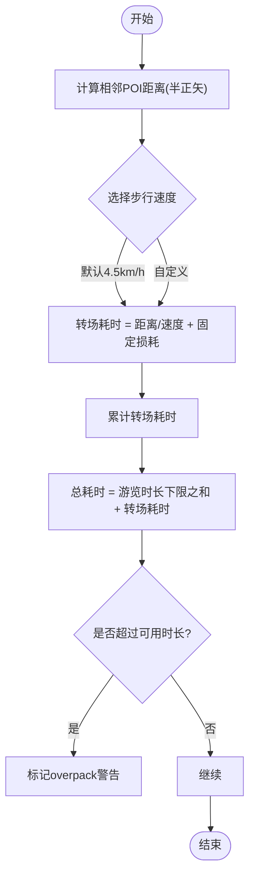
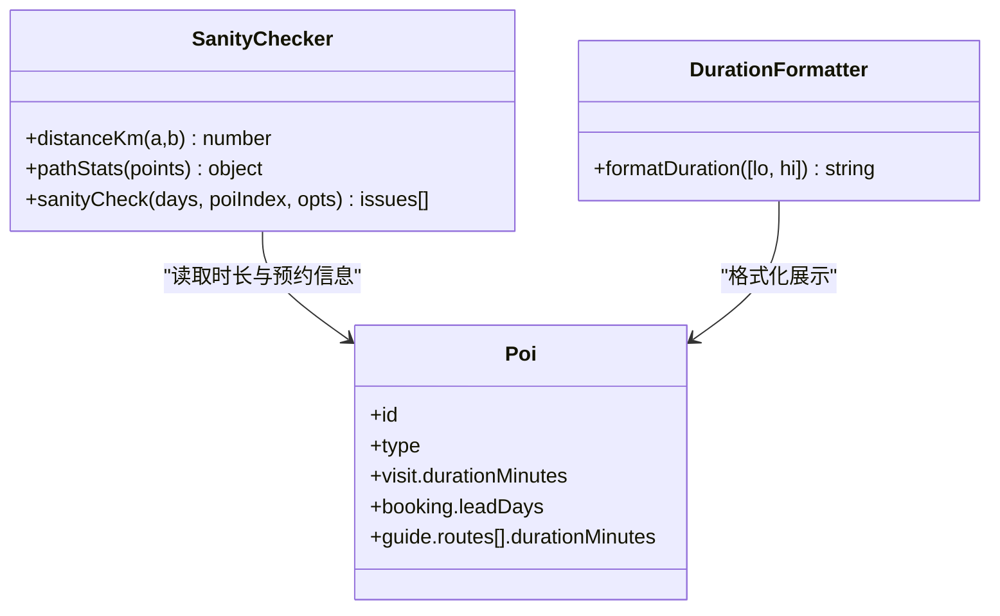
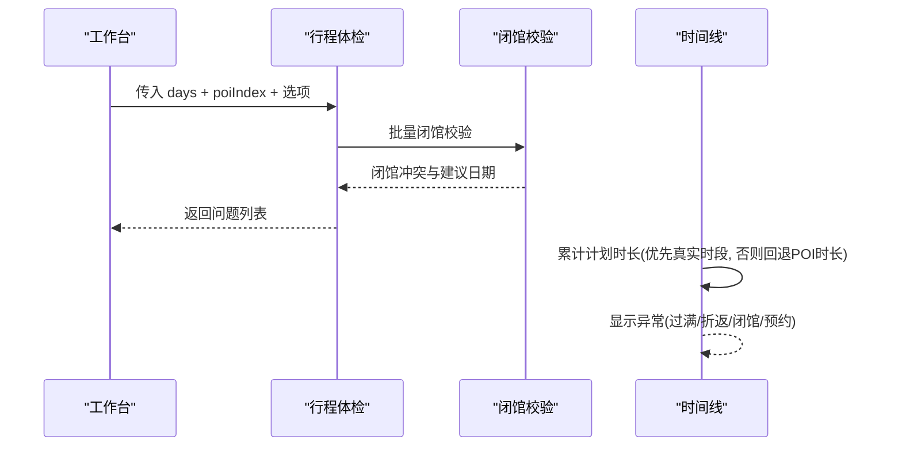
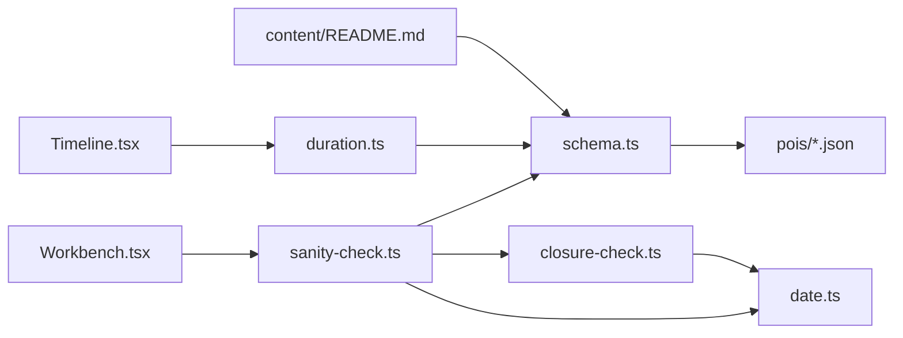

# 旅行时长计算

<cite>
**本文引用的文件**
- [duration.ts](file://src/domain/world/duration.ts)
- [schema.ts](file://src/domain/world/schema.ts)
- [sanity-check.ts](file://src/domain/trip/sanity-check.ts)
- [closure-check.ts](file://src/domain/trip/closure-check.ts)
- [date.ts](file://src/domain/date.ts)
- [技术方案.md](file://docs/技术方案.md)
- [README.md](file://content/README.md)
- [louvre.json](file://content/pois/louvre.json)
- [colosseum.json](file://content/pois/colosseum.json)
- [eiffel-tower.json](file://content/pois/eiffel-tower.json)
- [Workbench.tsx](file://src/features/trip/Workbench.tsx)
- [Timeline.tsx](file://src/features/trip/Timeline.tsx)
</cite>

## 目录
1. [简介](#简介)
2. [项目结构](#项目结构)
3. [核心组件](#核心组件)
4. [架构总览](#架构总览)
5. [详细组件分析](#详细组件分析)
6. [依赖关系分析](#依赖关系分析)
7. [性能考虑](#性能考虑)
8. [故障排查指南](#故障排查指南)
9. [结论](#结论)
10. [附录](#附录)

## 简介
本模块聚焦“旅行时长计算”，围绕以下目标展开：
- 基于地理位置的旅行时间估算：以景点间距离与步行速度估算转场耗时，结合景点基础游览时长进行综合评估。
- 游览时长综合计算：以结构化时长区间为基础，叠加排队等待与特殊活动时间的加权策略（通过数据字段与规则表达）。
- 不同景点类型的差异化调整：博物馆、地标建筑、公园等类型在闭馆规则、预约提前期、导览路线等方面影响时长与可用性。
- 多目的地行程优化：提供最短路径启发式、折返检测与时间冲突检测（闭馆、排太满、预约死线），辅助生成更合理的日程。
- 性能优化与缓存：构建期索引、查询键与离线缓存策略，确保大规模景点集合下的计算效率。

## 项目结构
与旅行时长计算直接相关的代码集中在领域层 domain 与特性层 features：
- 领域层 domain
  - world/schema.ts：POI、城市、国家的数据模型与业务规则校验，包含 visit.durationMinutes、openness、booking 等关键字段。
  - world/duration.ts：将分钟区间格式化为人类可读的时长文案。
  - trip/sanity-check.ts：行程合理性体检，含距离计算、转场耗时、折返检测、预约死线检查。
  - trip/closure-check.ts：闭馆日校验，支持固定闭馆日、周几闭馆、季节性开放区间。
  - date.ts：纯字符串日期工具，避免时区陷阱。
- 特性层 features
  - Workbench.tsx：聚合 POI 信息并调用 sanityCheck 生成问题列表。
  - Timeline.tsx：时间线渲染中按条目计划时长累加，回退到 POI 参观时长。
- 内容数据 content
  - pois/*.json：各景点的结构化数据，包含 visit.durationMinutes、openness、booking、guide.routes.durationMinutes 等。
  - README.md：世界库编写规范，强调 durationMinutes 与 openness 必须结构化，供算法使用。

图表来源
- [sanity-check.ts:84-176](file://src/domain/trip/sanity-check.ts#L84-L176)
- [closure-check.ts:38-97](file://src/domain/trip/closure-check.ts#L38-L97)
- [schema.ts:157-218](file://src/domain/world/schema.ts#L157-L218)
- [duration.ts:8-23](file://src/domain/world/duration.ts#L8-L23)
- [Workbench.tsx:122-150](file://src/features/trip/Workbench.tsx#L122-L150)
- [Timeline.tsx:350-355](file://src/features/trip/Timeline.tsx#L350-L355)

章节来源
- [sanity-check.ts:56-176](file://src/domain/trip/sanity-check.ts#L56-L176)
- [schema.ts:109-218](file://src/domain/world/schema.ts#L109-L218)
- [duration.ts:8-23](file://src/domain/world/duration.ts#L8-L23)
- [Workbench.tsx:122-150](file://src/features/trip/Workbench.tsx#L122-L150)
- [Timeline.tsx:350-355](file://src/features/trip/Timeline.tsx#L350-L355)
- [README.md:13-31](file://content/README.md#L13-L31)

## 核心组件
- 时长展示格式化（world/duration.ts）
  - 将 POI 的 visit.durationMinutes 区间转换为自然语言，如“90-120 分钟”或“1.5-2 小时”，避免四舍五入导致的“0 小时”等不自然文案。
- 数据结构与规则（world/schema.ts）
  - POI 的 visit.durationMinutes 为 [下限, 上限] 分钟，用于“一天排太满”体检与时长估算。
  - openness 结构化闭馆规则（closedWeekdays、closedDates、seasonal），支撑闭馆冲突检测。
  - booking.leadDays 驱动预约提醒；guide.routes[].durationMinutes 提供分路线时长参考。
- 行程体检（trip/sanity-check.ts）
  - 距离计算：半正矢公式估算公里数。
  - 转场耗时：按平均步行速度 km/h 计算相邻景点间的步行时间，并加入固定损耗（如安检、找路）。
  - 排太满检测：当日所有 POI 的下限时长之和 + 转场耗时 > 可用时长则报警。
  - 折返检测：路径总长与首尾直线距离比值过高提示走回头路。
  - 预约死线：对比 today 与 day.date，若剩余天数小于 leadDays 且未购票则告警。
- 闭馆校验（trip/closure-check.ts）
  - 判断指定日期是否因周几、固定日期或季节性区间而闭馆。
  - 在同程内推荐可替换的开放日期。
- 日期工具（date.ts）
  - 纯字符串日期运算，避免跨时区 Date 解析陷阱。

章节来源
- [duration.ts:8-23](file://src/domain/world/duration.ts#L8-L23)
- [schema.ts:157-218](file://src/domain/world/schema.ts#L157-L218)
- [sanity-check.ts:56-176](file://src/domain/trip/sanity-check.ts#L56-L176)
- [closure-check.ts:38-97](file://src/domain/trip/closure-check.ts#L38-L97)
- [date.ts:14-69](file://src/domain/date.ts#L14-L69)

## 架构总览
旅行时长计算由“数据模型 + 算法 + UI 集成”三层构成：
- 数据模型层：POI 的 visit.durationMinutes、openness、booking、guide.routes.durationMinutes 提供结构化输入。
- 算法层：sanity-check 负责转场耗时、排太满、折返检测；closure-check 负责闭馆冲突；duration 负责时长文案。
- UI 集成层：Workbench 聚合 POI 并触发体检；Timeline 累计计划时长并显示异常状态。

图表来源
- [sanity-check.ts:84-176](file://src/domain/trip/sanity-check.ts#L84-L176)
- [closure-check.ts:73-97](file://src/domain/trip/closure-check.ts#L73-L97)
- [schema.ts:157-218](file://src/domain/world/schema.ts#L157-L218)
- [duration.ts:8-23](file://src/domain/world/duration.ts#L8-L23)
- [Workbench.tsx:122-150](file://src/features/trip/Workbench.tsx#L122-L150)

## 详细组件分析

### 基于地理位置的旅行时间估算
- 距离计算：采用半正矢公式，输入两个经纬度点，输出公里数。
- 转场耗时：相邻 POI 的距离除以平均步行速度（默认 4.5 km/h），加上固定损耗（如安检、找路约 10 分钟），得到每段转场时间。
- 路径统计：计算当日路线总长与首尾直线距离比值，超过阈值提示可能走回头路。

图表来源
- [sanity-check.ts:56-82](file://src/domain/trip/sanity-check.ts#L56-L82)
- [sanity-check.ts:114-132](file://src/domain/trip/sanity-check.ts#L114-L132)

章节来源
- [sanity-check.ts:56-82](file://src/domain/trip/sanity-check.ts#L56-L82)
- [sanity-check.ts:114-132](file://src/domain/trip/sanity-check.ts#L114-L132)

### 游览时长综合计算方法
- 基础游览时间：来自 POI.visit.durationMinutes 的区间，取下限用于“排太满”体检，取上限用于更宽松估算。
- 排队等待时间：通过 booking.leadDays 与 hasTicket 状态间接体现；若需预约且未购票，会在预约死线检查中标记风险。
- 特殊活动时间：通过 guide.routes[].durationMinutes 提供分路线时长参考，可在 UI 中作为“精华/细逛”的时长依据。
- 展示格式化：duration.ts 将分钟区间转为自然语言，避免“0小时”等不自然文案。

图表来源
- [schema.ts:157-218](file://src/domain/world/schema.ts#L157-L218)
- [duration.ts:8-23](file://src/domain/world/duration.ts#L8-L23)
- [sanity-check.ts:84-176](file://src/domain/trip/sanity-check.ts#L84-L176)

章节来源
- [schema.ts:157-218](file://src/domain/world/schema.ts#L157-L218)
- [duration.ts:8-23](file://src/domain/world/duration.ts#L8-L23)
- [sanity-check.ts:84-176](file://src/domain/trip/sanity-check.ts#L84-L176)

### 不同景点类型的时长调整策略
- 博物馆（museum）：高热度博物馆强制要求配备 guide 深导览；guide.routes[].durationMinutes 可作为分路线时长参考；openness.closedWeekdays/closedDates/seasonal 严格限制可用日期。
- 地标建筑（landmark）：通常需预约（booking.required=true），leadDays 较大（如埃菲尔铁塔建议提前30天），影响预约死线检测；bestTime 指导最佳时段。
- 公园（park）：多为户外，受季节性开放影响更大（seasonal 区间），openness.seasonal 决定是否在特定月份开放。
- 其他类型（viewpoint/church/market/station/facility/other）：根据具体数据字段（如 facilities.accessible、bestTime）影响体验与时长。

章节来源
- [schema.ts:109-155](file://src/domain/world/schema.ts#L109-L155)
- [schema.ts:157-218](file://src/domain/world/schema.ts#L157-L218)
- [louvre.json:13-27](file://content/pois/louvre.json#L13-L27)
- [colosseum.json:13-27](file://content/pois/colosseum.json#L13-L27)
- [eiffel-tower.json:13-27](file://content/pois/eiffel-tower.json#L13-L27)

### 多目的地行程总时长优化与冲突检测
- 最短路径规划：当前实现采用“顺序累计”的启发式，通过 pathStats 检测折返（detourRatio），提示调整顺序以减少绕路。
- 时间冲突检测：
  - 闭馆冲突：closure-check 对每个 POI 在指定日期进行闭馆判断，并提供同程内可替换日期建议。
  - 排太满：sanity-check 将 POI 下限时长与转场耗时相加，超过可用时长则报警。
  - 预约死线：对比 today 与 day.date，若剩余天数小于 leadDays 且未购票则告警。
- 可视化集成：Workbench 聚合 POI 并调用 sanityCheck；Timeline 累计计划时长并显示异常状态。

图表来源
- [sanity-check.ts:84-176](file://src/domain/trip/sanity-check.ts#L84-L176)
- [closure-check.ts:73-97](file://src/domain/trip/closure-check.ts#L73-L97)
- [Workbench.tsx:122-150](file://src/features/trip/Workbench.tsx#L122-L150)
- [Timeline.tsx:350-355](file://src/features/trip/Timeline.tsx#L350-L355)

章节来源
- [sanity-check.ts:84-176](file://src/domain/trip/sanity-check.ts#L84-L176)
- [closure-check.ts:73-97](file://src/domain/trip/closure-check.ts#L73-L97)
- [Workbench.tsx:122-150](file://src/features/trip/Workbench.tsx#L122-L150)
- [Timeline.tsx:350-355](file://src/features/trip/Timeline.tsx#L350-L355)

## 依赖关系分析
- 领域层内部依赖
  - sanity-check 依赖 schema（POI 结构）、date（日期工具）、closure-check（闭馆规则）。
  - closure-check 依赖 date（weekday、monthDay）。
  - duration 独立，仅消费 POI 的时长区间。
- 特性层依赖
  - Workbench 依赖 schema（PoiSummary/Poi）与 sanity-check。
  - Timeline 依赖 duration 与 schema。
- 内容数据依赖
  - pois/*.json 提供 visit.durationMinutes、openness、booking、guide.routes.durationMinutes。
  - content/README.md 强调这些字段必须结构化，供算法使用。

图表来源
- [sanity-check.ts:84-176](file://src/domain/trip/sanity-check.ts#L84-L176)
- [closure-check.ts:73-97](file://src/domain/trip/closure-check.ts#L73-L97)
- [schema.ts:157-218](file://src/domain/world/schema.ts#L157-L218)
- [duration.ts:8-23](file://src/domain/world/duration.ts#L8-L23)
- [Workbench.tsx:122-150](file://src/features/trip/Workbench.tsx#L122-L150)
- [Timeline.tsx:350-355](file://src/features/trip/Timeline.tsx#L350-L355)
- [README.md:13-31](file://content/README.md#L13-L31)

章节来源
- [sanity-check.ts:84-176](file://src/domain/trip/sanity-check.ts#L84-L176)
- [closure-check.ts:73-97](file://src/domain/trip/closure-check.ts#L73-L97)
- [schema.ts:157-218](file://src/domain/world/schema.ts#L157-L218)
- [duration.ts:8-23](file://src/domain/world/duration.ts#L8-L23)
- [Workbench.tsx:122-150](file://src/features/trip/Workbench.tsx#L122-L150)
- [Timeline.tsx:350-355](file://src/features/trip/Timeline.tsx#L350-L355)
- [README.md:13-31](file://content/README.md#L13-L31)

## 性能考虑
- 构建期索引：世界库索引与搜索索引在构建期生成，减少运行时开销。
- 查询键与缓存：静态内容使用长 staleTime（甚至无限），行程 bundle 使用较短 staleTime；离线快照通过 IndexedDB 提供只读能力。
- 纯函数与无副作用：domain 层全部为纯函数，便于单测与缓存；避免 React 与网络依赖。
- 批量处理：sanity-check 对日程进行批量闭馆校验与体检，减少重复计算。
- 路径统计优化：pathStats 仅一次遍历计算总长与跨度，避免多次距离计算。

章节来源
- [技术方案.md:407-429](file://docs/技术方案.md#L407-L429)
- [sanity-check.ts:84-176](file://src/domain/trip/sanity-check.ts#L84-L176)

## 故障排查指南
- 闭馆冲突
  - 现象：某 POI 被安排在闭馆日。
  - 排查：检查 openness.closedWeekdays、closedDates、seasonal；查看 closure-check 返回的建议日期。
  - 解决：调整到同程内开放日期或使用一键改期建议。
- 排太满
  - 现象：当日总时长超过可用时长。
  - 排查：确认 POI.visit.durationMinutes 下限与转场耗时；检查步行速度与固定损耗设置。
  - 解决：减少 POI 数量或调整顺序以降低转场耗时。
- 折返跑
  - 现象：路径总长远大于首尾直线距离。
  - 排查：查看 pathStats.detourRatio；调整 POI 顺序以减少绕路。
- 预约死线
  - 现象：距出发不足 leadDays 且未购票。
  - 排查：检查 booking.required 与 hasTicket；确认 today 与 day.date 差值。
  - 解决：尽快购票或调整行程日期。

章节来源
- [closure-check.ts:38-97](file://src/domain/trip/closure-check.ts#L38-L97)
- [sanity-check.ts:114-176](file://src/domain/trip/sanity-check.ts#L114-L176)

## 结论
本模块通过结构化数据与纯函数算法，实现了可靠的旅行时长估算与行程体检：
- 以 visit.durationMinutes 为基础，结合 opennes 与 booking 规则，形成可验证的时长与可用性判断。
- 通过距离与步行速度估算转场耗时，辅以折返检测，提升日程合理性。
- 闭馆冲突、排太满、预约死线三类冲突检测覆盖常见痛点，提供可执行建议。
- 构建期索引与缓存策略保障大规模景点集合下的计算效率。

## 附录
- 示例数据
  - 卢浮宫：visit.durationMinutes=[180,300]，booking.leadDays=7，openness.closedWeekdays=[2]。
  - 斗兽场：visit.durationMinutes=[90,180]，booking.leadDays=14，openness.closedDates=["2026-01-01","2026-12-25"]。
  - 埃菲尔铁塔：visit.durationMinutes=[90,150]，booking.leadDays=30，openness.closedDates=[]。

章节来源
- [louvre.json:13-27](file://content/pois/louvre.json#L13-L27)
- [colosseum.json:13-27](file://content/pois/colosseum.json#L13-L27)
- [eiffel-tower.json:13-27](file://content/pois/eiffel-tower.json#L13-L27)