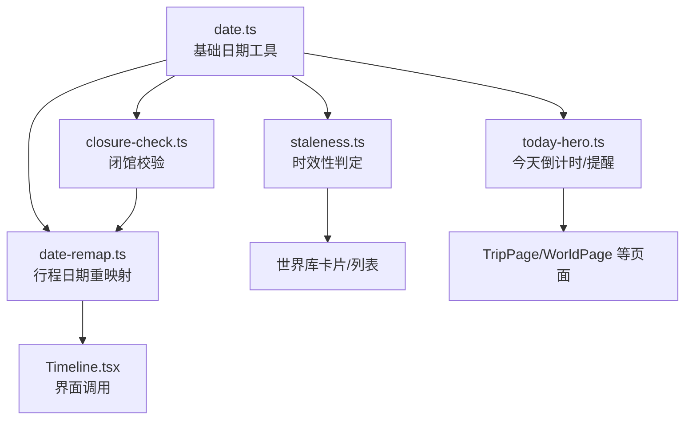
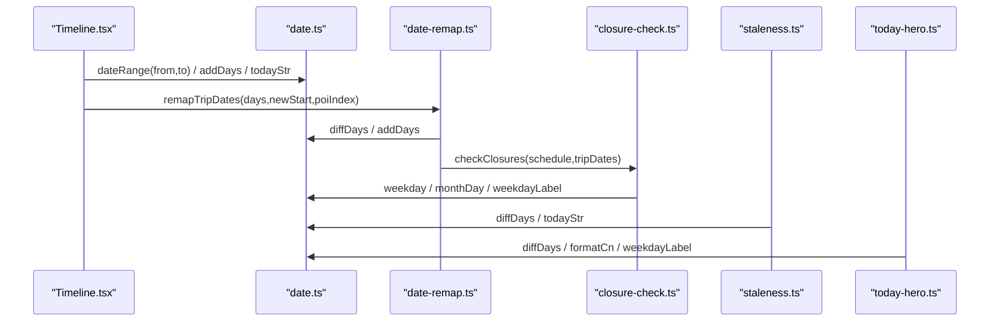
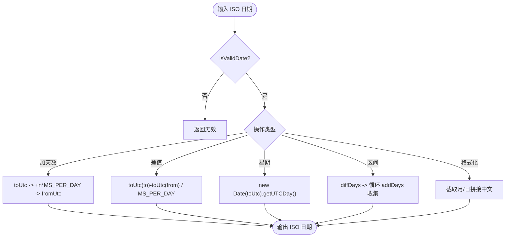
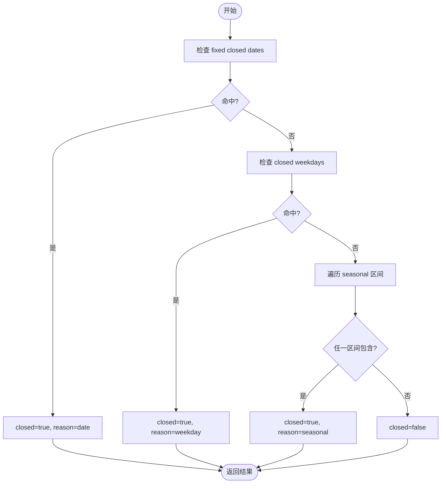
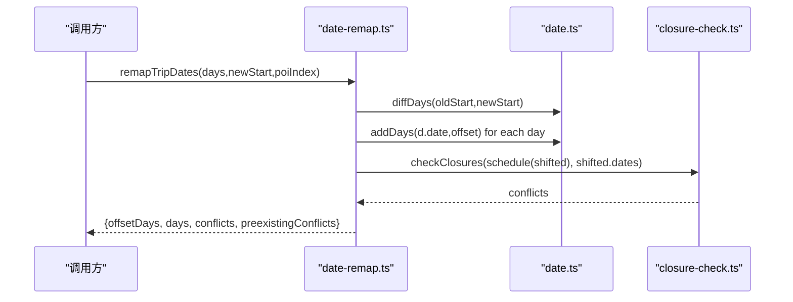
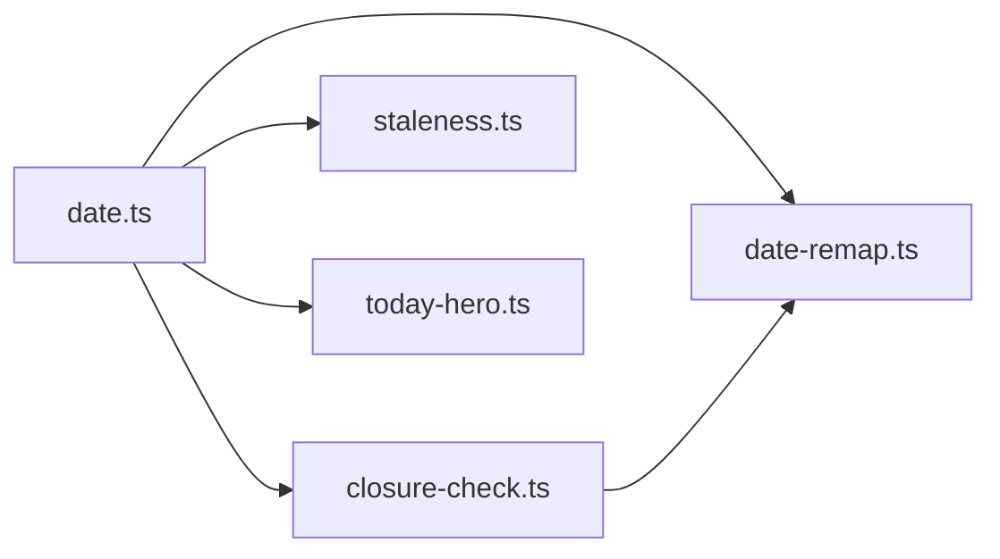

# 日期工具函数

<cite>
**本文引用的文件**
- [src/domain/date.ts](file://src/domain/date.ts)
- [src/domain/trip/closure-check.ts](file://src/domain/trip/closure-check.ts)
- [src/domain/trip/date-remap.ts](file://src/domain/trip/date-remap.ts)
- [src/domain/world/duration.ts](file://src/domain/world/duration.ts)
- [src/domain/world/staleness.ts](file://src/domain/world/staleness.ts)
- [src/domain/trip/today-hero.ts](file://src/domain/trip/today-hero.ts)
- [src/features/trip/Timeline.tsx](file://src/features/trip/Timeline.tsx)
</cite>

## 目录
1. [简介](#简介)
2. [项目结构](#项目结构)
3. [核心组件](#核心组件)
4. [架构总览](#架构总览)
5. [详细组件分析](#详细组件分析)
6. [依赖关系分析](#依赖关系分析)
7. [性能与内存优化](#性能与内存优化)
8. [故障排查指南](#故障排查指南)
9. [结论](#结论)
10. [附录：API 参考与使用示例](#附录api-参考与使用示例)

## 简介
本仓库的日期相关能力围绕“日历日”这一概念构建，避免使用 Date 对象直接处理业务日期，从而规避跨时区解析带来的偏移问题。核心策略是：
- 以 ISO 字符串（YYYY-MM-DD）作为唯一日期表示；
- 在内部统一通过 UTC 毫秒进行加减、比较和区间计算；
- 对外暴露格式化、解析校验、星期、区间生成等纯函数；
- 将国际化/本地化展示逻辑与计算逻辑解耦，仅在中文化场景提供固定文案映射。

该设计确保行程规划、闭馆校验、时效性判断、倒计时等上层功能稳定可靠，且易于测试与维护。

## 项目结构
与日期相关的代码主要分布在 domain 层，按领域划分：
- 基础日期工具：src/domain/date.ts
- 闭馆规则与冲突检测：src/domain/trip/closure-check.ts
- 行程日期重映射：src/domain/trip/date-remap.ts
- 时长展示格式化：src/domain/world/duration.ts
- 信息时效性判定：src/domain/world/staleness.ts
- “今天”页倒计时与提醒：src/domain/trip/today-hero.ts
- 界面侧对日期工具的调用：src/features/trip/Timeline.tsx

图表来源
- [src/domain/date.ts:14-68](file://src/domain/date.ts#L14-L68)
- [src/domain/trip/closure-check.ts:11-98](file://src/domain/trip/closure-check.ts#L11-L98)
- [src/domain/trip/date-remap.ts:7-54](file://src/domain/trip/date-remap.ts#L7-L54)
- [src/domain/world/staleness.ts:7-49](file://src/domain/world/staleness.ts#L7-L49)
- [src/domain/trip/today-hero.ts:11-119](file://src/domain/trip/today-hero.ts#L11-L119)
- [src/features/trip/Timeline.tsx:536-556](file://src/features/trip/Timeline.tsx#L536-L556)

章节来源
- [src/domain/date.ts:1-68](file://src/domain/date.ts#L1-L68)
- [src/domain/trip/closure-check.ts:1-98](file://src/domain/trip/closure-check.ts#L1-L98)
- [src/domain/trip/date-remap.ts:1-55](file://src/domain/trip/date-remap.ts#L1-L55)
- [src/domain/world/duration.ts:1-24](file://src/domain/world/duration.ts#L1-L24)
- [src/domain/world/staleness.ts:1-49](file://src/domain/world/staleness.ts#L1-L49)
- [src/domain/trip/today-hero.ts:1-119](file://src/domain/trip/today-hero.ts#L1-L119)
- [src/features/trip/Timeline.tsx:536-556](file://src/features/trip/Timeline.tsx#L536-L556)

## 核心组件
- 基础日期工具（ISO 字符串）：提供合法性校验、加减天数、差值、星期、月日片段、今日字符串、日期区间、中文月份日格式化等。
- 闭馆校验：基于每周闭馆日、固定闭馆日、季节性开放区间，判断某 POI 在某日是否闭馆，并给出同程内可替换日期建议。
- 行程日期重映射：将整份行程按新出发日整体平移，并立即做闭馆冲突检测，区分“新增冲突”与“既有冲突”。
- 时长格式化：将分钟区间转换为自然可读的小时/分钟文案，处理不足一小时、整小时、跨小时区间等边界情况。
- 时效性判定：根据核实时间计算新鲜度等级，用于提示用户信息可能过期。
- “今天”页：计算最近行程日的倒计时，并推导待订票、打包未完成、签证、货币等提醒。

章节来源
- [src/domain/date.ts:10-68](file://src/domain/date.ts#L10-L68)
- [src/domain/trip/closure-check.ts:14-98](file://src/domain/trip/closure-check.ts#L14-L98)
- [src/domain/trip/date-remap.ts:10-54](file://src/domain/trip/date-remap.ts#L10-L54)
- [src/domain/world/duration.ts:8-23](file://src/domain/world/duration.ts#L8-L23)
- [src/domain/world/staleness.ts:9-49](file://src/domain/world/staleness.ts#L9-L49)
- [src/domain/trip/today-hero.ts:15-119](file://src/domain/trip/today-hero.ts#L15-L119)

## 架构总览
下图展示了日期工具在各模块间的调用关系与数据流。

图表来源
- [src/features/trip/Timeline.tsx:536-556](file://src/features/trip/Timeline.tsx#L536-L556)
- [src/domain/trip/date-remap.ts:25-54](file://src/domain/trip/date-remap.ts#L25-L54)
- [src/domain/trip/closure-check.ts:37-98](file://src/domain/trip/closure-check.ts#L37-L98)
- [src/domain/world/staleness.ts:22-49](file://src/domain/world/staleness.ts#L22-L49)
- [src/domain/trip/today-hero.ts:37-119](file://src/domain/trip/today-hero.ts#L37-L119)
- [src/domain/date.ts:14-68](file://src/domain/date.ts#L14-L68)

## 详细组件分析

### 基础日期工具（ISO 字符串）
- 设计要点
  - 所有日期以 YYYY-MM-DD 字符串流转，避免 Date 对象在不同时区的解析差异。
  - 内部通过 UTC 毫秒进行加减与差值计算，保证跨时区一致性。
  - 提供常用操作：合法性校验、加天数、差值、星期、月日片段、区间生成、中文格式化。
- 关键算法
  - toUtc/fromUtc：将 ISO 字符串与 UTC 毫秒互转，统一时区基准。
  - addDays/diffDays：基于每日固定毫秒数进行整数天运算，避免浮点误差。
  - weekday：基于 UTC 获取星期，与闭馆规则的 closedWeekdays 对齐。
  - dateRange：生成闭区间内的所有日期，用于批量补全日程。
  - formatCn：简单中文“X月Y日”格式，便于本地化展示。
- 复杂度
  - addDays/diffDays/weekday：O(1)。
  - dateRange：O(n)，n 为区间天数。
- 错误处理
  - isValidDate：正则 + 往返转换校验，拒绝非法或越界日期。
- 适用场景
  - 行程排期、闭馆校验、时效性判断、“今天”页倒计时等。

图表来源
- [src/domain/date.ts:14-68](file://src/domain/date.ts#L14-L68)

章节来源
- [src/domain/date.ts:10-68](file://src/domain/date.ts#L10-L68)

### 闭馆校验
- 设计要点
  - 严格依赖结构化 openness 字段，不解析自然语言时段。
  - 支持三类闭馆规则：固定日期、每周固定星期、季节性区间（含跨年）。
  - 批量校验时，结合整趟行程日期，给出同程内可替换日期建议。
- 关键算法
  - isClosedOn：依次检查固定日期、星期、季节性区间。
  - openDatesAmong：从候选日期中过滤出开放日期。
  - checkClosures：遍历日程，产出冲突及建议。
- 复杂度
  - isClosedOn：O(k)，k 为季节性区间数量。
  - checkClosures：O(m*k + m*t)，m 为日程项数，t 为 tripDates 长度。
- 错误处理
  - 当无可用替换日期时，message 明确提示“本次行程内没有可替换的日期”。

图表来源
- [src/domain/trip/closure-check.ts:32-54](file://src/domain/trip/closure-check.ts#L32-L54)

章节来源
- [src/domain/trip/closure-check.ts:14-98](file://src/domain/trip/closure-check.ts#L14-L98)

### 行程日期重映射
- 设计要点
  - 将整份行程按新出发日整体平移，保持相对间隔不变。
  - 平移后立即做闭馆冲突检测，并区分“新增冲突”与“既有冲突”，便于用户决策。
- 关键流程
  - 排序原始日程，计算 offsetDays = diffDays(oldStart, newStartDate)。
  - 对所有日程应用 addDays(offsetDays)。
  - 构造 scheduleOf 映射到 POI，调用 checkClosures 得到冲突与建议。
- 复杂度
  - 排序 O(n log n)，平移 O(n)，冲突检测 O(n*k + n*t)。

图表来源
- [src/domain/trip/date-remap.ts:25-54](file://src/domain/trip/date-remap.ts#L25-L54)
- [src/domain/trip/closure-check.ts:73-98](file://src/domain/trip/closure-check.ts#L73-L98)
- [src/domain/date.ts:29-35](file://src/domain/date.ts#L29-L35)

章节来源
- [src/domain/trip/date-remap.ts:1-55](file://src/domain/trip/date-remap.ts#L1-L55)

### 时长格式化
- 设计要点
  - 针对分钟区间 [lo, hi] 输出自然文案，避免“0-0 小时”等反直觉显示。
  - 不足一小时用分钟；整小时显示整数；非整小时保留一位小数；跨小时区间混排。
- 复杂度
  - O(1)。

章节来源
- [src/domain/world/duration.ts:8-23](file://src/domain/world/duration.ts#L8-L23)

### 时效性判定
- 设计要点
  - 依据 verifiedAt 与 today 的天数差，划分 fresh/stale/very-stale 三级。
  - 提供 oldestVerification 聚合一组易变字段的最旧核实时间，用于卡片头部统一标记。
- 复杂度
  - freshnessOf：O(1)。
  - oldestVerification：O(n)。

章节来源
- [src/domain/world/staleness.ts:9-49](file://src/domain/world/staleness.ts#L9-L49)

### “今天”页倒计时与提醒
- 设计要点
  - 若今天命中某天则 matched=true，由上层正常渲染当天。
  - 否则计算绝对天数最近的行程日，输出倒计时文案与城市名。
  - 推导提醒：待订票、打包未完成、需办签证、目的地货币。
- 复杂度
  - 排序 O(n log n)，遍历 O(n)。

章节来源
- [src/domain/trip/today-hero.ts:15-119](file://src/domain/trip/today-hero.ts#L15-L119)

## 依赖关系分析
- 耦合与内聚
  - date.ts 作为基础设施，被多个领域模块复用，内聚度高、耦合低。
  - closure-check.ts 依赖 date.ts 的 weekday/monthDay/weekdayLabel，形成单向依赖。
  - date-remap.ts 组合 date.ts 与 closure-check.ts，实现“平移+校验”的高内聚能力。
  - staleness.ts 与 today-hero.ts 仅依赖 date.ts，职责清晰。
- 外部依赖
  - 仅依赖标准 Date API 的 UTC 方法，无第三方库，降低运行时风险。
- 潜在循环依赖
  - 当前依赖方向为 date.ts <- 其他模块，无环。

图表来源
- [src/domain/date.ts:14-68](file://src/domain/date.ts#L14-L68)
- [src/domain/trip/closure-check.ts:11-98](file://src/domain/trip/closure-check.ts#L11-L98)
- [src/domain/trip/date-remap.ts:7-54](file://src/domain/trip/date-remap.ts#L7-L54)
- [src/domain/world/staleness.ts:7-49](file://src/domain/world/staleness.ts#L7-L49)
- [src/domain/trip/today-hero.ts:11-119](file://src/domain/trip/today-hero.ts#L11-L119)

章节来源
- [src/domain/date.ts:14-68](file://src/domain/date.ts#L14-L68)
- [src/domain/trip/closure-check.ts:11-98](file://src/domain/trip/closure-check.ts#L11-L98)
- [src/domain/trip/date-remap.ts:7-54](file://src/domain/trip/date-remap.ts#L7-L54)
- [src/domain/world/staleness.ts:7-49](file://src/domain/world/staleness.ts#L7-L49)
- [src/domain/trip/today-hero.ts:11-119](file://src/domain/trip/today-hero.ts#L11-L119)

## 性能与内存优化
- 时间复杂度
  - 基础操作均为 O(1)，dateRange 为 O(n)，checkClosures 为 O(m*(k+t))，remapTripDates 为 O(n log n + m*(k+t))。
- 空间复杂度
  - 除 dateRange 返回数组外，其余多为常数级额外空间。
- 内存泄漏防护
  - 所有函数为纯函数，不持有全局可变状态，不会造成隐式引用累积。
  - 避免在高频渲染路径创建大对象；如 dateRange 仅在需要时调用。
- 性能建议
  - 批量操作优先：使用 dateRange 一次性补齐日程，减少多次 I/O。
  - 缓存热点：对频繁查询的 POI openness 索引建议在调用方缓存（如 poiIndex），避免重复查找。
  - 限制建议数量：openDatesAmong 已 slice(0,3)，避免过长文案。
  - 避免不必要的排序：仅在必要时对日程排序（如 remapTripDates）。

[本节为通用指导，不直接分析具体文件]

## 故障排查指南
- 日期偏移问题
  - 现象：跨时区下日期前后跳一天。
  - 原因：直接使用 Date 解析字符串导致本地时区影响。
  - 解决：始终使用 date.ts 的 ISO 字符串工具，内部统一走 UTC。
- 闭馆误判
  - 现象：POI 明明开放却提示闭馆。
  - 排查：核对 openness.closedWeekdays、closedDates、seasonal 区间是否准确；确认 weekday 与 closedWeekdays 对齐。
- 改期后冲突未检出
  - 现象：平移后撞闭馆但未提示。
  - 排查：确认调用了 checkClosures 并传入完整的 tripDates；检查 poiIndex 是否正确映射。
- 时长显示异常
  - 现象：出现“0-0 小时”或区间不自然。
  - 解决：使用 duration.formatDuration，其已处理边界情况。
- 时效性标签不准确
  - 现象：fresh/stale/very-stale 不符合预期。
  - 排查：确认 verifiedAt 与 today 格式一致；检查 STALE_DAYS/VERY_STALE_DAYS 阈值。

章节来源
- [src/domain/date.ts:24-40](file://src/domain/date.ts#L24-L40)
- [src/domain/trip/closure-check.ts:37-98](file://src/domain/trip/closure-check.ts#L37-L98)
- [src/domain/world/duration.ts:8-23](file://src/domain/world/duration.ts#L8-L23)
- [src/domain/world/staleness.ts:22-49](file://src/domain/world/staleness.ts#L22-L49)

## 结论
本项目以 ISO 字符串为核心，构建了稳健的日期工具集，有效规避了跨时区陷阱，并为行程规划、闭馆校验、时效性判断等提供了可靠的底层支撑。各模块职责清晰、纯函数化程度高，便于测试与扩展。建议在后续迭代中继续遵循“计算与展示分离”的原则，按需引入更多本地化能力。

[本节为总结，不直接分析具体文件]

## 附录：API 参考与使用示例

### 基础日期工具（date.ts）
- isValidDate(d): 校验 YYYY-MM-DD 是否合法。
- addDays(d, n): 日期加 n 天。
- diffDays(from, to): 两日相差天数。
- weekday(d): 返回 0-6（周日到周六）。
- weekdayLabel(d): 中文星期文案。
- monthDay(d): 返回“MM-DD”，用于季节性区间比较。
- todayStr(now?): 返回今日 ISO 字符串。
- dateRange(from, to): 生成闭区间内所有日期。
- formatCn(d): 中文“X月Y日”。

使用示例（路径引用）
- 批量补齐日程：见 [Timeline.tsx:536-556](file://src/features/trip/Timeline.tsx#L536-L556)
- 计算星期与中文文案：见 [closure-check.ts:45-46](file://src/domain/trip/closure-check.ts#L45-L46)
- 生成区间并遍历：见 [date.ts:59-64](file://src/domain/date.ts#L59-L64)

章节来源
- [src/domain/date.ts:24-68](file://src/domain/date.ts#L24-L68)
- [src/features/trip/Timeline.tsx:536-556](file://src/features/trip/Timeline.tsx#L536-L556)
- [src/domain/trip/closure-check.ts:45-46](file://src/domain/trip/closure-check.ts#L45-L46)

### 闭馆校验（closure-check.ts）
- isClosedOn(openness, date): 判断某日是否闭馆，返回 closed/reason/detail。
- openDatesAmong(openness, candidates): 筛选开放日期。
- checkClosures(scheduled, tripDates?): 批量校验并生成冲突与建议。

使用示例（路径引用）
- 批量校验与改期建议：见 [closure-check.ts:73-98](file://src/domain/trip/closure-check.ts#L73-L98)
- 季节性区间判断：见 [closure-check.ts:32-54](file://src/domain/trip/closure-check.ts#L32-L54)

章节来源
- [src/domain/trip/closure-check.ts:32-98](file://src/domain/trip/closure-check.ts#L32-L98)

### 行程日期重映射（date-remap.ts）
- remapTripDates(days, newStartDate, poiIndex): 整体平移并校验冲突，返回 offsetDays、shifted days、conflicts、preexistingConflicts。

使用示例（路径引用）
- 平移与冲突检测：见 [date-remap.ts:25-54](file://src/domain/trip/date-remap.ts#L25-L54)

章节来源
- [src/domain/trip/date-remap.ts:25-54](file://src/domain/trip/date-remap.ts#L25-L54)

### 时长格式化（duration.ts）
- formatDuration([lo, hi]): 将分钟区间转为自然文案。

使用示例（路径引用）
- 单元测试覆盖多种边界：见 [duration.test.ts:4-23](file://src/domain/world/duration.test.ts#L4-L23)

章节来源
- [src/domain/world/duration.ts:8-23](file://src/domain/world/duration.ts#L8-L23)

### 时效性判定（staleness.ts）
- freshnessOf(verifiedAt, today?): 返回新鲜度等级、天数、文案与是否警示。
- oldestVerification(fields, today?): 取最旧核实时间并计算整体新鲜度。

使用示例（路径引用）
- 阈值与文案生成：见 [staleness.ts:22-49](file://src/domain/world/staleness.ts#L22-L49)

章节来源
- [src/domain/world/staleness.ts:22-49](file://src/domain/world/staleness.ts#L22-L49)

### “今天”页（today-hero.ts）
- computeTodayHero({ today, bundle, poiMap?, cities, countries }): 计算 matched/headline/sub/reminders。

使用示例（路径引用）
- 倒计时与提醒推导：见 [today-hero.ts:37-119](file://src/domain/trip/today-hero.ts#L37-L119)

章节来源
- [src/domain/trip/today-hero.ts:37-119](file://src/domain/trip/today-hero.ts#L37-L119)