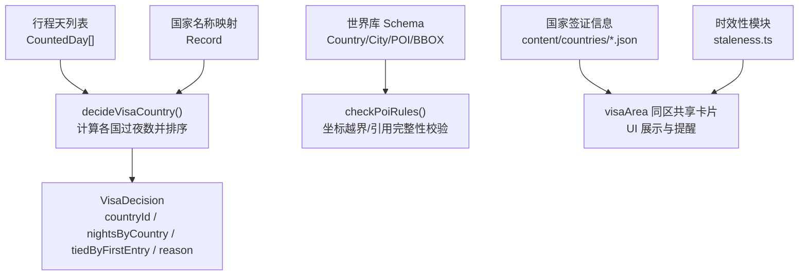
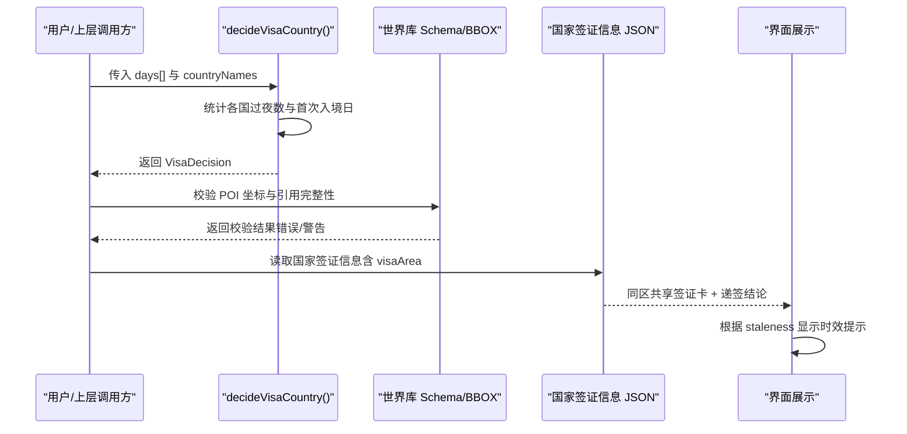
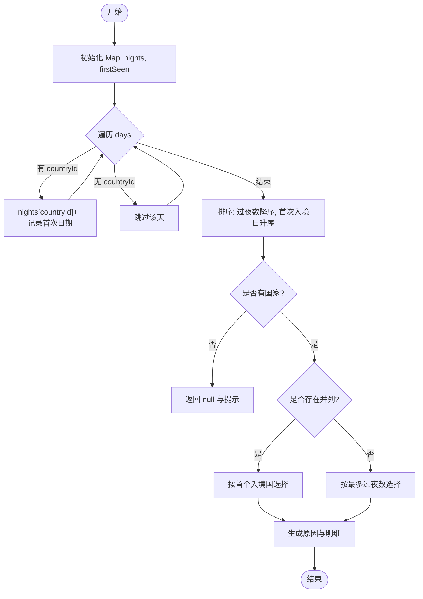
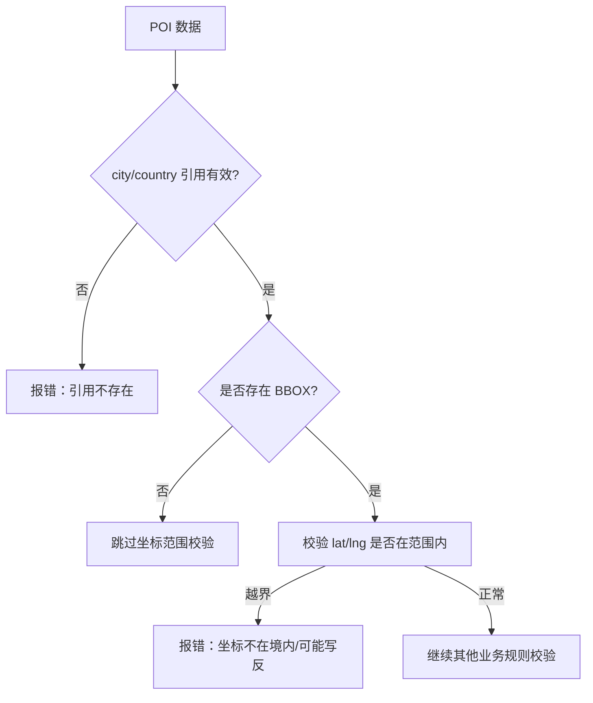
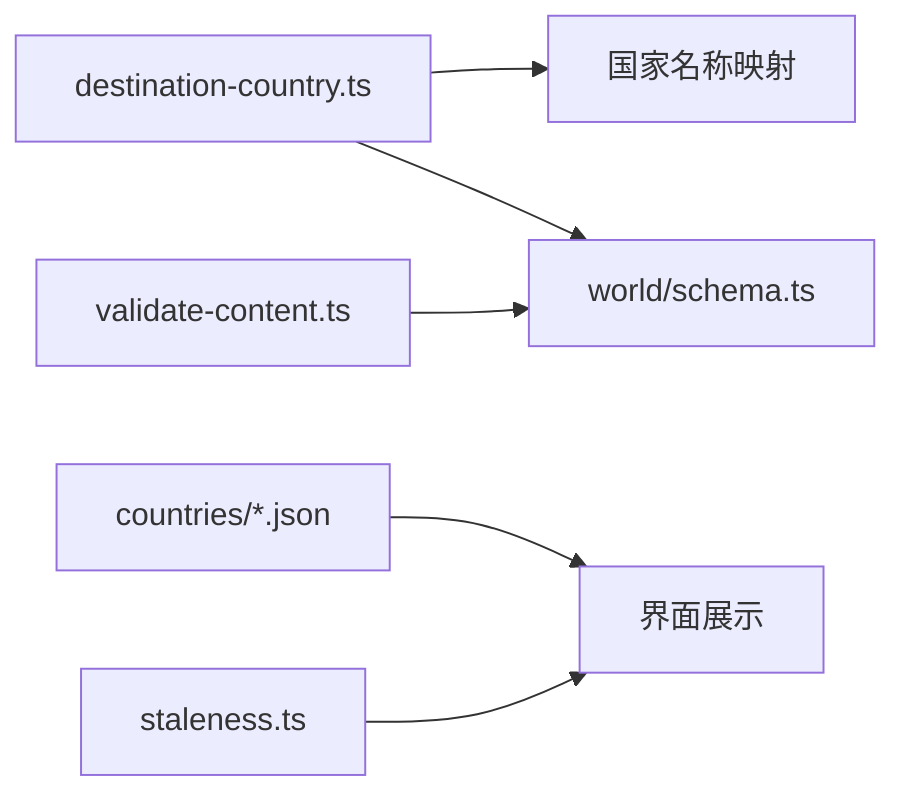

# 签证领域逻辑

<cite>
**本文引用的文件**
- [destination-country.ts](file://src/domain/visa/destination-country.ts)
- [destination-country.test.ts](file://src/domain/visa/destination-country.test.ts)
- [schema.ts](file://src/domain/world/schema.ts)
- [validate-content.ts](file://scripts/validate-content.ts)
- [ch.json](file://content/countries/ch.json)
- [it.json](file://content/countries/it.json)
- [staleness.ts](file://src/domain/world/staleness.ts)
- [技术方案.md](file://docs/技术方案.md)
</cite>

## 目录
1. [简介](#简介)
2. [项目结构](#项目结构)
3. [核心组件](#核心组件)
4. [架构总览](#架构总览)
5. [详细组件分析](#详细组件分析)
6. [依赖关系分析](#依赖关系分析)
7. [性能与准确性](#性能与准确性)
8. [故障排查指南](#故障排查指南)
9. [结论](#结论)
10. [附录：测试用例与常见场景](#附录测试用例与常见场景)

## 简介
本文件围绕“签证领域的目的地国家判断逻辑”进行系统化说明，覆盖以下要点：
- 目的地国家识别算法：基于行程天统计各国过夜数，按“停留最久国家优先、并列时首个入境国优先”的申根规则输出送签国。
- 地理坐标匹配与行政区划校验：通过世界库的坐标范围（BBOX）与类型约束，确保 POI 坐标归属正确，避免经纬度写反等数据错误。
- 多国行程的签证需求分析与路线建议：结合国家签证信息（如 visaArea 同属申根区），给出统一签证卡展示与递签结论。
- 政策动态更新机制与本地化支持：易变字段携带来源与核实时间，UI 根据时效分级提示；国家名称可本地化映射。
- 准确性评估、性能优化与错误处理策略：纯函数设计、边界条件覆盖、CI 内容校验、运行时降级渲染。
- 完整测试用例与常见场景：覆盖单国、多国并列、空行程、缺住宿占位等典型路径。

## 项目结构
与签证逻辑直接相关的代码与数据分布如下：
- 领域层：
  - src/domain/visa/destination-country.ts：送签国判断与行程单生成。
  - src/domain/world/schema.ts：世界库 schema、国家/城市/POI 模型、坐标与 BBOX 校验、业务规则检查。
  - src/domain/world/staleness.ts：时效性判定（fresh/stale/very-stale）。
- 脚本层：
  - scripts/validate-content.ts：CI 内容校验入口，聚合结构校验与业务规则检查。
- 数据层：
  - content/countries/*.json：国家基础信息与签证信息（含 visaArea、材料、费用、处理时长、最早/最晚申请天数等）。
- 文档层：
  - docs/技术方案.md：对送签国判断、时效性等规则的补充说明。

图表来源
- [destination-country.ts:27-74](file://src/domain/visa/destination-country.ts#L27-L74)
- [schema.ts:43-69](file://src/domain/world/schema.ts#L43-L69)
- [schema.ts:254-283](file://src/domain/world/schema.ts#L254-L283)
- [ch.json:16-43](file://content/countries/ch.json#L16-L43)
- [it.json:15-41](file://content/countries/it.json#L15-L41)
- [staleness.ts:22-31](file://src/domain/world/staleness.ts#L22-L31)

章节来源
- [destination-country.ts:10-74](file://src/domain/visa/destination-country.ts#L10-L74)
- [schema.ts:34-69](file://src/domain/world/schema.ts#L34-L69)
- [schema.ts:254-283](file://src/domain/world/schema.ts#L254-L283)
- [ch.json:1-45](file://content/countries/ch.json#L1-45)
- [it.json:1-43](file://content/countries/it.json#L1-L43)
- [staleness.ts:1-49](file://src/domain/world/staleness.ts#L1-L49)

## 核心组件
- 送签国判断函数 decideVisaCountry：
  - 输入：按天统计的 CountedDay[] 与国家名称映射。
  - 处理：统计各国过夜数，记录首次出现日期；按过夜数降序、首次入境日升序排序。
  - 输出：VisaDecision，包含最终 countryId、各国晚数明细、是否因并列采用“首个入境国”规则、人话理由。
- 行程单构建函数 buildItinerarySheet：
  - 将行程时间线、交通、住宿合并为使馆要求的四列表格（日期/城市/交通/住宿/地址），缺失项使用占位符。
- 世界库校验与坐标匹配：
  - 通过 LatLng 与 BBOX 校验 POI 坐标是否在所属国家境内，防止经纬度写反或归属错误。
- 时效性与本地化：
  - 国家签证信息中的 fee/processingDays 等易变字段带 source 与 verifiedAt；UI 根据 staleness 分级提示。
  - 国家名称可通过传入映射表本地化显示。

章节来源
- [destination-country.ts:27-119](file://src/domain/visa/destination-country.ts#L27-L119)
- [schema.ts:34-69](file://src/domain/world/schema.ts#L34-L69)
- [schema.ts:254-283](file://src/domain/world/schema.ts#L254-L283)
- [staleness.ts:22-31](file://src/domain/world/staleness.ts#L22-L31)

## 架构总览
下图展示了从行程到送签国结论、再到签证信息展示的端到端流程。

图表来源
- [destination-country.ts:27-74](file://src/domain/visa/destination-country.ts#L27-L74)
- [schema.ts:254-283](file://src/domain/world/schema.ts#L254-L283)
- [ch.json:16-43](file://content/countries/ch.json#L16-L43)
- [it.json:15-41](file://content/countries/it.json#L15-L41)
- [staleness.ts:22-31](file://src/domain/world/staleness.ts#L22-L31)

## 详细组件分析

### 送签国判断算法（decideVisaCountry）
- 算法步骤：
  - 遍历行程天，忽略无国家标记的天。
  - 累计各国过夜数，并记录每个国家的首次出现日期。
  - 将国家按过夜数降序排序；若过夜数相同，则按首次入境日升序排序。
  - 取排名第一的国家作为送签国；若存在并列，则标记 tiedByFirstEntry=true，并按首个入境国规则选择。
  - 生成人话 reason，包含各国晚数明细。
- 复杂度：
  - 时间 O(n log n)，n 为不同国家数量；空间 O(n)。
- 边界情况：
  - 空行程：返回 null 与明确提示。
  - 未排国家的日期：不参与计数。
  - 并列情形：回退到首个入境国。

图表来源
- [destination-country.ts:27-74](file://src/domain/visa/destination-country.ts#L27-L74)

章节来源
- [destination-country.ts:27-74](file://src/domain/visa/destination-country.ts#L27-L74)
- [destination-country.test.ts:8-48](file://src/domain/visa/destination-country.test.ts#L8-L48)

### 行程单构建（buildItinerarySheet）
- 功能：将行程时间线、交通、住宿合并为使馆要求的表格行。
- 处理：
  - 按日期聚合交通文本，缺失时默认“市内交通”。
  - 住宿缺失时使用占位符“—”，保证表格完整性。
- 适用场景：递签材料中常见的“日期/城市/交通/住宿”四列表格。

章节来源
- [destination-country.ts:99-119](file://src/domain/visa/destination-country.ts#L99-L119)
- [destination-country.test.ts:50-84](file://src/domain/visa/destination-country.test.ts#L50-L84)

### 地理坐标匹配与行政区划校验
- 坐标模型：LatLng 限制 lat ∈ [-90,90]，lng ∈ [-180,180]。
- 国家边界框：BBOX 提供部分国家的矩形范围，用于快速发现经纬度写反或归属错误。
- 校验流程：
  - 检查 POI 引用的 city/country 是否存在。
  - 若存在对应 BBOX，则校验 POI 坐标是否落在范围内。
  - 其他业务规则（如博物馆深导览要求、时长区间合法性、易变字段时效）一并检查。

图表来源
- [schema.ts:254-283](file://src/domain/world/schema.ts#L254-L283)

章节来源
- [schema.ts:34-69](file://src/domain/world/schema.ts#L34-L69)
- [schema.ts:254-283](file://src/domain/world/schema.ts#L254-L283)
- [validate-content.ts:20-48](file://scripts/validate-content.ts#L20-L48)

### 多国行程的签证需求分析与最佳路线建议
- 同签证区共享：当多个国家具有相同的 visaArea（如 schengen），系统将其视为同一签证区，行程页仅展示一张签证卡，并依据送签国结论给出递签目标。
- 递签目标选择：遵循“停留最久国家优先、并列时首个入境国优先”的规则。
- 路线建议：
  - 尽量让主要目的国停留更久，减少并列概率。
  - 若并列不可避免，确保首个入境国即为希望递签的目标国。
  - 在行程规划阶段即考虑签证规则，降低后续调整成本。

章节来源
- [ch.json:16-43](file://content/countries/ch.json#L16-L43)
- [it.json:15-41](file://content/countries/it.json#L15-L41)
- [destination-country.ts:27-74](file://src/domain/visa/destination-country.ts#L27-L74)
- [技术方案.md:852-863](file://docs/技术方案.md#L852-L863)

### 签证政策的动态更新机制与本地化支持
- 动态更新：
  - 易变字段（fee、processingDays 等）必须包含 value、source、verifiedAt，确保可追溯与时效管理。
  - 时效性分级：fresh（≤90 天）、stale（90-180 天）、very-stale（>180 天），UI 根据级别显示警示与官方源链接。
- 本地化：
  - 国家名称可通过 countryNames 映射表本地化显示，提升可读性。
  - 国家数据中包含 localName、languages、timezone 等本地化信息。

章节来源
- [schema.ts:43-69](file://src/domain/world/schema.ts#L43-L69)
- [staleness.ts:22-31](file://src/domain/world/staleness.ts#L22-L31)
- [destination-country.ts:48-73](file://src/domain/visa/destination-country.ts#L48-L73)

## 依赖关系分析
- 模块耦合：
  - destination-country.ts 依赖国家名称映射以本地化显示。
  - world/schema.ts 提供坐标与 BBOX 校验，供 CI 与运行时使用。
  - validate-content.ts 聚合结构校验与业务规则检查，驱动 CI 门禁。
  - countries/*.json 提供国家签证信息，支撑同区共享与递签结论。
- 外部依赖：
  - Zod 用于 schema 校验。
  - Vitest 用于单元测试。
- 潜在循环依赖：
  - 当前实现为单向依赖，未发现循环引用。

图表来源
- [destination-country.ts:27-74](file://src/domain/visa/destination-country.ts#L27-L74)
- [schema.ts:43-69](file://src/domain/world/schema.ts#L43-L69)
- [validate-content.ts:20-48](file://scripts/validate-content.ts#L20-L48)
- [ch.json:16-43](file://content/countries/ch.json#L16-L43)
- [it.json:15-41](file://content/countries/it.json#L15-L41)
- [staleness.ts:22-31](file://src/domain/world/staleness.ts#L22-L31)

章节来源
- [destination-country.ts:27-74](file://src/domain/visa/destination-country.ts#L27-L74)
- [schema.ts:43-69](file://src/domain/world/schema.ts#L43-L69)
- [validate-content.ts:20-48](file://scripts/validate-content.ts#L20-L48)

## 性能与准确性
- 性能特性：
  - decideVisaCountry 为纯函数，时间复杂度 O(n log n)，空间 O(n)，适合高频调用。
  - 世界库 JSON 走 SW 缓存，长列表虚拟滚动，首屏 JS 体积受限。
- 准确性保障：
  - 单元测试覆盖关键分支：停留最久国家、并列首个入境国、空行程、缺住宿占位。
  - CI 内容校验：结构合法 + 业务规则（坐标越界、引用完整性、时效性）。
  - 运行时容错：zod safeParse 失败时降级渲染，不白屏。
- 优化建议：
  - 对于超大规模行程，可考虑分块统计与并行排序。
  - 增加属性测试验证不变式（如总晚数守恒、排序稳定性）。

章节来源
- [destination-country.test.ts:8-84](file://src/domain/visa/destination-country.test.ts#L8-L84)
- [validate-content.ts:20-75](file://scripts/validate-content.ts#L20-L75)
- [技术方案.md:1128-1172](file://docs/技术方案.md#L1128-L1172)

## 故障排查指南
- 常见问题与定位：
  - 送签国判断异常：检查 days 中 countryId 是否正确赋值；确认排序逻辑是否符合“过夜数降序、首次入境日升序”。
  - 坐标越界：核对 POI 的 lat/lng 是否与 BBOX 一致，避免经纬度写反。
  - 时效过期：检查易变字段的 verifiedAt 是否超过阈值，及时更新官方源。
- 错误处理策略：
  - 空行程：返回 null 与明确提示，避免崩溃。
  - 缺住宿/交通：使用占位符填充，保证表格完整性。
  - 世界库数据异常：safeParse 失败时降级渲染，控制台告警。

章节来源
- [destination-country.ts:50-73](file://src/domain/visa/destination-country.ts#L50-L73)
- [schema.ts:254-283](file://src/domain/world/schema.ts#L254-L283)
- [staleness.ts:22-31](file://src/domain/world/staleness.ts#L22-L31)

## 结论
本方案通过纯函数化的送签国判断、严格的世界库 schema 校验、以及可追溯的时效管理机制，实现了签证领域的高准确性与高可维护性。配合完整的测试用例与 CI 门禁，能够有效覆盖常见场景与边界情况，并为多国行程提供清晰的递签目标与路线建议。

## 附录：测试用例与常见场景
- 测试用例概览：
  - 停留最久的国家即送签国。
  - 晚数并列时回落到首个入境国。
  - 未排国家的日期不参与计数。
  - 空行程给出明确提示而不是崩溃。
  - 行程单构建：交通与住宿合并、缺项占位。
- 常见场景处理：
  - 多国并列：通过首个入境国规则确定递签目标。
  - 坐标异常：BBOX 校验快速发现经纬度写反或归属错误。
  - 政策更新：时效性分级提示，始终保留官方源链接。

章节来源
- [destination-country.test.ts:8-84](file://src/domain/visa/destination-country.test.ts#L8-L84)
- [schema.ts:254-283](file://src/domain/world/schema.ts#L254-L283)
- [staleness.ts:22-31](file://src/domain/world/staleness.ts#L22-L31)