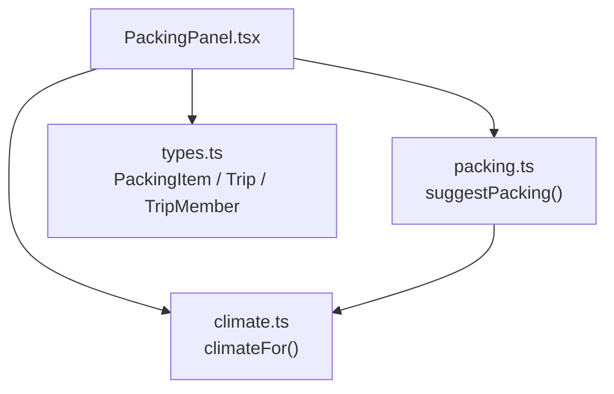
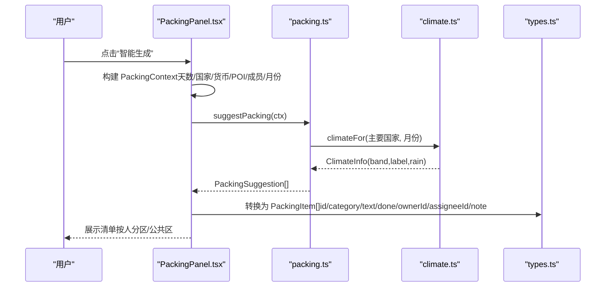
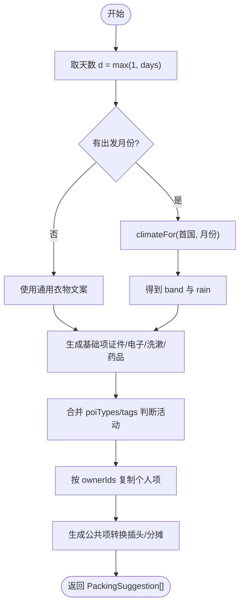
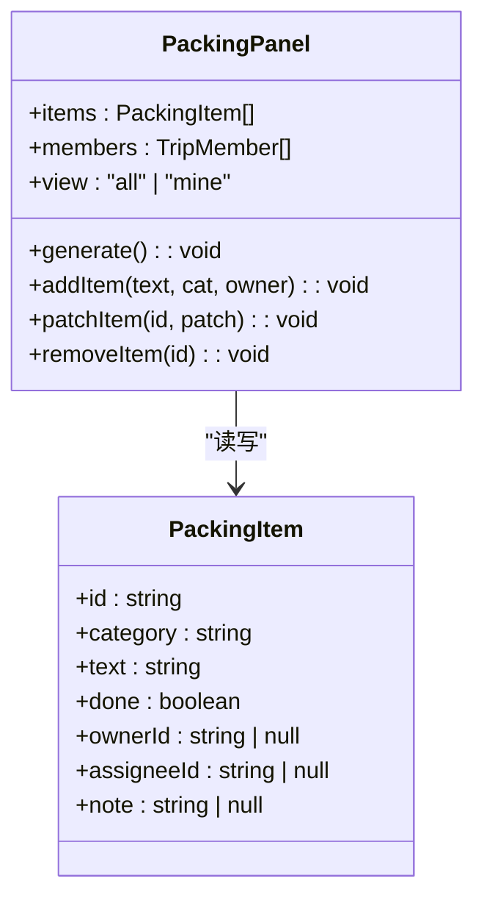
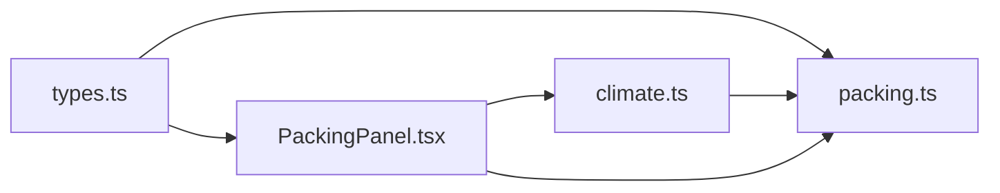

# 打包清单生成

<cite>
**本文引用的文件**
- [src/domain/trip/packing.ts](file://src/domain/trip/packing.ts)
- [src/domain/trip/climate.ts](file://src/domain/trip/climate.ts)
- [src/features/trip/PackingPanel.tsx](file://src/features/trip/PackingPanel.tsx)
- [src/data/types.ts](file://src/data/types.ts)
- [src/domain/trip/packing.test.ts](file://src/domain/trip/packing.test.ts)
</cite>

## 目录
1. [简介](#简介)
2. [项目结构](#项目结构)
3. [核心组件](#核心组件)
4. [架构总览](#架构总览)
5. [详细组件分析](#详细组件分析)
6. [依赖关系分析](#依赖关系分析)
7. [性能考量](#性能考量)
8. [故障排查指南](#故障排查指南)
9. [结论](#结论)
10. [附录：示例与扩展](#附录示例与扩展)

## 简介
本模块提供“智能打包清单”能力：基于行程天数、目的地国家/货币、已排 POI 类型与标签、同行成员以及出发月份，自动生成衣物、证件、电子、洗漱、药品等建议项；同时区分个人物品与公共物品，并支持责任分配。该算法不依赖实时天气 API，采用“月度气候带”的离线常识数据推导衣物分层，确保行前数月规划也能给出合理建议。

## 项目结构
打包功能由三层组成：
- 领域层（domain）：纯函数算法与气候数据
  - packing.ts：打包建议生成算法、分类常量、上下文与输出模型
  - climate.ts：按国家+月份返回气候带、是否多雨及展示文案
- 表现层（features）：UI 面板与交互
  - PackingPanel.tsx：读取行程与世界库索引，构造上下文，调用算法生成清单，并提供增删改、归属与负责人选择、进度统计
- 数据层（data）：类型定义与持久化
  - types.ts：PackingItem、Trip、TripMember 等类型，定义清单数据结构与状态字段

图表来源
- [src/features/trip/PackingPanel.tsx:39-149](file://src/features/trip/PackingPanel.tsx#L39-L149)
- [src/domain/trip/packing.ts:79-163](file://src/domain/trip/packing.ts#L79-L163)
- [src/domain/trip/climate.ts:51-59](file://src/domain/trip/climate.ts#L51-L59)
- [src/data/types.ts:96-127](file://src/data/types.ts#L96-L127)

章节来源
- [src/features/trip/PackingPanel.tsx:39-149](file://src/features/trip/PackingPanel.tsx#L39-L149)
- [src/domain/trip/packing.ts:79-163](file://src/domain/trip/packing.ts#L79-L163)
- [src/domain/trip/climate.ts:51-59](file://src/domain/trip/climate.ts#L51-L59)
- [src/data/types.ts:96-127](file://src/data/types.ts#L96-L127)

## 核心组件
- 打包建议生成器 suggestPacking
  - 输入：PackingContext（天数、国家、货币、POI 类型/标签、成员列表、出发月份）
  - 输出：PackingSuggestion[]（每项含分类、文本、备注、ownerId）
  - 职责：根据气候带生成衣物文案；依据 POI 类型/标签添加活动相关物品；按成员复制个人项；生成公共项
- 气候查询 climateFor
  - 输入：国家代码（ISO alpha-2）、月份（1-12）
  - 输出：ClimateInfo（band、label、rain）
  - 职责：将国家+月份映射到气候带与是否多雨，用于衣物分层与雨具提示
- 打包面板 PackingPanel
  - 职责：从行程与世界库索引构建 PackingContext；调用 suggestPacking 生成建议；维护本地清单状态（新增、删除、勾选、归属、负责人）；显示进度与气候参考

章节来源
- [src/domain/trip/packing.ts:17-45](file://src/domain/trip/packing.ts#L17-L45)
- [src/domain/trip/packing.ts:79-163](file://src/domain/trip/packing.ts#L79-L163)
- [src/domain/trip/climate.ts:11-17](file://src/domain/trip/climate.ts#L11-L17)
- [src/domain/trip/climate.ts:51-59](file://src/domain/trip/climate.ts#L51-L59)
- [src/features/trip/PackingPanel.tsx:39-149](file://src/features/trip/PackingPanel.tsx#L39-L149)

## 架构总览
打包流程以“纯函数 + UI 状态”的方式解耦：
- 领域层无副作用，便于单测与复用
- UI 负责聚合行程信息、渲染与编辑
- 数据层提供强类型约束，保证前后端一致

图表来源
- [src/features/trip/PackingPanel.tsx:58-149](file://src/features/trip/PackingPanel.tsx#L58-L149)
- [src/domain/trip/packing.ts:79-163](file://src/domain/trip/packing.ts#L79-L163)
- [src/domain/trip/climate.ts:51-59](file://src/domain/trip/climate.ts#L51-L59)
- [src/data/types.ts:96-127](file://src/data/types.ts#L96-L127)

## 详细组件分析

### 打包建议生成算法 suggestPacking
- 气候匹配
  - 通过 climateFor(首个国家, 月份) 获取 band 与 rain
  - 根据 band 动态生成上衣与外套文案；cold 时追加保暖鞋/厚袜；rain 为真时追加折叠伞/防水鞋
- 活动识别
  - 合并 poiTypes 与 tags 为集合 t
  - 若包含海滩/游泳/海岛/湖：添加泳衣、沙滩巾
  - 若包含徒步/山/步道/徒步/alps：添加徒步鞋、水壶
- 物品分类规则
  - 固定分类：证件/票据、衣物、洗漱、电子、药品、其他
  - 基础项：护照/身份证、签证、机票酒店确认单、旅行保险、当地现金（按货币去重拼接）、手机充电器、充电宝、相机存储卡、内衣/袜子（按天数）、舒适步行鞋、牙具护肤小样、防晒霜、常用药/肠胃药、创可贴
- 个人与公共物品策略
  - 个人项：按 ownerIds 复制成每人一份；若为空则退化为单人模式（ownerId=null），不拆分
  - 公共项：转换插头（按国家存在时添加）、共用物品分摊（多人时添加），ownerId=null
- 责任分配
  - 公共项在 UI 中可通过 assigneeId 指定携带者；算法仅生成占位项，具体责任人由界面决定

图表来源
- [src/domain/trip/packing.ts:79-163](file://src/domain/trip/packing.ts#L79-L163)
- [src/domain/trip/climate.ts:51-59](file://src/domain/trip/climate.ts#L51-L59)

章节来源
- [src/domain/trip/packing.ts:47-77](file://src/domain/trip/packing.ts#L47-L77)
- [src/domain/trip/packing.ts:79-163](file://src/domain/trip/packing.ts#L79-L163)

### 气候数据 climateFor
- 设计要点
  - 内置法国、意大利、瑞士三套月度气候带与降雨标记
  - 未知国家默认回退到法国；月份越界做模运算处理
  - 返回 band、可读 label（如“初秋·温和，多雨”）、rain 标志
- 复杂度
  - 时间 O(1)，空间 O(1)

章节来源
- [src/domain/trip/climate.ts:11-17](file://src/domain/trip/climate.ts#L11-L17)
- [src/domain/trip/climate.ts:27-48](file://src/domain/trip/climate.ts#L27-L48)
- [src/domain/trip/climate.ts:51-59](file://src/domain/trip/climate.ts#L51-L59)

### 打包面板 PackingPanel
- 上下文构建
  - 从 bundle.days 收集城市，再查世界库索引得到国家集合与货币集合
  - 从 bundle.items 的 poiId 集合反查 POI 的类型与标签集合
  - 从 trip.startDate 提取月份
  - ownerIds 来自 members 列表；空数组表示单人/匿名模式
- 状态管理
  - items：当前清单（PackingItem[]），持久化在 Trip.packing
  - view：全部/我的视角切换
  - draftText/draftCat/draftOwner：新增项草稿
  - collapsed：工具栏收起/展开
  - 进度：doneCount/items.length
- 交互
  - 智能生成：调用 suggestPacking(ctx) 并转为 PackingItem[]
  - 新增/删除/勾选/编辑文本/变更归属与负责人
  - 公共项显示“谁带”下拉框，绑定 assigneeId

图表来源
- [src/features/trip/PackingPanel.tsx:39-170](file://src/features/trip/PackingPanel.tsx#L39-L170)
- [src/data/types.ts:96-127](file://src/data/types.ts#L96-L127)

章节来源
- [src/features/trip/PackingPanel.tsx:58-170](file://src/features/trip/PackingPanel.tsx#L58-L170)
- [src/data/types.ts:96-127](file://src/data/types.ts#L96-L127)

## 依赖关系分析
- 模块耦合
  - PackingPanel 依赖 packing.ts 与 climate.ts 提供建议与气候参考
  - packing.ts 依赖 climate.ts 进行衣物分层
  - 所有类型统一在 types.ts 中声明，避免跨模块不一致
- 外部依赖
  - 世界库索引（cities/countries/pois）用于推导国家、货币、POI 类型与标签
  - 无实时天气 API 依赖，保证离线可用

图表来源
- [src/features/trip/PackingPanel.tsx:12-18](file://src/features/trip/PackingPanel.tsx#L12-L18)
- [src/domain/trip/packing.ts:12-15](file://src/domain/trip/packing.ts#L12-L15)
- [src/data/types.ts:96-127](file://src/data/types.ts#L96-L127)

章节来源
- [src/features/trip/PackingPanel.tsx:12-18](file://src/features/trip/PackingPanel.tsx#L12-L18)
- [src/domain/trip/packing.ts:12-15](file://src/domain/trip/packing.ts#L12-L15)
- [src/data/types.ts:96-127](file://src/data/types.ts#L96-L127)

## 性能考量
- 算法复杂度
  - suggestPacking 为线性遍历与常数级分支，整体 O(n)（n 为成员数与基础项数量）
  - climateFor 为 O(1)
- 内存占用
  - 仅保留必要集合与数组，无额外缓存
- 渲染优化
  - 使用 useMemo 计算 ctx 与 sections，减少重复计算
  - 进度条与区块按分类过滤，避免全量重绘

[本节为通用指导，无需引用具体文件]

## 故障排查指南
- 未生成衣物分层
  - 检查是否设置了出发日期（month），否则退回通用文案
  - 确认传入的国家代码是否为小写 ISO alpha-2
- 活动相关项未出现
  - 检查 POI 类型与标签是否正确加入集合（beach/swim/海岛/lake 或 hike/mountain/trail/徒步/alps）
- 个人项未按成员复制
  - 确认 ownerIds 非空；空数组会退化为单人模式（ownerId=null）
- 公共项未显示“谁带”
  - 仅 ownerId=null 的公共项才会显示 assigneeId 选择器
- 进度异常
  - 检查 done 字段是否正确更新；确认 items 长度不为 0

章节来源
- [src/domain/trip/packing.ts:79-163](file://src/domain/trip/packing.ts#L79-L163)
- [src/features/trip/PackingPanel.tsx:151-170](file://src/features/trip/PackingPanel.tsx#L151-L170)
- [src/data/types.ts:96-127](file://src/data/types.ts#L96-L127)

## 结论
本方案以“零成本约束”为核心，通过月度气候带与活动标签驱动的智能建议，兼顾实用性与离线可用性。算法纯函数化、类型安全、易于测试与扩展；UI 层提供直观的责任分配与进度跟踪，满足多人协作场景下的打包需求。

[本节为总结性内容，无需引用具体文件]

## 附录：示例与扩展

### 不同气候与活动的打包建议示例
- 热带（例如某南欧国家夏季）
  - 上衣：短袖/透气上衣 ×(天数+1)
  - 外套：防晒薄衫（备用）
  - 活动：海滩/游泳 → 泳衣、沙滩巾
- 温带（例如法国秋季）
  - 上衣：长袖上衣 ×(天数+1) 或根据月份温和偏凉调整
  - 外套：薄外套（早晚凉）
  - 雨天：折叠伞/防水鞋
- 寒带（例如瑞士冬季）
  - 上衣：保暖长袖 + 打底 ×(天数+1)
  - 外套：保暖外套/羽绒 + 手套 + 围巾
  - 鞋袜：保暖鞋/厚袜

章节来源
- [src/domain/trip/packing.ts:47-77](file://src/domain/trip/packing.ts#L47-L77)
- [src/domain/trip/packing.ts:110-121](file://src/domain/trip/packing.ts#L110-L121)
- [src/domain/trip/climate.ts:32-46](file://src/domain/trip/climate.ts#L32-L46)
- [src/domain/trip/packing.test.ts:73-92](file://src/domain/trip/packing.test.ts#L73-L92)

### 数据结构与状态管理
- PackingItem
  - id：唯一标识
  - category：分类（证件/票据、衣物、洗漱、电子、药品、其他）
  - text：物品描述
  - done：是否已装
  - ownerId：归属成员（null 表示公共）
  - assigneeId：公共项负责人（null 表示未指定）
  - note：备注
- Trip.packing
  - 清单数组，随行程读写，离线优先
- 视图与进度
  - 全部/我的视角切换
  - 进度 = 已完成项数 / 总项数

章节来源
- [src/data/types.ts:96-127](file://src/data/types.ts#L96-L127)
- [src/features/trip/PackingPanel.tsx:151-174](file://src/features/trip/PackingPanel.tsx#L151-L174)

### 自定义打包规则的扩展方法
- 新增活动类型
  - 在 suggestPacking 的活动识别分支中添加新的 poiTypes/tags 匹配条件，并追加对应物品
- 新增分类
  - 扩展 PACK_CATS 常量，并在 UI 下拉选项中同步
- 新增气候国家
  - 在 climate.ts 的数据表中增加国家代码及其月度 bands/rain，供 climateFor 使用
- 调整个人/公共策略
  - 修改 ownerIds 的处理逻辑或新增公共项生成规则

章节来源
- [src/domain/trip/packing.ts:14-15](file://src/domain/trip/packing.ts#L14-L15)
- [src/domain/trip/packing.ts:131-140](file://src/domain/trip/packing.ts#L131-L140)
- [src/domain/trip/climate.ts:48-59](file://src/domain/trip/climate.ts#L48-L59)
- [src/features/trip/PackingPanel.tsx:238-269](file://src/features/trip/PackingPanel.tsx#L238-L269)