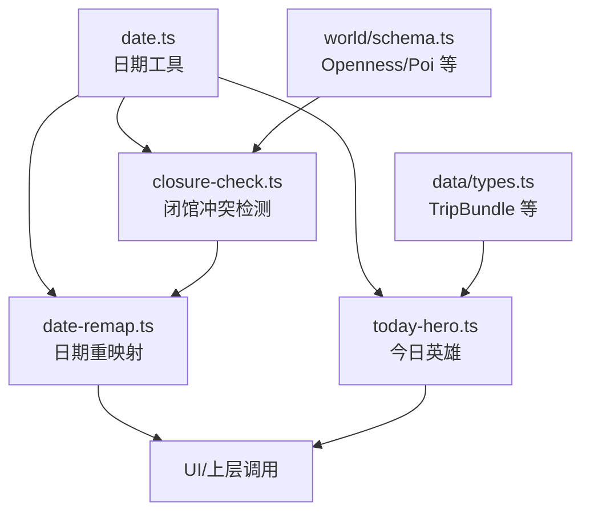
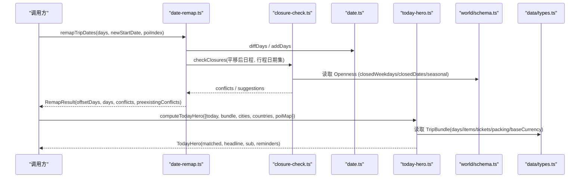
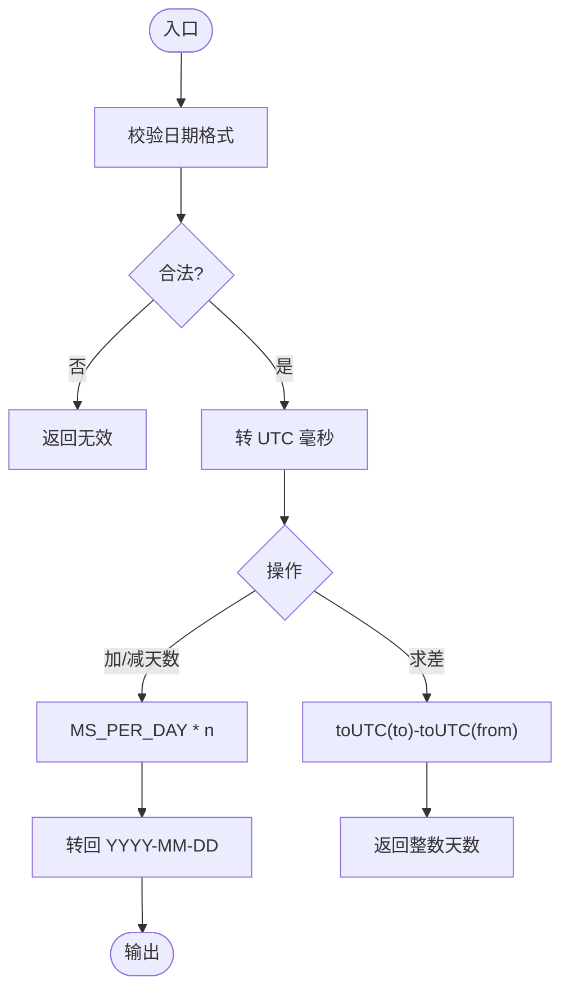
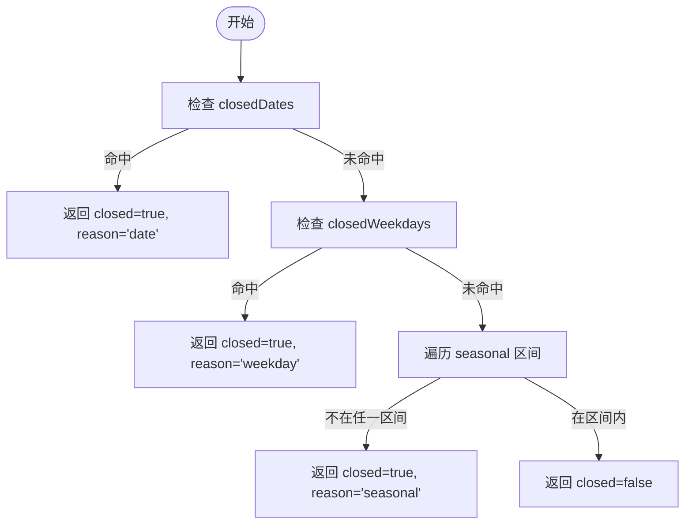
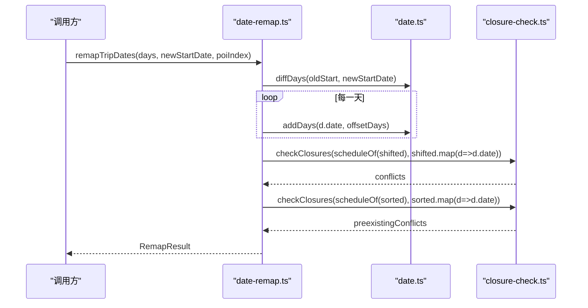
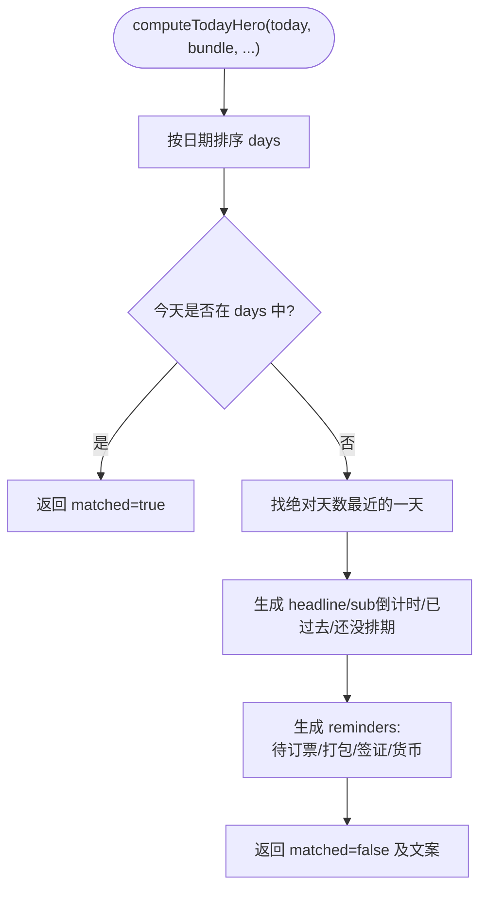
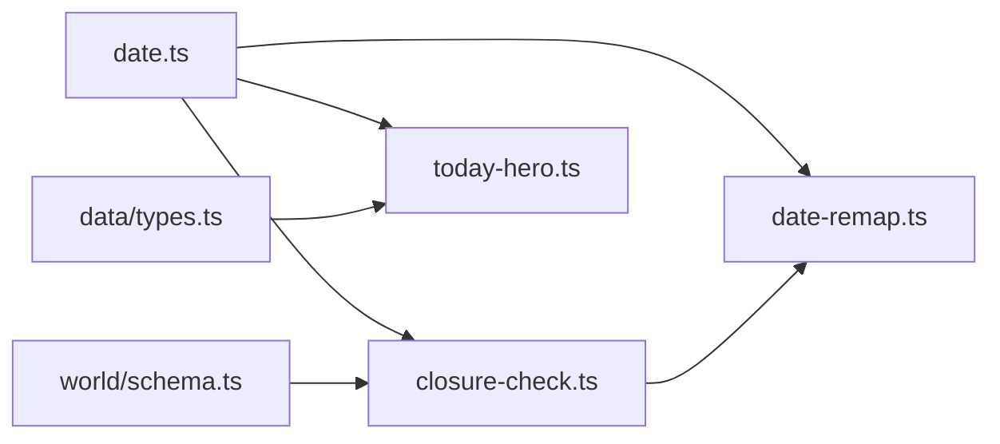

# 日期处理工具

<cite>
**本文引用的文件**
- [src/domain/date.ts](file://src/domain/date.ts)
- [src/domain/trip/date-remap.ts](file://src/domain/trip/date-remap.ts)
- [src/domain/trip/closure-check.ts](file://src/domain/trip/closure-check.ts)
- [src/domain/trip/today-hero.ts](file://src/domain/trip/today-hero.ts)
- [src/domain/world/schema.ts](file://src/domain/world/schema.ts)
- [src/data/types.ts](file://src/data/types.ts)
- [src/domain/trip/closure-check.test.ts](file://src/domain/trip/closure-check.test.ts)
- [src/domain/trip/today-hero.test.ts](file://src/domain/trip/today-hero.test.ts)
</cite>

## 目录
1. [简介](#简介)
2. [项目结构](#项目结构)
3. [核心组件](#核心组件)
4. [架构总览](#架构总览)
5. [详细组件分析](#详细组件分析)
6. [依赖关系分析](#依赖关系分析)
7. [性能与边界情况](#性能与边界情况)
8. [故障排查指南](#故障排查指南)
9. [结论](#结论)
10. [附录：使用示例与测试覆盖](#附录使用示例与测试覆盖)

## 简介
本文件为“行程日期处理工具”的技术文档，聚焦以下能力：
- date-remap 模块的日期重映射算法：将整份行程按新起始日整体平移，并自动进行闭馆冲突校验。
- today-hero 模块的“今日英雄”算法：基于当前日期计算倒计时、生成可操作的行前提醒（订票、打包、签证、货币）。
- 日期计算的底层实现：纯字符串日期（YYYY-MM-DD）+ UTC 内部换算，规避跨时区陷阱；支持闰年、月末、跨年季节区间等边界场景。
- 与日历系统/外部日期 API 的适配方式：通过世界库 schema 的结构化开放信息（闭馆日、周休、季节性）和类型约束，保证数据一致性与可验证性。
- 错误处理策略与单元测试覆盖的关键场景。

## 项目结构
与日期处理相关的核心代码集中在 domain 层，采用“纯函数 + 强类型”的设计：
- 基础日期工具：src/domain/date.ts
- 行程日期重映射：src/domain/trip/date-remap.ts
- 闭馆冲突检测：src/domain/trip/closure-check.ts
- 今日英雄提醒：src/domain/trip/today-hero.ts
- 世界库 schema（含 Openness、Poi 等）：src/domain/world/schema.ts
- 行程数据类型定义：src/data/types.ts

图表来源
- [src/domain/date.ts:1-69](file://src/domain/date.ts#L1-L69)
- [src/domain/trip/closure-check.ts:1-98](file://src/domain/trip/closure-check.ts#L1-L98)
- [src/domain/trip/date-remap.ts:1-55](file://src/domain/trip/date-remap.ts#L1-L55)
- [src/domain/trip/today-hero.ts:1-119](file://src/domain/trip/today-hero.ts#L1-L119)
- [src/domain/world/schema.ts:114-130](file://src/domain/world/schema.ts#L114-L130)
- [src/data/types.ts:231-239](file://src/data/types.ts#L231-L239)

章节来源
- [src/domain/date.ts:1-69](file://src/domain/date.ts#L1-L69)
- [src/domain/trip/date-remap.ts:1-55](file://src/domain/trip/date-remap.ts#L1-L55)
- [src/domain/trip/closure-check.ts:1-98](file://src/domain/trip/closure-check.ts#L1-L98)
- [src/domain/trip/today-hero.ts:1-119](file://src/domain/trip/today-hero.ts#L1-L119)
- [src/domain/world/schema.ts:114-130](file://src/domain/world/schema.ts#L114-L130)
- [src/data/types.ts:231-239](file://src/data/types.ts#L231-L239)

## 核心组件
- 日期工具（date.ts）：提供 addDays、diffDays、weekday、monthDay、formatCn、todayStr、dateRange、isValidDate 等纯函数，全部以 YYYY-MM-DD 字符串流转，内部统一用 UTC 毫秒差计算，避免本地时区导致的“日期漂移”。
- 闭馆冲突检测（closure-check.ts）：基于 POI 的 Openness（closedWeekdays、closedDates、seasonal）判断指定日期是否闭馆，并在给定候选日期中筛选可替换的开放日。
- 日期重映射（date-remap.ts）：输入原日程与新起始日，计算偏移天数，整体平移所有天，并对平移后的日程做闭馆冲突检测，同时保留原始冲突用于对比。
- 今日英雄（today-hero.ts）：输入 TripBundle、城市与国家摘要、POI 索引，输出“今天是否命中某天”以及倒计时与行前提醒（待订票、打包未完成、需办签证、目的地货币）。

章节来源
- [src/domain/date.ts:14-68](file://src/domain/date.ts#L14-L68)
- [src/domain/trip/closure-check.ts:32-98](file://src/domain/trip/closure-check.ts#L32-L98)
- [src/domain/trip/date-remap.ts:10-55](file://src/domain/trip/date-remap.ts#L10-L55)
- [src/domain/trip/today-hero.ts:15-119](file://src/domain/trip/today-hero.ts#L15-L119)

## 架构总览
下图展示了从输入到输出的关键流程：日期工具支撑闭馆检测与日期平移；闭馆检测为日期重映射提供冲突结果；今日英雄读取行程包与世界库摘要生成提醒。

图表来源
- [src/domain/trip/date-remap.ts:25-55](file://src/domain/trip/date-remap.ts#L25-L55)
- [src/domain/trip/closure-check.ts:73-98](file://src/domain/trip/closure-check.ts#L73-L98)
- [src/domain/date.ts:29-35](file://src/domain/date.ts#L29-L35)
- [src/domain/trip/today-hero.ts:37-119](file://src/domain/trip/today-hero.ts#L37-L119)
- [src/domain/world/schema.ts:114-130](file://src/domain/world/schema.ts#L114-L130)
- [src/data/types.ts:231-239](file://src/data/types.ts#L231-L239)

## 详细组件分析

### 日期工具（date.ts）
- 设计要点
  - 全程使用 YYYY-MM-DD 字符串表示“日历上的那一天”，避免 Date 对象在本地时区解析时的偏移问题。
  - 内部转换：toUtc/fromUtc 使用 UTC 毫秒时间戳进行加减，确保跨时区规划的正确性。
  - 提供 weekday 与 weekdayLabel，与 Openness.closedWeekdays 的 0=周日…6=周六对齐。
  - monthDay 提取 MM-DD 用于季节性区间比较，支持跨年区间（如 11-15 → 03-31）。
- 复杂度
  - addDays/diffDays/weekday/dateRange 均为 O(1) 或 O(n)（dateRange 线性生成），开销极低。
- 边界处理
  - 闰年与月末：基于 UTC 毫秒差计算，天然正确处理月份进位与闰年。
  - 有效性校验：isValidDate 通过 toUtc/fromUtc 往返校验格式与合法性。

图表来源
- [src/domain/date.ts:14-35](file://src/domain/date.ts#L14-L35)

章节来源
- [src/domain/date.ts:14-68](file://src/domain/date.ts#L14-L68)

### 闭馆冲突检测（closure-check.ts）
- 规则优先级
  1) closedDates 固定闭馆日
  2) closedWeekdays 每周固定闭馆日
  3) seasonal 季节性区间（支持跨年）
- 功能
  - isClosedOn：判断单个 POI 在某日是否闭馆，返回原因与详情。
  - openDatesAmong：在候选日期中筛出开放日，用于“一键改期”建议。
  - checkClosures：批量校验日程，结合 tripDates 给出同程内可替换日期建议（最多 3 条）。
- 数据结构
  - Openness 来自 world/schema.ts，严格约束字段类型与取值范围。
- 复杂度
  - 单条日程 O(k)（k 为 seasonal 数量），批量 O(N·k)。

图表来源
- [src/domain/trip/closure-check.ts:32-62](file://src/domain/trip/closure-check.ts#L32-L62)

章节来源
- [src/domain/trip/closure-check.ts:32-98](file://src/domain/trip/closure-check.ts#L32-L98)
- [src/domain/world/schema.ts:114-130](file://src/domain/world/schema.ts#L114-L130)

### 日期重映射（date-remap.ts）
- 算法流程
  1) 排序日程，取最早日期作为旧起点。
  2) 计算 offsetDays = diffDays(oldStart, newStartDate)。
  3) 对每一天执行 addDays(date, offsetDays)，得到平移后的日程。
  4) 构造 scheduleOf：将每天的 poiIds 映射为 ClosureCheckable，形成 {date, poi} 列表。
  5) 对平移后日程调用 checkClosures 得到 conflicts；同时对原日程调用得到 preexistingConflicts，便于区分“我改出来的冲突”还是“原本就有的冲突”。
- 返回值
  - offsetDays：平移天数
  - days：平移后的日程
  - conflicts：平移后的冲突
  - preexistingConflicts：原日程的冲突
- 适用场景
  - “无脑跟随”：用户修改出发日，整份行程自动平移并立即提示撞车风险。

图表来源
- [src/domain/trip/date-remap.ts:25-55](file://src/domain/trip/date-remap.ts#L25-L55)
- [src/domain/trip/closure-check.ts:73-98](file://src/domain/trip/closure-check.ts#L73-L98)
- [src/domain/date.ts:29-35](file://src/domain/date.ts#L29-L35)

章节来源
- [src/domain/trip/date-remap.ts:10-55](file://src/domain/trip/date-remap.ts#L10-L55)

### 今日英雄（today-hero.ts）
- 目标
  - 若今天命中某天：matched=true，上层直接渲染当天，不显示 hero。
  - 否则：找到绝对天数最近的一天，计算倒计时文案，并生成可操作的提醒。
- 提醒项
  - 待订票：景点 booking.required 且未 booked 的条目。
  - 打包未完成：trip.packing 中 done=false 的项，证件类单独标注。
  - 需办签证：行程涉及的国家中有 hasVisa=true 的国家。
  - 目的地货币：baseCurrency 非 CNY 时提醒换汇。
- 输入
  - today：当前日期（YYYY-MM-DD）
  - bundle：TripBundle（days/items/tickets/packing/baseCurrency）
  - cities/countries：城市与国家摘要
  - poiMap：POI 索引（可选）

图表来源
- [src/domain/trip/today-hero.ts:37-119](file://src/domain/trip/today-hero.ts#L37-L119)
- [src/data/types.ts:231-239](file://src/data/types.ts#L231-L239)

章节来源
- [src/domain/trip/today-hero.ts:15-119](file://src/domain/trip/today-hero.ts#L15-L119)
- [src/data/types.ts:231-239](file://src/data/types.ts#L231-L239)

## 依赖关系分析
- date.ts 被 closure-check.ts、date-remap.ts、today-hero.ts 共同依赖，提供统一的日期运算与格式化。
- closure-check.ts 依赖 world/schema.ts 的 Openness 类型，确保开放规则结构化、可校验。
- date-remap.ts 依赖 closure-check.ts 进行冲突检测，并复用 date.ts 的日期运算。
- today-hero.ts 依赖 data/types.ts 的 TripBundle 等类型，以及 world/schema.ts 的 Poi 类型（用于订票逻辑）。

图表来源
- [src/domain/date.ts:1-69](file://src/domain/date.ts#L1-L69)
- [src/domain/trip/closure-check.ts:1-98](file://src/domain/trip/closure-check.ts#L1-L98)
- [src/domain/trip/date-remap.ts:1-55](file://src/domain/trip/date-remap.ts#L1-L55)
- [src/domain/trip/today-hero.ts:1-119](file://src/domain/trip/today-hero.ts#L1-L119)
- [src/domain/world/schema.ts:114-130](file://src/domain/world/schema.ts#L114-L130)
- [src/data/types.ts:231-239](file://src/data/types.ts#L231-L239)

章节来源
- [src/domain/date.ts:1-69](file://src/domain/date.ts#L1-L69)
- [src/domain/trip/closure-check.ts:1-98](file://src/domain/trip/closure-check.ts#L1-L98)
- [src/domain/trip/date-remap.ts:1-55](file://src/domain/trip/date-remap.ts#L1-L55)
- [src/domain/trip/today-hero.ts:1-119](file://src/domain/trip/today-hero.ts#L1-L119)
- [src/domain/world/schema.ts:114-130](file://src/domain/world/schema.ts#L114-L130)
- [src/data/types.ts:231-239](file://src/data/types.ts#L231-L239)

## 性能与边界情况
- 性能
  - 日期运算均为 O(1)，批量冲突检测 O(N·k)，N 为日程条目数，k 为 seasonal 区间数，通常很小。
  - today-hero 的提醒生成主要遍历 items/packing，复杂度 O(M+P)，M 为条目数，P 为打包项数。
- 边界情况
  - 闰年与月末：addDays 基于 UTC 毫秒差，自动处理 2 月 29 日与月末进位。
  - 跨时区：所有日期以字符串流转，内部统一 UTC 计算，避免本地时区导致的前后一天偏差。
  - 季节性区间跨年：inSeason 支持 from > to 的跨年区间（如 11-15 → 03-31）。
  - 空行程/无 POI：date-remap 返回空结果；today-hero 在无排期时给出“还没排期”提示。
  - 无城市/国家信息：today-hero 在缺失城市名时降级为空字符串，不影响主流程。

[本节为通用指导，不直接分析具体文件]

## 故障排查指南
- 常见问题
  - 日期偏移：确认传入日期为 YYYY-MM-DD 且有效；使用 isValidDate 校验。
  - 闭馆冲突误报：检查 POI 的 Openness 配置是否正确（closedWeekdays 与 0=周日…6=周六 对齐；seasonal 区间是否包含目标日期）。
  - 提醒不准确：确认 TripBundle 中的 tickets、packing、baseCurrency 是否完整；poiMap 是否包含所需 POI。
- 定位方法
  - 使用闭馆冲突检测结果中的 message 与 suggestions 快速定位问题与建议改期日期。
  - 使用 today-hero 的 reminders 逐项核对触发条件（booking.required、done、hasVisa、baseCurrency）。
- 日志与断点
  - 在 date-remap 中打印 offsetDays、shifted 与 conflicts 以确认平移与冲突。
  - 在 today-hero 中打印 nearest、headline、sub 与 reminders 以确认倒计时与提醒。

章节来源
- [src/domain/trip/closure-check.ts:73-98](file://src/domain/trip/closure-check.ts#L73-L98)
- [src/domain/trip/date-remap.ts:25-55](file://src/domain/trip/date-remap.ts#L25-L55)
- [src/domain/trip/today-hero.ts:37-119](file://src/domain/trip/today-hero.ts#L37-L119)

## 结论
- 该日期处理体系以“纯函数 + 强类型”为核心，通过 UTC 内部换算与字符串日期流转，彻底规避跨时区陷阱。
- date-remap 提供“无脑跟随”的整程平移与即时冲突检测，配合 closure-check 的结构化开放规则，确保行程可执行性。
- today-hero 将复杂行前准备提炼为可操作的提醒，提升用户体验与出行成功率。
- 完善的单元测试覆盖了闭馆规则、平移逻辑、倒计时与提醒等关键路径，保障稳定性。

[本节为总结，不直接分析具体文件]

## 附录：使用示例与测试覆盖

### 使用示例（概念性）
- 日期重映射
  - 输入：原日程 days（含 id、date、cityId、poiIds）、新起始日 newStartDate、poiIndex（id -> ClosureCheckable）
  - 输出：RemapResult（offsetDays、days、conflicts、preexistingConflicts）
  - 典型用法：用户在设置中将出发日从 2026-09-20 改为 2026-10-04，系统自动平移并提示可能的闭馆冲突。
- 今日英雄
  - 输入：today、bundle（days/items/tickets/packing/baseCurrency）、cities、countries、poiMap
  - 输出：TodayHero（matched、headline、sub、reminders）
  - 典型用法：首页“今天”标签页根据行程状态展示倒计时与提醒（订票、打包、签证、货币）。

[本节为概念性说明，不直接引用具体代码]

### 测试覆盖的关键场景
- 闭馆规则
  - 每周固定闭馆日识别
  - 指定闭馆日识别
  - 季节性区间之外视为不开放
  - 跨年季节区间正确判断
- 日期重映射
  - 整体平移并保持天数间隔
  - 平移后撞上闭馆日会被检出，并能区分原本就存在的冲突
- 今日英雄
  - 今天命中某天 → matched，无文案
  - 行程在未来 → 倒计时为正数
  - 行程已过去 → 倒计时为负数
  - 无排期 → 提示去排期
  - 待订票提醒（需预订且未订）
  - 打包未完成提醒，证件类单独标注
  - 多国行程 → 需办签证提醒
  - 目的地非 CNY → 货币提醒

章节来源
- [src/domain/trip/closure-check.test.ts:24-96](file://src/domain/trip/closure-check.test.ts#L24-L96)
- [src/domain/trip/today-hero.test.ts:78-167](file://src/domain/trip/today-hero.test.ts#L78-L167)