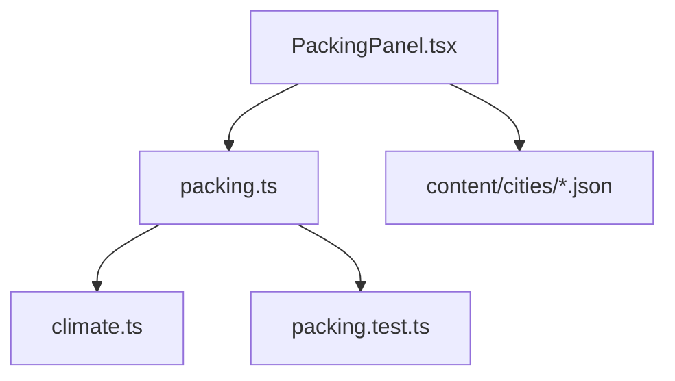
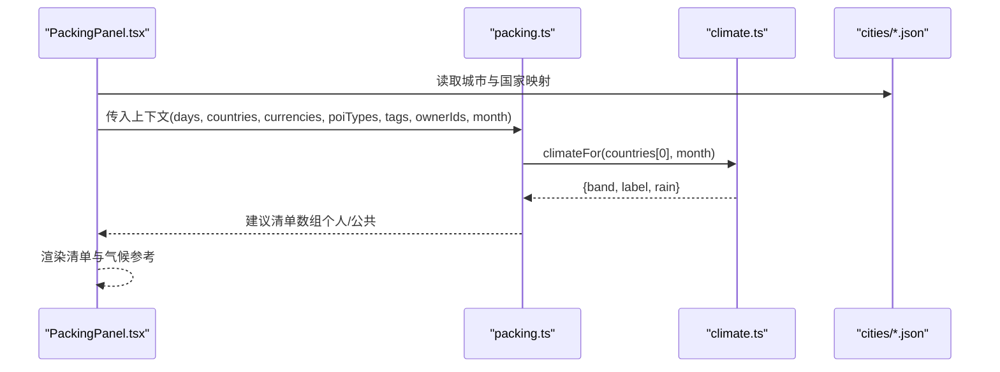
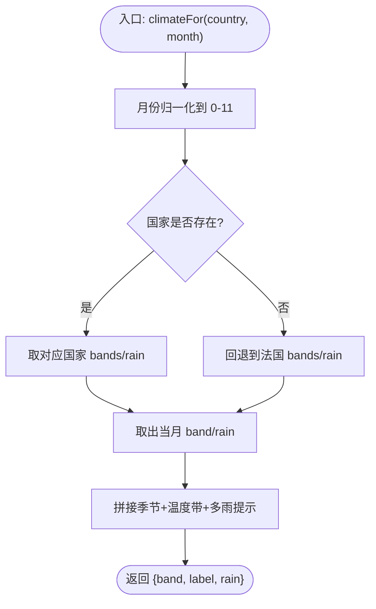
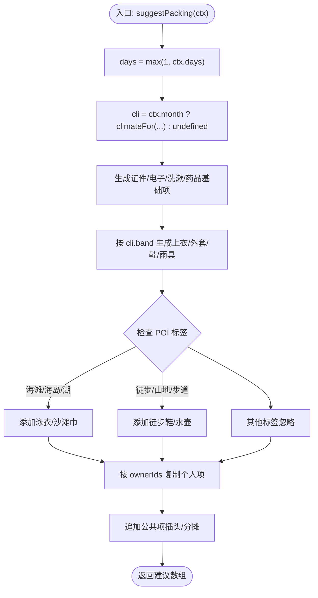
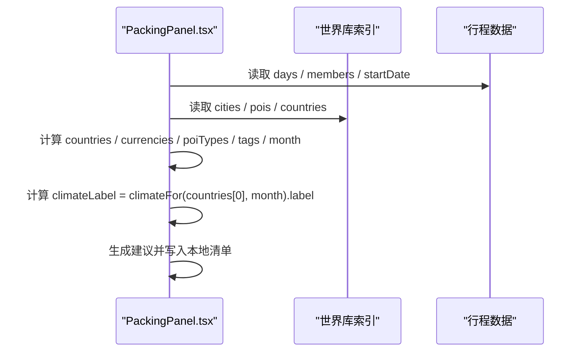
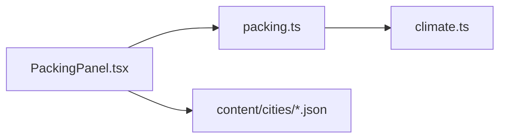

# 气候数据处理

<cite>
**本文引用的文件**
- [climate.ts](file://src/domain/trip/climate.ts)
- [packing.ts](file://src/domain/trip/packing.ts)
- [PackingPanel.tsx](file://src/features/trip/PackingPanel.tsx)
- [packing.test.ts](file://src/domain/trip/packing.test.ts)
- [paris.json](file://content/cities/paris.json)
- [rome.json](file://content/cities/rome.json)
- [zermatt.json](file://content/cities/zermatt.json)
</cite>

## 目录
1. [简介](#简介)
2. [项目结构](#项目结构)
3. [核心组件](#核心组件)
4. [架构总览](#架构总览)
5. [详细组件分析](#详细组件分析)
6. [依赖关系分析](#依赖关系分析)
7. [性能与可扩展性](#性能与可扩展性)
8. [故障排查指南](#故障排查指南)
9. [结论](#结论)
10. [附录：示例数据与打包建议](#附录示例数据与打包建议)

## 简介
本模块为行程规划中的“气候数据处理”提供零成本、可离线、可单测的解决方案。其目标是在行前数月阶段，基于“目的地国家 + 行程月份”推导月度气候带（冷/偏凉/温和/温暖/炎热）与是否多雨，并据此生成用户友好的气候描述（如“初秋·温和，多雨”），最终驱动打包清单的智能生成（衣物分层、雨具、保暖等）。该方案不依赖实时天气 API，避免免费预报窗口限制带来的不确定性，同时保证在弱网或离线环境下仍可工作。

## 项目结构
- 领域层
  - climate.ts：定义气候带类型、月度气候数据表与查询函数，输出结构化气候信息。
  - packing.ts：纯函数式打包建议生成器，依据天数、国家、货币、POI 标签与气候带生成建议草稿。
- 界面层
  - PackingPanel.tsx：将领域逻辑与 UI 结合，计算上下文、展示气候参考、触发智能生成。
- 内容数据
  - content/cities/*.json：城市基础信息（含国家代码），用于推导目的地国家集合与货币集合。
- 测试
  - packing.test.ts：覆盖不同国家/月份的气候带对衣物建议的影响，以及多人复制、公共项等场景。

图表来源
- [PackingPanel.tsx:58-99](file://src/features/trip/PackingPanel.tsx#L58-L99)
- [packing.ts:12-13](file://src/domain/trip/packing.ts#L12-L13)
- [climate.ts:50-59](file://src/domain/trip/climate.ts#L50-L59)

章节来源
- [PackingPanel.tsx:58-99](file://src/features/trip/PackingPanel.tsx#L58-L99)
- [packing.ts:12-13](file://src/domain/trip/packing.ts#L12-L13)
- [climate.ts:50-59](file://src/domain/trip/climate.ts#L50-L59)

## 核心组件
- 气候查询
  - 输入：国家代码（小写 ISO alpha-2）、月份（1-12）
  - 输出：气候带 band、可读标签 label、是否多雨 rain
  - 特点：内置法国/意大利/瑞士三套月度气候带；未知国家回退到法国；月份越界自动取模
- 打包建议生成
  - 输入：行程天数、国家集合、货币集合、POI 类型与标签、成员列表、可选出发月份
  - 输出：分类化的打包建议条目（个人/公共），按成员复制个人项，公共项仅一份
  - 特点：衣物文案随气候带变化；活动标签驱动泳衣/徒步鞋等；无月份时退回通用文案

章节来源
- [climate.ts:11-17](file://src/domain/trip/climate.ts#L11-L17)
- [climate.ts:32-48](file://src/domain/trip/climate.ts#L32-L48)
- [packing.ts:17-45](file://src/domain/trip/packing.ts#L17-L45)
- [packing.ts:47-77](file://src/domain/trip/packing.ts#L47-L77)
- [packing.ts:79-163](file://src/domain/trip/packing.ts#L79-L163)

## 架构总览
系统采用“领域函数 + UI 组装”的分层设计：UI 负责从行程与世界库索引中抽取上下文（国家、货币、POI 标签、月份），调用领域层的打包建议生成器；后者再调用气候查询函数，得到气候带并生成衣物建议。所有核心逻辑均为纯函数，便于单测与复用。

图表来源
- [PackingPanel.tsx:58-99](file://src/features/trip/PackingPanel.tsx#L58-L99)
- [packing.ts:79-83](file://src/domain/trip/packing.ts#L79-L83)
- [climate.ts:50-59](file://src/domain/trip/climate.ts#L50-L59)

## 详细组件分析

### 气候数据模型与查询
- 数据结构
  - ClimateBand：枚举型温度带（cold/cool/mild/warm/hot）
  - ClimateInfo：包含 band、label、rain
  - 月度数据表：每个国家维护 bands[] 与 rain[] 两个长度为 12 的数组
- 查询逻辑
  - 月份归一化：将任意月份映射到 0-11 索引
  - 国家匹配：优先使用传入国家；未知则回退到法国
  - 标签拼接：季节词 + 温度带 + 可选“多雨”后缀
- 复杂度
  - 时间 O(1)，空间 O(1)（固定 12 个月常量）

图表来源
- [climate.ts:50-59](file://src/domain/trip/climate.ts#L50-L59)

章节来源
- [climate.ts:11-17](file://src/domain/trip/climate.ts#L11-L17)
- [climate.ts:32-48](file://src/domain/trip/climate.ts#L32-L48)
- [climate.ts:50-59](file://src/domain/trip/climate.ts#L50-L59)

### 打包建议生成器
- 输入上下文
  - days：行程天数（至少为 1）
  - countries：目的地国家代码集合
  - currencies：目的地货币集合
  - poiTypes/tags：已排 POI 的类型与标签
  - ownerIds：成员 ID 列表（空表示单人模式）
  - month：可选出发月份（用于气候带）
- 生成策略
  - 证件/票据：护照、签证、机票酒店确认、保险；有货币集合时附加现金提示
  - 电子：手机充电器、充电宝、相机/存储卡
  - 衣物：内衣/袜子按天数；上衣/外套按气候带；寒冷加保暖鞋袜；多雨加雨具；始终准备步行鞋
  - 洗漱/药品：基础必备
  - 活动相关：海滩/海岛/湖泊→泳衣/沙滩巾；徒步/山地/步道→徒步鞋/水壶
  - 公共项：转换插头（按目的地插座类型提示）；多人时增加“共用物品分摊”
- 复杂度
  - 时间 O(N)（N 为 POI 标签去重后的数量），空间 O(N)

图表来源
- [packing.ts:79-163](file://src/domain/trip/packing.ts#L79-L163)

章节来源
- [packing.ts:17-45](file://src/domain/trip/packing.ts#L17-L45)
- [packing.ts:47-77](file://src/domain/trip/packing.ts#L47-L77)
- [packing.ts:79-163](file://src/domain/trip/packing.ts#L79-L163)

### UI 集成与上下文构建
- 上下文构建
  - 从行程天数与城市列表推导国家集合
  - 从国家集合推导货币集合
  - 从已排 POI 提取类型与标签集合
  - 从行程起始日期推导月份（UTC 月 + 1）
- 气候参考显示
  - 若存在月份，则以主要目的地国家 + 月份调用气候查询，展示“XX·YY，多雨/少雨”
- 智能生成
  - 点击按钮后调用打包建议生成器，将结果转为本地清单项（支持后续编辑、勾选、分配）

图表来源
- [PackingPanel.tsx:58-99](file://src/features/trip/PackingPanel.tsx#L58-L99)
- [PackingPanel.tsx:135-149](file://src/features/trip/PackingPanel.tsx#L135-L149)

章节来源
- [PackingPanel.tsx:58-99](file://src/features/trip/PackingPanel.tsx#L58-L99)
- [PackingPanel.tsx:135-149](file://src/features/trip/PackingPanel.tsx#L135-L149)

## 依赖关系分析
- 耦合度
  - PackingPanel 依赖 packing 与 climate 两个领域模块，职责清晰
  - packing 仅依赖 climate 提供的月度气候带，低耦合
- 外部依赖
  - 世界库索引（城市/国家/POI）由 UI 层注入，领域层不感知具体实现
  - 城市 JSON 作为静态资源，不参与运行时网络请求
- 循环依赖
  - 无循环依赖；UI → 领域 → 领域，单向依赖

图表来源
- [PackingPanel.tsx:58-99](file://src/features/trip/PackingPanel.tsx#L58-L99)
- [packing.ts:12-13](file://src/domain/trip/packing.ts#L12-L13)
- [climate.ts:50-59](file://src/domain/trip/climate.ts#L50-L59)

章节来源
- [PackingPanel.tsx:58-99](file://src/features/trip/PackingPanel.tsx#L58-L99)
- [packing.ts:12-13](file://src/domain/trip/packing.ts#L12-L13)

## 性能与可扩展性
- 性能
  - 气候查询 O(1)，打包建议生成 O(N)（N 为标签数），整体响应极快
  - 无网络 IO，适合离线与弱网环境
- 可扩展性
  - 新增国家：在 climate.ts 中添加 bands/rain 数组即可
  - 新增活动标签：在 packing.ts 的条件分支中添加对应装备
  - 新增货币/插座提示：可在 UI 层扩展，不影响领域逻辑
- 缓存策略
  - 当前实现为内存级常量与纯函数，天然具备“零开销缓存”特性
  - 如需跨会话持久化，可在 UI 层对生成的建议进行本地存储（例如 IndexedDB），但非必需

## 故障排查指南
- 常见问题
  - 未设置出发日期：无法计算月份，衣物文案退化为通用版本
    - 处理：在 UI 层提示“未设出发日期，衣物按天数给通用数量”
  - 国家代码未知：回退到法国气候带
    - 处理：检查城市数据中的 country 字段是否正确
  - 月份越界：自动取模到 1-12
    - 处理：确保传入月份为整数
- 异常处理
  - 气候查询对缺失键提供默认值（mild/false），避免崩溃
  - 打包建议对 days=0 的情况强制为 1，防止数量为 0
- 验证与回归
  - 通过 packing.test.ts 覆盖多国家/月份组合、多人复制、公共项等关键路径

章节来源
- [PackingPanel.tsx:95-99](file://src/features/trip/PackingPanel.tsx#L95-L99)
- [climate.ts:50-59](file://src/domain/trip/climate.ts#L50-L59)
- [packing.ts:79-83](file://src/domain/trip/packing.ts#L79-L83)
- [packing.test.ts:13-101](file://src/domain/trip/packing.test.ts#L13-L101)

## 结论
本方案以“月度气候带 + 活动标签”为核心，实现了零成本、可离线、可单测的气候数据处理与打包建议生成。它避免了实时天气的不确定性与成本约束，同时通过清晰的领域函数与 UI 解耦，保证了可维护性与可扩展性。对于欧洲主要目的地（法/意/瑞）已具备良好覆盖，未来可按需扩展更多国家与活动标签。

## 附录：示例数据与打包建议
- 数据来源说明
  - 城市数据位于 content/cities/*.json，包含 id、name、country、location、timezone 等字段，用于推导国家与货币
  - 气候数据位于 climate.ts，内置法国/意大利/瑞士的月度气候带与降雨标记
- 示例与对应建议（来自测试用例）
  - 瑞士 1 月（寒冬）
    - 建议：保暖长袖 + 打底、保暖外套/羽绒 + 手套 + 围巾、保暖鞋/厚袜；无雨具
  - 意大利 7 月（盛夏）
    - 建议：短袖/透气上衣、防晒薄衫（备用）；无雨具
  - 法国 9 月（初秋多雨）
    - 建议：薄外套（早晚凉）、折叠伞/防水鞋
- 城市数据示例
  - 巴黎（fr）：温带海洋性，春秋多雨，夏季温和
  - 罗马（it）：南欧偏暖，夏季炎热干燥
  - 采尔马特（ch）：阿尔卑斯山区，冬季寒冷多雪，夏季短促凉爽

章节来源
- [packing.test.ts:73-101](file://src/domain/trip/packing.test.ts#L73-L101)
- [paris.json:1-47](file://content/cities/paris.json#L1-L47)
- [rome.json:1-40](file://content/cities/rome.json#L1-L40)
- [zermatt.json:1-33](file://content/cities/zermatt.json#L1-L33)