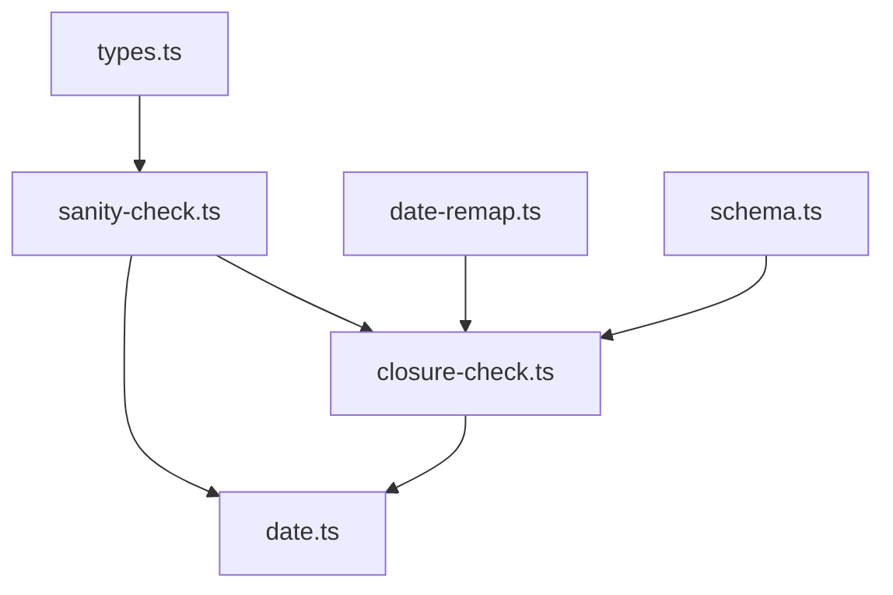
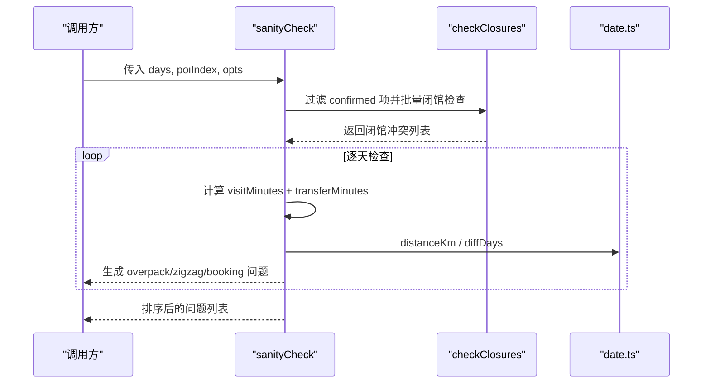
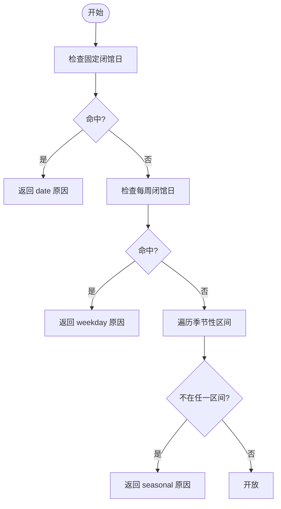
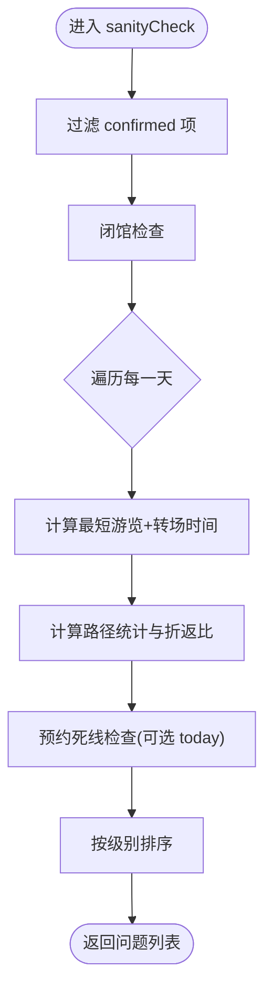
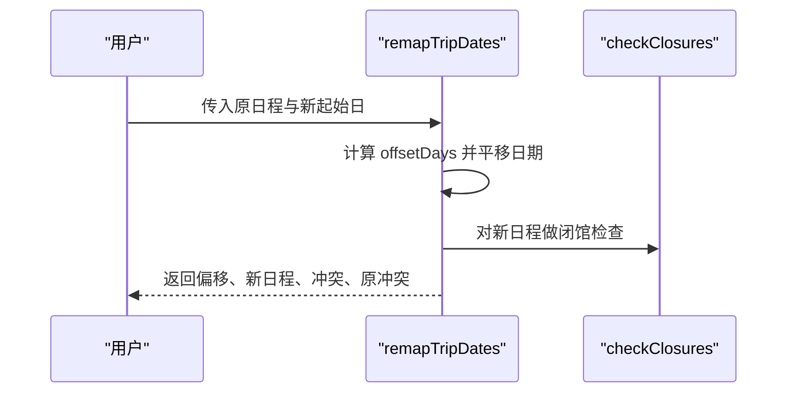
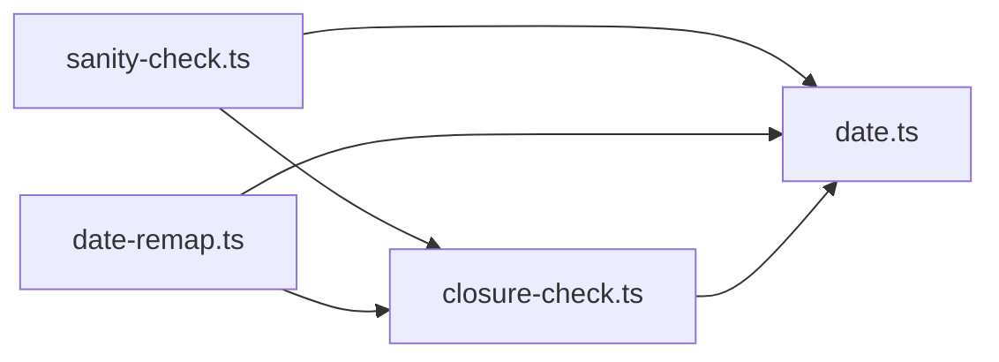

# 行程完整性检查

<cite>
**本文引用的文件**
- [sanity-check.ts](file://src/domain/trip/sanity-check.ts)
- [closure-check.ts](file://src/domain/trip/closure-check.ts)
- [date-remap.ts](file://src/domain/trip/date-remap.ts)
- [date.ts](file://src/domain/date.ts)
- [schema.ts](file://src/domain/world/schema.ts)
- [types.ts](file://src/data/types.ts)
- [sanity-check.test.ts](file://src/domain/trip/sanity-check.test.ts)
- [closure-check.test.ts](file://src/domain/trip/closure-check.test.ts)
</cite>

## 目录
1. [简介](#简介)
2. [项目结构](#项目结构)
3. [核心组件](#核心组件)
4. [架构总览](#架构总览)
5. [详细组件分析](#详细组件分析)
6. [依赖关系分析](#依赖关系分析)
7. [性能考量](#性能考量)
8. [故障排查指南](#故障排查指南)
9. [结论](#结论)
10. [附录：配置与测试](#附录：配置与测试)

## 简介
本模块为“行程完整性检查”提供两大能力：
- sanity-check：在地图预览之外，对已确认的行程进行“别踩坑”体检，覆盖闭馆撞车、一天排太满、折返跑、预约死线四类问题。
- closure-check：基于景点结构化开放信息（每周固定闭馆日、固定闭馆日期、季节性区间）进行闭馆校验，并给出同程内可替换日期建议。

两者均为纯函数，输入是“行程 + POI 快照”，输出是可直接渲染的问题列表，便于前端即时提示与一键改期。

## 项目结构
- 领域层位于 src/domain/trip，包含业务规则实现与单元测试。
- 日期工具位于 src/domain/date.ts，统一以字符串日期处理，避免时区陷阱。
- 世界库 schema 定义 POI 开放信息与数据结构，供校验逻辑使用。
- 数据层类型定义 TripItem/TripDay 等，用于上层 UI/存储与领域层的对接。

图表来源
- [sanity-check.ts:84-176](file://src/domain/trip/sanity-check.ts#L84-L176)
- [closure-check.ts:37-97](file://src/domain/trip/closure-check.ts#L37-L97)
- [date-remap.ts:25-53](file://src/domain/trip/date-remap.ts#L25-L53)
- [schema.ts:114-130](file://src/domain/world/schema.ts#L114-L130)
- [types.ts:151-187](file://src/data/types.ts#L151-L187)

章节来源
- [sanity-check.ts:1-177](file://src/domain/trip/sanity-check.ts#L1-L177)
- [closure-check.ts:1-98](file://src/domain/trip/closure-check.ts#L1-L98)
- [date-remap.ts:1-55](file://src/domain/trip/date-remap.ts#L1-L55)
- [date.ts:1-69](file://src/domain/date.ts#L1-L69)
- [schema.ts:114-130](file://src/domain/world/schema.ts#L114-L130)
- [types.ts:151-187](file://src/data/types.ts#L151-L187)

## 核心组件
- SanityIssue：统一的错误/警告/信息对象，包含级别、类型、日期、关联项 ID、消息。
- CheckPoi / CheckItem / CheckDay：sanity-check 的输入模型，仅纳入 status === 'confirmed' 的项。
- ClosureConflict：闭馆冲突对象，含原因与建议改期日期。
- Openness：POI 开放信息（每周闭馆日、固定闭馆日、季节性区间）。

章节来源
- [sanity-check.ts:17-54](file://src/domain/trip/sanity-check.ts#L17-L54)
- [closure-check.ts:14-30](file://src/domain/trip/closure-check.ts#L14-L30)
- [schema.ts:114-130](file://src/domain/world/schema.ts#L114-L130)

## 架构总览
sanity-check 作为入口，聚合四类检查：
- 闭馆撞车：委托 closure-check 批量校验，返回 error 级问题。
- 一天排太满：按最短游览时长 + 步行转场估算是否超过可用时长。
- 折返跑：计算路径总长与首尾直线距离比值，发现明显绕路。
- 预约死线：对比今天与行程日期差，若未订票且临近 leadDays，则告警。

图表来源
- [sanity-check.ts:84-176](file://src/domain/trip/sanity-check.ts#L84-L176)
- [closure-check.ts:73-97](file://src/domain/trip/closure-check.ts#L73-L97)
- [date.ts:29-35](file://src/domain/date.ts#L29-L35)

## 详细组件分析

### 闭馆检查（closure-check）
- 触发时机：拖入某天、整体平移日期、行前体检全量复查。
- 规则：
  - 固定闭馆日优先匹配。
  - 每周固定闭馆日（周日=0 … 周六=6）。
  - 季节性区间（支持跨年），区间外视为不开放。
- 输出：除冲突外，还从同程其他日期中筛选出可替换的开放日期（最多 3 个），用于“一键改期”。

图表来源
- [closure-check.ts:37-54](file://src/domain/trip/closure-check.ts#L37-L54)

章节来源
- [closure-check.ts:37-97](file://src/domain/trip/closure-check.ts#L37-L97)
- [closure-check.test.ts:24-64](file://src/domain/trip/closure-check.test.ts#L24-L64)

### 行程合理性体检（sanity-check）
- 只纳入 status === 'confirmed' 的项；候选/心愿单/已放弃/已游览不计入。
- 四类检查：
  - closure：复用 closure-check，返回 error。
  - overpack：按最短游览时长 + 步行转场（含固定损耗）估算，超过可用分钟数即告警；超出阈值更严重。
  - zigzag：当日至少 3 个点且总路程 > 6km，且 detourRatio > 2.2 时提示可能走回头路。
  - booking：若 POI 要求提前预约且尚未订票，距出发不足 leadDays 则提醒；剩余天数少于半程时升级为 error。
- 输出：按 error > warn > info 排序，便于 UI 优先展示严重问题。

图表来源
- [sanity-check.ts:84-176](file://src/domain/trip/sanity-check.ts#L84-L176)

章节来源
- [sanity-check.ts:84-176](file://src/domain/trip/sanity-check.ts#L84-L176)
- [sanity-check.test.ts:29-97](file://src/domain/trip/sanity-check.test.ts#L29-L97)

### 日期重映射（date-remap）
- “无脑跟随”的核心：用户选择新出发日，整份行程平移，并立即做闭馆日校验。
- 输出包含偏移天数、平移后的日程、新增冲突与原冲突（用于区分“是我改出来的”还是“人家本来就有”）。

图表来源
- [date-remap.ts:25-53](file://src/domain/trip/date-remap.ts#L25-L53)
- [closure-check.ts:73-97](file://src/domain/trip/closure-check.ts#L73-L97)

章节来源
- [date-remap.ts:1-55](file://src/domain/trip/date-remap.ts#L1-L55)

### 数据模型与约束
- Openness：closedWeekdays（0-6）、closedDates（YYYY-MM-DD）、seasonal（MM-DD 区间，支持跨年）。
- Poi.visit.durationMinutes：[下限, 上限] 分钟，用于 overpack 估算。
- Poi.booking：required + leadDays，驱动 booking 提醒。
- TripItem.status：wishlist/candidate/confirmed/visited/dropped，仅 confirmed 参与体检。

章节来源
- [schema.ts:114-130](file://src/domain/world/schema.ts#L114-L130)
- [schema.ts:173-190](file://src/domain/world/schema.ts#L173-L190)
- [types.ts:151-187](file://src/data/types.ts#L151-L187)

## 依赖关系分析
- sanity-check 依赖 closure-check 与 date.ts 的工具函数。
- closure-check 依赖 date.ts 的 weekday/monthDay/weekdayLabel。
- date-remap 依赖 closure-check 与 date.ts。
- 所有模块均遵循“纯函数 + 字符串日期”的设计，避免副作用与时区问题。

图表来源
- [sanity-check.ts:14-15](file://src/domain/trip/sanity-check.ts#L14-L15)
- [closure-check.ts:11-12](file://src/domain/trip/closure-check.ts#L11-L12)
- [date-remap.ts:7-8](file://src/domain/trip/date-remap.ts#L7-L8)

章节来源
- [sanity-check.ts:14-15](file://src/domain/trip/sanity-check.ts#L14-L15)
- [closure-check.ts:11-12](file://src/domain/trip/closure-check.ts#L11-L12)
- [date-remap.ts:7-8](file://src/domain/trip/date-remap.ts#L7-L8)

## 性能考量
- 复杂度：sanity-check 对每日 POI 列表进行线性扫描，距离计算为 O(n)，总体 O(N)。
- 优化点：
  - 仅在 confirmed 项上计算，减少无效开销。
  - pathStats 仅在点数≥3 且总路程>6km 时进一步判断，避免误报与多余计算。
  - 闭馆检查使用结构化字段直接判定，避免自然语言解析。
- 可扩展性：可通过调整 availableMinutesPerDay、walkKmh、阈值参数适配不同城市与人群。

## 故障排查指南
- 闭馆误报/漏报：
  - 检查 POI 的 Openness 是否正确设置（每周闭馆日、固定闭馆日、季节性区间）。
  - 确认日期格式为 YYYY-MM-DD，且 weekday 计算与系统一致。
- 一天排太满误报：
  - 调整 availableMinutesPerDay 或 walkKmh 参数。
  - 检查 durationMinutes 的下限是否合理。
- 折返跑误报：
  - 若确属必要路线（如跨城多点），可适当提高阈值或放宽条件。
- 预约死线误报：
  - 确认 hasTicket 状态正确；若已购票应不再提醒。
  - 核对 leadDays 与实际平台要求是否一致。

章节来源
- [sanity-check.ts:114-171](file://src/domain/trip/sanity-check.ts#L114-L171)
- [closure-check.ts:37-97](file://src/domain/trip/closure-check.ts#L37-L97)

## 结论
该方案通过结构化开放信息与纯函数式校验，提供了稳定、可解释、可操作的行程完整性保障：
- 闭馆检查给出明确原因与可执行建议。
- 合理性体检覆盖常见规划陷阱，并提供分级提示。
- 日期重映射支持“先预览后确认”的安全改期流程。
- 全部逻辑可测试、可配置、易扩展。

## 附录：配置与测试

### 配置选项
- sanityCheck 的 SanityOptions：
  - availableMinutesPerDay：一天可用于游览的分钟数（默认 9 小时）。
  - walkKmh：平均步行速度 km/h（默认 4.5）。
  - today：当前日期，用于预约死线判断。
- POI 配置：
  - openness.closedWeekdays：每周固定闭馆日（0=周日…6=周六）。
  - openness.closedDates：固定闭馆日列表。
  - openness.seasonal：季节性开放区间（支持跨年）。
  - visit.durationMinutes：[下限, 上限] 分钟。
  - booking.required + booking.leadDays：是否需预约及建议提前天数。

章节来源
- [sanity-check.ts:47-54](file://src/domain/trip/sanity-check.ts#L47-L54)
- [schema.ts:114-130](file://src/domain/world/schema.ts#L114-L130)
- [schema.ts:173-190](file://src/domain/world/schema.ts#L173-L190)

### 测试用例与边界情况
- 闭馆检测：
  - 每周固定闭馆日识别。
  - 指定闭馆日期识别。
  - 季节性区间内外判断（含跨年）。
  - 同程内可替换日期建议。
- 合理性体检：
  - 一天塞多个大馆触发 overpack。
  - 宽松的一天不报警。
  - 闭馆日检出为 error。
  - 临近预约死线且未订票时提醒；已有票券则不提醒。
  - 城市内来回横跳触发 zigzag。
  - 非 confirmed 项不参与体检。
- 日期重映射：
  - 整体平移保持间隔。
  - 平移后撞上闭馆日会被检出，并能区分原冲突。

章节来源
- [closure-check.test.ts:24-97](file://src/domain/trip/closure-check.test.ts#L24-L97)
- [sanity-check.test.ts:21-97](file://src/domain/trip/sanity-check.test.ts#L21-L97)