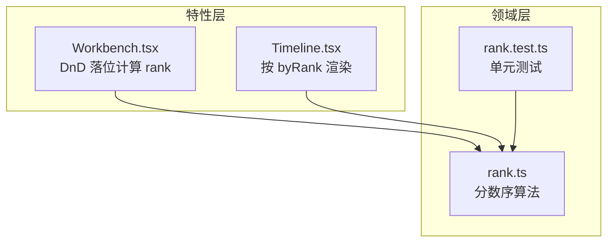
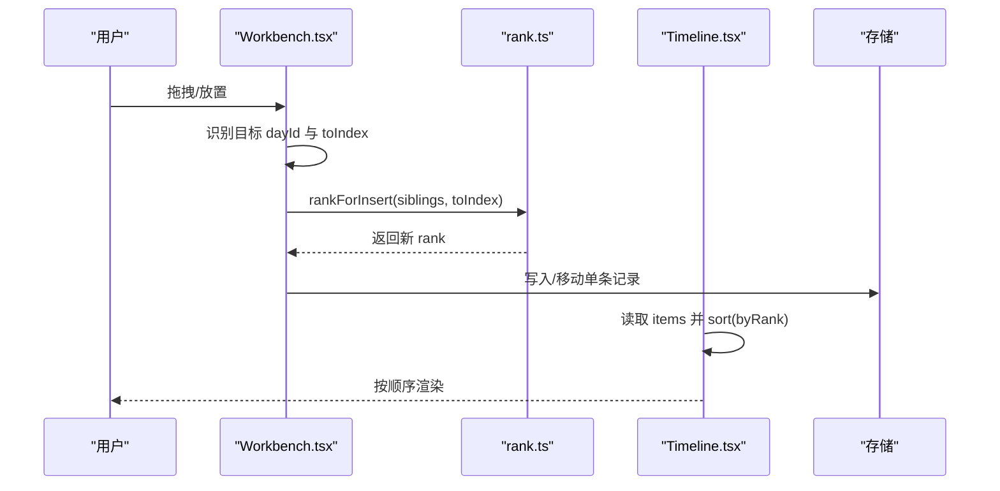
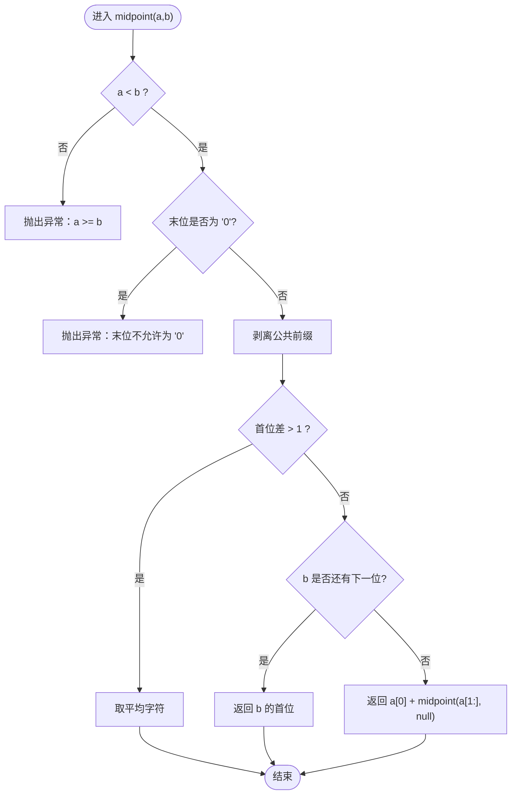
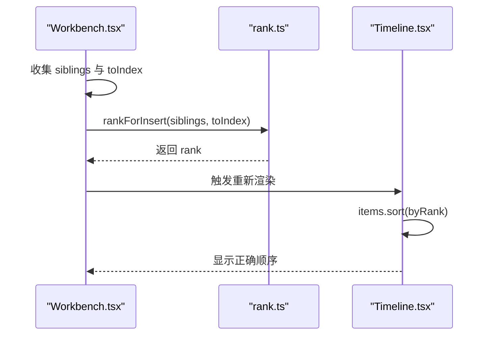
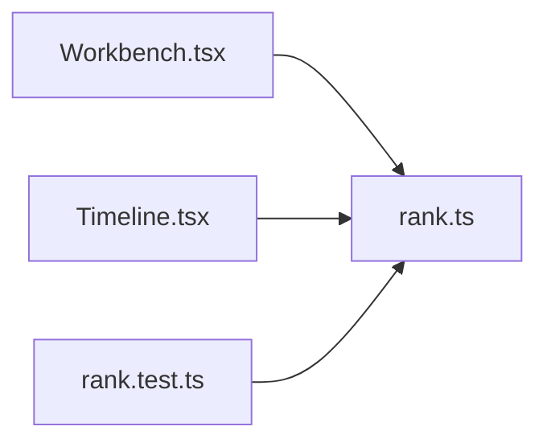

# 行程排序算法

<cite>
**本文引用的文件**
- [rank.ts](file://src/domain/trip/rank.ts)
- [rank.test.ts](file://src/domain/trip/rank.test.ts)
- [Timeline.tsx](file://src/features/trip/Timeline.tsx)
- [Workbench.tsx](file://src/features/trip/Workbench.tsx)
</cite>

## 目录
1. [简介](#简介)
2. [项目结构](#项目结构)
3. [核心组件](#核心组件)
4. [架构总览](#架构总览)
5. [详细组件分析](#详细组件分析)
6. [依赖关系分析](#依赖关系分析)
7. [性能考量](#性能考量)
8. [故障排查指南](#故障排查指南)
9. [结论](#结论)
10. [附录：使用示例与场景](#附录使用示例与场景)

## 简介
本模块实现“分数序（Fractional Index）”作为拖拽排序的排序键，用于在多人协作、频繁拖拽的场景中避免全量重排带来的写放大和并发冲突。其核心思想是将 rank 视为省略了“0.”的 base62 小数，通过计算两个 rank 的中点来生成新的 rank，从而保证插入后仍严格有序，且只更新被拖动的条目本身，天然抗并发。

该方案包含以下关键能力：
- base62 编码与比较
- 中点计算算法（支持递归剥离公共前缀、相邻位借位）
- 边界处理（null 表示最小/最大端）
- 批量生成递增序列
- 基于字符串字典序的比较函数
- 落位时按前后邻居计算新 rank

## 项目结构
- 领域层（domain）
  - src/domain/trip/rank.ts：分数序算法实现
  - src/domain/trip/rank.test.ts：单元测试覆盖
- 特性层（features/trip）
  - src/features/trip/Timeline.tsx：时间线视图，按 byRank 排序展示
  - src/features/trip/Workbench.tsx：工作台，统一 DnD 上下文，调用 rankBetween/rankForInsert 完成落位

**图表来源**
- [rank.ts:1-91](file://src/domain/trip/rank.ts#L1-L91)
- [Timeline.tsx:25-26](file://src/features/trip/Timeline.tsx#L25-L26)
- [Workbench.tsx:22-23](file://src/features/trip/Workbench.tsx#L22-L23)

**章节来源**
- [rank.ts:1-91](file://src/domain/trip/rank.ts#L1-L91)
- [Timeline.tsx:25-26](file://src/features/trip/Timeline.tsx#L25-L26)
- [Workbench.tsx:22-23](file://src/features/trip/Workbench.tsx#L22-L23)

## 核心组件
- rankBetween(a, b)：在 a 与 b 之间生成一个 rank，a/b 为 null 分别表示最小/最大端；保证 a < result < b
- initialRank()：生成列表初始 rank，位于中间区域，便于向两端扩展
- sequentialRanks(n)：一次性生成 n 个严格递增的 rank，适用于导入或复制场景
- byRank(a, b)：基于 rank 字符串字典序的比较函数
- rankForInsert(items, toIndex)：根据目标位置的前后邻居 rank，计算插入位置的 rank

**章节来源**
- [rank.ts:57-90](file://src/domain/trip/rank.ts#L57-L90)

## 架构总览
拖拽排序的整体流程如下：
- 用户在 Workbench 中拖拽条目或从世界库添加 POI
- 根据拖放目标容器与目标位置，确定前后邻居的 rank
- 调用 rankBetween/rankForInsert 计算新 rank
- 仅更新当前条目行，不改动其他条目
- Timeline 使用 byRank 对条目进行排序渲染

**图表来源**
- [Workbench.tsx:154-221](file://src/features/trip/Workbench.tsx#L154-L221)
- [rank.ts:57-90](file://src/domain/trip/rank.ts#L57-L90)
- [Timeline.tsx:524-534](file://src/features/trip/Timeline.tsx#L524-L534)

## 详细组件分析

### 分数序与 base62 编码
- 字符集 DIGITS 长度为 62，将 rank 视作省略“0.”的小数，逐位比较即可得到字典序大小关系
- digit(ch, fallback)：将字符映射到 0..61，非法字符抛错
- 不变量：rank 末位永远不是 '0'，确保在其前面仍可继续插值

复杂度
- 单次 digit 查找：O(1)（固定长度数组 indexOf）
- 空间：常量级

**章节来源**
- [rank.ts:12-20](file://src/domain/trip/rank.ts#L12-L20)

### midpoint(a, b) 中点计算算法
- 输入：a 可为空串表示最小端，b 可为 null 表示最大端；要求 a < b
- 校验：若 a >= b 或任一端末位为 '0'，抛错
- 剥离公共前缀：若 a、b 有相同前缀，则递归处理后缀
- 首位差大于 1：取两数字的平均对应字符
- 首位相邻：
  - 若 b 还有下一位，直接借用 b 的首位作为结果（即缩短一位）
  - 否则沿用 a 的首位并向后递归，直到找到可插入位
- 输出：严格介于 a 与 b 之间的 rank

复杂度
- 时间：O(L)，L 为 rank 字符串长度（每次递归至少减少一位或跳过公共前缀）
- 空间：O(L) 递归栈

**图表来源**
- [rank.ts:22-50](file://src/domain/trip/rank.ts#L22-L50)

**章节来源**
- [rank.ts:22-50](file://src/domain/trip/rank.ts#L22-L50)

### rankBetween(a, b) 边界处理与递归策略
- 将 null 转换为最小/最大端语义：a=null 等价于空串，b=null 等价于无穷大
- 委托 midpoint 完成具体计算
- 保证结果严格落在区间内，适合任意次重复插入同一位置

复杂度
- 时间：O(L)
- 空间：O(L)

**章节来源**
- [rank.ts:57-59](file://src/domain/trip/rank.ts#L57-L59)

### initialRank 与 sequentialRanks
- initialRank()：rankBetween(null, null)，得到一个居中的初始 rank，便于向两端扩展
- sequentialRanks(n)：循环 n 次，依次以 prev 为左边界、null 为右边界生成递增序列，适用于导入/复制等批量场景

复杂度
- 时间：O(n·L)
- 空间：O(n·L) 输出数组

**章节来源**
- [rank.ts:62-76](file://src/domain/trip/rank.ts#L62-L76)

### byRank 比较函数
- 基于字符串字典序比较 rank
- 由于 rank 是 base62 小数的省略形式，字典序等价于数值序

复杂度
- 时间：O(L)
- 空间：O(1)

**章节来源**
- [rank.ts:78-80](file://src/domain/trip/rank.ts#L78-L80)

### rankForInsert 插入算法
- 输入：已按 rank 排序的 items 列表（已移除被拖动项），以及目标下标 toIndex
- 取 before = items[toIndex-1].rank（不存在则为 null），after = items[toIndex].rank（不存在则为 null）
- 调用 rankBetween(before, after) 计算新 rank

复杂度
- 时间：O(L)
- 空间：O(1)

**章节来源**
- [rank.ts:86-90](file://src/domain/trip/rank.ts#L86-L90)

### 在 UI 中的集成
- Timeline.tsx：将 items 按 byRank 排序后渲染，保证视觉顺序与 rank 一致
- Workbench.tsx：
  - 从世界库添加 POI：获取 siblings，调用 rankForInsert(siblings, index) 计算 rank
  - 同一天内拖拽条目：计算移动后的前后邻居 rank，调用 rankBetween 得到新 rank
  - 跨天拖拽：同样依据目标位置的前后邻居计算 rank

**图表来源**
- [Workbench.tsx:154-221](file://src/features/trip/Workbench.tsx#L154-L221)
- [rank.ts:86-90](file://src/domain/trip/rank.ts#L86-L90)
- [Timeline.tsx:524-534](file://src/features/trip/Timeline.tsx#L524-L534)

**章节来源**
- [Workbench.tsx:154-221](file://src/features/trip/Workbench.tsx#L154-L221)
- [Timeline.tsx:524-534](file://src/features/trip/Timeline.tsx#L524-L534)

## 依赖关系分析
- Workbench.tsx 依赖 rank.ts 的 rankBetween、rankForInsert、byRank
- Timeline.tsx 依赖 rank.ts 的 byRank
- rank.test.ts 验证 rankBetween、initialRank、sequentialRanks、rankForInsert 的行为

**图表来源**
- [Workbench.tsx:22-23](file://src/features/trip/Workbench.tsx#L22-L23)
- [Timeline.tsx:25-26](file://src/features/trip/Timeline.tsx#L25-L26)
- [rank.test.ts:1-3](file://src/domain/trip/rank.test.ts#L1-L3)

**章节来源**
- [Workbench.tsx:22-23](file://src/features/trip/Workbench.tsx#L22-L23)
- [Timeline.tsx:25-26](file://src/features/trip/Timeline.tsx#L25-L26)
- [rank.test.ts:1-3](file://src/domain/trip/rank.test.ts#L1-L3)

## 性能考量
- 时间复杂度
  - midpoint：O(L)，L 为 rank 长度；常见 L 较小，常数开销低
  - rankBetween/rankForInsert：O(L)
  - byRank：O(L)
  - 批量 sequentialRanks(n)：O(n·L)
- 空间复杂度
  - 递归栈 O(L)
  - 输出数组 O(n·L)
- 并发安全性
  - 只更新被拖动的单条记录，避免 N 次 UPDATE
  - 通过“末位非 0”的不变量与中点算法，保证多次插入不会耗尽可用空间
  - 测试覆盖了“反复在同一位置插入”的压力场景

[本节为通用性能讨论，无需特定文件引用]

## 故障排查指南
- 常见错误
  - a >= b：说明传入的左右边界无效，检查上游逻辑是否正确识别前后邻居
  - 末位为 '0'：违反不变量，检查生成逻辑是否误用 rankBetween(null, null) 以外的方式构造 rank
- 定位方法
  - 查看 rankBetween/rankForInsert 的调用点（Workbench.tsx）
  - 使用单元测试用例复现问题（rank.test.ts）

**章节来源**
- [rank.ts:22-29](file://src/domain/trip/rank.ts#L22-L29)
- [rank.test.ts:29-41](file://src/domain/trip/rank.test.ts#L29-L41)

## 结论
分数序方案以极小的写放大和稳定的时间复杂度，实现了高并发下的可靠拖拽排序。midpoint 算法通过 base62 编码与递归策略，保证了任意深度插入的可行性；byRank 提供简洁一致的排序语义；rankForInsert 将复杂逻辑封装为“按邻居计算”，便于上层 UI 复用。整体设计兼顾性能、可扩展性与可维护性。

[本节为总结性内容，无需特定文件引用]

## 附录：使用示例与场景
以下为典型场景及对应调用路径（以代码片段路径代替具体代码）：

- 首尾插入
  - 首元素插入：rankForInsert(items, 0) → 取 before=null, after=items[0].rank
  - 末尾插入：rankForInsert(items, items.length) → 取 before=items[last].rank, after=null
  - 参考路径：[rankForInsert:86-90](file://src/domain/trip/rank.ts#L86-L90)

- 中间插入
  - 在索引 i 处插入：rankForInsert(items, i) → 取 before=items[i-1].rank, after=items[i].rank
  - 参考路径：[rankForInsert:86-90](file://src/domain/trip/rank.ts#L86-L90)

- 批量操作
  - 导入/复制生成递增序列：sequentialRanks(n)
  - 参考路径：[sequentialRanks:67-76](file://src/domain/trip/rank.ts#L67-L76)

- 同一天内拖拽条目
  - 计算移动后的前后邻居 rank，调用 rankBetween(prev.rank, next.rank)
  - 参考路径：[拖拽落位:203-221](file://src/features/trip/Workbench.tsx#L203-L221)

- 从世界库添加 POI
  - 获取 siblings，调用 rankForInsert(siblings, index)
  - 参考路径：[添加 POI:158-168](file://src/features/trip/Workbench.tsx#L158-L168)

- 渲染排序
  - 使用 byRank 对 items 排序
  - 参考路径：[排序渲染:524-534](file://src/features/trip/Timeline.tsx#L524-L534)

- 压力测试
  - 反复在同一位置插入仍保持严格有序
  - 参考路径：[压力测试:19-27](file://src/domain/trip/rank.test.ts#L19-L27)