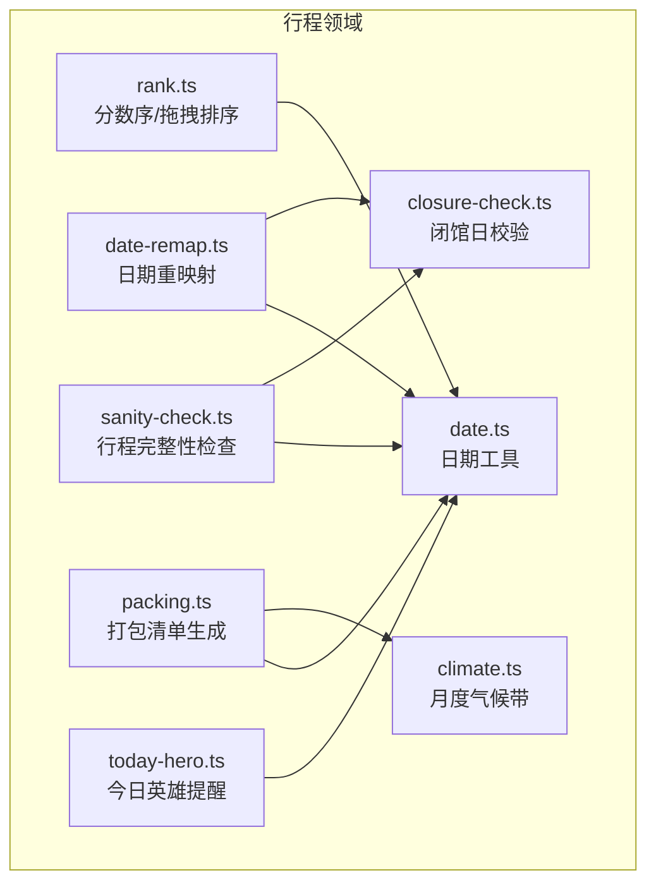
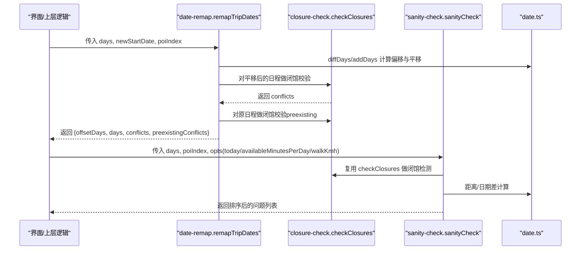
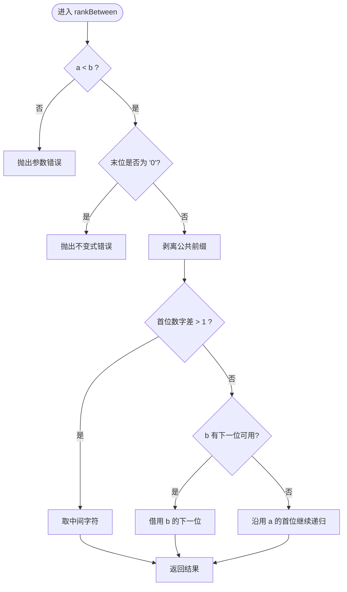
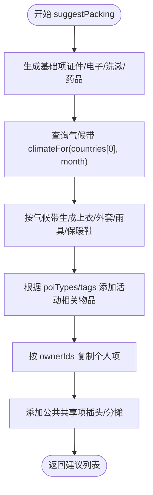
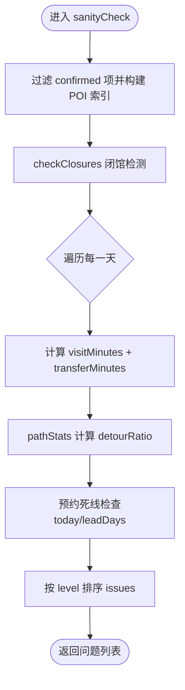
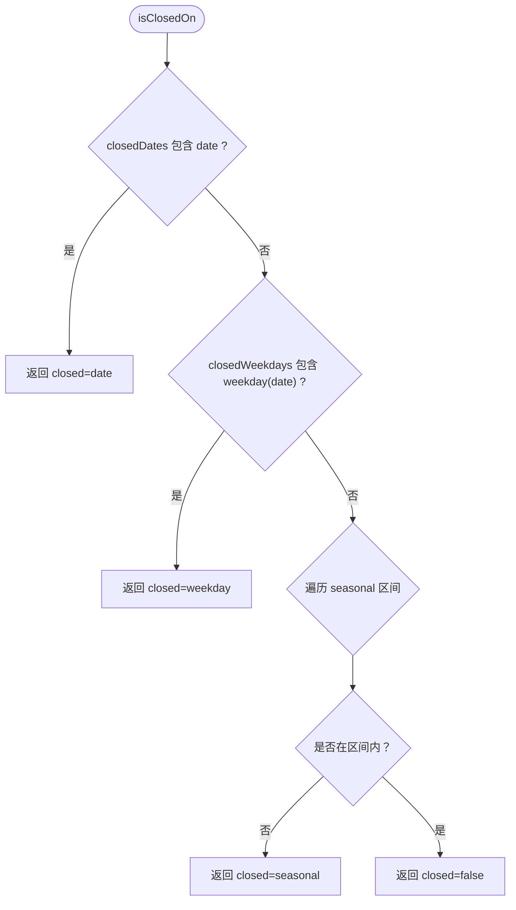
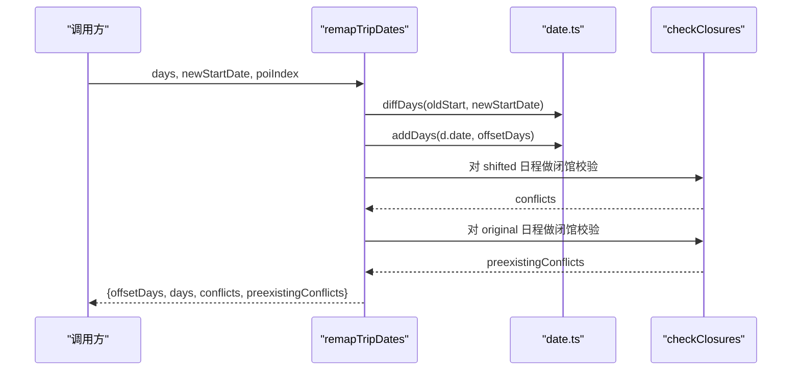
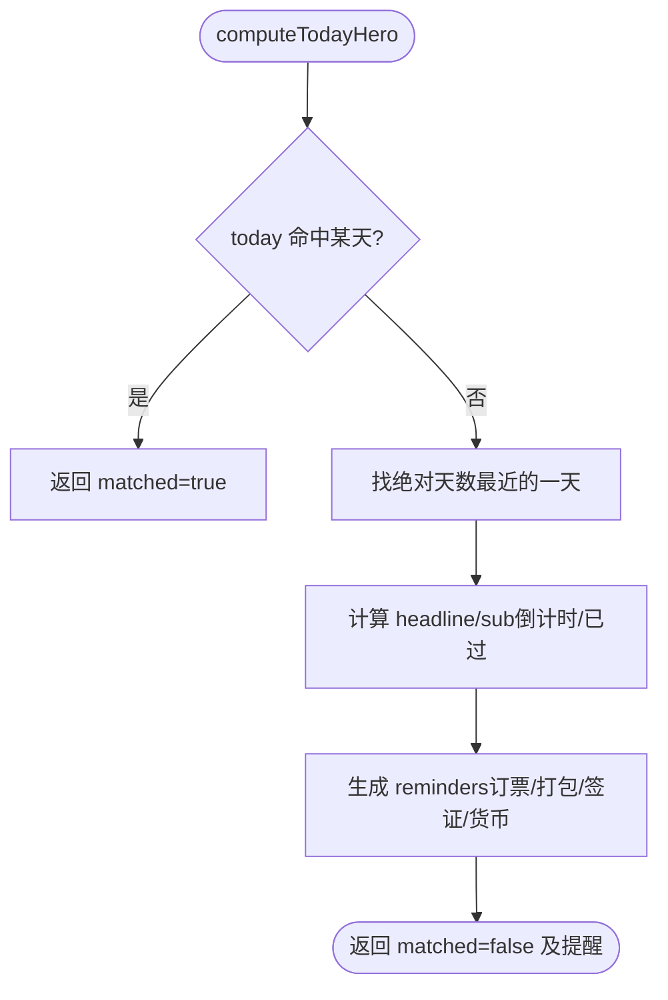
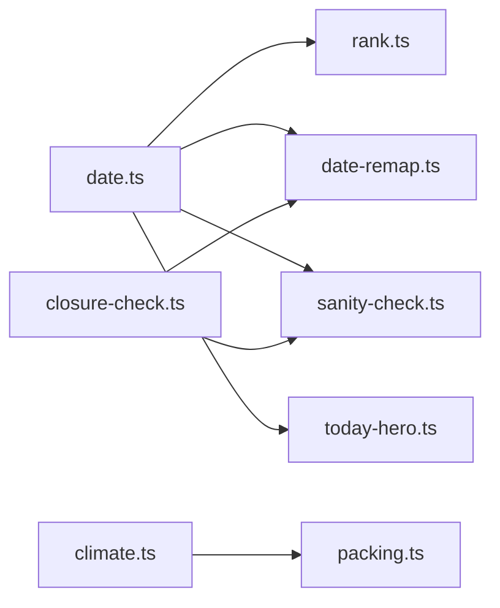

# 行程领域逻辑

<cite>
**本文引用的文件**
- [rank.ts](file://src/domain/trip/rank.ts)
- [packing.ts](file://src/domain/trip/packing.ts)
- [sanity-check.ts](file://src/domain/trip/sanity-check.ts)
- [closure-check.ts](file://src/domain/trip/closure-check.ts)
- [date-remap.ts](file://src/domain/trip/date-remap.ts)
- [today-hero.ts](file://src/domain/trip/today-hero.ts)
- [climate.ts](file://src/domain/trip/climate.ts)
- [date.ts](file://src/domain/date.ts)
- [rank.test.ts](file://src/domain/trip/rank.test.ts)
- [packing.test.ts](file://src/domain/trip/packing.test.ts)
- [sanity-check.test.ts](file://src/domain/trip/sanity-check.test.ts)
- [closure-check.test.ts](file://src/domain/trip/closure-check.test.ts)
- [today-hero.test.ts](file://src/domain/trip/today-hero.test.ts)
</cite>

## 目录
1. [简介](#简介)
2. [项目结构](#项目结构)
3. [核心组件](#核心组件)
4. [架构总览](#架构总览)
5. [详细组件分析](#详细组件分析)
6. [依赖关系分析](#依赖关系分析)
7. [性能考量](#性能考量)
8. [故障排查指南](#故障排查指南)
9. [结论](#结论)
10. [附录：单元测试与边界情况](#附录单元测试与边界情况)

## 简介
本文件聚焦“行程”领域的核心业务算法与规则，覆盖以下关键能力：
- 拖拽排序的分数序（rank）：基于 base62 小数的中点插值，避免并发冲突与全量重排。
- 打包清单生成（packing）：依据目的地气候、活动类型自动生成衣物与装备建议，并支持多人分摊。
- 行程完整性检查（sanity-check）：闭馆撞车、一天排太满、折返跑、预约死线四类体检。
- 景点闭合性检查（closure-check）：按固定闭馆日、周几闭馆、季节性区间判断开放状态，并提供可替换日期建议。
- 日期重映射（date-remap）：“无脑跟随”平移整段行程，并即时校验闭馆冲突。
- 今日英雄（today-hero）：空档期倒计时与准备提醒（订票、打包、签证、货币）。

这些模块均为纯函数或低副作用实现，便于单测与前端预览。

## 项目结构
下图展示各模块在“行程领域”中的职责与交互关系：

图表来源
- [rank.ts:1-91](file://src/domain/trip/rank.ts#L1-L91)
- [packing.ts:1-164](file://src/domain/trip/packing.ts#L1-L164)
- [sanity-check.ts:1-177](file://src/domain/trip/sanity-check.ts#L1-L177)
- [closure-check.ts:1-98](file://src/domain/trip/closure-check.ts#L1-L98)
- [date-remap.ts:1-55](file://src/domain/trip/date-remap.ts#L1-L55)
- [today-hero.ts:1-119](file://src/domain/trip/today-hero.ts#L1-L119)
- [climate.ts:1-60](file://src/domain/trip/climate.ts#L1-L60)
- [date.ts:1-69](file://src/domain/date.ts#L1-L69)

章节来源
- [rank.ts:1-91](file://src/domain/trip/rank.ts#L1-L91)
- [packing.ts:1-164](file://src/domain/trip/packing.ts#L1-L164)
- [sanity-check.ts:1-177](file://src/domain/trip/sanity-check.ts#L1-L177)
- [closure-check.ts:1-98](file://src/domain/trip/closure-check.ts#L1-L98)
- [date-remap.ts:1-55](file://src/domain/trip/date-remap.ts#L1-L55)
- [today-hero.ts:1-119](file://src/domain/trip/today-hero.ts#L1-L119)
- [climate.ts:1-60](file://src/domain/trip/climate.ts#L1-L60)
- [date.ts:1-69](file://src/domain/date.ts#L1-L69)

## 核心组件
- 分数序（rank）：提供 rankBetween、initialRank、sequentialRanks、rankForInsert、byRank，用于拖拽排序键生成与比较，天然抗并发。
- 打包清单（packing）：根据 days、countries、currencies、poiTypes/tags、ownerIds、month 生成 PackingSuggestion 列表，区分个人项与公共共享项。
- 行程体检（sanity-check）：输出 IssueLevel 为 error/warn/info 的问题，涵盖闭馆、过密、折返、预约死线。
- 闭馆校验（closure-check）：基于 Openness 结构化字段判断是否闭馆，并给出同程内可替换日期。
- 日期重映射（date-remap）：计算 offsetDays，平移日程，返回 conflicts 与 preexistingConflicts 对比。
- 今日英雄（today-hero）：若今天命中某天则 matched=true；否则计算最近目标日倒计时，并汇总待订票、打包未完成、签证、货币等提醒。

章节来源
- [rank.ts:1-91](file://src/domain/trip/rank.ts#L1-L91)
- [packing.ts:1-164](file://src/domain/trip/packing.ts#L1-L164)
- [sanity-check.ts:1-177](file://src/domain/trip/sanity-check.ts#L1-L177)
- [closure-check.ts:1-98](file://src/domain/trip/closure-check.ts#L1-L98)
- [date-remap.ts:1-55](file://src/domain/trip/date-remap.ts#L1-L55)
- [today-hero.ts:1-119](file://src/domain/trip/today-hero.ts#L1-L119)

## 架构总览
下图展示了“日期重映射 + 闭馆校验 + 行程体检”的关键调用链：

图表来源
- [date-remap.ts:25-54](file://src/domain/trip/date-remap.ts#L25-L54)
- [closure-check.ts:73-97](file://src/domain/trip/closure-check.ts#L73-L97)
- [sanity-check.ts:84-176](file://src/domain/trip/sanity-check.ts#L84-L176)
- [date.ts:29-68](file://src/domain/date.ts#L29-L68)

## 详细组件分析

### 分数序（rank.ts）：拖拽排序与并发冲突解决
- 设计要点
  - 使用 base62 字符集表示“省略了 0. 的小数”，通过求两个 rank 的中点插入新条目，避免整数 position 的全量更新。
  - 不变式：rank 末位永远不是最小字符 '0'，保证在其前仍可继续插值。
  - 并发友好：每次只写被拖动的那一行，天然抗并发覆盖。
- 关键函数
  - rankBetween(a, b)：在 a 与 b 之间取一个 rank，a/b 为 null 分别表示最前/最后。
  - initialRank()：初始居中 rank，方便向两侧扩展。
  - sequentialRanks(n)：导入/复制时生成 n 个递增 rank。
  - rankForInsert(items, toIndex)：拖拽落位后，基于前后邻居计算新 rank。
  - byRank(a, b)：字符串字典序比较，作为排序键。
- 复杂度
  - midpoint/rankBetween：平均 O(k)，k 为 rank 长度（通常很小），极端情况下逐位递归处理相邻首位。
  - rankForInsert：O(1) 获取前后邻居，O(k) 计算中点。
  - 总体空间：O(1) 额外空间（不计输入/输出）。
- 错误处理
  - 非法字符抛出错误。
  - a >= b 或末位为 '0' 时抛出错误，防止破坏不变式。
- 测试覆盖
  - 两端为空返回居中值、严格落在区间内、重复插入有效、越界抛错、末位不为 '0'、序列递增、空列表行为等。

图表来源
- [rank.ts:22-58](file://src/domain/trip/rank.ts#L22-L58)

章节来源
- [rank.ts:1-91](file://src/domain/trip/rank.ts#L1-L91)
- [rank.test.ts:1-76](file://src/domain/trip/rank.test.ts#L1-L76)

### 打包清单生成（packing.ts）：基于气候与活动的智能建议
- 输入上下文
  - days：行程天数（最少按 1 计）。
  - countries：目的地国家代码集合（ISO alpha-2）。
  - currencies：目的地货币集合。
  - poiTypes/tags：已排 POI 的类型与标签，用于推导活动相关物品。
  - ownerIds：成员 id 列表，个人行李按成员复制；空数组表示单人/匿名模式，个人项归 null。
  - month：行程起始月份（1-12），用于按月气候带推导衣物。
- 算法流程
  - 基础项：证件/票据、电子、洗漱、药品等。
  - 衣物：按 days 与 climateFor(country, month) 返回的气候带生成上衣/外套文案，寒冷地区加保暖鞋/厚袜，多雨地区加雨具。
  - 活动项：海滩/游泳/海岛/湖 → 泳衣、沙滩巾；徒步/山/trail/徒步/alps → 徒步鞋、水壶。
  - 公共项：转换插头（按国家提示）、共用物品分摊（多人时）。
  - 复制策略：个人项按 ownerIds 复制成每人一份；公共项仅一份且 ownerId=null。
- 复杂度
  - 时间：O(N+M+K)，N=days，M=poiTypes+tags 去重大小，K=ownerIds。
  - 空间：O(S)，S 为输出建议条数。
- 边界与容错
  - days<=0 时按 1 计。
  - 无 month 时回退到通用文案。
  - 未知国家默认采用温带数据。
- 测试覆盖
  - 基础项存在、货币现金项、海滩/徒步标签、多人复制、公共项唯一、单人模式、天数下界、不同国家/月份气候差异等。

图表来源
- [packing.ts:79-163](file://src/domain/trip/packing.ts#L79-L163)
- [climate.ts:51-59](file://src/domain/trip/climate.ts#L51-L59)

章节来源
- [packing.ts:1-164](file://src/domain/trip/packing.ts#L1-L164)
- [packing.test.ts:1-102](file://src/domain/trip/packing.test.ts#L1-L102)
- [climate.ts:1-60](file://src/domain/trip/climate.ts#L1-L60)

### 行程完整性检查（sanity-check.ts）：四类体检规则
- 检查类别
  - closure：闭馆撞车（复用 closure-check）。
  - overpack：一天排太满（游览时长下限 + 步行转场 > 可用时长）。
  - zigzag：折返跑（当日路径总长与首尾直线距离比值异常）。
  - booking：预约死线（距出发不足 leadDays 且未购票）。
- 关键计算
  - distanceKm：半正矢公式估算两点间公里数。
  - pathStats：累计路径总长与 span，计算 detourRatio。
  - overpack：visitMinutes = Σ durationMinutes[0]；transferMinutes = Σ (km / walkKmh * 60) + 10 分钟固定损耗；total = visit + transfer。
  - zigzag：pois.length>=3 且 totalKm>6 且 detourRatio>2.2 时报警。
  - booking：diffDays(today, day.date) <= leadDays 且 hasTicket=false 时报警；当剩余天数 <= ceil(leadDays/2) 升级为 error。
- 复杂度
  - 时间：O(D + P + T)，D=天数，P=POI 总数，T=行程总天数用于闭馆检查。
  - 空间：O(I)，I=问题数量。
- 边界与容错
  - 仅统计 status==='confirmed' 的项。
  - availableMinutesPerDay 默认 9 小时；walkKmh 默认 4.5 km/h。
  - 路径点数少于 2 时 detourRatio=1。
- 测试覆盖
  - 大馆塞满报 overpack、宽松不报警、闭馆报错、临近预约死线提醒、已有票券不提醒、城市内横跳触发折返、候选项不计入体检。

图表来源
- [sanity-check.ts:84-176](file://src/domain/trip/sanity-check.ts#L84-L176)
- [closure-check.ts:73-97](file://src/domain/trip/closure-check.ts#L73-L97)

章节来源
- [sanity-check.ts:1-177](file://src/domain/trip/sanity-check.ts#L1-L177)
- [sanity-check.test.ts:1-98](file://src/domain/trip/sanity-check.test.ts#L1-L98)

### 景点闭合性检查（closure-check.ts）：开放状态与改期建议
- 规则
  - closedDates：固定闭馆日。
  - closedWeekdays：每周固定闭馆日（周日=0）。
  - seasonal：季节性区间（支持跨年 from/to）。
- 关键函数
  - isClosedOn(openness, date)：返回 closed/reason/detail。
  - openDatesAmong(openness, candidates)：筛选出开放日期。
  - checkClosures(scheduled, tripDates)：批量校验并给出同程内最多 3 个可替换日期建议。
- 复杂度
  - isClosedOn：O(1 + |seasonal|)。
  - checkClosures：O(S + D·|seasonal|)，S=计划项数，D=候选日期数。
- 测试覆盖
  - 周几闭馆、指定闭馆日、季节性区间、跨年区间、整体平移后冲突检测、可替换日期筛选。

图表来源
- [closure-check.ts:37-54](file://src/domain/trip/closure-check.ts#L37-L54)

章节来源
- [closure-check.ts:1-98](file://src/domain/trip/closure-check.ts#L1-L98)
- [closure-check.test.ts:1-97](file://src/domain/trip/closure-check.test.ts#L1-L97)

### 日期重映射（date-remap.ts）：无脑跟随平移
- 功能
  - 计算 offsetDays = diffDays(oldStart, newStartDate)。
  - 将每个 RemappableDay 的 date 平移 offsetDays。
  - 对平移后的日程进行闭馆校验，得到 conflicts；同时对原日程做闭馆校验得到 preexistingConflicts，用于区分“是我改出来的”还是“原本就有”。
- 复杂度
  - 时间：O(D + P + T)，D=天数，P=POI 总数，T=行程总天数。
  - 空间：O(D + C)，C=冲突数量。
- 测试覆盖
  - 保持间隔平移、平移后冲突检出、区分预存冲突。

图表来源
- [date-remap.ts:25-54](file://src/domain/trip/date-remap.ts#L25-L54)
- [closure-check.ts:73-97](file://src/domain/trip/closure-check.ts#L73-L97)
- [date.ts:29-35](file://src/domain/date.ts#L29-L35)

章节来源
- [date-remap.ts:1-55](file://src/domain/trip/date-remap.ts#L1-L55)
- [closure-check.test.ts:66-89](file://src/domain/trip/closure-check.test.ts#L66-L89)

### 今日英雄（today-hero.ts）：空档期倒计时与准备提醒
- 功能
  - 若 today 命中某一天，返回 matched=true，上层正常渲染当天。
  - 否则找到绝对天数最近的一天，计算 headline（还有 X 天/已过去 X 天）与 sub（日期+城市名）。
  - 生成 reminders：
    - 待订票：需预订且未订的 POI 项。
    - 打包未完成：trip.packing 中 done=false 的项，标注证件类数量。
    - 签证提醒：行程涉及的国家中有需要签证的国家。
    - 货币提醒：baseCurrency 非 CNY。
- 复杂度
  - 时间：O(D + I + P)，D=天数，I=行程项数，P=打包项数。
  - 空间：O(R)，R=提醒数量。
- 测试覆盖
  - 命中当天、未来/过去倒计时、无排期、待订票、打包未完成、多国签证、货币提醒。

图表来源
- [today-hero.ts:37-118](file://src/domain/trip/today-hero.ts#L37-L118)

章节来源
- [today-hero.ts:1-119](file://src/domain/trip/today-hero.ts#L1-L119)
- [today-hero.test.ts:1-168](file://src/domain/trip/today-hero.test.ts#L1-L168)

## 依赖关系分析
- 日期工具（date.ts）被所有模块复用，确保跨时区安全与一致的时间语义。
- closure-check 被 sanity-check 与 date-remap 复用，形成统一的闭馆规则。
- climate.ts 仅被 packing.ts 使用，提供零成本的气候带推断。
- rank.ts 独立于其他模块，仅依赖日期工具（排序比较）。

图表来源
- [date.ts:1-69](file://src/domain/date.ts#L1-L69)
- [closure-check.ts:1-98](file://src/domain/trip/closure-check.ts#L1-L98)
- [climate.ts:1-60](file://src/domain/trip/climate.ts#L1-L60)
- [rank.ts:1-91](file://src/domain/trip/rank.ts#L1-L91)
- [date-remap.ts:1-55](file://src/domain/trip/date-remap.ts#L1-L55)
- [sanity-check.ts:1-177](file://src/domain/trip/sanity-check.ts#L1-L177)
- [today-hero.ts:1-119](file://src/domain/trip/today-hero.ts#L1-L119)
- [packing.ts:1-164](file://src/domain/trip/packing.ts#L1-L164)

章节来源
- [date.ts:1-69](file://src/domain/date.ts#L1-L69)
- [closure-check.ts:1-98](file://src/domain/trip/closure-check.ts#L1-L98)
- [climate.ts:1-60](file://src/domain/trip/climate.ts#L1-L60)
- [rank.ts:1-91](file://src/domain/trip/rank.ts#L1-L91)
- [date-remap.ts:1-55](file://src/domain/trip/date-remap.ts#L1-L55)
- [sanity-check.ts:1-177](file://src/domain/trip/sanity-check.ts#L1-L177)
- [today-hero.ts:1-119](file://src/domain/trip/today-hero.ts#L1-L119)
- [packing.ts:1-164](file://src/domain/trip/packing.ts#L1-L164)

## 性能考量
- 分数序（rank）
  - 优势：每次拖拽仅更新一行，避免 N 次 UPDATE；字符串比较 O(k) 极快。
  - 优化建议：控制 rank 最大长度，必要时可定期压缩（如重新编号），但当前实现已足够高效。
- 打包清单（packing）
  - 时间复杂度线性于输入规模；气候查询 O(1)。
  - 优化建议：缓存 climateFor 结果（相同 country+month），减少重复计算。
- 行程体检（sanity-check）
  - 主要开销在闭馆校验与路径统计；可通过批量化 POI 索引与提前剪枝优化。
  - 优化建议：对超大行程分片计算；对折返阈值动态调整（按城市密度）。
- 闭馆校验（closure-check）
  - 季节性区间较小，开销可控；openDatesAmong 可结合行程日期范围裁剪候选集。
- 日期重映射（date-remap）
  - 线性扫描；可并行化闭馆校验（纯函数无副作用）。
- 今日英雄（today-hero）
  - 线性扫描；可对 tickets/items 建立索引加速查找。

[本节为通用性能讨论，不直接分析具体文件]

## 故障排查指南
- 拖拽排序异常
  - 现象：顺序错乱或无法插入。
  - 排查：检查 rank 末位是否为 '0'；确认 rankBetween 的 a < b 约束；验证 byRank 比较逻辑。
  - 参考：[rank.ts:22-58](file://src/domain/trip/rank.ts#L22-L58)、[rank.test.ts:29-41](file://src/domain/trip/rank.test.ts#L29-L41)
- 打包建议不准确
  - 现象：衣物/活动项不符合预期。
  - 排查：确认 countries、month、poiTypes/tags 是否正确传入；检查 climateFor 返回的气候带；核对 ownerIds 复制逻辑。
  - 参考：[packing.ts:79-163](file://src/domain/trip/packing.ts#L79-L163)、[packing.test.ts:67-100](file://src/domain/trip/packing.test.ts#L67-L100)
- 行程体检误报/漏报
  - 现象：overpack/zigzag/booking 不符合预期。
  - 排查：确认 only confirmed 项参与计算；检查 availableMinutesPerDay、walkKmh；核对 POI durationMinutes 与 location；确认 today 与 leadDays。
  - 参考：[sanity-check.ts:84-176](file://src/domain/trip/sanity-check.ts#L84-L176)、[sanity-check.test.ts:29-98](file://src/domain/trip/sanity-check.test.ts#L29-L98)
- 闭馆冲突与建议
  - 现象：改期建议不正确或未给出。
  - 排查：确认 openness.closedWeekdays/closedDates/seasonal；检查 tripDates 是否包含可替换日期；验证 inSeason 跨年逻辑。
  - 参考：[closure-check.ts:37-97](file://src/domain/trip/closure-check.ts#L37-L97)、[closure-check.test.ts:24-97](file://src/domain/trip/closure-check.test.ts#L24-L97)
- 日期重映射冲突识别
  - 现象：无法区分“新增冲突”与“原有冲突”。
  - 排查：确认 preexistingConflicts 由原日程计算；conflicts 由平移后日程计算；检查 offsetDays 与 addDays 结果。
  - 参考：[date-remap.ts:25-54](file://src/domain/trip/date-remap.ts#L25-L54)、[closure-check.test.ts:66-89](file://src/domain/trip/closure-check.test.ts#L66-L89)
- 今日英雄提醒缺失
  - 现象：未显示订票/打包/签证/货币提醒。
  - 排查：确认 bundle.items/tickets/packing/baseCurrency 数据完整；检查 poiMap 与 cities/countries 索引；核对 today 与 days 匹配逻辑。
  - 参考：[today-hero.ts:37-118](file://src/domain/trip/today-hero.ts#L37-L118)、[today-hero.test.ts:78-168](file://src/domain/trip/today-hero.test.ts#L78-L168)

章节来源
- [rank.ts:22-58](file://src/domain/trip/rank.ts#L22-L58)
- [rank.test.ts:29-41](file://src/domain/trip/rank.test.ts#L29-L41)
- [packing.ts:79-163](file://src/domain/trip/packing.ts#L79-L163)
- [packing.test.ts:67-100](file://src/domain/trip/packing.test.ts#L67-L100)
- [sanity-check.ts:84-176](file://src/domain/trip/sanity-check.ts#L84-L176)
- [sanity-check.test.ts:29-98](file://src/domain/trip/sanity-check.test.ts#L29-L98)
- [closure-check.ts:37-97](file://src/domain/trip/closure-check.ts#L37-L97)
- [closure-check.test.ts:24-97](file://src/domain/trip/closure-check.test.ts#L24-L97)
- [date-remap.ts:25-54](file://src/domain/trip/date-remap.ts#L25-L54)
- [closure-check.test.ts:66-89](file://src/domain/trip/closure-check.test.ts#L66-L89)
- [today-hero.ts:37-118](file://src/domain/trip/today-hero.ts#L37-L118)
- [today-hero.test.ts:78-168](file://src/domain/trip/today-hero.test.ts#L78-L168)

## 结论
该行程领域以纯函数为核心，围绕“分数序”“打包建议”“行程体检”“闭馆校验”“日期重映射”“今日英雄”六大模块构建了高内聚、低耦合的业务能力。其特点包括：
- 并发友好：分数序避免全量更新，天然抗并发。
- 零成本约束：打包建议基于月度气候带而非实时天气，离线可测。
- 规则清晰：闭馆、过密、折返、预约死线四类体检覆盖常见坑点。
- 可解释性强：所有算法均可单测，便于回归与演进。

建议在后续迭代中：
- 引入缓存机制（如 climateFor、POI 索引）提升大规模行程性能。
- 对折返阈值与可用时长进行用户可配置化。
- 扩展气候数据至更多国家与地区。

[本节为总结性内容，不直接分析具体文件]

## 附录：单元测试与边界情况
- 分数序
  - 边界：null/null 返回居中值；反复插入仍有效；a>=b 抛错；末位不为 '0'。
  - 参考：[rank.test.ts:4-41](file://src/domain/trip/rank.test.ts#L4-L41)
- 打包清单
  - 边界：days<=0 按 1 计；无 month 回退通用文案；单人模式不复制；不同国家/月份气候差异。
  - 参考：[packing.test.ts:63-100](file://src/domain/trip/packing.test.ts#L63-L100)
- 行程体检
  - 边界：仅 confirmed 项计入；宽松一天不报警；已有票券不提醒；横跳触发折返。
  - 参考：[sanity-check.test.ts:29-98](file://src/domain/trip/sanity-check.test.ts#L29-L98)
- 闭馆校验
  - 边界：周几闭馆、指定闭馆日、季节性区间、跨年区间；可替换日期筛选。
  - 参考：[closure-check.test.ts:24-97](file://src/domain/trip/closure-check.test.ts#L24-L97)
- 日期重映射
  - 边界：保持间隔平移；区分新增冲突与预存冲突。
  - 参考：[closure-check.test.ts:66-89](file://src/domain/trip/closure-check.test.ts#L66-L89)
- 今日英雄
  - 边界：命中当天；未来/过去倒计时；无排期；待订票；打包未完成；多国签证；货币提醒。
  - 参考：[today-hero.test.ts:78-168](file://src/domain/trip/today-hero.test.ts#L78-L168)

章节来源
- [rank.test.ts:1-76](file://src/domain/trip/rank.test.ts#L1-L76)
- [packing.test.ts:1-102](file://src/domain/trip/packing.test.ts#L1-L102)
- [sanity-check.test.ts:1-98](file://src/domain/trip/sanity-check.test.ts#L1-L98)
- [closure-check.test.ts:1-97](file://src/domain/trip/closure-check.test.ts#L1-L97)
- [today-hero.test.ts:1-168](file://src/domain/trip/today-hero.test.ts#L1-L168)