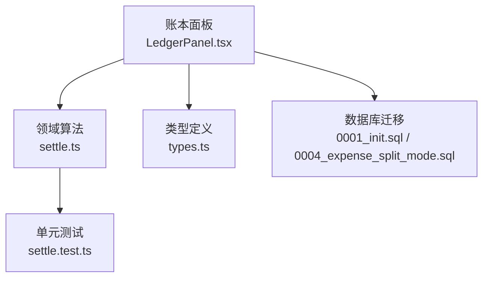
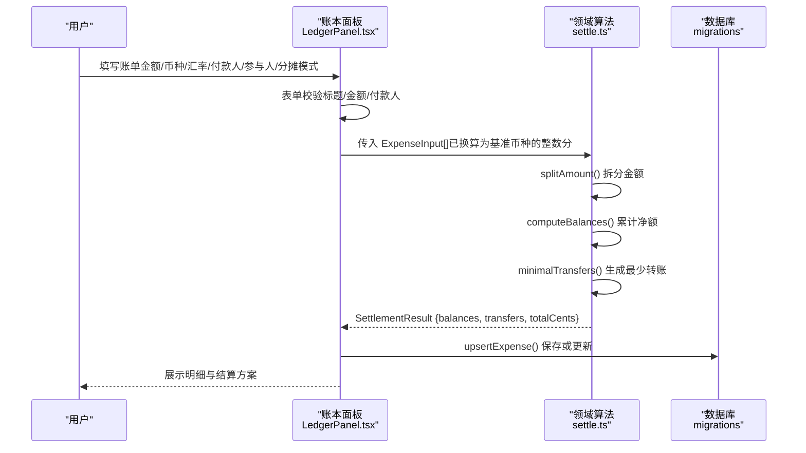
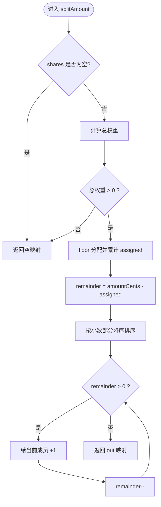
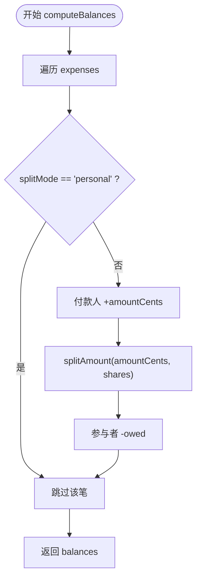
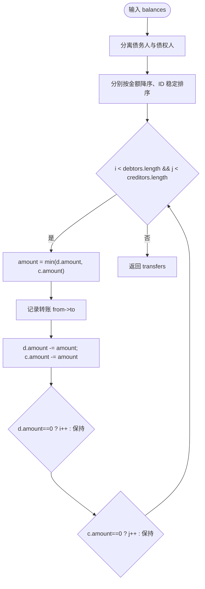
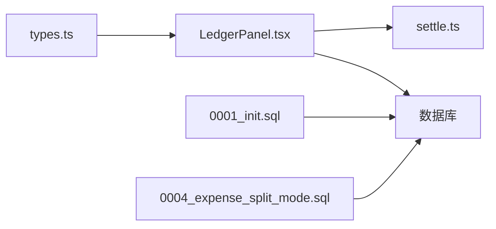

# 费用领域逻辑

<cite>
**本文引用的文件**
- [settle.ts](file://src/domain/expense/settle.ts)
- [settle.test.ts](file://src/domain/expense/settle.test.ts)
- [LedgerPanel.tsx](file://src/features/expense/LedgerPanel.tsx)
- [0001_init.sql](file://supabase/migrations/0001_init.sql)
- [0004_expense_split_mode.sql](file://supabase/migrations/0004_expense_split_mode.sql)
- [types.ts](file://src/data/types.ts)
- [技术方案.md](file://docs/技术方案.md)
</cite>

## 目录
1. [简介](#简介)
2. [项目结构](#项目结构)
3. [核心组件](#核心组件)
4. [架构总览](#架构总览)
5. [详细组件分析](#详细组件分析)
6. [依赖关系分析](#依赖关系分析)
7. [性能与复杂度](#性能与复杂度)
8. [多币种与精度控制](#多币种与精度控制)
9. [费用记录验证规则与约束](#费用记录验证规则与约束)
10. [测试用例与异常处理](#测试用例与异常处理)
11. [大规模数据处理建议](#大规模数据处理建议)
12. [结论](#结论)

## 简介
本文件面向“费用领域”的核心算法，重点解释智能分摊与结算：
- 多种分摊模式支持（共同 AA、个人自付）
- 债务关系计算（净额归一）
- 优化结算路径生成（最少转账次数）
- 多币种支持与汇率转换、精度控制
- 费用记录的验证规则与约束
- 时间复杂度分析与内存优化建议
- 完整测试覆盖与异常处理策略

该实现以“整数分”为唯一金额单位，避免浮点误差累积；以成员 ID 为结算主体，确保幽灵成员也能参与结算。

## 项目结构
费用领域由三层构成：
- 领域层（domain/expense）：纯函数算法，负责分摊、净额计算、最小转账方案生成
- 展示层（features/expense）：账本面板，负责采集输入、调用领域算法并渲染结果
- 数据层（data + migrations）：类型定义、数据库表结构与校验约束

图表来源
- [LedgerPanel.tsx:71-81](file://src/features/expense/LedgerPanel.tsx#L71-L81)
- [settle.ts:1-141](file://src/domain/expense/settle.ts#L1-L141)
- [0001_init.sql:162-190](file://supabase/migrations/0001_init.sql#L162-L190)
- [0004_expense_split_mode.sql:1-9](file://supabase/migrations/0004_expense_split_mode.sql#L1-L9)

章节来源
- [LedgerPanel.tsx:1-120](file://src/features/expense/LedgerPanel.tsx#L1-L120)
- [settle.ts:1-141](file://src/domain/expense/settle.ts#L1-L141)
- [0001_init.sql:162-190](file://supabase/migrations/0001_init.sql#L162-L190)
- [0004_expense_split_mode.sql:1-9](file://supabase/migrations/0004_expense_split_mode.sql#L1-L9)

## 核心组件
- 分摊拆分 splitAmount：按权重将一笔金额拆给多个成员，使用最大余数法保证总和守恒
- 净额计算 computeBalances：对每笔支出，付款人记正、参与者按比例记负，累计得到每人净额
- 最小转账 minimalTransfers：贪心策略，每次让欠最多的人直接还给被欠最多的人，生成最少转账链
- 结算入口 settle：组合上述步骤，输出 balances、transfers、totalCents
- 货币格式化 formatMoney：将整数分格式化为带符号的本地化金额字符串

章节来源
- [settle.ts:38-141](file://src/domain/expense/settle.ts#L38-L141)

## 架构总览
从用户记账到结算展示的端到端流程如下：

图表来源
- [LedgerPanel.tsx:71-144](file://src/features/expense/LedgerPanel.tsx#L71-L144)
- [settle.ts:72-130](file://src/domain/expense/settle.ts#L72-L130)
- [0001_init.sql:162-190](file://supabase/migrations/0001_init.sql#L162-L190)

## 详细组件分析

### 分摊拆分 splitAmount
- 目标：按权重将 amountCents 精确分配给各成员，保证总和等于原额
- 方法：先 floor 分配，再按小数部分从大到小逐个加 1，直到余数为 0
- 复杂度：O(n)，n 为参与人数
- 边界：空 shares 返回空映射；总权重非正返回空映射

图表来源
- [settle.ts:38-70](file://src/domain/expense/settle.ts#L38-L70)

章节来源
- [settle.ts:38-70](file://src/domain/expense/settle.ts#L38-L70)
- [settle.test.ts:6-30](file://src/domain/expense/settle.test.ts#L6-L30)

### 净额计算 computeBalances
- 目标：汇总所有共同支出后，得到每人净应收/应付
- 规则：
  - personal 模式整笔跳过，不参与共同分摊
  - aa 模式下，付款人记 +amountCents，参与者按比例记 -owed
- 复杂度：O(m + n)，m 为支出笔数，n 为每笔参与人数之和
- 不变式：所有余额之和恒为 0

图表来源
- [settle.ts:72-86](file://src/domain/expense/settle.ts#L72-L86)

章节来源
- [settle.ts:72-86](file://src/domain/expense/settle.ts#L72-L86)
- [settle.test.ts:32-59](file://src/domain/expense/settle.test.ts#L32-L59)

### 最小转账 minimalTransfers
- 目标：基于净额生成最少转账方案
- 策略：贪心——每次选择欠最多者与被欠最多者进行转账，直至全部结清
- 复杂度：O(p + q)，p 为债务人数量，q 为债权人数量
- 性质：转账次数不超过 n-1（n 为涉及人数），适合旅行场景

图表来源
- [settle.ts:93-121](file://src/domain/expense/settle.ts#L93-L121)

章节来源
- [settle.ts:93-121](file://src/domain/expense/settle.ts#L93-L121)
- [settle.test.ts:62-79](file://src/domain/expense/settle.test.ts#L62-L79)

### 结算入口 settle
- 组合 computeBalances 与 minimalTransfers，并统计 totalCents
- 输出：balances、transfers、totalCents

章节来源
- [settle.ts:123-130](file://src/domain/expense/settle.ts#L123-L130)

### 展示层 LedgerPanel 集成
- 表单校验：标题必填、金额大于 0、付款人必选
- 分摊模式：aa（默认全员均摊或自定义权重）、personal（整笔跳过）
- 多币种：记录原始币种与 fxRate，在结算前换算为基准币种整数分
- 实时结算：使用 useMemo 缓存，expenses 变化时重算
- 错误提示：通过 toast 反馈保存/删除失败

章节来源
- [LedgerPanel.tsx:71-144](file://src/features/expense/LedgerPanel.tsx#L71-L144)
- [LedgerPanel.tsx:284-305](file://src/features/expense/LedgerPanel.tsx#L284-L305)
- [LedgerPanel.tsx:376-414](file://src/features/expense/LedgerPanel.tsx#L376-L414)

## 依赖关系分析
- 展示层依赖领域层：LedgerPanel 调用 settle、formatMoney
- 领域层无外部依赖：纯函数，便于单测与复用
- 数据层提供类型与约束：types.ts 定义 Expense 等结构；migrations 定义字段与检查约束
- 历史兼容：旧账单缺失 splitMode 时默认 aa

图表来源
- [types.ts:212-228](file://src/data/types.ts#L212-L228)
- [LedgerPanel.tsx:10-16](file://src/features/expense/LedgerPanel.tsx#L10-L16)
- [0001_init.sql:162-190](file://supabase/migrations/0001_init.sql#L162-L190)
- [0004_expense_split_mode.sql:1-9](file://supabase/migrations/0004_expense_split_mode.sql#L1-L9)

章节来源
- [types.ts:212-228](file://src/data/types.ts#L212-L228)
- [LedgerPanel.tsx:10-16](file://src/features/expense/LedgerPanel.tsx#L10-L16)
- [0001_init.sql:162-190](file://supabase/migrations/0001_init.sql#L162-L190)
- [0004_expense_split_mode.sql:1-9](file://supabase/migrations/0004_expense_split_mode.sql#L1-L9)

## 性能与复杂度
- splitAmount：O(n)，n 为参与人数；空间 O(n)
- computeBalances：O(m + n)，m 为支出笔数，n 为参与人数总和；空间 O(k)，k 为成员数
- minimalTransfers：O(p + q)，p/q 分别为债务人和债权人数量；空间 O(t)，t 为转账笔数
- settle：总体线性于输入规模，适合旅行场景（通常 m ≤ 数百，k ≤ 数十）
- 内存优化建议：
  - 避免重复创建对象：在循环中复用临时数组
  - 大额数据流式处理：分批计算 balances，增量合并
  - 排序稳定性：使用稳定排序以保证结果可复现（当前已按金额降序+ID 比较）

[本节为通用性能讨论，不直接分析具体代码行]

## 多币种与精度控制
- 存储规范：金额一律以整数分（cents）存储，避免浮点漂移
- 汇率策略：每笔记录 currency 与 fxRate（换算到 trip.base_currency），前端内置参考汇率，出发前手动更新
- 换算时机：展示层在提交前将外币金额乘以 fxRate 并四舍五入为整数分，再交给领域层统一计算
- 展示格式化：formatMoney 根据币种符号与本地化规则输出，保留两位小数

章节来源
- [技术方案.md:317-323](file://docs/技术方案.md#L317-L323)
- [LedgerPanel.tsx:27-30](file://src/features/expense/LedgerPanel.tsx#L27-L30)
- [LedgerPanel.tsx:71-81](file://src/features/expense/LedgerPanel.tsx#L71-L81)
- [LedgerPanel.tsx:284-305](file://src/features/expense/LedgerPanel.tsx#L284-L305)
- [settle.ts:132-141](file://src/domain/expense/settle.ts#L132-L141)

## 费用记录验证规则与约束
- 前端校验：
  - 标题必填
  - 金额必须大于 0
  - 付款人必选
  - 分摊模式：aa/personal；personal 时 shares 为空，结算跳过
- 后端约束（数据库）：
  - amount_cents > 0
  - currency 为三位字符
  - fx_rate numeric(12,6)
  - payer_member_id 外键引用 trip_members
  - split_mode 限定为 'aa' 或 'personal'
  - expense_shares.weight > 0

章节来源
- [LedgerPanel.tsx:83-107](file://src/features/expense/LedgerPanel.tsx#L83-L107)
- [0001_init.sql:162-190](file://supabase/migrations/0001_init.sql#L162-L190)
- [0004_expense_split_mode.sql:1-9](file://supabase/migrations/0004_expense_split_mode.sql#L1-L9)

## 测试用例与异常处理
- 分摊拆分：
  - 除不尽时使用最大余数法，总和守恒
  - 支持权重分摊
  - 大量小额分摊不产生累计漂移
- 净额计算：
  - 付款人记正、参与者记负，总和为 0
  - 幽灵成员参与结算
  - personal 模式整笔跳过
- 最小转账：
  - 三人一笔账只需两次转账链
  - 互相抵消后不产生多余转账
  - 转账笔数不超过 n-1
- 端到端：
  - 多笔混合支出后，执行转账方案所有人归零
- 异常处理：
  - 前端保存/删除失败通过 toast 提示错误信息
  - 领域层纯函数无异常抛出，便于上层捕获与重试

章节来源
- [settle.test.ts:6-108](file://src/domain/expense/settle.test.ts#L6-L108)
- [LedgerPanel.tsx:130-144](file://src/features/expense/LedgerPanel.tsx#L130-L144)
- [LedgerPanel.tsx:184-193](file://src/features/expense/LedgerPanel.tsx#L184-L193)

## 大规模数据处理建议
- 批处理：对大量支出，按 trip_id 或 day_id 分批计算 balances，减少单次内存占用
- 增量更新：新增/修改/删除支出时，仅重新计算受影响成员的净额
- 索引优化：数据库层面已对 trip_id 建立索引，提升查询效率
- 缓存策略：前端使用 useMemo 缓存结算结果，避免重复计算
- 流式输出：如需导出结算方案，可按成员维度流式生成转账计划

[本节为通用优化建议，不直接分析具体代码行]

## 结论
该费用领域实现以“整数分”为核心，结合最大余数分摊与贪心最小转账，提供了高精度、低复杂度的结算方案。展示层负责多币种输入与校验，领域层专注算法正确性，数据层提供强约束保障。整体设计清晰、可测试性强，适用于旅行场景下的多人费用分摊与结算需求。