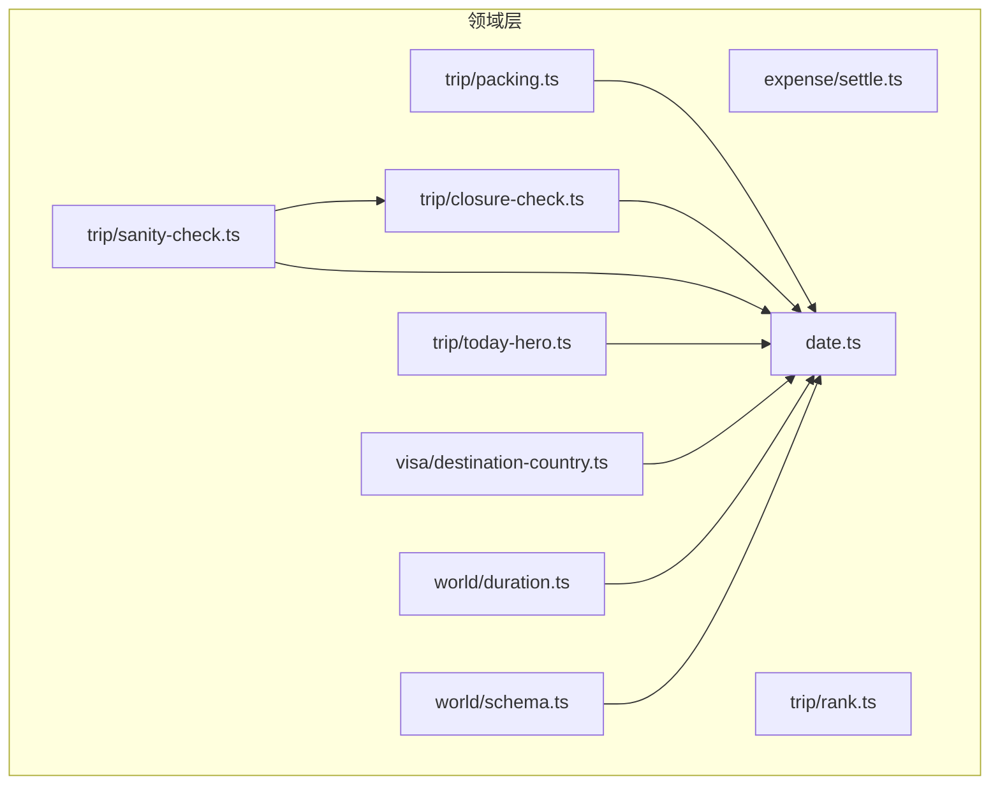
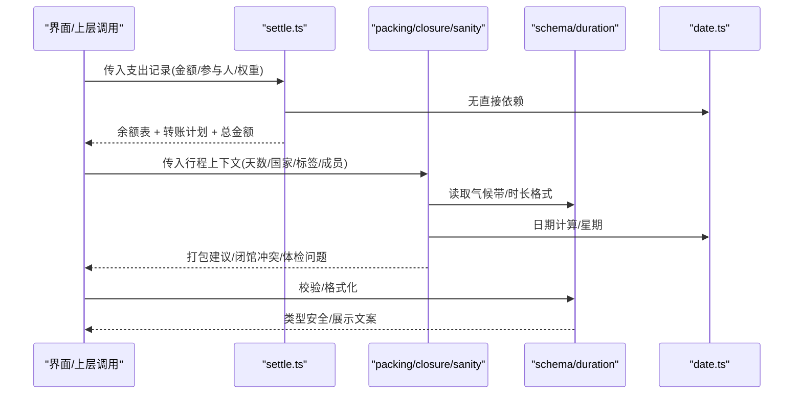
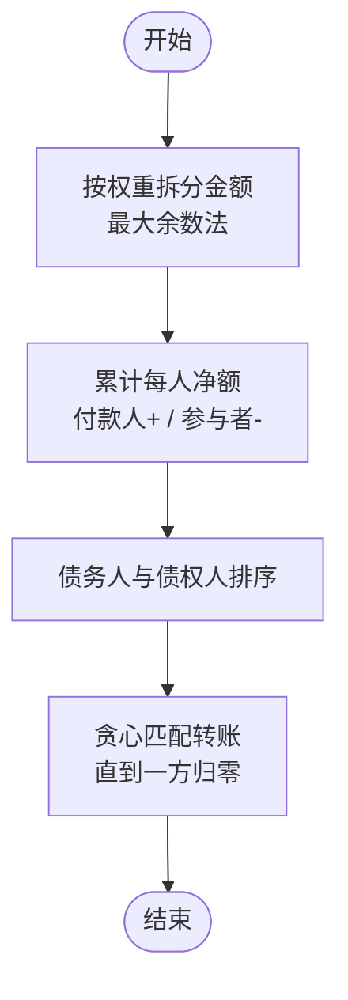
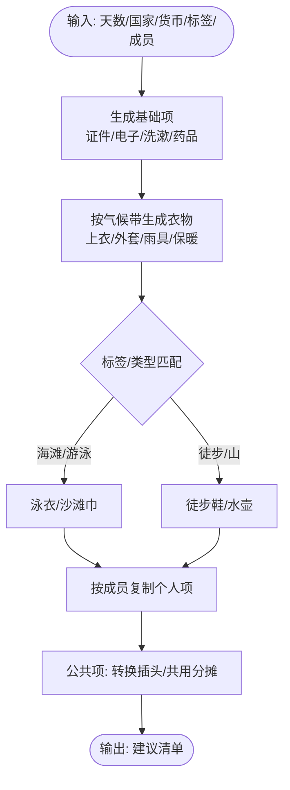
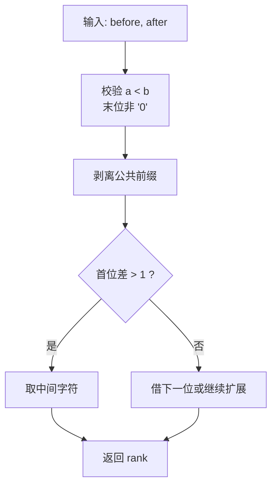
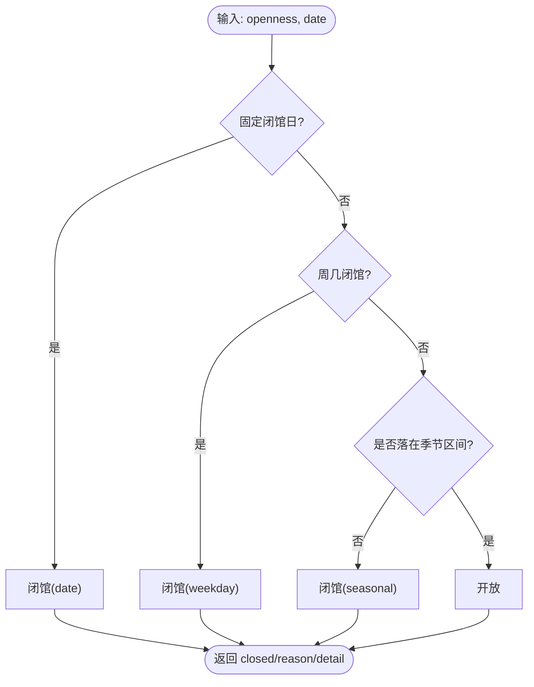
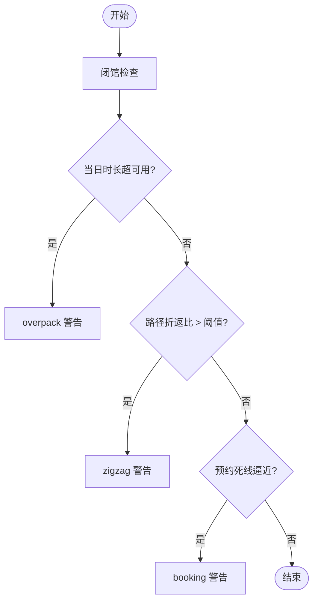
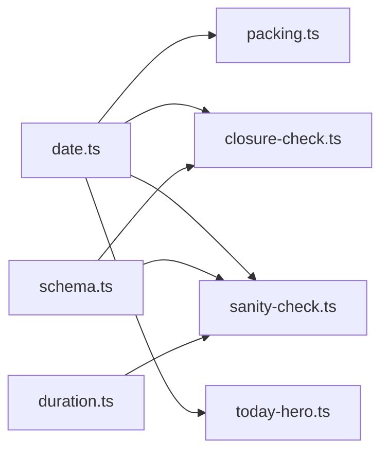

# 领域逻辑

<cite>
**本文引用的文件**
- [src/domain/expense/settle.ts](file://src/domain/expense/settle.ts)
- [src/domain/expense/settle.test.ts](file://src/domain/expense/settle.test.ts)
- [src/domain/trip/packing.ts](file://src/domain/trip/packing.ts)
- [src/domain/trip/packing.test.ts](file://src/domain/trip/packing.test.ts)
- [src/domain/trip/rank.ts](file://src/domain/trip/rank.ts)
- [src/domain/trip/rank.test.ts](file://src/domain/trip/rank.test.ts)
- [src/domain/trip/closure-check.ts](file://src/domain/trip/closure-check.ts)
- [src/domain/trip/closure-check.test.ts](file://src/domain/trip/closure-check.test.ts)
- [src/domain/trip/sanity-check.ts](file://src/domain/trip/sanity-check.ts)
- [src/domain/trip/today-hero.ts](file://src/domain/trip/today-hero.ts)
- [src/domain/world/duration.ts](file://src/domain/world/duration.ts)
- [src/domain/world/duration.test.ts](file://src/domain/world/duration.test.ts)
- [src/domain/visa/destination-country.ts](file://src/domain/visa/destination-country.ts)
- [src/domain/date.ts](file://src/domain/date.ts)
- [src/domain/world/schema.ts](file://src/domain/world/schema.ts)
</cite>

## 目录
1. [简介](#简介)
2. [项目结构](#项目结构)
3. [核心组件](#核心组件)
4. [架构总览](#架构总览)
5. [详细组件分析](#详细组件分析)
6. [依赖分析](#依赖分析)
7. [性能考虑](#性能考虑)
8. [故障排查指南](#故障排查指南)
9. [结论](#结论)
10. [附录：单元测试与边界情况](#附录单元测试与边界情况)

## 简介
本文件聚焦“玩无一失”的领域逻辑层，围绕纯函数设计、业务规则验证与核心算法实现进行系统化说明。重点覆盖：
- 费用分摊与结算（整数分运算、权重分摊、最少转账次数）
- 打包清单生成（基于气候带与活动标签的智能建议）
- 行程排序键（分数序 rank，抗并发拖拽）
- 闭馆日校验与可执行改期建议
- 行程合理性体检（过满、折返跑、预约死线）
- “今天”提醒推导（倒计时与待办提醒）
- 签证送签国判断与行程单生成
- 世界库 schema 与内容校验规则
- 日期工具（避免时区陷阱）

所有模块均为纯函数或数据驱动，便于单测、可复现、易维护。

## 项目结构
领域逻辑集中在 src/domain 下，按主题划分：
- expense：账本分摊与结算
- trip：行程相关（打包、排序、闭馆检查、合理性体检、今日提醒）
- world：世界库 schema、时长格式化、时效性校验
- visa：送签国判断与行程单
- date：纯字符串日期工具

图表来源
- [src/domain/expense/settle.ts:1-141](file://src/domain/expense/settle.ts#L1-L141)
- [src/domain/trip/packing.ts:1-164](file://src/domain/trip/packing.ts#L1-L164)
- [src/domain/trip/rank.ts:1-91](file://src/domain/trip/rank.ts#L1-L91)
- [src/domain/trip/closure-check.ts:1-98](file://src/domain/trip/closure-check.ts#L1-L98)
- [src/domain/trip/sanity-check.ts:1-177](file://src/domain/trip/sanity-check.ts#L1-L177)
- [src/domain/trip/today-hero.ts:1-119](file://src/domain/trip/today-hero.ts#L1-L119)
- [src/domain/world/schema.ts:1-317](file://src/domain/world/schema.ts#L1-L317)
- [src/domain/world/duration.ts:1-24](file://src/domain/world/duration.ts#L1-L24)
- [src/domain/visa/destination-country.ts:1-119](file://src/domain/visa/destination-country.ts#L1-L119)
- [src/domain/date.ts:1-69](file://src/domain/date.ts#L1-L69)

章节来源
- [src/domain/expense/settle.ts:1-141](file://src/domain/expense/settle.ts#L1-L141)
- [src/domain/trip/packing.ts:1-164](file://src/domain/trip/packing.ts#L1-L164)
- [src/domain/trip/rank.ts:1-91](file://src/domain/trip/rank.ts#L1-L91)
- [src/domain/trip/closure-check.ts:1-98](file://src/domain/trip/closure-check.ts#L1-L98)
- [src/domain/trip/sanity-check.ts:1-177](file://src/domain/trip/sanity-check.ts#L1-L177)
- [src/domain/trip/today-hero.ts:1-119](file://src/domain/trip/today-hero.ts#L1-L119)
- [src/domain/world/schema.ts:1-317](file://src/domain/world/schema.ts#L1-L317)
- [src/domain/world/duration.ts:1-24](file://src/domain/world/duration.ts#L1-L24)
- [src/domain/visa/destination-country.ts:1-119](file://src/domain/visa/destination-country.ts#L1-L119)
- [src/domain/date.ts:1-69](file://src/domain/date.ts#L1-L69)

## 核心组件
- 费用分摊与结算：以整数分为单位，支持权重分摊、个人自付跳过、贪心最小转账次数。
- 打包清单生成：依据目的地国家、月份气候带、POI 类型/标签，输出结构化建议草稿。
- 行程排序键：分数序 rank 中点算法，支持插入、批量生成、稳定排序。
- 闭馆日校验：结构化开放信息（周几、固定日期、季节区间），提供同程内可替换日期建议。
- 行程合理性体检：闭馆、过满、折返跑、预约死线四类问题检测。
- 今日提醒：倒计时 + 待订票、打包未完成、需办签证、货币提示。
- 签证送签国：停留晚数统计 + 首个入境国规则；生成使馆行程单。
- 世界库 schema：Zod 强类型 + 业务规则校验（坐标范围、时长区间、高热度博物馆导览等）。
- 日期工具：纯字符串日期，避免 UTC/本地时区陷阱。

章节来源
- [src/domain/expense/settle.ts:1-141](file://src/domain/expense/settle.ts#L1-L141)
- [src/domain/trip/packing.ts:1-164](file://src/domain/trip/packing.ts#L1-L164)
- [src/domain/trip/rank.ts:1-91](file://src/domain/trip/rank.ts#L1-L91)
- [src/domain/trip/closure-check.ts:1-98](file://src/domain/trip/closure-check.ts#L1-L98)
- [src/domain/trip/sanity-check.ts:1-177](file://src/domain/trip/sanity-check.ts#L1-L177)
- [src/domain/trip/today-hero.ts:1-119](file://src/domain/trip/today-hero.ts#L1-L119)
- [src/domain/visa/destination-country.ts:1-119](file://src/domain/visa/destination-country.ts#L1-L119)
- [src/domain/world/schema.ts:1-317](file://src/domain/world/schema.ts#L1-L317)
- [src/domain/world/duration.ts:1-24](file://src/domain/world/duration.ts#L1-L24)
- [src/domain/date.ts:1-69](file://src/domain/date.ts#L1-L69)

## 架构总览
领域层以纯函数为核心，输入为结构化数据，输出为可直接渲染的结果或下一步操作建议。各模块通过共享的日期工具与世界库 schema 保持一致的数据契约。

图表来源
- [src/domain/expense/settle.ts:1-141](file://src/domain/expense/settle.ts#L1-L141)
- [src/domain/trip/packing.ts:1-164](file://src/domain/trip/packing.ts#L1-L164)
- [src/domain/trip/closure-check.ts:1-98](file://src/domain/trip/closure-check.ts#L1-L98)
- [src/domain/trip/sanity-check.ts:1-177](file://src/domain/trip/sanity-check.ts#L1-L177)
- [src/domain/world/schema.ts:1-317](file://src/domain/world/schema.ts#L1-L317)
- [src/domain/world/duration.ts:1-24](file://src/domain/world/duration.ts#L1-L24)
- [src/domain/date.ts:1-69](file://src/domain/date.ts#L1-L69)

## 详细组件分析

### 费用分摊与结算（splitAmount / computeBalances / minimalTransfers / settle）
- 设计要点
  - 金额一律使用整数分，避免浮点漂移。
  - 结算主体是成员 id，支持幽灵成员记账与结算。
  - splitAmount 采用最大余数法保证总和守恒。
  - computeBalances 将付款人记正、参与者记负，个人自付跳过。
  - minimalTransfers 贪心策略：每次让欠最多的人还给被欠最多的人，转账笔数上限 n-1。
- 复杂度
  - splitAmount：O(k)，k 为参与人数。
  - computeBalances：O(n + k)，n 为支出笔数，k 为每笔参与人数。
  - minimalTransfers：O(m log m)，m 为有余额的人数（排序开销）。
- 优化建议
  - 对大规模账单，可在 computeBalances 阶段合并相同成员的分摊项以减少后续处理量。
  - 若需严格最优解（NP-hard），可在小群体场景引入更复杂求解器；当前贪心在旅行场景已足够。

图表来源
- [src/domain/expense/settle.ts:34-130](file://src/domain/expense/settle.ts#L34-L130)

章节来源
- [src/domain/expense/settle.ts:1-141](file://src/domain/expense/settle.ts#L1-L141)
- [src/domain/expense/settle.test.ts:1-108](file://src/domain/expense/settle.test.ts#L1-L108)

### 打包清单生成（suggestPacking）
- 设计要点
  - 零成本约束：不调实时天气 API，改用月度气候带（climateFor）推导衣物分层。
  - 活动相关项依据 POI 类型/标签推导（海滩→泳衣、徒步→徒步鞋…）。
  - 个人行李按成员复制，公共项只一份。
  - 输出为“建议草稿”，具体勾选/负责人/增删由 UI 完成。
- 复杂度
  - O(d + c + t + o)，d 为天数，c 为国家/货币集合，t 为 POI 类型/标签集合，o 为成员数。
- 优化建议
  - 可将气候带查询结果缓存（按国家+月份）。
  - 对高频重复行程，可预生成模板清单。

图表来源
- [src/domain/trip/packing.ts:17-163](file://src/domain/trip/packing.ts#L17-L163)

章节来源
- [src/domain/trip/packing.ts:1-164](file://src/domain/trip/packing.ts#L1-L164)
- [src/domain/trip/packing.test.ts:1-102](file://src/domain/trip/packing.test.ts#L1-L102)

### 行程排序键（rankBetween / rankForInsert / sequentialRanks）
- 设计要点
  - 分数序（base62 小数）避免整型 position 的重写风暴。
  - midpoint 递归剥离公共前缀，保证 a < result < b。
  - 末位不允许为 '0'，确保永远可插值。
- 复杂度
  - rankBetween：O(L)，L 为 rank 字符串长度。
  - rankForInsert：O(1) 调用 rankBetween。
  - sequentialRanks：O(n)。
- 优化建议
  - 对超长序列，可定期规范化 rank（压缩前缀）以避免字符串过长。

图表来源
- [src/domain/trip/rank.ts:12-90](file://src/domain/trip/rank.ts#L12-L90)

章节来源
- [src/domain/trip/rank.ts:1-91](file://src/domain/trip/rank.ts#L1-L91)
- [src/domain/trip/rank.test.ts:1-76](file://src/domain/trip/rank.test.ts#L1-L76)

### 闭馆日校验（isClosedOn / checkClosures / openDatesAmong）
- 设计要点
  - 依赖结构化 openness：closedWeekdays、closedDates、seasonal 区间。
  - 支持跨年季节性区间。
  - 批量校验时提供同程内可替换日期建议（排除其它闭馆规则）。
- 复杂度
  - isClosedOn：O(1 + |seasonal|)。
  - checkClosures：O(N + M·S)，N 为日程项数，M 为候选日期数，S 为季节性条目数。
- 优化建议
  - 对大量日程，可预处理 seasonal 为月-日布尔表加速判断。

图表来源
- [src/domain/trip/closure-check.ts:32-62](file://src/domain/trip/closure-check.ts#L32-L62)

章节来源
- [src/domain/trip/closure-check.ts:1-98](file://src/domain/trip/closure-check.ts#L1-L98)
- [src/domain/trip/closure-check.test.ts:1-97](file://src/domain/trip/closure-check.test.ts#L1-L97)

### 行程合理性体检（sanityCheck）
- 设计要点
  - 仅对 status === 'confirmed' 的行程项进行检查。
  - 四类问题：闭馆、过满、折返跑、预约死线。
  - 距离计算使用半正矢公式；转场时间含固定损耗。
- 复杂度
  - 单日：O(P + P)（P 为当日 POI 数），总体 O(D·P)。
- 优化建议
  - 对大行程，可按城市/区域分组减少跨城距离计算。

图表来源
- [src/domain/trip/sanity-check.ts:56-176](file://src/domain/trip/sanity-check.ts#L56-L176)

章节来源
- [src/domain/trip/sanity-check.ts:1-177](file://src/domain/trip/sanity-check.ts#L1-L177)

### 今日提醒（computeTodayHero）
- 设计要点
  - 若今天命中某天则不显示 hero；否则选择绝对最近的一天做倒计时。
  - 提醒项：待订票、打包未完成、需办签证、目的地货币。
- 复杂度
  - O(D + I + T)，D 为天数，I 为行程项数，T 为票券数。
- 优化建议
  - 可对 poiMap 建立索引加速查找。

章节来源
- [src/domain/trip/today-hero.ts:1-119](file://src/domain/trip/today-hero.ts#L1-L119)

### 签证送签国与行程单（decideVisaCountry / buildItinerarySheet）
- 设计要点
  - 停留晚数最多的国家为主目的地；并列时按首个入境国。
  - 生成使馆要求的行程单表格（日期/城市/交通/住宿）。
- 复杂度
  - decideVisaCountry：O(D log D)（排序）。
  - buildItinerarySheet：O(D + T + A)。
- 优化建议
  - 对频繁变更的行程，增量更新 Map 可减少重建成本。

章节来源
- [src/domain/visa/destination-country.ts:1-119](file://src/domain/visa/destination-country.ts#L1-L119)

### 世界库 schema 与内容校验（schema.ts）
- 设计要点
  - 使用 Zod 定义强类型与运行时校验。
  - 易变字段携带 source + verifiedAt，强制时效性。
  - 业务规则：坐标范围、时长区间顺序、高热度博物馆必须配备深导览等。
- 复杂度
  - 校验为线性遍历对象字段，整体 O(F)，F 为字段数。
- 优化建议
  - 对大批量内容校验，可并行化逐条校验并聚合结果。

章节来源
- [src/domain/world/schema.ts:1-317](file://src/domain/world/schema.ts#L1-L317)

### 时长格式化（formatDuration）
- 设计要点
  - 不足一小时用分钟，整小时显示整数，上下界相同不显示区间。
- 复杂度
  - O(1)。
- 优化建议
  - 无显著优化空间。

章节来源
- [src/domain/world/duration.ts:1-24](file://src/domain/world/duration.ts#L1-L24)
- [src/domain/world/duration.test.ts:1-24](file://src/domain/world/duration.test.ts#L1-L24)

### 日期工具（date.ts）
- 设计要点
  - 纯字符串日期（YYYY-MM-DD），避免 UTC/本地时区陷阱。
  - 提供加减天、差值、星期、日期范围、中文格式化等能力。
- 复杂度
  - 各函数 O(1)。
- 优化建议
  - 对频繁日期计算，可缓存常用结果（如 todayStr）。

章节来源
- [src/domain/date.ts:1-69](file://src/domain/date.ts#L1-L69)

## 依赖分析
- 低耦合：各模块通过明确接口（输入/输出类型）交互，依赖最小化。
- 共享依赖：
  - date.ts 被多个模块复用，统一日期语义。
  - schema.ts 作为世界库事实来源，约束数据结构。
- 潜在循环依赖：当前未见循环导入；模块间呈单向依赖。

图表来源
- [src/domain/date.ts:1-69](file://src/domain/date.ts#L1-L69)
- [src/domain/trip/packing.ts:1-164](file://src/domain/trip/packing.ts#L1-L164)
- [src/domain/trip/closure-check.ts:1-98](file://src/domain/trip/closure-check.ts#L1-L98)
- [src/domain/trip/sanity-check.ts:1-177](file://src/domain/trip/sanity-check.ts#L1-L177)
- [src/domain/trip/today-hero.ts:1-119](file://src/domain/trip/today-hero.ts#L1-L119)
- [src/domain/world/schema.ts:1-317](file://src/domain/world/schema.ts#L1-L317)
- [src/domain/world/duration.ts:1-24](file://src/domain/world/duration.ts#L1-L24)

章节来源
- [src/domain/date.ts:1-69](file://src/domain/date.ts#L1-L69)
- [src/domain/world/schema.ts:1-317](file://src/domain/world/schema.ts#L1-L317)

## 性能考虑
- 费用结算：贪心策略在旅行规模（2-10 人）下接近最优，且转账次数上限 n-1，满足“少转几次账”诉求。
- 打包清单：气候带查询可缓存；标签匹配为集合查找 O(1)。
- 排序键：分数序避免全量重写，适合高并发拖拽。
- 闭馆检查：季节性区间可预处理为月-日表以提升批量性能。
- 体检：距离计算为 O(P)，对大行程可按区域分组减少跨城计算。

[本节为通用指导，无需特定文件引用]

## 故障排查指南
- 费用结算异常
  - 检查是否误用浮点数；确认金额单位为整数分。
  - 确认 splitMode 为 personal 时不参与共同分摊。
  - 验证 balances 总和是否为 0。
- 打包清单异常
  - 检查 countries、month 是否正确；确认气候带映射合理。
  - 核对 POI 类型/标签是否与预期一致。
- 排序键异常
  - 确保 rank 末位不为 '0'；rankBetween 参数满足 a < b。
  - 对超长 rank 序列考虑规范化。
- 闭馆检查异常
  - 确认 openness 字段完整（closedWeekdays、closedDates、seasonal）。
  - 检查季节性区间是否跨年。
- 体检问题
  - 调整 availableMinutesPerDay、walkKmh 等阈值。
  - 检查 poiIndex 是否包含所有 confirmed 项的 POI。

章节来源
- [src/domain/expense/settle.ts:1-141](file://src/domain/expense/settle.ts#L1-L141)
- [src/domain/trip/packing.ts:1-164](file://src/domain/trip/packing.ts#L1-L164)
- [src/domain/trip/rank.ts:1-91](file://src/domain/trip/rank.ts#L1-L91)
- [src/domain/trip/closure-check.ts:1-98](file://src/domain/trip/closure-check.ts#L1-L98)
- [src/domain/trip/sanity-check.ts:1-177](file://src/domain/trip/sanity-check.ts#L1-L177)

## 结论
领域逻辑层以纯函数为核心，结合强类型 schema 与结构化数据，实现了高可靠、可测试、易维护的业务能力。费用分摊、打包清单、排序键、闭馆校验、行程体检、今日提醒、签证判断等模块均具备清晰的输入输出契约与完善的单测覆盖，适合在复杂旅行规划场景中稳定运行。

[本节为总结，无需特定文件引用]

## 附录：单元测试与边界情况
- 费用分摊
  - 除不尽时的最大余数法、权重分摊、大量小额分摊无漂移、个人自付跳过、幽灵成员结算、转账笔数上限。
  - 参考：[src/domain/expense/settle.test.ts:1-108](file://src/domain/expense/settle.test.ts#L1-L108)
- 打包清单
  - 基础项存在性、货币现金项、海滩/徒步标签推导、个人项复制、公共项唯一、单人模式兜底、天数最小值、气候带差异。
  - 参考：[src/domain/trip/packing.test.ts:1-102](file://src/domain/trip/packing.test.ts#L1-L102)
- 排序键
  - 两端为空居中、严格区间、压力场景稳定性、非法参数抛错、末位非 '0'、递增序列、插入位置正确性。
  - 参考：[src/domain/trip/rank.test.ts:1-76](file://src/domain/trip/rank.test.ts#L1-L76)
- 闭馆检查
  - 周几闭馆、固定闭馆日、季节性区间（含跨年）、平移后冲突检测、可替换日期筛选。
  - 参考：[src/domain/trip/closure-check.test.ts:1-97](file://src/domain/trip/closure-check.test.ts#L1-L97)
- 时长格式化
  - 不足小时分钟显示、整小时整数显示、非整小时一位小数、跨小时混排。
  - 参考：[src/domain/world/duration.test.ts:1-24](file://src/domain/world/duration.test.ts#L1-L24)

章节来源
- [src/domain/expense/settle.test.ts:1-108](file://src/domain/expense/settle.test.ts#L1-L108)
- [src/domain/trip/packing.test.ts:1-102](file://src/domain/trip/packing.test.ts#L1-L102)
- [src/domain/trip/rank.test.ts:1-76](file://src/domain/trip/rank.test.ts#L1-L76)
- [src/domain/trip/closure-check.test.ts:1-97](file://src/domain/trip/closure-check.test.ts#L1-L97)
- [src/domain/world/duration.test.ts:1-24](file://src/domain/world/duration.test.ts#L1-L24)